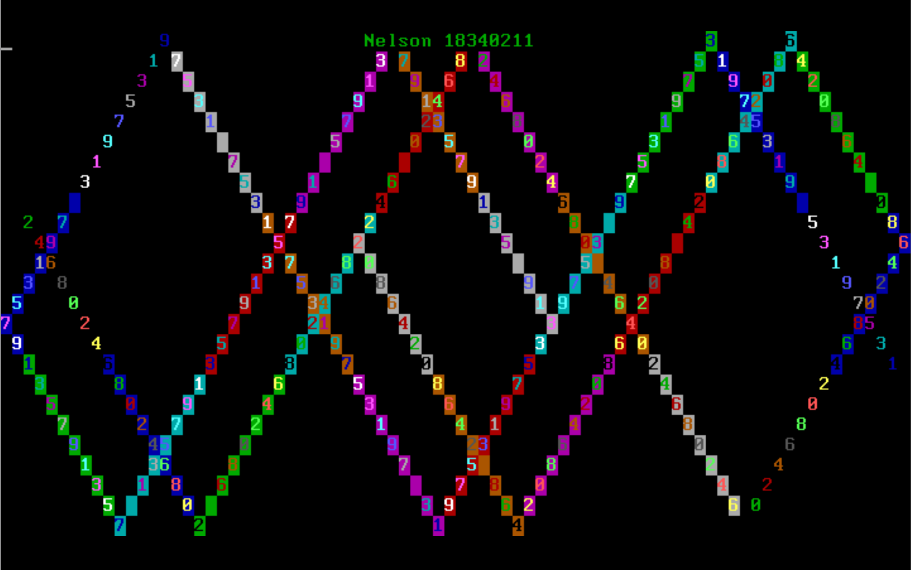

# 实验任务

本次实验包括4个assignment，请大家仔细阅读README.md文件后完成实验。

实验的DDL是 2024.03.22 23:59

## 提交内容

将**4个assignment的代码**和**实验报告**放到**压缩包**中，命名为“**学号\_姓名\_lab2**”，并交到[课程网站](http://course.dds-sysu.tech/course/14/homework)上。

## Assignment 1 MBR

> 注意，assignment 1的寄存器请使用16位的寄存器。

###  1.1

复现example 1。说说你是怎么做的，并将结果截图。

### 1.2

请修改example 1的代码，使得MBR被加载到0x7C00后在(12,12)(12,12)处开始输出你的学号。注意，你的学号显示的前景色和背景色必须和教程中不同。说说你是怎么做的，并将结果截图。

## Assignment 2 实模式中断

参考资料如下。

- [OSDev 关于 BIOS 的介绍](https://wiki.osdev.org/BIOS)
- [BIOS 中断表](http://www.ctyme.com/rbrown.htm)
- [VIDEO - WRITE CHARACTER ONLY AT CURSOR POSITION](http://www.ctyme.com/intr/rb-0100.htm)
- [VIDEO - WRITE CHARACTER AND ATTRIBUTE AT CURSOR POSITION](http://www.ctyme.com/intr/rb-0099.htm)
- [VIDEO - WRITE STRING (AT and later,EGA)](http://www.ctyme.com/intr/rb-0210.htm)
- [VIDEO - GET CURSOR POSITION AND SIZE](http://www.ctyme.com/intr/rb-0088.htm)
- [10h中断](https://zh.wikipedia.org/wiki/INT_10H)

2.1和2.2使用的都是实模式中断`int 10h`，由于功能号不同，执行的结果也就不同。在`int 10h`中断的资料 [https://zh.wikipedia.org/wiki/INT_10H](https://zh.wikipedia.org/wiki/INT_10H) 中，其只给出10h中断下各个功能号的用途，并未给出实际的用法。因此，同学们可能一开始会感觉不知所云，教程下面给出同学们完成本次实验需要用到的功能号。

| 功能                       | 功能号 | 参数                                         | 返回值                                           |
| -------------------------- | ------ | -------------------------------------------- | ------------------------------------------------ |
| 设置光标位置               | AH=02H | BH=页码，DH=行，DL=列                        | 无                                               |
| 获取光标位置和形状         | AH=03H | BX=页码                                      | AX=0，CH=行扫描开始，CL=行扫描结束，DH=行，DL=列 |
| 在当前光标位置写字符和属性 | AH=09H | AL=字符，BH=页码，BL=颜色，CX=输出字符的个数 | 无                                               |

注意，“页码”均设置为0。

一般地，中断的调用方式如下。

```
将参数和功能号写入寄存器
int 中断号
从寄存器中取出返回值
```

### 2.1

请探索实模式下的光标中断，**利用中断实现光标的位置获取和光标的移动**。说说你是怎么做的，并将结果截图。

### 2.2

请修改1.2的代码，**使用实模式下的中断来输出你的学号**。说说你是怎么做的，并将结果截图。

### 2.3

在2.1和2.2的知识的基础上，探索实模式的键盘中断，**利用键盘中断实现键盘输入并回显**，可以参考[https://blog.csdn.net/deniece1/article/details/103447413](https://gitee.com/link?target=https%3A%2F%2Fblog.csdn.net%2Fdeniece1%2Farticle%2Fdetails%2F103447413)。关于键盘扫描码，可以参考[http://blog.sina.com.cn/s/blog_1511e79950102x2b0.html](https://gitee.com/link?target=http%3A%2F%2Fblog.sina.com.cn%2Fs%2Fblog_1511e79950102x2b0.html)。说说你是怎么做的，并将结果截图。

## Assignment 3 汇编

> - assignment 3的寄存器请使用32位的寄存器。
> - 首先执行命令`sudo apt install gcc-multilib g++-multilib`安装相应环境。
> - 你需要实现的代码文件在`assignment/student.asm`中。
> - 编写好代码之后，在目录`assignment`下使用命令`make run`即可测试，不需要放到mbr中使用qemu启动。
> - `a1`、`if_flag`、`my_random`等都是预先定义好的变量和函数，直接使用即可。
> - 你可以修改`test.cpp`中的`student_setting`中的语句来得到你想要的`a1,a2`。
> - 最后附上`make run`的截图，并说说你是怎么做的。

### 3.1 分支逻辑的实现

请将下列伪代码转换成汇编代码，并放置在标号`your_if`之后。

```
if a1 < 12 then
	if_flag = a1 / 2 + 1
else if a1 < 24 then
	if_flag = (24 - a1) * a1
else
	if_flag = a1 << 4
end
```

### 3.2 循环逻辑的实现

请将下列伪代码转换成汇编代码，并放置在标号`your_while`之后。

```
while a2 >= 12 then
	call my_random        // my_random将产生一个随机数放到eax中返回
	while_flag[a2 - 12] = eax
	--a2
end
```

### 3.3 函数的实现

请编写函数`your_function`并调用之，函数的内容是遍历字符数组`string`。

```
your_function:
	for i = 0; string[i] != '\0'; ++i then
		pushad
		push string[i] to stack
		call print_a_char
		pop stack
		popad
	end
	return
end
```

## Assignment 4 汇编小程序

字符弹射程序。请编写一个字符弹射程序，其从点(2,0)(2,0)处开始向右下角45度开始射出，遇到边界反弹，反弹后按45度角射出，方向视反弹位置而定。同时，你可以加入一些其他效果，如变色，双向射出等。注意，你的程序应该不超过510字节，否则无法放入MBR中被加载执行。静态示例效果如下，动态效果见视频`assignment/assignment-4-example.mp4`。(**Tips：18级的学长学姐都做过这个实验**。)



# 实验概述

在第一章中，同学们会学习到x86汇编、计算机的启动过程、IA-32处理器架构和字符显存原理。根据所学的知识，同学们能自己编写程序，然后让计算机在启动后加载运行，以此增进同学们对计算机启动过程的理解，为后面编写操作系统加载程序奠定基础。同时，同学们将学习如何使用gdb来调试程序的基本方法。

# 参考资料

- [x86汇编(Intel汇编)入门](https://www.cnblogs.com/jiftle/p/8453106.html)
- 《Intel汇编语言程序设计》第1-8章
- 《从实模式到保护模式》第1-8章

希望使用 UEFI 结合 C++ 或 Rust 进行操作系统开发的同学，请参考[UEFI 的相关指引](./uefi.md)。下面的指引是基于 MBR 引导、汇编结合 C++ 进行开发的。