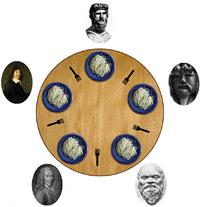

# 并发与锁机制

# 实验概述

在本次实验中，我们首先使用硬件支持的原子指令来实现自旋锁SpinLock，自旋锁将成为实现线程互斥的有力工具。接着，我们使用SpinLock来实现信号量，最后我们使用SpinLock和信号量来给出两个实现线程互斥的解决方案。

# 实验要求

> - DDL：待定
> - 提交的内容：将**3个assignment的代码**和**实验报告**放到**压缩包**中，命名为“**学号\_姓名\_lab4**”，并交到课程网站上[http://course.dds-sysu.tech/course/14/homework]
> - **材料的代码放置在`src`目录下**。

1. 实验不限语言， C/C++/Rust都可以。
2. 实验不限平台， Windows、Linux和MacOS等都可以。
3. 实验不限CPU， ARM/Intel/Risc-V都可以。

## Assignment 1 代码复现题

### 1.1 代码复现

在本章中，我们已经实现了自旋锁和信号量机制。现在，同学们需要复现教程中的自旋锁和信号量的实现方法，并用分别使用二者解决一个同步互斥问题，如消失的芝士汉堡问题。最后，将结果截图并说说你是怎么做的。

### 1.2 锁机制的实现

我们使用了原子指令`xchg`来实现自旋锁。但是，这种方法并不是唯一的。例如，x86指令中提供了另外一个原子指令`bts`和`lock`前缀等，这些指令也可以用来实现锁机制。现在，同学们需要结合自己所学的知识，实现一个与本教程的实现方式不完全相同的锁机制。最后，测试你实现的锁机制，将结果截图并说说你是怎么做的。

## Assignment 2 生产者-消费者问题

### 2.1 Race Condition

同学们可以任取一个生产者-消费者问题，然后在本教程的代码环境下创建多个线程来模拟这个问题。在2.1中，我们不会使用任何同步互斥的工具。因此，这些线程可能会产生冲突，进而无法产生我们预期的结果。此时，同学们需要将这个产生错误的场景呈现出来。最后，将结果截图并说说你是怎么做的。

### 2.2 信号量解决方法

使用信号量解决上述你提出的生产者-消费者问题。最后，将结果截图并说说你是怎么做的。

## Assignment 3 哲学家就餐问题

假设有 5 个哲学家，他们的生活只是思考和吃饭。这些哲学家共用一个圆桌，每位都有一把椅子。在桌子中央有一碗米饭，在桌子上放着 5 根筷子。

当一位哲学家思考时，他与其他同事不交流。时而，他会感到饥饿，并试图拿起与他相近的两根筷子（筷子在他和他的左或右邻居之间）。一个哲学家一次只能拿起一根筷子。显然，他不能从其他哲学家手里拿走筷子。当一个饥饿的哲学家同时拥有两根筷子时，他就能吃。在吃完后，他会放下两根筷子，并开始思考。

### 3.1 初步解决方法

同学们需要在本教程的代码环境下，创建多个线程来模拟哲学家就餐的场景。然后，同学们需要结合信号量来实现理论课教材中给出的关于哲学家就餐问题的方法。最后，将结果截图并说说你是怎么做的。

### 3.2 死锁解决方法

虽然3.1的解决方案保证两个邻居不能同时进食，但是它可能导致死锁。现在，同学们需要想办法将死锁的场景演示出来。然后，提出一种解决死锁的方法并实现之。最后，将结果截图并说说你是怎么做的。

# 
