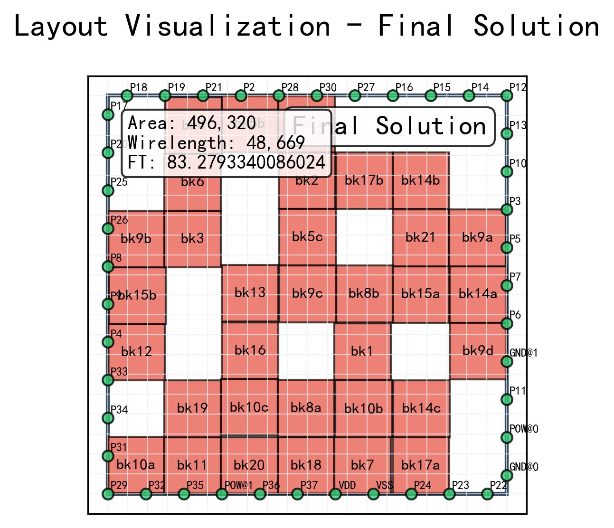

# PyFloorplan - VLSI布图规划优化框架

<div align="center">



**一个专业的VLSI布图规划优化框架，支持两阶段协同优化**

[](https://www.python.org/downloads/)
[](LICENSE)
[](setup.py)

[快速开始](#快速开始) • [配置说明](#配置说明) • [数据集](#数据集) • [结果分析](#结果分析)

</div>

## 🚀 项目简介

PyFloorplan 是一个VLSI布图规划优化框架，实现了**两阶段协同优化**策略：
1. **第一阶段**: 宏模块布局优化
2. **第二阶段**: I/O引脚智能布置

### ✨ 核心特性

- **两阶段优化**: 宏模块布局 + Pin布置协同优化
- **多种算法**: 模拟退火、遗传算法
- **序列对表示**: 经典的拓扑表示方法
- **Pin布置算法**: 均匀分布、重心法、贪心算法
- **严格合法性检查**: 重叠检测、边界约束
- **实时可视化**: 优化过程可视化
- **标准数据集**: 支持GSRC、MCNC基准测试

## 🛠 安装

### 环境要求
- Python 3.8+
- NumPy >= 1.21.0
- Matplotlib >= 3.5.0
- PyYAML >= 6.0

### 安装步骤
```bash
# 克隆仓库
git clone <repository-url>
cd Floorplan

# 安装依赖
pip install -r requirements.txt

# 或安装基础依赖
pip install -r requirements_basic.txt
```

## 🚀 快速开始

### 1. 命令行使用

```bash
# 运行GSRC n10数据集，模拟退火算法
python main.py config/gsrc_n10_hard_sa_sp.yaml

# 运行MCNC ami33数据集，遗传算法  
python main.py config/mcnc_ami33_hard_ga_sp.yaml
```

### 2. 编程接口

```python
from src.algorithms import SimulatedAnnealing, SequencePair
from src.data.parsers import GSRCParser

# 加载数据
parser = GSRCParser()
design = parser.parse_design("data/benchmarks/GSRC/HARD", "n10")

# 创建算法
representation = SequencePair()
algorithm = SimulatedAnnealing(
    representation=representation,
    max_iterations=1000,
    initial_temperature=1000.0
)

# 执行优化
result = algorithm.optimize(design)
print(f"最优成本: {result.best_cost}")
```

## 📁 项目结构

```
Floorplan/
├── src/                          # 核心源码
│   ├── algorithms/               # 优化算法
│   │   ├── simulated_annealing.py # 模拟退火
│   │   ├── genetic.py            # 遗传算法
│   │   ├── sequence_pair.py      # 序列对表示
│   │   └── pin_assignment/       # Pin布置算法
│   ├── data/                     # 数据处理
│   │   ├── structures.py         # 数据结构
│   │   ├── parsers.py           # 文件解析器
│   │   └── loaders.py           # 数据加载器
│   ├── evaluation/               # 评估系统
│   │   ├── evaluator.py         # 评估器
│   │   ├── metrics.py           # 指标计算
│   │   └── legality.py          # 合法性检查
│   └── visualization/            # 可视化模块
├── data/                         # 📍 基准测试数据集
│   └── benchmarks/
│       ├── GSRC/                # GSRC数据集
│       │   ├── HARD/            # GSRC硬模块数据
│       │   └── SOFT/            # GSRC软模块数据
│       └── MCNC/                # MCNC数据集
│           ├── HARD/            # MCNC硬模块数据
│           └── SOFT/            # MCNC软模块数据
├── config/                       # 配置文件
│   ├── gsrc_n10_hard_sa_sp.yaml
│   ├── mcnc_ami33_hard_sa_sp.yaml
│   └── complete_parameters_example.yaml
├── results/                      # 结果输出目录
├── main.py                       # 主程序入口
└── requirements.txt              # 依赖文件
```

## 📊 数据集

### 数据集位置
数据集存放在 `data/benchmarks/` 目录下：

```
data/benchmarks/
├── GSRC/
│   ├── HARD/          # GSRC硬模块数据
│   │   ├── n10.blocks, n10.nets, n10.pl
│   │   ├── n30.blocks, n30.nets, n30.pl  
│   │   ├── n50.blocks, n50.nets, n50.pl
│   │   ├── n100.blocks, n100.nets, n100.pl
│   │   └── n200.blocks, n200.nets, n200.pl
│   └── SOFT/          # GSRC软模块数据
└── MCNC/
    ├── HARD/          # MCNC硬模块数据
    │   ├── ami33.blocks, ami33.nets, ami33.pl
    │   ├── ami49.blocks, ami49.nets, ami49.pl
    │   └── ...
    └── SOFT/          # MCNC软模块数据
```

### 支持的数据集

**GSRC数据集**:
- `n10`: 10个模块，83条网线
- `n30`: 30个模块，201条网线  
- `n50`: 50个模块，309条网线
- `n100`: 100个模块，885条网线
- `n200`: 200个模块，1585条网线

**MCNC数据集**:
- `ami33`: 33个模块，123条网线
- `ami49`: 49个模块，408条网线

### 运行基准测试
```bash
# 快速测试小规模问题
python main.py config/gsrc_n10_hard_sa_sp.yaml

# 中等规模测试
python main.py config/gsrc_n30_hard_sa_sp.yaml

# 大规模测试
python main.py config/gsrc_n100_hard_sa_sp.yaml
```

## 🔧 配置说明

### 基本配置
```yaml
# 数据配置
data:
  benchmark: "gsrc"          # gsrc | mcnc
  dataset: "n10"             # 数据集名称
  module_type: "hard"        # hard | soft

# 算法配置
algorithm:
  name: "simulated_annealing"  # simulated_annealing | genetic_algorithm
  representation: "sequence_pair"
  max_iterations: 1000

# 模拟退火参数
simulated_annealing:
  initial_temperature: 1000.0
  final_temperature: 1.0
  cooling_rate: 0.95
  moves_per_temperature: 50

# Pin布置配置
pin_assignment:
  algorithm: "center_of_gravity"  # uniform_edge | center_of_gravity | greedy
  expansion_ratio: 1.2

# 评估权重
evaluation:
  weights:
    area_weight: 0.5
    wirelength_weight: 0.5
    feedthrough_weight: 10.0
  feedthrough_method: "original"  # original | ftafp

# 输出配置
output:
  visualization:
    enabled: true
    draw_frequency: 200
    image_format: "png"
  verbose: true
```

### 可用算法组合

| 算法 | 表示方法 | 配置文件示例 |
|------|----------|--------------|
| 模拟退火 | 序列对 | `gsrc_n10_hard_sa_sp.yaml` |
| 遗传算法 | 序列对 | `mcnc_ami33_hard_ga_sp.yaml` |

### Pin布置算法

1. **uniform_edge**: 均匀边缘分布 (最快速)
2. **center_of_gravity**: 重心引力法 (平衡质量和速度)
3. **greedy**: 贪心算法 (质量最好但最慢)

## 📈 结果分析

### 输出文件结构

每次运行会在 `results/` 目录下生成：

```
results/dataset_benchmark_algorithm_timestamp/
├── evaluation.json              # 详细评估指标
├── final_result.pl             # 最终布局文件
└── visualization/              # 可视化图片
    ├── final_best_solution.png # 最终解
    └── layout_iter_xxxx.png   # 中间过程
```

### 评估指标

```json
{
  "design_info": {
    "chip_width": 240.0,
    "chip_height": 240.0,
    "total_modules": 10,
    "pin_count": 83
  },
  "quality_metrics": {
    "total_cost": 1234.56,
    "wirelength": 2980.45,
    "feedthrough_count": 15,
    "area": 57600.0,
    "utilization": 0.85
  },
  "algorithm_info": {
    "name": "Simulated Annealing",
    "iterations": 1000,
    "runtime": 45.67,
    "acceptance_rate": 0.23
  }
}
```

## 🎯 算法说明

### 两阶段优化流程

1. **阶段一: 宏模块扰动**
   - 对当前宏模块布局进行扰动操作
   - 使用序列对表示进行邻域搜索

2. **阶段二: Pin重新布置**  
   - 根据新的宏模块布局重新计算芯片边界
   - 使用Pin布置算法将所有Pin放置在芯片边缘

3. **合法性检查**
   - 检查模块重叠
   - 验证边界约束

4. **质量评估**
   - 计算面积、线长、Feedthrough等指标
   - 根据权重计算总代价

### 关键约束

- **Pin约束**: Pin只能放置在芯片边缘的整数坐标
- **合法性**: 宏模块不能重叠，必须在芯片边界内
- **两阶段协同**: Pin布置完全依赖宏模块布局结果

## 🐛 常见问题

**Q: 程序运行缓慢**
```yaml
# 减少迭代次数或关闭可视化
algorithm:
  max_iterations: 500
output:
  visualization:
    enabled: false
```

**Q: 内存使用过多**
```yaml
# 对于大规模问题，降低可视化频率
output:
  visualization:
    draw_frequency: 500
```

**Q: 找不到数据文件**
```bash
# 确保数据集在正确位置
ls data/benchmarks/GSRC/HARD/n10.blocks
ls data/benchmarks/MCNC/HARD/ami33.blocks
```

## 🤝 贡献

### 开发环境
```bash
# 安装开发依赖
pip install -e .

# 运行测试
python -m pytest tests/ -v
```

### 贡献流程
1. Fork本仓库
2. 创建功能分支 (`git checkout -b feature/NewFeature`)
3. 提交更改 (`git commit -m 'Add NewFeature'`)
4. 推送分支 (`git push origin feature/NewFeature`)
5. 创建Pull Request

## 📄 许可证

本项目采用 MIT 许可证 - 详见 [LICENSE](LICENSE) 文件。

## 🙏 致谢

- 感谢GSRC和MCNC提供标准基准测试数据集
- 感谢开源社区的贡献和支持

---

<div align="center">

**如果这个项目对您有帮助，请给个⭐Star⭐支持！**

</div>
