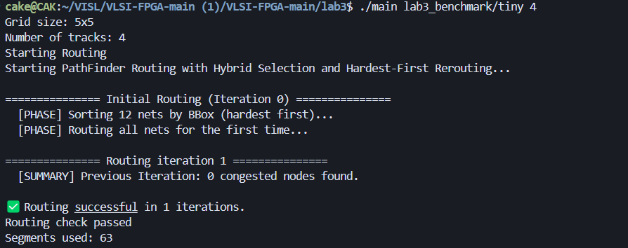
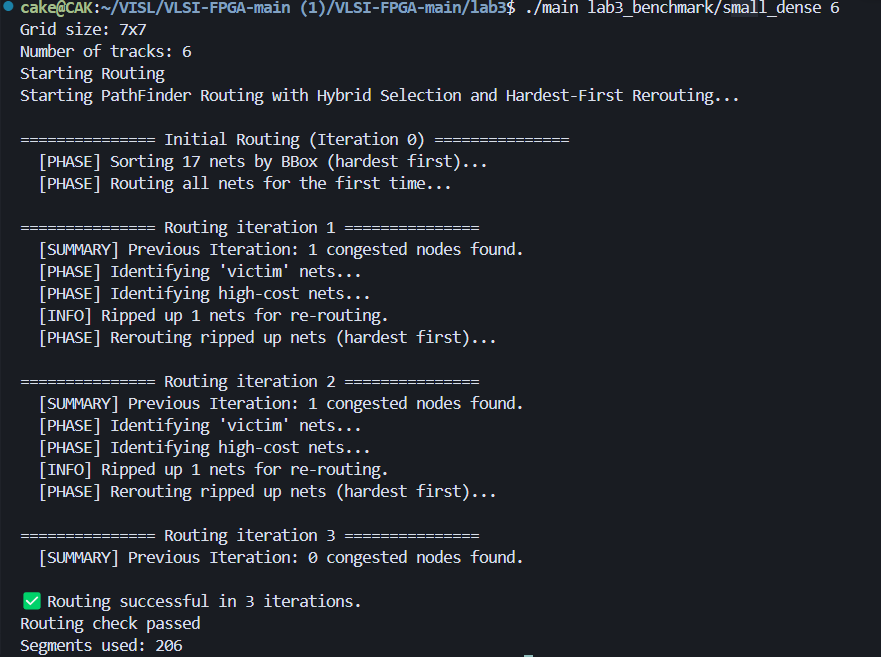
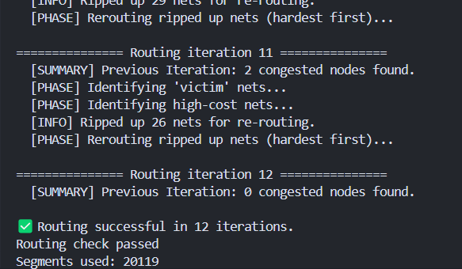

# 布线算法

学号：22320021   姓名：陈安康

本次布线任务，我基于PathFinder算法的基础上进行改进，实现了一个基于协商的拥塞驱动布线算法。

## PathFinder算法

PathFinder算法是一种主流的布线算法，其核心思想是允许冲突，并不强求所有路径都合法。它允许线网先选择各自成本最低（最短）的路径，哪怕这会导致多个线网占用同一个布线资源。然后，在所有线网都跑了一遍“最优”路径后，算法会检查哪些布线超过了宽度，这些被定义为拥塞点。算法会对拥塞的节点进行“惩罚”—— 提高它的通行成本 。一个资源被越多的线网共享，它的成本就变得越高。这个成本具有“记忆效应”，会累积下去，这就是历史成本 (History Cost) 。然后，算法进入下一轮迭代。它会把那些造成拥塞的线网（或者与拥塞相关的线网）的路径拆除 (Rip-up) 。当这些线网需要重新布线 (Reroute) 时，它们会发现之前拥塞的节点“变贵了”，A*寻路算法就会自动倾向于寻找其他更便宜的、未拥塞的替代路径。

这个 “布线 → 识别拥塞 → 增加成本 → 拆除 → 重布线” 的循环会不断重复。每一轮迭代，线网都在根据不断变化的成本地图进行“协商”，最终，拥塞会像潮水一样从最拥挤的地方逐渐退去，扩散到整个布线网络中，直到所有冲突都解决，每个布线资源最多只被一个线网占用。

## 改进部分

在这个流程框架的基础上，我进一步进行改进。主要有以下几点：

在初始布线时，我采用“困难优先”的布局策略，按照线网包围盒（包围盒 (Bounding Box) 就是能够 刚好包住这个线网所有引脚的、最小的矩形 。）面积大小进行降序排序，这样可以保证我们可以优先布局那些引脚分布范围广、理论上最难布的线网，这给了“老大难”线网优先选择路径的权利，防止它们在最后被简单线网堵死。

对于局部拆线步骤，我引入启发式策略，我不会简单的将所有在此资源拥塞的线全部拆除。拆线时，我按照“恶霸 vs. 受害者” (Bully vs. Victim) 策略来选择需要拆除的线。“恶霸 vs. 受害者” (Bully vs. Victim) 策略总结下来就是“挑软柿子捏”，与其去动那些难以解决的“恶霸”，去解决那些弱小的“受害者”似乎是更为明智的选择。具体到实现中，算法会比较所有经过此点的线网。它会选择包围盒面积**最小**的那个线网作为“受害者”(victim)进行拆除，而保留那些包围盒大的“恶霸”(bully)线网。其逻辑是，大线网（通常是长线网）更难找到替代路径，而小线网（短线网）更加灵活，更容易重布线。

除此之外，我还会拆除强制拆除总路径成本排在前 `5%` 的线网。这个的目的是为了跳出局部最优，有些线网可能路径很长、很绕（因此成本很高），但它可能恰好没有踩在拥塞点上。强制重布这些高成本路径，给了算法一个寻找更优、更短路径的机会。

在局部拆线后重布线时，我会按照“困难优先”策略，先布线包围盒最大的线网。

## 实验结果

以下是运行结果，其中由于大规模布线问题完成一次需要耗费很长时间（huge运行了真正的整整两天！！！），所以我的布线通道宽度是优先确保可以布线出来，防止实验白做。由于代码有迭代，所以之前的代码测试并不全面。只测了一些比较大的数据集。

版本1：普通基版本（A* + 局部拆线）。

| 数据集      | 布线通道宽度（不一定为最小） | routing segments |
| ----------- | ---------------------------- | ---------------- |
| med_dense   | 25                           | 2687             |
| large_dense | 40                           | 11386            |
| xl          | 40                           | 20113            |

版本2：仅恶霸vs受害者+局部布线顺序采用随机打乱。

| 数据集      | 布线通道宽度（不一定为最小） | routing segments               |
| ----------- | ---------------------------- | ------------------------------ |
| med_dense   | 25                           | 2686                           |
| large_dense | 40                           | 未完成，差一个拥塞点总是布不上 |

版本3：恶霸vs受害者 + 局部布线顺序采用“困难优先” + 拆除额外阻塞

| 数据集      | 布线通道宽度（不一定为最小） | col3  |
| ----------- | ---------------------------- | ----- |
| tiny        | 4                            | 63    |
| small_dense | 6                            | 203   |
| med_sparse  | 6                            | 964   |
| med_dense   | 25                           | 2680  |
| lg_sparse   | 25                           | 3861  |
| large_dense | 40                           | 11349 |
| xl          | 40                           | 20119 |
| huge        | 50                           | 45104 |

从上面结果可以看出，版本2由于在重布线时拆掉的线过少（版本1将阻塞点的线网全部拆除，而版本2只拆除包围盒最小的线网）。导致可重新布线的范围有限，在增加了拆除额外阻塞的线网后（版本3），可操作的资源变多，解决了这个问题。对比版本3和版本1，两者最终的效果差不多。版本3略优于版本1。

运行结果截图如下：

## 未来的改进方向

其实在我的设想里面，我还要添加一个停滞检测机制（这里我的想法是保留历史最低的阻塞点数目，每一轮迭代后对这个变量进行更新，若该变量多次迭代没有更新，则意味着目前算法没有收敛趋势，而是在“震荡”，则被判定为“停滞”），当拥塞点的数量一直在“振荡”时，会被判定为停滞，此时意味着整个布局本身已经陷入了无解的状态，从而触发全局拆线。而在全局拆线后进行重新布线时，我会使用相比于“困难优先”更加智能的策略，即从前一轮迭代中吸取教训，按照线网经过的拥塞点的数量进行排序，这样就可以优先布线在前一轮迭代中拥塞最严重的线网，从而提高布线成功几率。
可是由于测试耗费时间太长（在我的想法里，是一步步进行改进的，并且每一步改进后我会测试检查改进策略是否有效），导致上面的代码没有机会进行实现和测试，并且上面的停滞检测在我看来是有问题的，因为在“震荡”状态下，阻塞数目最低点有可能会被不停地动态刷新，即目前想到的方法对于停滞状态的描述还是不够“智能”。

在查找资料后，我发现强化学习会是一个不错的选择。可以把阻塞点数目看做是一种奖励，而当前的布线图即为状态，智能体依据奖励反馈，可以从动作集{全局布线，局部拆线，完成布线}中进行选择。布线图可以用图神经网络（GNN）进行解析，帮助智能体理解复杂的布线图。这种结合可以更加智能高效地完成布线任务，是我能想到的“终极组合”。
