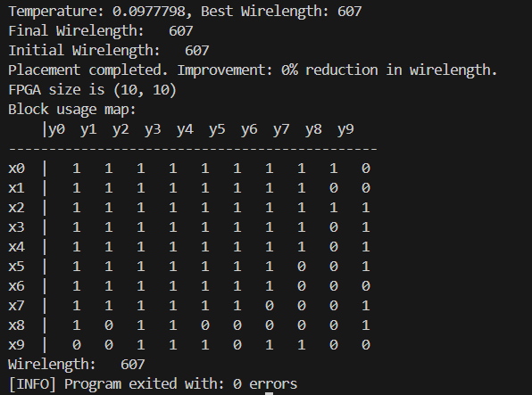
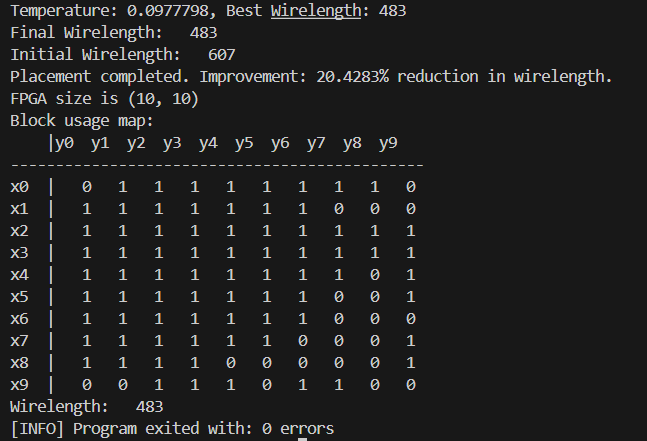
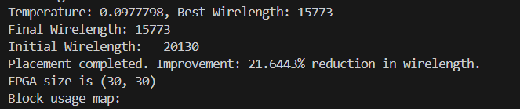
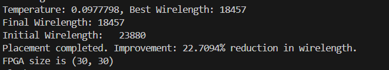
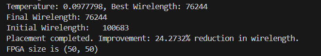
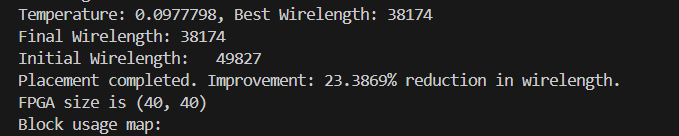

# 实验二：布局算法

学号：22320021    姓名：陈安康

## instance与block类联动的补充：

在FPGA类将instance添加block时，同步更新instance中的位置信息，同时为block类添加删除函数，可以删除block中的instance。此时类中的instance并没有什么手段来标记其已经被删除，所以这个删除函数一般配合着插入函数用，将instance删除后立即将其插入另一个block中，以避免instance更新不及时带来的问题。

在实际设计中，这样会报出假的警告，因为加载固定模块时使用FPGA类的添加函数，固定的instance类不允许修改位置。但这并不影响程序运行。

## 算法实现

算法实现上，我采用模拟退火算法，并且参考Timberwolf算法的实现方法。在初始化时使用贪心策略，首先放置起始模块（固定模块），然后选择与当前已放置模块连接最多的未放置模块，并选择使线网长度最小的位置进行放置，以生成较为优秀的初始解。

主体算法为模拟退火算法。有差异的部分是当拒绝新解时，回退到当前的最优解，而不是上一个解。这样的改变主要是因为传统的模拟退火是随机的，导致花费大量时间搜索无用的解，并且越走越远。以下是拒绝新解后恢复到上一个解的方案的运行结果：

可以看到初始解就是最终的解，说明搜索阶段完全没有搜索到任何有意义的信息。这是因为解的数目太多，受限于硬件设备限制没有资源去遍历绝大部分解，如果接受一个更差的解，那么只会在更差的解附近去搜索，难以收敛（我认为这也是我上次实验失败的主要原因）。

“回退到最优解”的策略，这种策略有效是基于一个假设，即较优的解分布的位置附近有更优解的几率更大。这个更优是指全局更优的解，并且这个“附近”是相对差解分布的位置来说的。就像高原和平原一样，高原直接挨着洼地的几率还是太小了，而平原挨着洼地的几率相比于高原来说更大一些。对于布局算法问题，大部分更优解的形成是从前面优解的基础上更进一步得到的，而不是从差解直接跳转的。因此适用于上面的假设。

基于这个假设，我在模拟退火的思想的基础上进行了如上修改。首先，回退到最优解的策略保证了我们处于更优解的附近（基于前面的假设），其次，模拟退火允许我们在一定程度上接受较差的解，可以跨过“小峰”进行搜索。所以这种搜索算法会更加高效，更容易搜索到更优解。相比于一味接受新解的纯贪心策略，其避免了陷入局部解无法跳脱的窘境，同时可以剪枝模拟退火的许多无意义的搜索，算是两者的结合。

下面是采用回退到最优解的策略 + 模拟退火融合执行的结果：

可以看到在结果上相比于传统模拟退火性能高不少，适合硬件性能受限无法完全搜索或搜索大部分解的的情况下。

## 约束处理

实验中的block类实现会自动处理block存放instance数目。我在初始创建一个表记录可移动的模块，这样就保证所有操作只针对可移动的模块了。

## 结果展示

展示结果如下表：

| dataset   | Wirelength |
| --------- | ---------- |
| small.txt | 483        |
| med1.txt  | 4391       |
| med2.txt  | 4890       |
| lg1.txt   | 15773      |
| lg2.txt   | 18457      |
| xl.txt    | 38174      |
| huge.txt  | 76244      |

部分结果截图如下：

lg1.txt:

lg2.txt：

huge.txt:

xl.txt:

## 算法优缺点分析

目前算法的一个优点是收敛速度快，适合小型任务的搜索。缺点同贪心策略相同，相比于传统模拟退火来说，其跳出局部最优解的能力减弱。并且由于使用贪心策略进行初始化，并且最开始的贪心初始场景是基于固定模块来做的，导致对于同一个任务来说，初始化的状态是一样的。我也尝试过第一个放置模块随机化，但是实验结果发现其效果远不如一开始放置时就采用贪心策略好，故维持原本的做法。

目前回退策略还是太绝对，下一步感觉可以将回退策略修改成“随机回退到前k个的最优解中的某一个解中”。这样不仅保留了算法的特点，也扩大了算法跳出局部解的能力。
