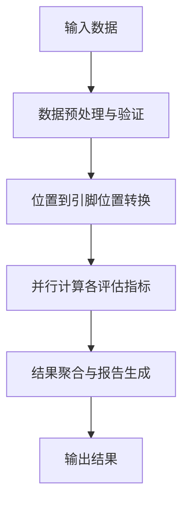

# DREAMPlace 布图质量评估算法技术文档

## 文档概述

本文档集详细描述了DREAMPlace布图质量评估算法的完整技术规范，包括输入数据格式、算法实现、输出规范和使用指南。

## 文档结构

### 1. [算法概述](placement_evaluation_overview.md)
- 算法简介和特点
- 支持的模块类型（硬模块、软模块等）
- 坐标系统说明
- 主要评估指标介绍

### 2. [输入数据规范](input_data_specification.md)
- 数据组织结构详解
- 位置数据格式 (pos)
- 几何信息输入 (节点尺寸、引脚偏移)
- 连接性信息 (网线-引脚映射)
- 布局区域信息 (芯片边界、密度网格)
- 器件约束信息 (行列约束、围栏区域)

### 3. [评估算法详解](evaluation_algorithms.md)
- 评估流程总体架构
- 核心算法模块实现：
  - 引脚位置计算模块 (PinPos)
  - 线长评估模块 (HPWL)
  - 密度评估模块 (DensityOverflow)
  - Feedthrough评估模块
  - 空白面积评估模块
  - 路由拥塞评估模块 (Rudy)
- 评估指标聚合
- 性能优化策略

### 4. [输出数据规范](output_specification.md)
- 输出数据类型和格式
- 实时评估输出
- 文件输出格式 (JSON、CSV、TXT)
- 可视化输出
- 输出数据的使用场景

## 核心技术要点

### 坐标系统
- **节点坐标**: (x,y) 表示节点的**左下角坐标**
- **坐标原点**: 芯片左下角为 (0,0)
- **引脚坐标**: pin_pos = node_pos + pin_offset

### 数据组织
- **扁平化存储**: 所有数据使用一维张量存储，提高GPU访问效率
- **节点索引**: [可移动节点, 固定节点, 填充节点] 按顺序组织
- **连接映射**: 使用CSR格式存储网线-引脚映射关系

### 评估指标

#### 线长 (Wirelength)
- **HPWL**: 半周长线长，计算每个网线边界框的周长
- **公式**: `HPWL = Σ(weight[i] * ((max_x[i] - min_x[i]) + (max_y[i] - min_y[i])))`

#### 密度 (Density)
- **密度溢出**: 超过目标密度的区域面积总和
- **最大密度**: 最拥挤区域相对于目标密度的比值

#### Feedthrough
- **定义**: 网线穿越不相关模块的数量
- **计算**: 检查网线边界框与模块边界框的相交情况

#### 空白面积 (Whitespace)
- **计算**: 总芯片面积 - 模块占用面积
- **利用率**: 模块面积 / 总芯片面积

#### 路由拥塞 (Routing Congestion)
- **Rudy模型**: 基于Rent's Rule估算每个网格的布线需求
- **利用率**: 布线需求 / 布线容量

## 算法流程



## 性能特点

### 高效性
- **GPU加速**: 全面支持CUDA并行计算
- **内存优化**: 扁平化数据结构，减少内存访问开销
- **算法优化**: 确定性算法，支持批量并行处理

### 准确性
- **多指标融合**: 综合考虑线长、密度、拥塞等多个质量因子
- **梯度可导**: 支持基于梯度的优化算法
- **数值稳定**: 处理各种边界情况和数值精度问题

### 可扩展性
- **模块化设计**: 支持自定义评估指标扩展
- **多格式兼容**: 支持Bookshelf、DEF/LEF等标准EDA格式
- **参数可配置**: 灵活的权重和参数调整机制

## 使用示例

### 基本用法
```python
# 1. 构建评估器
evaluator = PlacementEvaluator(placedb)

# 2. 执行评估
metrics = evaluator.evaluate(pos)
print(f"HPWL: {metrics.hpwl}, Overflow: {metrics.overflow}")

# 3. 计算目标函数
objective = evaluator.compute_objective(pos, weights)
```

### 优化循环中的使用
```python
for iteration in range(max_iterations):
    # 优化步骤
    pos = optimizer.step(pos)
    
    # 评估质量
    if iteration % eval_interval == 0:
        metrics = evaluator.evaluate(pos)
        print(f"Iter {iteration}: {metrics}")
        
        # 检查收敛
        if evaluator.check_convergence():
            break
```

## 输入文件格式支持

### Bookshelf格式
- `.nodes`: 节点信息（尺寸、类型）
- `.nets`: 网线连接信息
- `.pl`: 节点位置信息
- `.scl`: 芯片行列信息
- `.wts`: 网线权重信息（可选）

### DEF/LEF格式
- `DEF`: 设计交换格式，包含组件位置和网线信息
- `LEF`: 库交换格式，包含单元和工艺信息

### JSON配置
- 算法参数配置
- 评估权重设置
- 输出格式选项

## 输出格式支持

### 实时输出
- 控制台文本输出
- TensorBoard可视化
- 实时指标监控

### 文件输出
- **JSON**: 结构化评估报告
- **CSV**: 历史数据和趋势分析
- **TXT**: 详细的文本报告
- **图表**: 密度热力图、布局可视化等

## 质量基准

根据任务文档中的baseline数据：

| 数据集 | HPWL      | Feedthrough数量 |
|--------|-----------|----------------|
| n10    | 43,625    | 138            |
| n30    | 142,507   | 454            |
| n50    | 182,524   | 744            |
| n100   | 304,584   | 1,358          |
| n200   | 549,286   | 2,802          |
| ami33  | 93,674    | 152            |
| ami49  | 1,047,228 | 597            |

## 技术支持

### 依赖环境
- **Python**: 3.7+
- **PyTorch**: 1.8+
- **CUDA**: 10.2+ (可选，用于GPU加速)
- **其他**: NumPy, SciPy, Matplotlib

### 兼容性
- **操作系统**: Linux, Windows, macOS
- **硬件**: CPU/GPU混合计算支持
- **精度**: FP32/FP64双精度支持

这套技术文档为DREAMPlace布图质量评估算法提供了完整的实现规范和使用指南，适用于学术研究和工业应用。 