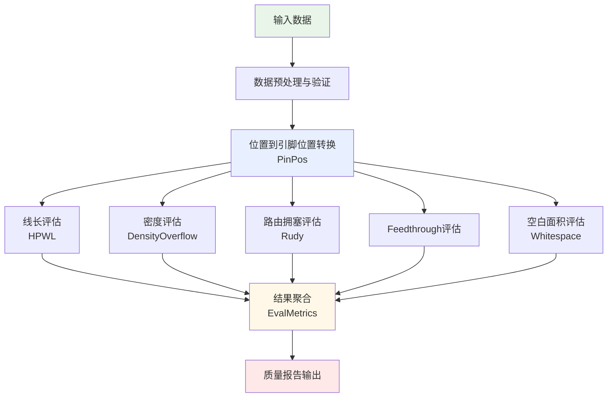

# 评估算法详细说明

## 1. 评估流程总体架构



## 2. 核心算法模块

### 2.1 引脚位置计算模块 (PinPos)

**功能**: 将节点位置转换为引脚的绝对位置坐标

**输入**:
```python
pos: torch.Tensor[2 * num_nodes]           # 节点位置（左下角坐标）
pin_offset_x: torch.Tensor[num_pins]       # 引脚x偏移
pin_offset_y: torch.Tensor[num_pins]       # 引脚y偏移  
pin2node_map: torch.Tensor[num_pins]       # 引脚到节点映射
```

**输出**:
```python
pin_pos: torch.Tensor[2 * num_pins]        # 引脚绝对位置
```

**算法实现**:
```python
def pin_pos_forward(pos, pin_offset_x, pin_offset_y, pin2node_map):
    num_nodes = pos.size(0) // 2
    node_x = pos[:num_nodes]                # 节点x坐标
    node_y = pos[num_nodes:]                # 节点y坐标
    
    # 计算引脚绝对位置
    pin_x = node_x[pin2node_map] + pin_offset_x
    pin_y = node_y[pin2node_map] + pin_offset_y
    
    return torch.cat([pin_x, pin_y])
```

### 2.2 线长评估模块 (HPWL)

**功能**: 计算所有网线的加权半周长线长总和

**输入**:
```python
pin_pos: torch.Tensor[2 * num_pins]        # 引脚位置
flat_net2pin_map: torch.Tensor[total_pins] # 网线-引脚映射
flat_net2pin_start_map: torch.Tensor[num_nets+1] # 网线起始索引
net_weights: torch.Tensor[num_nets]        # 网线权重
net_mask: torch.Tensor[num_nets]           # 网线掩码
```

**输出**:
```python
hpwl: torch.Tensor (标量)                  # 加权线长总和
```

**算法实现**:
```python
def hpwl_forward(pin_pos, flat_net2pin_map, flat_net2pin_start_map, 
                 net_weights, net_mask):
    num_pins = pin_pos.size(0) // 2
    pin_x = pin_pos[:num_pins]
    pin_y = pin_pos[num_pins:]
    
    total_hpwl = 0.0
    for net_id in range(len(flat_net2pin_start_map) - 1):
        if not net_mask[net_id]:
            continue
            
        # 获取网线的引脚
        start = flat_net2pin_start_map[net_id]
        end = flat_net2pin_start_map[net_id + 1]
        net_pins = flat_net2pin_map[start:end]
        
        # 计算边界框
        net_pin_x = pin_x[net_pins]
        net_pin_y = pin_y[net_pins]
        
        min_x, max_x = net_pin_x.min(), net_pin_x.max()
        min_y, max_y = net_pin_y.min(), net_pin_y.max()
        
        # 半周长线长
        net_hpwl = (max_x - min_x) + (max_y - min_y)
        total_hpwl += net_weights[net_id] * net_hpwl
    
    return total_hpwl
```

**优化算法**:
- **Net-by-net**: 逐个网线计算，精确但较慢
- **Atomic**: 使用原子操作并行计算，速度快但略有误差

### 2.3 密度评估模块 (DensityOverflow)

**功能**: 评估布局密度分布和密度违规

**输入**:
```python
pos: torch.Tensor[2 * num_nodes]           # 节点位置
node_size_x: torch.Tensor[num_nodes]       # 节点宽度
node_size_y: torch.Tensor[num_nodes]       # 节点高度
xl, yl, xh, yh: float                      # 芯片边界
num_bins_x, num_bins_y: int                # 密度网格数量
target_density: float                      # 目标密度
```

**输出**:
```python
(density_cost, max_density): (torch.Tensor, torch.Tensor)
# density_cost: 密度违规总代价
# max_density: 最大密度值（相对于目标密度）
```

**算法步骤**:

1. **构建密度图**:
```python
def build_density_map(pos, node_size_x, node_size_y, num_bins_x, num_bins_y):
    density_map = torch.zeros(num_bins_x, num_bins_y)
    bin_size_x = (xh - xl) / num_bins_x
    bin_size_y = (yh - yl) / num_bins_y
    
    for node_id in range(num_movable_nodes):
        node_xl = pos[node_id]
        node_yl = pos[num_nodes + node_id]
        node_xh = node_xl + node_size_x[node_id]
        node_yh = node_yl + node_size_y[node_id]
        
        # 双线性插值分布节点面积到网格
        contribute_area_to_bins(node_xl, node_yl, node_xh, node_yh, 
                               density_map, bin_size_x, bin_size_y)
    
    return density_map
```

2. **计算密度溢出**:
```python
def compute_density_overflow(density_map, target_density):
    bin_area = bin_size_x * bin_size_y
    target_area = target_density * bin_area
    
    # 计算超出目标密度的部分
    overflow = (density_map - target_area).clamp(min=0)
    density_cost = overflow.sum()
    max_density = density_map.max() / bin_area
    
    return density_cost, max_density
```

### 2.4 Feedthrough评估模块

**功能**: 计算穿越模块的网线数量

**输入**:
```python
pos: torch.Tensor[2 * num_nodes]           # 节点位置
node_size_x, node_size_y: torch.Tensor     # 节点尺寸
flat_net2pin_map: torch.Tensor             # 网线-引脚映射
pin2node_map: torch.Tensor                 # 引脚-节点映射
```

**输出**:
```python
feedthrough_count: torch.Tensor (标量)     # Feedthrough总数
```

**算法实现**:
```python
def compute_feedthrough(pos, node_size_x, node_size_y, nets_info):
    feedthrough_count = 0
    
    for net_id, net_pins in enumerate(nets_info):
        # 获取网线连接的节点
        connected_nodes = set(pin2node_map[pin] for pin in net_pins)
        
        # 计算网线的边界框
        net_pin_pos = get_net_pin_positions(net_pins, pos)
        net_bbox = compute_bounding_box(net_pin_pos)
        
        # 检查其他模块是否被穿越
        for node_id in range(num_nodes):
            if node_id in connected_nodes:
                continue  # 跳过连接的模块
                
            node_bbox = get_node_bounding_box(node_id, pos, node_size_x, node_size_y)
            
            # 检查是否穿越
            if bbox_intersects(net_bbox, node_bbox):
                feedthrough_count += 1
    
    return feedthrough_count

def bbox_intersects(bbox1, bbox2):
    """检查两个边界框是否相交"""
    return not (bbox1.xh <= bbox2.xl or bbox1.xl >= bbox2.xh or 
                bbox1.yh <= bbox2.yl or bbox1.yl >= bbox2.yh)
```

### 2.5 空白面积评估模块

**功能**: 计算芯片布局的空白面积和利用率

**输入**:
```python
pos: torch.Tensor[2 * num_nodes]           # 节点位置
node_size_x, node_size_y: torch.Tensor     # 节点尺寸
xl, yl, xh, yh: float                      # 芯片边界
```

**输出**:
```python
(whitespace, utilization): (torch.Tensor, torch.Tensor)
# whitespace: 空白面积
# utilization: 利用率
```

**算法实现**:
```python
def compute_whitespace(pos, node_size_x, node_size_y, xl, yl, xh, yh):
    # 计算总芯片面积
    total_chip_area = (xh - xl) * (yh - yl)
    
    # 计算可移动模块总面积
    movable_area = (node_size_x[:num_movable_nodes] * 
                   node_size_y[:num_movable_nodes]).sum()
    
    # 计算固定模块面积（可选）
    fixed_area = (node_size_x[num_movable_nodes:num_physical_nodes] * 
                 node_size_y[num_movable_nodes:num_physical_nodes]).sum()
    
    # 计算空白面积和利用率
    used_area = movable_area + fixed_area
    whitespace = total_chip_area - used_area
    utilization = used_area / total_chip_area
    
    return whitespace, utilization
```

### 2.6 路由拥塞评估模块 (Rudy)

**功能**: 基于Rent's Rule估算路由拥塞

**输入**:
```python
pin_pos: torch.Tensor[2 * num_pins]        # 引脚位置
flat_net2pin_map: torch.Tensor             # 网线-引脚映射
net_weights: torch.Tensor                  # 网线权重
xl, yl, xh, yh: float                      # 芯片边界
num_bins_x, num_bins_y: int                # 路由网格数量
unit_horizontal_capacity: float            # 水平布线容量
unit_vertical_capacity: float              # 垂直布线容量
```

**输出**:
```python
route_utilization_map: torch.Tensor[num_bins_x, num_bins_y]
# 每个网格的路由利用率
```

**算法实现**:
```python
def compute_rudy(pin_pos, nets_info, num_bins_x, num_bins_y):
    horizontal_demand = torch.zeros(num_bins_x, num_bins_y)
    vertical_demand = torch.zeros(num_bins_x, num_bins_y)
    
    bin_size_x = (xh - xl) / num_bins_x
    bin_size_y = (yh - yl) / num_bins_y
    
    for net_id, net_pins in enumerate(nets_info):
        if len(net_pins) < 2:
            continue
            
        # 获取网线边界框
        net_pin_pos = get_net_pin_positions(net_pins, pin_pos)
        net_bbox = compute_bounding_box(net_pin_pos)
        
        # 估算布线需求
        net_h_demand = estimate_horizontal_demand(net_bbox, net_weights[net_id])
        net_v_demand = estimate_vertical_demand(net_bbox, net_weights[net_id])
        
        # 分布到网格
        distribute_demand_to_bins(net_h_demand, net_v_demand, net_bbox,
                                 horizontal_demand, vertical_demand, 
                                 bin_size_x, bin_size_y)
    
    # 计算利用率
    bin_area = bin_size_x * bin_size_y
    h_utilization = horizontal_demand / (bin_area * unit_horizontal_capacity)
    v_utilization = vertical_demand / (bin_area * unit_vertical_capacity)
    
    # 取最大值作为拥塞指标
    route_utilization_map = torch.max(h_utilization, v_utilization)
    
    return route_utilization_map
```

## 3. 评估指标聚合

### 3.1 EvalMetrics类

**功能**: 聚合所有评估指标并生成报告

```python
class EvalMetrics:
    def __init__(self, iteration=None):
        self.iteration = iteration
        self.objective = None           # 总目标函数值
        self.wirelength = None          # 线长
        self.hpwl = None               # 加权半周长线长
        self.density = None             # 密度代价
        self.overflow = None            # 密度溢出率
        self.max_density = None         # 最大密度
        self.feedthrough = None         # Feedthrough数量
        self.whitespace = None          # 空白面积
        self.utilization = None         # 利用率
        self.route_utilization = None   # 路由拥塞
        self.eval_time = None           # 评估耗时
    
    def evaluate(self, placedb, ops, pos):
        """执行所有评估指标计算"""
        start_time = time.time()
        
        with torch.no_grad():
            if "hpwl" in ops:
                self.hpwl = ops["hpwl"](pos).data
            
            if "density_overflow" in ops:
                overflow, max_density = ops["density_overflow"](pos)
                self.overflow = overflow.data / placedb.total_movable_node_area
                self.max_density = max_density.data
            
            if "feedthrough" in ops:
                self.feedthrough = ops["feedthrough"](pos).data
            
            if "whitespace" in ops:
                whitespace, utilization = ops["whitespace"](pos)
                self.whitespace = whitespace.data
                self.utilization = utilization.data
            
            if "route_utilization" in ops:
                route_util_map = ops["route_utilization"](pos)
                # 计算平均超出容量的拥塞
                self.route_utilization = route_util_map.sub_(1).clamp_(min=0).mean()
        
        self.eval_time = time.time() - start_time
```

### 3.2 目标函数计算

```python
def compute_objective(pos, ops, weights):
    """计算加权目标函数"""
    wirelength = ops["hpwl"](pos)
    density_cost, _ = ops["density_overflow"](pos)
    feedthrough = ops["feedthrough"](pos) if "feedthrough" in ops else 0
    
    # 加权组合
    objective = (weights.wirelength * wirelength + 
                weights.density * density_cost +
                weights.feedthrough * feedthrough)
    
    return objective
```

## 4. 性能优化策略

### 4.1 GPU并行化
- 所有张量计算使用CUDA加速
- 并行处理多个网线的HPWL计算
- 并行分布密度到网格单元

### 4.2 内存优化
- 扁平化数据结构减少内存间接访问
- 预分配张量避免动态内存分配
- 使用原地操作减少内存拷贝

### 4.3 算法优化
- 确定性算法保证结果可重现
- 网线掩码过滤无效网线
- 分层评估避免冗余计算

## 5. 输出格式

### 5.1 文本报告
```
iteration: 100, HPWL 1.234E+06, Overflow 0.123, MaxDensity 1.456, 
Feedthrough 234, Utilization 0.85, RouteOverflow 0.067, time 45.2ms
```

### 5.2 JSON格式
```json
{
    "iteration": 100,
    "metrics": {
        "hpwl": 1234567.89,
        "overflow": 0.123,
        "max_density": 1.456,
        "feedthrough": 234,
        "utilization": 0.85,
        "route_utilization": 0.067
    },
    "timing": {
        "eval_time_ms": 45.2
    }
}
```

### 5.3 CSV导出
```csv
iteration,hpwl,overflow,max_density,feedthrough,utilization,route_util,eval_time
100,1234567.89,0.123,1.456,234,0.85,0.067,45.2
101,1230445.67,0.118,1.445,232,0.85,0.065,44.8
```

这个评估系统提供了全面、高效、可扩展的布图质量评估能力，支持多种指标的实时计算和优化反馈。 