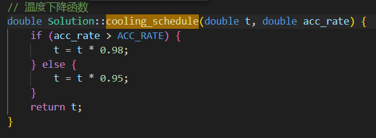
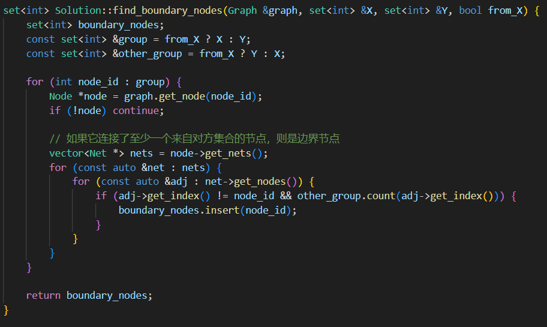
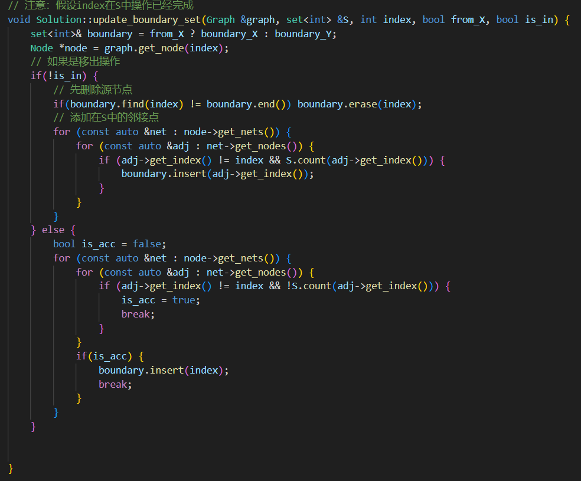

## 算法逻辑和实现思路

本次采用模拟退火算法来解决本次布局布线问题。

模拟退火算法（Simulated Annealing，简称 SA）是一种 概率性全局优化算法 ，灵感来源于金属材料的物理退火过程。在实际退火中，材料在高温下原子活动剧烈，能够跳出局部能谷，逐渐降温后趋于低能稳定状态。模拟退火正是借助这一思想，寻求复杂优化问题的 全局最优解 。在芯片布局布线问题中，经常使用模拟退火算法来进行解决。

在基础的模拟退火算法之上，我实现了一些小改进，比如在程序执行过程中统计计算接受率，依据接受率来动态调整模拟退火的退火温度。同时利用允许的不平衡要求，在生成新状态时不仅实现两个节点的交换，而且实现节点的单方向移动。同时保证满足平衡条件。具体代码如下：

如果当前接受率比较高（> ACC_RATE），说明系统还在积极探索阶段——也就是说，大部分新解被接受，此时可能还远离最优解 → 降温速度可以慢一点（保留探索能力）。

如果接受率较低（≤ ACC_RATE），说明大多数新解都被拒绝，系统已经趋于稳定 → 可加快降温来收敛 。

同时为了提高搜索效率，在生成新状态时，只对“边界点”进行操作。因为内部点的交换和移动都会导致解代价提高，并且并不会有助于接近更优的解，或者说可以由边界点的操作达到相同的效果。可以考虑划分X和Y，节点a和b分别是X和Y的内部节点，此时若进行两者交换，或者a(b)移动到X(Y)，此时目前解代价会升高。从长远来看，若此次交换（移动操作）的结果属于最优解的一部分，即ab交换后或者ab移动后确实位于最优解中，那么在当前状态中肯定有一条从边界点到a和b节点的路径（否则a和b节点就是“孤立点”，对解没有任何影响），所以存在通过对边界点的操作来将ab节点执行成最优解节点的路径。因此不存在理论上的局限。由此，在每次生成新节点时，只对边界节点进行操作。同时为了避免每次寻找边界节点是的时间开销，采用维护而不是重新生成的方式来更新边界节点集。

部分代码如下：

后续比较后发现只对边界点进行操作的性能相比于全局操作进步有限，根本原因在于迭代次数太少，两个划分中的点绝大部分都是边界点，导致和全局操作几乎没有区别，如果迭代充分，应该能取得不错的性能提升。
