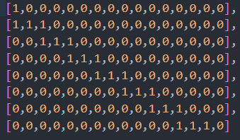
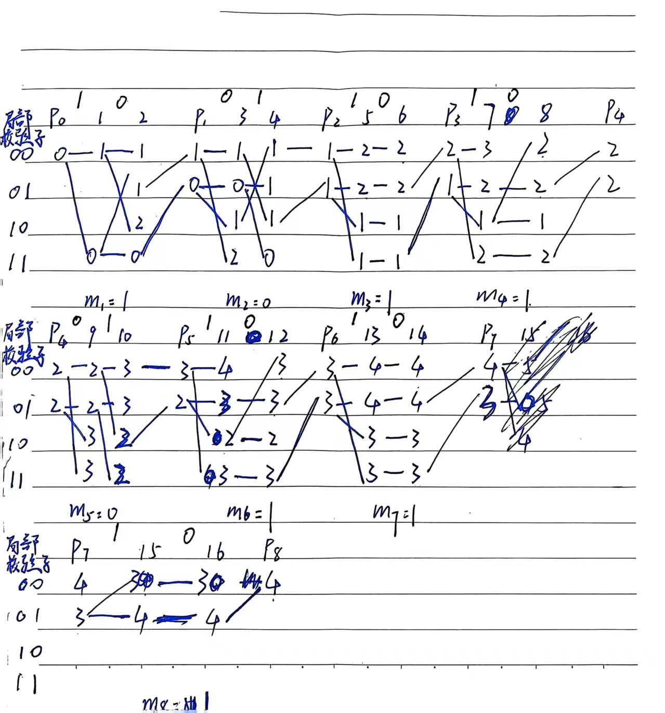

STC校验小矩阵H为

$$
\begin{bmatrix}
1 & 0 \\
1 & 1
\end{bmatrix}
$$

由STC校验小矩阵生成的近似带状矩阵如下：

格图如下，由于我的visio本地安装出现了一些问题，有没有找到其他比较好的绘制工具，所以采用手写之后扫描的方式，列编号上面的数字表示载体，由于推导时的疏忽，没有留出空间来表示出含密载体：

以下是步骤详细说明：

子块1：

初始状态为00，修改次数为0。对于x1=1，若无修改，则y1=x1=1则在00初态上模2加11（H的第一列）00 + 11 = 11到达11态。若修改，则y1=0，此时00 + 00 = 00，保持在00态，但是修改次数+1。（由于步骤太多，下面叙述简化）

对于x2=0，对于00态，若无修改，00 + 00 = 00，修改次数1 + 0 = 1。若修改，00 + 10 = 10，修改次数1 + 1 = 2。对于11态，无修改，11 + 00 = 11，修改次数0 + 0 = 0。若修改，11 + 10 = 01，修改次数0 + 1 = 1。

m1=1，所以保留01和11状态，删除末尾1，高位添加0，即01态跳转00，11跳转01。

子块2：

对于x3=0，对于00态，若无修改，00 + 00 = 00，修改次数1 + 0 = 1。若修改，00 + 11 = 11，修改次数1 + 1 = 2。对于01态，无修改，01 + 00 = 01，修改次数0 + 0 = 0。若修改，01 + 11 = 10，修改次数0 + 1 = 1。

对于x4=1，对于00态，若无修改，00 + 10 = 10，修改次数1 + 0 = 1。若修改，00 + 00 = 00，修改次数1 + 1 = 2（舍弃）。对于01态，无修改，01 + 10 = 11，修改次数0 + 0 = 0。若修改，01 + 00 = 01，修改次数0 + 1 = 1。对于10态，无修改，10 + 10 = 00，修改次数1 + 0 = 1。若修改，10 + 00 = 10，修改次数1 + 1 = 2（舍弃）。对于11态，无修改，11 + 10 = 01，修改次数2 + 0 = 2（舍弃）。若修改，11 + 00 = 11，修改次数2 + 1 = 3（舍弃）。删除掉高代价路径后，格图如上。

m2=0，所以保留00和10状态，删除末尾0，高位添加0，即00态跳转00，10跳转01。

子块3：

对于x5=1，对于00态，若无修改，00 + 11 = 11，修改次数1 + 0 = 1。若修改，00 + 00 = 00，修改次数1 + 1 = 2。对于01态，无修改，01 + 11 = 10，修改次数1 + 0 = 1。若修改，01 + 00 = 01，修改次数1 + 1 = 2。

对于x6=0，对于00态，若无修改，00 + 00 = 00，修改次数2 + 0 = 2。若修改，00 +10 = 10，修改次数2 + 1 = 3（舍弃）。对于01态，无修改，01 + 00 = 01，修改次数2 + 0 = 2。若修改，01 + 10 = 11，修改次数2 + 1 = 3（舍弃）。对于10态，无修改，10 + 00 = 10，修改次数1 + 0 = 1。若修改，10 + 10 = 00，修改次数1 + 1 = 2（舍弃）。对于11态，无修改，11 + 00 = 11，修改次数1 + 0 = 1。若修改，11 + 10 = 01，修改次数1 + 1 = 2（舍弃）。删除掉高代价路径后，格图如上。

m3=1，所以保留01和11状态，删除末尾1，高位添加0，即01态跳转00，11跳转01。

子块4：

对于x7=1，对于00态，若无修改，00 + 11 = 11，修改次数2 + 0 = 2。若修改，00 + 00 = 00，修改次数2 + 1 = 3。对于01态，无修改，01 + 11 = 10，修改次数1 + 0 = 1。若修改，01 + 00 = 01，修改次数1 + 1 = 2。

对于x8=0，对于00态，若无修改，00 + 00 = 00，修改次数3 + 0 = 3（舍弃）。若修改，00 +10 = 10，修改次数3 + 1 = 4（舍弃）。对于01态，无修改，01 + 00 = 01，修改次数2 + 0 = 2。若修改，01 + 10 = 11，修改次数2 + 1 = 3（舍弃）。对于10态，无修改，10 + 00 = 10，修改次数1 + 0 = 1。若修改，10 + 10 = 00，修改次数1 + 1 = 2。对于11态，无修改，11 + 00 = 11，修改次数2 + 0 = 2。若修改，11 + 10 = 01，修改次数2 + 1 = 3（舍弃）。删除掉高代价路径后，格图如上。

m4=1，所以保留01和11状态，删除末尾1，高位添加0，即01态跳转00，11跳转01。

子块5：

对于x9=0，对于00态，若无修改，00 + 00 = 00，修改次数2 + 0 = 2。若修改，00 + 11 = 11，修改次数2 + 1 = 3。对于01态，无修改，01 + 00 = 01，修改次数2 + 0 = 2。若修改，01 + 11 = 10，修改次数2 + 1 = 3。

对于x10=1，对于00态，若无修改，00 + 10 = 10，修改次数2 + 0 = 2。若修改，00 + 00 = 00，修改次数2 + 1 = 3。对于01态，无修改，01 + 10 = 11，修改次数2 + 0 = 2。若修改，01 + 00 = 01，修改次数2 + 1 = 3。对于10态，无修改，10 + 10 = 00，修改次数3 + 0 = 3（舍弃）。若修改，10 + 00 = 10，修改次数3 + 1 = 4（舍弃）。对于11态，无修改，11 + 10 = 01，修改次数3 + 0 = 3（舍弃）。若修改，11 + 00 = 11，修改次数3 + 1 = 4（舍弃）。删除掉高代价路径后，格图如上。

m5=0，所以保留00和10状态，删除末尾0，高位添加0，即00态跳转00，10跳转01。

子块6：

对于x11=1，对于00态，若无修改，00 + 11 = 11，修改次数3 + 0 = 3。若修改，00 + 00 = 00，修改次数3 + 1 = 4。对于01态，无修改，01 + 11 = 10，修改次数2 + 0 = 2。若修改，01 + 00 = 01，修改次数2 + 1 = 3。

对于x12=0，对于00态，若无修改，00 + 00 = 00，修改次数4 + 0 = 4（舍弃）。若修改，00 +10 = 10，修改次数4 + 1 = 5（舍弃）。对于01态，无修改，01 + 00 = 01，修改次数3 + 0 = 3。若修改，01 + 10 = 11，修改次数3 + 1 = 4（舍弃）。对于10态，无修改，10 + 00 = 10，修改次数2 + 0 = 2。若修改，10 + 10 = 00，修改次数2 + 1 = 3。对于11态，无修改，11 + 00 = 11，修改次数3 + 0 = 3。若修改，11 + 10 = 01，修改次数3 + 1 = 4（舍弃）。删除掉高代价路径后，格图如上。

m6=1，所以保留01和11状态，删除末尾1，高位添加0，即01态跳转00，11跳转01。

子块7：

对于x13=1，对于00态，若无修改，00 + 11 = 11，修改次数3 + 0 = 3。若修改，00 + 00 = 00，修改次数3 + 1 = 4。对于01态，无修改，01 + 11 = 10，修改次数3 + 0 = 3。若修改，01 + 00 = 01，修改次数3 + 1 = 4。

对于x14=0，对于00态，若无修改，00 + 00 = 00，修改次数4 + 0 = 4。若修改，00 +10 = 10，修改次数4 + 1 = 5（舍弃）。对于01态，无修改，01 + 00 = 01，修改次数4 + 0 = 4。若修改，01 + 10 = 11，修改次数4 + 1 = 5（舍弃）。对于10态，无修改，10 + 00 = 10，修改次数3 + 0 = 3。若修改，10 + 10 = 00，修改次数3 + 1 = 4（舍弃）。对于11态，无修改，11 + 00 = 11，修改次数3 + 0 = 3。若修改，11 + 10 = 01，修改次数3 + 1 = 4（舍弃）。删除掉高代价路径后，格图如上。

m7=1，所以保留01和11状态，删除末尾1，高位添加0，即01态跳转00，11跳转01。

子块8：

由于最后的矩阵只保留了上半部分，所以下半部分要补0，变成：

$$
\begin{bmatrix}
1 & 0 \\
0 & 0
\end{bmatrix}
$$

对于x15=1，对于00态，若无修改，00 + 01 = 01，修改次数4 + 0 = 4（舍弃）。若修改，00 + 00 = 00，修改次数4 + 1 = 5（舍弃）。对于01态，无修改，01 + 01 = 00，修改次数3 + 0 = 3。若修改，01 + 00 = 01，修改次数3 + 1 = 4。

对于x16=0，对于00态，若无修改，00 + 00 = 00，修改次数3 + 0 = 3。若修改，00 +00 = 00，修改次数3 + 1 = 4（舍弃）。对于01态，无修改，01 + 00 = 01，修改次数4 + 0 = 4。若修改，01 + 00 = 01，修改次数4 + 1 = 5（舍弃）。删除掉高代价路径后，格图如上。

m8=1，所以保留01。最终要4次修改。反推得到的y如下：
y = 10111000010010000。
