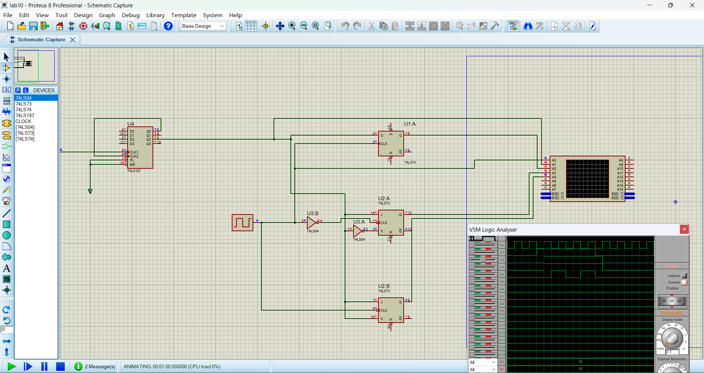
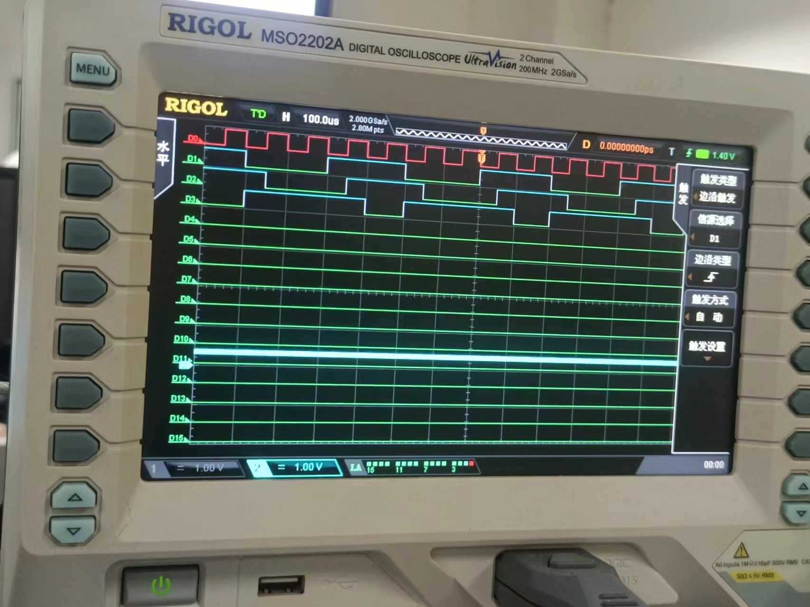
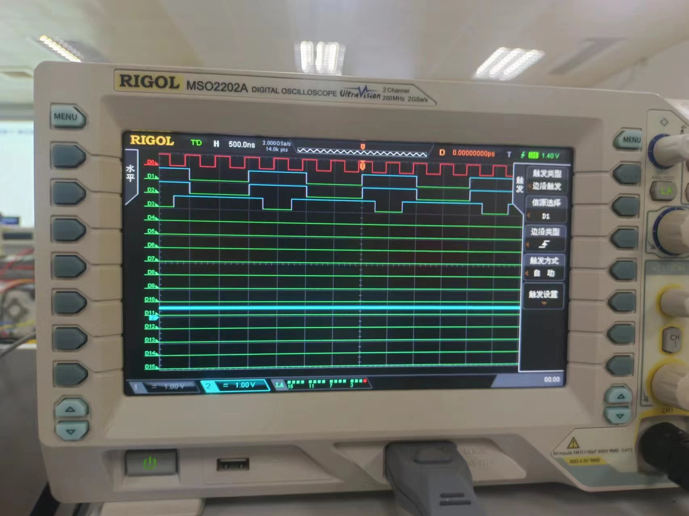

# 实验十：译码显示电路（2）点阵的原理和应用

## 一、 实验目的

1. 熟悉J-K触发器、D触发器和T触发器的逻辑功能。
2. 掌握74LS74、74LS73的触发方式和使用方法。
3. 掌握使用J-K触发器构成D触发器、T触发器的方法。

### 二、 实验设备：

1. 数字电路实验箱、逻辑分析仪。
2. 器件：74LS73，74LS74，74LS00，74LS08，74LS20等。

## 三、实验原理：

同实验指导书。

## 四、方法与步骤：

利用JK触发器实现D触发器和T触发器，对照D触发器和T触发器与JK触发器的真值表，很容易就能看出来D触发器实现的功能就是JK触发器的清零置位功能，而T触发器实现的功能就是JK触发器的保持和翻转功能，由此可以得出由JK触发器实现D触发器和T触发器的 思路，那就是通过逻辑门将D和T对应的输入转换成JK触发器对应功能的输入。

D触发器和T触发器的输入与对应的JK触发器的输入如下：

| D | J | K |
| - | - | - |
| 0 | 0 | 1 |
| 1 | 1 | 0 |

| T | J | K |
| - | - | - |
| 0 | 0 | 0 |
| 1 | 1 | 1 |

可以很容易得到表达式：

$$
D = J + \overline{K}
$$

$$
T = J + K
$$

除此之外还要注意，D触发器是上升沿触发，而T触发器是下降沿触发，所以为了保持一致，需要将接入的时钟信号先通过反相器取反再接入D触发器。电路如下：

## 五、验证结果

实验室实验波形图如下：D0是时钟信号，D1是输入信号，D2是D触发器，D3是T触发器。

下面D1是真正的D触发器的波形图，D2是JK触发器实现的D触发器波形图，除了微小的时延，两个波形基本一致。

## 六、分析与讨论

从波形图可以看到，时钟信号上升沿到来时，若D触发器（JK触发器实现）输入信号为高电平，则输出为高电平，若为低电平，则输出为低电平，这与D触发器的功能一致。对于T触发器，当时钟下降沿到来时，若T触发器输入为高电平，则输出翻转，输入为低电平，则输出保持原状，与T触发器功能一致。

并且对于T触发器，若输入一致保持高电平，则输出的波形频率就会是时钟的一半，周期变为2倍，以此可以去生成不同频率的波形，或者去制作计数器。

通过这次实验，我学习了各种触发器的工作原理以及亲身进行了实践，学习了各种触发器的使用方法以及电路设计的思路。
