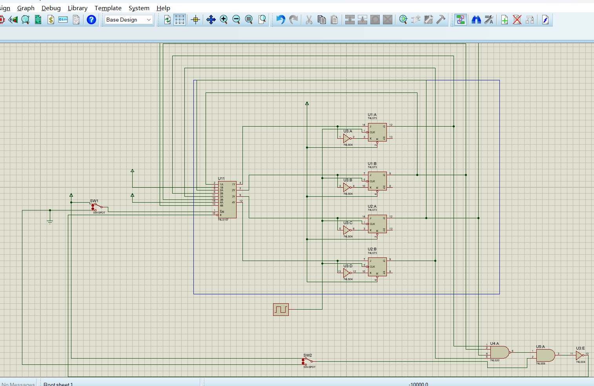
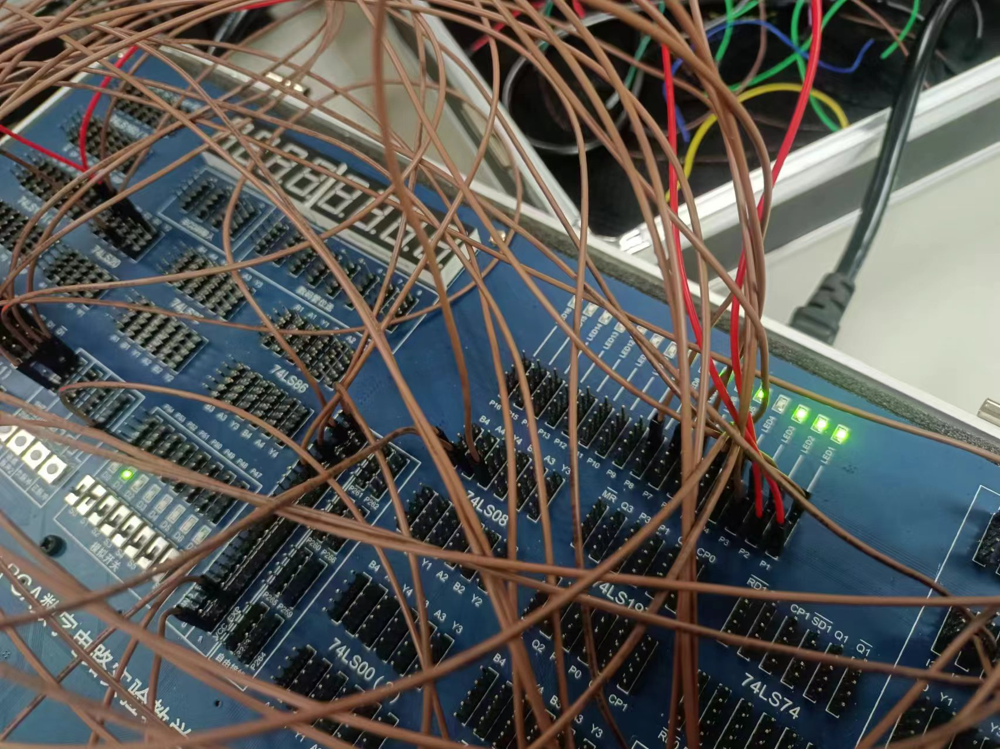
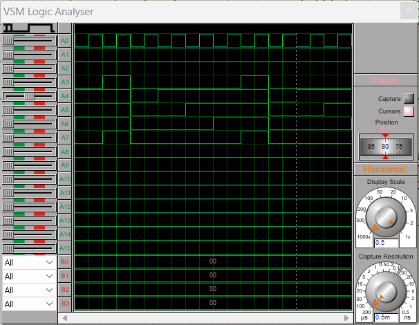
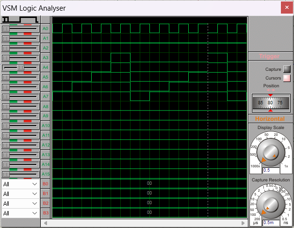
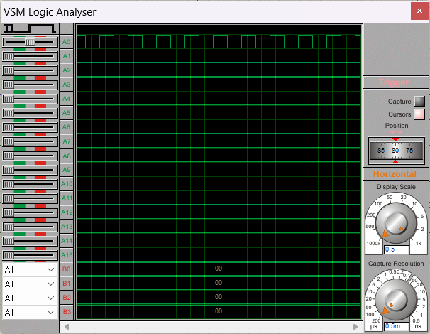

# 实验十一：移位寄存器实现汽车尾灯控制电路

## 一、 实验目的

1. 熟悉J-K触发器的逻辑功能。
2. 掌握J-K触发器构成移位寄存器的设计方法。

### 二、 实验设备：

1. 数字电路实验箱、逻辑分析仪。
2. 器件：74LS73，74LS00，74LS08，74LS20等。

## 三、实验原理：

同实验指导书。

## 四、方法与步骤：

首先要利用JK触发器实现双向移位寄存器，通过对实验原理的学习，左移和右移触发器实现时，JK触发器的J输入端和K输入端是反相的，所以可以将JK触发器的两个输入首先转换成一个输入，即将K接反相器然后再与J输入端相连，组成类似于D触发器的触发器（与D触发器不同的是，这个是下降沿触发），这样，我们只需要考虑J输入端的输入即可。

对于第i个触发器，如果是左移触发器，对于时钟相同的情况下，其输入应该是$Q_{i+1}$,若为右移触发器，则输入是$Q_{i-1}$,所以利用74LS157的四二选一数据选择器来选择输入，其选择信号S接K2来进行控制。

如果将K1直接接数据选择器74LS157的使能端来控制信号灯的亮灭，这种实现，不能实现全亮之后到全灭的状态转换，因此需要对接入74LS157的使能信号进行分析。

数据选择器使能信号低有效，我们要求灯全亮时下一个时钟灯全灭，并且K1为低时灯全灭，由此我们可以先将四个灯取与，因为受限于实验箱，所以我们利用74LS20即四输入与非门来获取与信号，记为C，由此我们可以列出C和K1作为输入，使能输入信号E作为输出的真值表：

| C | K1 | E |
| - | -- | - |
| 0 | 0  | 1 |
| 0 | 1  | 1 |
| 1 | 0  | 1 |
| 1 | 1  | 0 |

由此我们可以得到使能信号的逻辑表达式：

$$
E = \overline{CK1}
$$

这样既可以保证k1控制灯的亮灭又可以在灯全亮时使其转变成全灭，达到要求，电路图如下（这里没有接灯，只是画出来了触发器的连接）：

## 五、验证结果

实验结果如下：

## 六、分析与讨论

下面是仿真波形图，其中，第一个信号是时钟信号，第二个信号是K2，第三个信号是K1，第四个信号是数据选择器使能端输入信号，接下来四个是触发器输出端的信号：

可以看到，当K2为高电平，K1，K2为高电平时，输出依次变为高电平，实现移位功能，接着当全部四个信号都为高电平时，数据选择器使能信号变为高电平，即数据选择器失效，使得所有输出变为低电平，接着进行循环，实现要求的尾灯状态转移功能。右移同理，这里不再赘述，如下图：

下图是K1置低电平全灭状态波形图，使能为高，数据选择器失效：

通过这次实验，我学习了移位寄存器的工作原理及其实现，并且在特定场景下进行应用，，锻炼了时序电路逻辑设计的

能力，受益匪浅。
