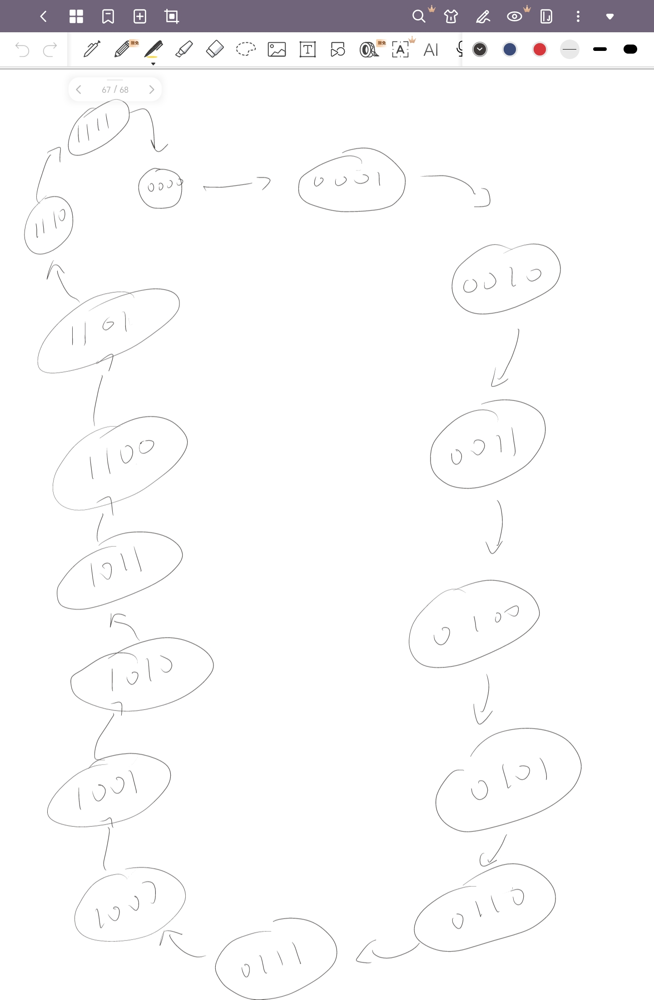
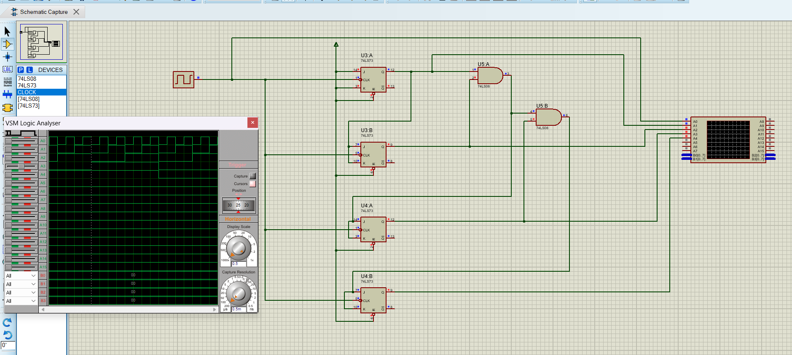
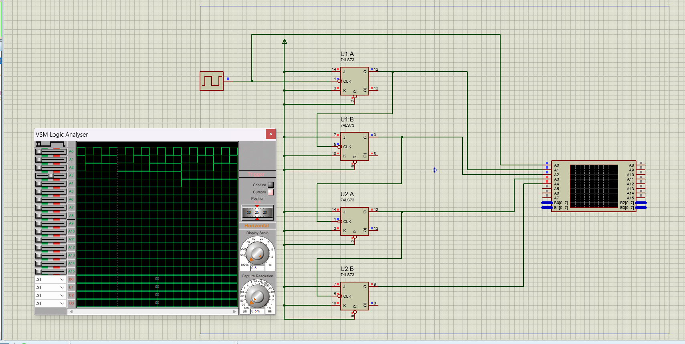
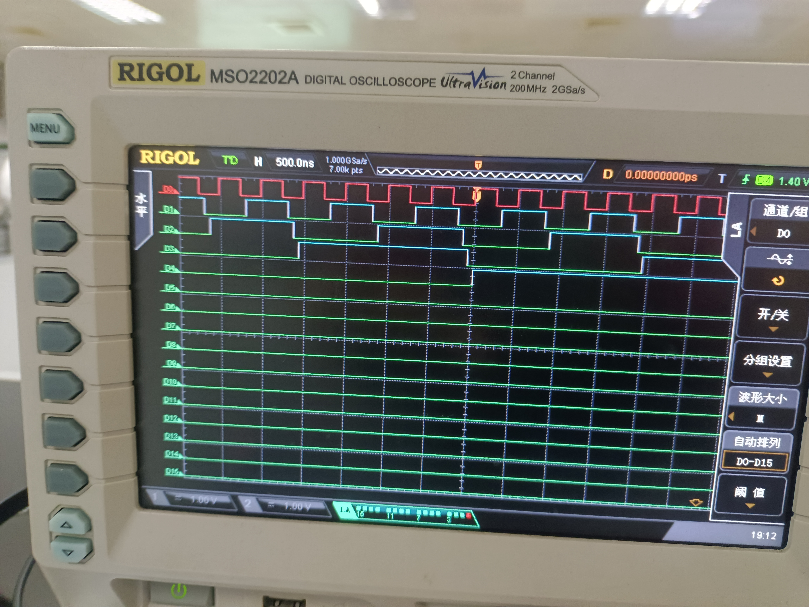
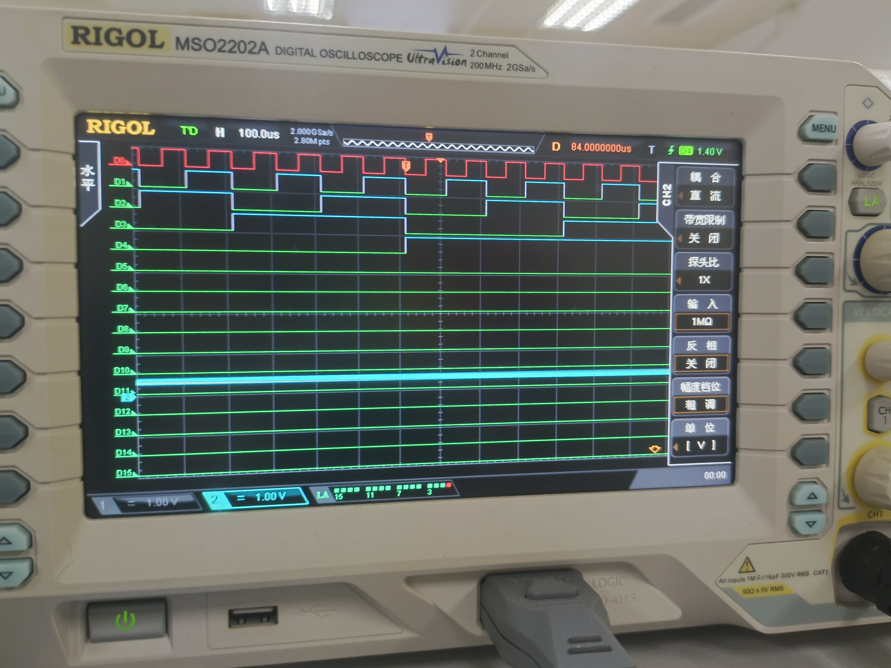

# 实验十三：同步／异步计数器的实现

## 一、 实验目的

1. 熟悉JK触发器的逻辑功能。
2. 掌握使用JK触发器搭建同步计数器和异步计数器的设计方法。

### 二、 实验设备：

1. 数字电路实验箱，逻辑分析仪。
2. 器件：74LS74，74LS00，74LS08，74LS20 等。

## 三、实验原理：

同实验指导书。

## 四、方法与步骤：

### 同步16进制计数器的实现：

首先列出状态转移图：

可以列出每一位的次态卡诺图如下：

$Q^{n + 1}_0$:

| $Q^{n}_3Q^{n}_2\ Q^{n}_1Q^{n}_0$ | 00 | 01 | 11 | 10 |
| ---------------------------------- | -- | -- | -- | -- |
| 00                                 | 1  | 0  | 0  | 1  |
| 01                                 | 1  | 0  | 0  | 1  |
| 11                                 | 1  | 0  | 0  | 1  |
| 10                                 | 1  | 0  | 0  | 1  |

$Q^{n + 1}_1$:

| $Q^{n}_3Q^{n}_2\ Q^{n}_1Q^{n}_0$ | 00 | 01 | 11 | 10 |
| ---------------------------------- | -- | -- | -- | -- |
| 00                                 | 0  | 1  | 0  | 1  |
| 01                                 | 0  | 1  | 0  | 1  |
| 11                                 | 0  | 1  | 0  | 1  |
| 10                                 | 0  | 1  | 0  | 1  |

$Q^{n + 1}_2$:

| $Q^{n}_3Q^{n}_2\ Q^{n}_1Q^{n}_0$ | 00 | 01 | 11 | 10 |
| ---------------------------------- | -- | -- | -- | -- |
| 00                                 | 0  | 0  | 1  | 0  |
| 01                                 | 1  | 1  | 0  | 1  |
| 11                                 | 1  | 1  | 0  | 1  |
| 10                                 | 0  | 0  | 1  | 0  |

$Q^{n + 1}_3$:

| $Q^{n}_3Q^{n}_2\ Q^{n}_1Q^{n}_0$ | 00 | 01 | 11 | 10 |
| ---------------------------------- | -- | -- | -- | -- |
| 00                                 | 0  | 0  | 0  | 0  |
| 01                                 | 0  | 0  | 1  | 0  |
| 11                                 | 1  | 1  | 0  | 1  |
| 10                                 | 1  | 1  | 1  | 1  |

分别 对其进行化简，并且与JK触发器特征方程进行对比，可以得到如下表达式：

$$
J_0 = K_0 = 1
$$

$$
J_1 = K_1 = Q^{n}_0
$$

$$
J_2 = K_2 = Q^{n}_1Q^{n}_0
$$

$$
J_3 = K_3 = Q^{n}_2Q^{n}_1Q^{n}_0
$$

由此我们只要与门进行逻辑运算即可，电路图如下：

### 异步16进制计数器的实现：

观察16进制时序波形图，可以发现，**下一级的波形在上一级的波形信号的下降沿到来时进行翻转**，因此下一级的时钟信号采用上一级的输出。第一级信号以连续脉冲作为时钟信号，次态卡诺图如下：

$Q^{n + 1}_0$:

| $Q^{n}_3Q^{n}_2\ Q^{n}_1Q^{n}_0$ | 00 | 01 | 11 | 10 |
| ---------------------------------- | -- | -- | -- | -- |
| 00                                 | 1  | 0  | 0  | 1  |
| 01                                 | 1  | 0  | 0  | 1  |
| 11                                 | 1  | 0  | 0  | 1  |
| 10                                 | 1  | 0  | 0  | 1  |

$Q^{n + 1}_1$:

| $Q^{n}_3Q^{n}_2\ Q^{n}_1Q^{n}_0$ | 00 | 01 | 11 | 10 |
| ---------------------------------- | -- | -- | -- | -- |
| 00                                 | X  | 1  | 0  | X  |
| 01                                 | X  | 1  | 0  | X  |
| 11                                 | X  | 1  | 0  | X  |
| 10                                 | X  | 1  | 0  | X  |

$Q^{n + 1}_2$:

| $Q^{n}_3Q^{n}_2\ Q^{n}_1Q^{n}_0$ | 00 | 01 | 11 | 10 |
| ---------------------------------- | -- | -- | -- | -- |
| 00                                 | X  | X  | 1  | X  |
| 01                                 | X  | X  | 0  | X  |
| 11                                 | X  | X  | 0  | X  |
| 10                                 | X  | X  | 1  | X  |

$Q^{n + 1}_3$:

| $Q^{n}_3Q^{n}_2\ Q^{n}_1Q^{n}_0$ | 00 | 01 | 11 | 10 |
| ---------------------------------- | -- | -- | -- | -- |
| 00                                 | X  | X  | X  | X  |
| 01                                 | X  | X  | 1  | X  |
| 11                                 | X  | X  | 0  | X  |
| 10                                 | X  | X  | X  | X  |

通过化简和与JK触发器特征方程的对比可以知道所有的JK全部接1。

电路图如下：

## 五、验证结果

实验结果如下：

异步计数器的实验结果，可以看到由于延迟累积，延迟比较大且每级逐渐积累，可以看到相比于上一级波形，每一级都向后移动了一段距离：

下面是同步计数器的波形图，由于采用相同的时钟信号，所以误差小甚至几乎没有：

## 六、分析与讨论

同步计数器采用相同的时钟信号作为触发，所有的触发器都被同一个时钟信号控制。在时钟信号的作用下，所有的触发器同时更新其状态，因此，所有的触发器在同一个时刻进行状态转换。

异步计数器采用不同的时钟信号，异步计数器中，各个触发器的时钟信号不同步，每个触发器的状态更新不依赖于同一个时钟信号，而是依赖于其他触发器的输出。

由于时钟信号依赖于其他触发器的输出，因此异步计数器会发生延迟累积的问题，即触发器的状态更新依赖于其他触发器的输出，而触发器的状态需要一定的时间，从而导致延迟积累，造成计数不准确与计数不稳定。在时序要求严格的场景下，同步计数器优于异步计数器。

但在电路设计上，同步计数器一般比异步计数器复杂，可以根据场景与具体需要进行选择。

并且可以看出，二进制计数器的的输入、输出信号的相位、频率进行对比，可以看出二进制计数器第n位输出端信号就是输入信号的$2^n$分频信号，且分频信号的占空比是50%，因此可以通过搭建计数器实现分频器功能。

时序逻辑电路的设计步骤为明确设计要求、弄清楚状态转移过程（一般是画状态转移图）、通过卡诺图等进行状态化简、依据选择的触发器特征方程，求时钟、状态、输出、触发器的驱动方程，明确各种输入是什么、画电路图、最后检查电路。能否自启。

具体到本次实验中，明确规定了JK触发器作为实现元件，通过状态转移图确定在当前状态下每一位的下一级的输出应是什么，列出卡诺图进行化简，接着再借JK触发器的特征方程求出驱动方程，明确JK输入应是什么，时钟信号的选择（异步，这个在卡诺图化简之前就已经完成 了），画电路图，实验组建电路进行验证。

通过本次实验，我学习了同步计数器与异步计数器的原理性质以及实现方法，并且实践了时序逻辑电路设计步骤，对设计过程更加熟练，受益匪浅。
