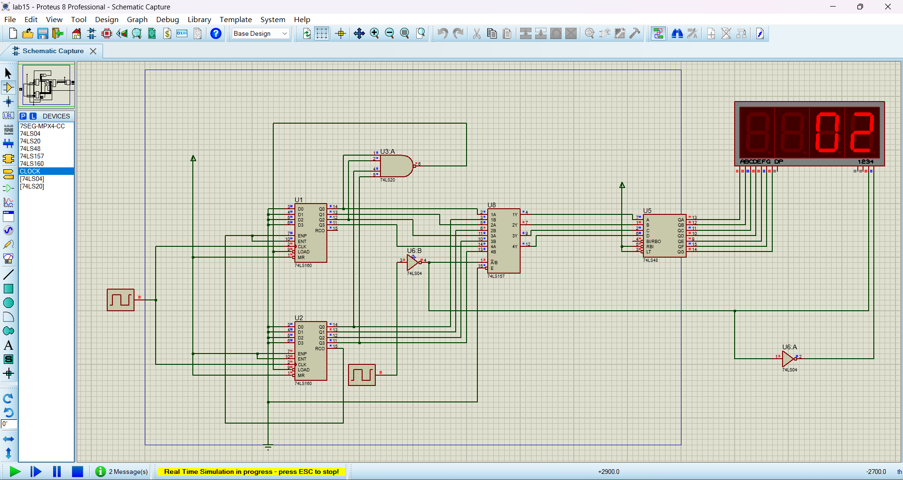
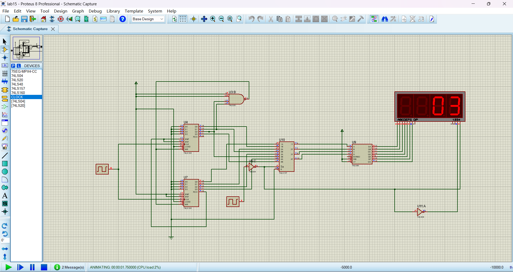
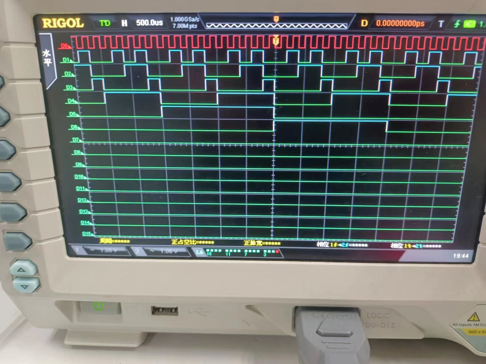
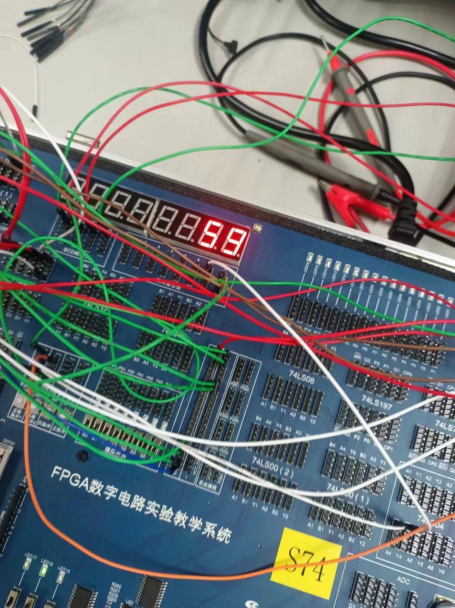

# 实验十五：利用MSI设计六十进制计数器

## 一、 实验目的

1. 熟悉中规模集成电路计数器的功能及应用。
2. 复习中规模集成电路译码器的功能及应用。
3. 复习七段数码管扫描式显示电路的工作原理。
4. 学会综合测试的方法。

### 二、 实验设备：

1. 数字电路实验箱、逻辑分析仪。
2. 器件：74LS160，74LS48，74LS20，74LS157 等

## 三、实验原理：

同实验指导书。

## 四、方法与步骤：

利用M进制搭建N进制的计数器时，可以利用低位计数器的进位信号作为高位计数器的时钟信号或高位
计数器的计数使能信号，搭建N进制计数器。

在利用10进制计数器搭建60进制计数器时，由于74LS160同步置数，异步清零的特性，所以在设计电路时也有所不同：

同步置数：

同步置数意味着置数操作受到时钟信号控制，在时钟信号上升沿到来时才进行置数。需要考虑的状态是$S_{n-1}$,即59对应的二进制代码01011001，设计归零逻辑，从地位到高位依次记输出为$Q_0 - Q_7$，则，$Q_6 Q_4 Q_3 Q_0$全部为1时进行归零，此时置数位接低电平，其余时间全部为高电平。所以将这四个输出接入四输入与非门即可，除此之外，输入全部接0，电路图如下：

异步清零：

异步清零意味着清零操作不受时钟信号控制，只要信号变换，就立即进行清零操作。需要考虑的状态是$S_{n}$,即60对应的二进制代码01100000，设计归零逻辑，从地位到高位依次记输出为$Q_0 - Q_7$，则，$Q_6 Q_5$全部为1时进行归零，此时置数位接低电平，其余时间全部为高电平，电路图如下：

## 五、验证结果：

60进制波形图如下：

实验图：

## 六、分析与讨论：

74ls197与74ls160进制不同，考虑归零状态时二进制代码有区别。除此之外，74ls197没有并行输入功能，只能采用异步清零去实现24进制计数器。而74ls160可以采用异步清零和同步置数两种方法去实现。

可以通过观察计数过程以及分析电路结构等来判断计数器的进制。观察计数过程十分直接就不再叙述。对于电路的分析，可以分析电路中用到的其他计数器的进制（确定进制的范围）以及连接的方式，归零电路的设计逻辑(明确进制)等来综合分析计数器的进制。

六十进制的时序波形图可以看到，10进制计数器以10为周期循环，6进制计数器以6为周期循环，并且10进制的最高位相当于6进制计数器的“触发信号”，在10进制的最高位下降沿到来时，6进制计数器的最低位进行翻转，这与60进制计数器要求的功能吻合。

数码管显示时，由于选通信号接的高频率，因此两个数字观感上是同时显示的，低位数字在0-9循环，高位数字在0-5循环，当且仅当低位数字完成一轮循环时，高位数字才进行变化。

考虑的归零状态不同：采用同步置数方法需要需要考虑时钟信号的控制作用，因此需要考虑状态$S_{n-1}$。异步清零不受时钟信号的控制，因此考虑状态$S_{n}$。

是否考虑输入端的不同：同步置数需要将输入端置零以输入归零状态，异步清零方法则不需要考虑输入端。

 控制的信号不同：异步清零控制的清零信号，同步置数控制的输出信号。

根据电路功能进行模块划分，并分模块安装、调试电路。可以让我们不再局限于电路某一部分功能的具体实现细节，而着眼于宏观的电路功能设计上，这样可以使电路设计更加简单便捷高效。

在测试较复杂的中小数字集成电路时，首先要预想可能会出现问题的地方可能有哪些，设计测试用例时要首先专门针对这些地方进行测试，并且测试要有区分性，方便排查出现问题的模块是哪个。我们可以将中小数字集成电路也划分成多个较为独立的模块，单独进行测试来找出问题所在，若测试的每一部分正常，则考虑是不是连接出现问题，这样一步步排查，就能找出错误，并针对性进行解决。
