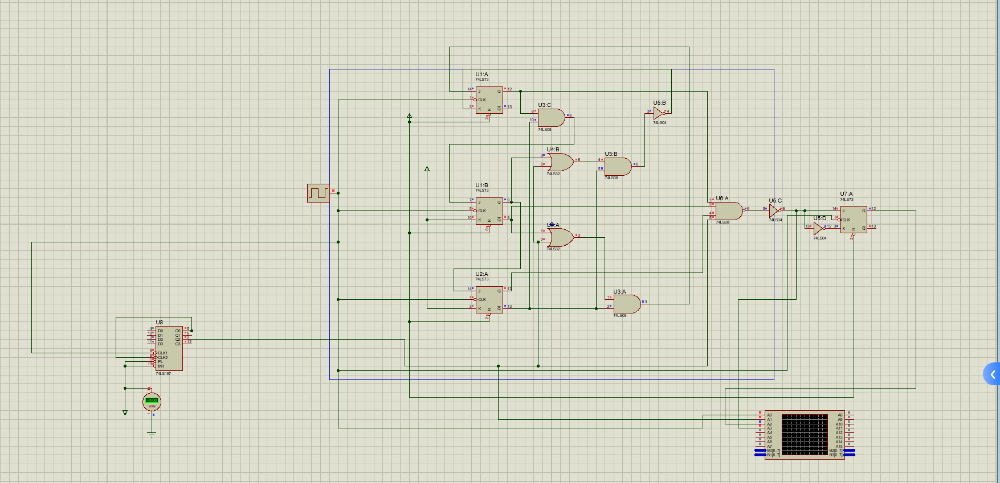
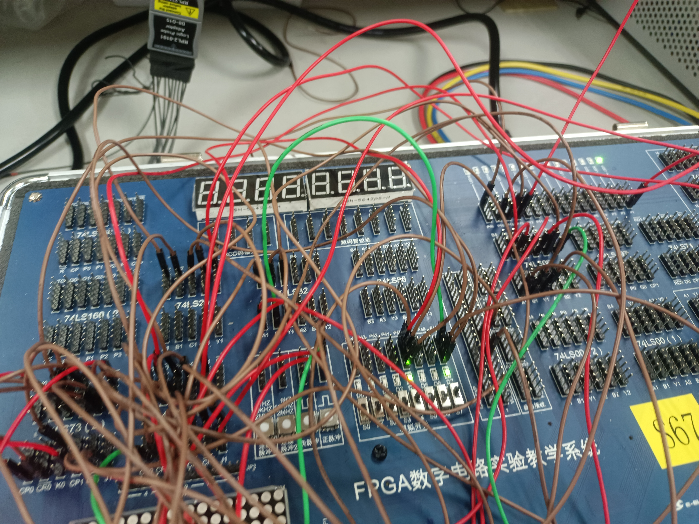
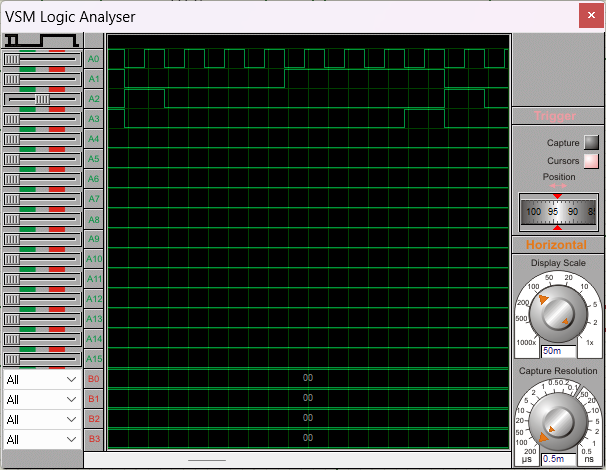

# 实验十六：8421码检测电路的设计

## 一、 实验目的

1. 了解8421码检测电路的工作原理。
2. 掌握利用有限状态机实现同步时序电路的设计方法。

### 二、 实验设备：

1. 数字电路实验箱、逻辑分析仪。
2. 器件：74LS73，74LS74，74LS00，74LS20，74LS197 等。

## 三、实验原理：

同实验指导书。

## 四、方法与步骤：

通过对实验原理的学习，在沿用指导书思路基础上进行改变。

仍然令$S_0$ = A $S_1$ = B $S_3$ = C $S_4$ = D $S_7$ = E $S_8$ = F 。我按照如下状态分配进行电路设计：

A = 000  B = 001  C = 010  D = 011  E = 100  F = 101。8421码序列检测电路状态分配表如下：

| $Q_2 / Q_1 Q_0$ | 00 | 01 | 11 | 10 |
| ----------------- | -- | -- | -- | -- |
| 0                 | A  | B  | D  | C  |
| 1                 | E  | F  | X  | X  |

次态卡诺图如下：

| $XQ_2 / Q_1 Q_0$ | 00    | 01    | 11    | 10    |
| ------------------ | ----- | ----- | ----- | ----- |
| 00                 | 001/0 | 010/0 | 101/0 | 100/0 |
| 01                 | 000/0 | 000/0 | x     | x     |
| 11                 | 000/0 | 000/1 | x     | x     |
| 10                 | 001/0 | 011/0 | 101/0 | 101/0 |

每一位的次态卡诺图如下：

$Q_0^{n + 1}$

| $XQ_2 / Q_1 Q_0$ | 00 | 01 | 11 | 10 |
| ------------------ | -- | -- | -- | -- |
| 00                 | 1  | 0  | 1  | 0  |
| 01                 | 0  | 0  | X  | X  |
| 11                 | 0  | 0  | X  | X  |
| 10                 | 1  | 1  | 1  | 1  |

化简对比得到JK的方程如下：

$$
J_0=\overline{Q_2^n}(\overline{Q_1^n} + X) \quad K_0 = \overline{\overline{Q_2^n}(Q_1^n + X)}
$$

$Q_1^{n + 1}$

| $XQ_2 / Q_1 Q_0$ | 00 | 01 | 11 | 10 |
| ------------------ | -- | -- | -- | -- |
| 00                 | 0  | 1  | 0  | 0  |
| 01                 | 0  | 0  | X  | X  |
| 11                 | 0  | 0  | X  | X  |
| 10                 | 0  | 1  | 0  | 0  |

化简对比得到JK的方程如下：

$$
J_1=\overline{Q_2^n}Q_0^n \quad K_1 = 1
$$

$Q_2^{n + 1}$

| $XQ_2 / Q_1 Q_0$ | 00 | 01 | 11 | 10 |
| ------------------ | -- | -- | -- | -- |
| 00                 | 0  | 0  | 1  | 1  |
| 01                 | 0  | 0  | X  | X  |
| 11                 | 0  | 0  | X  | X  |
| 10                 | 0  | 0  | 1  | 1  |

化简对比得到JK的方程如下：

$$
J_2=Q_1^n \quad K_2 = 1
$$

$F$

| $XQ_2 / Q_1 Q_0$ | 00 | 01 | 11 | 10 |
| ------------------ | -- | -- | -- | -- |
| 00                 | 0  | 0  | 0  | 0  |
| 01                 | 0  | 0  | X  | X  |
| 11                 | 0  | 1  | X  | X  |
| 10                 | 0  | 0  | 0  | 0  |

化简对比得到JK的方程如下：

$$
F=XQ_0^n\overline{Q_1^n}Q_2^n
$$

按照J-K触发器的驱动方程以及F的方程使用J-K触发器和门电路搭建8421码序列检测电路，其中F信号经过D触发器锁存后输出：

## 五、验证结果：

以下为实验结果截图：

在静态测试时，手动控制输入的信号，手动发出正脉冲来模拟，观察F的输出。

## 六、分析与讨论：

以下是动态测试的波形图，依次是时钟、X、F、F'的波形图。可以看见，由于没有D触发器锁存输出，在连续高电平输入时，F'在第三个数据输入进来后就转变为高电平（此时状态为S8，导致F的值只取决于X了，因为X一直是高电平，此时导致F'此时第三个数据输入即为高电平），那么第四个数据为高电平输入进来时，依据状态转移图，下一个状态为S0/1，由于只有状态S8时F'才会通，所以此时F'变成了0，可以看到，如果让F'直接作为F输出，会出现1111在判断时输出0的错误情况。而将F'经过D锁存器锁存，则在第四个数据输入的同时会将1锁存入D触发器，由此在第四个数据输入后会输出1。从而使电路功能正确。

