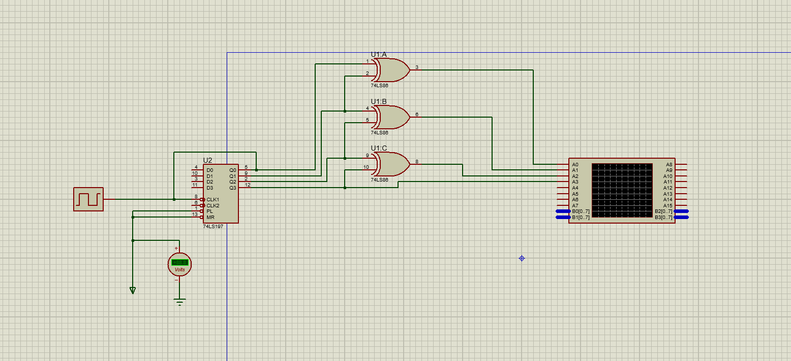
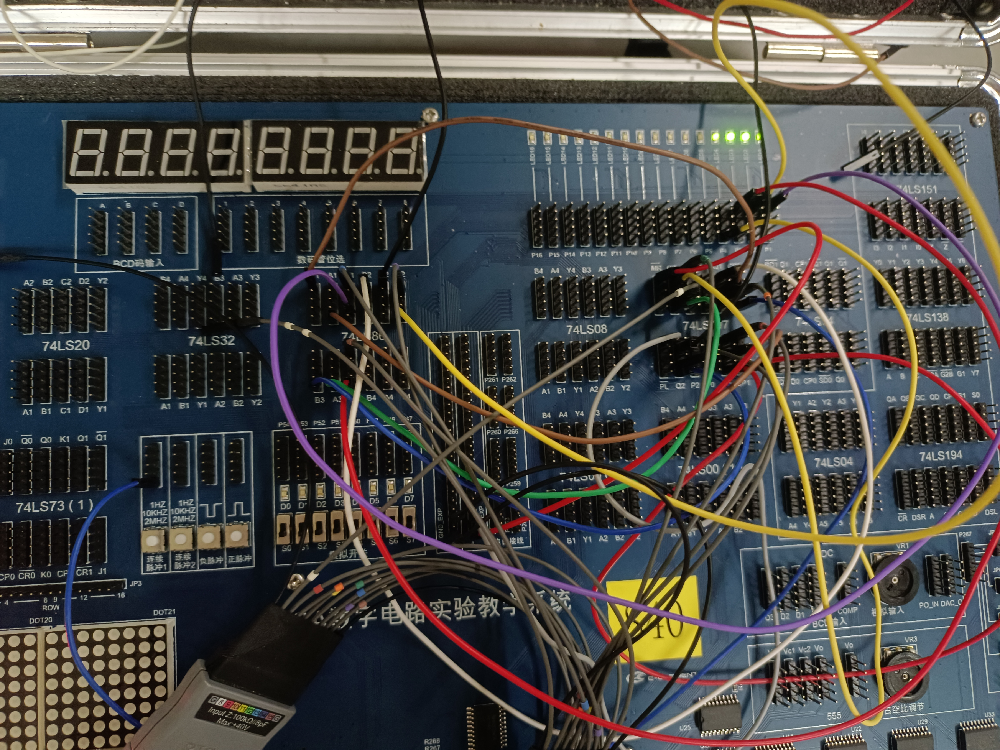
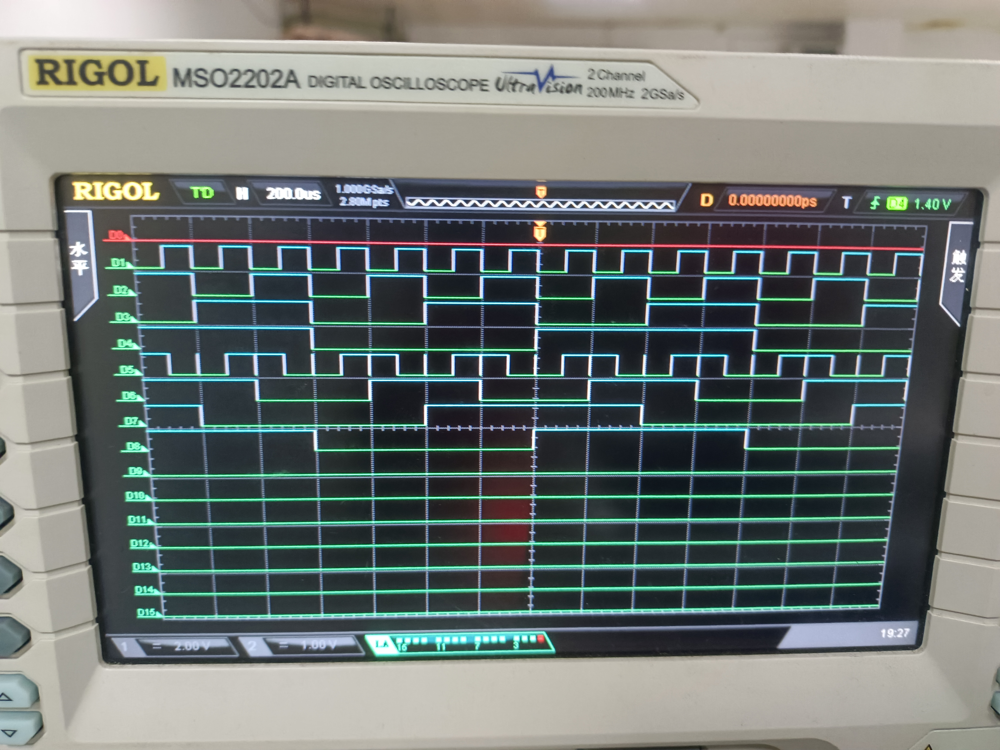

# 实验四：组合逻辑电路分析与设计

## 一、 实验目的

1. 掌握组合逻辑电路的分析方法，并验证其逻辑功能。
2. 掌握组合逻辑电路的设计方法，并能用最少的逻辑门实现之。
3. 熟悉逻辑分析仪的使用。

### 二、 实验设备：

1. 数字电路实验箱，逻辑分析仪
2. 器件：74LS86，74LS197

## 实验原理：

同实验指导书。

## 三、 方法与步骤：

根据格雷码与二进制码的真值表可以发现，二进制码与格雷码的最高位一致，之后格雷码的每一位都是二进制码的对应位与其前一位异或的结果，写成表达式如下：

$$
G_i = B_i⊕B_{i+1}~~~~~~0<=i<n
$$

$$
G_i = B_i~~~~~~~~~~~~~~i = n
$$

其中n表示最高位。

依据以上公式，设计转换电路思路如下：

最高位输入直接作为输出。

其余位输出则由与其对应的输入位和其上一位异或产生。

则依据之前利用74LS197构造的16进制计数器作为输入，设计电路如下：

也可以依据真值表通过卡诺图化简得到每个输出位的逻辑表达式，只不过那样得到的电路比较复杂，所用逻辑门更多，违背实验目的，这里不予采用。

## 四、 验证结果

在实验箱上按照电路要求连接电路并用示波器观测如下：

电路连接与调试过程图。

上面四个通道为十六进制计数器的波形，下面四个通道为对应输出的循环码的波形。

## 五、 分析与讨论

观察上面的波形图可以发现，**除了最高位波形一致以外，其余循环码输出位均是其对应输入位的上一个高位延迟一定的时钟所形成的**。如循环码第3位波形是输入的第4位延迟四个时钟($2^2$)形成（以D1作为参考），而第2位是输入第3位延迟两个时钟($2^1$)形成的，第1位是输入第2位延迟一个时钟($2^0$)形成的。由此可知，当以推知以16进制计数器作为输入时（大胆预测32位即以上计数器也成立此性质），**除最高位波形与输入波形一致外，第i位输出均可由第i+1位输入延迟$2^i$个时钟（以第0个输入信号为参考）获得(i从0开始计数)。**

通过这次实验，我练习了组合逻辑电路的分析方法，并验证其逻辑功能。也熟悉了仪器的使用，受益匪浅。
