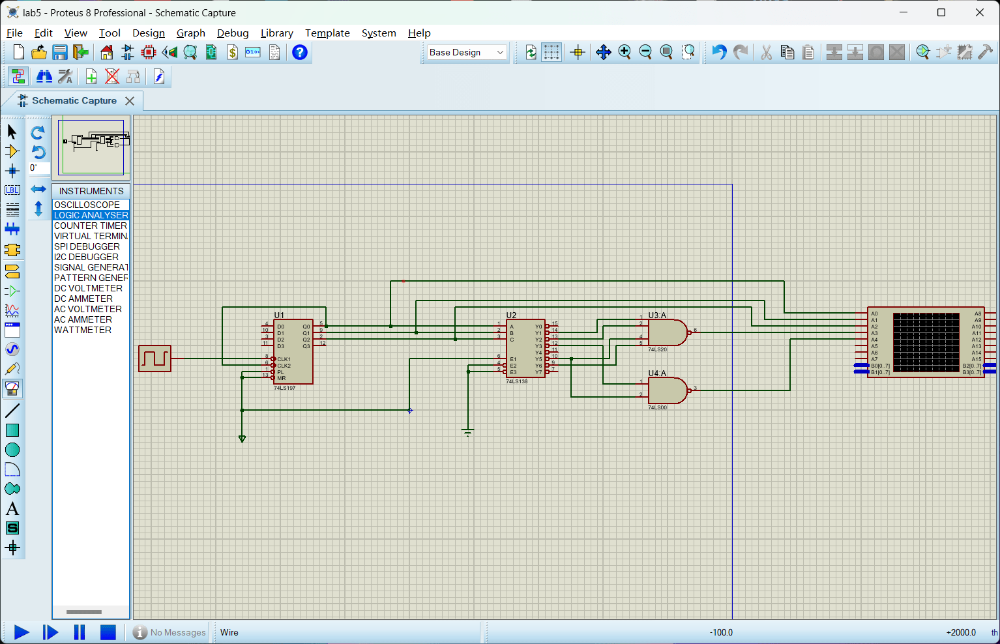
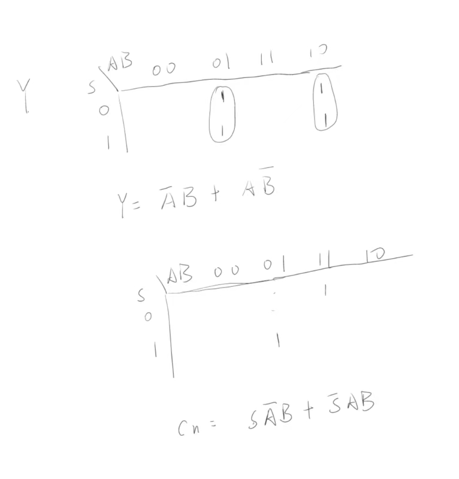
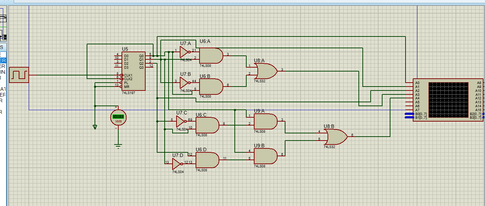
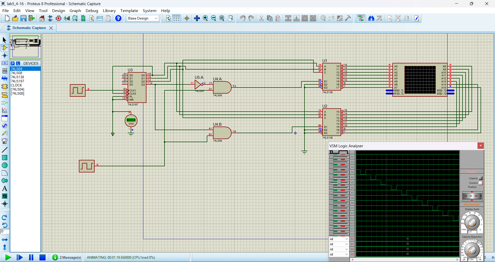
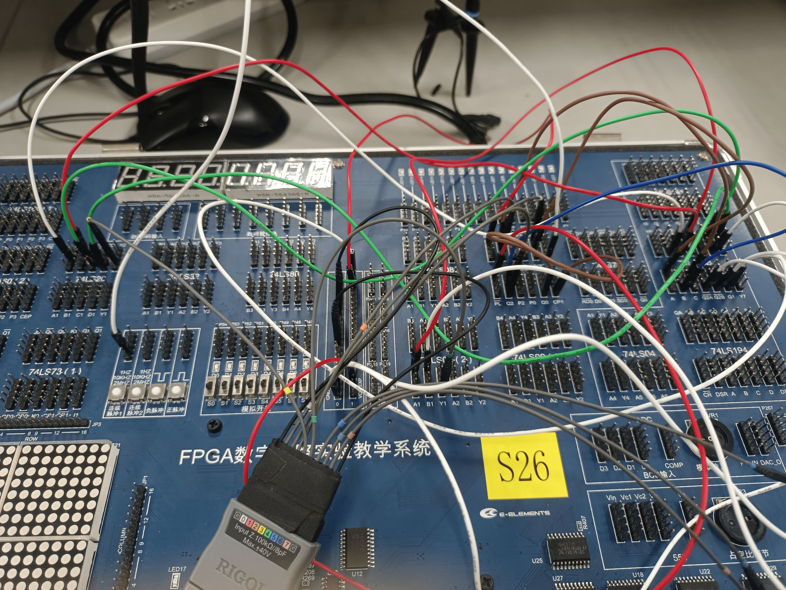
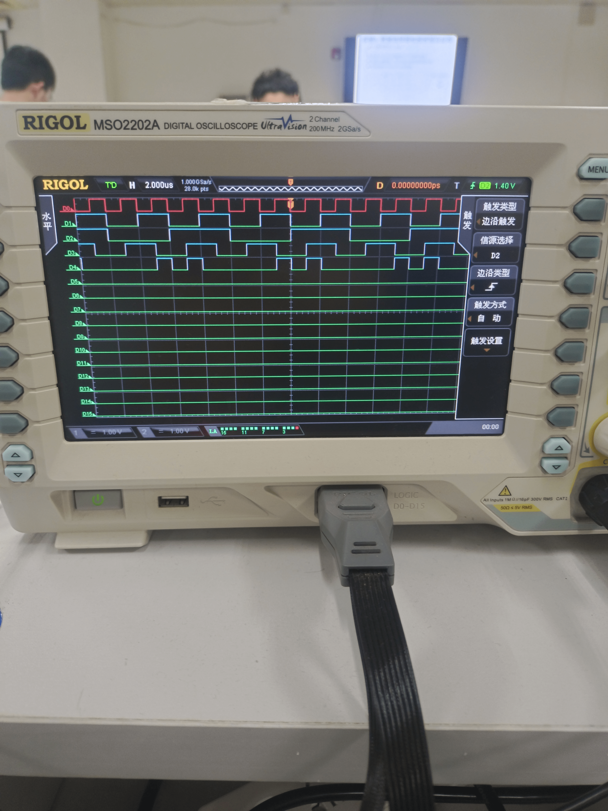

# 实验五：译码器电路原理及应用

## 一、 实验目的

1. 熟悉译码器的功能与使用方法。
2. 掌握用中规模集成电路（MSI）设计的组合逻辑电路的方法。

### 二、 实验设备：

1. 数字电路实验箱、逻辑分析仪。
2. 器件：74LS00，74LS197，74LS138

## 三、实验原理：

同实验指导书。

## 四、方法与步骤：

半加半减器真值表如下

| S | A | B | Y | $C_n$ |
| - | - | - | - | ------- |
| 0 | 0 | 0 | 0 | 0       |
| 0 | 0 | 1 | 1 | 0       |
| 0 | 1 | 0 | 1 | 0       |
| 0 | 1 | 1 | 0 | 1       |
| 1 | 0 | 0 | 0 | 0       |
| 1 | 0 | 1 | 1 | 1       |
| 1 | 1 | 0 | 1 | 0       |
| 1 | 1 | 1 | 0 | 0       |

依据实验指导书所给定的实验原理，当G1接高电平时，译码器会变成最小项译码器。直观来看，即通过ABC选定的输出引脚变为低电平，其余全为高电平，借由这个思路，通过Y和C~n~的真值表再经过化简即可以得到如下公式：

$$
Y = \overline{\overline{m_{1}}\quad\overline{m_{2}}\quad\overline{m_{5}}\quad\overline{m_{6}}}
$$

$$
C_{n} = \overline{\overline{m_{3}}\quad\overline{m_{5}}}
$$

依据上述公式，连接电路如下图：

这里采用的74LS20和74LS00器件对输出信号作与非操作。

若是只用门电路进行实现，则过程为利用真值表画出卡诺图后进行化简得到逻辑表达式，过程如下图：

依据上图所得真值表设计电路如下：

### 思考与提高：74LS138设计4-16线普通译码器

思路如下：首先肯定要用到两个74LS138译码器来构成16路输出，所以**两个译码器的ABC输入均为输入的4路信号的低三位**，那么**采用高位来选择译码器**，本次我想完成的4-16线普通译码器效果为：未选中输出全部输出高电平，选中引脚输出输入信号的反向，则两个译码器的使能信号肯定要接低电平选通（因为未选中的引脚要输出高电平），意味着两个译码器要同时工作，那么就要看**输入信号与输入的4路选择的最高位之间的关系**了，假设输入信号为D，则其与最高位$S_3$，低八位译码器的输入信号记为$D_1$,高八位译码器的输入信号记为$D_2$,关系如下表：

| D | $S_3$ | $D_1$ | $D_2$ |
| - | ------- | ------- | ------- |
| D | 0       | D       | 0       |
| D | 1       | 0       | D       |

上面表格的含义就是：**如果高位是0，代表低八位译码器被选通，那么它的输入应该和输入信号一致，而与此同时高八位译码器输入信号应该是0（因为0的反相是1），同理，当高位是1，则低八位译码器输入信号是0，高八位译码器输入信号是D**

因为输入的信号D无非低电平与高电平两种可能性，这样$D_1$信号的真值表就列出来了：

| D | $S_3$ | $D_1$ |
| - | ------- | ------- |
| 0 | 0       | 0       |
| 0 | 1       | 0       |
| 1 | 0       | 1       |
| 0 | 0       | 0       |

可以看到

$$
D_1 = D\overline{S_3}
$$

同理可得

$$
D_2 = DS_3
$$

得到上述结果之后，就可以设计电路图了：

## 五、验证结果

在实验箱上按照电路要求连接电路并用示波器观测如下：

电路连接与调试过程图。

上面三个通道为输入ABC的波形，下面两个通道分别为Y与$C_n$对应输出的波形。

上图为分析与提高中仿真验证结果，可以看到用时钟信号作为输入信号时，用74LS197设计的16进制计数器的输出作为片选信号可以看到该4-16译码器可以依次选取对应的引脚将输入信号反相输出，并且其余的引脚输出高位。电路功能正确。

## 六、分析与讨论

分析半加半减器的波形图，可以发现Y的波形不受S约束，Y波形只与AB波形有关，当AB波形一个为高电平，一个为低电平时，Y即为高电平，这与揭示了**Y本质上就是AB异或**的结果，因为不带进位的一位加减法与异或一致。

通过比较使用74LS138实现组合逻辑电路和门电路实现组合逻辑电路，我发现相比于门电路实现，74LS138在逻辑表达式上更复杂，但在电路实现上更简洁，并且门电路设计之后只能针对特定的功能，一旦稍作改动就要重新设计，而74LS138实现的组合逻辑电路则相对灵活，通常只需要稍作改动便能完成功能的转变。

通过实验我知道了：组合逻辑电路是一种数字逻辑电路，其输出仅取决于当前输入的状态，**与电路的历史状态无关。它的本质在于通过组合基本的逻辑门（如与门、或门、非门等）来实现各种复杂的逻辑功能**。

通过本次学习我明白了设计组合逻辑电路的一般步骤：**首先要列出输入与对应输出的真值表，接着依据所用元器件的特性将真值表转换为合适的逻辑表达式，并通过逻辑表达式的到电路设计，最后通过实验验证来验证电路功能的正确性**。在这个过程中，每一步的差错可能导致结果的不理想（比如线路链接不通，真值表写错，真值表转换成逻辑表达式转换出错），因此十分考验我的严谨与耐性，在实验过程中，我不仅收获了知识，更锻炼的我的逻辑思维严谨与严密性，受益匪浅。
