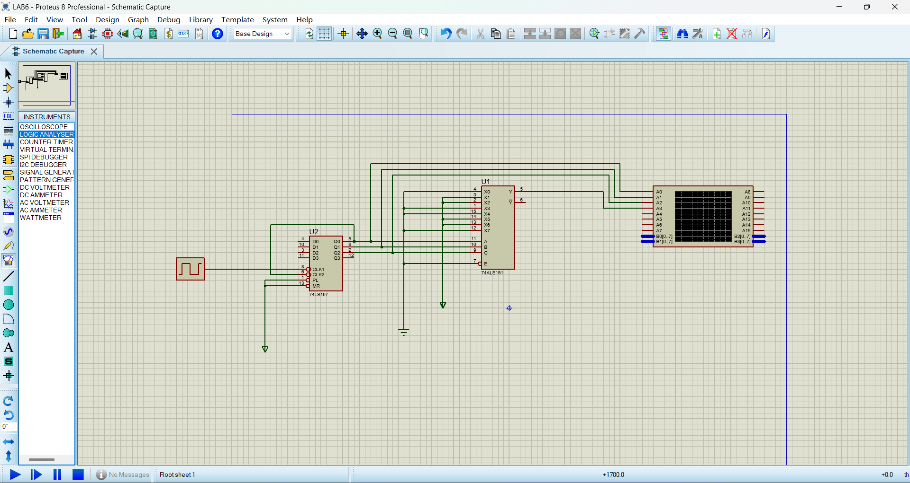
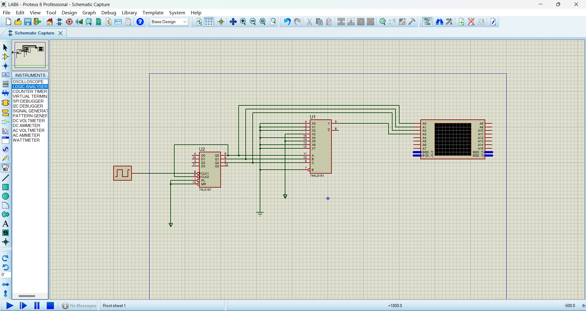
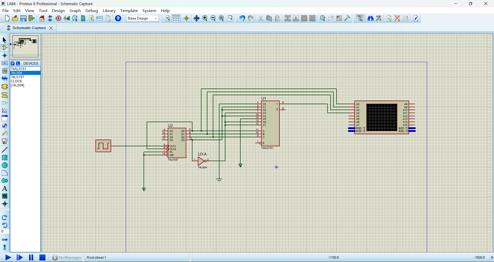
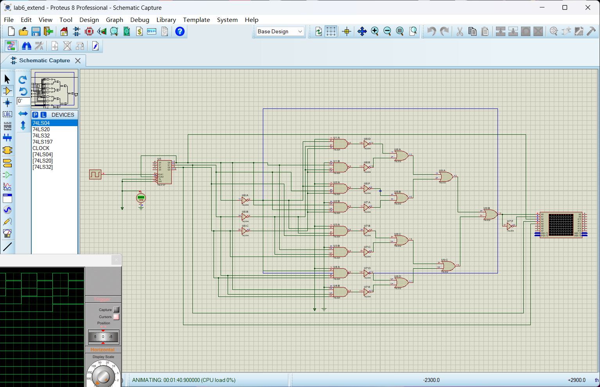
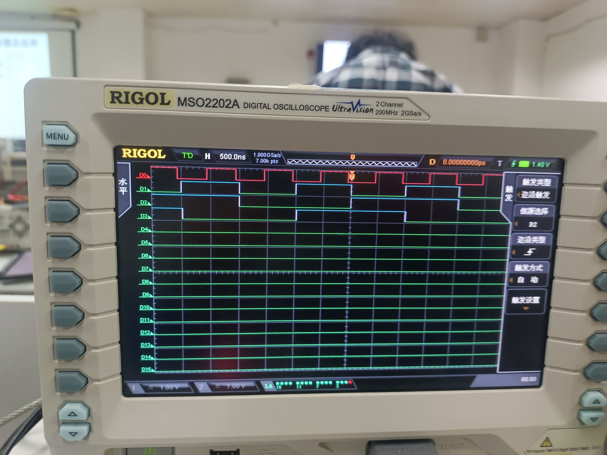
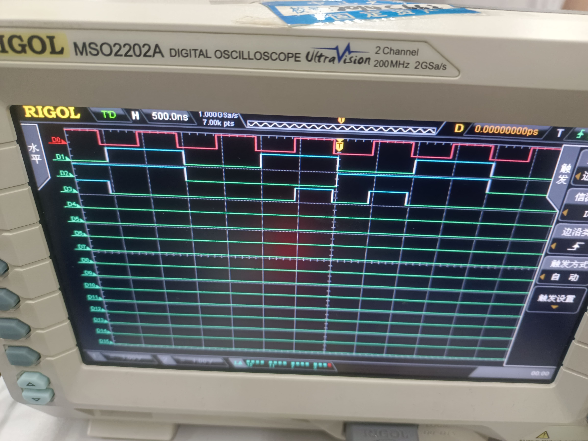
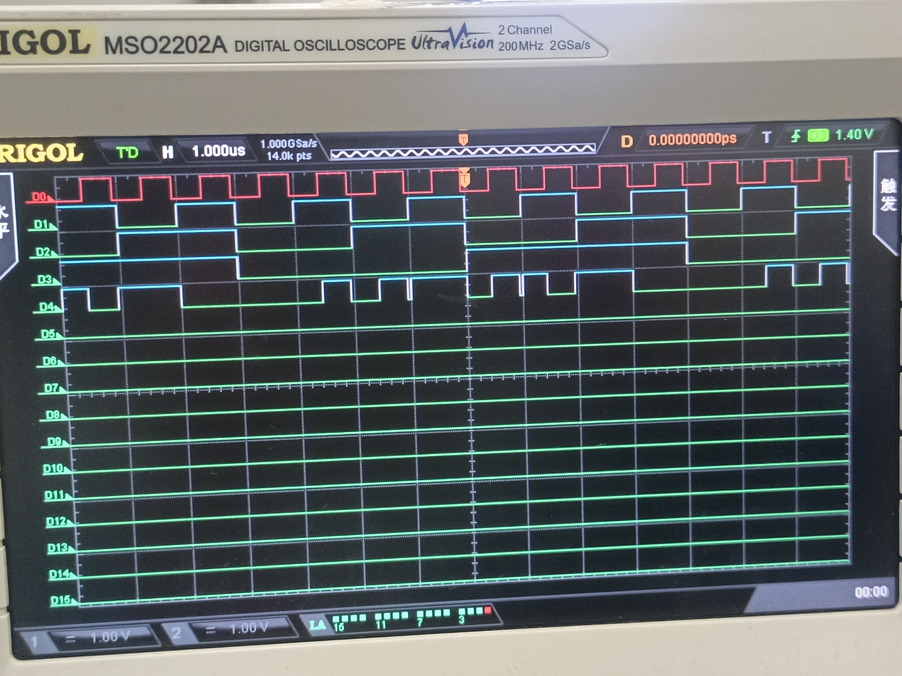
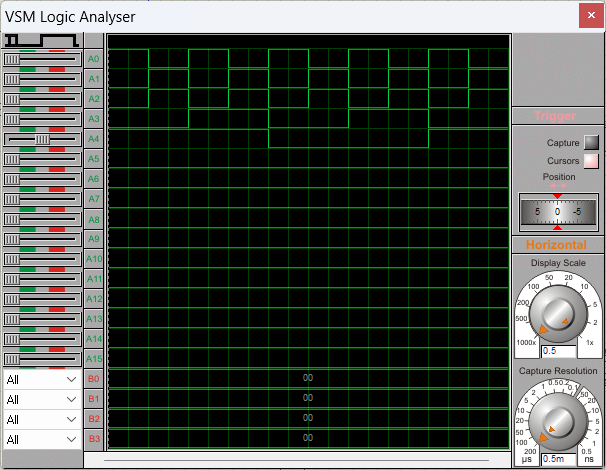

# 实验六：数据选择器电路原理及应用

## 一、 实验目的

1. 熟悉数据选择器的功能与使用方法。
2. 掌握用中规模集成电路（MSI）设计的组合逻辑电路的方法。

### 二、 实验设备：

1. 数字电路实验箱、逻辑分析仪。
2. 器件：74LS00，74LS197，74LS151

## 三、实验原理：

同实验指导书。

## 四、方法与步骤：

### 内容1：

真值表如下图：

| S | A | B | Y | $C_n$ |
| - | - | - | - | ------- |
| 0 | 0 | 0 | 0 | 0       |
| 0 | 0 | 1 | 1 | 0       |
| 0 | 1 | 0 | 1 | 0       |
| 0 | 1 | 1 | 0 | 1       |
| 1 | 0 | 0 | 0 | 0       |
| 1 | 0 | 1 | 1 | 1       |
| 1 | 1 | 0 | 1 | 0       |
| 1 | 1 | 1 | 0 | 0       |

依据实验指导书所给定的实验原理，可以得到如下表达式。

$$
Y = \overline{S}\overline{A}\overline{B}*0 + \overline{S}\overline{A}B*1 + \overline{S}A\overline{B}*1 + \overline{S}AB*0 + S\overline{A}\overline{B}*0 + S\overline{A}B*1 + SA\overline{B}*1 + SAB*0
$$

$$
C_{n} = \overline{S}\overline{A}\overline{B}*0 + \overline{S}\overline{A}B*0 + \overline{S}A\overline{B}*0 + \overline{S}AB*1 + S\overline{A}\overline{B}*0 + S\overline{A}B*1 + SA\overline{B}*0 + SAB*0
$$

依据上述公式，将$D_0$-$D_7$对应连接高低电平即可，连接电路如下图，其中第一个图为Y连接图，第二个为$C_n$链接图：

### 内容2：

| $S_1$ | $S_0$ | A | B | Y |
| ------- | ------- | - | - | - |
| 0       | 0       | 0 | 0 | 0 |
| 0       | 0       | 0 | 1 | 0 |
| 0       | 0       | 1 | 0 | 0 |
| 0       | 0       | 1 | 1 | 1 |
| 0       | 1       | 0 | 0 | 0 |
| 0       | 1       | 0 | 1 | 1 |
| 0       | 1       | 1 | 0 | 1 |
| 0       | 1       | 1 | 1 | 1 |
| 1       | 0       | 0 | 0 | 0 |
| 1       | 0       | 0 | 1 | 1 |
| 1       | 0       | 1 | 0 | 1 |
| 1       | 0       | 1 | 1 | 0 |
| 1       | 1       | 0 | 0 | 1 |
| 1       | 1       | 0 | 1 | 1 |
| 1       | 1       | 1 | 0 | 0 |
| 1       | 1       | 1 | 1 | 0 |

将$S_0$AB作为74LS151的CBA输入，则比对当CBA输入相同时，$S_1$与Y的对应关系，得到下面的表达式：

$$
Y = \overline{S}\overline{A}\overline{B}*0 + \overline{S}\overline{A}B*D_1 + \overline{S}A\overline{B}*D_2 + \overline{S}AB*\overline{D_3} + S\overline{A}\overline{B}*D_4 + S\overline{A}B*1 + SA\overline{B}*\overline{D_6} + SAB*\overline{D_7}
$$

依据以上逻辑公式，连接电路图如下：

### 思考与提高：门电路实现八选一数据选择器

实现这个八选一数据选择器需要接受11个输入，包括三个选择信号和八个输入信号，输出两个信号分别是被选择的信号以及其反相，由于中间需要将三个输入转变成八个选择信息的过程，如果能够用74LS138那么电路设计将会简便很多，由于只能使用门电路，所以这里的电路设计比较复杂，思路是通过与门的性质来控制输出。通过与门与非门的组合可以选择指定的信号，并通过或门输出出去。为了使电路设计简便一些，这里采用了四路输入的与非门与非门构成四路输入的与门来简化电路，输入信号为高低电平交替，即$X_0$输入为高电平 ，$X_1$输入为低电平，依次交替下去。电路设计如下：

## 五、验证结果

在实验箱上按照电路要求连接电路并用示波器观测如下，分别为内容1的Y，$C_n$内容2的Y的波形图：

Y的波形图中A与C的输出互换了，所以波形看起来有点奇怪。

上面三个通道为输入ABC的波形，下面两个通道分别为Y与$C_n$对应输出的波形。

上图为思考与提高中的仿真结果，其中上面两个通道为输出信号及其反相，下面为16进位计数器的输出，可以看到波形如预期的一样是高低电平交替。验证电路功能正常。

## 六、分析与讨论

在实验五已经分析过，半加半减器的Y输出波形实际仅与AB有关，与S无关，Y为AB异或操作的结果，本质上是二进制一位的加减运算真值表与异或真值表相同。而$C_n$的波形受三个信号的共同影响，因为加减的进/借位情况并不一样。

函数发生器的输出与四个信号都紧密相关，由选择信号将其一个周期分成四个区域，每个区域的信号都对应AB的对应操作，如在一个周期来看，相对于第一通道的信号周期作为参考1，Y的一个周期为8，分成了四个部分，每个部分为2，第一个部分为AB信号的与操作的结果，第二个部分为或操作的结果，第三个部分为异或操作的结果，第四个部分为A信号取反，三个部分的信号各不相同。

并且经过试验发现，若要求的输入为三个信号时（如半加半减器）则通常输入的待选择的信号由高低电平填充，若输入为四个信号（如函数发生器）则其输入的信号通常才与这四个信号的一个相关联（如本次实验中与$S_0$关联）。

比较74LS138,74LS151,门电路实现组合逻辑电路三种方法之后，我发现它们有不同的应用场景，就74LS138与74LS151相比，前者更适用于有较多输出需求的情况下，并且只有一个输入，更适合于逻辑设计时将信号即时送入不同的场景下，强调按规则对信号的转移；而后者更倾向于多对一的筛选场景，在要求多输出的场景中不占优势，倾向于在多种输入信号中按规则筛选出适合的信号，强调筛选。但它们都相比于门电路使电路设计更加简洁灵活。门电路可以根据自己需求设计精确的符合自己需求的电路，但往往电路比较复杂，且不灵活，功能单一，一旦有功能的改变需求都基本要重新设计。

通过上述实验，我理解了数据选择器的原理及其应用，对组合逻辑电路的掌握更进一步，受益匪浅。
