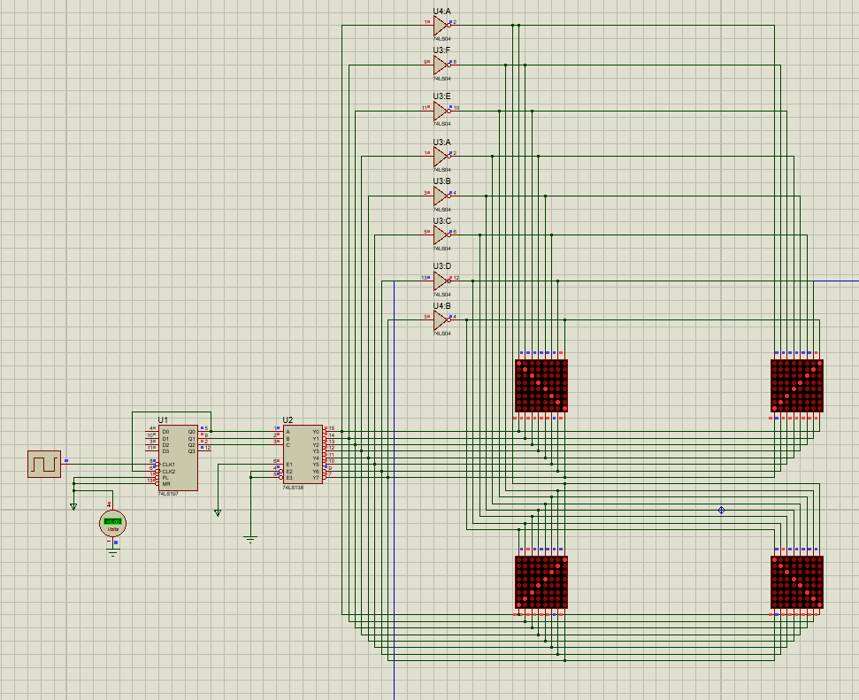
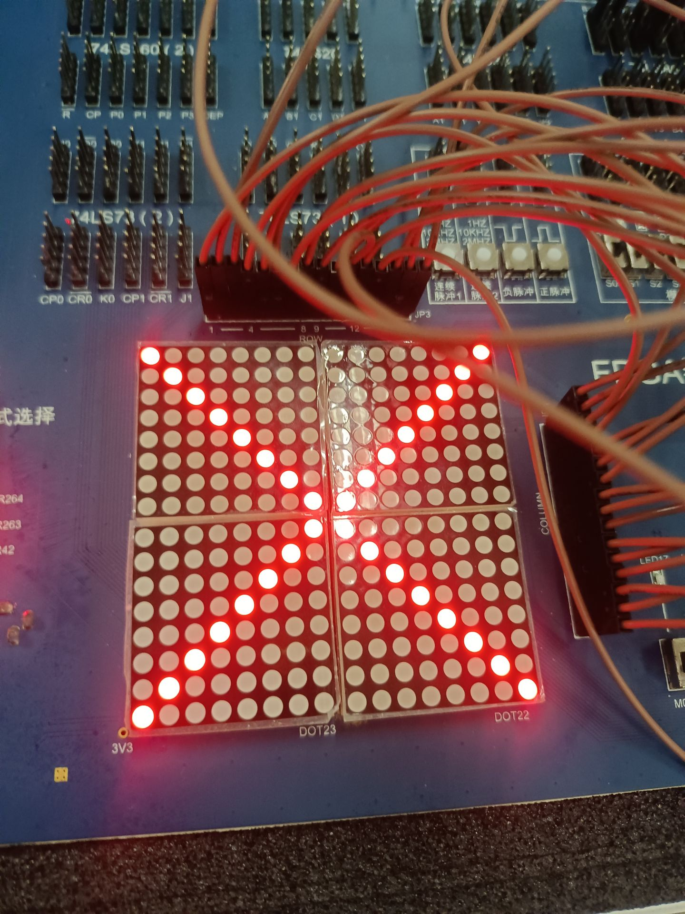
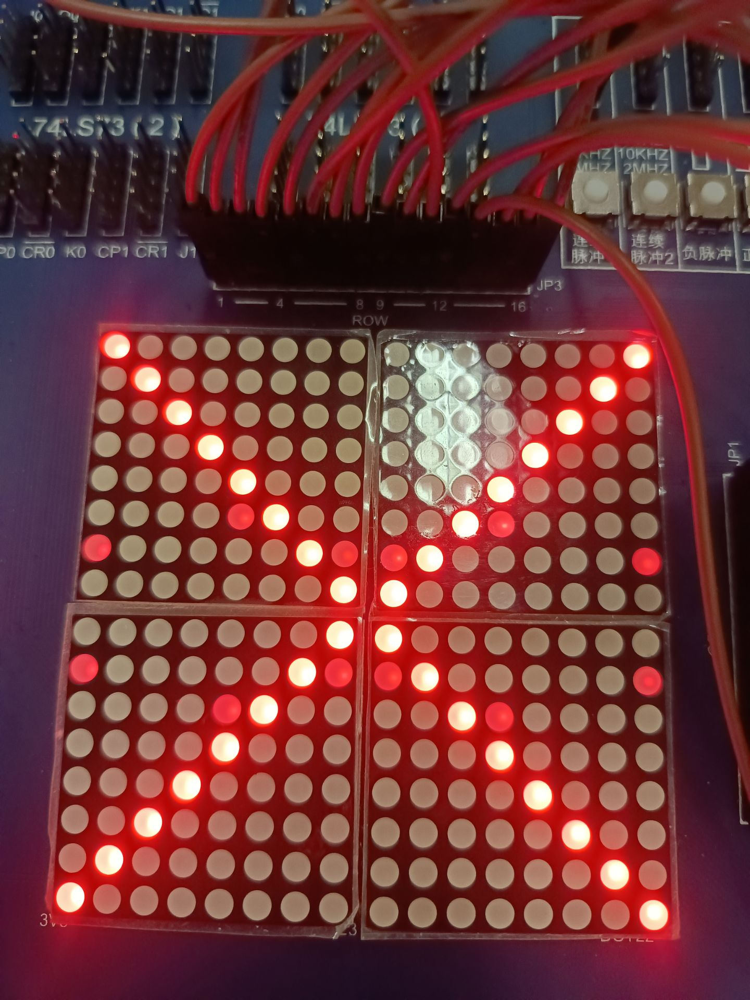
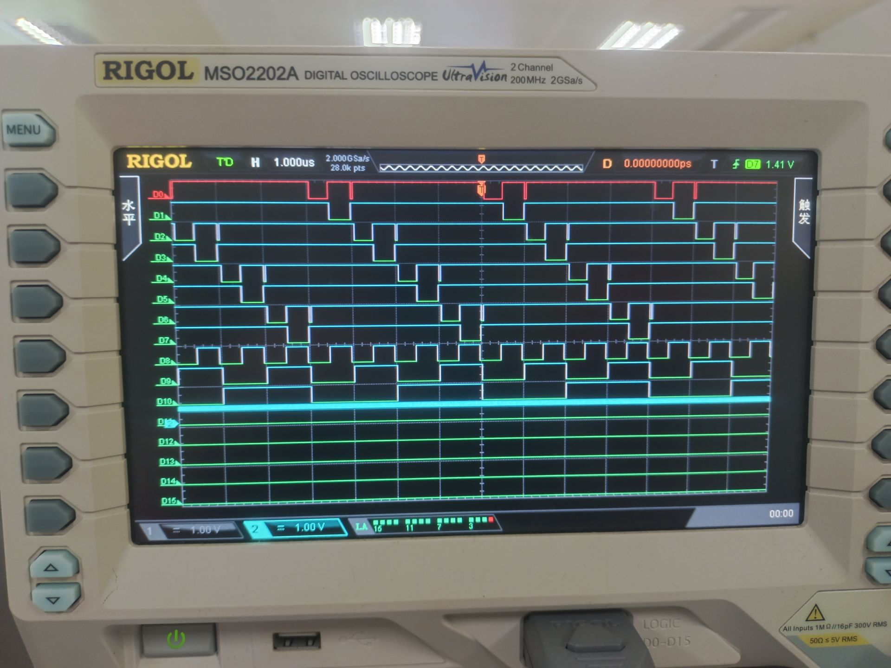
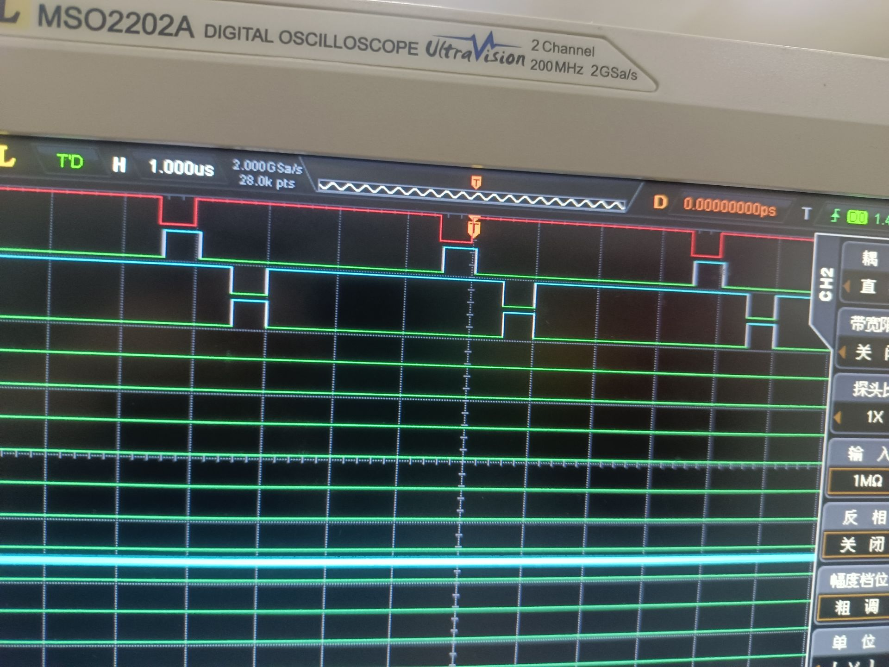
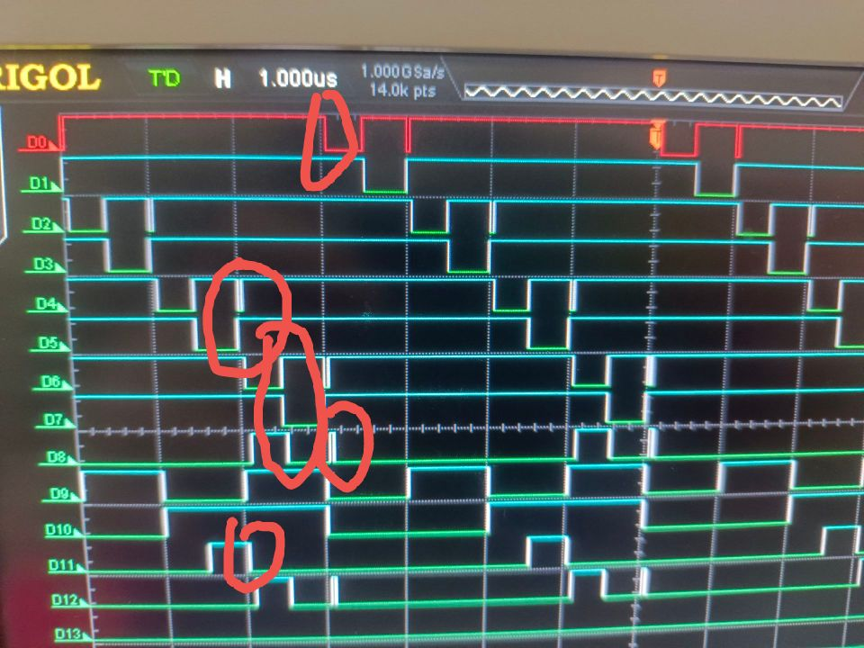
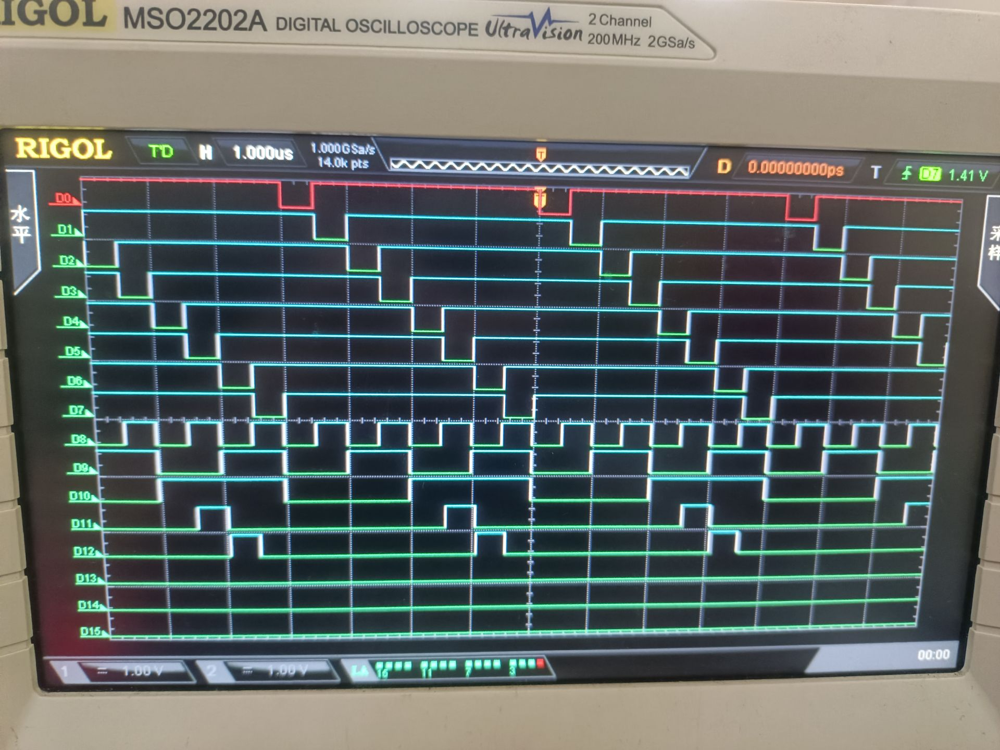
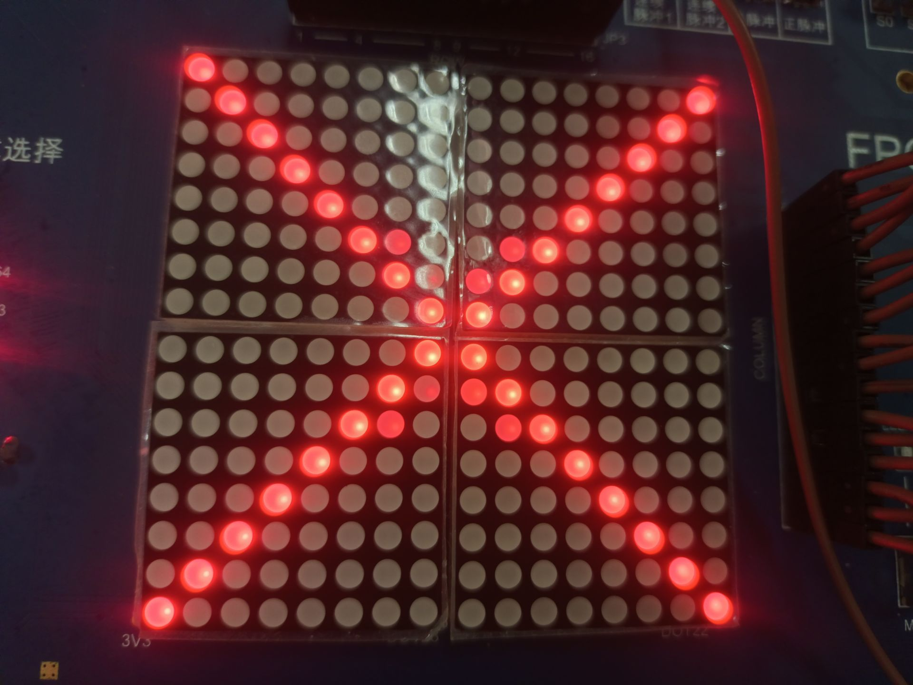

# 实验八：译码显示电路（2）点阵的原理和应用

## 一、 实验目的

1. 熟悉点阵的显示原理。
2. 掌握点阵的扫描式显示的电路设计方法。

### 二、 实验设备：

1. 数字电路实验箱、逻辑分析仪。
2. 器件：16*16点阵、74LS138 、74LS00等。

## 三、实验原理：

同实验指导书。

## 四、方法与步骤：

依据实验指导书所展示的原理，连接16进制计数器并将其低3位输出信号连接好3-8线译码器（这里用8进制计数器更加好，因为我的实验电路选择了16进制制计数器所以这里不再更改），得到8个输出信号因为列电平低电平有效，并且图像左右对称，所以可以用列扫描信号每次选择点阵对称的两侧。

列出16进制计数器为输入，行电平为输出的真值表。

| $Q_0$ | $Q_1$ | $Q_2$ | $R_1$ | $R_2$ | $R_3$ | $R_4$ | $R_5$ | $R_6$ | $R_7$ | $R_8$ | $R_9$ | $R_{10}$ | $R_{11}$ | $R_{12}$ | $R_{13}$ | $R_{14}$ | $R_{15}$ | $R_{16}$ |
| ------- | ------- | ------- | ------- | ------- | ------- | ------- | ------- | ------- | ------- | ------- | ------- | ---------- | ---------- | ---------- | ---------- | ---------- | ---------- | ---------- |
| 0       | 0       | 0       | 1       | 0       | 0       | 0       | 0       | 0       | 0       | 0       | 0       | 0          | 0          | 0          | 0          | 0          | 0          | 1          |
| 0       | 0       | 1       | 0       | 1       | 0       | 0       | 0       | 0       | 0       | 0       | 0       | 0          | 0          | 0          | 0          | 0          | 1          | 0          |
| 0       | 1       | 0       | 0       | 0       | 1       | 0       | 0       | 0       | 0       | 0       | 0       | 0          | 0          | 0          | 0          | 1          | 0          | 0          |
| 0       | 1       | 1       | 0       | 0       | 0       | 1       | 0       | 0       | 0       | 0       | 0       | 0          | 0          | 0          | 1          | 0          | 0          | 0          |
| 1       | 0       | 0       | 0       | 0       | 0       | 0       | 1       | 0       | 0       | 0       | 0       | 0          | 0          | 1          | 0          | 0          | 0          | 0          |
| 1       | 0       | 1       | 0       | 0       | 0       | 0       | 0       | 1       | 0       | 0       | 0       | 0          | 1          | 0          | 0          | 0          | 0          | 0          |
| 1       | 1       | 0       | 0       | 0       | 0       | 0       | 0       | 0       | 1       | 0       | 0       | 1          | 0          | 0          | 0          | 0          | 0          | 0          |
| 1       | 1       | 1       | 0       | 0       | 0       | 0       | 0       | 0       | 0       | 1       | 1       | 0          | 0          | 0          | 0          | 0          | 0          | 0          |

接下来列出行输出表达式，通过观察可以发现：

$$
R_i = R_{17-i} = \overline{Y_{i - 1}} \quad 1<=i<=16
$$

接下来就是依据真值表连接电路，修改时钟频率之后，如下图所示：

图中用了两个八个反相器，但是碍于实验箱的实验条件，只有六个反相器可供使用，对于剩下的两个信号，采用的是与高电平异或的方法得到反相信号，**这会导致一些问题，下文详尽分析。**

## 五、验证结果

## 六、分析与讨论

### 解决高频率下显示出现异常的现象：

在高频率的时钟下，显示信号输出会产生如下效果：

可以看见在预料之外的地方会产生微弱的红色信号，这不是我们想要的，并且产生红色信号的部分就是采用异或电路实现反相器的两个信号，接下来将找出显示产生错误的原因。

首先示波器显示3-8译码器的波形，上面八个为输出信号，下面三个为输入信号：

可以明显看到**由于逻辑门带来的时延，导致间隔一个信号会出现毛刺**。

接下来观察采用异或逻辑门实现的反相器以及直接使用反相器产生反相信号的波形图（最上面两组为异或实现的反相器，下面两组为直接使用反相器得到的信号），通过观察可以清楚发现**异或逻辑门制作的反相器产生的时延相比于直接反相器的时延要大**：

将两个图综合来看（D11与D12分别是D5和D6的反相信号，这两个反相信号都是异或制作的反相器，为了方便比较，将D12信号与D8信号一致，均为D6反相信号），通过红色圈出来的地方，会发现：D11和D5，D4通道来看，由于毛刺和异或制作的反相器的时延，导致**D11为高电平的过程中对应的D4和D4都是高电平，由于D4毛刺占比较小，所以发出的颜色较浅，**这与展示的有问题的显示图中第6行和第11行（从下往上数）的显示错误一致。对于D8信号和D6、D7、D0信号，由于异或逻辑门的时延，导致D6与D7信号都是有效的，并且D8的毛刺导致D0信号也是有效的（**按理想来说是不会导致该毛刺与D0重合的，因为D6的毛刺使得D0的信号也稍微延迟了一下，正好错开才对，但是有异或逻辑门时延，D0与毛刺重合了**），这与有问题的显示图中第7行与第10行显示错误一致。**在低频率下毛刺微不足道并且占比十分微小，所以显示不出来，但是高电平下，毛刺的占比变大（时延是固定的，时钟信号的周期变小了），在显示上显示出来了。**

从上面的分析可以看到，引起显示错误的主要是3-8译码器的输入时延引起的输出毛刺和异或逻辑门的时延导致的。只要解决这两个问题就可以解决显示错误。

对于毛刺问题，观察前面的3-8译码器波形图，可以发现是由于$Q_1$与$Q_2$时延导致的。**因此解决毛刺的思路是将$Q_0$也进行相应的延迟使其保持延迟一致，对于$Q_0$在接入3-8译码器输入之前，先接入一个与门与高电平相与，再接入3-8译码器，这样既不改变信号，又能完成一定延迟，从而完美解决了毛刺。**下图是改进后3-8译码器的波形图，可以看到没有毛刺了：

下图是改进后的显示图，可以看到由于毛刺引起的显示错误不存在了（因为毛刺消失了，所以D4的毛刺导致的D6的微小时延没有了，成为了D6与D11重合，所以显示错误从D4重合转成了D6重合，第6行和第11行的显示错误变化了，显示错误只有异或逻辑门时延导致的了）：

对于时延问题，这个解决其实很简单，只要有足够的反相器就可以解决，因为不像解决毛刺，可以允许输入时延存在只解决输出的信号的问题，这个问题的产生是单纯的相位偏差了，如果想要完全解决这个问题，**正面思考方法就是降低时延**，对于反相信号（即输入的行信号）来说，只能让逻辑电路没有时延或者时延十分的小（异或门电路制作的反相器与缓冲器结合，放大信号加快传输速度；或者统一用反相器），（因为信号是周期的且依次选通，反相信号都延迟那么出现的错误只能更多）

或者还有一种解决方法，**延迟列信号的输入时间，让每一个列信号不是紧挨着选通，中间都有一段小间隔即可。**以上一张波形图所示，对于D11与D6所示的延迟导致有一部分重合问题，那么除了减小D11的延迟之外还可以延迟D6（实现方法同解决毛刺），让D6与D5错开一段距离，从而避免延迟，按照这个想法，D6错开势必会导致D12（D6的反相信号）与D7重合加大，那么就需要延迟D7两倍的时延（D6为了避免与D5反相信号重合主动加入的时延 + D6因为异或门实现反相器而产生的时延）。D7延迟又要让D0信号延迟，D0延迟又要让D2延迟......这样理论上是可行的，但是因此增加的冗余门电路太多了，可行性不高，我在实验室里面实现了一下（因为当时认为可行性不高所以没有拍照），的确是可以解决某个信号的显示的问题，可与之而来的就是电路过于复杂，遂放弃。

以上就是高频率下点阵显示异常的原因及解决方案，主要原因就是实际情况下的硬件客观条件导致的。

### 行扫描与列扫描的显示区别：

因为行与列的有效信号相反，所以在分析过程中要注意在行扫描下列行信号与列信号真值表时，对于列信号，0代表点亮，所以真值表上要注意这一点。并且在时间点亮过程中，由于是行信号依次被选择，所以显示的顺序应该是行依次点亮，与列依次点亮不同。

### 总结：

点阵的扫描式显示首先要选择是进行行扫描还是列扫描，要注意到行与列的对应的有效电平相反，假如选择采用列扫描，那么依据列扫描的每一列选通时的预期选通情况列出真值表，依据真值表列出行扫描的表达式，设计电路，进行连接。行扫描思路也是一样的。在此过程中也可以利用图像的对称性来简化电路设计。其步骤仍然是**分析需求-列真值表-推出表达式-设计电路-实验求证**。利用电路来达到人的需求。

创新点上，**找出了在频率较高的情况下由于毛刺和逻辑门延迟而导致的实际中点阵显示异常的情况，详细分析了原因，并给出了解决方法，通过消除毛刺和缩小时延来保证高频率下点阵显示的正确性。**

通过点阵的学习，我学会了点阵的工作原理，明白了点阵扫描显示的实现方法与步骤，并进行了实验。实验过程中我深深体会到在电路设计中，理想的电路图与实际电路之间的区别，明白了电路图中的一些设计的背后的想法，并且也为达到更好的电路而进行了努力，这次实验我不仅收获了数字电路知识，更锻炼了自己分析解决问题的能力，受益颇多。
