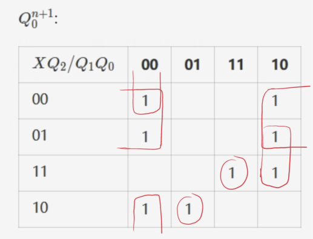
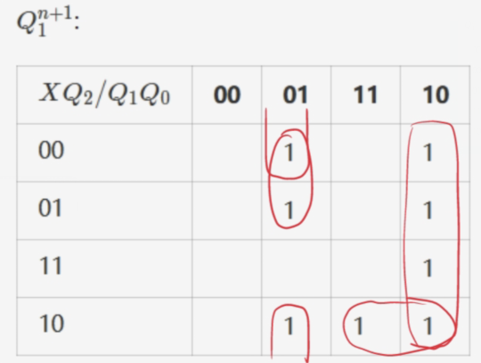
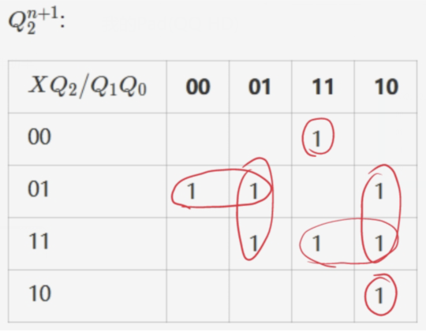
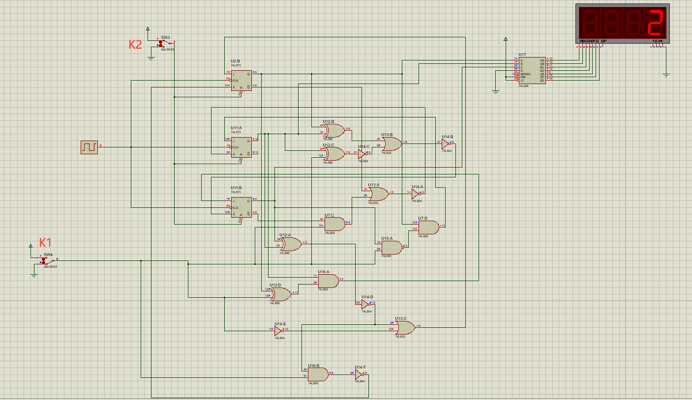
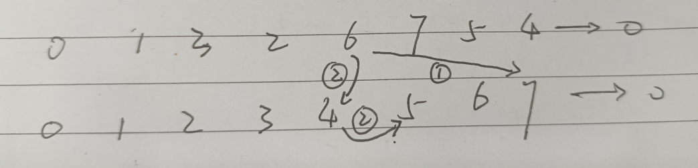
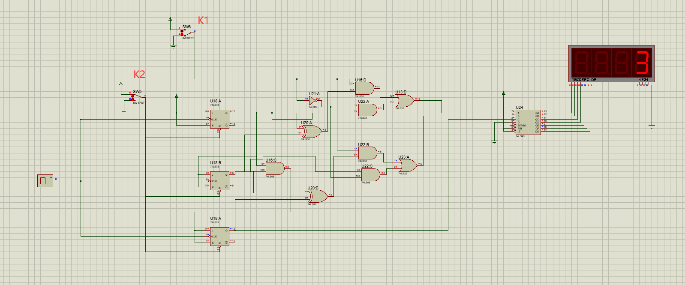
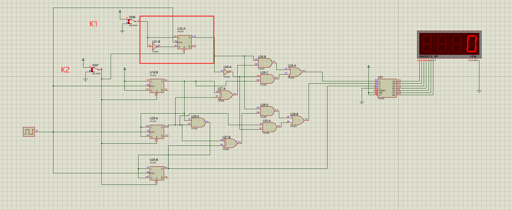

# 期末考核实验报告

学号：22320021   姓名：陈安康

## 实验目的：

实现二进制计数器。

实现清零功能。

实现通过开关控制格雷码和二进制计数器的转换。

在七段发光二极管上进行对应电路功能的展示。

##  实验原理：

接下来通过两种方法实现题目要求的电路：

### 第一种方法：

将开关K1的输入记作X，通过X输入来确定需要转换的状态，转换的新状态再依据X输入进行转换，以此往复下去，从而实现两个计数器切换的电路要求。为了方便，直接以$Q_2Q_1Q_0$的取值来表示状态，则依据题目要求，列出的状态表如下，表格中的每一格内容是在当前状态下输入为X时的下一个状态：

| $Q_2Q_1Q_0/X$ | 0   | 1   |
| --------------- | --- | --- |
| 000             | 001 | 001 |
| 001             | 010 | 011 |
| 010             | 011 | 110 |
| 011             | 100 | 010 |
| 100             | 101 | 000 |
| 101             | 110 | 100 |
| 110             | 111 | 111 |
| 111             | 000 | 001 |

不同于实验16，触发器中的状态是我们要显示的内容，因此该表不能进行化简（实际上也没法化简）。很容易可以推知，我们需要3个触发器。

接下来将上图转换成每一位的次态卡诺图，然后进行化简。

由于每一项的卡诺图包含的项过多，考虑到实验箱的逻辑门限制，如果直接连线则会导致逻辑门不够用的情况，因此需要对逻辑式进行化简。化简方式有很多，这次我的化简过程主要用到了异或的逻辑表达式：

$$
X\oplus Y = \overline{X}Y + X\overline{Y}
$$

$$
\overline{X\oplus Y} = \overline{X}\,\overline{Y} + XY
$$

JK触发器的特征方程如下：

$$
Q^{n + 1} = J\overline{Q^{n}} + \overline{K}Q^{n}
$$

每一位的次态卡诺图如下：

得到的输出表达式如下：

$$
Q_0^{n + 1} = \overline{Q_2^{n}}\,\overline{Q_1^{n}}\,\overline{Q_0^{n}} + Q_2^{n}Q_1^{n}\overline{Q_0^{n}} + \overline{X} \,\overline{Q_0^{n}} + X\overline{Q_2^{n}}\,\overline{Q_1^{n}}\,Q_0^{n} + XQ_2^{n}Q_1^{n}Q_0^{n}
$$

通过对比JK触发器的特征方程，然后化简，得到J与K的驱动方程：

$$
J_0 = \overline{Q_2^{n}\oplus Q_1^{n}} + \overline{X}\quad K_0 = \overline{X(\overline{Q_2^{n}\oplus Q_1^{n}})}
$$

得到的输出表达式如下：

$$
Q_1^{n + 1} = Q_1^{n}\overline{Q_0^{n}} + \overline{Q_2^{n}}\,\overline{Q_1^{n}}Q_0^{n} + \overline{X} \,\overline{Q_1^{n}}Q_0^{n} + X\overline{Q_2^{n}}Q_1^{n}
$$

通过对比JK触发器的特征方程，然后化简，得到J与K的驱动方程：

$$
J_1 = Q_0^{n}(\overline{XQ_2^{n}}) \quad K_1 = \overline{\overline{Q_0^{n}} + X\overline{Q_2^{n}}}

$$

得到的输出表达式如下：

$$
Q_1^{n + 1} = Q_2^{n}\,\overline{Q_1^{n}}Q_0^{n} + \overline{X}Q_2^{n}\overline{Q_1^{n}} + XQ_2^{n}Q_1^{n} + Q_2^{n}Q_1^{n}\overline{Q_0^{n}} + \overline{X}\,\overline{Q_2^{n}}\,Q_1^{n}\,Q_0^{n} + X\,\overline{Q_2^{n}}\,Q_1^{n}\overline{Q_0^{n}}
$$

通过对比JK触发器的特征方程，然后化简，得到J与K的驱动方程：

$$
J_2 = Q_1^{n}(\overline{X\oplus Q_0^{n}})\quad K_2 = \overline{(\overline{X\oplus Q_1^{n}}) + (Q_1^{n}\oplus Q_0^{n})}
$$

对于清零功能的实现，只需要将触发器清零端接一个开关进行控制即可。

依据上面的驱动方程进行连接仿真电路如下：

接下来分析一下是否可以在实验箱的条件限制下实现该电路。此电路用了4个异或门，3个或门，4个与门，1个与非门，6个非门，经过化简后的逻辑电路可以在实验箱的条件下实现，该电路可行性过关。

### 第二种方法：

第二种方法的思路与第一种完全不同。第一种思路是将二进制计数器与格雷码计数器抽象成状态进行电路整体设计，第二种思路则是靠近二进制与格雷码的具体内在关系来一步步进行电路设计：

首先我们实现二进制计数器，然后通过二进制与格雷码的关系来实现对应位置的格雷码的输出项，紧接着通过构造二选一数据选择器来实现选择的功能。清零功能的实现与方法一一致，通过开关控制触发器清零端来实现。

这里我们需要先实现二进制计数器，分析过程也是通过每一位的次态卡诺图列出输出表达式，对比JK触发器的特征方程得到输出方程。

每一位的次态卡诺图如下：

$Q_0^{n+1}$:

| $Q_2 / Q_1Q_0$ | 00 | 01 | 11 | 10 |
| ---------------- | -- | -- | -- | -- |
| 0                | 1  |    |    | 1  |
| 1                | 1  |    |    | 1  |

$$
Q_0^{n + 1} = \overline{Q_0^{n}}
$$

$$
J_0 = K_0 = 1
$$

$Q_1^{n+1}$:

| $Q_2 / Q_1Q_0$ | 00 | 01 | 11 | 10 |
| ---------------- | -- | -- | -- | -- |
| 0                |    | 1  |    | 1  |
| 1                |    | 1  |    | 1  |

$$
Q_1^{n + 1} = \overline{Q_1^{n}}Q_0^{n} + Q_1^{n}\overline{Q_0^{n}}
$$

$$
J_0 = K_0 = Q_0^{n}
$$

$Q_2^{n+1}$:

| $Q_2 / Q_1Q_0$ | 00 | 01 | 11 | 10 |
| ---------------- | -- | -- | -- | -- |
| 0                |    |    | 1  |    |
| 1                | 1  | 1  |    | 1  |

$$
Q_1^{n + 1} = Q_2^{n}\overline{Q_0^{n}} + Q_2^{n}\overline{Q_1^{n}} + \overline{Q_2^{n}}Q_1^{n}Q_0^{n}
$$

$$
J_0 = K_0 = Q_0^{n}Q_1^{n}
$$

然后我们再依据二进制与格雷码的关系来构造每一位的格雷码输出，依据之前的学习我们知道，**格雷码的最高位与二进制码的最高位相同，接下来的每一位都是二进制码对应位与其上一位异或的结果**。由此我们可以得到每一位格雷码的输出。

然后我们通过逻辑门来构造二选一数据选择器，假设S表示K1开关的状态，X1表示二进制码输出，X2表示格雷码输出，那么依据要求，我们可以得到如下状态表：

| S | output |
| - | ------ |
| 0 | X1     |
| 1 | X2     |

将上面的X1与X2进行展开：

| S X1 X2 | output |
| ------- | ------ |
| 000     | 0      |
| 001     | 0      |
| 010     | 1      |
| 011     | 1      |
| 100     | 0      |
| 101     | 1      |
| 110     | 0      |
| 111     | 1      |

列出output的表达式，经过化简后如下：

$$
output = \overline{S} X_1 + S X_2
$$

因为最高位格雷码与二进制码总是一样的，所以我们只要构造两个二选一数据选择器就好。

连接电路如下：

### 两种实验方法的不同对比以及对第二种方法的改进：

值得注意的是，**两种方法在进行计数器转换时表现出的功能是不一样的**。对于方法1，若在二进制运行状态下切换到格雷码状态下，那么下一个状态是从二进制数值对应的格雷码的下一个状态，格雷码切换到二进制状态也是一样。但对于第二种方法实现的电路，则是切换到对应的“同级”的状态然后往下计数。例如，如果在格雷码进行运行，运行到110，此时切换开关到二进制计数，对于第一种方法，下一个状态会是110在二进制计数下的下一个状态111；而第二种方法实现的电路会瞬间变成100（100 “对应”格雷码的110），然后下一个状态变成101，如下图所示：

为什么会有这个差异呢?其实**本质上是两个电路的实现思路的不同而导致的**。第一种方法对下一个状态的明确规定明确了状态转移的顺序（当然我也可以随便更改状态转移图而实现其他的状态转移过程，只不过本次实验的第一种方法我规定了转移按照此种情况进行）。本质上是次态图的设计对状态转移的方法进行了规定。**它在设计过程中没有区分所谓的二进制计数和格雷码计数，而是把他们统一看成了一系列需要设计转移顺序的状态罢了**。所展示的内容就是触发器中的内容。而**第二种方法其实有种“包装”的意味**，因为其实它所展示的内容不一定是触发器中保存的真实内容，触发器一直在进行二进制计数，而我们通过逻辑门的包装使得它可以按照我们的要求展示格雷码而已，一旦进行状态转换，比如上面的例子，由于逻辑门是组合元件，那么就会出现瞬变情况来暴露出触发器的真实数值。

这里的举例中从6到4的瞬变是由于我们的逻辑门是组合元件，开关输出后会瞬间相应。如果想要消除这个瞬变也很简单，只要在K1开关的基础上添加一个下降沿触发的D触发器进行锁存即可，这样对于上面的例子，采取如下电路就会直接从6变成5，而不会瞬变成4再变成5（因为没有规定具体的转换后的要求，那么理论上换过去就可以，所以不知道这算不算改进）：

对比两种方法，第一种实现方法无疑是复杂的，尤其对于逻辑表达式的化简比较繁复。但其好处在于可以一定程度上实现自定义的状态转移逻辑（我只要通过修改状态表，那么状态转移的过程就会被我自定义，因为考核题目没有对状态转移的细节进行具体要求）。而第二种方案优点在于设计简单，缺点就是状态转移逻辑是固定的，在某些情况下可能不符合要求。

## 仿真电路：

方案一的仿真电路：

方案二不加触发器锁存时的仿真电路：

方案二加了触发器锁存时的仿真电路：

## 实验结果：

由于在考试过程中没有完成任务，所以没有实验过程截图。仿真电路的实验结果在截屏情况下展示在上面的电路中。
