# 图形学渲染与着色作业报告

学号：22320021  姓名：陈安康

## 1.实现三角形的光栅化算法

因为项目中实现的插值函数只能依据x方向进行插值，当x方向变化较小时，**会出现插值精度下降的问题**，而且这个问题会严重影响深度插值的准确性，因此，在原代码的基础上，对插值代码进行了小改进，在插值之前会计算两个顶点在x与y维度上面的差值，选取差值绝对值较大的维度作为插值依据，这样能大大提高插值计算的准确性。

改进代码如下：

```c++
FragmentAttr getLinearInterpolation(const FragmentAttr& a, FragmentAttr& b, int x_position, int y_position){
    FragmentAttr result;
    result.x = x_position;
	result.y = y_position;
	float dy = float(b.y - a.y);
	float dx = float(b.x - a.x);
    float t = (x_position - a.x) / float(b.x - a.x);
	if (abs(dy) > abs(dx)) {
		t = (y_position - a.y) / float(b.y - a.y);
	}
    result.z = a.z + t * (b.z - a.z);

    result.color.r = a.color.r + t * (b.color.r - a.color.r);
    result.color.g = a.color.g + t * (b.color.g - a.color.g);
    result.color.b = a.color.b + t * (b.color.b - a.color.b);

    result.normal.x = a.normal.x + t * (b.normal.x - a.normal.x);
    result.normal.y = a.normal.y + t * (b.normal.y - a.normal.y);
    result.normal.z = a.normal.z + t * (b.normal.z - a.normal.z);

    result.pos_mv.x = a.pos_mv.x + t * (b.pos_mv.x - a.pos_mv.x);
    result.pos_mv.y = a.pos_mv.y + t * (b.pos_mv.y - a.pos_mv.y);
    result.pos_mv.z = a.pos_mv.z + t * (b.pos_mv.z - a.pos_mv.z);

    return result;
}
```

下面是改进的效果，在没有改进前，直接用插值函数的代码计算深度插值，由于两个顶点的x维度相差不大，导致边的深度计算出现问题，如下图所示：

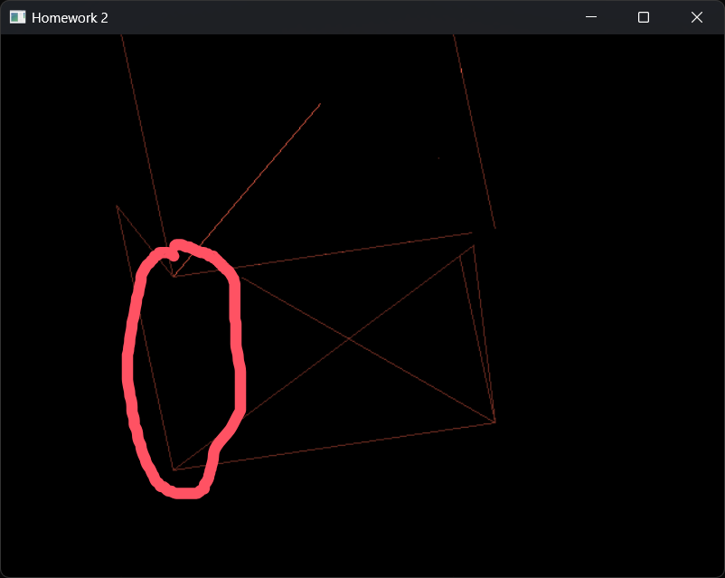

改进后，由于会自动选择差距较大的维度进行插值计算，提升的插值计算的精度，使绘制不出现错误。

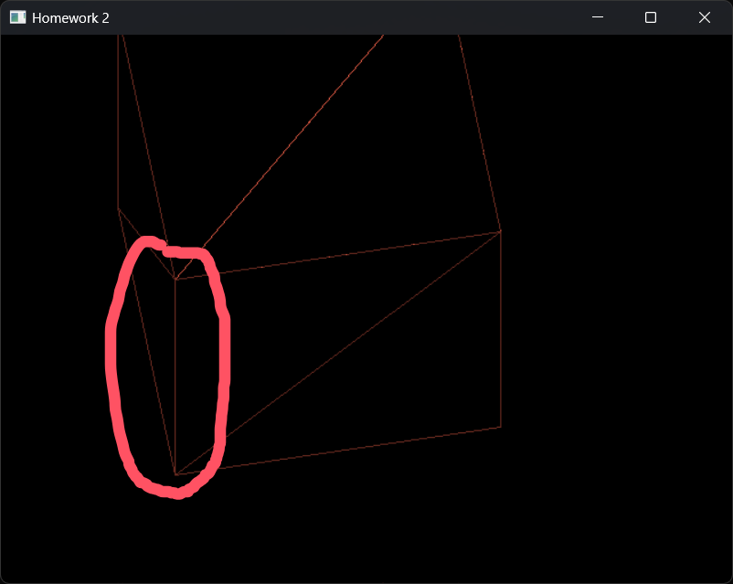

对于最后呈现效果中的色块噪声，在我反复思考和与他人交流后后感觉不是代码问题，应该是计算机性能或者模型加载的问题。因为在不同计算机上，不同的实现代码都会出现这个情况，甚至教程中的演示图片里面也有这种情况的存在。所以这里对这次问题不过多讨论。

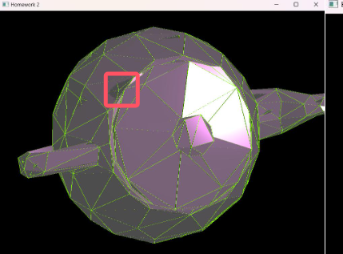

为了按键的方便，我修改了源文件中的按键，w为切换场景到scene_0，E为切换场景到scene_1，Q为镜头旋转。

### 1.1：用DDA实现三角形边的绘制

在完全理解了整个项目的运行流程和逻辑后，仿照教程给定代码中的bresenham算法的调用方式，编写DDA代码。算法的核心思想是根据起点和终点之间在 `x` 和 `y` 方向的差距，选择差距变化较大的维度作为主要步进方向，通过计算增量（步进值），然后逐步计算每个像素点的位置，直到到达终点。**在添加进缓冲区时，会对像素点有没有超出画布进行判断，若没有则加入画布，否则不加入。**

在这里维护了一个边的信息表，**这个信息表的表头记录像素点的y值，方便后续edge-walking算法的实现。** 会将y轴方向没有超出画布的像素点进行记录，通过改进后的插值函数获取点的法向量，深度等各种信息，将这个信息记录在边表中。

最终的代码中由于实现了光照渲染，所以采用光照渲染来进行颜色计算。

```C++
void MyGLWidget::DDA(FragmentAttr& start, FragmentAttr& end, int id) {
	//printf("hhh");
	float delta_x = end.x - start.x;
	float delta_y = end.y - start.y;
	int step = max(abs(delta_x), abs(delta_y));
	float dx = delta_x / step;
	float dy = delta_y / step;
	float x = start.x;
	float y = start.y;
	float z = start.z;
	float dz = (end.z - start.z) / step;
	vec3 color = start.color;
	// 缓冲区是行优先存储的
	for (int i = 0; i <= step; ++i) {
		int x_ = round(x);
		int y_ = round(y);
		// 维护表，考虑了画布外的情况
		FragmentAttr tmp = getLinearInterpolation(start, end, x_, y_);
		if (y_ < WindowSizeH && y_ >= 0) {
			auto it = std::find_if(edges.begin(), edges.end(), [&](std::pair<int, std::vector<FragmentAttr>> value) {
				return value.first == y_; });
			// 只需要填充x坐标就行
			if (it != edges.end()) {
				(*it).second.push_back(tmp);
			}
			else {
				edges.push_back({ y_,{tmp} });
			}
		}
		if (x_ < WindowSizeW && x_ >= 0 && y_ < WindowSizeH && y_ >= 0) {
			if (shade == "Phong") {
				temp_render_buffer[y_ * WindowSizeW + x_] = PhongShading(tmp);
			}
			else  if (shade == "Blinn_Phong") {
				temp_render_buffer[y_ * WindowSizeW + x_] = Blinn_PhongShading(tmp);
			}
			else if (shade == "Gouraud") {
				temp_render_buffer[y_ * WindowSizeW + x_] = tmp.color;
			}
			temp_z_buffer[y_ * WindowSizeW + x_] = tmp.z;
		}
		x += dx;
		y += dy;
		z += dz;
	}
}
```

为了计时观察性能，在paintGL()函数中增加计时代码，使用DDA绘制直线，运行如下（含Phong计算运行耗时）：

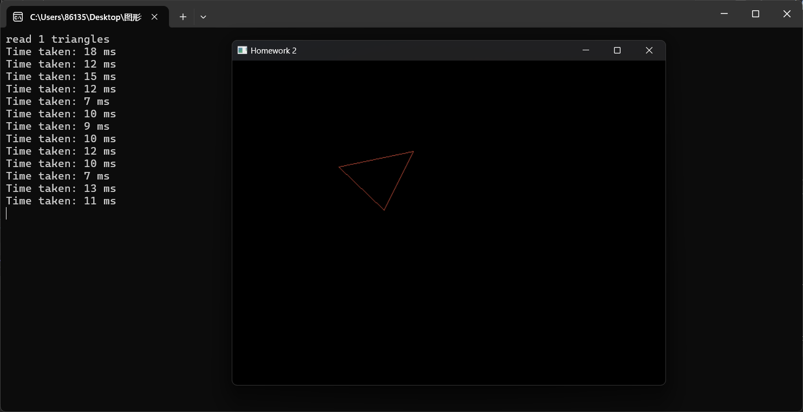

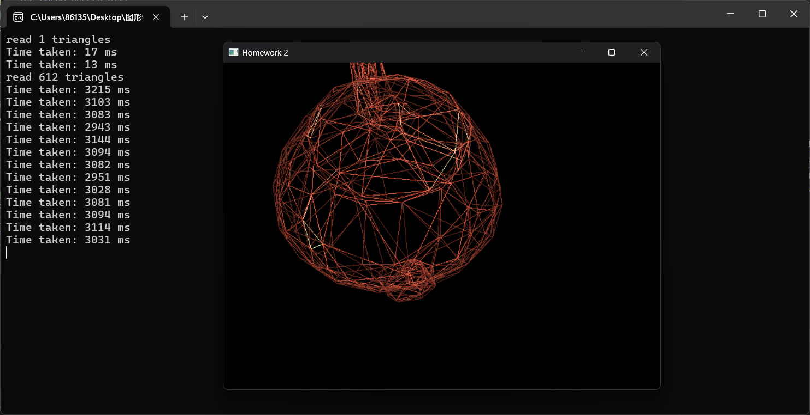

### 1.2：用bresenham实现三角形边的绘制

在给定的函数体中进行代码实现，bresenham的最主要的**目标是避免浮点数计算，从而减少性能开销，而是仅仅使用简单的整数运算来高效地获取直线上的像素点**。代码是从教程PPT中的伪代码基础上，考虑顶点的不同位置关系进行修改得到的。同样是考虑了绘图在画布之外的情况，依据和DDA代码一样的处理方法进行处理，在代码中维护了边表，通过Phong计算了像素点颜色：

```c++
void MyGLWidget::bresenham(FragmentAttr& start, FragmentAttr& end, int id) {
	//// 根据起点、终点，计算当前边在画布上的像素
	////（可以只考虑都在画布中。加分思考：在画布外怎么处理）
	//// 在PPT给出的算法伪代码的基础上考虑各个方向，各种情况后进行修改写成的。
	////printf("hhh ");
	int delta_x = end.x - start.x, delta_y = end.y - start.y;
	int dx = abs(delta_x);
	int dy = abs(delta_y);
	int dmin = min(dx, dy);
	int dmax = max(dx, dy);
	int signx = delta_x > 0 ? 1 : -1;
	int signy = delta_y > 0 ? 1 : -1;
	int p = 2 * dmin - dmax;
	int x = start.x;
	int y = start.y;
	int a = 2 * dmin;
	int b = 2 * dmin - 2 * dmax;
	// 思路很简单，dmax所在的维度在循环中总是会加1（或减1），这意味着dmax就是执行循环的次数，我现在只需要考虑z轴在dmax循环次数下如何从start.z到end.z即可
	/*float z = start.z;
	float dz = (end.z - start.z) / float(dmax);*/
	vec3 color = start.color;
	do {
		// 只需要填充x坐标就行
		FragmentAttr tmp = getLinearInterpolation(start, end, x, y);
		// 维护表，考虑了画布外的情况
		if (y < WindowSizeH && y >= 0) {
			auto it = std::find_if(edges.begin(), edges.end(), [&](std::pair<int, std::vector<FragmentAttr>> value) {
				return value.first == y; });
			if (it != edges.end()) {
				(*it).second.push_back(tmp);
			}
			else {
				edges.push_back({ y,{tmp} });
			}
		}


		if (x < WindowSizeW && x >= 0 && y < WindowSizeH && y >= 0) {
			if (shade == "Phong") {
				temp_render_buffer[y * WindowSizeW + x] = PhongShading(tmp);
			}
			else  if (shade == "Blinn_Phong") {
				temp_render_buffer[y * WindowSizeW + x] = Blinn_PhongShading(tmp);
			}
			else if (shade == "Gouraud") {
				temp_render_buffer[y * WindowSizeW + x] = tmp.color;
			}
			temp_z_buffer[y * WindowSizeW + x] = tmp.z;
		}
		// 更新
		if (p <= 0) {
			dmax == dx ? x += signx : y += signy;
			p += a;
		}
		else {
			x += signx;
			y += signy;
			p += b;
		}
		//z += dz;
	} while (x != end.x || y != end.y);

}
```

运行效果如下：

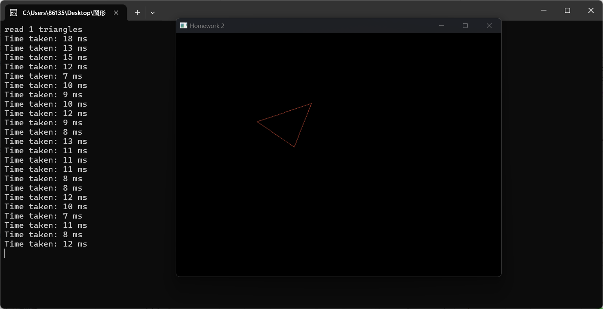

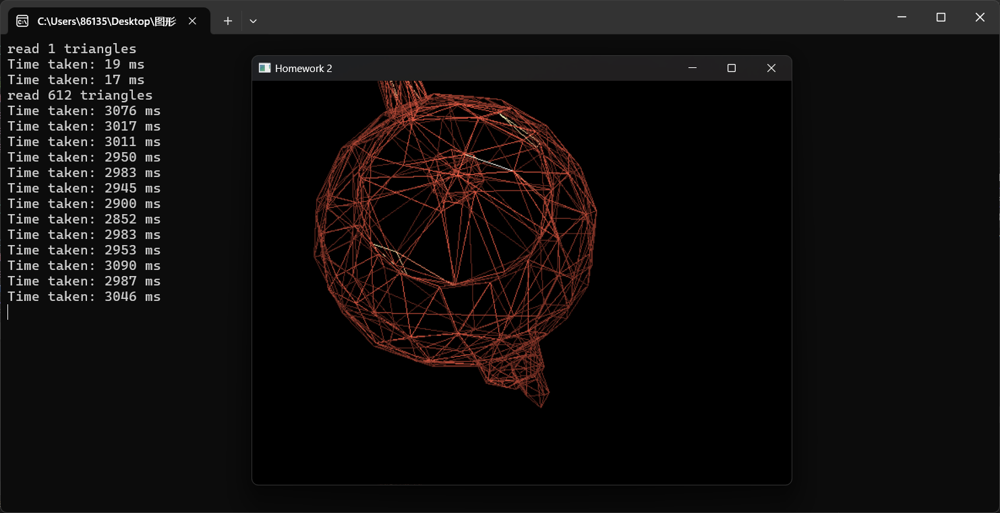

### 1.3：用edge-walking填充三角形内部颜色

由于前面在DDA和bresenham算法中已经维护了边表，这里直接利用边表来进行遍历绘制。初始对边表按行进行排序，遍历每一行，首先对x维度进行排序，读取边界点，遍历x维度，进行插值，计算颜色，深度，并存入缓冲区，代码如下，**这里考虑了三角形部分在画布外的情况**，当边缘点的x维度在画布外时，用画布边缘代替。

为了区分后续代码效果，暂时使用白色代替光照计算：

```c++
//由于画布的原因，需要计算
int MyGLWidget::edge_walking() {
	// 遍历edge_recorder在不同高度的起点、终点，用shading model计算内部每个像素的颜色
	int firstChangeLine = 0;
	// 对从DDA或者bresenham获取到的边表进行排序
	std::sort(edges.begin(), edges.end(), [](std::pair<int, std::vector<FragmentAttr>> a, std::pair<int, std::vector<FragmentAttr>> b) {
		return a.first > b.first;
		});

	if (!edges.empty()) {
		firstChangeLine = edges.back().first;  // 记录第一条非空行的行号
	}
	for (int i = 0; i < edges.size(); ++i) {
		std::sort(edges[i].second.begin(), edges[i].second.end(), [](FragmentAttr a, FragmentAttr b) {
			return a.x < b.x;
			});
		int y = edges[i].first;
		if (edges[i].second.size() > 1) {
			int k = 0;
			while (k + 1 < edges[i].second.size()) {
				int start_x = edges[i].second[k].x;
				int end_x = edges[i].second[k + 1].x;
				float start_z = edges[i].second[k].z;
				float end_z = edges[i].second[k + 1].z;
				float dz = (end_z - start_z) / float(end_x - start_x);
				for (int x = max(0, start_x + 1); x <= min(WindowSizeW, end_x - 1); ++x) {
					FragmentAttr tmp = getLinearInterpolation(edges[i].second[k], edges[i].second[k + 1], x, y);
					//if (shade == "Phong") {
					//	temp_render_buffer[y * WindowSizeW + x] = PhongShading(tmp);
					//}
					//else if (shade == "Gouraud") {
					//	temp_render_buffer[y * WindowSizeW + x] = tmp.color;
					//}
					//else if (shade == "Blinn_Phong") {
					//	temp_render_buffer[y * WindowSizeW + x] = Blinn_PhongShading(tmp);
					//}
					temp_render_buffer[y * WindowSizeW + x] = vec3(1.0f, 1.0f, 1.0f);
					// 深度
					temp_z_buffer[y * WindowSizeW + x] = tmp.z;
				}
				++k;
			}
		}
	}

	edges.clear();
	return firstChangeLine;
}

```

运行效果如下：

bresenham - edge-walking：

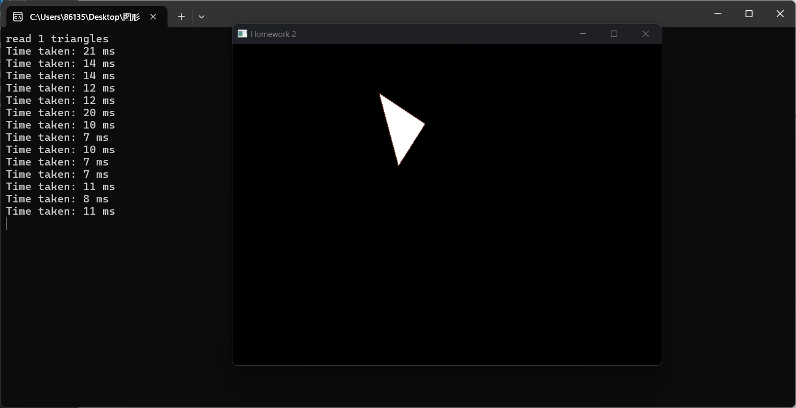

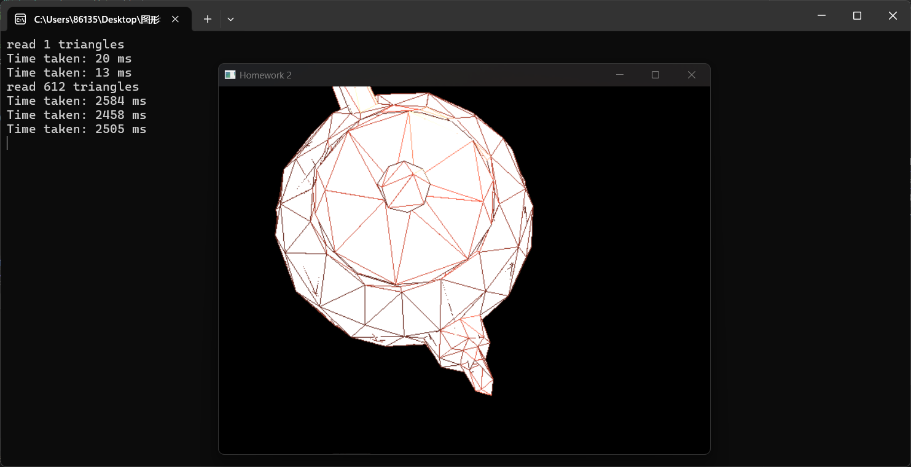

DDA - edge-walking：

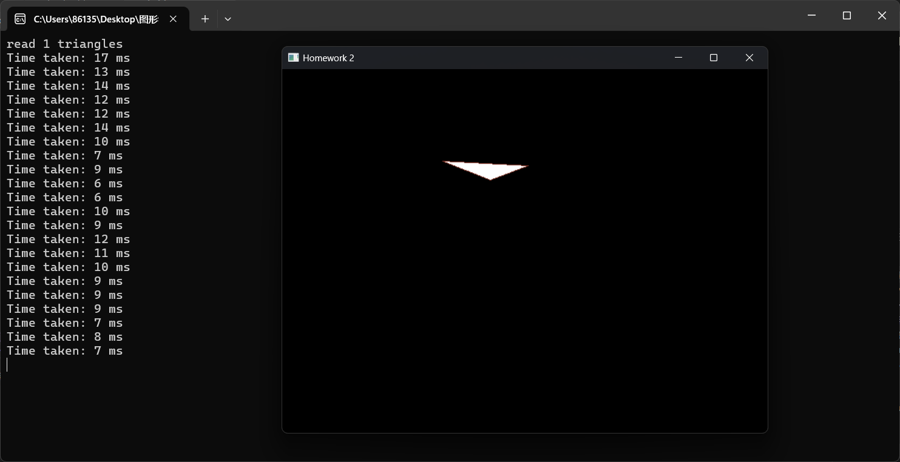

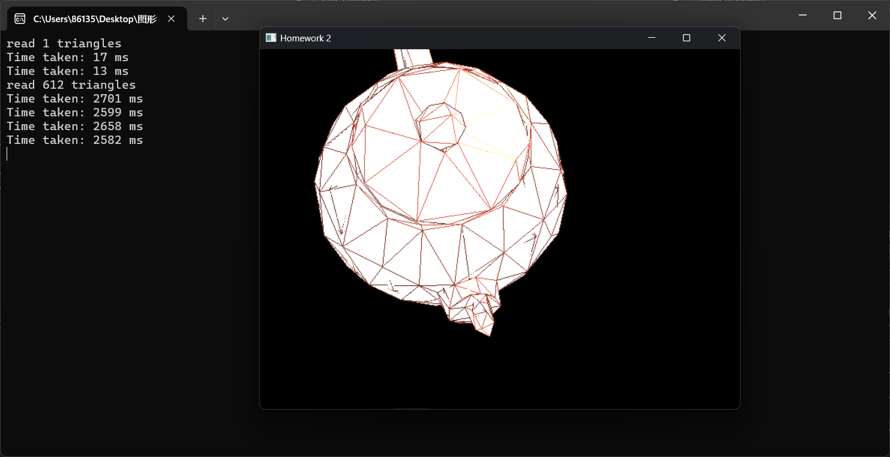

### 1.4：DDA与bresenham绘制效率比较

经过上面的比较会发现，两种绘制的实际运行时间的差距并不大，原因可能是虽然bresenham减少了浮点数的计算，但同时引进了较多的逻辑分支判断，导致运行性能并没有明显的优越性。

## 2.实现光照、着色

### 2.1：用Gouraud实现三角形内部的着色

Gouraud算法的核心思想就是计算三角形边缘的颜色值，然后对三角形内部的像素进行插值来实现光照效果。这种计算差值的方式具有简单，时间开销小的优点。在已经实现Phong模型的基础上，**因为在绘制直线算法和edge-walking算法中，已经间接的通过插值函数实现了对插值颜色的计算，并将结果存储在了FragmentAttr结构体的color属性中**，因此在edge-walking中直接读取FragmentAttr结构体的color属性赋值给缓冲区即可。不需要额外的函数编写。这里在顶点处利用Blinn_Phong模型计算顶点颜色。

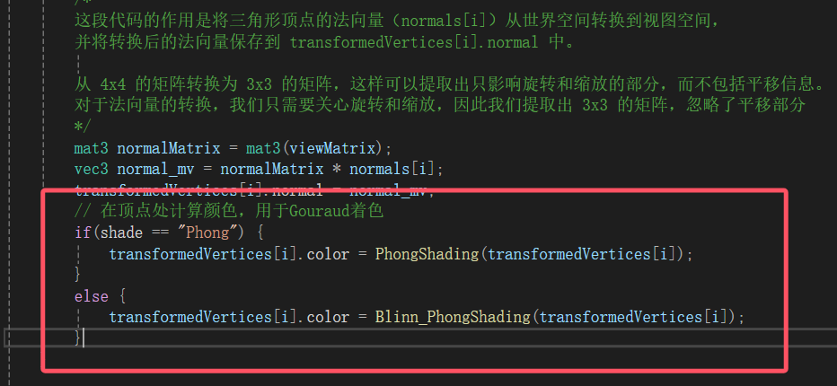

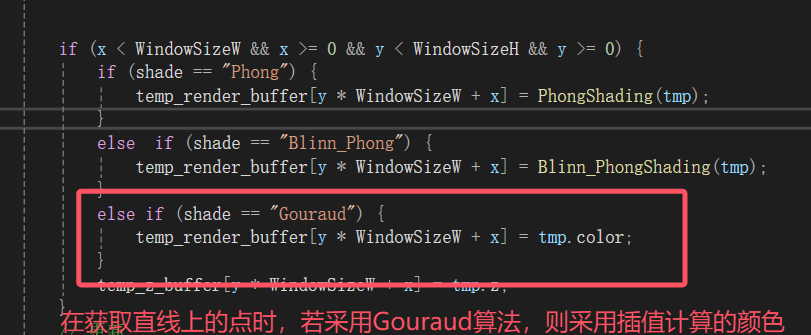

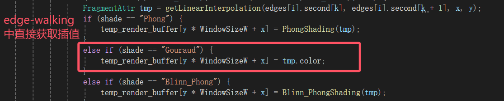

效果如下（顶点采用Blinn_Phong，使用bresenham）：

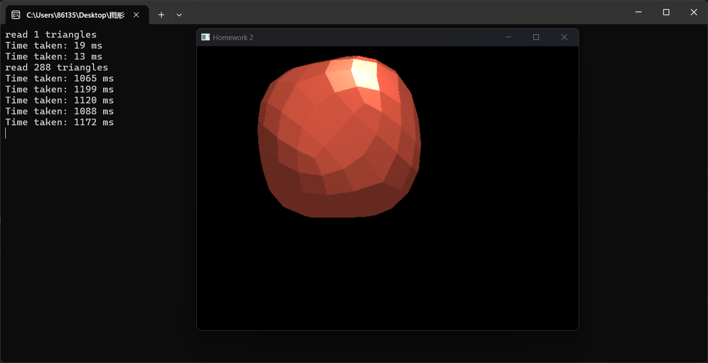

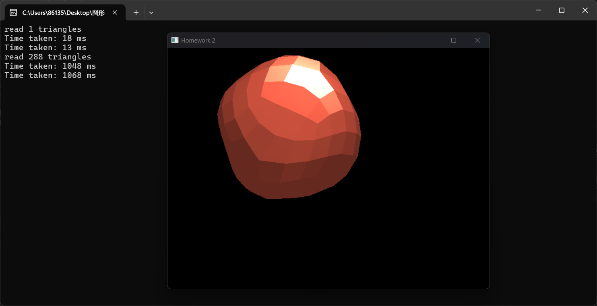

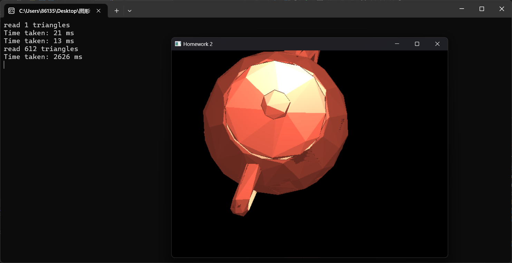

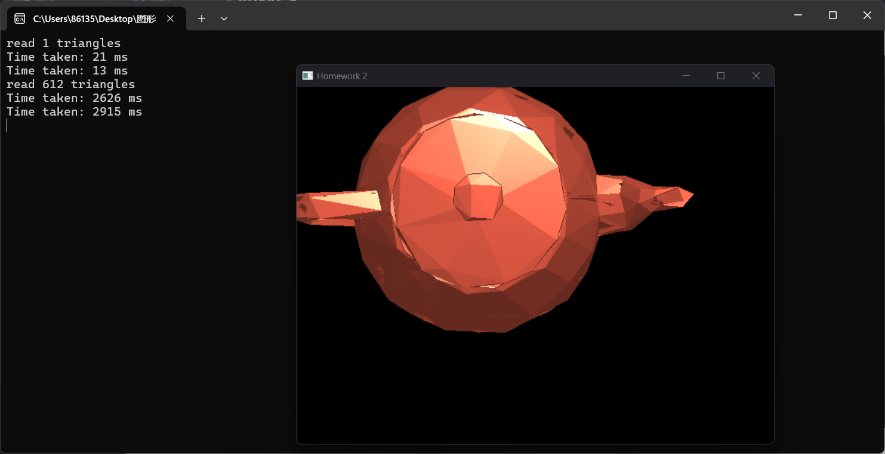

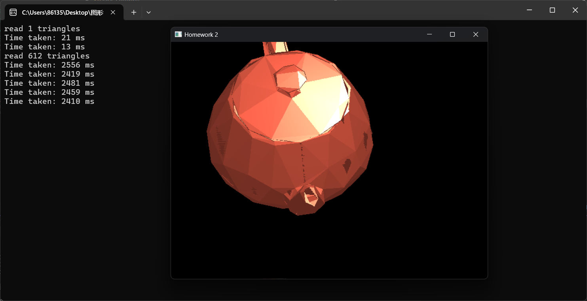

### 2.2：用Phong模型实现三角形内部的着色

Phong 算法是计算机图形学中用于渲染物体表面光照效果的经典模型，通常用于模拟物体表面的光照反射。Phong 模型结合了环境光、漫反射光和镜面反射光三个分量，常用于三维图形中模拟物体的光照反应。

环境光公式如下：

$$
I_{\text{ambient}} = k_a \cdot I_a
$$

$k_a$是系数，$I_a$是环境光强度。

漫反射光计算公式如下：

$$
I_{\text{diffuse}} = k_d \cdot I_d \cdot (\mathbf{L} \cdot \mathbf{N})
$$

$k_d$是系数，$I_d$是漫反射光源的强度，L是光源到表面点的方向向量，N 是表面法向量。

镜面反射光的计算公式如下：

$$
I_{\text{specular}} = k_s \cdot I_s \cdot (\mathbf{R} \cdot \mathbf{V})^n
$$

$k_s$是系数，$I_s$是是光源的强度，R 是反射光的方向向量，V 是观察者（视点）到表面点的方向向量，n 是镜面反射的光泽度（常称为“高光指数”）。

然后将各部分进行相加即可得到总光强：

$$
I_{\text{total}} = k_a \cdot I_a + k_d \cdot I_d \cdot (\mathbf{L} \cdot \mathbf{N}) + k_s \cdot I_s \cdot (\mathbf{R} \cdot \mathbf{V})^n
$$

然后将光强与物体固有颜色相乘，调整物体表面颜色对光照的响应。

代码如下：

```c++
vec3 MyGLWidget::PhongShading(FragmentAttr& nowPixelResult) {
	// 计算最终颜色
	vec3 norm = glm::normalize(nowPixelResult.normal);
	vec3 lightDir = glm::normalize(lightPosition - nowPixelResult.pos_mv);
	vec3 viewDir = glm::normalize(camPosition - nowPixelResult.pos_mv);
	vec3 reflectDir = glm::reflect(-lightDir, norm);

	vec3 ambient = ambientfactor* light_ambient;

	float diff = glm::max(glm::dot(norm, lightDir), 0.0f);
	vec3 diffuse = diffusefactor * diff * light_diffuse;

	float spec = glm::pow(glm::max(glm::dot(viewDir, reflectDir), 0.0f), a);
	vec3 specular = specularfactor * spec * light_specular;

	vec3 color = (ambient + diffuse + specular) * objectColor;
	return color;
}
```

使用Phong模型效果如下（使用bresenham）：

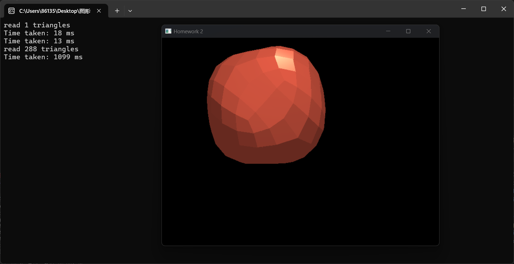

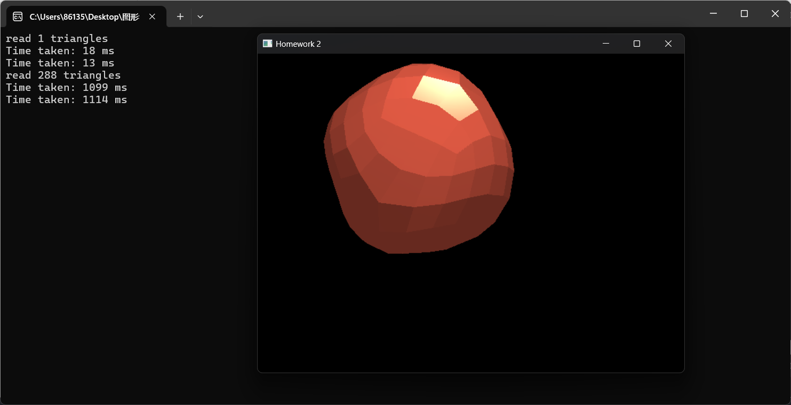

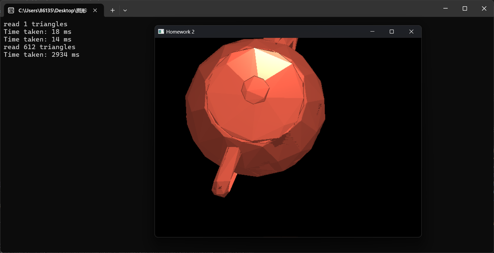

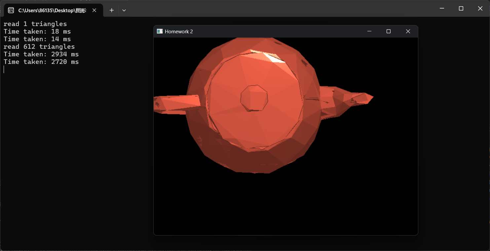

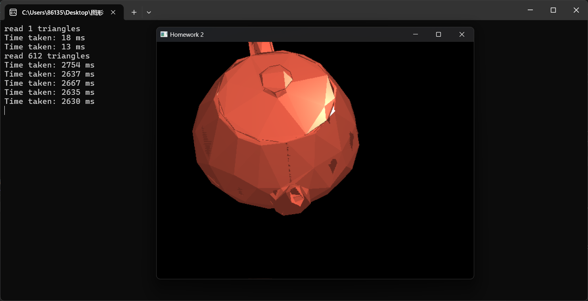

### 2.3：用Blinn-Phong实现三角形内部的着色

Phong 光照模型和Blinn-Phong 光照模型都是常用的光照模型，用于模拟物体表面如何响应不同光照源的影响。它们的主要区别在于镜面反射光的计算方式，Blinn-Phong 采用了改进的计算方法，使得其在一些情况下更加高效且能得到更自然的高光效果。Blinn-Phong 模型改进了镜面反射的计算方法，使用了半程向量（Halfway Vector），而不是反射向量。具体来说，Blinn-Phong 使用光源方向和视点方向的 半程向量 （H）与表面法线的点积来计算镜面反射光：

$$
\mathbf{H} = \frac{\mathbf{L} + \mathbf{V}}{\|\mathbf{L} + \mathbf{V}\|}
$$

L是光源方向向量，V是观察者方向向量。

镜面反射计算公式修改如下：

$$
I_{\text{specular}} = k_s \cdot I_s \cdot (\mathbf{N} \cdot \mathbf{H})^n
$$

H即为半程向量，N为法向量。

Blinn-Phong 在某些情况下提供了比 Phong 更平滑、自然的高光表现，尤其在大范围的高光时，Blinn-Phong 模型能减少过度锐利的高光。并且相比于Phong算法，Blinn_Phong算法的计算量更小，时间开销更小。

实现代码如下：

```
vec3 MyGLWidget::Blinn_PhongShading(FragmentAttr& nowPixelResult) {
	// 计算最终颜色
	vec3 norm = glm::normalize(nowPixelResult.normal);
	vec3 lightDir = glm::normalize(lightPosition - nowPixelResult.pos_mv);
	vec3 viewDir = glm::normalize(camPosition - nowPixelResult.pos_mv);
	vec3 H = glm::normalize(lightDir + viewDir);

	vec3 ambient = ambientfactor * light_ambient;

	float diff = glm::max(glm::dot(norm, lightDir), 0.0f);
	vec3 diffuse = diffusefactor * diff * light_diffuse;

	float spec = glm::pow(glm::max(glm::dot(norm, H), 0.0f), a);
	vec3 specular = specularfactor * spec * light_specular;

	vec3 color = (ambient + diffuse + specular) * objectColor;
	return color;

}

```

表现如下（使用bresenham）：

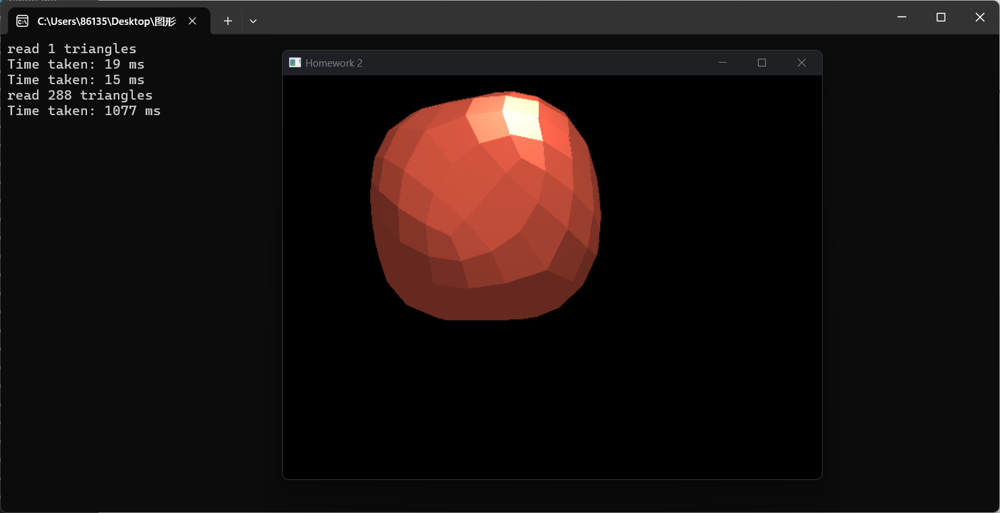

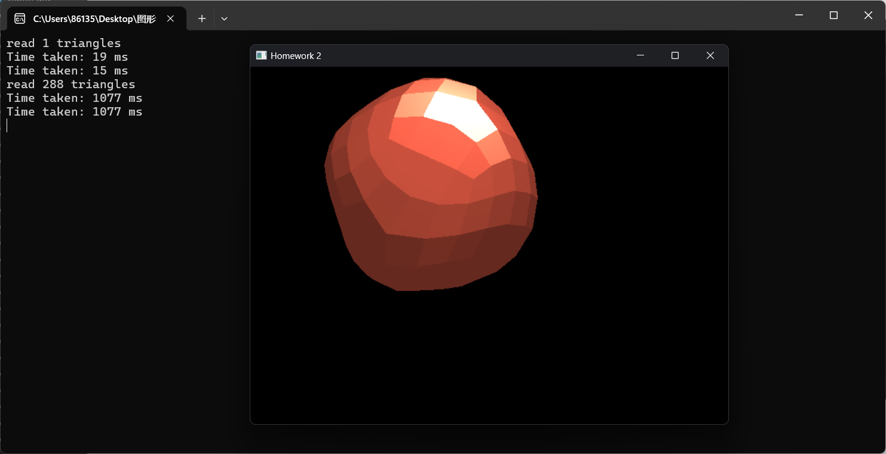

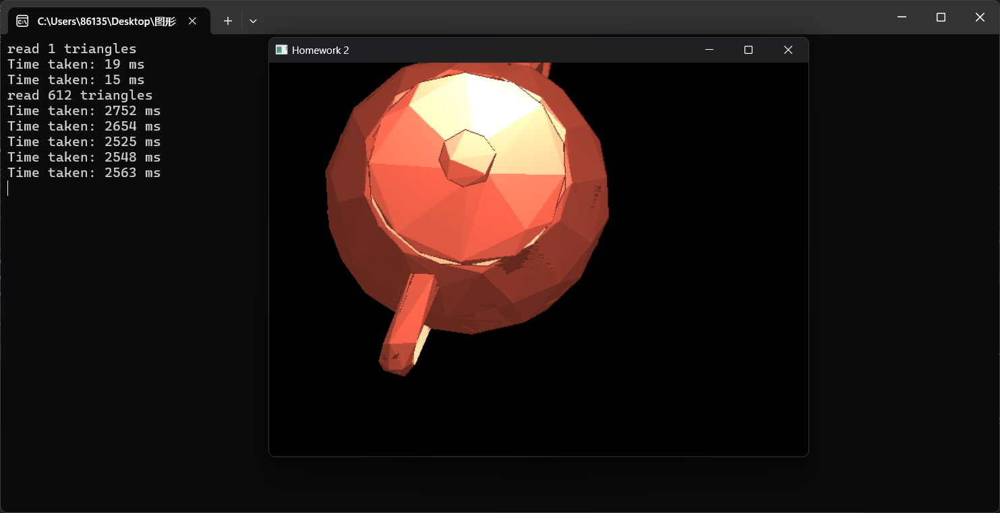

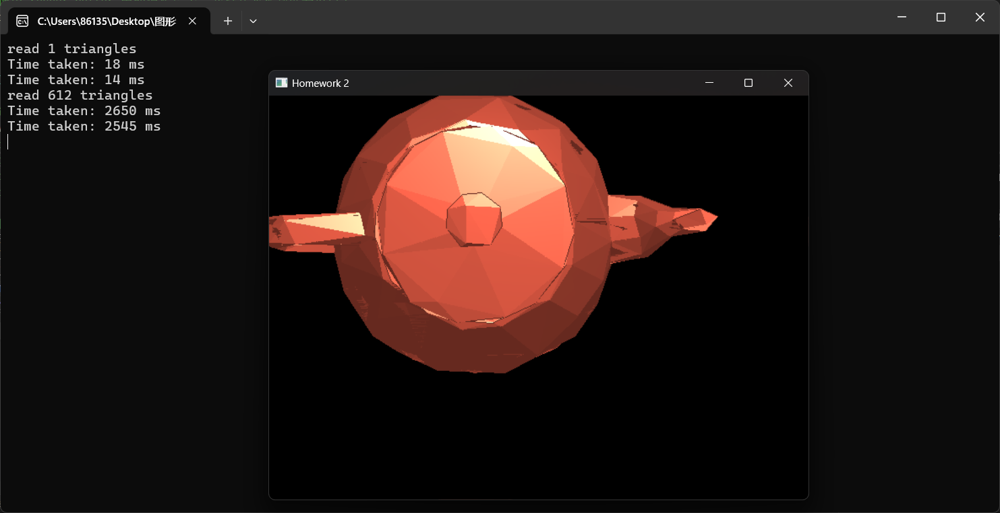

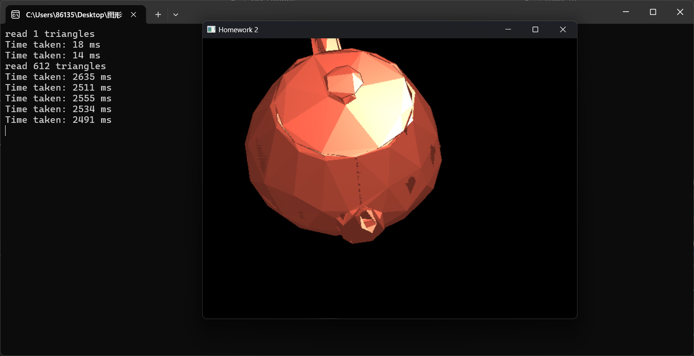

### 2.4：结合实际运行时间讨论三种不同着色方法的效果、着色效率

比较上面绘制的运行时间会发现，时间开销上Gouraud 绘制平均用时最短，而Blinn_Phong次之，Phong最长，这符合每个光照算法的特点。在着色效果上，相比于Phong模型，Blinn_Phong模型在高光过度时更平滑、自然，更符合物体特点，而Phong模型显得十分生硬，突兀，着色效果明显不如Blinn_Phong模型：

使用Phong模型绘制，高光显得十分生硬：

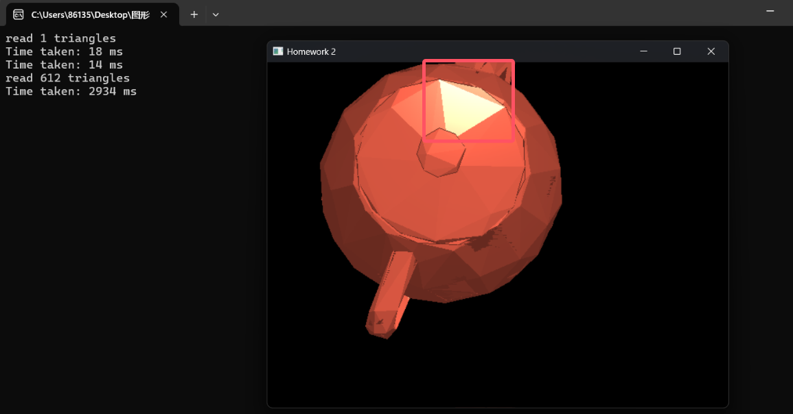

Blinn_Phong模型则在高光处过度自然，更符合实际：

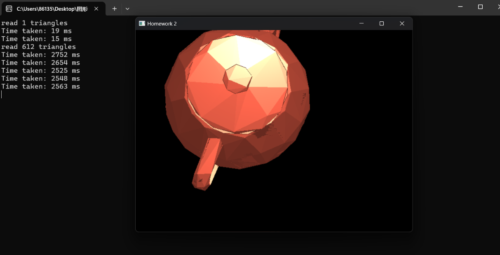

由于Gouraud的顶点我是采用Blinn_Phong绘制的，所以二者着色效果相近。

当顶点采用Phong算法时，着色效果如下，可以看见此时Gouraud的着色效果与Phong一致：

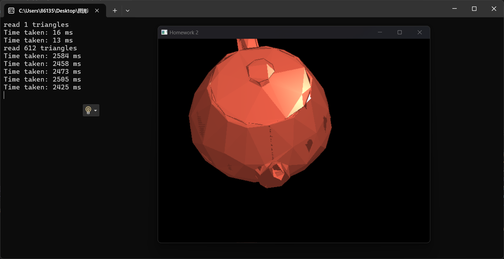

可以看见Gouraud的着色效果很大程度上取决于三角形顶点的着色算法。

综上，在时间开销上，Gouraud > Blinn_Phong > Phong。在渲染效果上，Gouraud的渲染效果很大程度取决于顶点采用的什么方式进行的计算。Blinn_Phong在高光上的过渡比Phong更自然，渲染效果更好。

## 总结

找出了教程代码中插值函数所出现的精度问题以及导致精度问题的原因，并进行改进成功解决显示问题。

在本次实验中，我实现了两种光栅化算法，并对其各自的特点以及性能进行了比较。并且在实现过程中考虑了绘制图形在画布外的情况。

实现了edge-walking填充算法，通过不同的优化方式使其实现高效。

实现了Gouraud、Phong、Blinn_Phong三种不同的光照着色算法，并对其性能、渲染效果进行了比较，深刻体会到不同光照算法的特点。
