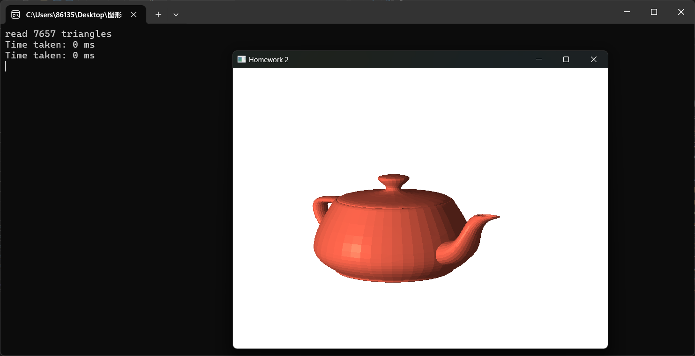
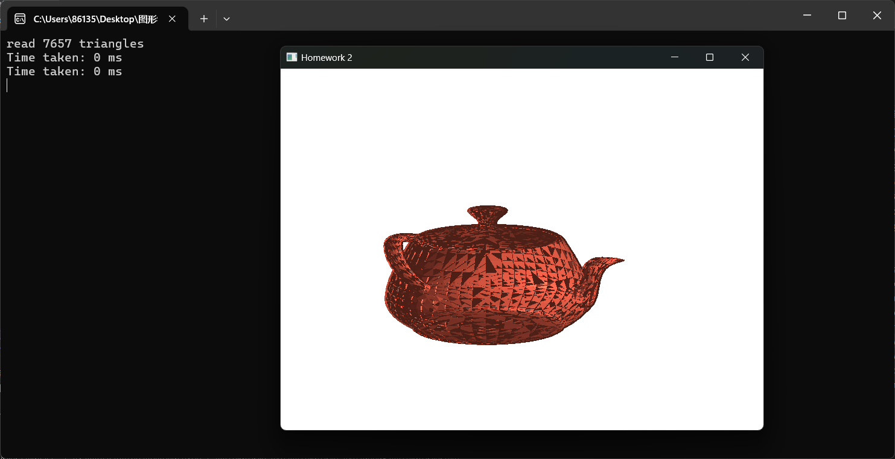
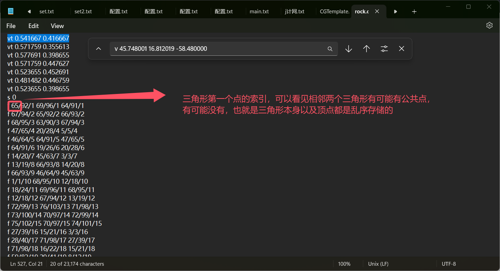
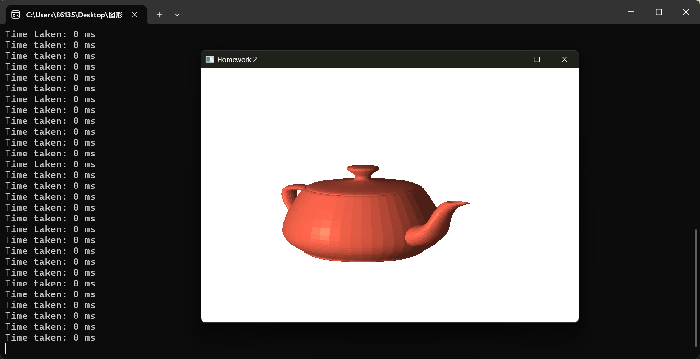
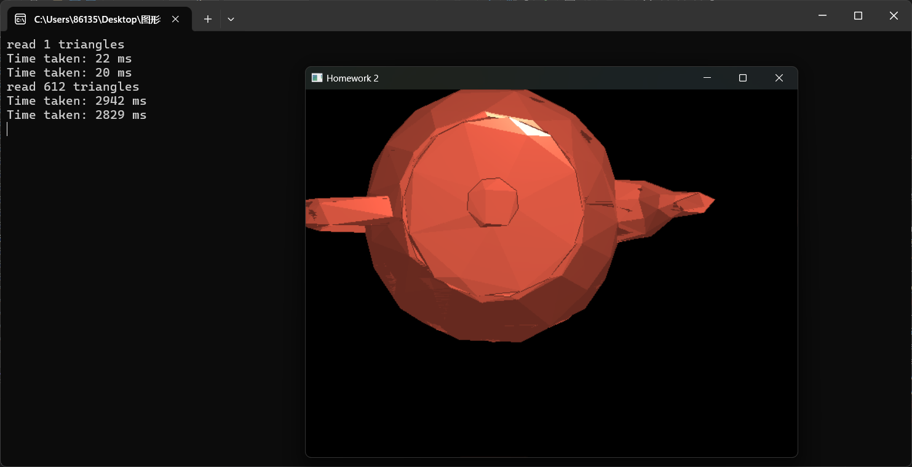
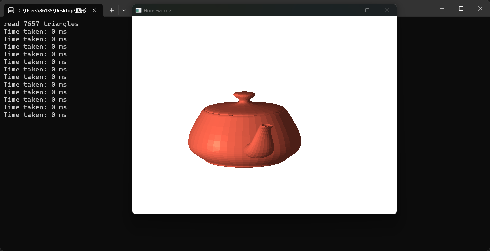
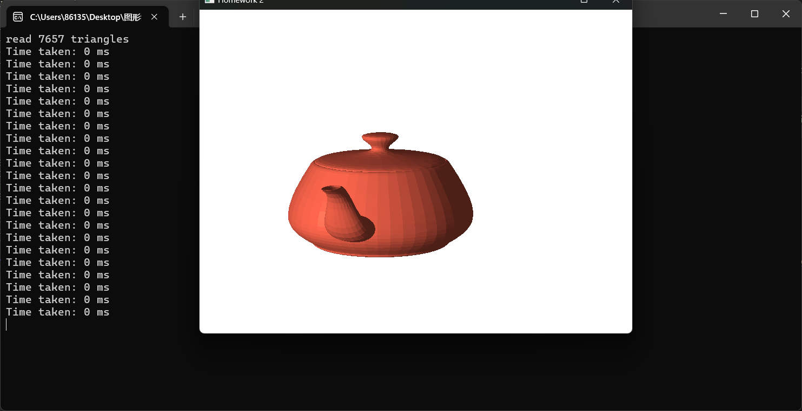
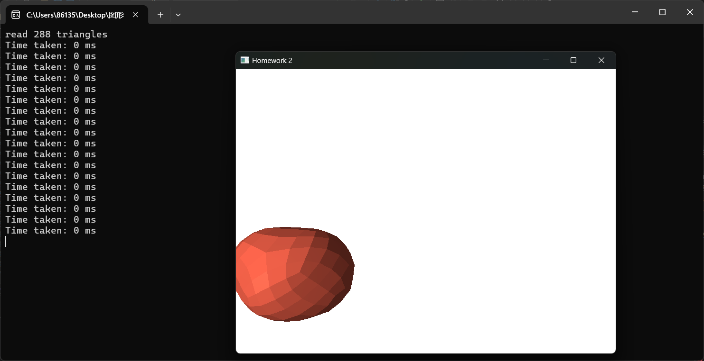
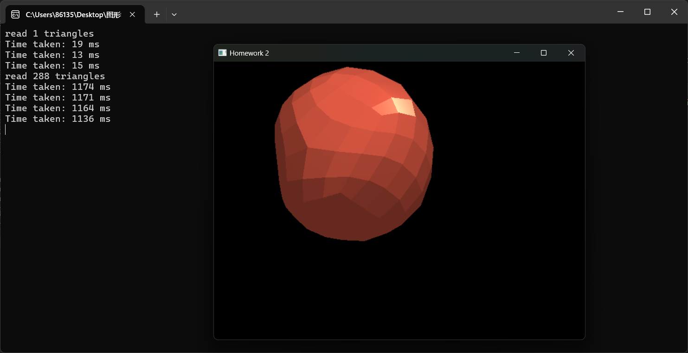

# HW3

学号：22320021    姓名：陈安康

在此次实验中，要开启深度测试。作业2的深度测试是默认关闭的（应该是作业2要求的），这样就会使出来的模型效果出现窟窿，将深度测试打开，模型就可以丝滑的渲染。

打开深度测试：



未打开深度测试：



在作业2的代码基础上进行修改，使用着色器来渲染图形。顶点和片元着色器代码如下，顶点着色器计算在投影坐标系下的坐标，并且将计算得来的视图坐标系下的点的坐标和经过normal matrix转换后的法向量的坐标传递给片元着色器：

```cpp
#version 330 core
layout(location = 0) in vec3 pos; // 顶点位置
layout(location = 1) in vec3 normal; // 法向量

smooth out vec3 view_pos;  // 视图坐标下的位置
smooth out vec3 Normal;   // 法线

uniform mat4 model;
uniform mat4 view;
uniform mat4 projection;

void main()
{

    view_pos = vec3(view * model * vec4(pos, 1.0)); 
    Normal = mat3(transpose(inverse(model))) * normal;  
    gl_Position = projection * view * model * vec4(pos, 1.0);  
}
```

片元着色器则是在第二个作业实现的Phong shading算法的基础上进行修改得到的：

```cpp
#version 330 core
smooth in vec3 view_pos;      // 从顶点着色器传递的位置
smooth in vec3 Normal;       // 从顶点着色器传递的法线
out vec4 FragColor;   // 输出颜色

uniform vec3 lightPos;    // 光源位置
uniform vec3 camPos;     // 镜头位置
uniform vec3 lightColor;  // 光源颜色
uniform vec3 objectColor; // 物体颜色

void main()
{
    // 计算最终颜色
	vec3 norm = normalize(Normal);
	vec3 lightDir = normalize(lightPos - view_pos);
	vec3 viewDir = normalize(camPos - view_pos);
	vec3 reflectDir = reflect(-lightDir, norm);

    float ambientfactor = 0.3f;
	vec3 ambient = ambientfactor * lightColor;

    float diffusefactor = 0.7f;
	float diff = max(dot(norm, lightDir), 0.0f);
	vec3 diffuse = diffusefactor * diff * lightColor;

    float specularfactor = 0.5f;
	float spec = pow(max(dot(viewDir, reflectDir), 0.0f), 32);
	vec3 specular = specularfactor * spec * lightColor;

	FragColor = vec4((ambient + diffuse + specular) * objectColor,1.0);
}
```

然后就是创建VBO和VAO，其中对于顶点的存储，这里因为使用的obj文件里面的每个三角形的顶点是由f开头的行给出索引。而顶点（v开头的行）本身不是按照三角形的顺序存储的。如下：



对于 `f` 行中的每一组数字，如 `65/92/1`，它包含三个数字，由斜杠 `/` 分隔，分别表示顶点、纹理坐标、法线的索引。可以看到，每一个三角形都是乱序存储的，每个三角形是否相邻是不确定的，而且很头疼的是**法向量坐标和顶点坐标也不是一一对应的**（想象一下你的EBO只能存顶点的索引信息，但是你的法向量和你的顶点不是一一对应的，如果法向量和顶点存在不同的VBO里面，你还要有另一个EBO存法向量的位置索引？或者你还要依据顶点去重排法向量使其位置对应，可是问题是索引存储是按照三角形为基础而不是顶点，你无法常数项时间定位到一个给定顶点对应的法向量到底是哪一个，太麻烦了）。花费时间去调整顶点的存储顺序，不仅（很可能要）要重写加载函数，而且会花费更多的时间去进行排序。这是及其不划算的。因此在这里，我只是按照每个三角形中的点进行存储，重复存储了公共点（其实这样的话，EBO没有存在的价值了）。不然你就要么重排法向量，要么多EBO，二者都会花费更多的时间，并且使绘制更加复杂。

而且法向量和顶点也不是一对一的关系，因为一个点属于多个面，也会有多个法向量与之对应。这样的话，其实可以说根本不会存在“公共点”这一种说法。因为法向量不一样，每一个点就不一样。从这个角度看，也没办法发挥EBO的价值所在了，因为每个点都是不一样的。

所以直接就按照三角形的顺序进行存储其顶点和法向量，然后顺便存储索引：

```cpp
	std::vector<float> vertexData;
	std::vector<unsigned int> indexs;
	for (int i = 0; i < objModel.triangleCount; ++i) {
		for (int j = 0; j < 3; ++j) {
			int vertexIndex = objModel.triangles[i][j];
			int normalIndex = objModel.triangle_normals[i][j];
			vertexData.push_back(objModel.vertices_data[vertexIndex].x);
			vertexData.push_back(objModel.vertices_data[vertexIndex].y);
			vertexData.push_back(objModel.vertices_data[vertexIndex].z);
			vertexData.push_back(objModel.normals_data[normalIndex].x);
			vertexData.push_back(objModel.normals_data[normalIndex].y);
			vertexData.push_back(objModel.normals_data[normalIndex].z);
			indexs.push_back(i * 3 + j);
		}
	}
```

然后创建EBO、VBO、VAO，把数据存入VBO，告诉 OpenGL 如何解释顶点数据（那几个数据对应顶点着色器里面的参数1，哪几个对应参数2），然后存索引到EBO。

```cpp
glGenVertexArrays(1, &VAO);
glGenBuffers(1, &VBO);
glGenBuffers(1, &EBO);

glBindVertexArray(VAO);


glBindBuffer(GL_ARRAY_BUFFER, VBO);
glBufferData(GL_ARRAY_BUFFER, vertexData.size() * sizeof(float), vertexData.data(), GL_STATIC_DRAW);

glBindBuffer(GL_ELEMENT_ARRAY_BUFFER, EBO);
glBufferData(GL_ELEMENT_ARRAY_BUFFER, indexs.size() * sizeof(unsigned int), indexs.data(), GL_STATIC_DRAW);

glVertexAttribPointer(0, 3, GL_FLOAT, GL_FALSE, 6 * sizeof(float), (void*)0);
glEnableVertexAttribArray(0);
glVertexAttribPointer(1, 3, GL_FLOAT, GL_FALSE, 6 * sizeof(float), (void*)(3 * sizeof(float)));
glEnableVertexAttribArray(1);

glBindVertexArray(0);
```

在paintGL里面要传入uniform参数：

```cpp
// 使用着色器程序
glUseProgram(program);
//glUseProgram(0);

// 设置 uniform 变量
// 获取 uniform 位置
GLuint modelLoc = glGetUniformLocation(program, "model");
GLuint viewLoc = glGetUniformLocation(program, "view");
GLuint projLoc = glGetUniformLocation(program, "projection");
GLuint lightPosLoc = glGetUniformLocation(program, "lightPos");
GLuint camPosLoc = glGetUniformLocation(program, "camPos");
GLuint lightColorLoc = glGetUniformLocation(program, "lightColor");
GLuint objectColorLoc = glGetUniformLocation(program, "objectColor");

mat4 model = mat4(1.0f);
model = glm::rotate(model, (float)degree, vec3(0, 1.0f, 0)); // 旋转模型
model = glm::translate(model, glm::vec3(-objModel.centralPoint.x, -objModel.centralPoint.y, -objModel.centralPoint.z)); // 平移模型
model = glm::scale(model, vec3(1.0f));

mat4 view = glm::lookAt(camPosition, camLookAt, camUp);

glUniformMatrix4fv(modelLoc, 1, GL_FALSE, glm::value_ptr(model));
glUniformMatrix4fv(viewLoc, 1, GL_FALSE, glm::value_ptr(view));
glUniformMatrix4fv(projLoc, 1, GL_FALSE, glm::value_ptr(projMatrix));

glUniform3fv(lightPosLoc, 1, glm::value_ptr(lightPosition));
glUniform3fv(camPosLoc, 1, glm::value_ptr(camPosition));
glUniform3fv(lightColorLoc, 1, glm::value_ptr(lightColor));
glUniform3fv(objectColorLoc, 1, glm::value_ptr(objectColor));
```

然后绘制：

```cpp
	// 绘制物体
	glBindVertexArray(VAO);
	//glDrawArrays(GL_TRIANGLES, 0, objModel.triangleCount * 3);
	glDrawElements(GL_TRIANGLES, objModel.triangleCount * 3, GL_UNSIGNED_INT, 0);
	glBindVertexArray(0);
```

实现效果如下：



## 对比Phong shading与OpenGL自带的smoothing shading的区别

在OpenGL中，Smooth Shading（平滑着色）是默认的着色模式。这种模式通过插值顶点属性（如颜色、法线）来创建平滑的视觉效果，使得图形看起来更加自然和真实。而顶点的颜色怎么获取？依然要传入或者计算得出！因此使用Phong shading也是依靠glsl的插值来完成对中间点的颜色填充，感觉这两个没有什么区别，都是依据顶点来插值得到中间点的颜色值等，只是一个是通过Phong shading算法计算顶点颜色，一个可能直接提供。

## 使用VBO进行绘制及通过glVertex进行绘制的区别

因为作业2实际最终是使用glVertex2f进行绘制的，因此和作业2进行比较即可。

作业实验中的截图如下：



以下是使用VBO进行绘制



从时间上可以十分明显的看出差别，而且我的电脑在作业2中渲染8000面的模型时会死机，而使用VBO基本上无缝渲染。VBO将顶点数据存储到显存中。这样做的好处是可以显著提高渲染效率，因为显存（GPU内存）比系统内存（RAM）更接近GPU，访问速度更快。使用VBO极大的减小了渲染所需要的时间。

## 讨论VBO中是否使用indexarray的效率区别

由上面的分析可以知道，用不用EBO在作业3这个场景下没有任何区别，因为并没有多用的公共点，这是因为即使公共点的顶点属性重复了，而它们的法向量属性也不会重复，所以不会有重复的点。因此EBO基本没有任何作用，在实验中表现也是如此：

通过以下两个代码选择在绘制时是否使用EBO：

```cpp
	glDrawArrays(GL_TRIANGLES, 0, objModel.triangleCount * 3);
	//glDrawElements(GL_TRIANGLES, objModel.triangleCount * 3, GL_UNSIGNED_INT, 0);
```

不使用EBO表现如下：



可以看到几乎没有区别。

虽然在这个场景下，EBO没有起到作用，但是在其他场景下，如公共点传入的其他属性值不是法向量而是颜色，那么就会真正存在公共点，此时可以通过EBO来减少重复点的存储开销，不过这样也要对应的修改存储的代码，使其只存储一次公共点，对索引的记录顺序也有要求。

## 对比、讨论HW3和HW2的渲染结果、效率的差别

HW3的渲染效果：



HW2的渲染效果：



在效果上，我感觉差不多，分别不出来两个哪一个一定比另外的优秀。

但在效率上，HW2使用glVertex进行绘制，每次绘制都要把数据重新传输给GPU，这加大了开销，而HW3的VBO将数据直接存在显存中，可以直接供显存调用，极大减小渲染开销。

在实现方式上，二者采用不同的方式，HW2是在代码中进行坐标转换，插值，颜色填充等一系列操作，所有的细节都需要程序员考虑清楚，而HW3直接在自定义的着色器中完成这些操作，极大简化开发流程。并且更加普遍，可以适应不同渲染要求，对代码的改动也少，更新维护成本更低。

综上来看，HW3采用自定义着色器的实现方式更加规范，普遍，简单，并且使用VBO后渲染效率更加的高。可以实时渲染的场景要求，在游戏这种实时性要求比较高的场景中更加占优势。
