# 第一次任务报告

学号：22320021	姓名：陈安康

## 1.环境搭建：

依据实验教程搭建环境过程中，在安装Qt时，发现教程中的路径已经变化了，找到正确的路径后，发现没有教程中的版本

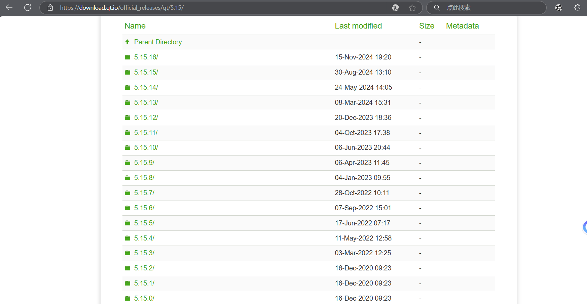

并且点进去没有教程中所说的.exe文件。


看见群中有同学将新的配置方法分享出来，决定按照群中其他同学分享的配置教程来进行配置。

从同学提供的百度网盘中下载Qt Creator：


在VS 2022上成功配置Qt插件：

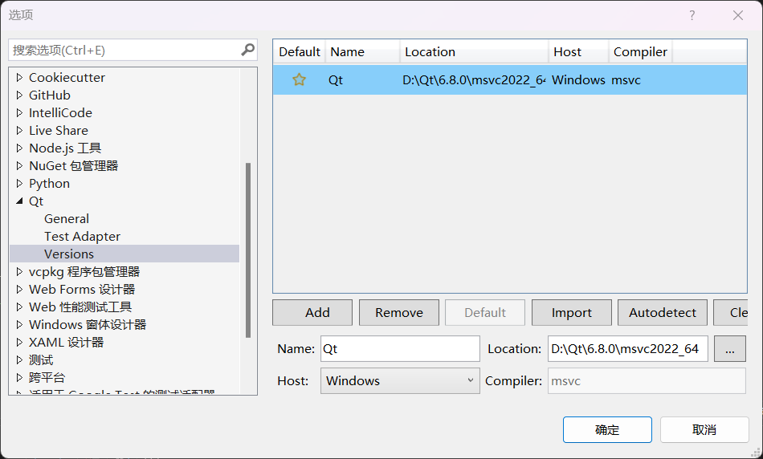

在配置qmake环境时，碰到了一个比较尴尬的问题：


在网上搜寻答案后，发现是整个Path中存储的路径太多了，导致字符数过大，超过了2047的上限，按照网上的方法，通过将路径的公共前缀提取为一个变量的方法，缩减之前设置的变量所占的字符数，腾出空间来给目前需要设置的变量使用：

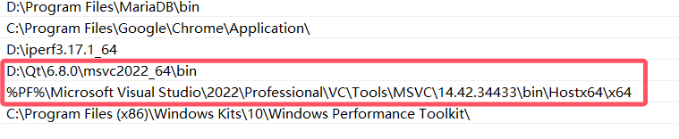

使用命令生成VS工程文件：

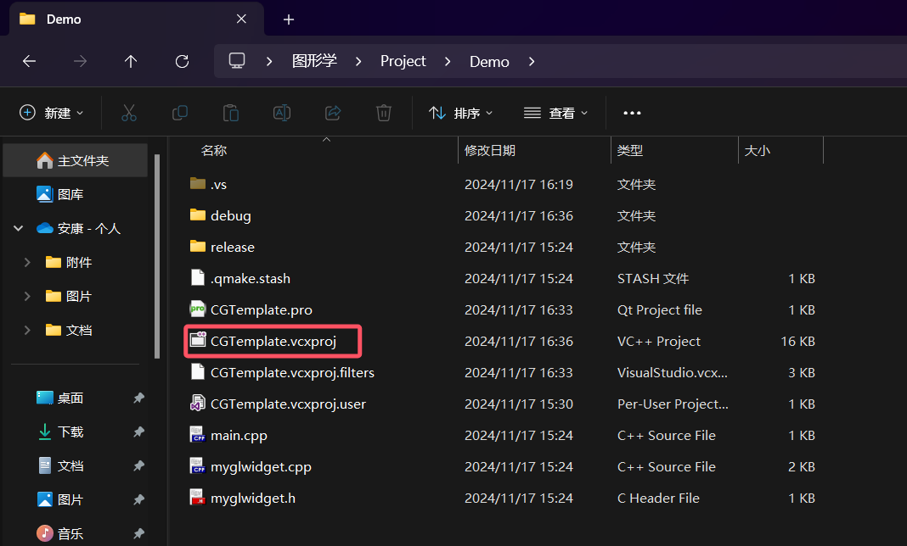

由于为了匹配配置教程，新下了Visual Studio 2022（之前我使用的是Visual Studio 2019），在配置到生成VS工程文件时，在生成了.vcxproj文件后，通过Visual Studio 2022点击进去不是预想中的项目布局，而仅仅是一个xml文件（这里忘记截图了）。但使用Visual Studio 2019点击进去是正常的项目布局（保险起见，我两个VS都同步配置了Qt插件）。

然后我经过查找资料得知，`.vcxproj` 文件是 **Visual Studio C++ 项目文件**。我想可能是因为我新下Visual Studio 2022时太着急，没有安装与C++相关的插件，然后我查看Visual Studio Installer中当时的工具包，发现的确忘记安装C++有关的工具了：


成功下载后，正常打开项目：

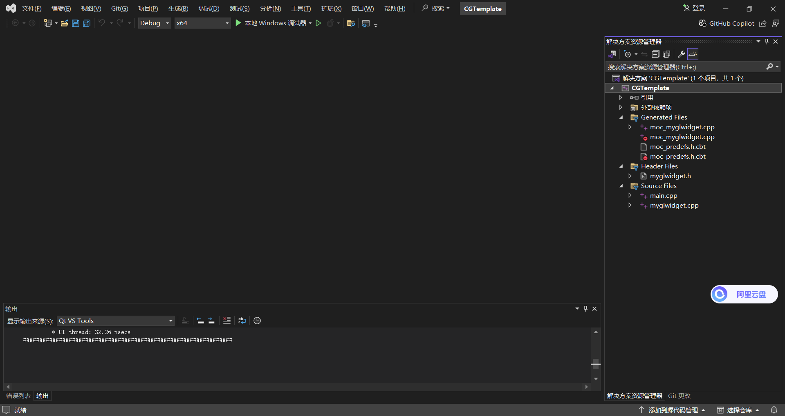

然后添加GLEW：

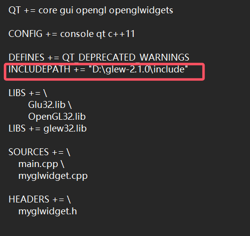

但还是遇到了一个问题，报错链接不到glew32.lib。

按照同学教程中的方法，添加附加库目录的地址后，问题解决：

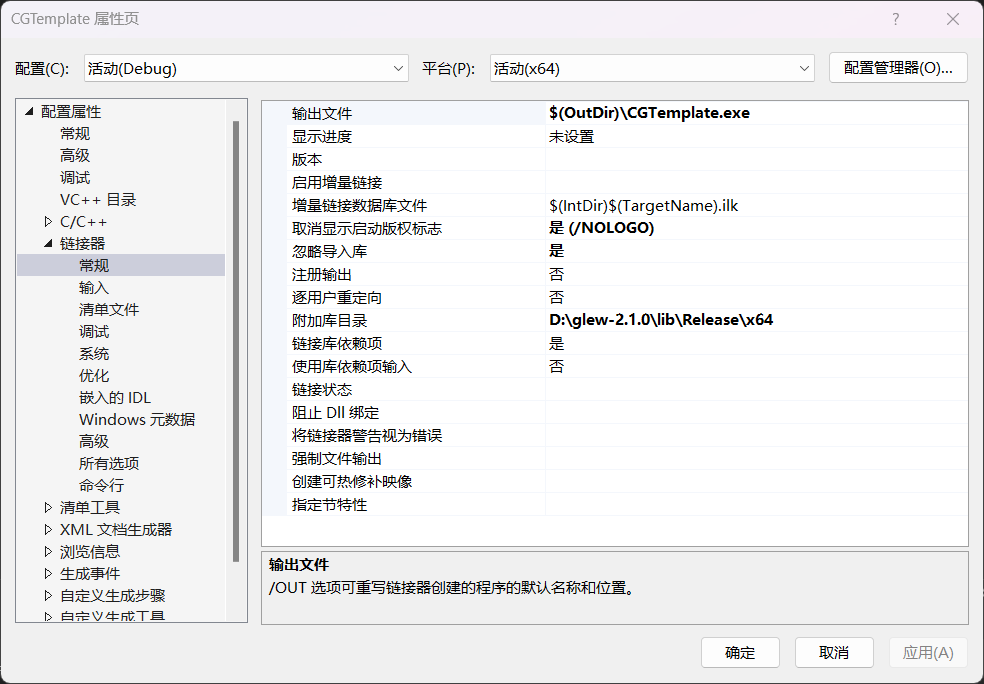

运行，报错找不到 QOpenGLWidget 引用，但我注意到一个问题，那就是定位QtGui和QOpenGLFunctions的路径是我anaconda3的路径，这显然是不正确的。

不知道为什么会找到我的anaconda3上去，不过我解决问题的方式也十分简单粗暴，因为我基本不用anaconda3，所以直接给卸载了。

卸载后，QOpenGLWidget，QtGui和QOpenGLFunctions全都无法找到。

查看教程后，感觉是因为库的名称发生了变化，之前命令的

```
QT += widgets
```

在我的版本应该改成

```
QT += openglwidgets
```

因为我的版本肯定大于4了，所以我直接写成如下形式：

```
QT += core gui opengl openglwidgets
```

之后又捣鼓了一段时间，才知道要重新运行qmake命令重新生成才可以应用，重新运行qmake命令构建vs工程文件，然后可以正常运行了：

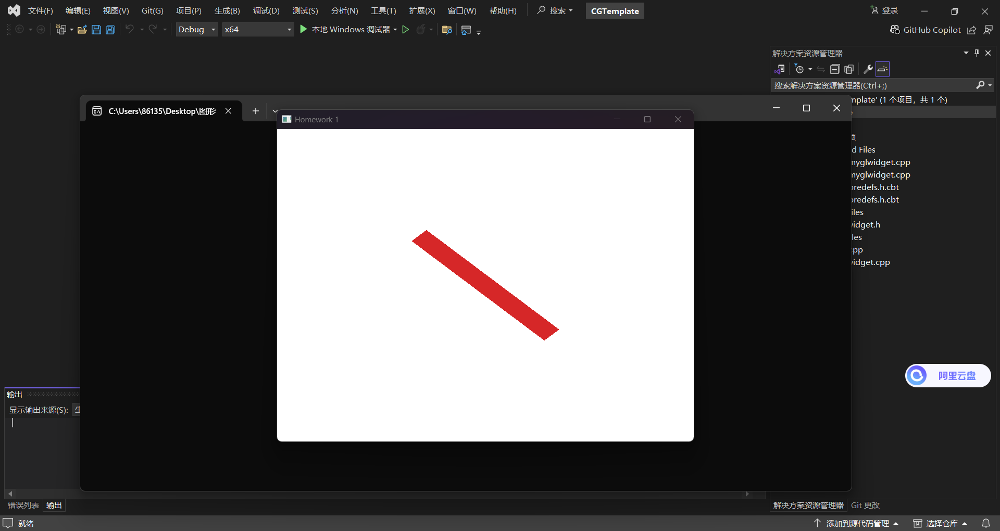

我的Visual Studio 2019 也可以运行：

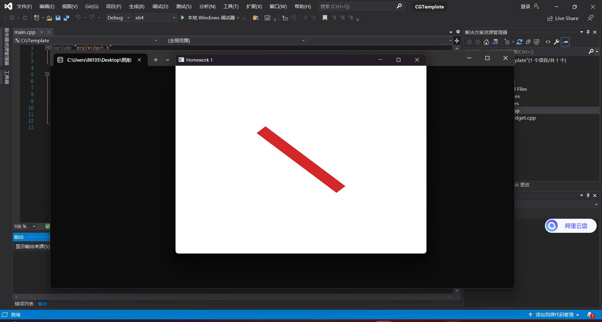

至此，环境配置成功。


## 2.绘制平面姓名首字母

使用glVertex2f函数进行顶点绘制。


在使用GL_TRIANGLES绘制时，按顺序每三个顶点组成一个三角形，所以绘制需要调用glVertex2f次数为：18 X 3 = 54次

代码如下：

```cpp
void MyGLWidget::scene_1()
{
	glClear(GL_COLOR_BUFFER_BIT | GL_DEPTH_BUFFER_BIT);
	glMatrixMode(GL_PROJECTION);
	glLoadIdentity();
	if (b == 0)
		glOrtho(0.0f, width(), 0.0f, height(), -1000.0f, 1000.0f);
	else
		gluPerspective(45.0f, width() / height(), 1.0f, 1000.0f);
	glMatrixMode(GL_MODELVIEW);
	glLoadIdentity();
	if (a == 0)
		gluLookAt(0.0f, 0.0f, dis,
			0.0f, 0.0f, 0.0f,
			0.0f, 1.0f, 0.0f);
	else
		gluLookAt(0.0f, 0.5 * dis, dis,
			0.0f, 0.0f, 0.0f,
			0.0f, 1.0f, 0.0f);
	glTranslatef(0.5 * width(), 0.5 * height(), 0.0f);

    //your implementation here, maybe you should write several glBegin
	glPushMatrix();
	//your implementation
	glColor3f(0.839f, 0.153f, 0.157f);
	glTranslatef(-100.0f, -50.0f, 0.0f);
	glBegin(GL_TRIANGLES);
	// 绘制C
	// 绘制上横线
	glVertex2f(-40.0f, 100.0f);
	glVertex2f(40.0f, 100.0f);
	glVertex2f(40.0f, 85.0f);

	glVertex2f(-40.0f, 85.0f);
	glVertex2f(-40.0f, 100.0f);
	glVertex2f(40.0f, 85.0f);

	// 绘制竖线
	glVertex2f(-40.0f, 85.0f);
	glVertex2f(-25.0f, 85.0f);
	glVertex2f(-40.0f, 15.0f);

	glVertex2f(-40.0f, 15.0f);
	glVertex2f(-25.0f, 85.0f);
	glVertex2f(-25.0f, 15.0f);

	// 绘制下横线
	glVertex2f(-40.0f, 0.0f);
	glVertex2f(40.0f, 15.0f);
	glVertex2f(40.0f, 0.0f);

	glVertex2f(-40.0f, 0.0f);
	glVertex2f(-40.0f, 15.0f);
	glVertex2f(40.0f, 15.0f);

	glEnd();
	glPopMatrix();

	glPushMatrix();
	glColor3f(0.839f, 0.153f, 0.157f);
	glTranslatef(0.0f, -50.0f, 0.0f);
	glBegin(GL_TRIANGLES);

	// 绘制A
	// 绘制左斜线
	// 保持宽度10 ，依照这个比例，斜边应该是27
	// 底部斜边宽度应该是11
	glVertex2f(-40.0f, 0.0f);
	glVertex2f(-29.0f, 0.0f);
	glVertex2f(0.0f, 73.0f);

	glVertex2f(0.0f, 73.0f);  
	glVertex2f(0.0f, 100.0f);
	glVertex2f(-40.0f, 0.0f);
	// 绘制右斜线
	glVertex2f(40.0f, 0.0f);
	glVertex2f(29.0f, 0.0f);
	glVertex2f(0.0f, 73.0f);

	glVertex2f(0.0f, 73.0f);
	glVertex2f(0.0f, 100.0f);
	glVertex2f(40.0f, 0.0f);

	// 绘制中间横线
	glVertex2f(13.0f, 42.0f);
	glVertex2f(-13.0f, 42.0f);
	glVertex2f(17.0f, 32.0f);

	glVertex2f(-17.0f, 32.0f);
	glVertex2f(17.0f, 32.0f);
	glVertex2f(-13.0f, 42.0f);

	glEnd();
	glPopMatrix();

	glPushMatrix();
	glColor3f(0.839f, 0.153f, 0.157f);
	glTranslatef(100.0f, -50.0f, 0.0f);
	glBegin(GL_TRIANGLES);
	// 绘制K
	// 绘制竖线
	glVertex2f(-40.0f, 0.0f);
	glVertex2f(-25.0f, 0.0f);
	glVertex2f(-40.0f, 100.0f);

	glVertex2f(-40.0f, 100.0f);
	glVertex2f(-25.0f, 100.0f);
	glVertex2f(-25.0f, 0.0f);

	// 绘制上斜线
	glVertex2f(40.0f, 100.0f);
	glVertex2f(23.0f, 100.0f);
	glVertex2f(-25.0f, 50.0f);

	glVertex2f(-8.0f, 50.0f);
	glVertex2f(40.0f, 100.0f);
	glVertex2f(-25.0f, 50.0f);

	// 绘制下斜线
	glVertex2f(40.0f, 0.0f);
	glVertex2f(23.0f, 0.0f);
	glVertex2f(-25.0f, 50.0f);

	glVertex2f(-8.0f, 50.0f);
	glVertex2f(40.0f, 0.0f);
	glVertex2f(-25.0f, 50.0f);


	glEnd();
	glPopMatrix();
	glPopMatrix();
}
```


使用GL_TRIANGLE_STRIP进行绘制，前一个三角形的最后两个点要与下一个三角形共享来形成下一个三角形，由于共享顶点，为了绘制出正确的形状，对顶点绘制顺序有要求，顶点绘制顺序如下：

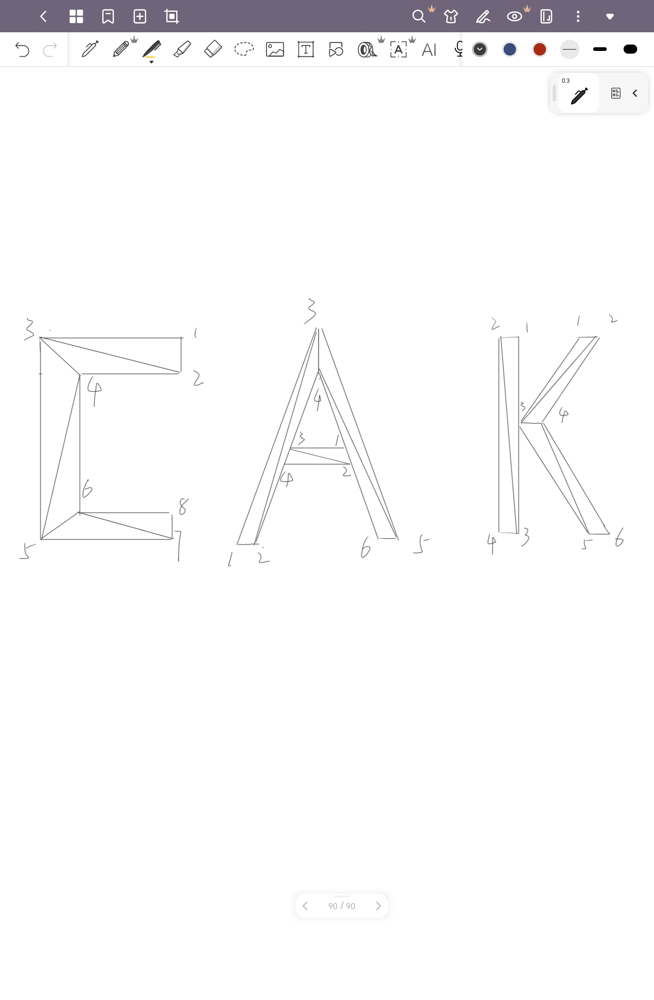

按照上面的顶点顺序进行绘制即可正确显示图像，绘制需要调用glVertex2f次数为：28次

代码如下：

```cpp
void MyGLWidget::scene_2()
{
	glClear(GL_COLOR_BUFFER_BIT | GL_DEPTH_BUFFER_BIT);
	glMatrixMode(GL_PROJECTION);
	glLoadIdentity();
	glOrtho(0.0f, width(), 0.0f, height(), -1000.0f, 1000.0f);

	glMatrixMode(GL_MODELVIEW);
	glLoadIdentity();
	glTranslatef(0.5 * width(), 0.5 * height(), 0.0f);

	//your implementation here, maybe you should write several glBegin
	glPushMatrix();
	//your implementation
	glColor3f(0.839f, 0.153f, 0.157f);
	glTranslatef(-100.0f, -50.0f, 0.0f);
	glBegin(GL_TRIANGLE_STRIP);
	// 绘制C
	// 绘制上横线
	glVertex2f(40.0f, 100.0f);
	glVertex2f(40.0f, 85.0f);
	glVertex2f(-40.0f, 100.0f);
	glVertex2f(-25.0f, 85.0f);
	glVertex2f(-40.0f, 0.0f);
	glVertex2f(-25.0f, 15.0f);
	glVertex2f(40.0f, 0.0f);
	glVertex2f(40.0f, 15.0f);

	glEnd();
	glPopMatrix();


	glPushMatrix();
	glColor3f(0.839f, 0.153f, 0.157f);
	glTranslatef(0.0f, -50.0f, 0.0f);
	// 绘制A
	// 绘制左斜线
	// 保持宽度10 ，依照这个比例，斜边应该是27
	// 底部斜边宽度应该是11
	glBegin(GL_TRIANGLE_STRIP);

	glVertex2f(-40.0f, 0.0f);
	glVertex2f(-29.0f, 0.0f);
	glVertex2f(0.0f, 100.0f);
	glVertex2f(0.0f, 73.0f);
	glVertex2f(40.0f, 0.0f);
	glVertex2f(29.0f, 0.0f);

	glEnd();

	glBegin(GL_TRIANGLE_STRIP);
	glVertex2f(13.0f, 42.0f);
	glVertex2f(17.0f, 32.0f);
	glVertex2f(-13.0f, 42.0f);
	glVertex2f(-17.0f, 32.0f);
	glEnd();

	glPopMatrix();


	glPushMatrix();
	glColor3f(0.839f, 0.153f, 0.157f);
	glTranslatef(100.0f, -50.0f, 0.0f);
	glBegin(GL_TRIANGLE_STRIP);
	// 绘制K
	// 绘制竖线
	glVertex2f(-25.0f, 100.0f);
	glVertex2f(-40.0f, 100.0f);
	glVertex2f(-25.0f, 0.0f);
	glVertex2f(-40.0f, 0.0f);
	glEnd();

	glBegin(GL_TRIANGLE_STRIP);
	glVertex2f(23.0f, 100.0f);
	glVertex2f(40.0f, 100.0f);
	glVertex2f(-25.0f, 50.0f);
	glVertex2f(-8.0f, 50.0f);
	glVertex2f(23.0f, 0.0f);
	glVertex2f(40.0f, 0.0f);
	glEnd();


	glPopMatrix();
	glPopMatrix();
}
```


GL_QUAD_STRIP绘制时，前一个四边形的最后两个点要与接下来的两个点共享以形成下一个四边形，由此也需要顶点以一定顺序进行绘制，这个顺序与GL_TRIANGLE_STRIP是一致的，因此绘制需要调用glVertex2f次数也为：28次

代码如下：

```cpp
void MyGLWidget::scene_3()
{
	glClear(GL_COLOR_BUFFER_BIT | GL_DEPTH_BUFFER_BIT);
	glMatrixMode(GL_PROJECTION);
	glLoadIdentity();
	glOrtho(0.0f, width(), 0.0f, height(), -1000.0f, 1000.0f);

	glMatrixMode(GL_MODELVIEW);
	glLoadIdentity();
	glTranslatef(0.5 * width(), 0.5 * height(), 0.0f);

	//your implementation here, maybe you should write several glBegin
	glPushMatrix();
	//your implementation
	glColor3f(0.839f, 0.153f, 0.157f);
	glTranslatef(-100.0f, -50.0f, 0.0f);
	glBegin(GL_QUAD_STRIP);
	// 绘制C
	// 绘制上横线
	glVertex2f(40.0f, 100.0f);
	glVertex2f(40.0f, 85.0f);
	glVertex2f(-40.0f, 100.0f);
	glVertex2f(-25.0f, 85.0f);
	glVertex2f(-40.0f, 0.0f);
	glVertex2f(-25.0f, 15.0f);
	glVertex2f(40.0f, 0.0f);
	glVertex2f(40.0f, 15.0f);

	glEnd();
	glPopMatrix();


	glPushMatrix();
	glColor3f(0.839f, 0.153f, 0.157f);
	glTranslatef(0.0f, -50.0f, 0.0f);
	// 绘制A
	// 绘制左斜线
	// 保持宽度10 ，依照这个比例，斜边应该是27
	// 底部斜边宽度应该是11
	glBegin(GL_QUAD_STRIP);

	glVertex2f(-40.0f, 0.0f);
	glVertex2f(-29.0f, 0.0f);
	glVertex2f(0.0f, 100.0f);
	glVertex2f(0.0f, 73.0f);
	glVertex2f(40.0f, 0.0f);
	glVertex2f(29.0f, 0.0f);

	glEnd();

	glBegin(GL_QUAD_STRIP);
	glVertex2f(13.0f, 42.0f);
	glVertex2f(17.0f, 32.0f);
	glVertex2f(-13.0f, 42.0f);
	glVertex2f(-17.0f, 32.0f);
	glEnd();

	glPopMatrix();


	glPushMatrix();
	glColor3f(0.839f, 0.153f, 0.157f);
	glTranslatef(100.0f, -50.0f, 0.0f);
	glBegin(GL_QUAD_STRIP);
	// 绘制K
	// 绘制竖线
	glVertex2f(-25.0f, 100.0f);
	glVertex2f(-40.0f, 100.0f);
	glVertex2f(-25.0f, 0.0f);
	glVertex2f(-40.0f, 0.0f);
	glEnd();

	glBegin(GL_QUAD_STRIP);
	glVertex2f(23.0f, 100.0f);
	glVertex2f(40.0f, 100.0f);
	glVertex2f(-25.0f, 50.0f);
	glVertex2f(-8.0f, 50.0f);
	glVertex2f(23.0f, 0.0f);
	glVertex2f(40.0f, 0.0f);
	glEnd();


	glPopMatrix();
	glPopMatrix();
}
```

由此可见，由于共享顶点，GL_TRIANGLE_STRIP和GL_QUAD_STRIP比GL_TRIANGLES开销更小，但同时对绘制顺序的要求更严格。

## 3.不同视角下Orthogonal及Perspective投影方式产生的图像的观察

关键代码如下：

```cpp
	glClear(GL_COLOR_BUFFER_BIT | GL_DEPTH_BUFFER_BIT);
	glMatrixMode(GL_PROJECTION);
	glLoadIdentity();
	if (b == 0)
		glOrtho(0.0f, width(), 0.0f, height(), -1000.0f, 1000.0f);
	else
		gluPerspective(45.0f, width() / height(), 1.0f, 1000.0f);
	glMatrixMode(GL_MODELVIEW);
	glLoadIdentity();
	if (a == 0)
		gluLookAt(0.0f, 0.0f, dis,
			0.0f, 0.0f, 0.0f,
			0.0f, 1.0f, 0.0f);
	else
		gluLookAt(0.0f, 0.5 * dis, dis,
			0.0f, 0.0f, 0.0f,
			0.0f, 1.0f, 0.0f);
	glTranslatef(0.5 * width(), 0.5 * height(), 0.0f);
```

在代码中，通过键盘操作来切换不同投影方式与观察视角。并且通过控制d的大小来改变相机的位置。在实验中我注意到，因为两个投影方式设置的裁剪坐标系的远近允许范围为1000，当d过大时，相机设置的过远导致坐标系转换时让图像在相机坐标系中位置过远，使图像在相机坐标系转换到裁剪坐标系时超出允许的范围，在渲染过程中会被剔除，因此d的取值不宜过大。

glOrtho采用正交投影，正交投影是一种平行投影方式，其中物体的尺寸不会因为距离观察者的距离不同而改变。在正交投影中，所有平行线在投影后仍然保持平行，物体的大小不会因为距离的变化而变化，没有透视效果。

在正交投影下，两个观察角度观察到的图像如下：

从（0,0,d）看向原点(0,0,0)，由于是正视，而且采用平行投影方式，**当d无论如何变化，图像大小都不变**:

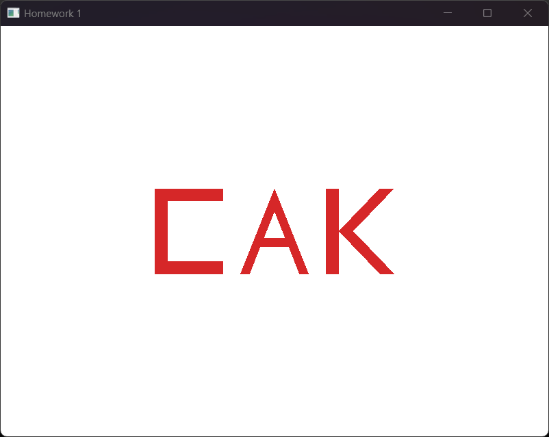

从(0,0.5*d,d)看向原点(0,0,0)，由于是平行投影，当d无论如何变化，图像大小没有变化，但由于是俯视，对比正视图，可以看到字母都变“扁”了:

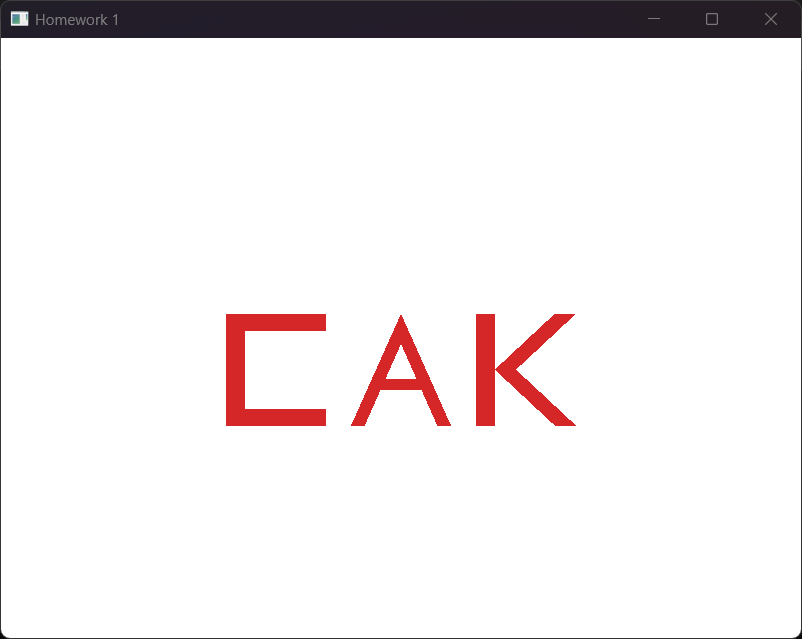


gluPerspective采用透视投影，透视投影是一种中心投影方式，其中物体的尺寸会随着距离观察者的距离增加而减小，以模拟人眼观察现实世界的方式。在透视投影中，平行线在投影后会汇聚于一个点（消失点），物体的大小会随着距离的增加而减小，产生透视效果。

在透视投影下，两个观察角度观察到的图像如下：

从（0,0,d）看向原点(0,0,0)，由于采用了透视投影，**因此d的改变会影响图像的大小**，同时由于在绘制时将模型坐标系进行了平移，整个图像并不在中间显示。当d设置为较小值时，图像变大，显示更边缘，d设置为较大值时，图像变小，显示的更多，符合“近大远小”：

d = 500时：

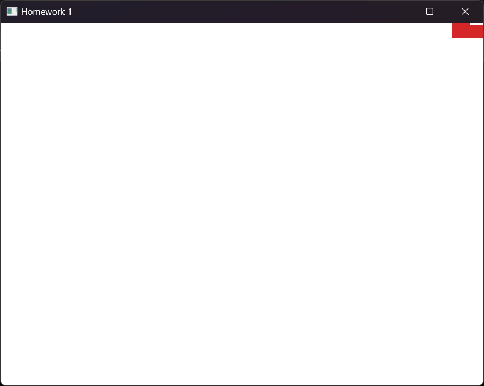

d = 750时：

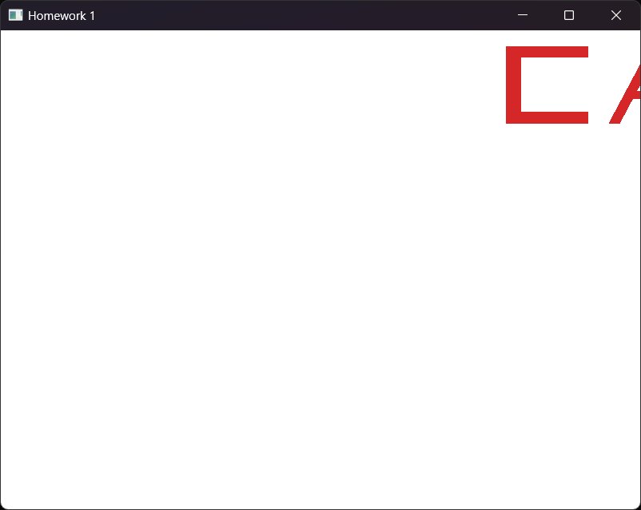


从（0,0.5 * d,d）看向原点(0,0,0)，也符合“近大远小”的特点，且带俯视效果：

d = 500：

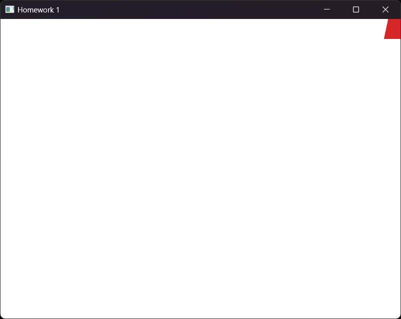


d = 750：

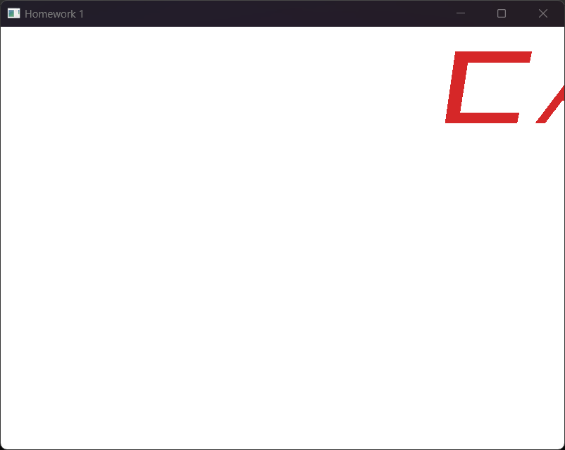


## 3.绘制立体姓氏首字母

在绘制时相比于二维绘制，要清除深度缓冲区，然后绘制时使用glVertex3f对顶点进行绘制，这里我首先绘制前后两个平面，然后再绘制侧面的四边形：

代码如下：

```cpp

void MyGLWidget::scene_4()
{
	float d = 10.0f;
	glClear(GL_COLOR_BUFFER_BIT | GL_DEPTH_BUFFER_BIT);
	glMatrixMode(GL_PROJECTION);
	glLoadIdentity();
	gluPerspective(45.0f, width() / height(), 1.0f, 1000.0f);

	glMatrixMode(GL_MODELVIEW);
	glLoadIdentity();
	gluLookAt(0.0f, 0.0f, 500.0f,
		0.0f, 0.0f, 0.0f,
		0.0f, 1.0f, 0.0f);

	glRotatef(Y, 0, 1, 0);
	glRotatef(X, 1, 0, 0);
	glRotatef(Z, 0, 0, 1);

	glEnable(GL_DEPTH_TEST);
	//your implementation here, maybe you should write several glBegin
	glPushMatrix();
	//your implementation
	glColor3f(0.839f, 0.153f, 0.157f);
	glBegin(GL_TRIANGLE_STRIP);
	// 绘制C前面
	glVertex3f(40.0f, 100.0f, d);
	glVertex3f(40.0f, 85.0f, d);
	glVertex3f(-40.0f, 100.0f, d);
	glVertex3f(-25.0f, 85.0f, d);
	glVertex3f(-40.0f, 0.0f, d);
	glVertex3f(-25.0f, 15.0f, d);
	glVertex3f(40.0f, 0.0f, d);
	glVertex3f(40.0f, 15.0f, d);

	glEnd();
	glPopMatrix();


	glPushMatrix();
	//your implementation
	glColor3f(0.839f, 0.839f, 0.157f);
	glBegin(GL_TRIANGLE_STRIP);
	// 绘制C后面
	glVertex3f(40.0f, 100.0f, -d);
	glVertex3f(40.0f, 85.0f, -d);
	glVertex3f(-40.0f, 100.0f, -d);
	glVertex3f(-25.0f, 85.0f, -d);
	glVertex3f(-40.0f, 0.0f, -d);
	glVertex3f(-25.0f, 15.0f, -d);
	glVertex3f(40.0f, 0.0f, -d);
	glVertex3f(40.0f, 15.0f, -d);

	glEnd();
	glPopMatrix();


	glPushMatrix();
	//your implementation
	glColor3f(0.839f, 0.439f, 0.157f);
	glBegin(GL_TRIANGLE_STRIP);
	// 绘制C后面
	glVertex3f(40.0f, 100.0f, -d);
	glVertex3f(40.0f, 85.0f, -d);
	glVertex3f(40.0f, 100.0f, d);
	glVertex3f(40.0f, 85.0f, d);
	glEnd();
	glPopMatrix();

	glPushMatrix();
	//your implementation
	glColor3f(0.439f, 0.439f, 0.157f);
	glBegin(GL_TRIANGLE_STRIP);
	// 绘制C后面
	glVertex3f(40.0f, 100.0f, -d);
	glVertex3f(-40.0f, 100.0f, -d);
	glVertex3f(40.0f, 100.0f, d);
	glVertex3f(-40.0f, 100.0f, d);
	glEnd();
	glPopMatrix();

	glPushMatrix();
	//your implementation
	glColor3f(0.439f, 0.439f, 0.457f);
	glBegin(GL_TRIANGLE_STRIP);
	// 绘制C后面
	glVertex3f(40.0f, 85.0f, d);
	glVertex3f(-25.0f, 85.0f, d);
	glVertex3f(40.0f, 85.0f, -d);
	glVertex3f(-25.0f, 85.0f, -d);
	glEnd();
	glPopMatrix();

	glPushMatrix();
	//your implementation
	glColor3f(0.439f, 0.339f, 0.457f);
	glBegin(GL_TRIANGLE_STRIP);
	// 绘制C后面

	glVertex3f(-25.0f, 85.0f, d);
	glVertex3f(-25.0f, 15.0f, d);
	glVertex3f(-25.0f, 85.0f, -d);
	glVertex3f(-25.0f, 15.0f, -d);
	glEnd();
	glPopMatrix();

	glPushMatrix();
	//your implementation
	glColor3f(0.439f, 0.339f, 0.457f);
	glBegin(GL_TRIANGLE_STRIP);
	// 绘制C后面

	glVertex3f(-25.0f, 15.0f, d);
	glVertex3f(-25.0f, 15.0f, -d);

	glVertex3f(40.0f, 15.0f, d);
	glVertex3f(40.0f, 15.0f, -d);
	glEnd();
	glPopMatrix();


	glPushMatrix();
	//your implementation
	glColor3f(0.039f, 0.339f, 0.57f);
	glBegin(GL_TRIANGLE_STRIP);
	// 绘制C后面


	glVertex3f(40.0f, 15.0f, d);
	glVertex3f(40.0f, 15.0f, -d);
	glVertex3f(40.0f, 0.0f, d);
	glVertex3f(40.0f, 0.0f, -d);
	glEnd();
	glPopMatrix();


	glPushMatrix();
	//your implementation
	glColor3f(0.039f, 0.039f, 0.57f);
	glBegin(GL_TRIANGLE_STRIP);
	// 绘制C后面

	glVertex3f(40.0f, 0.0f, d);
	glVertex3f(40.0f, 0.0f, -d);

	glVertex3f(-40.0f, 0.0f, d);
	glVertex3f(-40.0f, 0.0f, -d);
	glEnd();
	glPopMatrix();


	glPushMatrix();
	//your implementation
	glColor3f(0.039f, 0.39f, 0.057f);
	glBegin(GL_TRIANGLE_STRIP);
	// 绘制C后面

	glVertex3f(-40.0f, 0.0f, d);
	glVertex3f(-40.0f, 0.0f, -d);

	glVertex3f(-40.0f, 100.0f, d);
	glVertex3f(-40.0f, 100.0f, -d);

	glEnd();
	glPopMatrix();

	glPopMatrix();
}
```

正面效果图如下：

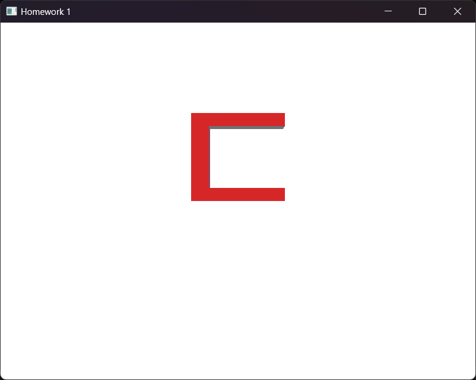

## 4.三维旋转

核心代码如下：

```cpp
	glRotatef(X, 0, 1, 0);
	glRotatef(Y, 1, 0, 0);
	glRotatef(Z, 0, 0, 1);
```

通过组合来实现绕不同轴的旋转。

绕x轴旋转：

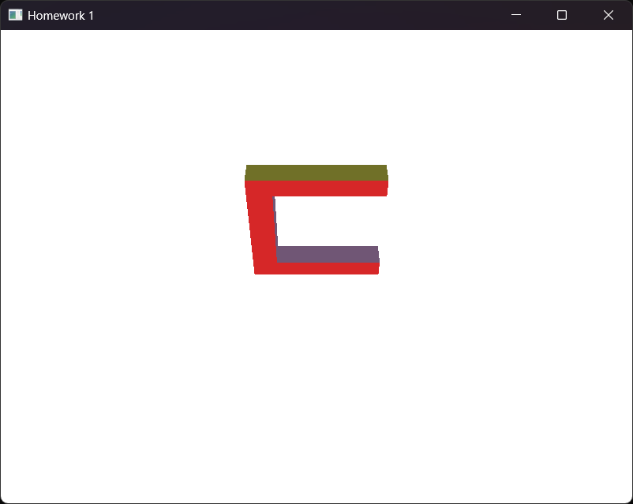

绕y轴旋转：

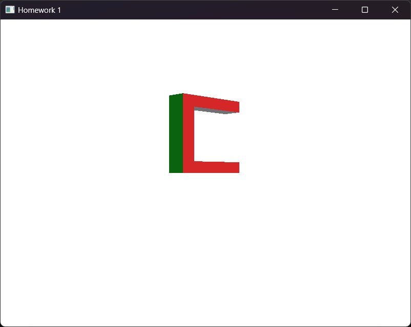

绕z轴旋转：

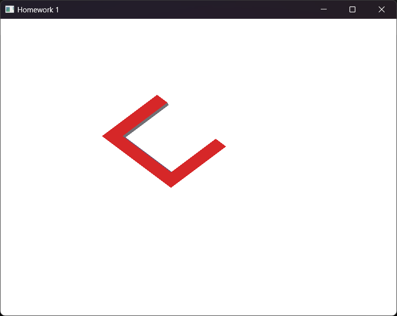

绕x轴逆时针旋转（视角朝向正方向）：

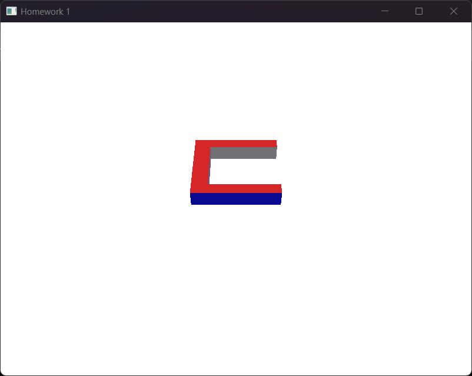

叠加旋转：

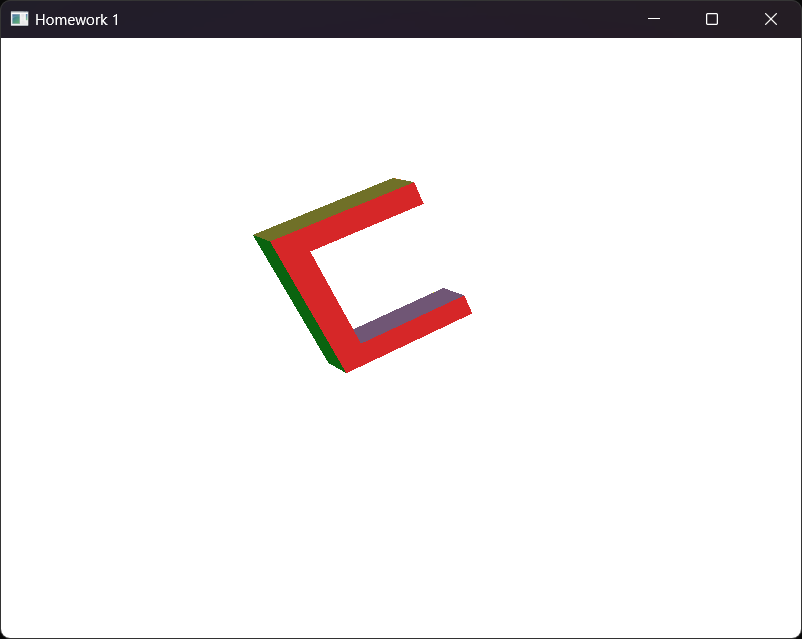


## 5.控制说明：

控制主要通过键盘，代码如下：

```cpp
void MyGLWidget::paintGL()
{
	if (scene_id==0) {
		scene_0();
	}
	else if (scene_id == 1){
		scene_1();
	}
	else if (scene_id == 2) {
		scene_2();
	}
	else if (scene_id == 3) {
		scene_3();
	}
	else if (scene_id == 4) {
		scene_4();
	}

}

void MyGLWidget::resizeGL(int width, int height)
{
	glViewport(0, 0, width, height);
	update();
}

void MyGLWidget::keyPressEvent(QKeyEvent *e) {
	//Press 0 or 1 to switch the scene
	if (e->key() == Qt::Key_0) {
		scene_id = 0;
		update();
	}
	else if (e->key() == Qt::Key_1) {
		scene_id = 1;
		update();
	}
	else if (e->key() == Qt::Key_2) {
		scene_id = 2;
		update();
	}
	else if (e->key() == Qt::Key_3) {
		scene_id = 3;
		update();
	}
	else if (e->key() == Qt::Key_4) {
		scene_id = 4;
		update();
	}
	else if (e->key() == Qt::Key_R) {
		factor *= -1;
		update();
	}
	else if (e->key() == Qt::Key_X) {
		X += factor * 15;
		update();
	}
	else if (e->key() == Qt::Key_Y) {
		Y += factor * 15;
		update();
	}
	else if (e->key() == Qt::Key_Z) {
		Z += factor * 15;
		update();
	}
	else if (e->key() == Qt::Key_V) {
		a = (a + 1) % 2;
		update();
	}
	else if (e->key() == Qt::Key_T) {
		b = (b + 1) % 2;
		update();
	}
	else if (e->key() == Qt::Key_D) {
		dis += factor * 50;
		update();
	}

}
```

一共有5个场景，0为初始场景，1-3为使用不同绘制方法绘制的二维平面名字字母缩写，4为三维首字母缩写。X Y Z键控制三维字母绕XYZ轴的旋转情况。V控制观察视角，T控制投影方式，D控制相机的距离，V，T和D仅在场景1中有效，R控制变量是增加还是减少。
