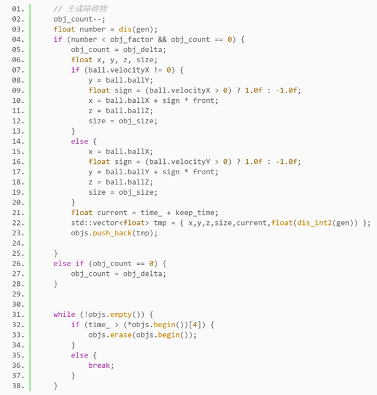
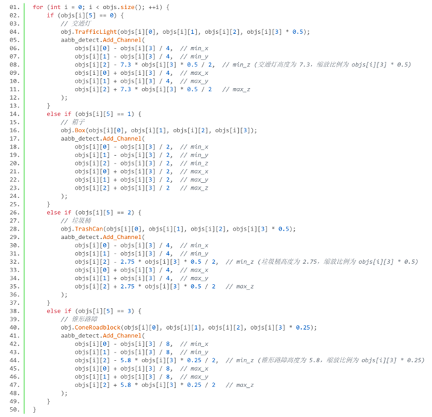
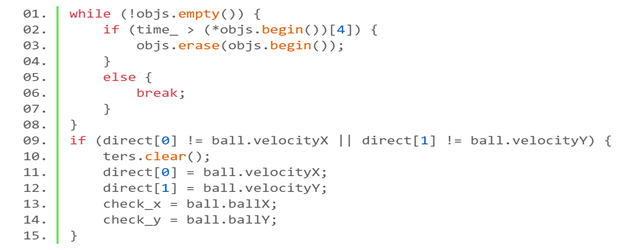
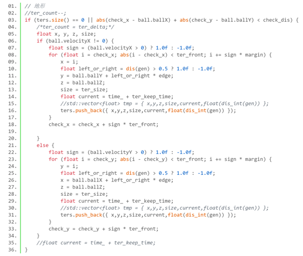
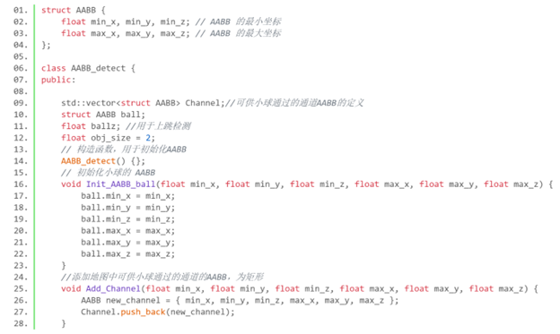
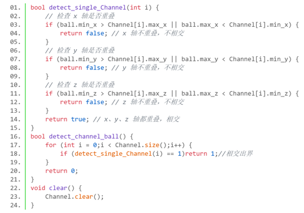
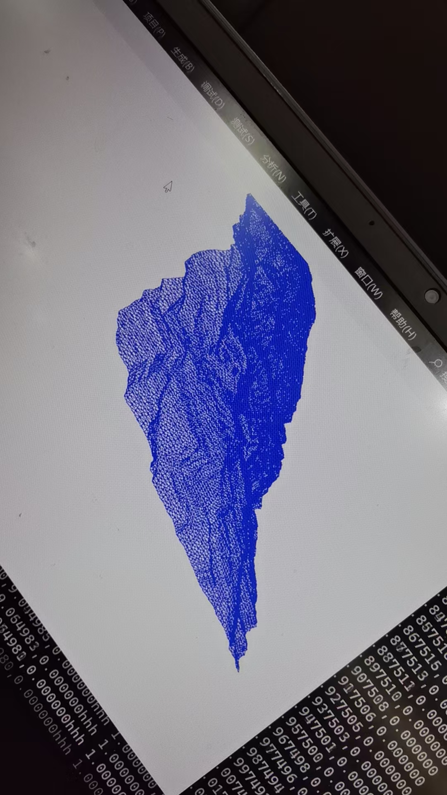

# 图形学个人报告

学号：22320021    姓名：陈安康

在图形学大作业中，我主要完成场景障碍物素材的加载和碰撞检测。

## 场景与障碍物的动态加载生成

### 障碍物的动态加载

障碍物采用随机生成的方式，每隔一段时间进行概率(obj_factor控制，起始为0.3，随着随着时间的进行，障碍物的生成概率会不断增加)检查，在小球运动轨迹的前方调用绘制函数绘制障碍物，阻碍小球前进，同时为了保证障碍物一直存在导致小球在不停转弯后陷入“死胡同”，减小障碍物绘制增加导致的性能开销，每隔一段时间固定对已经生成的障碍物进行清除。

实现方面，维护一个队列（objs），存放生成障碍物所需要的位置、时间等信息。在每次渲染时，依据概率进行障碍物添加，删除存放时间过早的障碍物，将存放的参数信息传入绘制函数进行绘制。代码如下：

障碍物的绘制和删除：

障碍物的绘制：

### 场景建筑的动态加载

对于场景建筑的加载，大体流程沿用障碍物绘制流程。不过由于场景只起装饰作用，因此需要保证场景不会与小球相撞，同时为了实现性能优化和小球转向导致走进场景建筑的“死胡同”。场景加载是动态生成的。

为了保证场景动态生成的同时不影响视觉体验，设置检查点（check_x和check_y），初始或者方向改变后小球检查点重置为小球位置。规定当前小球行动方向为正方向，以小球越过检查点作为绘制开始的信号。在正方向两侧一定宽度处（edge），沿正方向一定范围(ter_front)开始每隔一段位置（margin）以概率选边绘制建筑物，防止障碍物穿模。同时，由于场景房屋是在小球两边绘制的，当小球转向时，为了避免小球“撞击”房屋模型，需要判断小球当前方向是否发生改变（通过direct数组存储行进速度来实现），当检查到速度方向改变时，需要清除所有的建筑物，并重新设置检查点，这样就可以实现场景的无缝衔接（理论上会有一帧的误差，也可以通过调整代码顺序优化掉，不过由于人的肉眼完全察觉不出来，所以就没有进行优化，效果依然维持）。

代码上，与障碍物的流程相同，同样是维护一个队列存放建筑绘制的信息，传入绘制函数进行绘制。不过添加逻辑不一样，多出了方向判断清除功能。清除代码如下：

添加代码：

## 碰撞检测

由于小球只能沿与XY轴平行的方向移动，因此使用AABB碰撞检测是再合适不过的了。

AABB（Axis - Aligned Bounding Box）碰撞检查是一种用于检测两个物体是否发生碰撞的简单而有效的方法。它的基本思想是用一个最小的轴向对齐的矩形（在 2D 中）或长方体（在 3D 中）来包围物体。这个包围盒的边与坐标轴平行，这样就简化了碰撞检测的计算。

当两个 AABB 的投影在所有坐标轴（在 2D 中有两个坐标轴 x 和 y，在 3D 中有三个坐标轴 x、y 和 z）上都有重叠时，就认为这两个 AABB 所包围的物体发生了碰撞。反之，如果在任何一个坐标轴上它们的投影没有重叠，那么这两个物体就没有碰撞。这是基于分离轴定理（SAT）的一种简化情况，因为 AABB 的边是与坐标轴平行的，所以我们只需要检查坐标轴方向就可以了。

假设我们有两个物体A和B，用AminX或者AmaxX表示A在X方向的最小值和最大值，物体B或者其余维度同理。

在 x 轴方向上：AminX<= BmaxX and AmaxX >= BminX

在 y 轴方向上：AminY<= BmaxY and AmaxY >= BminY

在 z 轴方向上：AminZ<= BmaxZ and AmaxZ >= BminZ

当这三个条件同时满足时，AB物体发生碰撞。

代码实现上，实现一个两个类，AABB包含物体在某个维度的最大最小值，AABB_detect类用于检测。定义如下：

在AABB_detect里面实现检测算法：

## 过程中的困难

遇到的大部分困难基本上是方案选择上的纠结以及参数调试。

最初我想着使用真实的地形高度图来完成地形的绘制，通过加载不同的高度图也可以实现地图的转换，而且某些游戏（如都市天际线）可以自定义高度图，这样就可以实现地图的自定义。初步的实现效果如下：

可是由于网格数太多，而且地面不是平的，实现碰撞检查会十分复杂（最初我想直接引入开源的物理引擎，如Bullet 物理引擎，并且成功的在项目上实现了构建），不过由于这样的话实现难度骤增，还要去学习物理引擎的使用，和图形学的课程无关，和小组成员讨论后，决定放弃这个想法。

初始时为了实现动态的加载场景同时不影响视觉效果，在参数调试以及方案选择上花费了不少功夫，初始时没有按照一定间隔进行绘制，导致房屋出现了穿模情况，后面进行了改良，隔一定间隔进行绘制，使穿模情况不再发生。其次是小球转弯时，由于房屋是绘制在小球两侧的，因此如果不做预防，小球会撞击房屋，这里刚开始没想着用“清屏”的方法，而是在房屋绘制上下功夫，折腾了好久也没弄出来，遂放弃。采用清屏方式，并且通过重置检查点来实现转向后场景加载也同时到位。实现了预期的效果。
