# 数据库实验报告 第9周

姓名:陈安康  学号:22320021

## 实验内容：

（1）按照要求创建表如下：

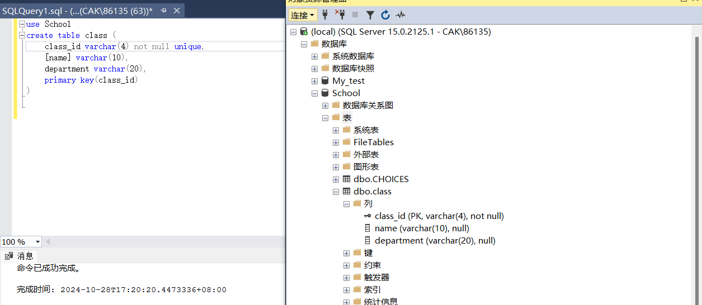

（2）创建事务T3，并在其中嵌套创建事务T4，运行，发现运行失败，原因是前后插入的两行记录的class_id重名冲突了：

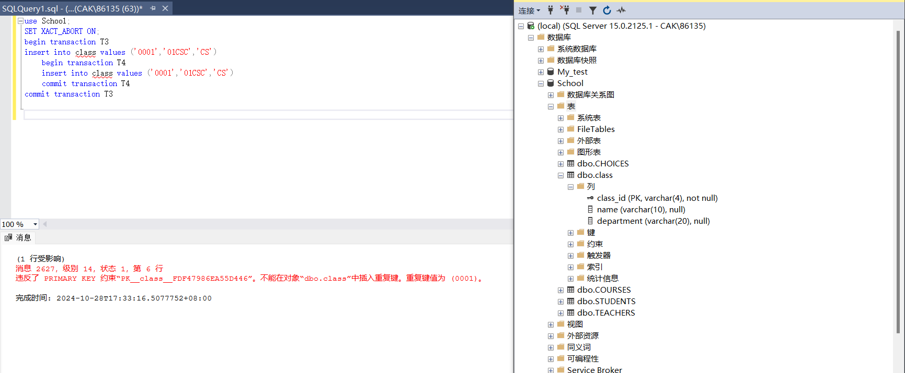

然后查看表中内容，发现没有任何记录，这是因为事务的特性导致事务的全部操作要么全部成功，要么全部失败，由于嵌套的事务T4中的命令执行失败，原本T3中执行成功的插入操作命令也被回滚，导致表中没有记录：

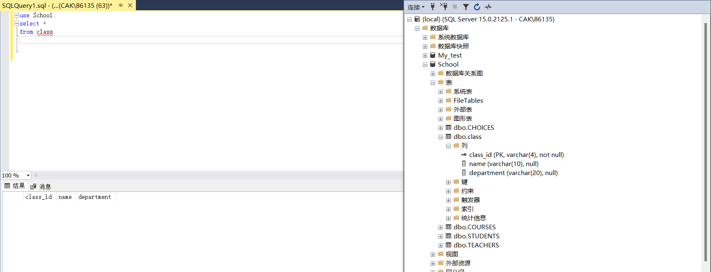

（3）由于前面事务操作失败导致回滚，所以首先插入记录（‘0001’，01CSC’,‘CS’），然后使用语句尝试将name = ‘01CSC’的记录的class_id修改为null，结果失败，这是因为违反了class_id的not null属性，此操作将破坏实体完整性，因此导致更新失败：

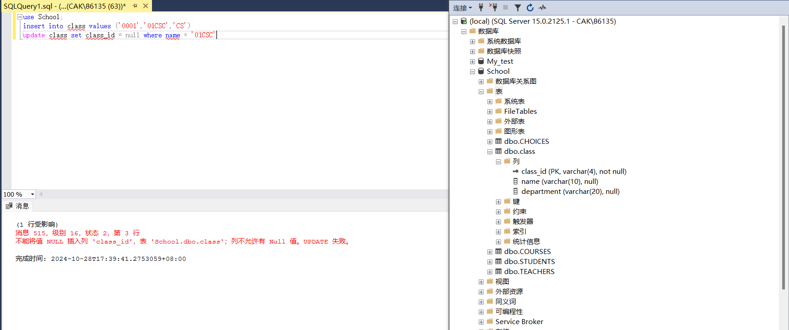

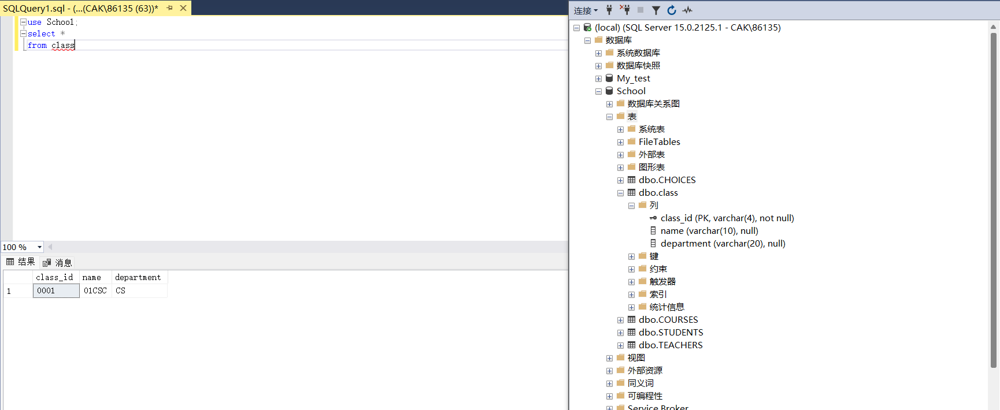

（4）不创建事务，插入两个元组，发现第二个插入操作更新失败，这是因为两个元组的class_id一致，违反了class_id的unique属性，此操作将破坏实体完整性，导致更新失败。由于没有创建事务，因此首先插入的元组操作会被保留，查看表中状态如下：

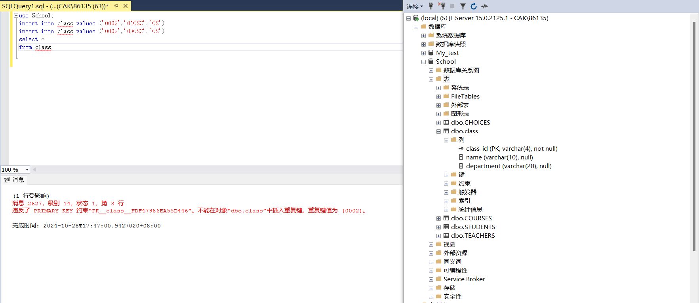

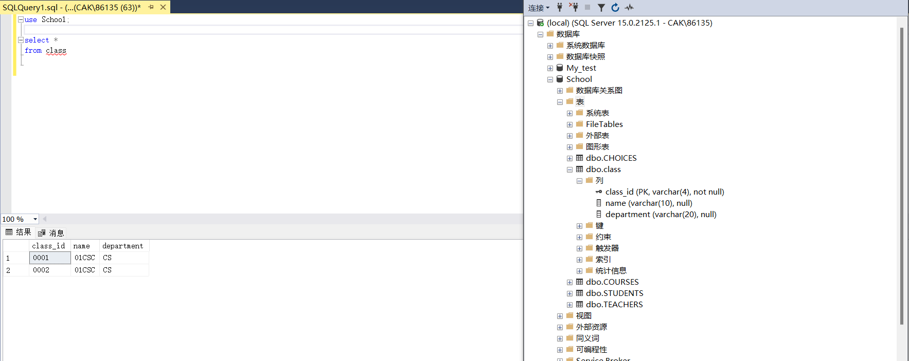

（5）创建事务，开启回滚，尝试插入两个元组。会发现操作失败，原因是class_id = 0001的记录与之前的记录重复了。

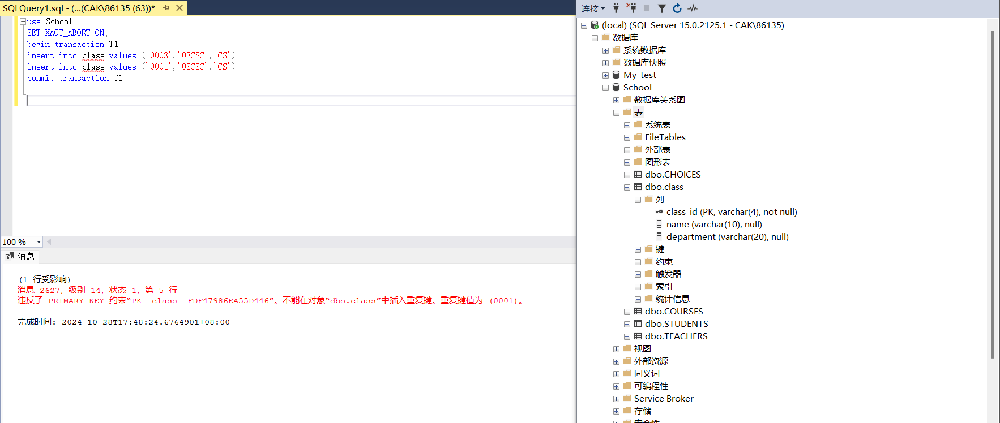

查看表中记录，操作插入的第一个元组也被回滚掉了，没有插入进去，原因是事务操作要么全部成功，要么全部失败的性质，使第一个操作被回滚掉：

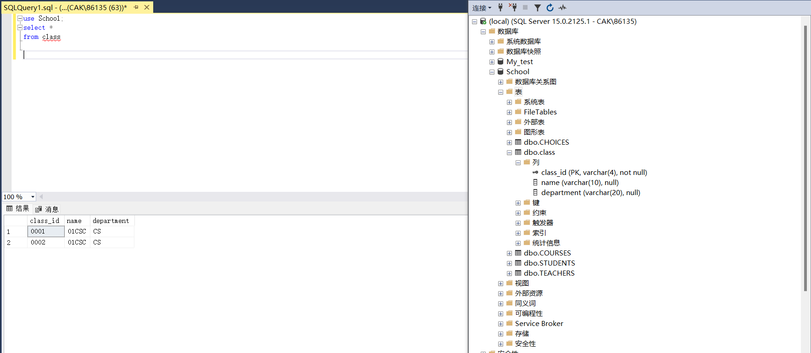

（6）尝试设置name为主键，发现失败，原因是前面已经设置过主键了：

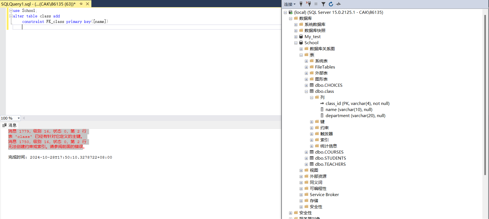

这似乎不是我们想要的报错，因此尝试把原先的主键删除，继续尝试设置主键：

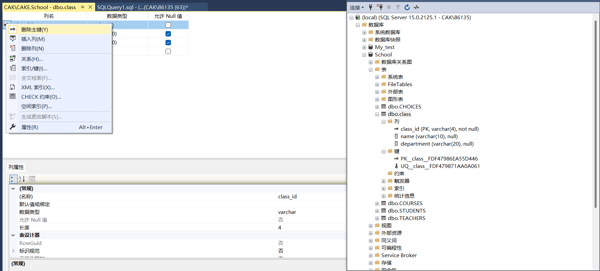

结果因为主键要求not null 约束，而name没有此约束，遂再次创建失败：

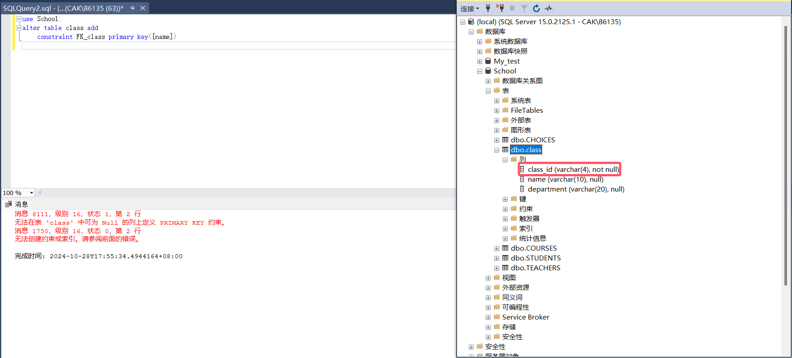

再次给name属性添加约束not null，继续设置主键：

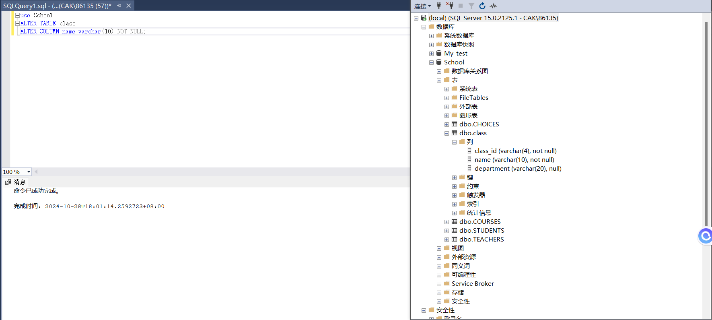

结果创建还是失败，因为经过之前的创建，name中有重复的值，不符合主键的要求，因此创建还是失败：

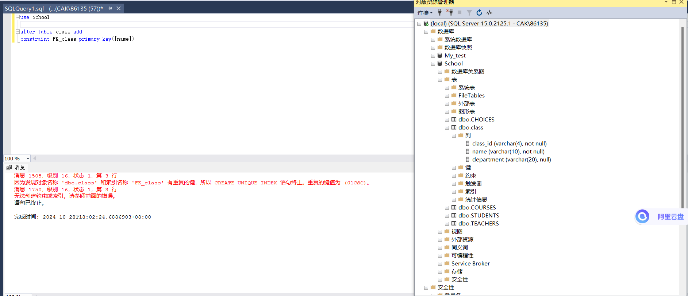

综上，由于主键not null，unique的要求，导致name不能设置为主键。
