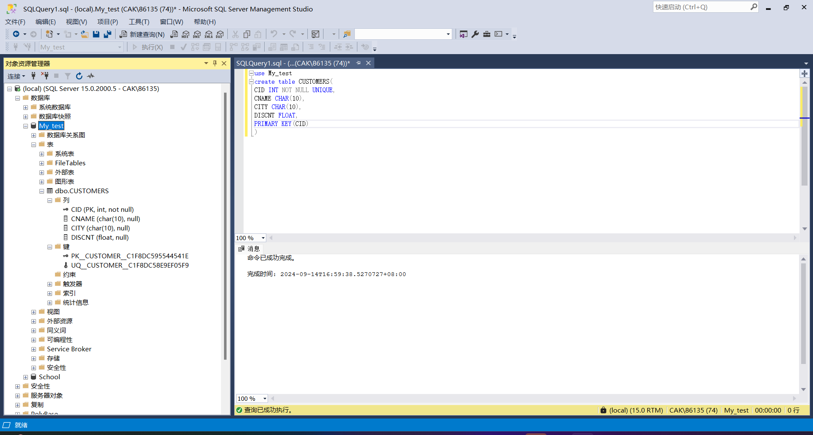
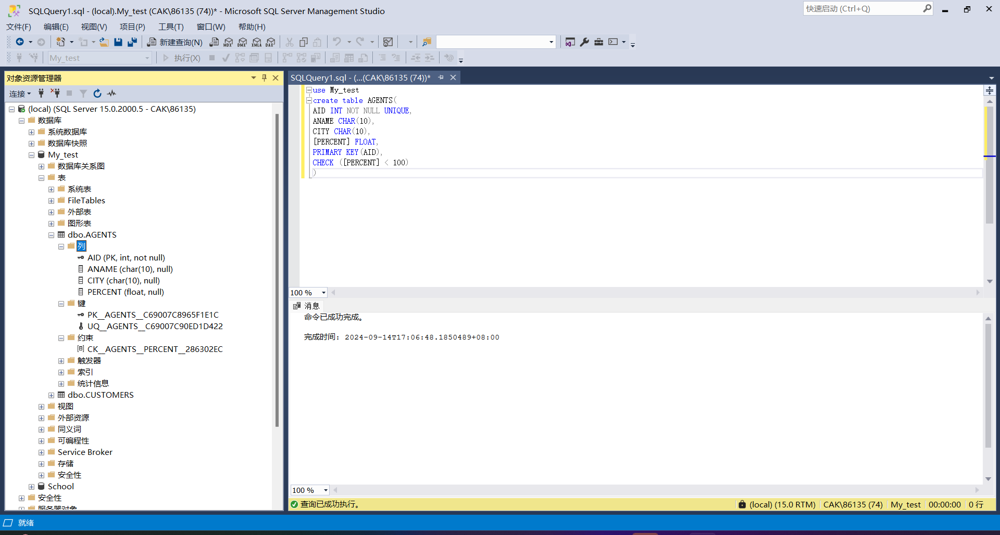
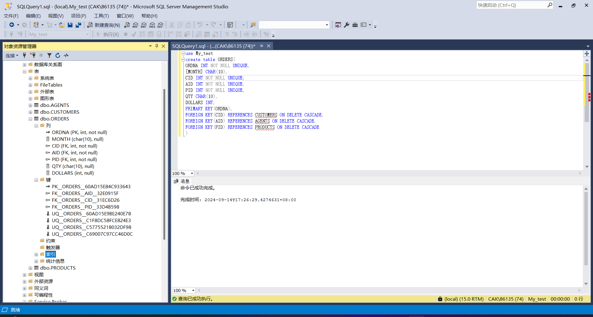
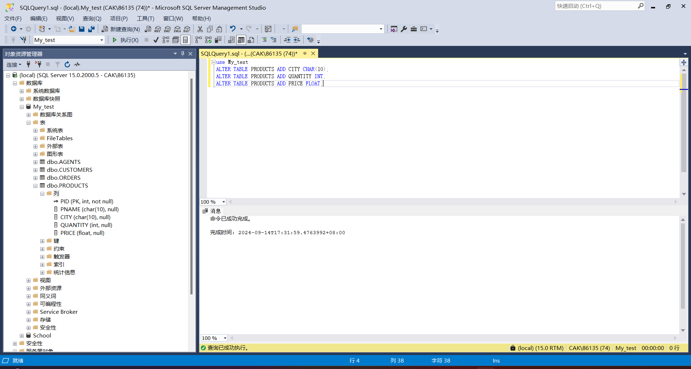
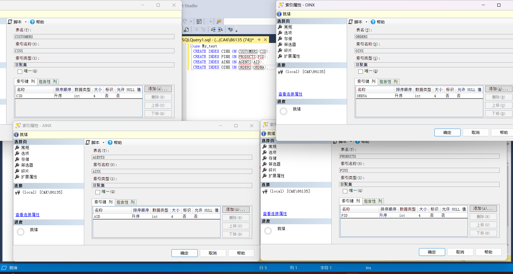
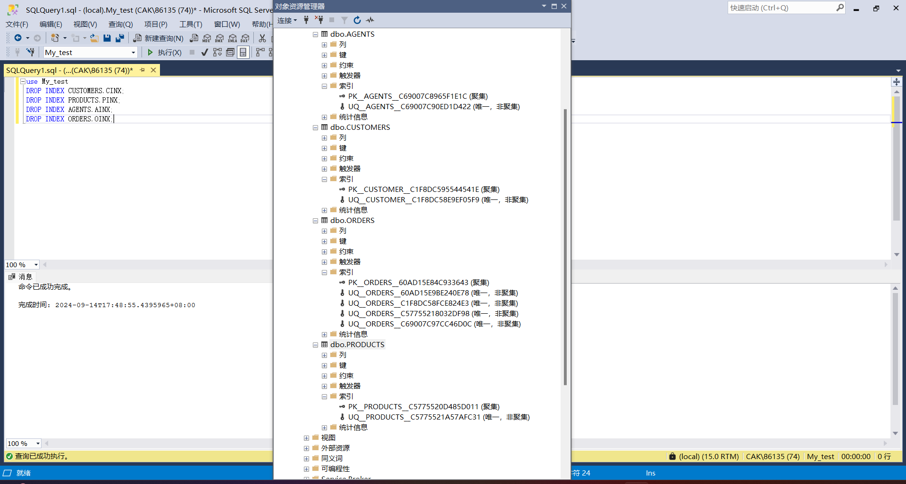
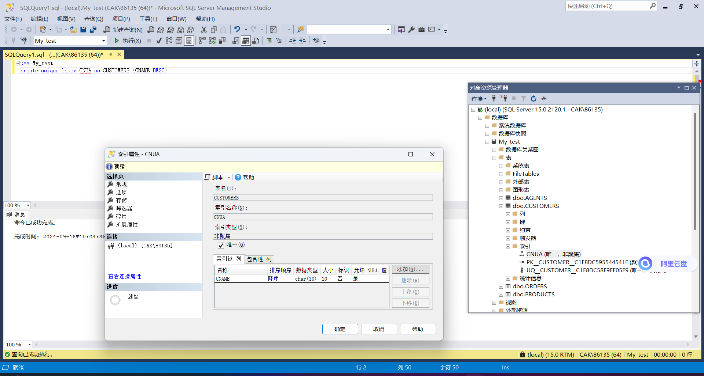
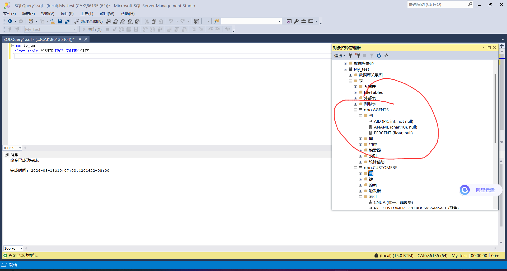
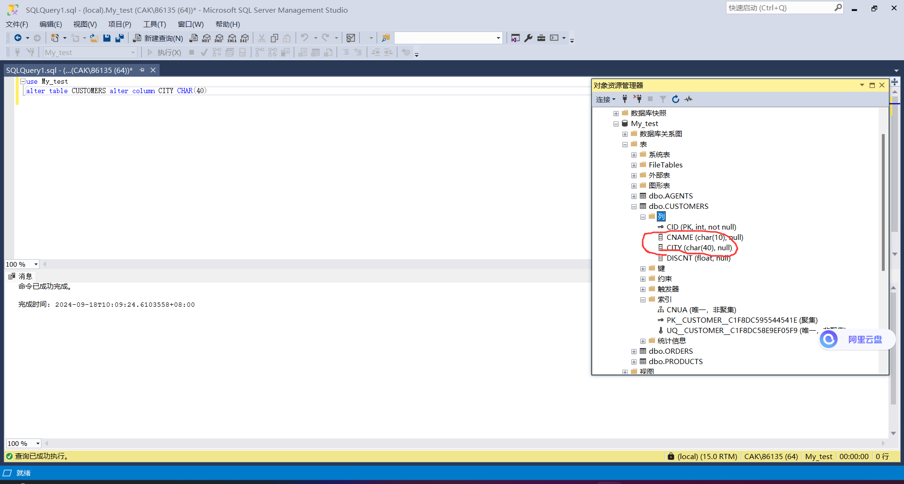
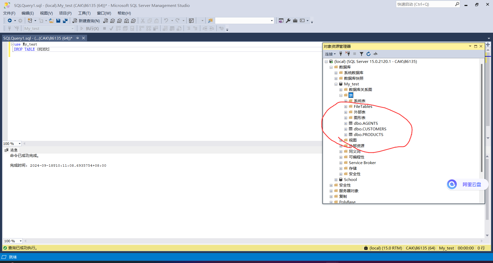

# 数据库实验报告 第2周

姓名:陈安康  学号:22320021

## 实验内容：

任务（1) - (2)

通过CREATE TABLE命令来创建数据库表，并指定主键和外键以及完整性约束。以下图片展示了数据库表创建过程的对应代码以及结果，从对象资源管理器中可以看见代码运行成功从按照要求创建数据库表，其中因为PRODUCTS创建代码流程与CUSTOMERS表创建流程一致因此没有截入。

任务（3）

通过ALTER TABLE `<table name>` ADD `<name>` `<type>`来对数据库表属性进行修改。以下截图展示对PRODUCTS表的修改，添加属性，对象资源管理器展示了添加结果：

任务（4）

通过CREATE INDEX 来创建索引。以下截图展示了索引创建的代码以及结果：

任务（5）

通过DROP INDEX来取消索引。以下截图展示了索引取消的代码以及结果：

任务（6）

通过CREATE UNIQUE INDEX来创建唯一性索引。以下截图展示结果：

任务（7）

通过ALTER TABLE `<table name>` DROP COLUMN `<column>` 来删除属性。以下截图展示删除操作以及对应结果，city属性被成功删除：

任务（8）

通过ALTER TABLE `<table name>` ALTER COLUMN `<column>` `<type>`来修改属性。以下截图展示结果：

任务（9）

通过DROP TABLE 来删除表。以下截图展示结果：

