# 数据库实验报告 第10周

姓名：陈安康  学号：22320021

## 实验内容

首先创建实验所需的所有表：

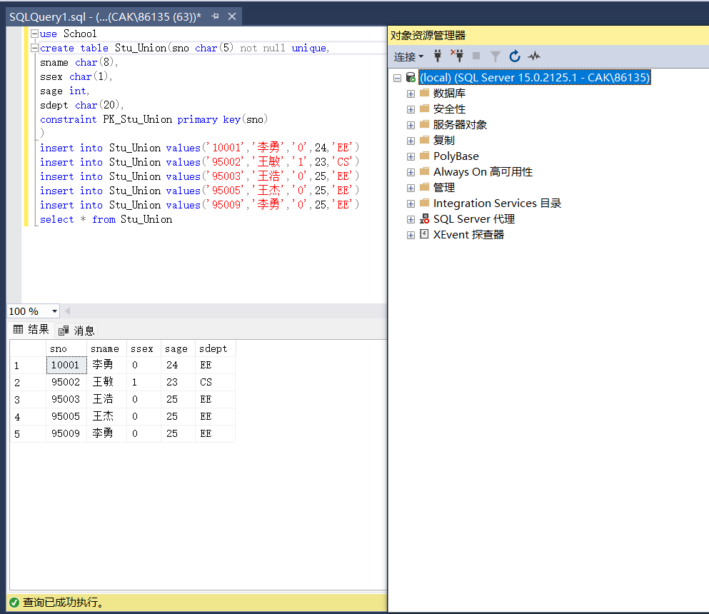

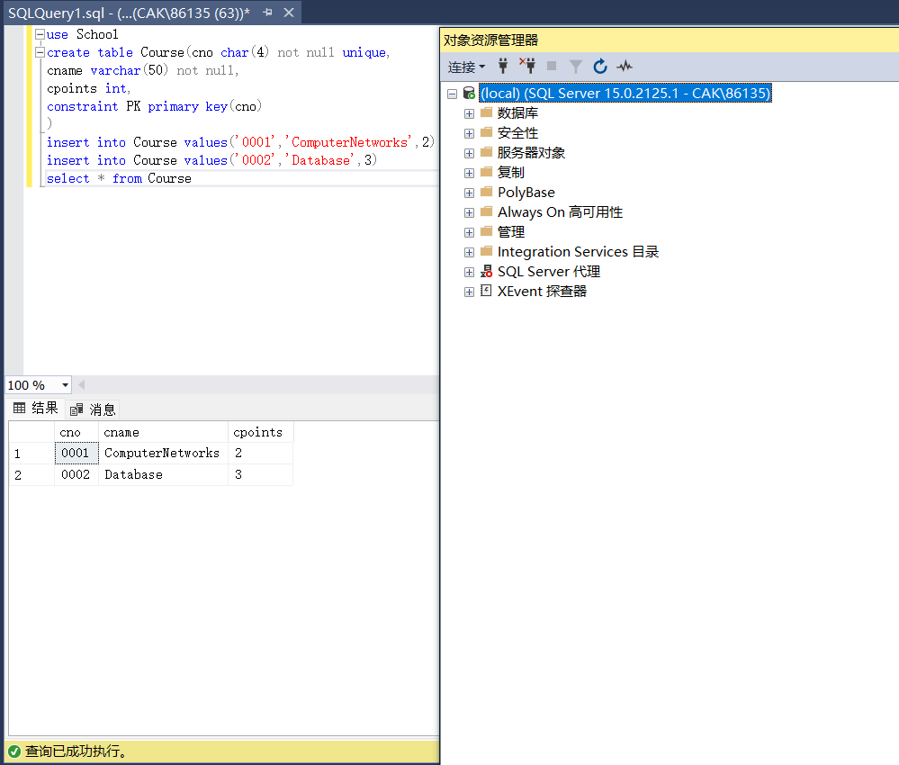

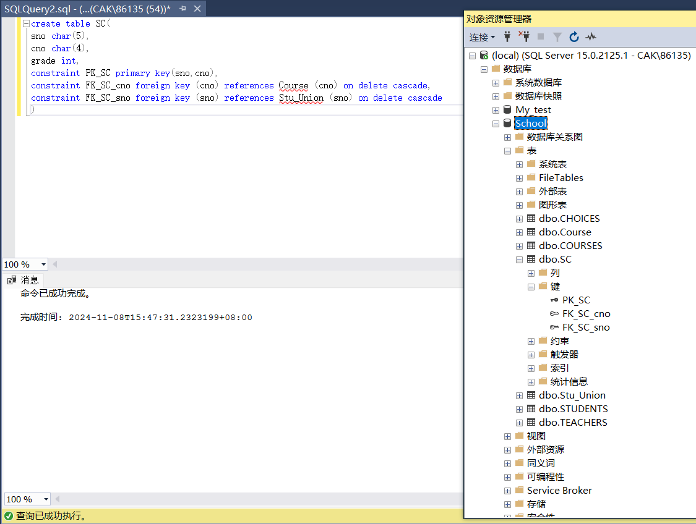

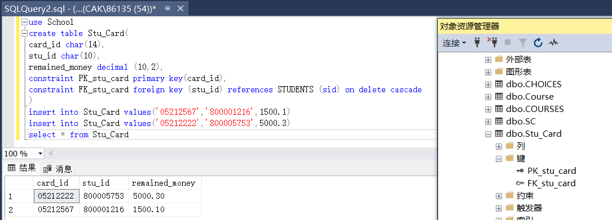

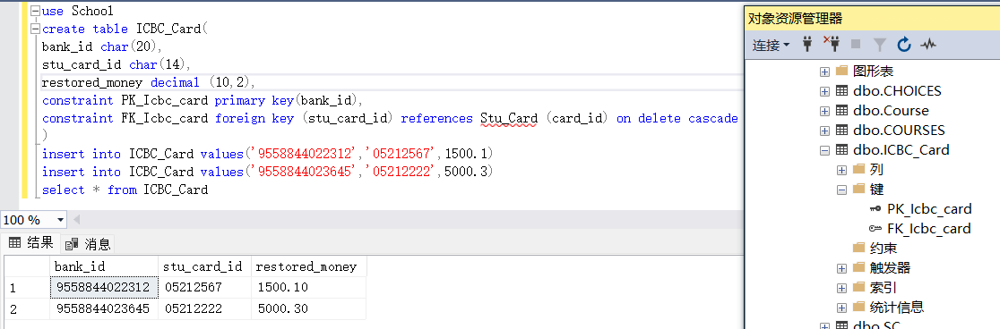

（1）首先使用alter table命令将原先的on delete cascade属性删除，然后再添加no delete no action属性：

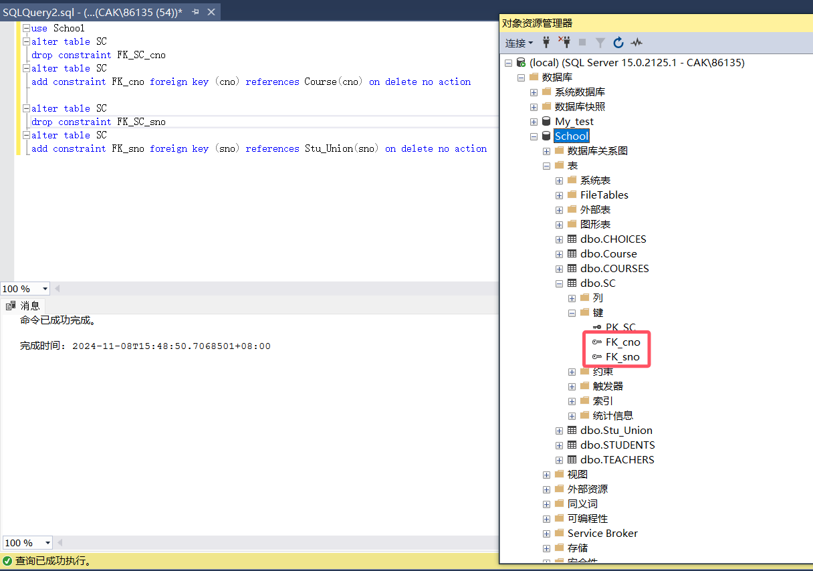

插入实验1数据，并删除Stu_Union中的数据，发现删除操作失败。原因是SC中sno的外键属性已经被修改为on delete no action，这意味着**从表中有匹配项时，主表中相应的候选键不允许update/delete操作**，删除前面的操作在SC中插入了sno = ‘10001’的项，因此从表中有了匹配项，对主表Stu_Union的删除操作失败：

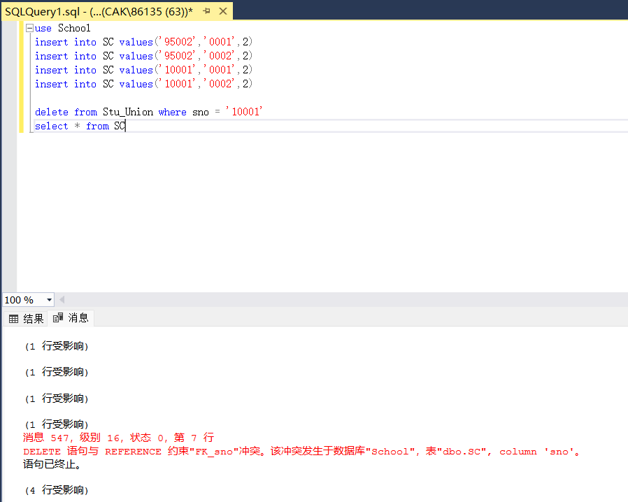

（2）要求跳过。

（3）按要求创建事务，修改外键属性，然后删除STUDENTS中的sid = ‘800005753’(这个项也对应位于Stu_Card中)，执行，发现失败，原因是因为违法了CHOICES的外键属性：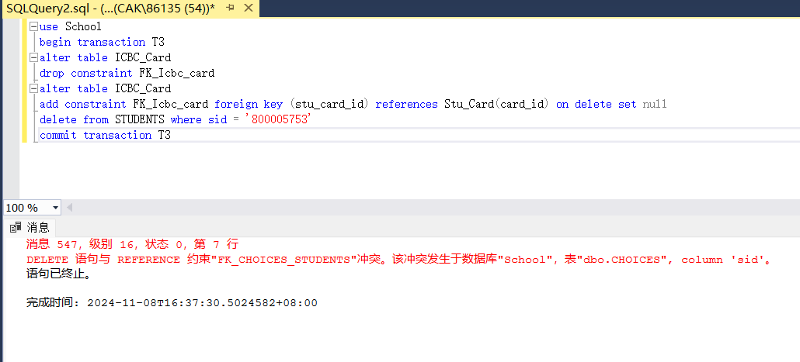

这不是我们想要看到的，因此在对CHOICES的外键约束进行修改后，继续执行，发现执行成功：

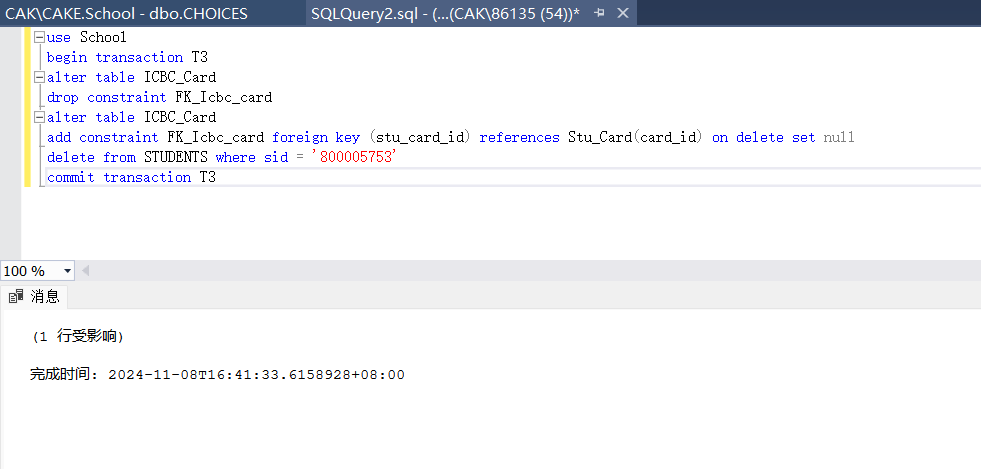

同时查看IBIC_Card和Stu_Card表，会发现Stu_Card外键关联‘800005753’的项已经被删除，而IBIC_Card中关联Stu_Card中对应的外键被置为NULL：

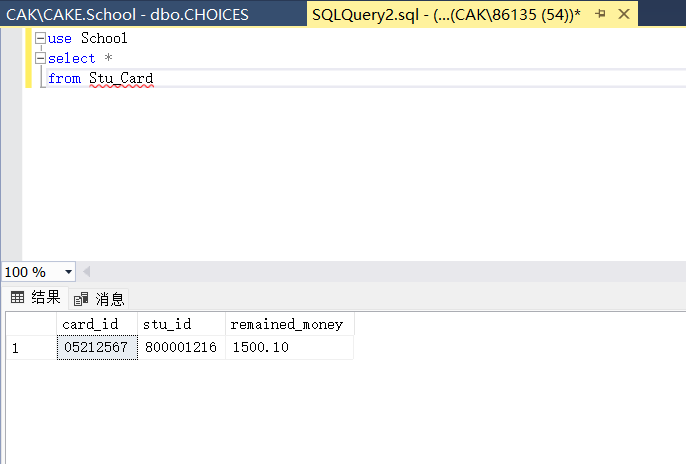

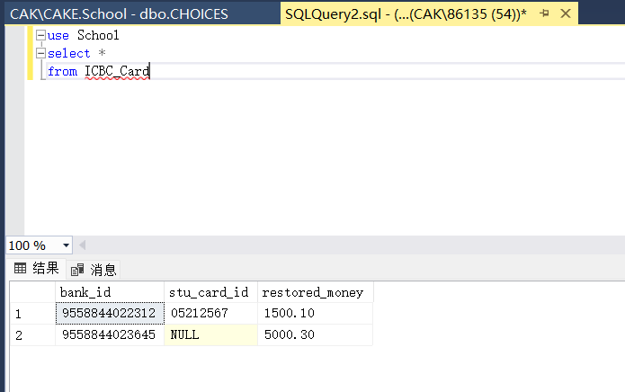

这是因为Stu_Card的外键属性是on delete cascade，因此当STUDENTS中的相关项被删除时，作为从表的Stu_Card中的相关项也会被删除。而当Stu_Card中的项被删除时，由于其从表IBIC_Card的外键属性被设置为on delete set null，即主表中的相关项被删除的话，从表中的相关项被设置为NULL，因此IBIC_Card中的外键被设置为NULL。

从这个实验我们可以看到**外键的存在使得表的操作会产生级联影响**。

（4）为了满足要求，创建表StudentMutualAid结构如下，其中外键参照自己的主键：

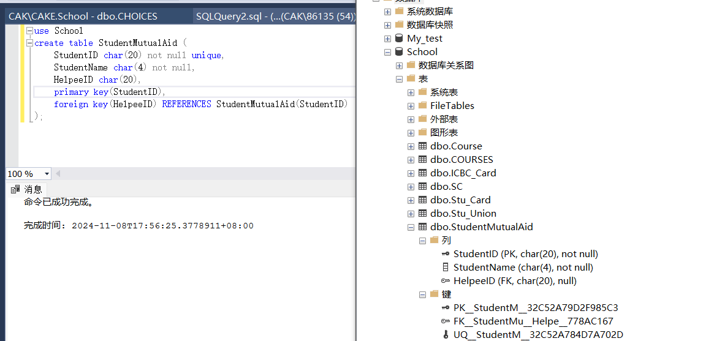

（5）为了满足要求，创建表Members和Departments如下，这两个表相互参照，为了避免无法定义的问题，在创建Members表时先不定义外键，而是在创建完完整的Departments表后通过alter table命令添加外键：

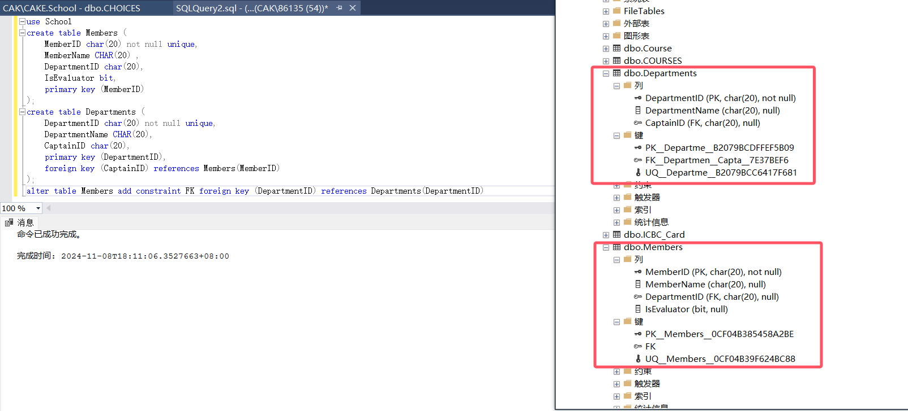
