# 数据库实验报告 第11周

姓名：陈安康  学号：22320021

## 实验内容

创建Worker表如下：

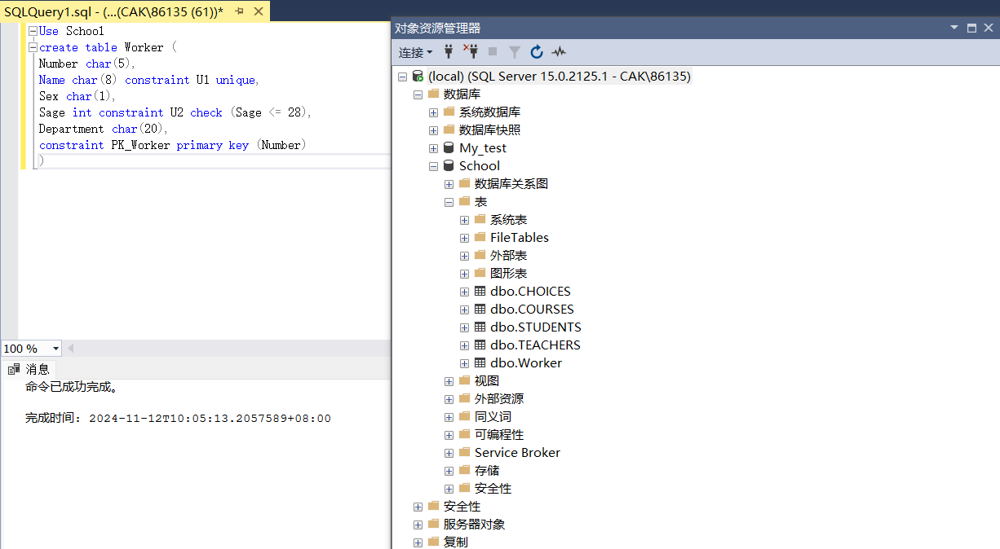

（1）-（3）添加约束U3，令Sage >= 0：

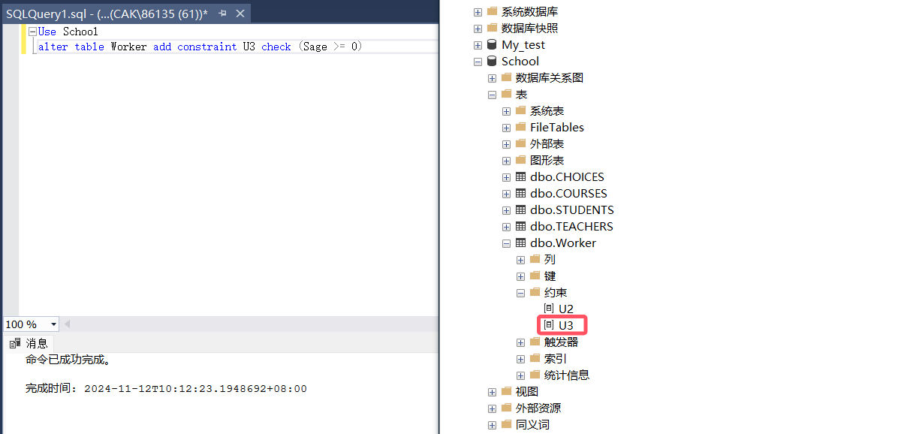

尝试插入记录，它的Sage = -1，结果插入失败，因为其违反了U3的约束：

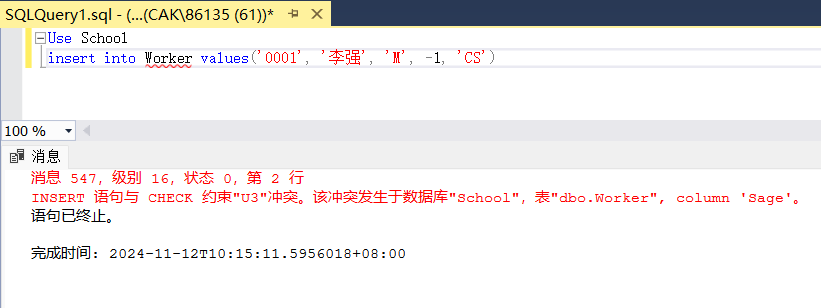

继续尝试插入记录，它的Sage = 26，既不违反U2，也不违反U3，插入成功：
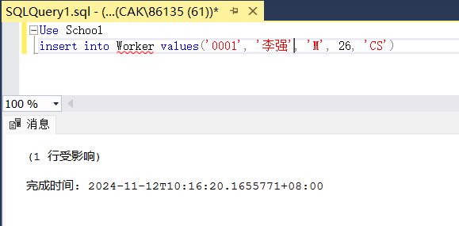

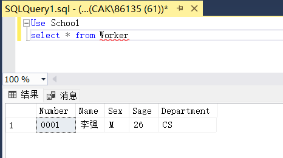

（4）尝试加入约束U4，令Sage < 0，添加失败，U4与已存在的约束U3是冲突的：

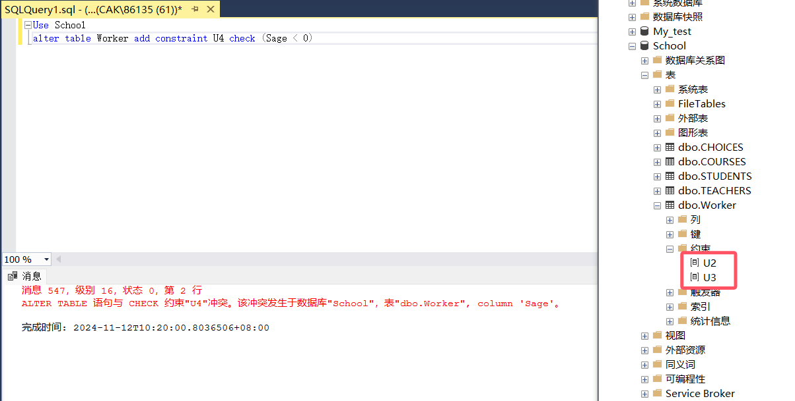

即使删除U3，再添加U4也会失败，这是因为U4与U2冲突：

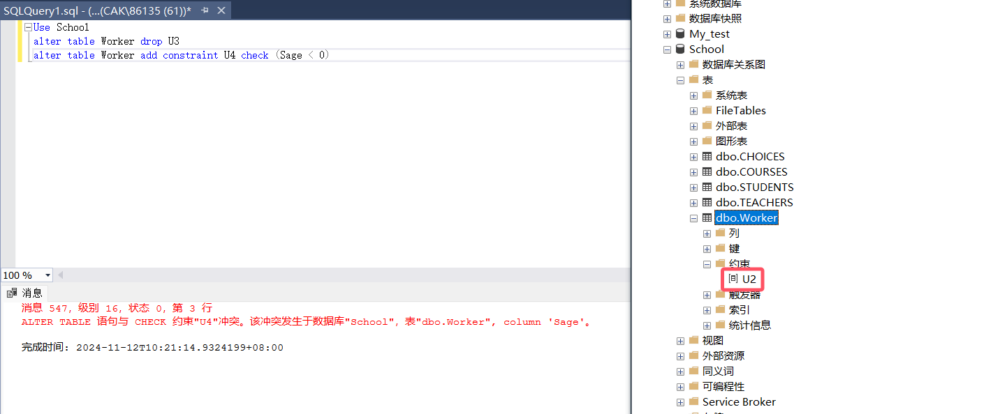

这说明数据库拒绝添加与已存在的约束冲突的约束，这维护了数据库数据的完整性与一致性和可维护性。

（5）-（7）加入规则R2，确保插入记录的值在1-100之间，绑定属性Sage：

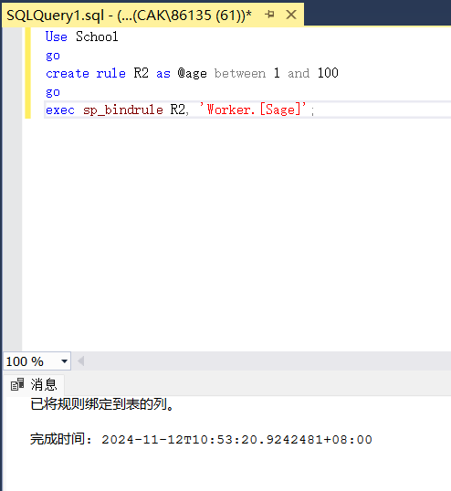

尝试插入记录，其Sage = 101，违反了规则，插入失败：

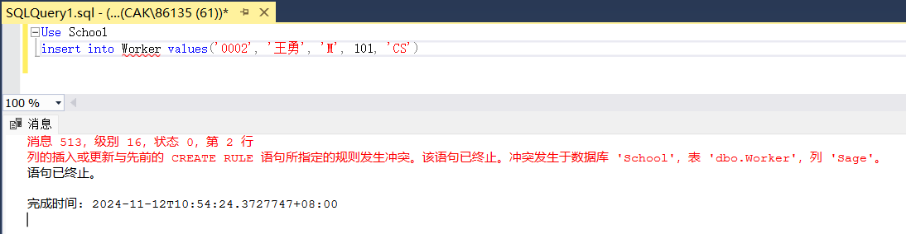

尝试插入记录，其Sage = 0，违反了规则，插入失败：

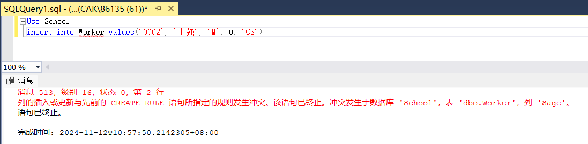

解绑规则R2，继续尝试插入Sage = 0的记录，因为解绑了规则，而该记录没有违反其他约束，插入成功：

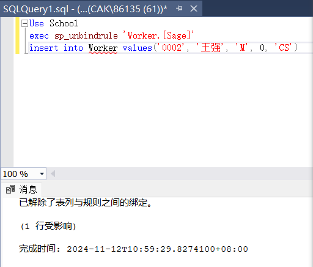

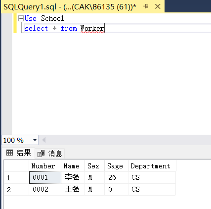

（8）首先删除约束U2，插入Sage = 38的记录：

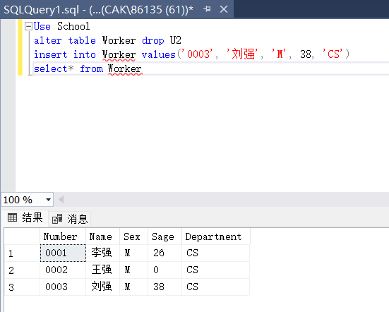

创建规则R3，并绑定Sage，绑定成功：

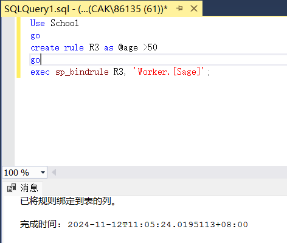

尝试插入记录，验证规则产生效果：

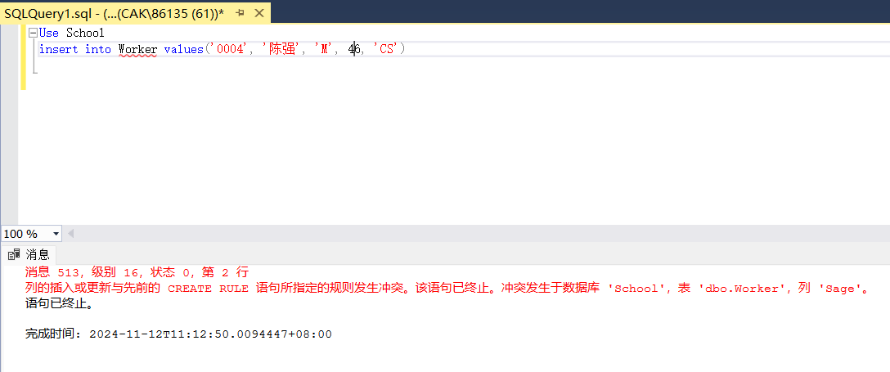

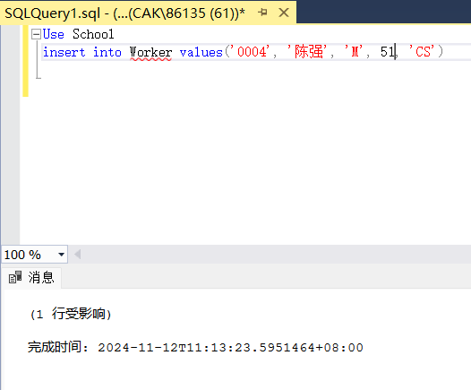

这说明规则不会对已经存在的记录进行检查，规则在SQL Server中主要用于限制数据类型的转换和限制列值的范围，但它们并不像约束那样直接用于保证数据的完整性和一致性。
