# 数据库实验报告 第11周

姓名：陈安康  学号：22320021

## 实验内容

由于每次实验前我都有恢复数据库的习惯，这次恢复的太急，没看见要求就恢复了，将原先的Worker表删除了，现在新建Worker表：

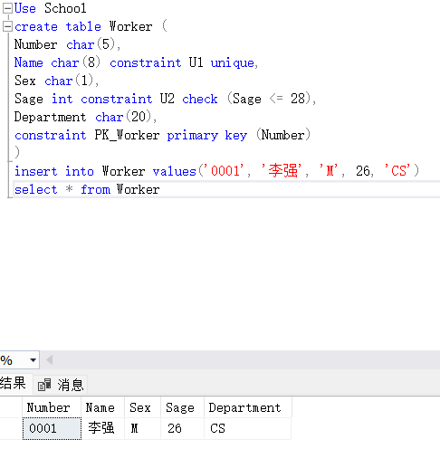

1.创建触发器T4如下，因为Worker表中包含inserted表中的数据，因此要将其排除：

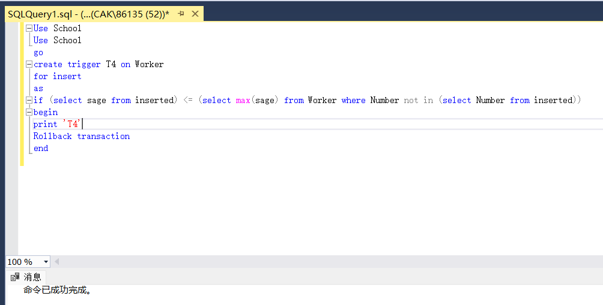

2.尝试插入如下记录，其sage小于表中的最大值（26），插入失败。

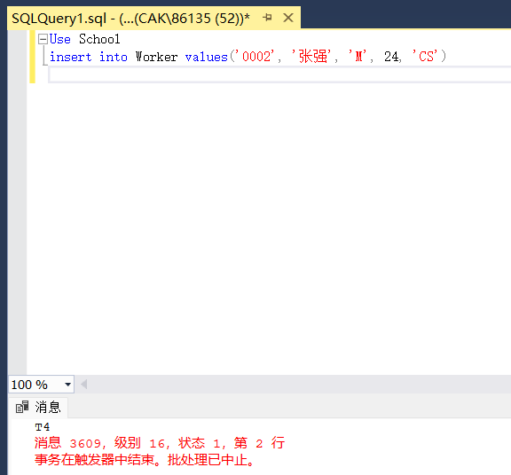

3.创建触发器如下：

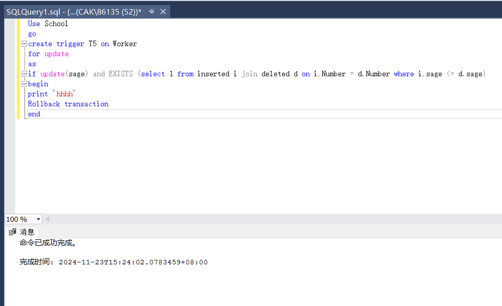

4.尝试更新记录，将sage设置为1（原先sage为26），失败：

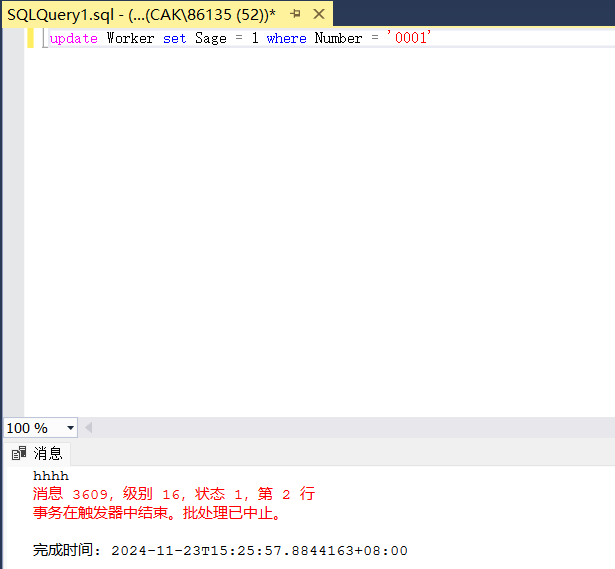

6.创建触发器如下：

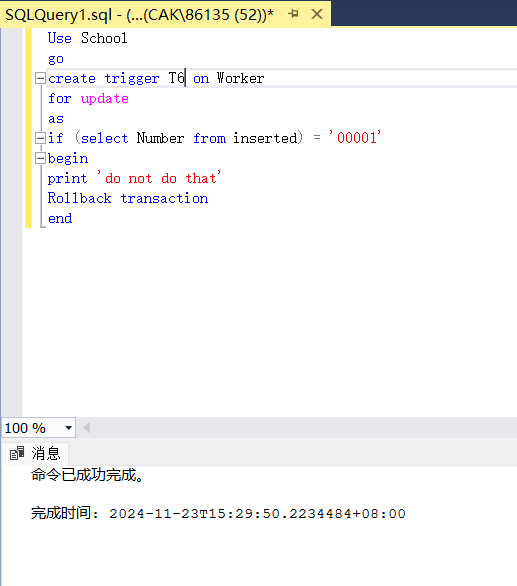

首先插入一个Number = ‘00001’的记录：

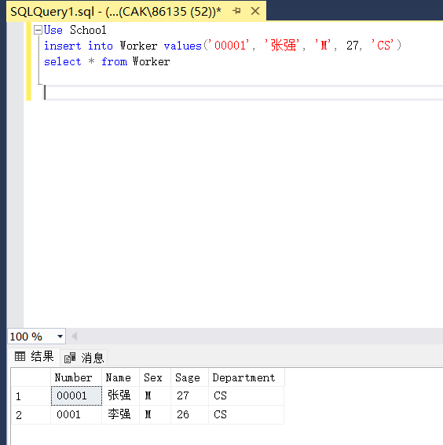

然后尝试对其修改，违反触发器T6，失败：

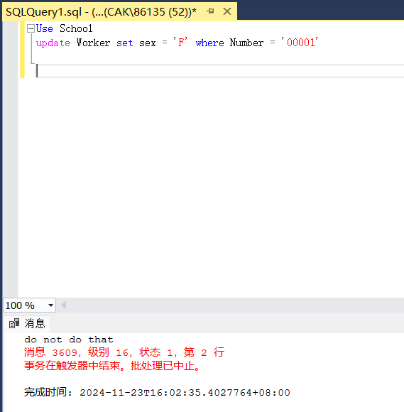

6.首先创建Stu_Card表：

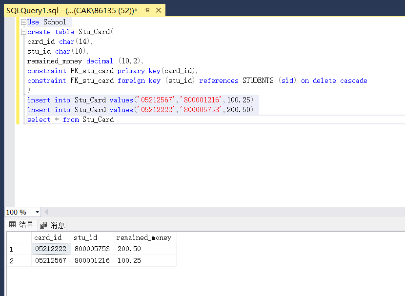

创建视图，该视图关联多个表，是不可更新的。

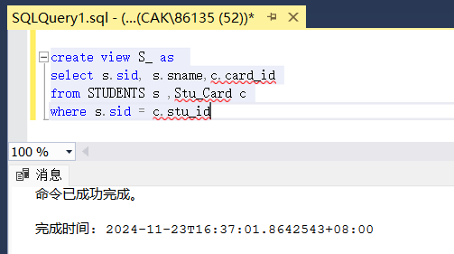

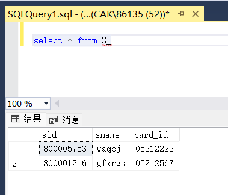

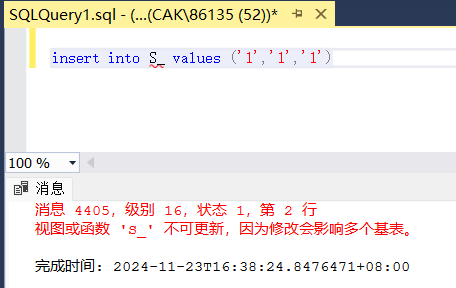

创建触发器如下，使用INSTEAD OF 触发器重新定义insert操作：

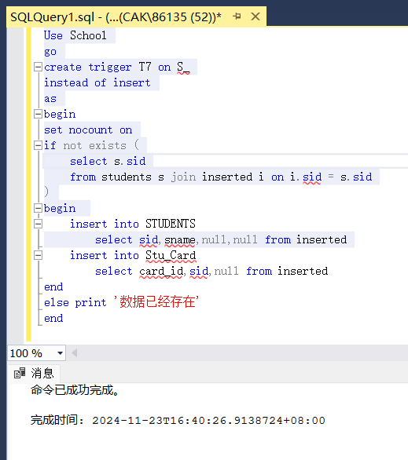

再次执行插入操作，插入成功：

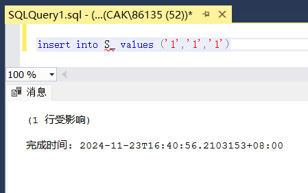

查看表，发现各表已经按重新定义的insert操作成功插入数据：

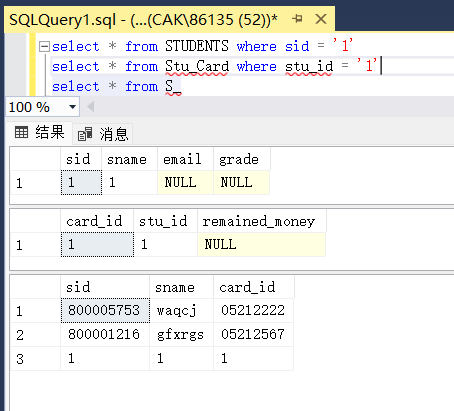
