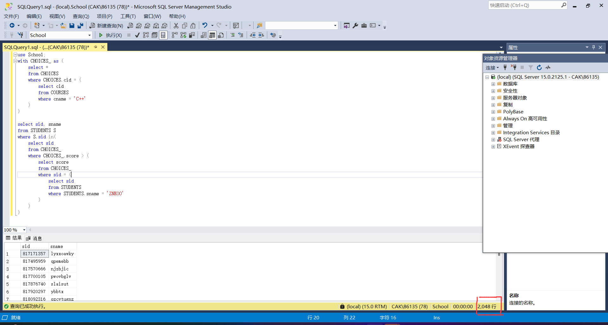
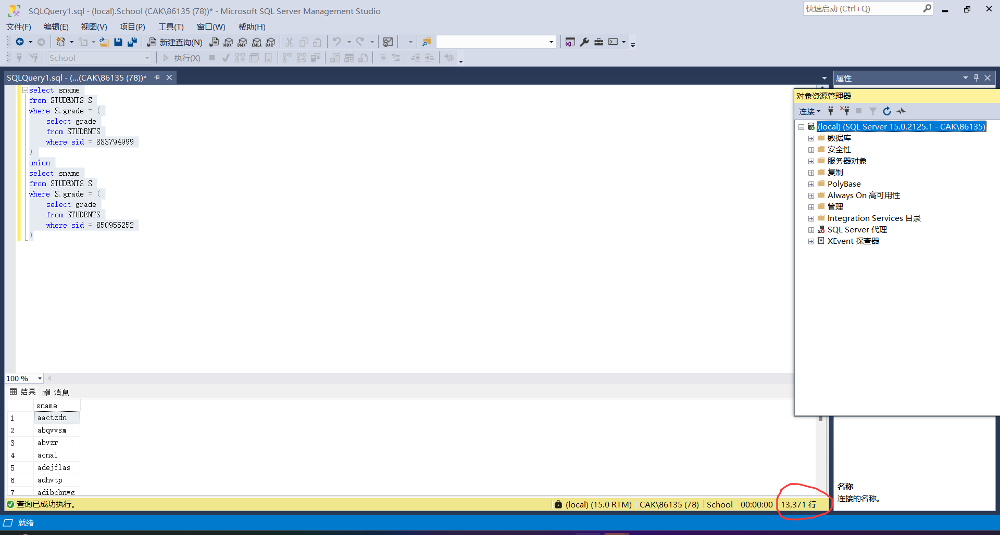
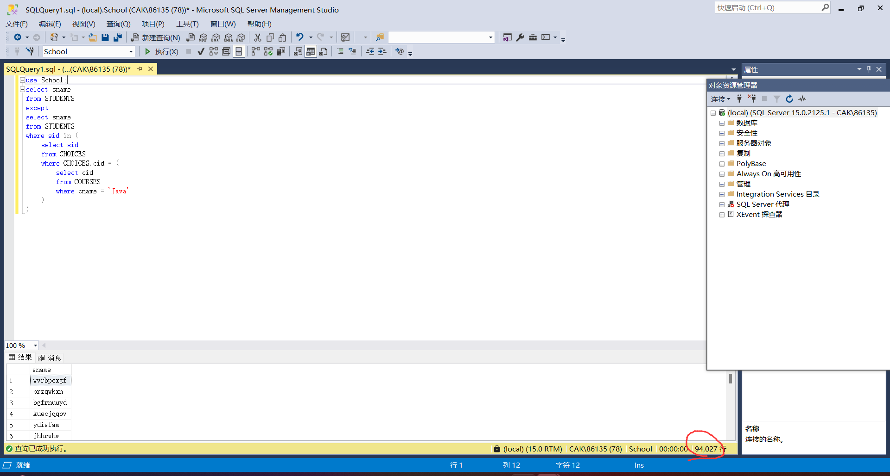
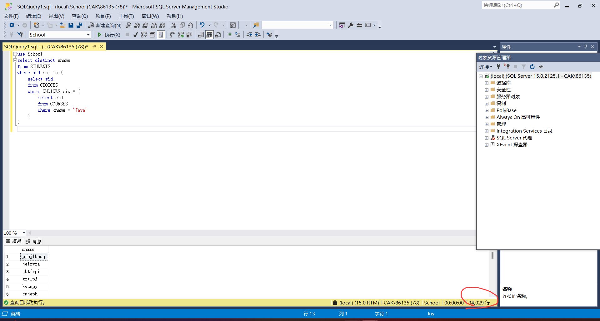
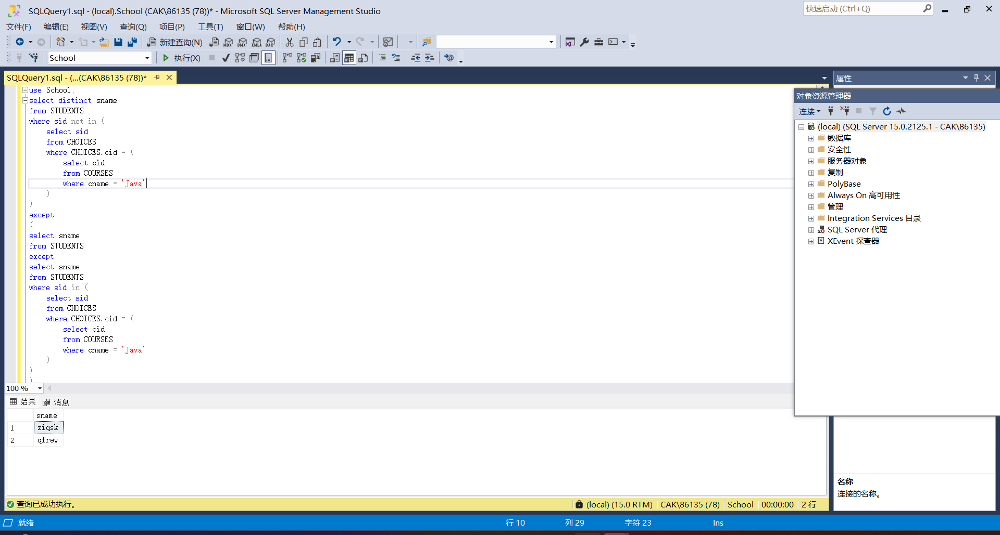
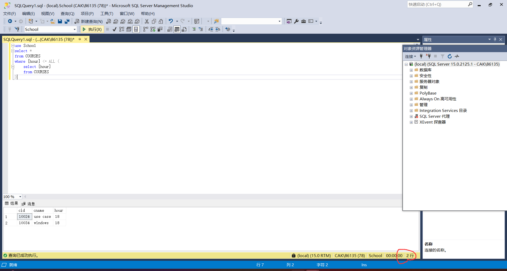
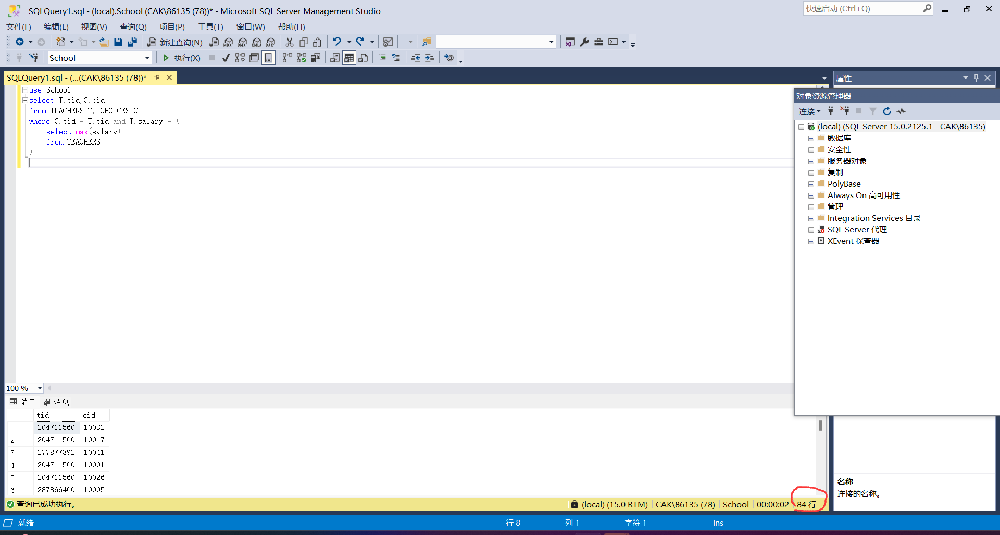
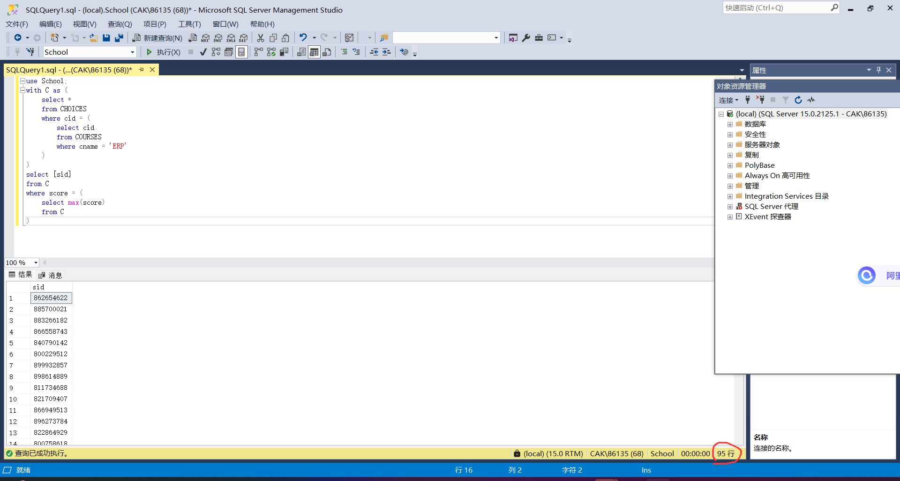
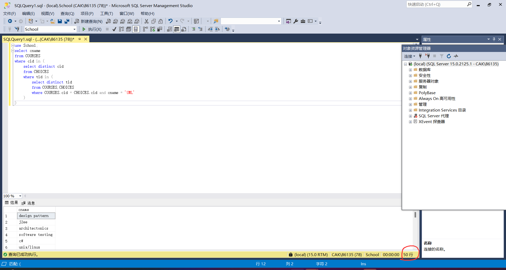
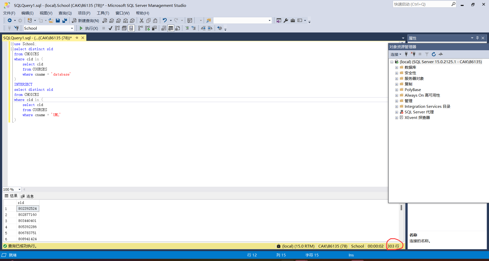

# 数据库实验报告 第4周

姓名:陈安康  学号:22320021

## 实验内容：

(1)

思路：先在CHOICES中找出所有与‘C++’有关的项，然后再将成绩与'ZNKOO'成绩与进行比较得到结果，使用到子查询。

查询如下：

```
use School;
with CHOICES_ as (
	select * 
	from CHOICES
	where CHOICES.cid = (
		select cid
		from COURSES
		where cname = 'C++'
	)
)

select sid, sname
from STUDENTS S
where S.sid in(
	select sid 
	from CHOICES_
	where CHOICES_.score > (
		select score
		from CHOICES_
		where sid = (
			select sid
			from STUDENTS
			where STUDENTS.sname = 'ZNKOO'
		)
	)
)

```




(2)

使用union查询（删去了重复项）：

```
select sname
from STUDENTS S
where S.grade = (
	select grade
	from STUDENTS
	where sid = 883794999
)
union
select sname
from STUDENTS S
where S.grade = (
	select grade
	from STUDENTS
	where sid = 850955252
)
```

以上等同于以下查询，因为名字有重名所以要用distinct去除重名：

使用some查询：

```
select distinct sname
from STUDENTS S
where S.grade = some (
	select grade
	from STUDENTS
	where sid = 883794999 or sid = 850955252
)
```



以上仅仅查询了学生的名字，删去了重复项，如果说题目本意保留重复项的话（即强调人数），应该使用some查询且删除掉distinct关键字，如下：

```
select sname
from STUDENTS S
where S.grade = some (
	select grade
	from STUDENTS
	where sid = 883794999 or sid = 850955252
)
```


(3)

有以下两种查询语句，按理来说是等价的，但查询结果却不同（这里只统计了名字，去除了重复项）：

使用except的查询语句：

```
use School;
select sname
from STUDENTS
except
select sname
from STUDENTS
where sid in (
	select sid
	from CHOICES
	where CHOICES.cid = (
		select cid
		from COURSES
		where cname = 'Java'
	)
)
```



使用not in的查询语句：

```
use School;
select distinct sname
from STUDENTS
where sid not in (
	select sid
	from CHOICES
	where CHOICES.cid = (
		select cid
		from COURSES
		where cname = 'Java'
	)
)
```



会发现两个查询结果相差2。

这是因为存在重名的学生，这些名字的学生有些选修了Java，有些则没有。

通过INTERSECT语句进行以下查询，会发现正好有两个名字符合上述条件：


而上述两个查询的差集也正好是这两个名字：



not in查询因为本质是按照sid进行的筛选，因此会出现保留名字的情况，而except查询思路是全集减去不符合的名字集的模式，会把名字删去，由此造成查询结果的差异。

由于不知道这种名字是否算作选修Java的还是没有选修的，取决于看待问题的情况把，因此两种结果都进行呈现。

同(2),如果说题目本意保留重复项的话（即强调人数），应该使用not in查询且删除掉distinct关键字，如下：

```
use School;
select sname
from STUDENTS
where sid not in (
	select sid
	from CHOICES
	where CHOICES.cid = (
		select cid
		from COURSES
		where cname = 'Java'
	)
)
```


(4)

两种思路去实现，一种是利用ALL关键字：

```
use School
select *
from COURSES
where [hour] <= ALL (
	select [hour]
	from COURSES
)
```



另一种是利用min集合函数：

```
use School
select *
from COURSES
where [hour] = (
	select min([hour])
	from COURSES
)
```


(5)

利用子查询的语句：

```
use School
select T.tid,C.cid
from TEACHERS T, CHOICES C
where C.tid = T.tid and T.salary = (
	select max(salary)
	from TEACHERS
)
```




(6)

使用子查询完成语句如下：

```
use School;
with C as (
	select *
	from CHOICES
	where cid = (
		select cid
		from COURSES
		where cname = 'ERP'
	) 
)
select [sid]
from C
where score = (
	select max(score)
	from C 
)
```




(7)

```
use School;
select cname
from COURSES
where cid not in (
	select cid
	from CHOICES
)
```


(8)

 利用in语句进行实现，使用两层嵌套查询，最内层找出教授'UML'课程的教师tid，再外面一层找出教师教授的课程cid，最外部查询返回课程名称：

```
use School;
select cname
from COURSES
where cid in (
	select distinct cid 
	from CHOICES
	where tid in (
		select distinct tid
		from COURSES,CHOICES
		where COURSES.cid = CHOICES.cid and cname = 'UML'
	)
)
```




(9)

```
use School;
select distinct sid
from CHOICES
where cid in (
	select cid
	from COURSES
	where cname = 'database'
)
INTERSECT
select distinct sid
from CHOICES
where cid in (
	select cid
	from COURSES
	where cname = 'UML'
)
```




(10)

```
use School;
select distinct sid
from CHOICES
where cid in (
	select cid
	from COURSES
	where cname = 'database'
)
EXCEPT
select distinct sid
from CHOICES
where cid in (
	select cid
	from COURSES
	where cname = 'UML'
)
```


