(1)

# 数据库实验报告 第6周

姓名:陈安康  学号:22320021

## 实验内容：

创建VIEWC语句如下：

```sql
create view VIEWC 
as (select CHOICES.*,COURSES.cname 
from CHOICES,COURSES
where CHOICES.cid  = COURSES.cid)
```

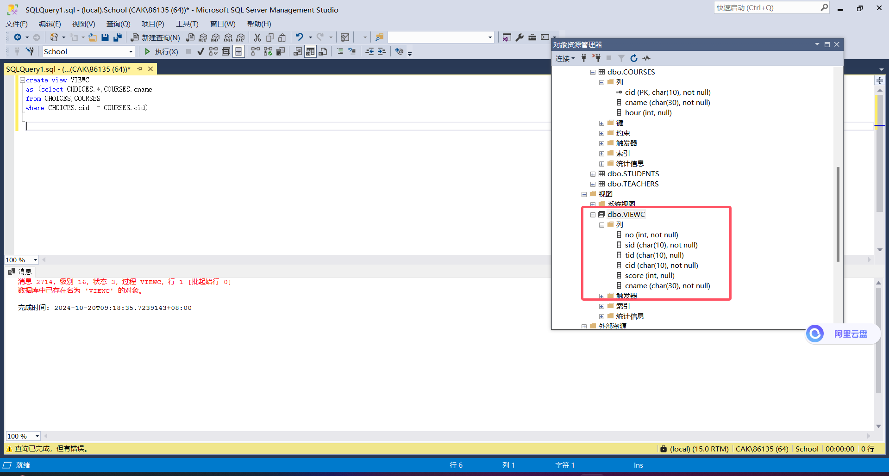

(2)

创建VIEWS语句如下：

```sql
create view [VIEWS] 
as (select STUDENTS.sname,CHOICES.*
from CHOICES,STUDENTS
where CHOICES.[sid]  = STUDENTS.[sid])
```

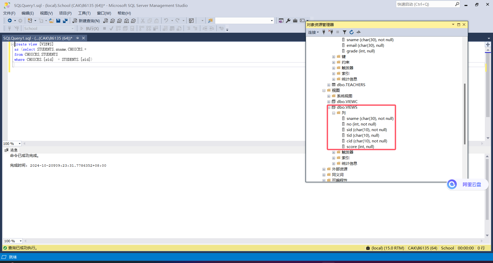

(3)

创建视图S1语句如下，默认年份大于1998为符合条件的项：

```sql
create view S1([SID],SNAME,GRADE) as 
select [sid],sname,grade
from STUDENTS
where grade > 1998
```

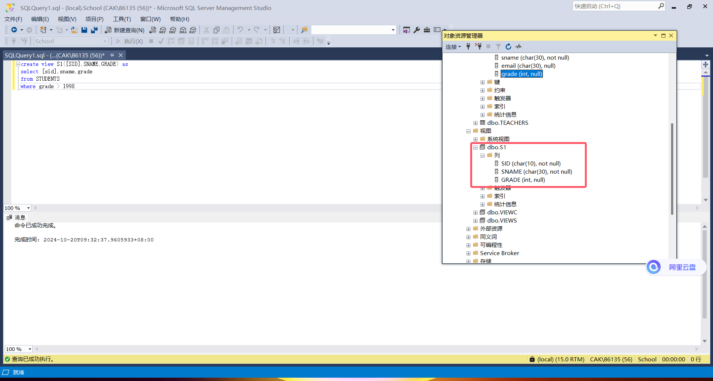

(4)

通过VIEWS视图进行查询：

```sql
select *
from [VIEWS]
where sname = 'uxjof'
```

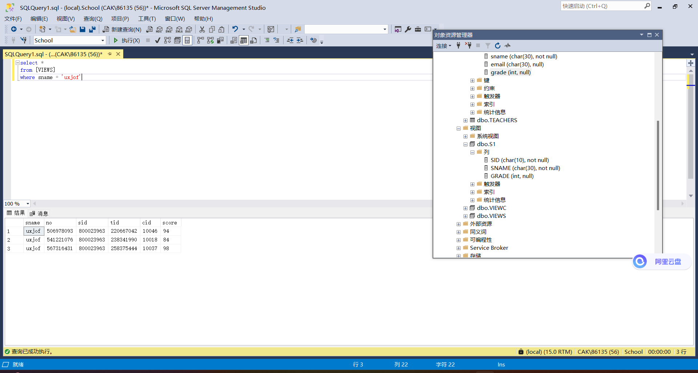

(5)

通过VIEWC进行查询：

```sql
select sid,score
from [VIEWC]
where cname = 'UML'
```

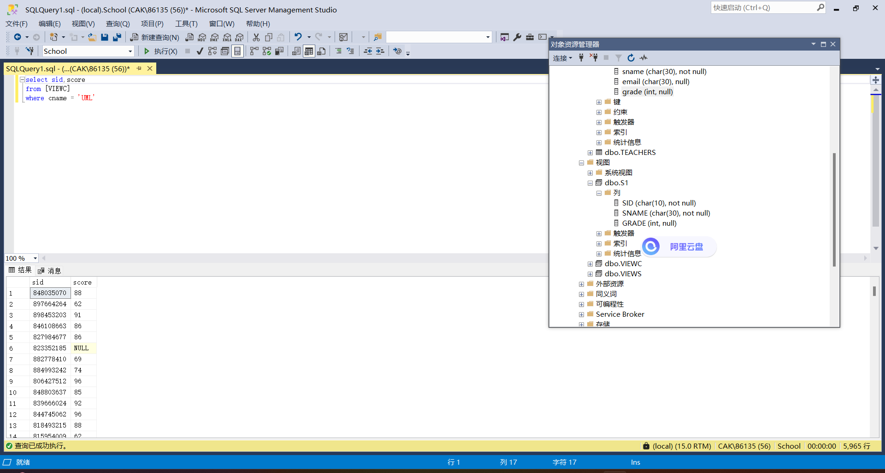

(6)

视图插入语句如下：

```sql
insert into S1 values(60000001,'Lily',2001)
```

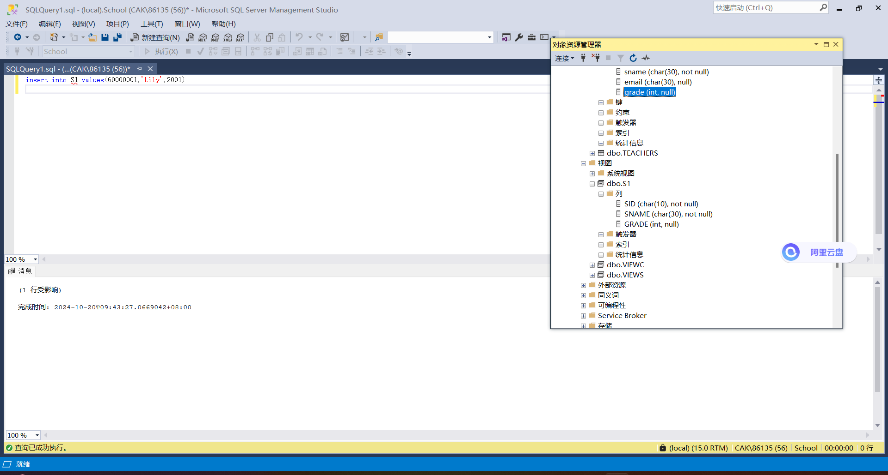

查询STUDENTS表，会发现STUDENTS表中也插入了此项，说明对于基本表也会执行插入操作：

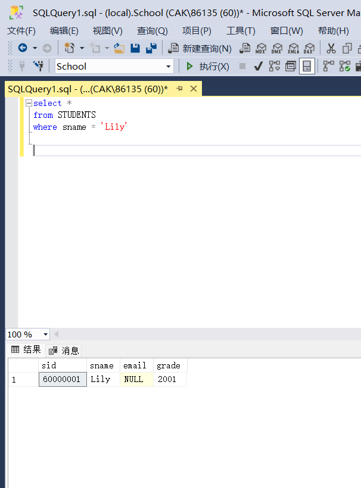

(7)

通过如下语句创建包括更新和插入约束的视图S1：

```sql
create view S1([SID],SNAME,GRADE) as 
select [sid],sname,grade
from STUDENTS
where grade > 1998
WITH CHECK OPTION;
```

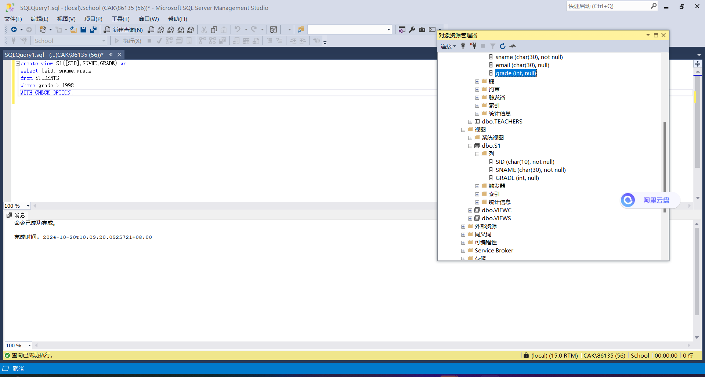

运行如下插入语句：

```sql
insert into S1 values(60000001,'Lily',1997)
```

会发现报错，键值重复了：

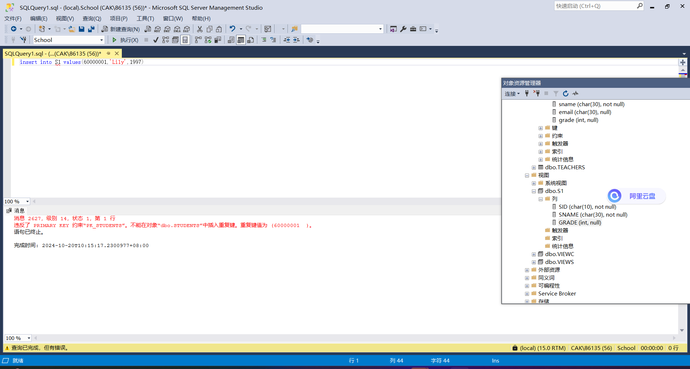

即使换一个合法的sid，也会报错，因为1997是比1998更早的年级，违反了>1998的条件：

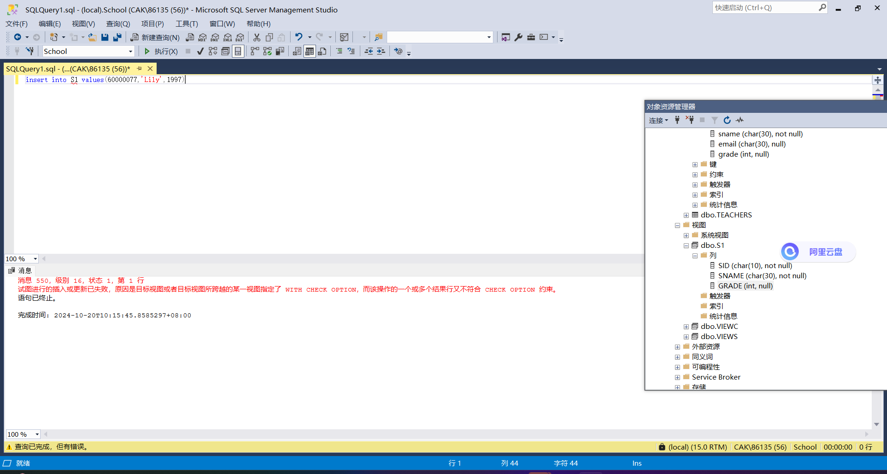

运行如下语句，会发现由于外键约束的原因无法运行：

```sql
delete S1
where grade = 1999
```


这不是我们希望看到的，因此我首先取消对对应约束的检查，然后运行删除操作，再恢复约束检查，成功运行：

```sql
alter table CHOICES nocheck constraint FK_CHOICES_STUDENTS;
delete S1
where grade = 1999
alter table CHOICES check constraint FK_CHOICES_STUDENTS;
```

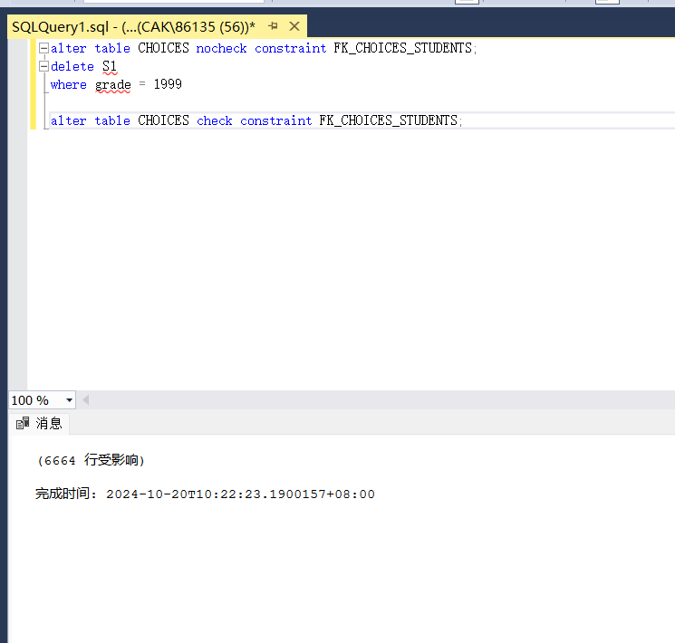

更新和插入约束会保证操作符合约束条件，保证了数据库的安全性。

(8)

语句如下：

```sql
update [VIEWS]
set score = score + 5
where sname = 'uxjof';
```

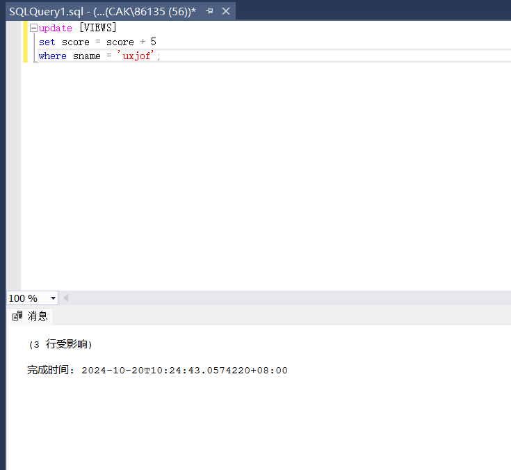

(9)

删除视图操作如下：

```sql
drop view VIEWC;
drop view [VIEWS];
drop view S1;
```

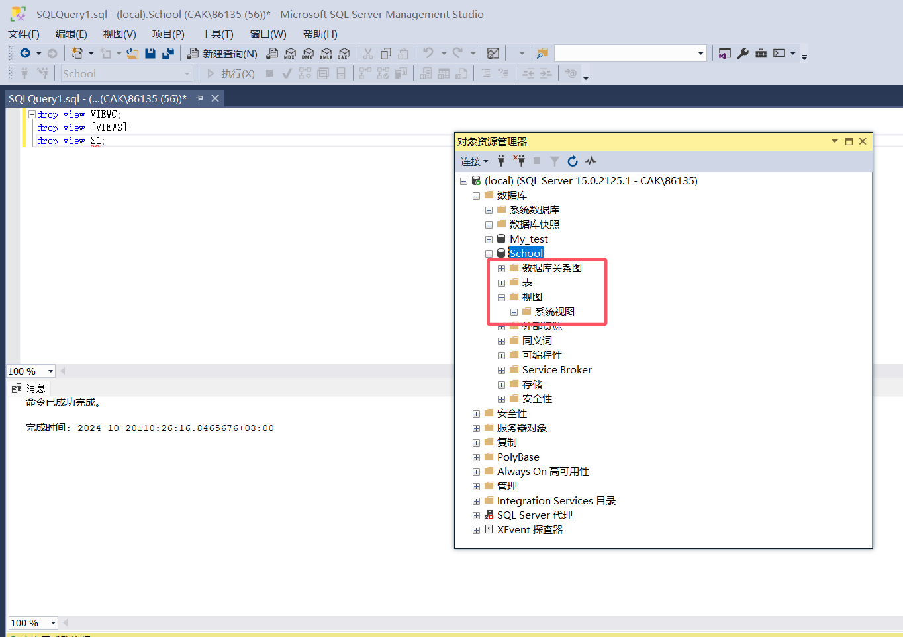
