（1）

# 数据库实验报告 第8周

姓名:陈安康  学号:22320021

## 实验内容：

通过以下语句查询选修“C++”的学生人数（包含重复选修的学生）：

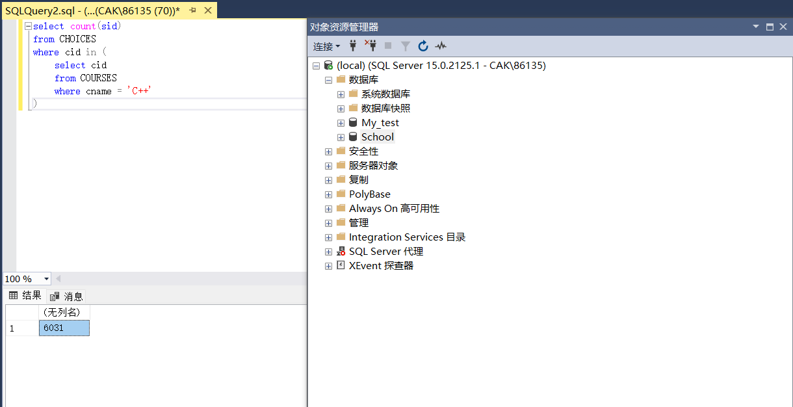

通过以下语句查询及格与不及格的学生（以60分为界），相加可以发现少了490个学生：

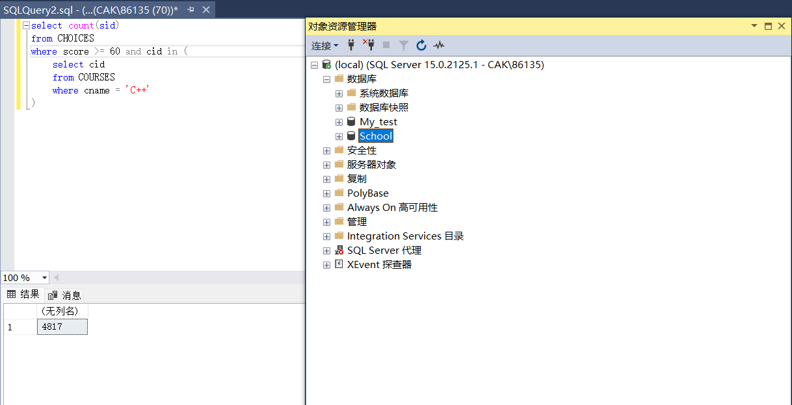

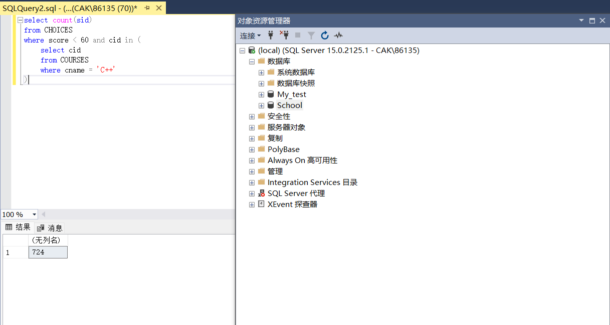

然后查询score为null的学生人数，发现正好是490，说明null与所有运算比较符的比较都是不匹配的：

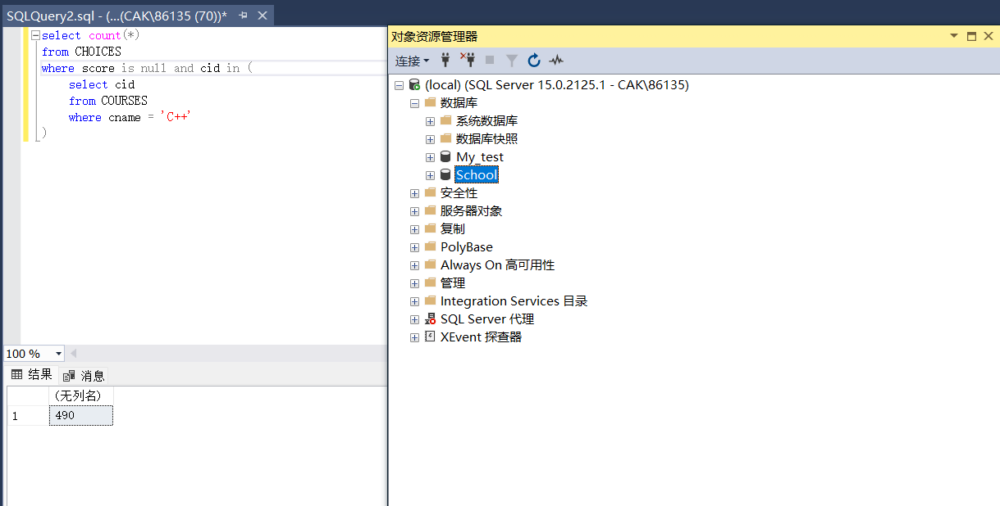

（2）

通过以下语句对成绩进行升序排列，发现null出现在结果中，并且排在最前面。说明在排序时，null没有被忽略，而是被当做最小值处理。

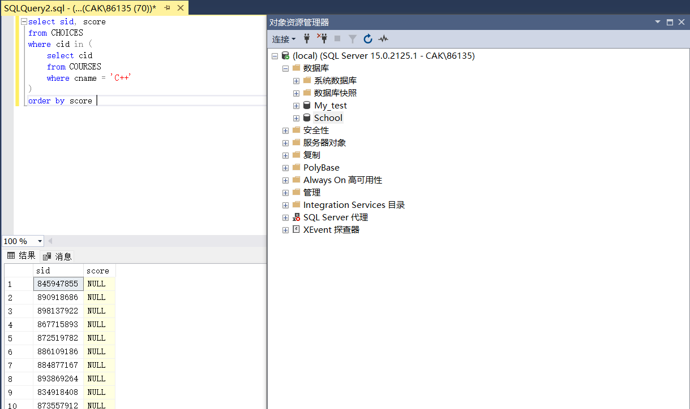

（3）

当只列出score时，加入distinct后会发现null只剩下一项null，说明null被看做取同一个值。

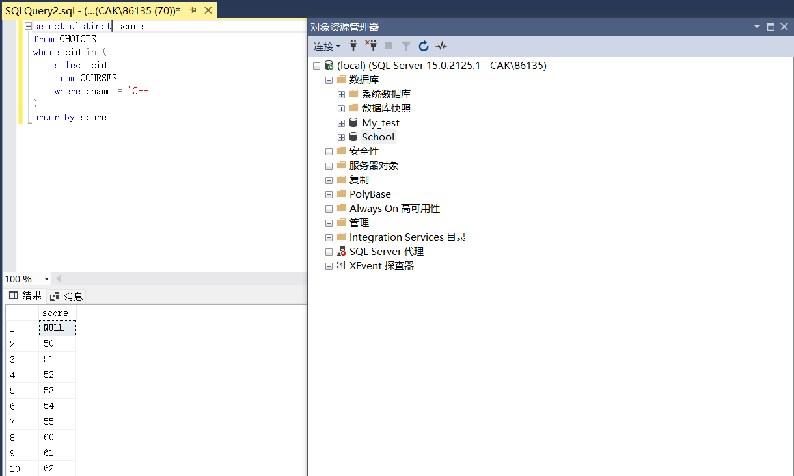

（4）

首先按年级分组列出年级具体值，会发现其中有一个null，说明有一些学生的年级信息缺失：

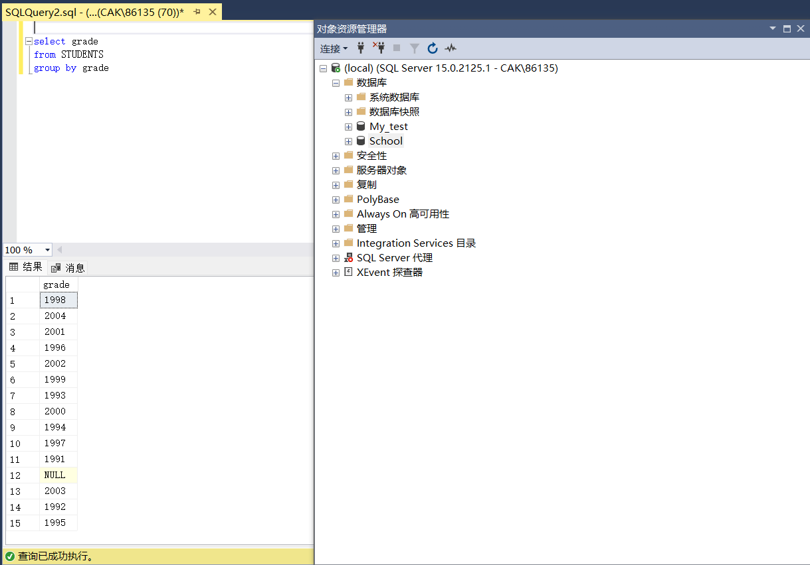

由于count()聚合函数在作用对象是*是不会忽略null值的，而其余情况下会忽略null值，这就导致输入语句的不一致会导致不同的查询结果。

如果使用count(*)，会考虑null，导致查询结果是15：

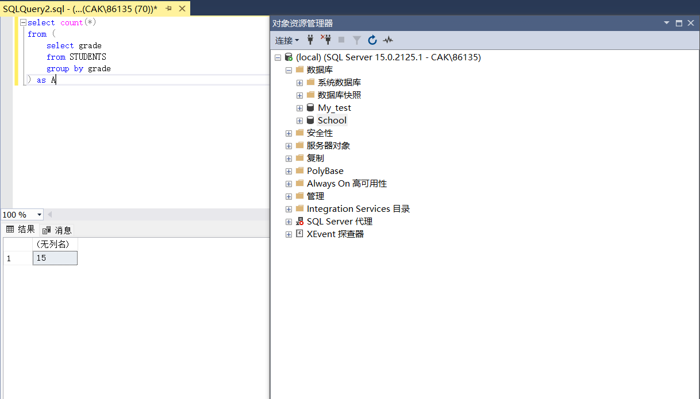

如果使用count(grade)，则会舍弃null，查询结果是14：

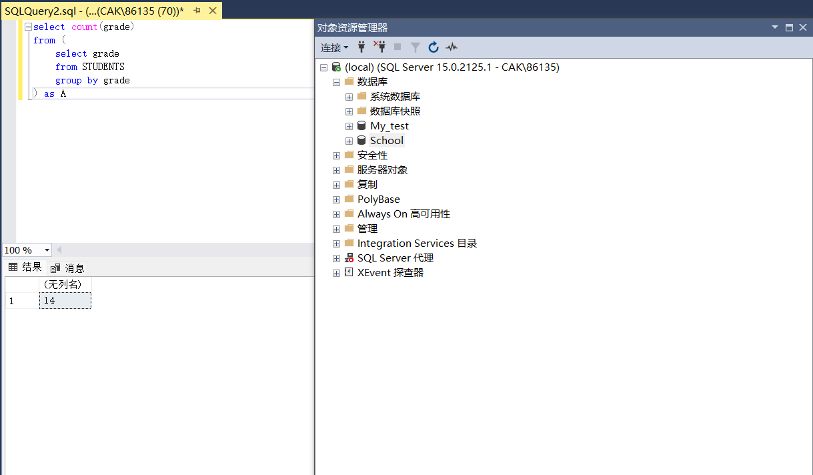

总结：若有null存在，则可能对聚合函数的计算结果产生影响，产生错误。

（5）

查询结果如下：

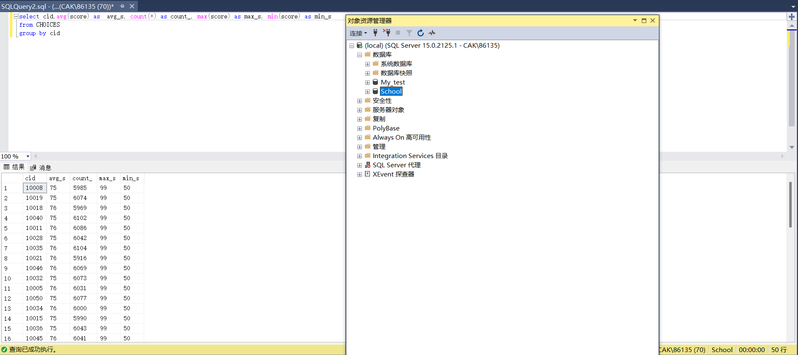

以cid = 10008的课程为例，列出所有与其有关的数据项，会发现其中score存在null的项，这意味着avg考虑null与不考虑null的计算结果一定会产生偏差的。

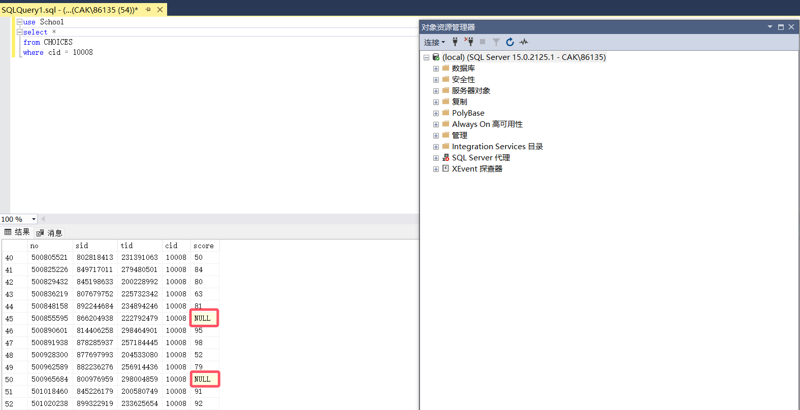

使用以下语句查询排除null值以后的score平均成绩，发现依旧是75，与默认使用avg()时的结果一样，说明在执行时avg()集合函数自动忽略null值。

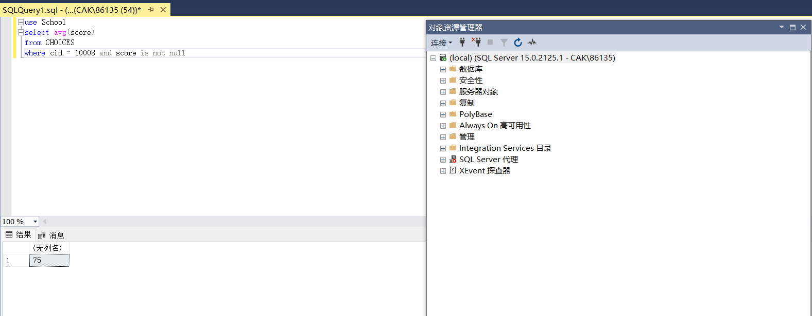

还是以cid = 10008的课程为例，在取最大最小值时，由于都没有取到null，说明max()和min()函数会自动忽略null取值。（严谨来说，最理想的证明情况是像示例一样，找出一个课程只有两个记录，其中一个记录的null是空值，并且最大最小值取值都是非空值。不过由于课程选课记录太多（都在5000-6000之间）没法这样验证）

使用以下语句查询：

接着排除score取值为null的项，发现查询的项减少了，减少的正好就是null项的数目，说明count(*),默认考虑部分属性为null的项。

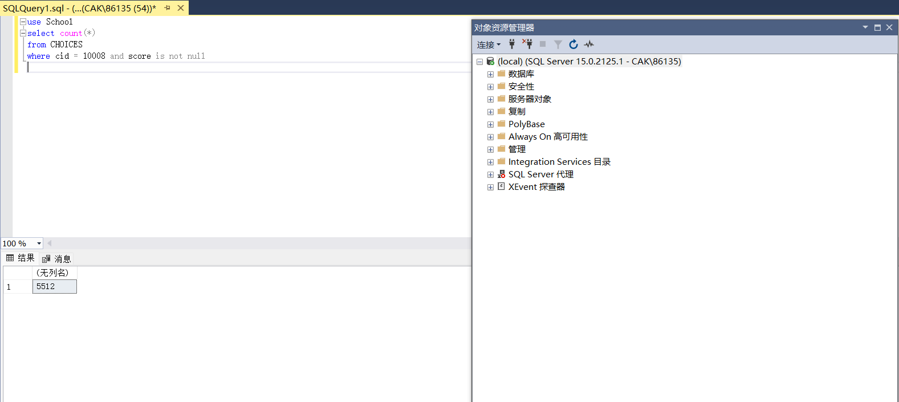

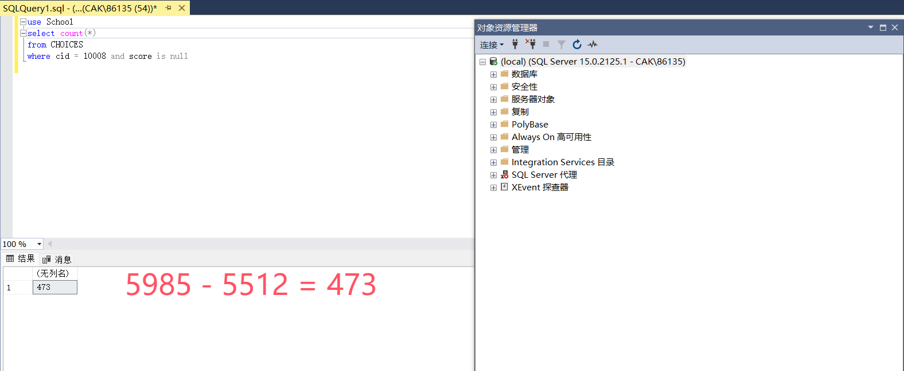

在使用count(score)进行单个属性的查询，发现结果与排除null的结果一致，说明单个属性是忽略null的：

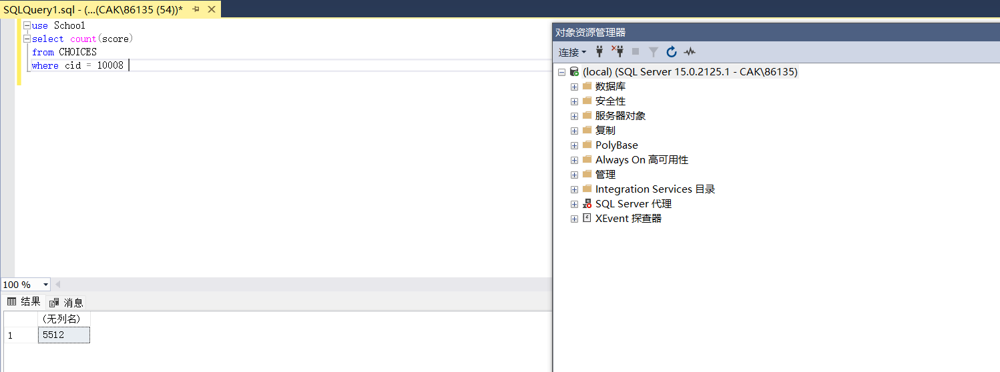

总结：除了count(*)考虑部分属性为null的项，其余的聚合函数都忽略了null取值的项。

（6）

正常查询会查不到任何东西：

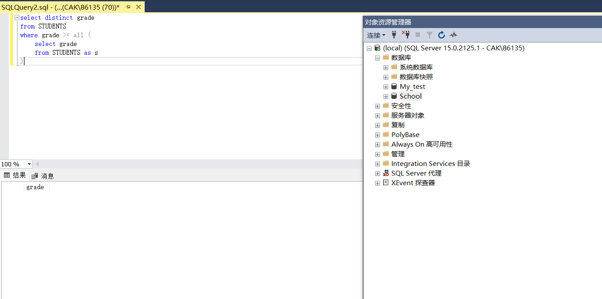

当排除掉null项后，进行查询，发现查询到正确结果：

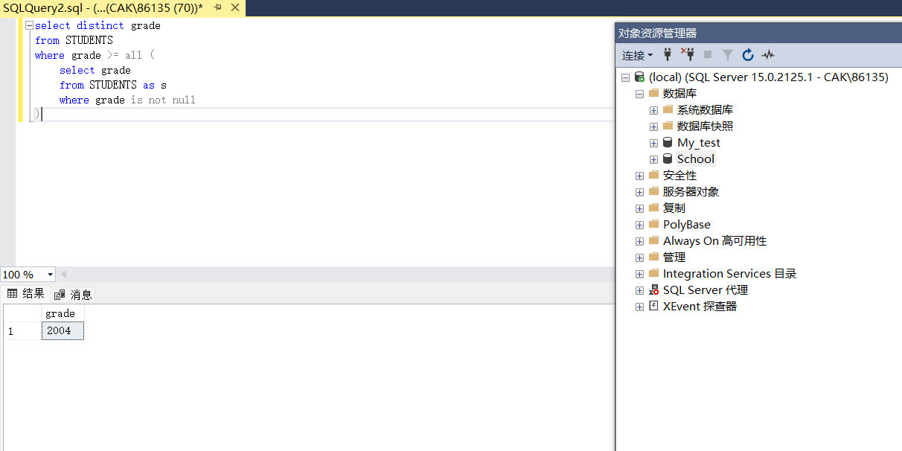

分析：对于all关键字，要求比较式的值对所有的项的比较结果都为真才合法，但是由于有null的存在，所有与null的比较都会变成假，从而all也会不合法，因此只要是对存在null的关系使用all关键字查询必然查询不到结果。因此在使用all关键字时，为了得到正确结果，必须排除掉null值。
