# 数据库实验报告 第13周

姓名：陈安康  学号：22320021

## 实验内容

（1）编写嵌套事务，外层修改STUDENTS表记录，内层在TEACHER表插入记录。由于SQL server XACT_ABORT 的默认值是 OFF。在OFF 的情况下，当一个 Transact-SQL 语句遇到运行时错误时，只有该语句会被回滚，事务会继续执行后续的语句，因此想要实现预期效果，需要将其设置为ON。语句如下：

执行前STUDENTS表中的记录：

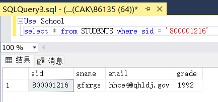

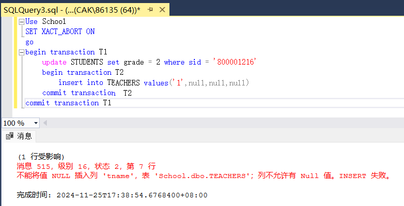

执行后STUDENTS表中的记录：

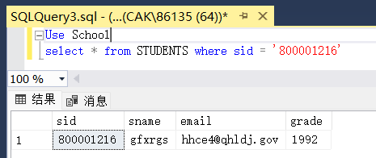

这说明执行过程中内层插入操作失败，外层修改操作也进行了回滚。

（2）执行前语句如下：

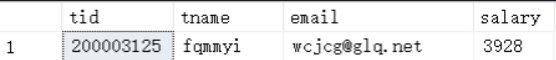

语句如下（已经将前面的XACT_ABORT设置为OFF）：

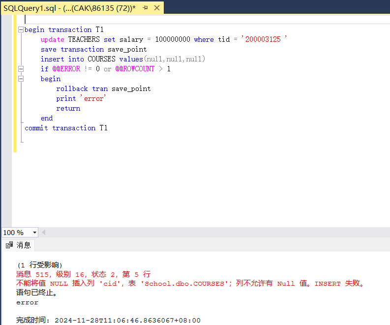

执行完成后，查看TEACHERS中记录：

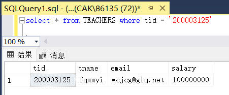

记录进行了修改，这是因为回滚操作只回滚到事务保存点，修改操作没有被回滚，减小了回滚操作的代价。

（3）创建存储过程语句如下：

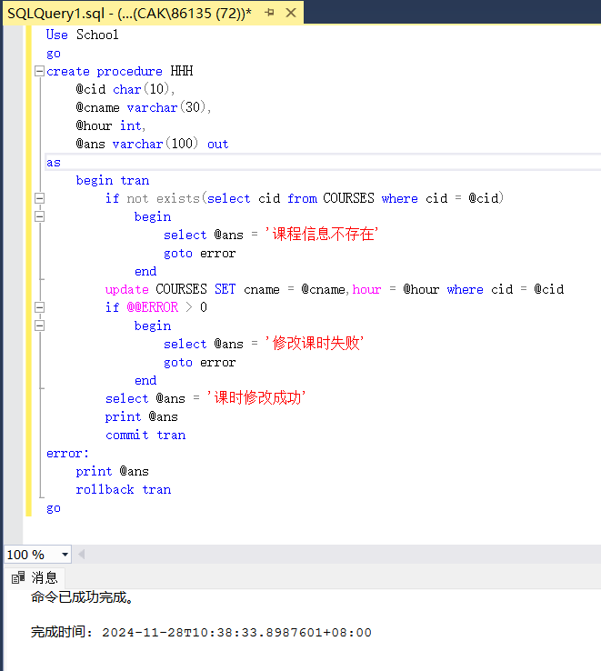

调用存储过程，更新不存在的记录：

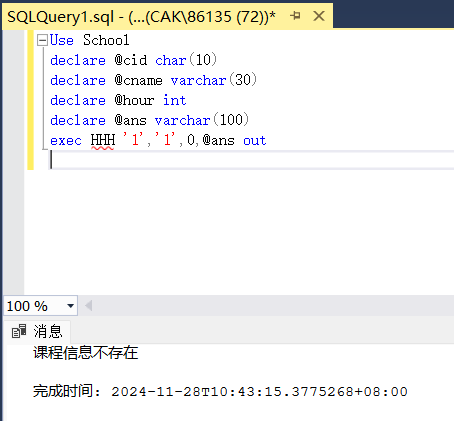

原始的COURSES表中的记录：

调用存储过程，更新记录失败（cname不允许为null）：

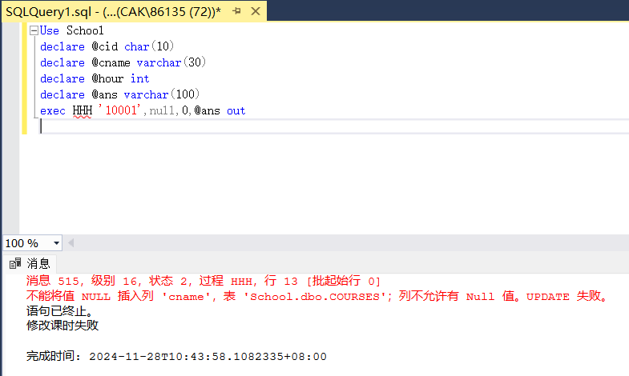

调用存储过程，更新记录成功：

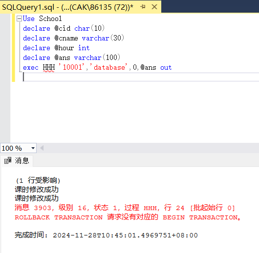

查看COURSES表，更新已经生效：

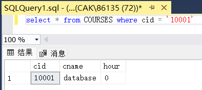
