# 数据库实验报告 第14周

姓名：陈安康  学号：22320021

（1）测试所用记录如下：

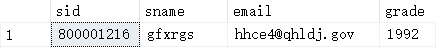

设置两条查询1和2，查询1执行STUDNETS表的更新，延迟20s后执行查询，然后回滚事务，接着查询，查询语句和结果如下：

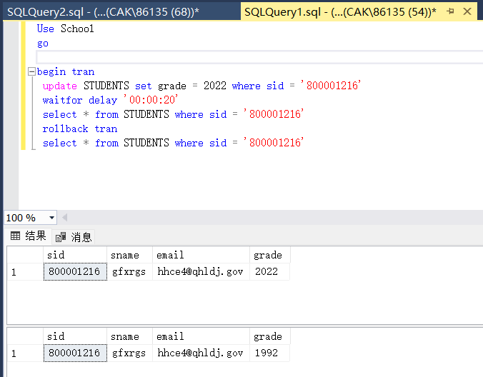

查询2将隔离等级设置为READ UNCOMMITTED，查询STUDENTS表，延迟20s后再次查询。查询2在查询1的执行过程中执行，查询语句与运行结果如下：

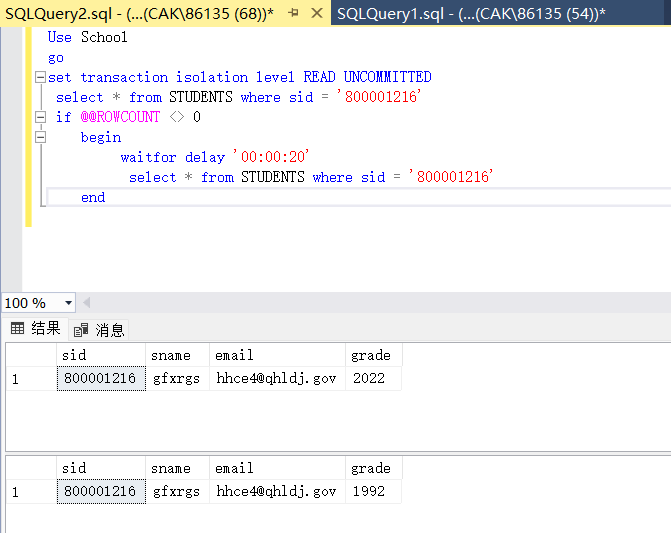

结果显示查询2读取到了查询1中事务没有提交的“脏”数据即grade = 2022。这是因为隔离等级为READ UNCOMMITTED，使得查询1中事务的执行过程与查询2没有隔离开导致的。

（2）为了解决读“脏”数据的问题，将查询2的隔离等级设置为READ COMMITTED。再次执行查询1，并在查询一执行过程中执行查询2，结果如下：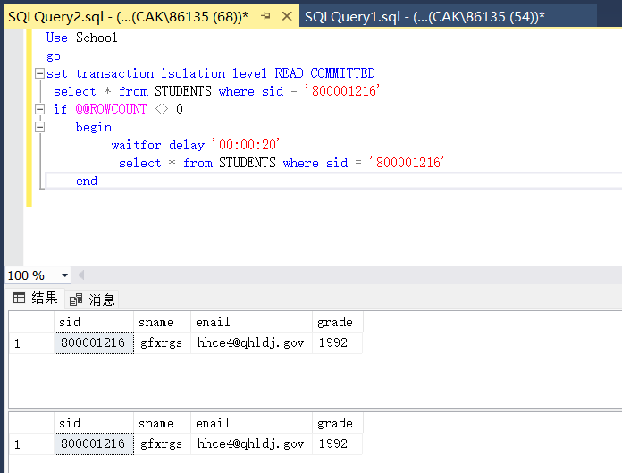

可以看见查询的结果都是查询1提交后的结果，避免了读“脏”数据。

（3）在上面实验的基础上，将查询2的隔离等级设置为REPEATABLE READ，然后重新执行查询1，并在查询1执行过程中执行查询2，结果如下：

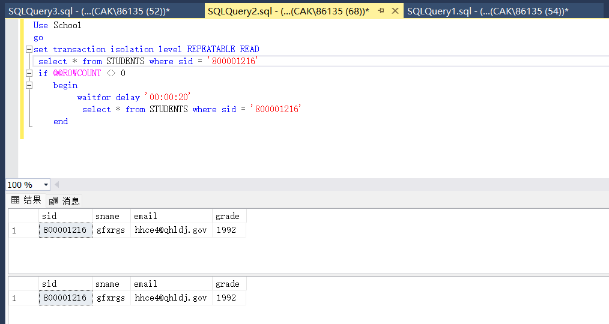

查询2读取的是查询1提交后的结果。说明REPEATABLE READ能避免读“脏”数据。

创建查询3，在里面设置隔离等级为REPEATABLE READ，然后修改STUDENTS表中的数据。稍微修改查询2，创建事务包含执行语句，执行查询2，并在执行查询2的过程中执行查询3，查询3代码以及查询2执行结果如下：

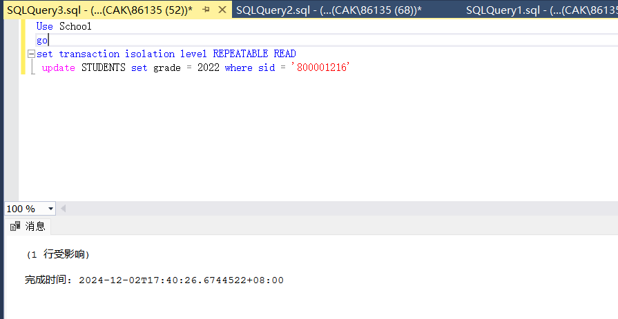

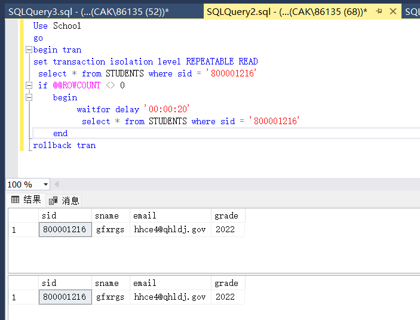

可以看到查询2读取的是查询3更新后的数据，从而避免了不可重复读。

由于STUDENTS和CHOICES表的外键约束存在，不能直接删除STUDENTS中的记录，因此，我们修改查询2，首先插入一项记录，然后在查询2中进行查询，查询3在查询2执行过程中进行删除操作，语句与结果如下：

查询2：

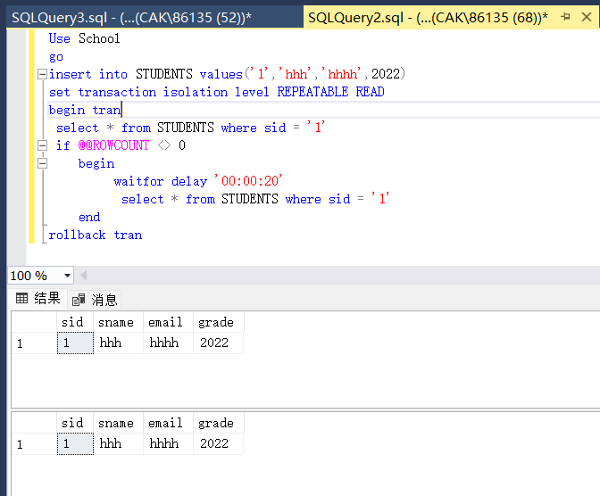

查询3：

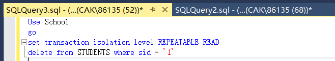

我们可以看见，第二次查询2读取了本应被查询3删除的记录，出现了“幻象读”的问题。

（4）修改查询2，设置隔离等级为SERIALIZABLE，这样事务之间完全隔离，均是串行的，尝试在查询2执行两次查询过程中插入数据，语句与结果如下：

查询2：

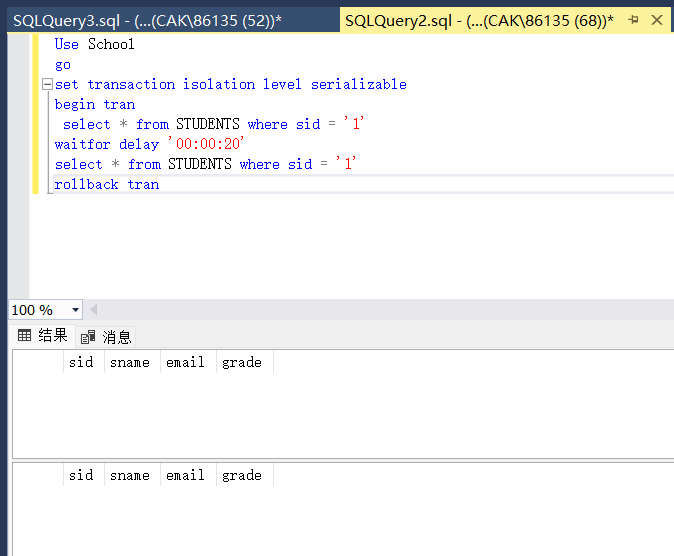

插入操作语句：

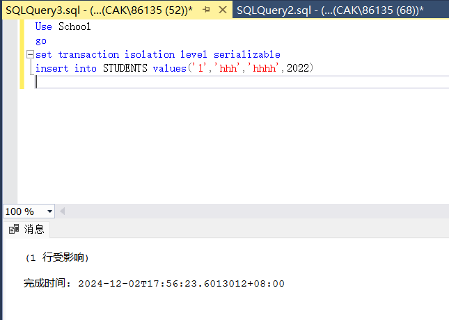

可以看到查询2查询的结果为空，因为在查询2事务执行过程中阻止了插入操作，防止了其他操作在事务提交之前更新数据。
