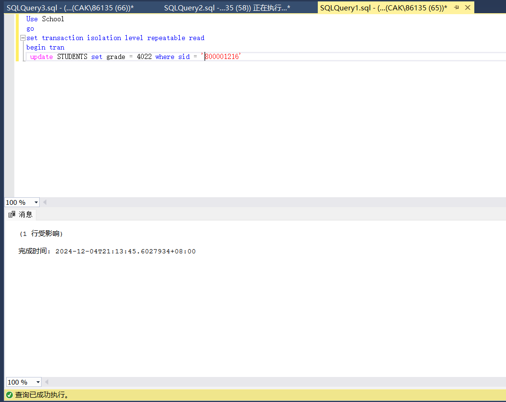
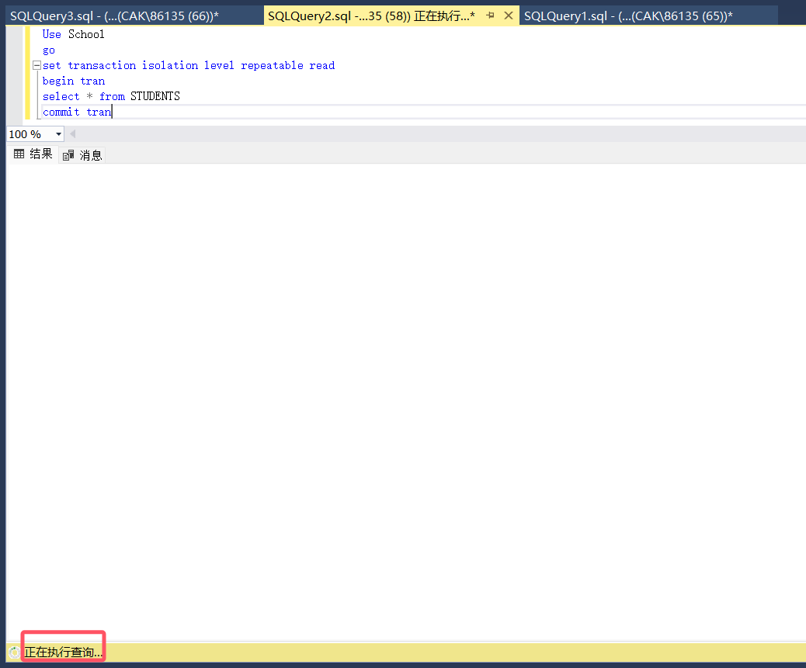
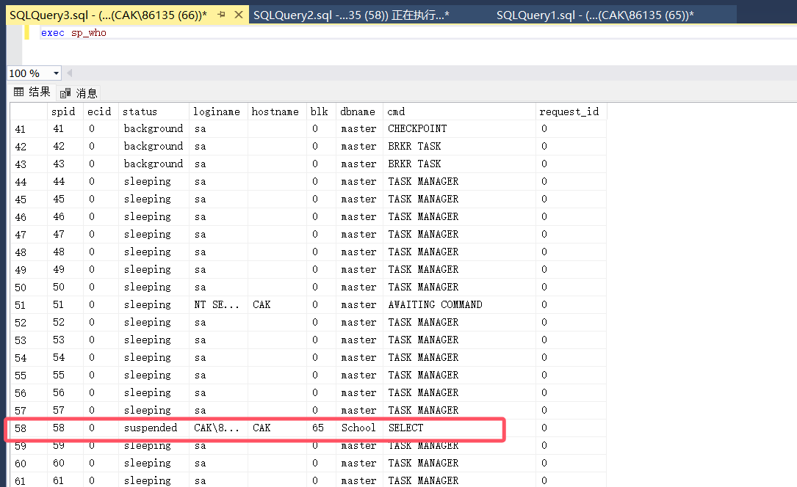
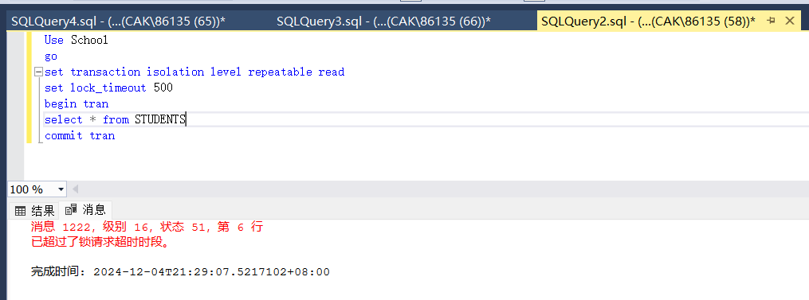
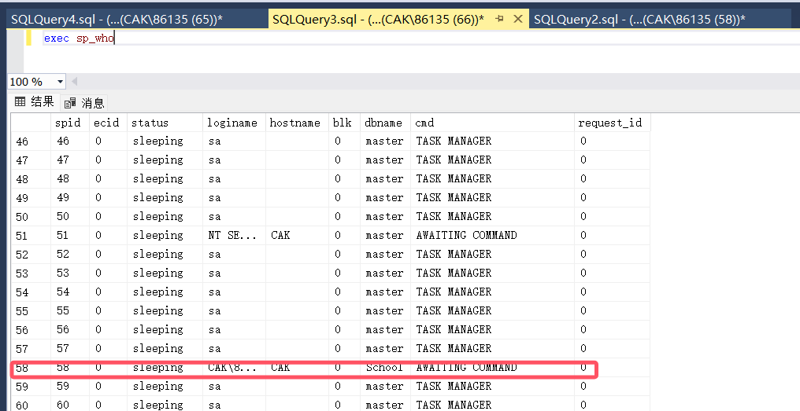
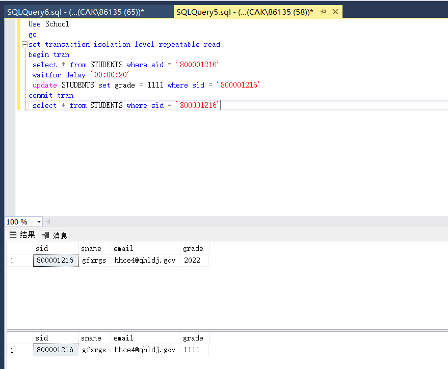
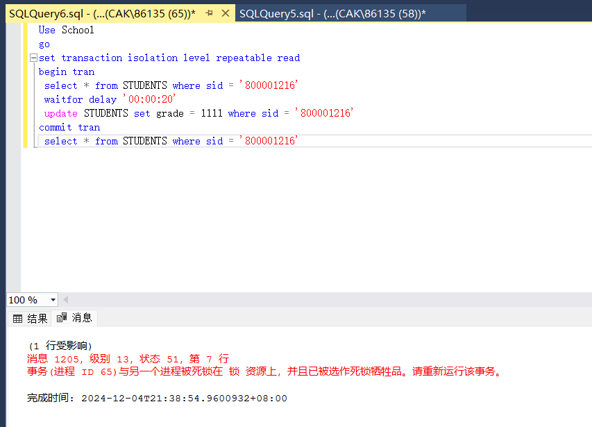

# 数据库实验报告 第15周

姓名：陈安康  学号：22320021

1 创建查询1，设置隔离等级为repeatable read 不提交事务，然后运行，接着创建查询2，设置隔离等级为repeatable read，查询STUDENTS表中的记录，结果运行一直处于执行中：

查询1：

查询2：

新建查询执行exec sp_who，发现进程58（查询2）已经被进程65（查询1）阻塞

在查询2中通过lock_timeout设置锁定超时时间间隔。在超过0.5s后，锁管理器自动解除锁的争夺。

再次执行exec sp_who，65进程已经不再阻塞58进程，解锁成功：

2 两个连接同时执行如下查询，结果如下：

其中一个连接查询成功，另一个连接由于死锁停止查询，发出错误代码1205，表示该事务被牺牲。由于两个进程都释放不了共享锁，因此导致死锁。

3 避免死锁：

（1）按照顺序访问资源。当事务按照一定的顺序访问资源时，死锁就会得以避免。

（2）事务开始时尝试一次性获取所有锁，若无法获取，则不执行事务，来避免死锁。

（3）减小事务持有锁的时间。通过快速释放锁来降低死锁的风险。

（4）使用低隔离级别也可以可以减少锁的争用，从而降低死锁的风险。

死锁的处理（构想）：

（1）主动回滚部分代价比较小的事务来解除死锁。

（2）设置超时机制来使死锁事务回滚来解决死锁

（3）可以设置动态调整隔离等级来在死锁时释放锁来摆脱死锁

（4）合理优化查询语句

（5）组织对资源的有序访问
