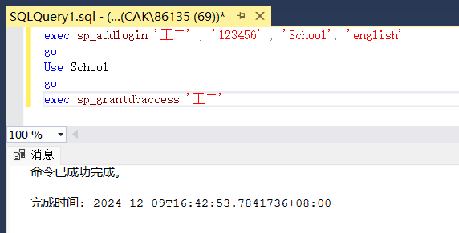
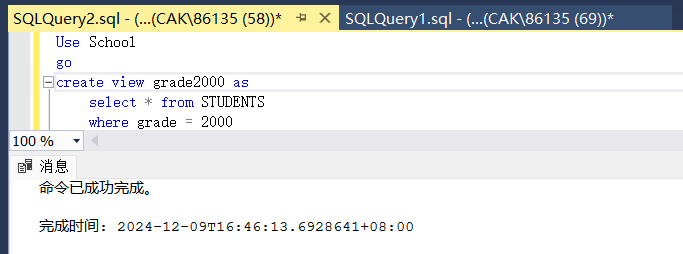
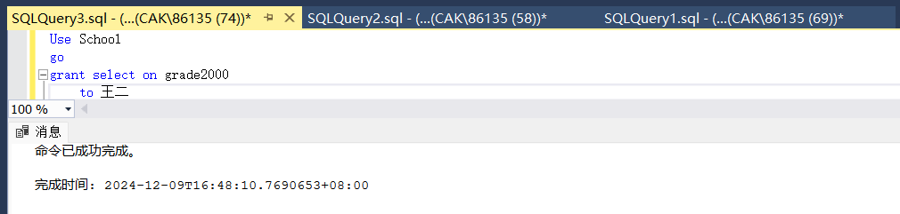
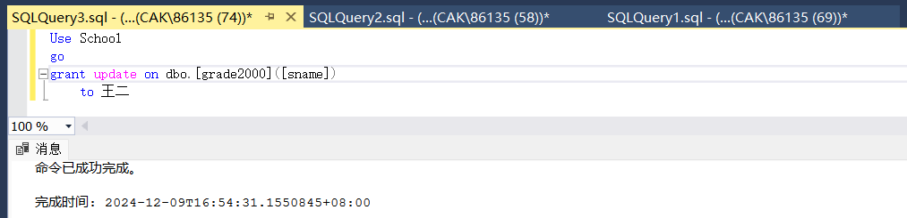
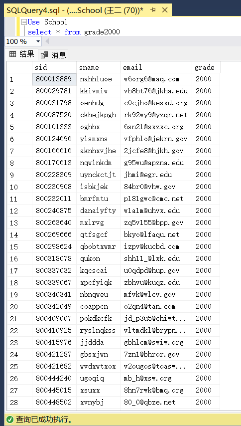
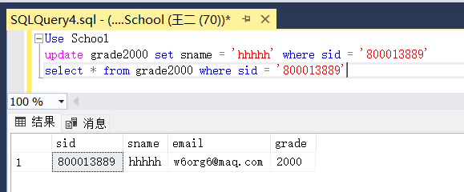
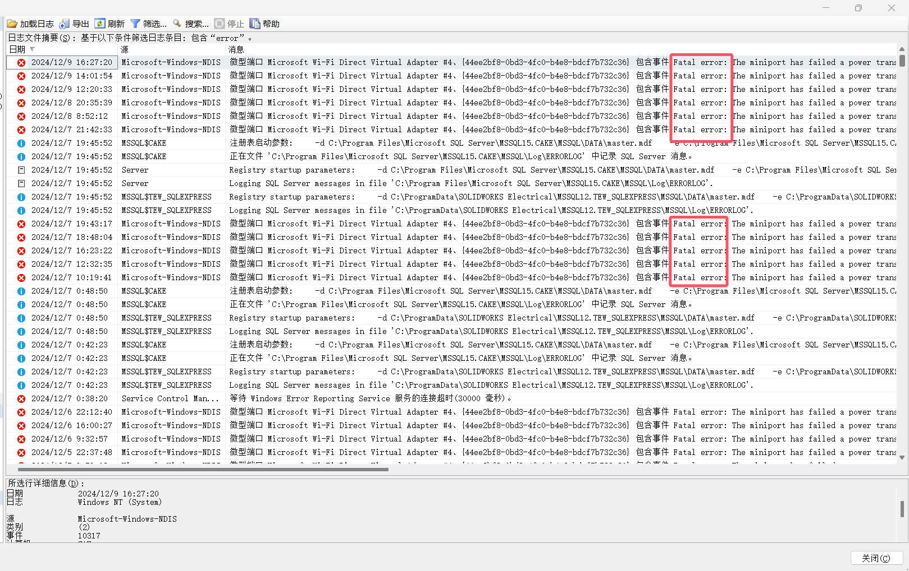

# 数据库实验报告 第16周

姓名：陈安康  学号：22320021

1. 创建用户如下：

创建视图如下：

2. 授予王二在视图grade2000的select权限：

3. 授予王二在视图grade2000的修改sname列的权限

对2 3 的验证：

登录用户王二，尝试对视图grade2000进行查询操作，成功查询：

尝试以用户王二身份修改sid = 800013889的记录的sname，修改成功：

4. 通过“管理”文件夹中“SQL Server日志”，选择相应存档查看日志详细信息，使用筛选功能筛选消息中包含有“error”字样的信息，查找到的错误日志如下

