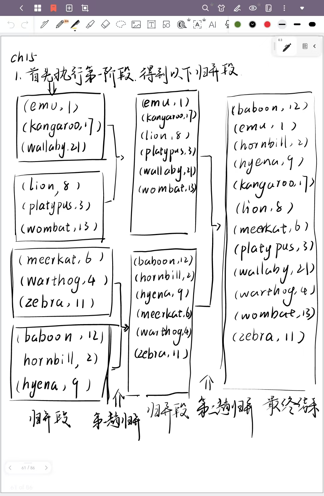
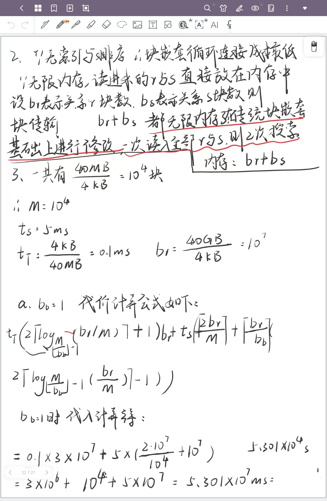
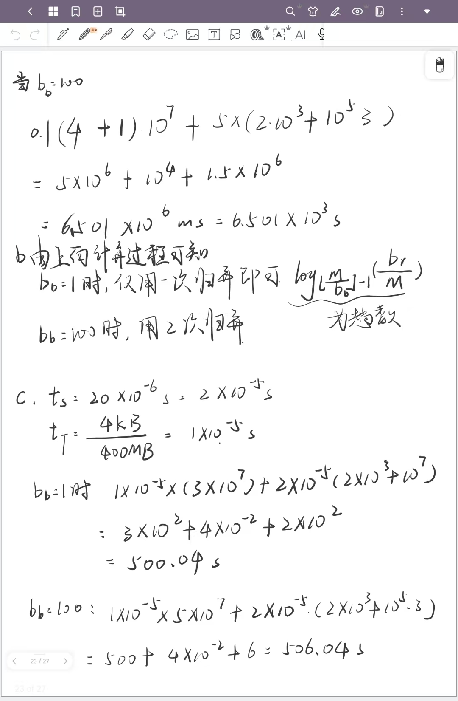
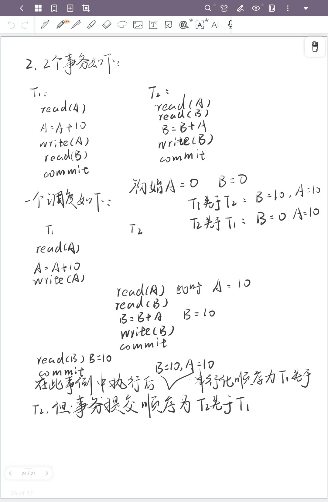
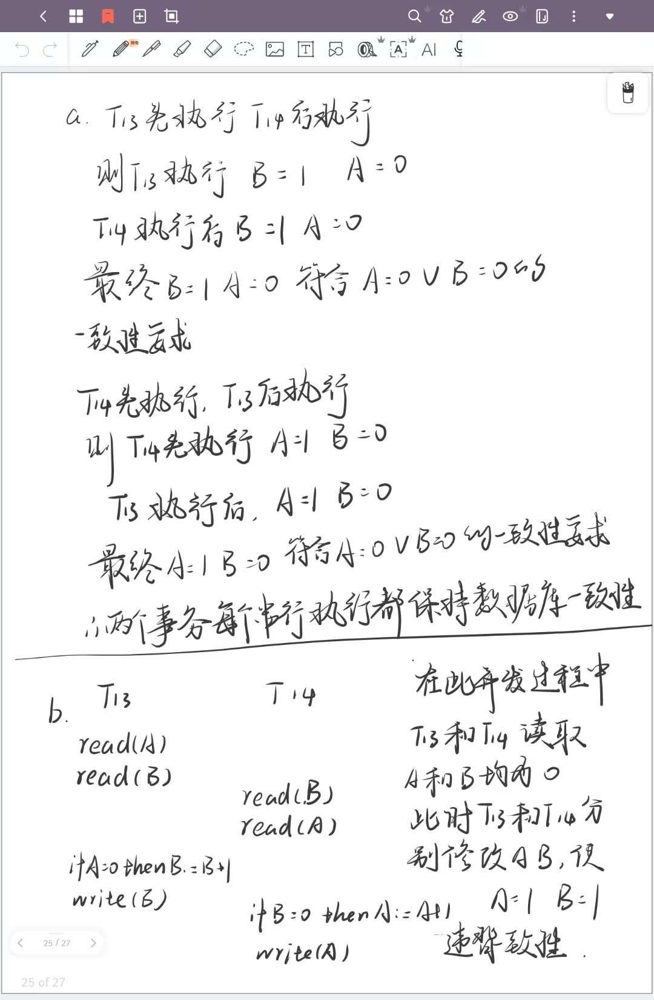
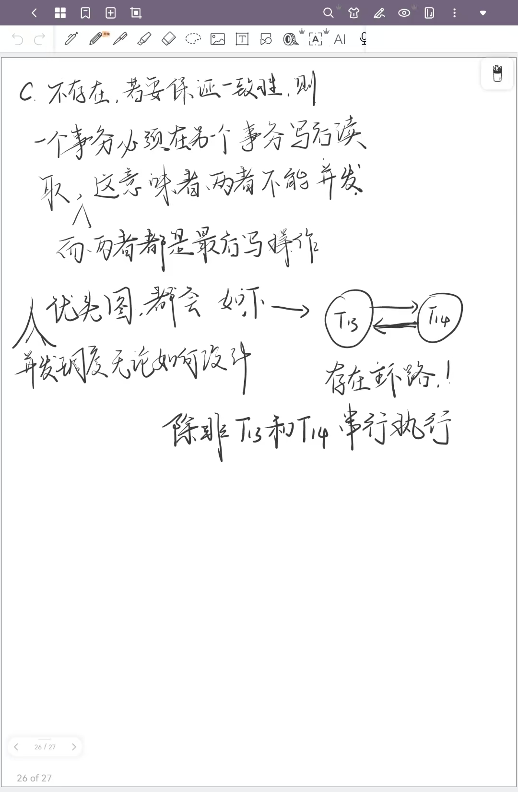

1

数据库中的ACID特性是确保事务处理的可靠性和一致性的关键概念。ACID代表四个核心属性：

1. **原子性（Atomicity）** :

* 原子性确保事务中的所有操作要么全部完成，要么全部不做。如果事务中的任何操作失败，整个事务将被回滚到事务开始前的状态，就像这个事务从未执行过一样。这是通过回滚机制实现的，保证了事务的不可分割性。

1. **一致性（Consistency）** :

* 一致性确保事务的执行将数据库从一个一致的状态转换到另一个一致的状态。事务必须遵守数据库的所有完整性约束和规则，如外键约束、检查约束等。如果事务违反了这些规则，它将被回滚，以维护数据库的一致性。

1. **隔离性（Isolation）** :

* 隔离性确保并发执行的事务彼此之间不会相互干扰。每个事务都像是在数据库的一个独立副本上操作，对其他事务不可见，直到它被提交。隔离性通过不同的隔离级别来实现，如读未提交（Read Uncommitted）、读已提交（Read Committed）、可重复读（Repeatable Read）和可串行化（Serializable）。

1. **持久性（Durability）** :

* 持久性确保一旦事务被提交，它对数据库的更改就是永久的，即使在系统故障后也能被保留。这意味着事务的提交操作会将所有更改写入到持久存储中，如磁盘。持久性保证了数据的长期保存，即使在硬件故障、电源故障或其他灾难情况下也不会丢失。

  重要性：ACID特性是数据库管理系统设计和实现事务处理时必须考虑的核心原则，它们因为它们确保了数据的完整性、一致性和可靠性。它们确保了数据库在事务处理过程中的数据完整性；数据库可以确保事务的执行不会违反任何业务规则或数据完整性约束，从而维护数据库状态的一致性；隔离性特性允许多个事务并发执行，同时确保它们不会相互干扰，这提高了数据库的并发性能；持久性特性确保了一旦事务被提交，所有的更改都是永久性的，即使在系统故障后也能恢复；原子性和持久性特性使得在系统故障后恢复数据变得更加容易。

