# 外卖数据库应用系统报告


## 应用需求

本外卖系统旨在为用户提供便捷、高效的外卖服务体验，通过了解外卖行业的特点和实际情况，从分析外卖的基本情况入手，集成客户的下单功能、商家的接单功能以及快递员的接单功能，实现外卖从选择到送达的全流程自动化管理。该系统不仅提升了用户的用餐便利性，也优化了商家的运营效率和快递员的配送流程。


## 系统设计

本系统期望实现客户、商家、外卖员三方的信息交互，并且在此过程中保证信息安全，即**不同身份的用户各自有不同的权限**。使用者按照身份登录系统，执行身份允许的权限操作。集成实现客户下单，商家出餐，物流运输等一系列操作，**同时实现订单平台和物流系统的自动化管理**，达到高效运行的目的。

订单平台统筹管理所有订单，包括订单状态的登记、修改、删除。

运输公司通过运单表记录订单派送过来的运输任务，并下发给外卖员，起到中介作用。

对于商家模块，实现其对自己菜品的增删查改功能，并且可以登入订单平台查看实时更新的订单信息，并修改订单进行发餐。

对于用户模块，实现对菜品的查找、下单、追踪订单状态、充值等一系列功能。

对于外卖员模块，对接可以从运输公司表中接取运输业务，完成反馈等功能。

实现登录和注册功能、金额交易等其他功能。

同时在前端设置提示信息，反馈操作的执行情况，提升用户使用体验。

### ER图设计

ER图如下，订单表本身是为了方便后续转换成关系模式，将客户与菜单从多对多关系各自转换成一对多关系而显式建立的，若不这样（订单退化成联系），则订单联系菜单，客户，物流员三个实体，会比较麻烦，这里将其作为实体展示出来：

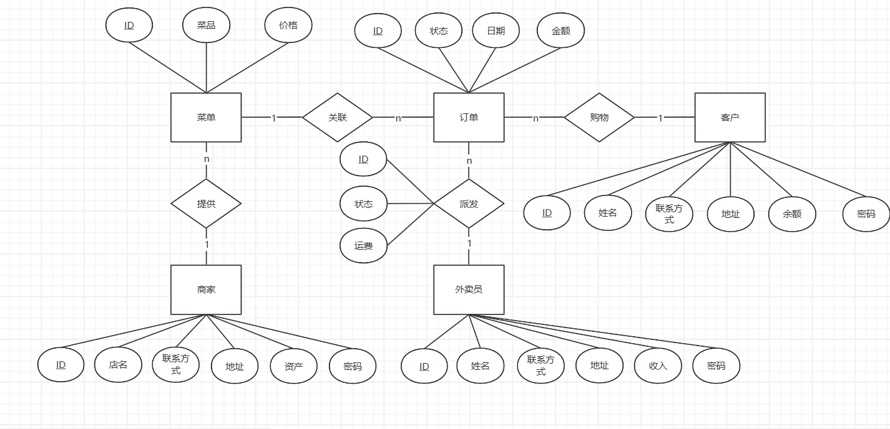

在将ER图转换成关系模式时，对于订单与物流员的关系，按照理论应当将派发的三个属性以及物流员的ID全部赋给订单，但这样就会出现订单表过于庞大的问题，并且考虑到现实生活中，物流公司和购物平台属于合作关系，则物流公司本身应当具有数据库表来独立记录信息，因此这里不再遵循理论，直接将派发联系转换为独立数据库表。

依据以上考虑，转化获得的数据库表如下，下划线标识主键，下划虚线标识外键：

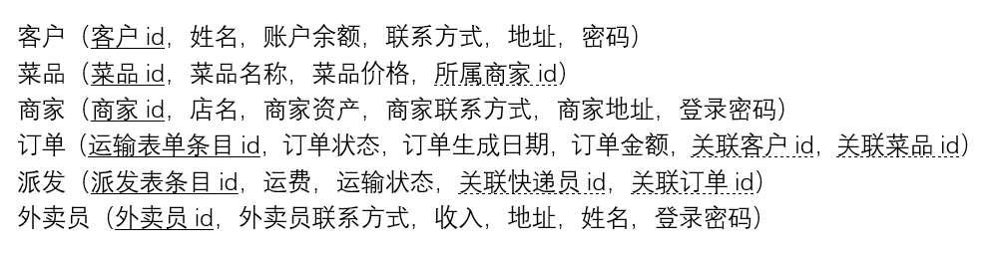

django中在models模块创建各表代码如下：

```python
from django.db import models

# Create your models here.
# 客户表
class Client(models.Model):
    CID = models.CharField(max_length=32, unique=True,primary_key=True)
    Cname = models.CharField(max_length=32)
    Account_balance = models.DecimalField(max_digits=10, decimal_places=2)
    Phone_number = models.CharField(max_length=32)
    Address = models.CharField(max_length=100)
    Passward = models.CharField(max_length=32,default='123456')


class Merchant(models.Model):
    MID = models.CharField(max_length=32, unique=True,primary_key=True)
    Mname = models.CharField(max_length=32)
    Account_balance = models.DecimalField(max_digits=10, decimal_places=2)
    Phone_number = models.CharField(max_length=32)
    Address = models.CharField(max_length=100)
    Passward = models.CharField(max_length=32,default='123456')


class Product(models.Model):
    PID = models.CharField(max_length=32, unique=True,primary_key=True)
    Belong = models.ForeignKey(Merchant, on_delete=models.CASCADE,null=True)
    Pname = models.CharField(max_length=32)
    Price = models.DecimalField(max_digits=6, decimal_places=2)


class Order(models.Model):
    OID = models.CharField(max_length=32, unique=True,primary_key=True)
    CID = models.ForeignKey(Client, on_delete=models.CASCADE)
    PID = models.ForeignKey(Product, on_delete=models.CASCADE)
    # Source_address = models.CharField(max_length=100)
    # Destination = models.CharField(max_length=100)
    Status = models.CharField(max_length=32)
    Date = models.CharField(max_length=32)
    Payment = models.DecimalField(max_digits=6, decimal_places=2)


class Delivery_Person(models.Model):
    DID = models.CharField(max_length=32, unique=True,primary_key=True)
    Dname = models.CharField(max_length=32,default='xxx')
    Account_balance = models.DecimalField(max_digits=10, decimal_places=2, default=0.00)
    Phone_number = models.CharField(max_length=32)
    Address = models.CharField(max_length=100,default='xxx')
    Passward = models.CharField(max_length=32,default='123456')


class Transport(models.Model):
    TID = models.CharField(max_length=32, unique=True,primary_key=True)
    OID = models.ForeignKey(Order, on_delete=models.CASCADE)
    DID = models.ForeignKey(Delivery_Person, on_delete=models.CASCADE,null=True)
    Payment = models.DecimalField(max_digits=6, decimal_places=2)
    Status = models.CharField(max_length=32)
```

### 关于支付与余额管理系统

因为实际外卖系统支付方式多种多样，这里查找实际平台金额交易步骤，实现如下：
客户确认收货后商家和骑手才能收到货款，可以避免商家和骑手消极工作，而客户投诉处理不及时的问题，可以保障客户权益。而客户付款则是在下单时进行，也避免了客户无脑投诉吃霸王餐的问题。

### 数据库中状态说明

订单状态：客户下单（ordered）-->商家已出餐（Shipped）-->骑手已取货（transporting）-->订单已完成（done）-->顾客已确认订单（over）

运单状态：等待接单（wait）-->已接单（accepted）--> 运输完成（done）

系统会自动在某一时刻对已经完成的订单和运单进行删除。


### 采用的软件支持

本次数据库应用系统是基于**django + css + opengauss + psycopg2**的技术栈框架进行搭建的。

Django 是一个高级的 Python Web 框架，用于快速开发 Web 应用。它遵循 MVC（Model-View-Controller）架构，致力于简化 Web 开发的常见任务，提供一整套工具集来帮助开发者实现从数据库到前端的各种功能。

CSS（Cascading Style Sheets，层叠样式表）是一种用于描述 HTML 或 XML（包括 XML 的各种语言，如 SVG 或 XHTML）文档的外观和格式的样式表语言。它控制网页的布局、颜色、字体、间距等视觉表现，而 HTML 负责定义网页的结构和内容。

openGauss 是一个开源的关系型数据库管理系统（RDBMS），由华为开发并贡献给开源社区。它是基于 PostgreSQL（一个成熟的开源关系数据库）的增强版本，目标是提供一个高性能、高可扩展性的企业级数据库平台，能够满足现代企业对于数据存储和处理的需求。

psycopg2 是一个用于连接和操作 PostgreSQL 数据库的 Python 库。它提供了一个 Python 接口，可以方便地与 PostgreSQL 数据库进行交互，执行 SQL 查询、获取结果、处理事务等操作。psycopg2 是 PostgreSQL 与 Python 之间最流行的连接库之一，广泛用于 Web 开发、数据分析、自动化等场景。

在django搭建的Web框架基础上，我们将opengauss数据库与其进行连接，采用psycopg2提供的python接口与数据库进行交互。编写视图处理函数。在前端开发中使用 CSS 优化界面样式，通过模板渲染呈现数据。


## 具体代码功能实现

### 登录和注册

登录需要填写身份信息，若出现错误会进行提示，成功则依据身份信息跳转不同的界面。并将身份信息进行保存。身份信息采用线程局部存储对象存取，保证多用户同时登录时互不干扰。

关键代码如下：

```python
login = threading.local()

def login(request):
    if request.method == 'GET':
        # 如果是 GET 请求，渲染并返回登录表单
        return render(request, 'login.html')
    elif request.method == 'POST':
        try :
            connection = psycopg2.connect(
            database = "postgres",
            user = "testuser",
            password = "ccc2osuRm7o",
            host = "192.168.132.101",
            port = 5432,
            )
            cur = connection.cursor()
        except BaseException as e:
            print(e)
        index = request.POST.get('ID')
        username = request.POST.get('username')
        password = request.POST.get('password')
        occupation = request.POST.get('occupation')
        if occupation == "客户":
            cur.execute('''SELECT * FROM myapp_client where "CID" = %s and "Cname" = %s and "Passward" = %s;''', [index,username,password])
        elif occupation == "商家":
            cur.execute('''SELECT * FROM myapp_merchant where "MID" = %s and "Mname" = %s and "Passward" = %s;''', [index,username,password])
        elif occupation == "快递员":
            cur.execute('''SELECT * FROM myapp_delivery_person where "DID" = %s and "Dname" = %s and "Passward" = %s;''', [index,username,password])
        rows = cur.fetchall()
        if rows:
            login.ID = index
            login.occupation = occupation
            if occupation == "客户":
                connection.close()
                return redirect('client')
            elif occupation == "商家":
                connection.close()
                return redirect('merchant')
            elif occupation == "快递员":
                connection.close()
                return redirect('delivery_person')
        else:
            error = '登录失败！请重试'
            connection.close()
            return render(request, 'login.html', {'error': error})
```

注册用户需要填写相关信息，进行创建，创建成功后会自动在所属数据库表中进行记录添加。

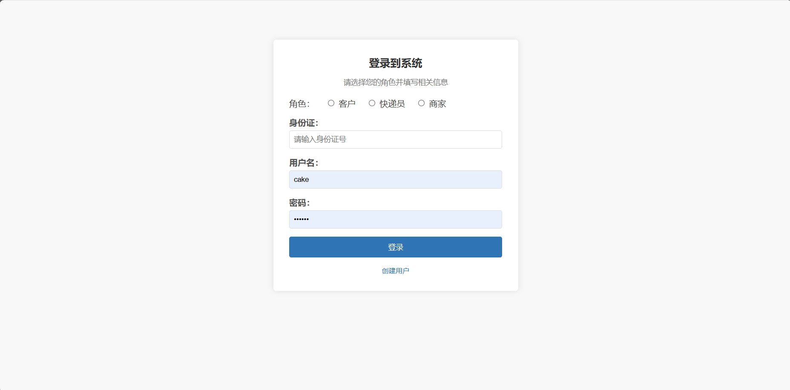

关键代码如下：

```python
def create_account(request):
    if request.method == 'GET':
        # 如果是 GET 请求，渲染并返回登录表单
        return render(request, 'create_account.html')
  
    elif request.method == 'POST':
        try :
            connection = psycopg2.connect(
            database = "postgres",
            user = "testuser",
            password = "ccc2osuRm7o",
            host = "192.168.132.101",
            port = 5432,
            )
            cur = connection.cursor()
        except BaseException as e:
            print(e)
        index = request.POST.get('ID')
        username = request.POST.get('username')
        address = request.POST.get('address')
        account_balance = float(request.POST.get('account_balance'))
        phone_number = request.POST.get('phone_number')
        occupation = request.POST.get('occupation')
        passward = request.POST.get('passward')
        if occupation == "客户":
            cur.execute('''SELECT * FROM myapp_client where "CID" = %s;''', [index])
        elif occupation == "商家":
            cur.execute('''SELECT * FROM myapp_merchant where "MID" = %s;''', [index])
        elif occupation == "快递员":
            cur.execute('''SELECT * FROM myapp_delivery_person where "DID" = %s;''', [index])
        rows = cur.fetchall()
        if rows:
            error = '用户已经存在！'
            connection.close()
            return render(request, 'create_account.html', {'error': error})
        else:
            try:
                if occupation == "客户":
                    cur.execute('''INSERT INTO myapp_client VALUES(%s,%s,%s,%s,%s,%s);''', [index,username,account_balance,phone_number,address,passward])
                    connection.commit()
                elif occupation == "商家":
                    cur.execute('''INSERT INTO myapp_merchant VALUES(%s,%s,%s,%s,%s,%s);''', [index,username,account_balance,phone_number,address,passward])
                    connection.commit()
                elif occupation == "快递员":
                    # 这里是因为表的属性顺序原因
                    cur.execute('''INSERT INTO myapp_delivery_person VALUES(%s,%s,%s,%s,%s,%s);''', [index,phone_number,account_balance,address,username,passward])
                    connection.commit()
            except BaseException as e:
                print(e)
                error = '用户创建失败！'
                connection.close()
                return render(request, 'create_account.html', {'error': error})
            success = '用户创建成功！'
            connection.close()
            return render(request, 'create_account.html', {'success': success})
```

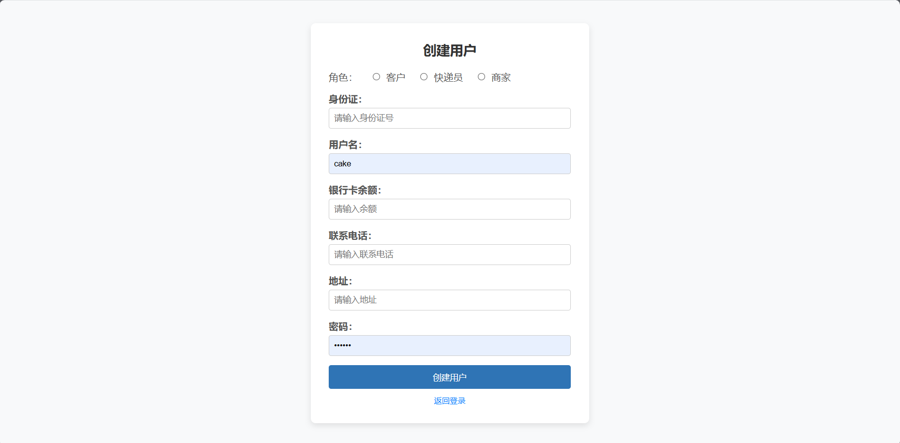

### 商家模块

商家模块主要分成两大部分：1）对菜单表的操作   2）对订单表的操作

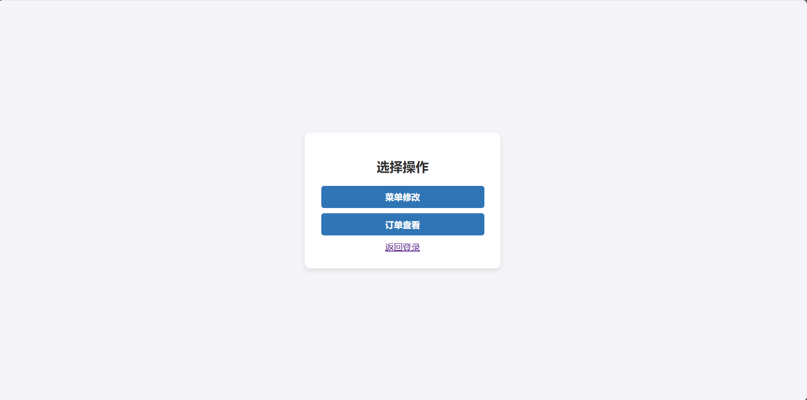

1）对菜单表：实现对菜品的增删查改功能，并且为了隐私考虑，商家只能操作属于自己供应的菜品。主要代码如下：

```python
def merchant_product_op(request):
    try :
        connection = psycopg2.connect(
        database = "postgres",
        user = "testuser",
        password = "ccc2osuRm7o",
        host = "192.168.132.101",
        port = 5432,
        )
        cur = connection.cursor()
    except BaseException as e:
        msg = str(e)
    if request.method == 'GET':
        msg = f'{login.occupation}'
        # 如果是 GET 请求，渲染并返回登录表单
        cur.execute('''SELECT * FROM myapp_product WHERE "Belong_id" = %s;''',[login.ID])
        # cur.execute('''SELECT * FROM myapp_product WHERE "Belong_id" = %s;''',[login.ID])
        products = cur.fetchall()
        connection.close()
        return render(request, 'merchant_product_op.html',{'products' : products, 'msg' : msg})

    elif request.method == 'POST':
        button = request.POST.get('submitted_button')

        #  增加操作
        if button == 'Product_Insert':
            msg = f'添加成功！'
            index = request.POST.get('ID')
            username = request.POST.get('username')
            account_balance = request.POST.get('account_balance')
            try:
                cur.execute('''INSERT INTO myapp_product VALUES(%s,%s,%s,%s);''', [index,username,float(account_balance),login.ID])
                connection.commit()
            except BaseException as e:
                msg = str(e)
                connection.rollback()
            cur.execute('''SELECT * FROM myapp_product WHERE "Belong_id" = %s;''',[login.ID])
            products = cur.fetchall()
            connection.close()
            return render(request, 'merchant_product_op.html', {'products' : products,'msg': msg})

        # 删除操作，先实现按照ID进行删除
        elif button == 'Product_Delete':
            msg = '删除成功！'
            index = request.POST.get('ID2')
            try:
                cur.execute('''DELETE FROM myapp_product WHERE "PID" = %s;''', [index])
                connection.commit()        
            except BaseException as e:
                msg = str(e)
                connection.rollback()   
            cur.execute('''SELECT * FROM myapp_product WHERE "Belong_id" = %s;''',[login.ID])
            products = cur.fetchall()
            connection.close()
            return render(request, 'merchant_product_op.html', {'products' : products,'msg': msg})

        # 修改操作，目前想着按照ID，修改价格和商品名称 
        elif button == 'Product_Update':
            msg = f'更新成功！'
            index = request.POST.get('ID3')
            username = request.POST.get('username3')
            account_balance = request.POST.get('account_balance3')
            try:
                if username != '':
                    cur.execute('''UPDATE myapp_product SET "Pname" = %s WHERE "PID" = %s;''', [username,index])
                if account_balance != '':
                    cur.execute('''UPDATE myapp_product SET "Price" = %s WHERE "PID" = %s;''', [float(account_balance),index])
                connection.commit()
            except BaseException as e:
                msg = f'{request.POST.get('username3')}'
                connection.rollback()
            cur.execute('''SELECT * FROM myapp_product WHERE "Belong_id" = %s;''',[login.ID])
            products = cur.fetchall()
            return render(request, 'merchant_product_op.html', {'products' : products,'msg': msg})
        elif button == 'Select':
            cur.execute('''SELECT * FROM myapp_product WHERE "Belong_id" = %s;''',[login.ID])
            products = cur.fetchall()
            msg = '查询成功！'
            try:
                sql = request.POST.get('select')
                cur.execute(f'''SELECT * FROM myapp_product WHERE {sql} and "Belong_id" = %s;''',[login.ID])
                products = cur.fetchall()
            except BaseException as e:
                msg = str(e)
            connection.close()
            return render(request, 'merchant_product_op.html', {'products' : products,'msg': msg})
        elif button == 'Q_select':
            msg = ''
            cur.execute('''SELECT * FROM myapp_product WHERE "Belong_id" = %s;''',[login.ID])
            products = cur.fetchall()
            return render(request, 'merchant_product_op.html', {'products' : products,'msg': msg})
        else:
            msg = f'刷新'
            cur.execute('''SELECT * FROM myapp_product WHERE "Belong_id" = %s;''',[login.ID])
            products = cur.fetchall()
            connection.close()
            return render(request, 'merchant_product_op.html', {'products' : products,'msg': msg}) 
```

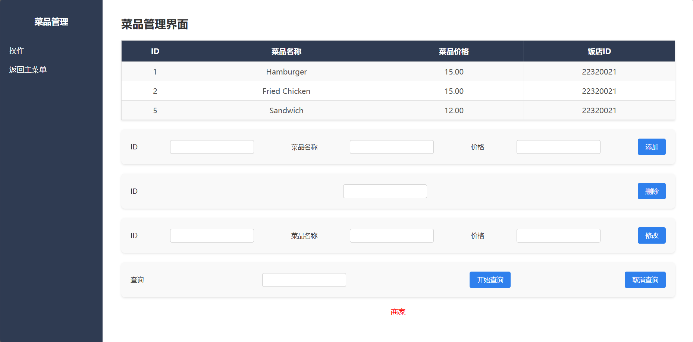

在查询框可以自由输入查询的要求进行查询，演示操作如下：

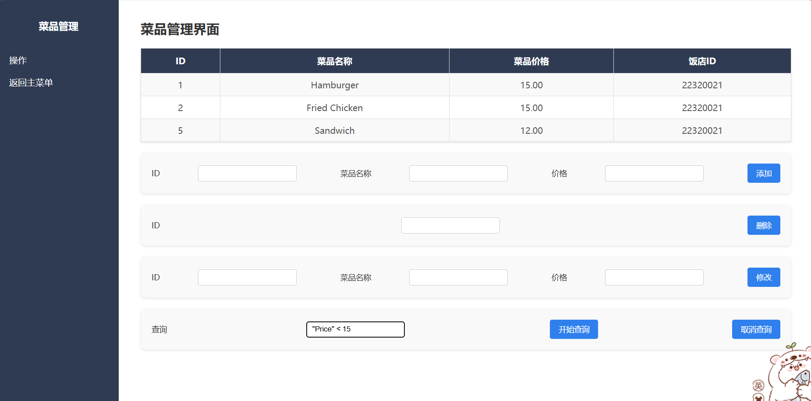

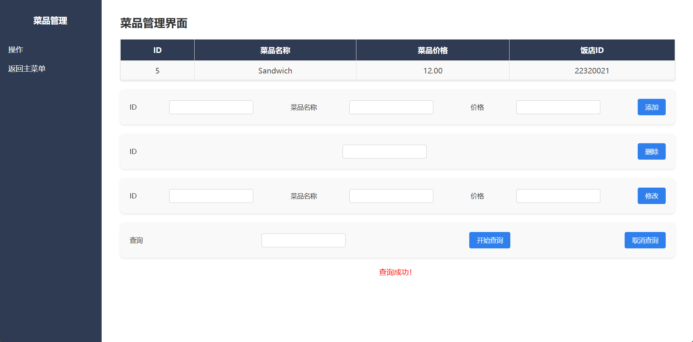

2）对订单表，实现查找以及修改功能，为了安全考虑，商家只能修改属于自己的产品的订单。修改订单的操作将订单从客户下单状态修改为货物发送状态，同时会自动依据订单信息生成运单信息，发送给物流系统，供物流工作人员处理。

代码如下：

```python
def merchant_check_order(request):
    try :
        connection = psycopg2.connect(
        database = "postgres",
        user = "testuser",
        password = "ccc2osuRm7o",
        host = "192.168.132.101",
        port = 5432,
        )
        cur = connection.cursor()
    except BaseException as e:
        msg = str(e)
    if request.method == 'GET':
        # 如果是 GET 请求，渲染并返回登录表单
        msg = ''
        # 如果是 GET 请求，渲染并返回登录表单
        cur.execute('''SELECT * FROM myapp_order WHERE "PID_id" in (SELECT "PID" FROM myapp_product WHERE "Belong_id" = %s);''',[login.ID])
        orders = cur.fetchall()
        connection.close()
        return render(request, 'merchant_check_order.html' ,{'orders' : orders})
    if request.method == 'POST':
        # 商家这边只能通过OID去修改订单的状态
        msg = f'状态更新成功！'
        index = request.POST.get('ID')
        try:
            cur.execute('''SELECT "Status" FROM myapp_order WHERE "OID" = %s;''', [index])
            status = cur.fetchall()
            if status and status[0][0] == 'ordered': 
                # 先更新Order表
                msg = '状态更新成功'
                cur.execute('''UPDATE myapp_order SET "Status" = 'Shipped' WHERE "OID" = %s;''', [index])
                # 插入transport表
                cur.execute('''SELECT "Payment" FROM myapp_order WHERE "OID" = %s;''',[index])
                price = cur.fetchall()
                payment = price[0][0] * Decimal('0.05')
                unique_ID = f"{int(time.time())}"
                cur.execute('''INSERT INTO myapp_transport VALUES(%s,%s,%s,%s,%s);''', [unique_ID,payment,'wait',None,index])
                connection.commit()
            else:
                msg = '当前订单状态不可更新！'
        except BaseException as e:
                msg = str(e)
                connection.rollback()


        cur.execute('''SELECT * FROM myapp_order WHERE "PID_id" in (SELECT "PID" FROM myapp_product WHERE "Belong_id" = %s);''',[login.ID])
        orders = cur.fetchall()
        connection.close()
        return render(request, 'merchant_check_order.html' ,{'orders' : orders, 'msg' : msg})
```

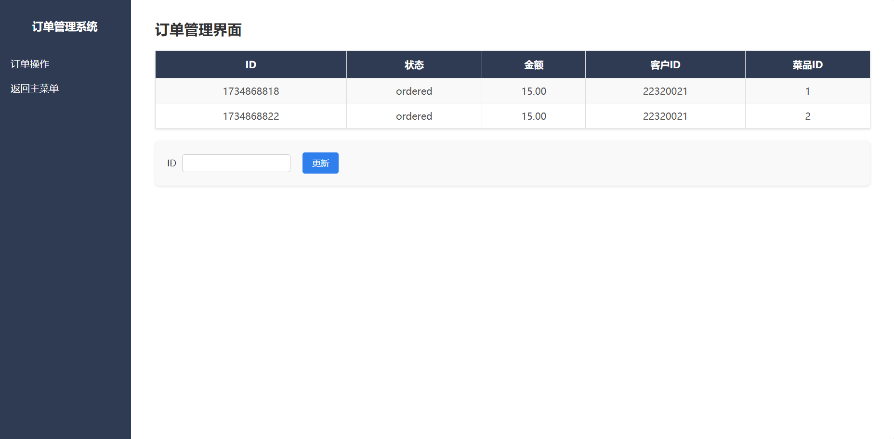

### 外卖员模块

物流人员实现查找、修改运单功能

出于信息安全考虑，物流人员只能查看自己的以及未被领取的订单信息。可以选取未被领取的订单进行接收，或者提交已经派送完成的订单。当运单完成时，会自动修改与之关联的订单，确保订单状态的实时更新。

关键代码如下：

```python
def delivery_person(request):
    try :
        connection = psycopg2.connect(
        database = "postgres",
        user = "testuser",
        password = "ccc2osuRm7o",
        host = "192.168.132.101",
        port = 5432,
        )
        cur = connection.cursor()
    except BaseException as e:
        msg = str(e)
    if request.method == 'GET':
        msg = f'{login.occupation}'
        # 如果是 GET 请求，渲染并返回登录表单
        cur.execute('''SELECT myapp_transport.* , myapp_client."Address" 
                        FROM 
                        myapp_transport  LEFT JOIN  myapp_order ON myapp_transport."OID_id" = myapp_order."OID"
                        LEFT JOIN myapp_client ON myapp_order."CID_id" = myapp_client."CID"
                        WHERE ("DID_id" = %s or "DID_id" IS NULL);''',[login.ID])
        transports = cur.fetchall()
        connection.close()
        return render(request, 'delivery_person.html',{'transports' : transports, 'msg' : msg})
    if request.method == 'POST':
        button = request.POST.get('submitted_button')
        index = request.POST.get('ID')
        if button == 'Accept':
            msg = f'接受成功！'
            try:
                cur.execute('''SELECT "Status" FROM myapp_transport WHERE "TID" = %s;''', [index])
                status = cur.fetchall()
                if status[0][0] == 'wait': 
                    # 更新transportport表
                    cur.execute('''UPDATE myapp_transport SET "Status" = 'accepted' WHERE "TID" = %s;''', [index])
                    cur.execute('''UPDATE myapp_transport SET "DID_id" = %s WHERE "TID" = %s;''', [login.ID,index])

                    # 更新order表
                    cur.execute('''SELECT "OID_id" FROM myapp_transport WHERE "TID" = %s;''', [index])
                    OID = cur.fetchall()

                    cur.execute('''UPDATE myapp_order SET "Status" = 'transporting' WHERE "OID" = %s;''', [OID[0][0]])
                    connection.commit()
            except BaseException as e:
                msg = str(e)
                connection.rollback()
            cur.execute('''SELECT myapp_transport.* , myapp_client."Address" 
                        FROM 
                        myapp_transport  LEFT JOIN  myapp_order ON myapp_transport."OID_id" = myapp_order."OID"
                        LEFT JOIN myapp_client ON myapp_order."CID_id" = myapp_client."CID"
                        WHERE ("DID_id" = %s or "DID_id" IS NULL);''',[login.ID])
            transports = cur.fetchall()
            connection.close()
            return render(request, 'delivery_person.html',{'transports' : transports, 'msg' : msg})
        # 删除操作，先实现按照ID进行删除
        elif button == 'Done':
            msg = '交付成功！'
            try:
                cur.execute('''SELECT "Status" FROM myapp_transport WHERE "TID" = %s;''', [index])
                status = cur.fetchall()
                if status[0][0] == 'accepted': 
                    cur.execute('''SELECT "OID_id", "DID_id","Payment" FROM myapp_transport WHERE "TID" = %s;''', [index])
                    OID = cur.fetchall()
                    # 更新transportport表
                    cur.execute('''UPDATE myapp_transport SET "Status" = 'done' WHERE "TID" = %s;''', [index])
                    # 更新order表
                    cur.execute('''UPDATE myapp_order SET "Status" = 'done' WHERE "OID" = %s;''', [OID[0][0]])

                    connection.commit()  
                    # print(OID)
                    # print(OID2)
                    # print(OID3)  
            except BaseException as e:
                    msg = str(e)
                    connection.rollback()   
            cur.execute('''SELECT myapp_transport.* , myapp_client."Address" 
                        FROM 
                        myapp_transport  LEFT JOIN  myapp_order ON myapp_transport."OID_id" = myapp_order."OID"
                        LEFT JOIN myapp_client ON myapp_order."CID_id" = myapp_client."CID"
                        WHERE ("DID_id" = %s or "DID_id" IS NULL);''',[login.ID])
            transports = cur.fetchall()
            connection.close()
            return render(request, 'delivery_person.html',{'transports' : transports, 'msg' : msg})
```

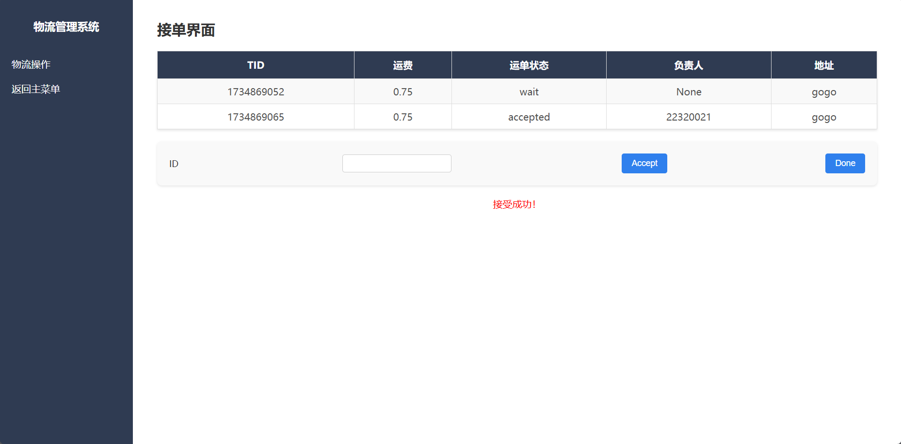

### 客户模块

客户界面实现了下订单、查看订单并查收的功能
1）客户可以查看商家提供的菜单，并选择中意的菜品下单。

关键代码如下

```python
def client(request):
    try :
        connection = psycopg2.connect(
        database = "postgres",
        user = "testuser",
        password = "ccc2osuRm7o",
        host = "192.168.132.101",
        port = 5432,
        )
        cur = connection.cursor()
    except BaseException as e:
        msg = str(e)
    
    cur.execute('''SELECT * FROM myapp_product''')
    Products=cur.fetchall()
  
    if request.method == 'GET':
        # 如果是 GET 请求，渲染并返回登录表单
        connection.close()
        return render(request, 'client.html',{'products' : Products})
  
    msg=''
    if request.method == 'POST':
        button = request.POST.get('submitted_button')
        index = request.POST.get('ID')
        if button=='search':
            connection.close()
            return redirect('client_search')#跳转到订单显示界面
    

        try:
            if button == 'Product_Insert':
                # cur.execute(''' ''')
                cur.execute('''SELECT * FROM myapp_product WHERE "PID" = %s;''', [index])
                gett = cur.fetchall()
                price = gett[0][2]
                cur.execute('''SELECT "Account_balance" FROM myapp_client WHERE "CID" = %s;''', [login.ID])
                gett2 = cur.fetchall()
                account = gett2[0][0]
                if account >= Decimal('1.05') * price:

                    unique_ID = f"{int(time.time())}"
                    cur.execute('''INSERT INTO myapp_order ("OID","CID_id","PID_id","Status","Date","Payment") VALUES (%s,%s,%s,'ordered','0',%s);''',
                                [unique_ID,login.ID,gett[0][0],float(gett[0][2])])

                    account = account - Decimal('1.05') * price
                    cur.execute('''UPDATE myapp_client SET "Account_balance" = %s WHERE "CID" = %s''',[account,login.ID])
                    msg = f'下单成功！'
                    connection.commit()
                else:
                    msg = '余额不足！'
        except BaseException as e:
            msg = str(e)
            connection.rollback()
        connection.close()
        return render(request, 'client.html', {'products' : Products,'msg': msg}
```

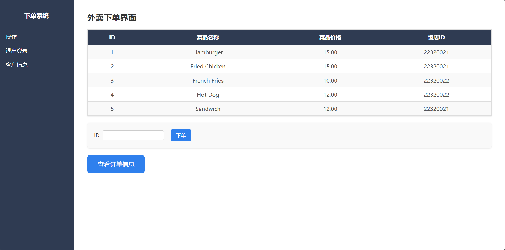

下单时会对用户金额进行判断，若不足就会进行报错提示


可以在客户信息界面进行充值，下图展示充值后的画面

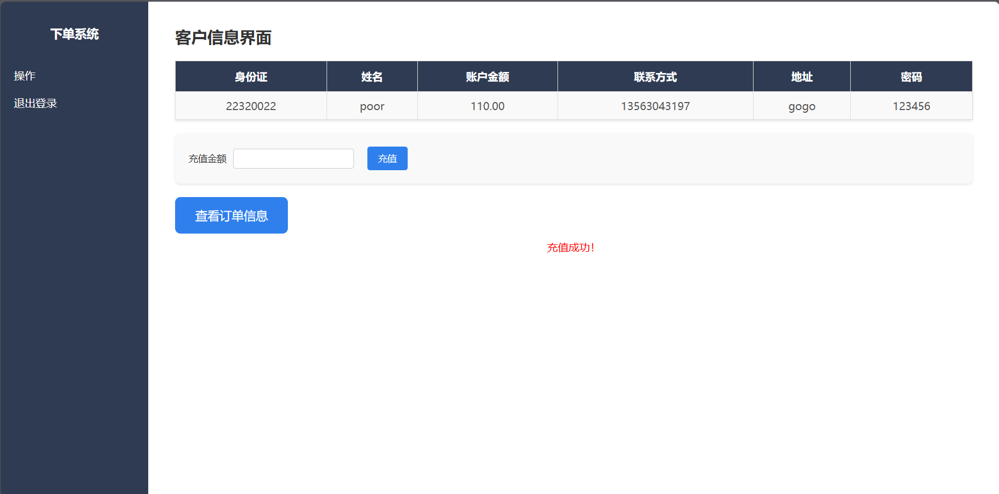

2）点击按钮可以跳转到查看订单界面，可以查看订单状态，并对订单进行查收，此时商家和物流人员收到各自费用。

关键代码如下：

```python
def client_search(request):
    try :
        connection = psycopg2.connect(
        database = "postgres",
        user = "testuser",
        password = "ccc2osuRm7o",
        host = "192.168.132.101",
        port = 5432,
        )
        cur = connection.cursor()
    except BaseException as e:
        msg = str(e)

    if request.method == 'GET':
        msg = f'{login.occupation}'
        # 如果是 GET 请求，渲染并返回登录表单
        cur.execute('''SELECT o."OID",p."Pname",o."Status"
                    FROM myapp_order o   JOIN myapp_product p ON o."PID_id" = p."PID"
                    WHERE o."CID_id" = %s;''',[login.ID])
        orders = cur.fetchall()
        connection.close()
        return render(request,'client_search.html' ,{'orders' : orders})
    if request.method == 'POST':
        button = request.POST.get('submitted_button')
        if button=='search':
            return redirect('client')#跳转到订单显示界面
        if button == 'done':
            try:  
                index = request.POST.get('ID')
                cur.execute('''SELECT o."Status" FROM myapp_order o WHERE o."OID" = %s;''',[index])
                status = cur.fetchall()
                if status[0][0] == 'done':
                    msg = '收货成功！'        
                    cur.execute('''UPDATE myapp_order SET "Status" = 'over'  WHERE "OID" = %s;''', [index])
                    # 更新order表
                    cur.execute('''SELECT "DID_id","Payment" FROM myapp_transport WHERE "OID_id" = %s ;''', [index])
                    OID = cur.fetchall()
                    # 获取order中的金额和product表中的pid
                    cur.execute('''SELECT "Payment","PID_id" FROM myapp_order WHERE "OID" = %s;''', [index])
                    OID2 = cur.fetchall()
                    # 利用pid找到供货商id
                    cur.execute('''SELECT "Belong_id" FROM myapp_product WHERE "PID" = %s;''', [OID2[0][1]])
                    OID3 = cur.fetchall()

                    # 修改金额
                    cur.execute('''UPDATE myapp_delivery_person SET "Account_balance" = "Account_balance" + %s  WHERE "DID" = %s;''', [OID[0][1],OID[0][0]])
                    cur.execute('''UPDATE myapp_merchant SET "Account_balance" = "Account_balance" + %s  WHERE "MID" = %s;''', [OID2[0][0],OID3[0][0]])
                    connection.commit()
                else:
                    msg = '请输入满足条件的ID'
            except BaseException as e:
                connection.rollback()
                msg = str(e)


            cur.execute('''SELECT o."OID",p."Pname",o."Status"
                    FROM myapp_order o   JOIN myapp_product p ON o."PID_id" = p."PID"
                    WHERE o."CID_id" = %s;''',[login.ID])
            orders = cur.fetchall()
            connection.close()
            return render(request,'client_search.html' ,{'orders' : orders,'msg' : msg})

```

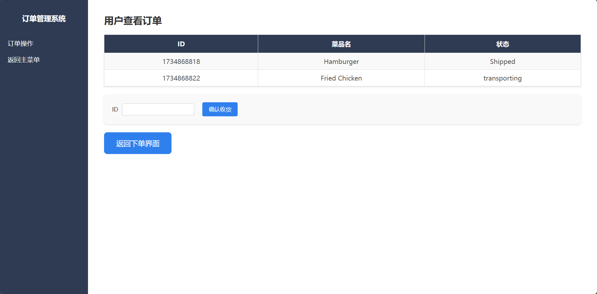


## 分工和任务

22320021 陈安康 负责整体项目框架的搭建。商家、外卖员、登入、注册功能前后端的实现。相关实验报告的编写。

22318001 蔡可忻 负责客户功能前后端的实现。以及相关实验报告的编写。
