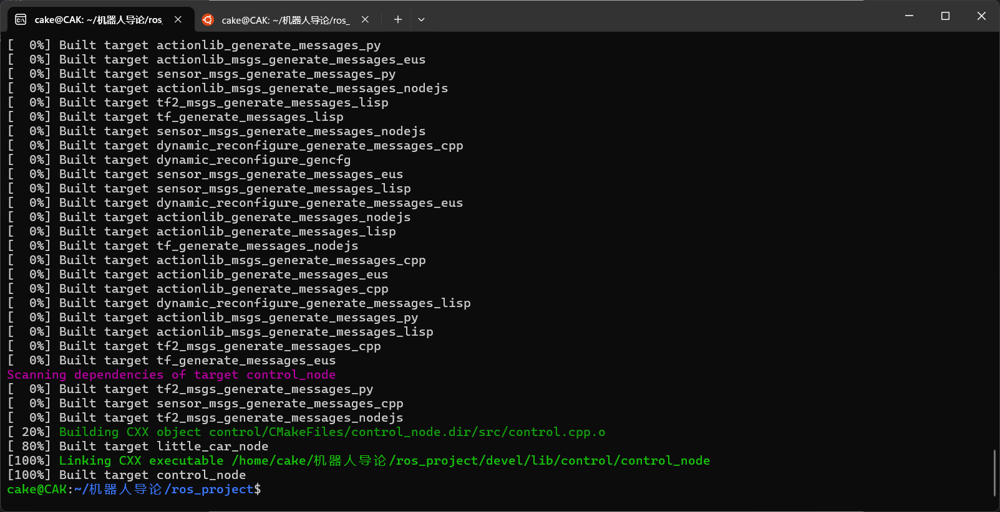
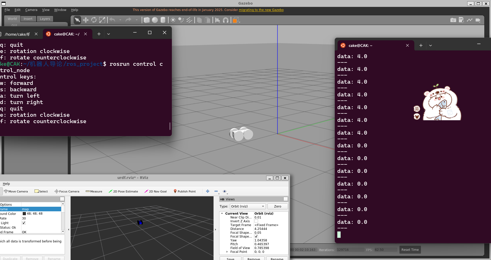
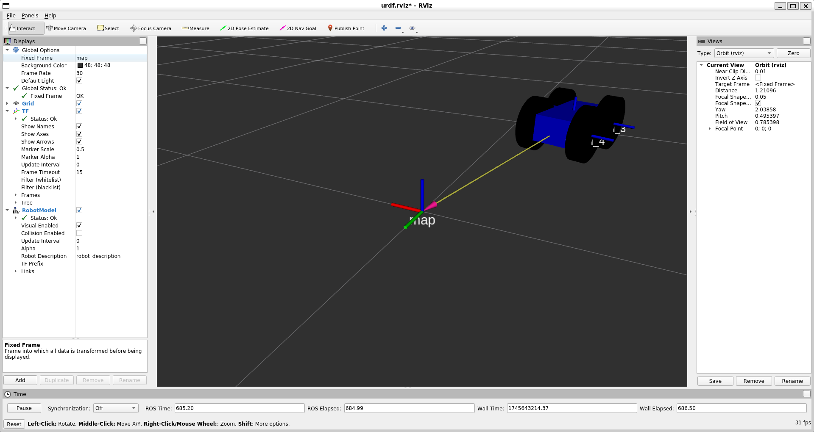
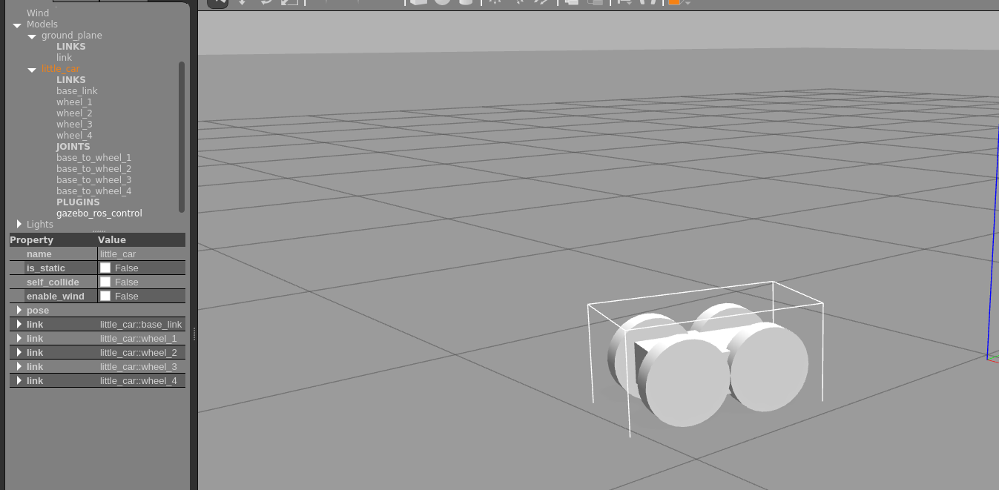
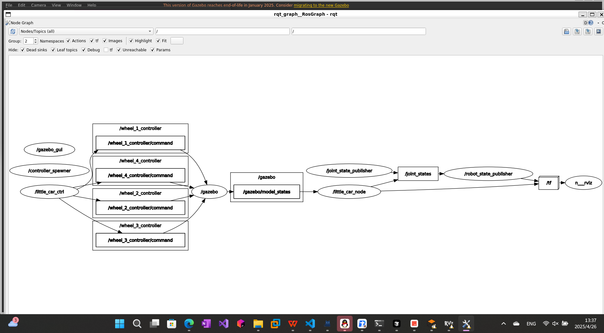

## 实验介绍

利用ROS实现在Gazebo中仿真简单的差速四轮小车，并可以通过键盘控制它的行为，并简单的在rviz里面进行可视化。

## 实验步骤

### 创建ros工作空间

由于我之前已经有过一定的ROS和Gazebo仿真基础，并且也使用过rviz来实现话题可视化等工作。所以电脑上已经有完整的环境。没有进行额外安装。

首先搭建ros工作空间。使用命令创建ros空间后进行编译，成功创建ros空间：



### urdf模型文件的编写

URDF（Unified Robot Description Format）是ROS中用于描述机器人结构和属性的XML格式，适合定义机器人各个关节、连杆、惯性、碰撞和可视化信息，而Xacro（XML Macros）是对URDF的扩展，允许使用变量、宏和表达式来生成URDF文件，使复杂或重复结构的机器人模型更加简洁和可维护，因此在建模复杂机器人时通常先使用Xacro编写模型，再通过转换生成标准URDF供ROS系统使用。

编写urdf文件，由于小车模型十分简单，行为以及交互也并不复杂，没有必要编写xacro来作为模版进行urdf生成。直接编写urdf即可。

该URDF片段定义了一个以长方体为主体的移动机器人底盘（`base_link`），并将四个圆柱体形状的轮子（此处以 `wheel_1` 为例）作为独立的 `link` 添加。每个轮子均配置了可视化、碰撞和惯性属性，并通过 `continuous` 类型的 `joint` 与车身连接，实现可旋转的运动。关节的位置和朝向通过 `origin` 指定，旋转轴设置为垂直方向。为了支持后续的运动控制，每个关节都定义了对应的 `transmission` 模块，指定控制接口为 `VelocityJointInterface`，并通过 `actuator` 配置电机，在控制信号到来时，控制信号传递给电机接收，进而驱动电机作用于关节，控制器也会通过电机获取状态信息。

由于该模型用于 Gazebo 仿真，因此可以直接使用 Gazebo 提供的控制插件 `libgazebo_ros_control.so`，无需自行编写硬件接口。插件通常用于 SDF 模型中，但在 URDF 文件中也可通过 `<gazebo>` 标签嵌入使用。其作用是作为控制器与底层“硬件”（由 `transmission` 配置描述）的桥梁，使控制器能够通过标准的 ROS 控制接口（如 `VelocityJointInterface`）驱动仿真中的关节。

```xml
<?xml version="1.0" ?>
<robot name="little_car">
<!-- 小车的主体部分 -->
    <link name="base_link">
        <visual>
            <origin xyz="0 0 0" rpy="0 0 0" />
            <geometry>
                <box size="0.3 0.2 0.1" /> <!-- 原始车身尺寸 -->
            </geometry>
            <material name="blue">
                <color rgba="0 0 1 1"/>
            </material>
        </visual>
        <collision>
            <geometry>
                <box size="0.3 0.2 0.1" />
            </geometry>
        </collision>
        <inertial>
            <mass value="10"/>
            <inertia ixx="0.1" ixy="0.0" ixz="0.0" iyy="0.1" iyz="0.0" izz="0.1"/>
        </inertial>
        <origin xyz="0 0 0.05" rpy="0 0 0" /> <!-- 原始位置 -->
    </link>

<!-- 轮子部分 -->
    <link name="wheel_1">
        <visual>
            <origin xyz="0 0 0" rpy="0 0 0" />
            <geometry>
                <cylinder radius="0.1" length="0.05"/> <!-- 调整后的轮子半径 -->
            </geometry>
            <material name="black">
                <color rgba="0 0 0 1"/>
            </material>
        </visual>
        <collision>
            <geometry>
                <cylinder radius="0.1" length="0.05"/>
            </geometry>
        </collision>
        <inertial>
            <mass value="2"/>
            <inertia ixx="0.01" ixy="0.0" ixz="0.0" iyy="0.01" iyz="0.0" izz="0.01"/>
        </inertial>
    </link>
<!-- 省略了其他轮子的展示 -->
<!-- 连接小车的主体和四个轮子 -->
    <joint name="base_to_wheel_1" type="continuous">
        <parent link="base_link"/>
        <child link="wheel_1"/>
        <axis xyz="0.0 0.0 1.0"/>
        <origin xyz="0.1 0.1 0.0" rpy="1.57 1.57 0"/>
        <joint_properties damping="20.0" friction="20.0"/>
    </joint>

<!-- 驱动系统 -->
    <transmission name="trans_wheel_1">
        <type>transmission_interface/SimpleTransmission</type>
        <joint name="base_to_wheel_1">
            <hardwareInterface>hardware_interface/VelocityJointInterface</hardwareInterface>
        </joint>
        <actuator name="wheel_1_motor">
            <hardwareInterface>hardware_interface/VelocityJointInterface</hardwareInterface>
            <mechanicalReduction>1</mechanicalReduction>
        </actuator>
    </transmission>
 <!-- Gazebo 插件 -->
    <gazebo>
        <plugin name="gazebo_ros_control" filename="libgazebo_ros_control.so"/>
    </gazebo>
</robot>
```

配置好硬件以及硬件接口后，还需要配置控制器，可以在yaml文件中进行定义和参数设置，配置完成后通过roslaunch中的加载命令（command = "load"）进行加载。

控制器的作用是接收外部控制指令，并根据这些指令调节电机的输出。在调节过程中，控制器会周期性地读取电机的实际状态值，并将其作为反馈输入，供控制算法使用，以实现精确的运动控制。其内部集成了一些ros中实现的现成控制器（如PID控制器），更方便进行调节。

控制器配置中定义了控制器的类型、作用的关节以及对应的 PID 参数。完成这些配置后，`gazebo_ros_control` 插件会根据控制器类型和所关联的关节，在加载时自动与通过 `transmission` 配置的电机建立联系，从而实现控制器到硬件的绑定与通信。

控制器会根据控制器名字自动生成话题（/控制器名字/command），用来接收外部传入的命令。所以只需要再写一个节点，获取键盘输入，并依据输入转换成命令发布到话题中即可。ros中的基本通信有发布-订阅和服务-客户端模式。两者分别类似于UDP和TCP，两者最大区别在于服务-客户端模式会返回执行结果的信息，而发布-订阅不会。这里使用发布-订阅就很合适。

由于调出精细的PID参数过于麻烦，所以这里进行简单的配置。

定义如下：

```yaml
wheel_1_controller:
  type: "velocity_controllers/JointVelocityController"
  joint: "base_to_wheel_1"
  pid: {p: 10.0, i: 0.0, d: 0.1}
  
wheel_2_controller:
  type: "velocity_controllers/JointVelocityController"
  joint: "base_to_wheel_2"
  pid: {p: 10.0, i: 0.0, d: 0.1}

wheel_3_controller:
  type: "velocity_controllers/JointVelocityController"
  joint: "base_to_wheel_3"
  pid: {p: 10.0, i: 0.0, d: 0.1}

wheel_4_controller:
  type: "velocity_controllers/JointVelocityController"
  joint: "base_to_wheel_4"
  pid: {p: 10.0, i: 0.0, d: 0.1}

```

然后创建launch文件，启动多个相关节点，仿真环境，rviz等，加载参数配置：

```xml
<?xml version="1.0" ?>
<launch>
    <!-- 从URDF文件加载robot_description -->
    <param name="robot_description" textfile="$(find little_car)/urdf/little_car.urdf" />
    <param name="use_gui" value="True"/>

    <!-- RViz配置 -->
    <arg name="rvizconfig" default="$(find little_car)/rviz/urdf.rviz" />
    <node name="rviz" pkg="rviz" type="rviz" args="-d $(arg rvizconfig)" required="true" />

    <!-- Joint State Publisher -->
    <node name="joint_state_publisher" pkg="joint_state_publisher" type="joint_state_publisher" />

    <!-- Robot State Publisher -->
    <node name="robot_state_publisher" pkg="robot_state_publisher" type="robot_state_publisher" />

    <!-- 启动 Gazebo 仿真环境 -->
    <include file="$(find gazebo_ros)/launch/empty_world.launch">
        <arg name="paused" value="false" />
        <arg name="use_sim_time" value="true" />
    </include>

    <!-- 加载控制器配置 -->
    <rosparam file="$(find little_car)/config/controllers.yaml" command="load" />
  
    <!-- 控制器加载器 -->
    <node name="controller_spawner" pkg="controller_manager" type="spawner" args="wheel_1_controller wheel_2_controller wheel_3_controller wheel_4_controller" />

    <!-- 启动仿真机器人模型 -->
    <node name="little_car_node" pkg="little_car" type="little_car_node" />

    <node name="spawn_urdf" pkg="gazebo_ros" type="spawn_model" args="-urdf -model little_car -param robot_description" respawn="false"/>
</launch>

```

这里的rviz是我调好后保存的。

如果不发布tf树，在rviz里面只能将全局坐标系设成base_link才能正常显示模型，而且模型并不能动（因为全局坐标系是base_link）。为了让小车在rviz里面和Gazebo一样同步移动，需要自己手动发布从base_link坐标系到全局坐标系的转换tf树。我利用Gazebo里面的/gazebo/model_states话题获取模型在Gazebo里面相对于Gazebo的world全局坐标系的位姿（位置+四元数），然后利用这个位姿信息发布从base_link转换到map坐标系（rviz里面的全局坐标系）的tf树。一个简单的用于坐标转换类如下：

```cpp
#ifndef __PARSER_H
#define __PARSER_H
#include "parser.h"
#include <urdf/model.h>
#include <string>
#include <sensor_msgs/JointState.h>
#include <gazebo_msgs/ModelStates.h>
#include <tf/transform_broadcaster.h>
#include <geometry_msgs/Point.h>
#include <ros/ros.h>
#include <random>

typedef struct
{
	float x = 0.0;
	float y = 0.0;
	float z = 0.0;
}SVector3;
class little_car
{
	private:
		tf::TransformBroadcaster broadcaster;//坐标变换广播
		sensor_msgs::JointState joint_state;
		geometry_msgs::TransformStamped odom_trans;
 		std::string car_name = "little_car";  
		geometry_msgs::Pose car_pose;
		void update_position(); //更新位置
	public:
		ros::Publisher joint_pub;
		ros::Subscriber posSub;
		little_car();			//构造函数
		void update_();			//小车状态更新
		void posCallBack(const gazebo_msgs::ModelStates::ConstPtr& msg);
};

#endif

```

实现如下：

```cpp
#include "parser.h"
little_car::little_car()
{
}

void little_car::posCallBack(const gazebo_msgs::ModelStates::ConstPtr& msg) {
	// 遍历模型列表
    for (int i = 0; i < msg->name.size(); i++)
    {
        if (msg->name[i] == car_name)
        {
            // 获取模型的位置和姿态
            geometry_msgs::Pose pose = msg->pose[i];
            // 处理信息
            car_pose.position = pose.position;
        
			car_pose.orientation = pose.orientation;

        }
    }
}


void little_car::update_position()
{
	odom_trans.header.frame_id = "map";		//坐标变换的父坐标系
	odom_trans.child_frame_id = "base_link";	//子坐标系
    odom_trans.header.stamp = ros::Time::now();
    odom_trans.transform.translation.x = car_pose.position.x;//小车 x 方向的位置设置
    odom_trans.transform.translation.y = car_pose.position.y;
    odom_trans.transform.translation.z = car_pose.position.z;
	odom_trans.transform.rotation = car_pose.orientation;
	return;
}
void little_car::update_()
{

	joint_state.header.stamp = ros::Time::now();
   	joint_state.name.resize(4);
   	joint_state.position.resize(4);
   	joint_state.name[0] ="base_to_wheel_1";
   	joint_state.position[0] = 0;
    joint_state.name[1] ="base_to_wheel_2";
    joint_state.position[1] = 0;
    joint_state.name[2] ="base_to_wheel_3";
    joint_state.position[2] = 0;
	joint_state.name[3] ="base_to_wheel_4";
	joint_state.position[3] = 0;

	update_position();//更新位置信息
	joint_pub.publish(joint_state);
	broadcaster.sendTransform(odom_trans);//坐标变换广播
	return;
}

```

main函数如下，定时发布坐标转换：

```cpp
#include <ros/ros.h>
#include "parser.h"

int main(int argc, char **argv) {
  ros::init(argc, argv, "little_car");
  ros::NodeHandle nh;
  little_car car;
  car.joint_pub = nh.advertise<sensor_msgs::JointState>("joint_states", 1);
  car.posSub = nh.subscribe("/gazebo/model_states", 1000, &little_car::posCallBack, &car);
  ros::Rate rate(100); // 控制频率 100Hz
  while (ros::ok()) {
    car.update_();
    rate.sleep(); // 控制频率
    ros::spinOnce(); // 处理回调函数
  }

  return 0;
}

```

然后再实现一个节点，用来接收键盘输入，并发布控制命令到控制器留出的话题中，即可控制小车运动。虽然这一步通过python实现会更简单，因为python中有专门处理键盘输入的包，并且作为一个脚本运行时不用创建包，不需要配置复杂的编译环境。但为了实验完整性，这里选择创建包，采用CPP实现。通过catkin_create_pkg再次创建一个包，然后在里面实现如下，主要是通过获取键盘输出后，依据命令向四个话题发布预设好的轮子速度，实现的功能有前进，后退，左右转弯，原地顺/逆时针旋转：

```cpp
#include <ros/ros.h>
#include <std_msgs/Float64.h>
#include <unistd.h>
#include <termios.h>
#include <csignal>
#include <iostream>
#include <cmath>

void setNonBlockingInput()
{
    struct termios t;
    tcgetattr(STDIN_FILENO, &t);
    t.c_lflag &= ~(ICANON | ECHO);
    t.c_cc[VMIN] = 0;
    t.c_cc[VTIME] = 0;
    tcsetattr(STDIN_FILENO, TCSANOW, &t);
}

void restoreTerminal()
{
    struct termios t;
    tcgetattr(STDIN_FILENO, &t);
    t.c_lflag |= (ICANON | ECHO);
    tcsetattr(STDIN_FILENO, TCSANOW, &t);
}

bool checkKeyPress()
{
    fd_set readfds;
    FD_ZERO(&readfds);
    FD_SET(STDIN_FILENO, &readfds);
    struct timeval timeout;
    timeout.tv_sec = 0;
    timeout.tv_usec = 0;
    return select(1, &readfds, NULL, NULL, &timeout) > 0;
}

void signalHandler(int signum)
{
    restoreTerminal();
    exit(signum);
}

int main(int argc, char **argv)
{
    ros::init(argc, argv, "little_car_ctrl");
    ros::NodeHandle nh;

    setNonBlockingInput();
    signal(SIGINT, signalHandler);
    signal(SIGTERM, signalHandler);

    ros::Publisher wheel1_pub = nh.advertise<std_msgs::Float64>("/wheel_1_controller/command", 10);
    ros::Publisher wheel2_pub = nh.advertise<std_msgs::Float64>("/wheel_2_controller/command", 10);
    ros::Publisher wheel3_pub = nh.advertise<std_msgs::Float64>("/wheel_3_controller/command", 10);
    ros::Publisher wheel4_pub = nh.advertise<std_msgs::Float64>("/wheel_4_controller/command", 10);

    ros::Rate rate(20);

    std::cout << "Control keys:\n"
              << "  w: forward\n"
              << "  s: backward\n"
              << "  a: turn left\n"
              << "  d: turn right\n"
              << "  q: quit\n"
              << "  e: rotation clockwise\n"
              << "  f: rotate counterclockwise\n";

    std_msgs::Float64 w1, w2, w3, w4;
    w1.data = 0;
    w2.data = 0;
    w3.data = 0;
    w4.data = 0;

    while (ros::ok())
    {
        char lastKey = 0;
        // 清空缓冲区，只保留最后一个键
        while (checkKeyPress()) {
            lastKey = getchar();
        }

        // 默认停止
        w1.data = 0;
        w2.data = 0;
        w3.data = 0;
        w4.data = 0;

        switch (lastKey)
        {
            case 'w':
                w1.data = 4;
                w2.data = 4;
                w3.data = 4;
                w4.data = 4;
                break;
            case 's':
                w1.data = -4;
                w2.data = -4;
                w3.data = -4;
                w4.data = -4;
                break;
            case 'a':
                w1.data = 4;
                w2.data = 4;
                w3.data = 2;
                w4.data = 2;
                break;
            case 'd':
                w1.data = 2;
                w2.data = 2;
                w3.data = 4;
                w4.data = 4;
                break;
            case 'e':
                w1.data = -4;
                w2.data = -4;
                w3.data = 4;
                w4.data = 4;
                break;
            case 'f':
                w1.data = 4;
                w2.data = 4;
                w3.data = -4;
                w4.data = -4;
                break;
            case 'q':
                restoreTerminal();
                return 0;
            default:
                break;
        } 

        wheel1_pub.publish(w1);
        wheel2_pub.publish(w2);
        wheel3_pub.publish(w3);
        wheel4_pub.publish(w4);

        rate.sleep();
    }

    restoreTerminal();
    return 0;
}

```

由于roslaunch启动的话会导致节点在后台运行，就无法与其进行交互了，所以这里通过rosrun运行。通过source ./devel/setup.bash 设置环境变量后，运行：

```
rosrun control control_node
```

## 实现效果

由于此次实验相当于同时实现键盘和发送接收控制指令（发送控制指令给控制器，控制指令接收后展开一系列操作）的实现，所以不再单独分别展示

source环境变量后，首先通过launch文件启动little_car节点以及Gazebo，rviz，等其他节点，加载控制器配置：

```
roslaunch little_car little_car.launch
```

roslaunch会首先启动roscore，然后再启动其他节点。所以不用再启动roscore了，启动控制节点：

```
rosrun control control_node
```

然后将焦点聚集在键盘控制节点的终端上，就可以通过键盘控制小车了：



图中左边终端启动了键盘控制节点，右边节点展示的是rostopic echo /wheel_1_controller/command的命令展示的外部控制命令接收情况，后面界面展示Gazebo仿真，左下角是rviz中的显示。详细请看视频展示。

rviz的具体展示，使用RobotModel来显示模型：



Gazebo展示：



话题节点关系图如下：



## 实验总结

这次实验的不足之处就是键盘接收逻辑有点问题，它在键盘按下之后会中途断掉一段然后再继续发布，导致小车在初始启动时会“颠”一下。这是由于缓冲区清除的太快导致的。后续可以完善一下。

后续可以在此基础上进行更多的扩展，比如搭载一些传感器、设备比如GPS、D435i等深度相机来获取准确的里程计信息，完成特定的任务等。还可以用来集成一些简单的路径规划算法（如A*，JPS等等），只需要修改控制节点的逻辑，或者在之上实现一个更高一层的规划节点，通过规划节点接收目标点（人为提前设定或者rviz中通过2D Nav Goal等手动点击生成），规划路径，发布局部的目标点或者期望位姿，然后控制节点再将实际的硬件期望指令发布给控制器，控制器再传递给电机完成控制。

## 参考文献

[配置控制器](https://www.cnblogs.com/spyplus/p/16503532.html)
