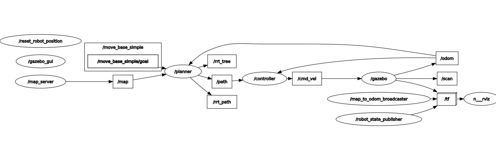

## 算法介绍

### 1. 路径规划与采样算法

**路径规划是机器人与自主导航领域的关键技术，其核心任务是在给定环境中，找到一条从起始点到目标点的无碰撞可行路径。在处理高维度、非凸（non-convex）的复杂环境时，传统的基于图搜索（如A*）或势场法的算法面临着计算量爆炸性增长的挑战。为了解决这一问题，基于随机采样的路径规划算法应运而生，其中，快速扩展随机树（Rapidly-exploring Random Tree, RRT）及其优化算法RRT*是应用最为广泛的代表。**

### 2. RRT (Rapidly-exploring Random Tree) 算法

#### 2.1 核心思想

**RRT 算法是一种增量式的、基于随机采样的全局路径规划算法。其核心思想是通过在状态空间中随机采样，引导一棵从起始点开始生长的随机树，快速地探索整个可行区域。该算法无需对整个空间进行显式建模，仅依赖于一个“碰撞检测”模块，因此非常适合处理具有复杂几何约束的高维空间问题。它的特点是探索性强，能迅速找到一条可行解，但并不保证路径的最优性。**

#### 2.2 算法流程

**RRT 算法的执行步骤如下：**

1. **初始化** ：创建一个仅包含起始点 `q_init` 的随机树 `T`。
2. **随机采样** ：在状态空间中生成一个随机采样点 `q_rand`。为了加速收敛，通常会以一定概率（目标偏置概率）直接选择目标点 `q_goal`作为 `q_rand`。
3. **寻找最近节点** ：在树 `T` 中，通过距离度量（通常为欧氏距离）找到距离 `q_rand` 最近的节点，记为 `q_near`。
4. **扩展** ：从 `q_near` 沿着朝向 `q_rand` 的方向，扩展一个固定的步长 `ε`，得到一个新的候选节点 `q_new`。
5. **碰撞检测** ：检查从 `q_near` 到 `q_new` 的新路径片段是否与环境中的障碍物发生碰撞。
6. **添加节点** ：若路径无碰撞，则将 `q_new` 作为新节点加入树 `T` 中，并记录其父节点为 `q_near`。若发生碰撞，则舍弃 `q_new`，返回步骤 2。
7. **循环与终止** ：重复以上步骤，直至新生成的节点 `q_new` 与目标点 `q_goal` 的距离小于预设阈值，或达到最大迭代次数。若成功连接到目标点，则从目标点回溯至根节点，构成一条完整的可行路径。

**RRT 算法具有** **概率完备性** **，即只要路径存在，当采样次数趋于无穷时，找到路径的概率趋近于1。**

### 3. RRT* (RRT-star) 算法

#### 3.1 核心思想

**RRT* 算法是 RRT 的一种优化变体，其主要目标是在保持 RRT 快速探索能力的同时，引入路径成本优化机制，使其能够** **渐进地收敛于最优解** **（Asymptotic Optimality）。与 RRT 找到第一条可行路径后即停止不同，RRT* 会在迭代过程中持续优化已生成的树结构，使得路径成本（如路径长度）不断降低。**

#### 3.2 关键改进

**RRT* 在 RRT 的基础上增加了两个核心的优化步骤：*

1. **寻找最优父节点 (Choose Parent)** ：当生成一个无碰撞的新节点 `q_new`后，算法不再简单地将其连接到最近的节点 `q_near`。而是会考察 `q_new` 周围一个邻域范围内的所有节点，并从中选择一个节点作为其父节点，使得 `q_new` 经由此父节点到达起点的总路径成本最低。
2. **路径重布线 (Rewiring)** ：在 `q_new` 加入树中后，算法会再次考察其邻域内的节点。对于每一个邻居节点，算法会判断，如果该邻居节点断开其原有连接，转而通过 `q_new` 连接到起点，其自身的路径总成本是否会降低。如果成本更低且新路径无碰撞，则更新该邻居节点的父节点为 `q_new`。这一过程相当于对树的拓扑结构进行动态重组，以达到更优的路径分布。

#### 3.3 特性总结

**通过引入最优父节点选择和重布线机制，RRT* 算法在迭代过程中不断优化路径。随着迭代次数的增加，其生成的路径会逐渐趋近于空间中的最优路径。然而，这些优化步骤也带来了更高的计算复杂度，使得 RRT* 的单次迭代耗时高于 RRT。因此，它在路径质量与计算效率之间提供了一种有效的权衡，特别适用于对路径平滑度和长度有较高要求的应用场景。

## 项目说明

### 项目架构

整个项目运行时节点话题关系包如下：



整个项目，结构十分经典，主要由以下几部分组成（没有按功能包去分）：

机器人相关的组件，包括机器人的仿真和自定义的消息结构等。随机地图生成器。Planner路径规划器。Controller控制器。

### 项目工作流程

/map_server 通过 /map话题将消息发给/planner，planner的职责是理论路径规划，接受目标点（通过/move_base_simple/goal，rviz的2D Nav Goal可以通过这个话题传递目标点信息到planner）后，依据/odom里程计信息（主要是用作定位自己在哪儿）运行实现的RRT*算法进行路径规划，然后发布三个话题信息，其中/rrt_tree和/rrt_path主要是用来在rviz里面进行可视化的，/rrt_path可视化最终路径（红色线），/rrt_tree可视化搜索过程（绿色线）。

控制器controller在/path话题上接受到路径信息，它的职责是将理论规划好的路径具体落实到pid的实际控制上，它里面实现PID算法，结合里程计，生成速度控制命令，通过/cmd_vel话题发送给仿真（gazebo）中的机器人的插件，插件依据速度命令进行运动，同时更新里程计（/odom）和坐标转换（/tf，这个主要是为了让机器人在rviz坐标系里面显示不出乱子）。然后我们就可以看到gazebo和rviz里面的机器人按照规划好的路径开始动起来！

基本的流程可以总结如下：

```
/move_base_simple/goal (geometry_msgs/PoseStamped) 
    ↓ 
RRT*路径规划器 
    ↓
/path (std_msgs/Float32MultiArray) + /rrt_path (nav_msgs/Path)
    ↓
PID控制器
    ↓
/cmd_vel (geometry_msgs/Twist)
    ↓
Gazebo差速驱动插件
    ↓
/odom (nav_msgs/Odometry) → 回到PID控制器
```

## 核心代码实现说明

### Planner实现

其中start是从goal_callback生成的，它代表了路径规划的起始点位置。当通过/move_base_simple/goal得到goal时会触发回调函数goal_callback。这里我修改了goal的实现逻辑，使start不再强制从原点开始，而是随着订阅的里程计中的信息进行实时更新。current_position是从里程计的回调函数odom_callback中实时更新的。

```python
def odom_callback(self, msg):
        self.current_position = msg.pose.pose.position
  
    def goal_callback(self, msg):
        self.goal = msg.pose.position
        if self.mp.map_info is not None and self.current_position is not None:
            # 使用机器人当前位置作为起点
            self.start = Point(self.current_position.x, self.current_position.y, 0)
            rospy.loginfo("收到目标点: (%.2f, %.2f)，从当前位置 (%.2f, %.2f) 开始路径规划..." % 
                         (self.goal.x, self.goal.y, self.start.x, self.start.y))
            self.plan_path()
        else:
            rospy.logwarn("地图或机器人位置信息未准备好，等待...")
```

在规划器里面我实现的核心寻路代码如下。

```python
def plan_path(self):
        """
        RRT*路径规划主函数
        """
        start_time = rospy.Time.now()
  
        # 初始化RRT树
        self.nodes = []
        start_node = self.Node(self.start)
        self.nodes.append(start_node)
  
        reached = False
        goal_node = None
  
        rospy.loginfo("开始RRT*路径规划...")
  
        for iteration in range(self.max_iter):
            # 1. 随机采样
            if random.random() < 0.1:  # 10%概率直接采样目标点
                rand_point = Point(self.goal.x, self.goal.y, 0)
            else:
                # 在地图范围内随机采样
                rand_point = Point(
                    random.uniform(self.mp.map_info.origin.position.x, 
                                 self.mp.map_info.origin.position.x + self.mp.map_info.width * self.mp.map_info.resolution),
                    random.uniform(self.mp.map_info.origin.position.y,
                                 self.mp.map_info.origin.position.y + self.mp.map_info.height * self.mp.map_info.resolution),
                    0
                )
      
            # 2. 找到最近的节点
            nearest_node = self.find_nearest_node(rand_point)
      
            # 3. 扩展节点
            new_point = self.steer(nearest_node.point, rand_point)
      
            # 4. 碰撞检测
            if self.mp.is_collision(nearest_node.point, new_point):
                continue
      
            # 5. 在搜索半径内找到邻近节点
            near_nodes = self.find_near_nodes(new_point)
      
            # 6. 选择最佳父节点
            best_parent = self.choose_parent(near_nodes, new_point, nearest_node)
            new_node = self.Node(new_point, best_parent)
            self.nodes.append(new_node)
      
            # 7. 重连接优化
            self.rewire(new_node, near_nodes)
      
            # 8. 检查是否到达目标
            if calc_distance((new_point.x, new_point.y), (self.goal.x, self.goal.y)) < self.goal_threshold:
                if not self.mp.is_collision(new_point, self.goal):
                    goal_node = self.Node(self.goal, new_node)
                    reached = True
                    rospy.loginfo("找到路径！迭代次数: %d" % (iteration + 1))
                    break
  
        # 计算规划时间
        planning_time = (rospy.Time.now() - start_time).to_sec()
  
        if reached:
            # 发布路径
            self.publish_path(goal_node)
            # 计算路径长度
            path_length = goal_node.cost
            rospy.loginfo("路径规划成功！")
            rospy.loginfo("规划时间: %.3f 秒" % planning_time)
            rospy.loginfo("路径长度: %.3f 米" % path_length)
        else:
            rospy.logwarn("在最大迭代次数内未找到路径")
```

核心的流程如下：在随机采样生成rand_point后，对于候选点进行生成和碰撞测试。在这里rand_point是一个“指示节点”，首先找到离rand_point最近的节点nearest_node，然后在nearest_node朝着rand_point方向，移动固定一小步后得到的真正的新节点new_point，这是为了保证了RRT树能够以小增量、精细地探索空间，而不是大跨步地跳跃。然后调用is_collision进行碰撞检测。

is_collision是路径规划的一个关键部分，它负责判断新扩展的节点究竟是不是合法节点。其代码实现如下。由于地图信息是存储在栅格地图中，所以要先将真实坐标转换成栅格坐标，这里我采用Bresenham直线算法（一种在计算机图形学里面常用的直线光栅化算法）构建得到两点直线路径上的栅格，直接查询并判断每一个栅格在地图数据中的占据值是否超过了预设的障碍物阈值（例如50），一旦路径上有任何一个栅格被认定为障碍物，则判定该路径会发生碰撞，其所导向的新节点即为不合法节点。

```python
def is_collision(self, p1, p2):
        if self.map_data is None:
            return False
  
        # 转换为栅格坐标
        x1, y1 = self.world_to_map(p1)
        x2, y2 = self.world_to_map(p2)
  
        # 确保坐标在地图范围内
        if (x1 < 0 or x1 >= self.map_info.width or y1 < 0 or y1 >= self.map_info.height or
            x2 < 0 or x2 >= self.map_info.width or y2 < 0 or y2 >= self.map_info.height):
            return True
  
        # Bresenham直线算法检测路径上的每个点
        dx = abs(x2 - x1)
        dy = abs(y2 - y1)
        x, y = x1, y1
        x_inc = 1 if x1 < x2 else -1
        y_inc = 1 if y1 < y2 else -1
        error = dx - dy
  
        for _ in range(dx + dy):
            # 检查当前点是否为障碍物
            if self.map_data[y][x] > 50:  # 占据阈值
                return True
      
            if error > 0:
                x += x_inc
                error -= dy
            else:
                y += y_inc
                error += dx
  
        return False
```

在新节点通过碰撞检测后，需要执行RRT*的最核心两个步骤：最佳父节点选择（步骤6）和路径重布线（步骤7）。

最佳父节点选择实现代码如下。这里的实现很简单，将距离远近作为评判指标，连线与障碍物没有碰撞，并且最近的节点就被认为是最佳父节点。

```python
def choose_parent(self, near_nodes, new_point, nearest_node):
        best_parent = nearest_node
        min_cost = nearest_node.cost + calc_distance(
            (nearest_node.point.x, nearest_node.point.y),
            (new_point.x, new_point.y)
        )
  
        for node in near_nodes:
            # 检查无碰撞连接
            if not self.mp.is_collision(node.point, new_point):
                cost = node.cost + calc_distance(
                    (node.point.x, node.point.y),
                    (new_point.x, new_point.y)
                )
                if cost < min_cost:
                    min_cost = cost
                    best_parent = node
  
        return best_parent
```

重布线实现如下。对所有除自己父节点之外的其他节点，计算距离，若距离更小且没有碰撞，就重新连接。

```python
def rewire(self, new_node, near_nodes):
        for node in near_nodes:
            if node == new_node.parent:
                continue
      
            # 计算通过新节点的代价
            new_cost = new_node.cost + calc_distance(
                (new_node.point.x, new_node.point.y),
                (node.point.x, node.point.y)
            )
      
            # 如果代价更小且无碰撞，则重连接
            if new_cost < node.cost and not self.mp.is_collision(new_node.point, node.point):
                node.parent = new_node
                node.cost = new_cost
```

最后，判断新节点和最终目标点是否在合法阈值内（步骤8），如果是，判断“最后一段路”是否会碰撞，如果都通过了，则将最终目标点通过publish_path发布出去。

publish_path通过路径回溯找到所有从起点到终点的路径点，填充两个消息之后，通过各自的Publisher进行发送。Controller从/path话题上接受到路径消息后，就会使用Pid算法发布速度命令给Gazebo的插件。

```python
def publish_path(self, goal_node):
        # 可视化Path构建
        vis_path = Path()
        vis_path.header.frame_id = "map"
        vis_path.header.stamp = rospy.Time.now()
  
        # 控制用路径数据构建
        ctrl_path = Float32MultiArray()
        path_points = []
  
        # 收集路径点（从终点到起点）
        current = goal_node
        while current is not None:
            # 可视化Path的点
            pose = PoseStamped()
            pose.header.frame_id = "map"
            pose.pose.position = current.point
            vis_path.poses.append(pose)
    
            # 控制用路径点
            path_points.append((current.point.x, current.point.y))
            current = current.parent
  
        # 反转路径顺序（起点到终点）
        vis_path.poses.reverse()
        path_points.reverse()
  
        # 填充控制路径数据
        for point in path_points:
            ctrl_path.data.extend([point[0], point[1]])
  
        # 同时发布两种格式
        self.vis_path_pub.publish(vis_path)
        self.ctrl_path_pub.publish(ctrl_path)
        rospy.loginfo("已发布路径数据:")
        rospy.loginfo("- 可视化路径: %d 个点" % len(vis_path.poses))
        rospy.loginfo("- 控制路径: %d 个点" % len(path_points))
  
        self.publish_tree()
```

### Controller实现

由于planner是一次性发布全部的路径点。为了方便管理，将controller完全重构，设立一个PathTrackingController和PIDController。PathTrackingController用于接受planner发布的全部路径点，并进行重组。同时订阅里程计信息，计算当前正在执行的路径点和里程计的误差，将这个误差交给PIDController去生成实际的速度控制命令。

在PathTrackingController实现了两个PID控制器，分别是距离的控制器和角度的控制器（因为机器人是有朝向的，所以要设定目标角度，通过target_angle = math.atan2(dy, dx)*180/ math.pi计算）。

#### 工作流程

工作流程图如下：

```
[等待状态]
    |
    V
[新路径 /path 到达] --> [path_callback 被触发]
                            |
                            V
                        1. 停止旧的控制线程
                        2. 解析新路径
                        3. 重置PID和状态
                        4. 启动新的 control_loop 线程
                            |
                            V
                 /-------[control_loop 循环开始] <------\
                /                  |                     \ (rate.sleep())
               /                   V                      \
  (是) <--[路径是否完成?] --> (否)                          |
    |          |                 V                         |
    |          |             1. 更新当前目标点              |
    |          |                 V                         |
    |          |             2. 计算速度指令 (PID)          |
    |          |                 V                         |
    |          |             3. 平滑速度指令                |
    |          |                 V                         |
    |          |             4. 发布 /cmd_vel 指令          |
    |          |___________________________________________/
    V
[机器人停止, 等待新路径]
```

在接受到/path的路径信息之后，会调用path_callback回调函数。PathTrackingController会将/path的路径点进行解析，即两两进行重组，之后PathTrackingController会通过start_tracking启动新的任务，新任务启动control_loop。

```python
for i in range(0, len(published_data), 2):
            if i + 1 < len(published_data):
                x = round(published_data[i], 3)
                y = round(published_data[i + 1], 3)
                path_nodes.append((x, y))
```

在control_loop里面，最核心的部分就是calculate_control_commands和smooth_velocity。

calculate_control_commands的主要作用是计算出线速度的代码逻辑如下，在这里，首先计算当前规划中的路径点与当前位置（通过里程计信息实时更新）的位置误差，并且也计算角度误差，这个目标角度是机器人为了对准目标，所需进行的“最短转弯角度”。
同时依据角度误差大小，设置一个策略，因为在面对大角度，距离目标点还远时，如果单纯依靠PID，就会“拐大弯”，从而造成很大的轨迹误差。为了避免这个情况，我们设置了两个策略：当需要大幅度转向时，我们主要先进行转向操作，线速度给最小值，当角度误差变小时，主要对速度进行PID，而角度进行小幅度修正，这样类似于“先转弯，再靠近”的方式，可以最大程度上保证机器人与路径的拟合，也更加符合目前的要求。
与此同时，我们添加减速机制，当距离过近时进行减速，防止距离过近时速度过快导致超调。

```python
def calculate_control_commands(self):
        if self.current_target_idx >= len(self.path):
            return 0.0, 0.0  # 已到达终点
  
        # 获取目标点
        target_point = self.get_target_point()
  
        # 计算位置误差
        dx = target_point[0] - self.current_pos[0]
        dy = target_point[1] - self.current_pos[1]
        distance_error = math.sqrt(dx*dx + dy*dy)
  
        # 计算目标角度
        target_angle = math.atan2(dy, dx) * 180 / math.pi
  
        # 计算角度误差
        angle_error = normalize_angle((target_angle - self.current_orient) * math.pi / 180)
  
        # 根据角度误差大小决定控制策略
        if abs(angle_error) > self.angle_tolerance:
            # 需要大幅转向：减速前进
            linear_velocity = self.min_linear_speed  # 保持最小前进速度
            angular_velocity = self.angular_pid.update(angle_error)
        else:
            # 直线前进或小幅调整
            linear_velocity = self.linear_pid.update(distance_error)
            angular_velocity = self.angular_pid.update(angle_error * 0.3)  # 小幅角度修正
  
        # 速度限制
        linear_velocity = max(self.min_linear_speed, 
                            min(self.max_linear_speed, linear_velocity))
        angular_velocity = max(-self.max_angular_speed, 
                             min(self.max_angular_speed, angular_velocity))
  
        # 根据距离调整速度（近距离减速但不停止）
        if distance_error < 0.8:
            speed_ratio = max(0.3, distance_error / 0.8)  # 最低保持30%速度
            linear_velocity = max(self.min_linear_speed, linear_velocity * speed_ratio)
  
        return linear_velocity, angular_velocity
```

## 实验过程展示
