# PID轨迹跟踪控制实验

学号：22320021   姓名：陈安康

## 项目框架

整个项目包含两个包，tracking_pid是一个ROS路径跟踪器的实现，其内部主要实现了两个模块：路径插值器和跟踪控制器。路径插值器接受通过话题/path传来的路径信息，将进行插值后的轨迹点发布到/trajectory话题中。跟踪控制器接受轨迹点的信息通过PID控制器生成下一步的速度，发布速度命令到话题/move_base/cmd_vel。

mobile_robot_simulator是用于模拟的，其中的激光雷达模块在当前的测试中并没有使用。其订阅路径跟踪器发送的速度指令，然后更新里程计和坐标转换的信息。运行时ROS节点话题关系图如下：

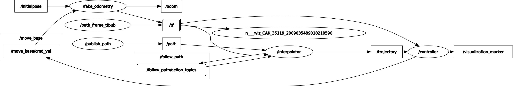

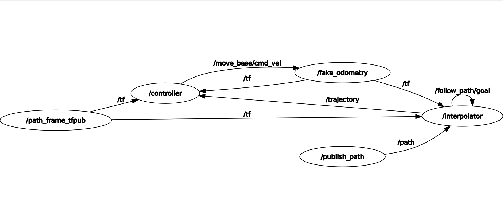

在编译完成项目后，启动launch文件后会启动rviz的界面，同时运行rosrun的命令启动图形化调参界面进行调参。

## PID代码实现

在控制器中实现PID代码，目前代码中实现了误差计算、使用二阶低通滤波器过滤误差信号的高频噪声、以及对误差积分项和差分项的更新。现在只要将配置中读取的参数与对应的项相乘相加，同时依据配置添加前馈控制项，最后对输出进行限幅，防止信号过大导致系统不稳定。实现代码如下：

```cpp
// 计算纵向PID控制
  if (feedback_long_enabled)
  {
    proportional_long = Kp_long * filtered_error_long.at(0);
    integral_long = Ki_long * error_integral_long;
    derivative_long = Kd_long * filtered_error_deriv_long.at(0);
    control_effort_long = proportional_long + integral_long + derivative_long;
  }
  if (feedforward_long_enabled)
  {
    control_effort_long += feedforward_long;
  }

  // 计算横向PID控制
  if (feedback_lat_enabled)
  {
    proportional_lat = Kp_lat * filtered_error_lat.at(0);
    integral_lat = Ki_lat * error_integral_lat;
    derivative_lat = Kd_lat * filtered_error_deriv_lat.at(0);
    control_effort_lat = proportional_lat + integral_lat + derivative_lat;
  }
  if (feedforward_lat_enabled)
  {
    control_effort_lat += feedforward_lat;
  }

  // 计算角度PID控制
  if (feedback_ang_enabled)
  {
    proportional_ang = Kp_ang * filtered_error_ang.at(0);
    integral_ang = Ki_ang * error_integral_ang;
    derivative_ang = Kd_ang * filtered_error_deriv_ang.at(0);
    control_effort_ang = proportional_ang + integral_ang + derivative_ang;
  }
  if (feedforward_ang_enabled)
  {
    control_effort_ang += feedforward_ang;
  }

  // 应用控制输出限制
  if (control_effort_long > upper_limit)
    control_effort_long = upper_limit;
  if (control_effort_long < lower_limit)
    control_effort_long = lower_limit;
  if (control_effort_lat > upper_limit)
    control_effort_lat = upper_limit;
  if (control_effort_lat < lower_limit)
    control_effort_lat = lower_limit;
  if (control_effort_ang > ang_upper_limit)
    control_effort_ang = ang_upper_limit;
  if (control_effort_ang < ang_lower_limit)
    control_effort_ang = ang_lower_limit;
```

## PID调参

PID由三项组成，比例向是误差直接乘以比例系数组成。这是系统直接响应误差的项，当比例系数大时，系统对误差的响应快，比例系数小时，系统对误差的响应慢。

$$
u_p(t) = K_p e(t)
$$

微分项是误差的微分乘以微分系数组成。它可以预测误差的变化趋势，相当于综合了未来的信息。当偏差开始出现变化时，微分项就能提前产生控制作用，从而抑制偏差的进一步增大。但是，微分项对噪声比较敏感。如果测量信号中存在噪声，微分项会对噪声的高频成分产生较大的放大作用，从而影响控制效果。

$$
u_d(t) = K_d \frac{de(t)}{dt}
$$

积分项是误差的积分乘以积分系数组成。它综合了误差的历史信息，积分项能够对偏差在时间上的积累进行补偿。随着时间的推移，即使偏差很小，积分作用也会不断累积，从而产生足够的控制作用来消除稳态误差。不过，积分项可能会导致系统超调增加。因为积分作用的累积效应，当偏差消除后，积分环节可能还会产生较大的控制作用，使被控量超过设定值。

$$
u_i(t) = K_i \int_{0}^{t} e(\tau) d\tau
$$

在调参界面中的l表示控制点位于机器人前方0.5单位距离，适用于前轴横向控制。也就是说控制点与机器人保持一段距离，这规定了拐弯特性，在拐角处不可能会完美贴合绿色路径。

首先将微分系数和积分系数置0，先调节比例系数Kp，发现全部设置为最高值时，效果如下：

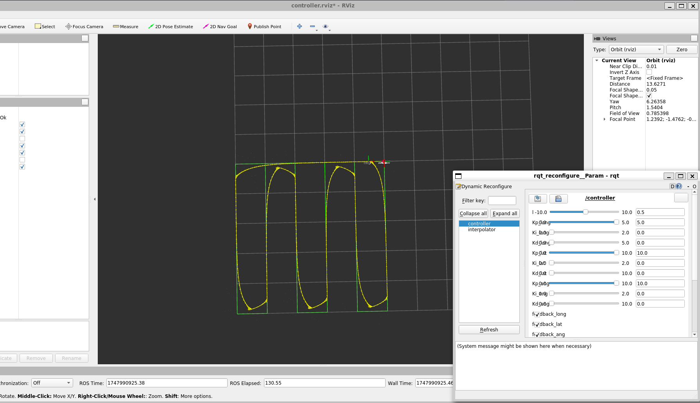

全部设为中间值，结果如下，和上面的结果基本没什么区别：

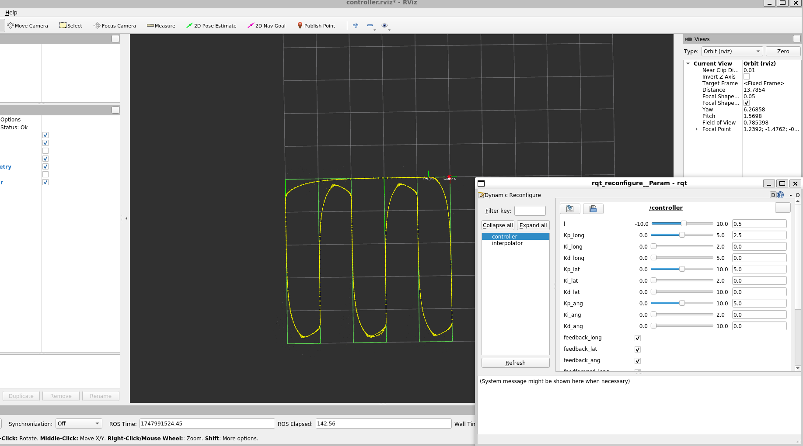

两者都是在拐角处没有很好的贴合路径，分析原因，是因为系统响应过快，拐的太“快”了。所以我尝试降低角度的Kp系数值，尽量让拐角处更加贴合：

角度的Kp为1.5时：

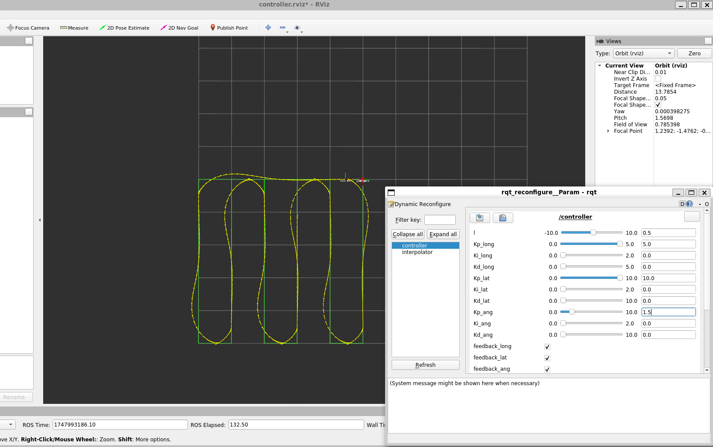

角度Kp为2.5时：

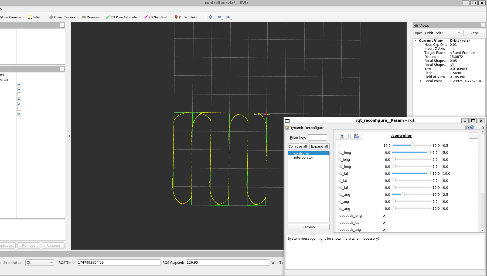

可以发现，当角度Kp逐渐增大，响应越快，其拐弯速度越快，拐的弯越小，越容易更早转入直道，但是拐弯过快会导致拐弯处与原路径拟合不充分。在权衡之下，取角度Kp为2.5最合适。

在之前的Kp基础上调Kd，由于在转弯初贴合还是不够好，所以我觉得要首要调节角度的Kd，但是经过调节我发现，当Kd逐渐增大时，转弯半径也变得越大，结果如下图：

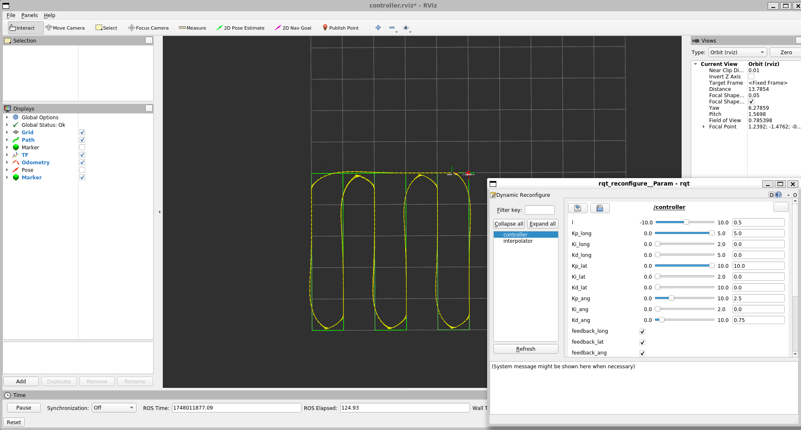

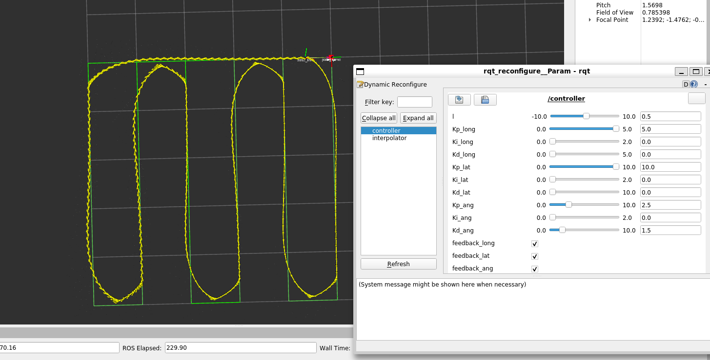

分析原因，由于微分项是用来减小超调量，提高系统稳定性的，可是之前的系统并没有超调，所以增加Kd没有收益，并且随着Kd的增加，会注意到路径会变得越来越“抖”，这是因为微分项比重上升导致系统对误差变化率变得敏感，噪声的影响被放大，系统不稳定，反而加重了输出振荡和超调的现象。因此保持角度Kd为0。

尝试改变long和lat项的微分项，逐步增加，效果并没有影响，分析是因为之前通过Kp项调的已经很好了，也没有超调，再调整Kd有益影响不大了：

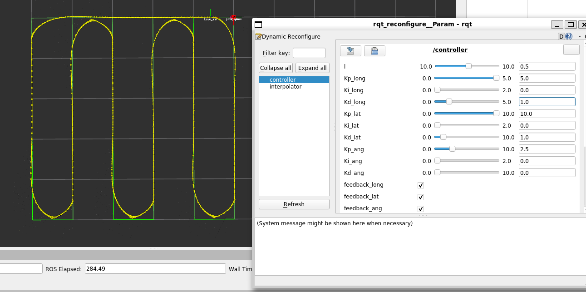

继续增加微分项，系统变得不稳定：

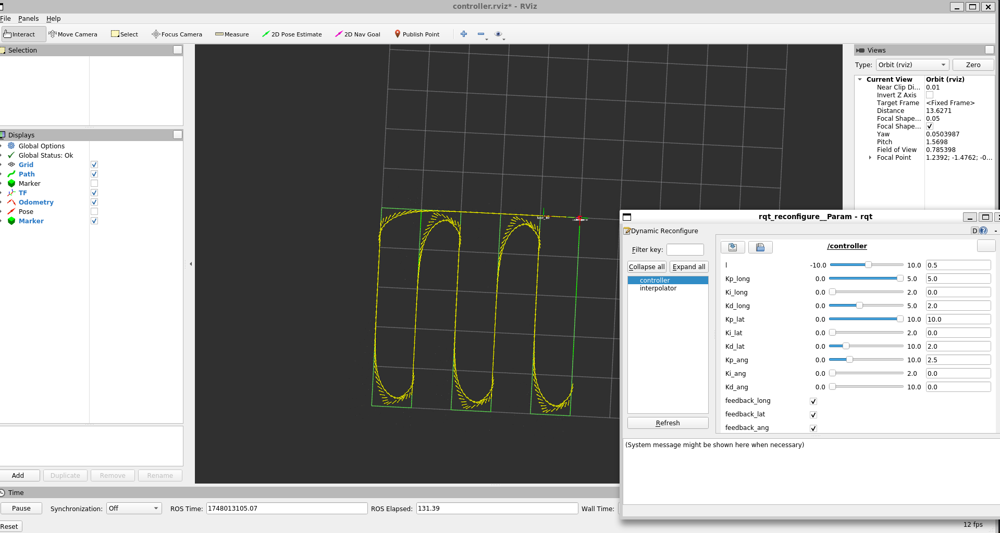

尝试调整Ki，对long和lat方向的积分系数设置为0.1:

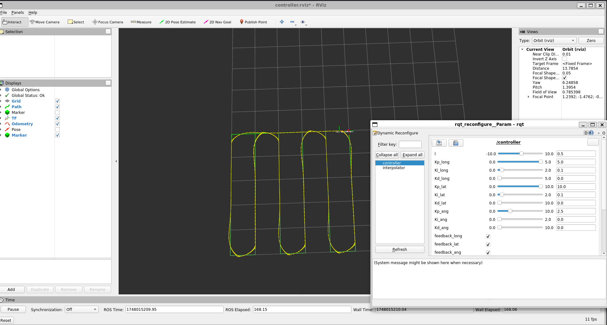

继续增加，效果如下（中途那一段是因为因为l的存在，导致初调时Ki会很大，使得小车画圈乱走）：

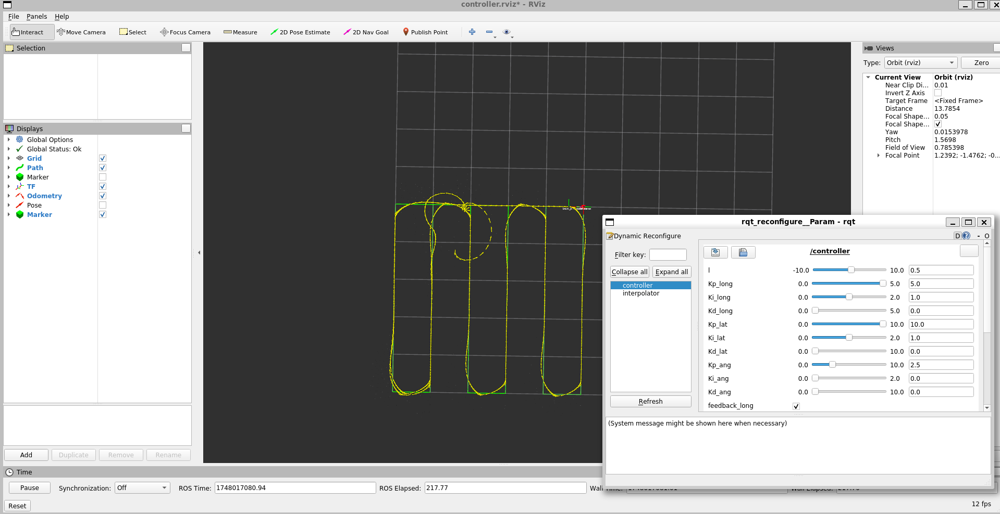

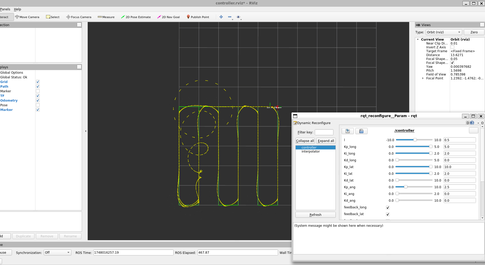

对比之前的结果，加入Ki后，调整long和lat的Kp一致后结果如下：

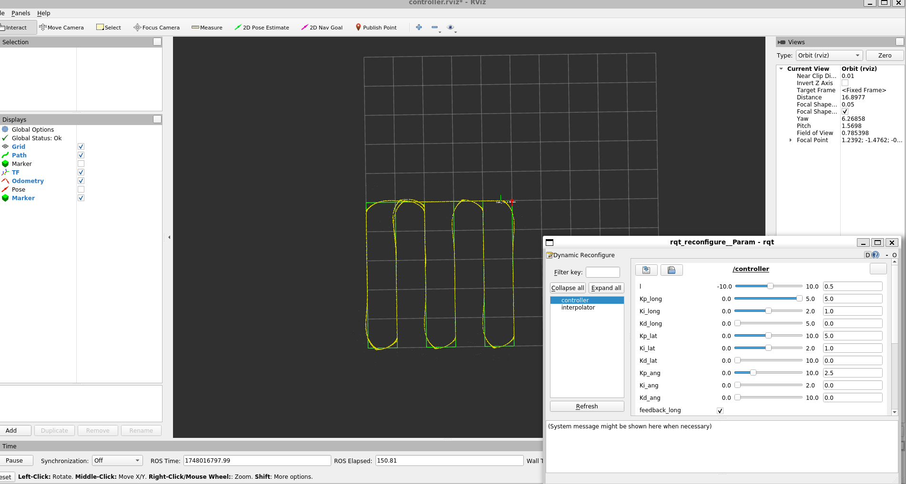

接下来单独调整角度Ki，加入角度的积分项后，结果如下：

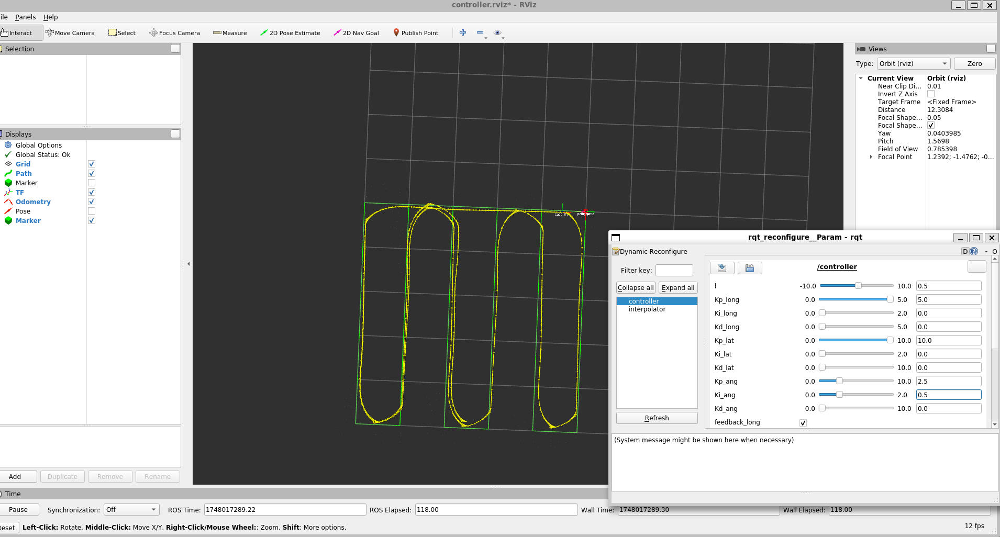

可以看到其与目标路径有明显的偏差，推测这是因为积分项使得系统对误差响应变慢导致的（积分项不像微分项那样可以瞬变，它综合了历史信息，所以具有滞后性），故角度的积分项保持为0最好，下图更能佐证这一观点：

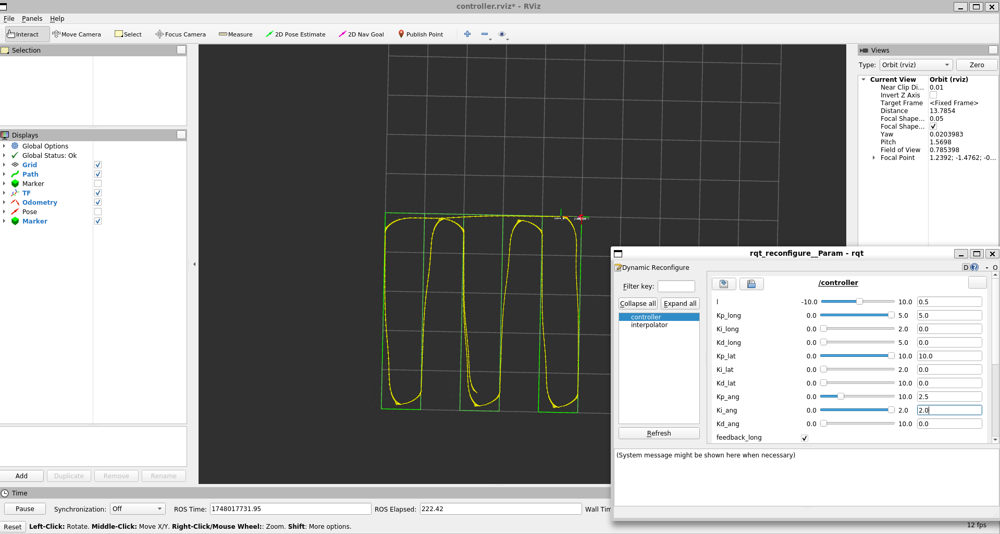

经过上述调整，分析，我感觉加入long和lat方向的积分项后使得结果更加平滑，分析原因，我观察到加入积分项后，机器人和控制点的距离变近了，这是缘于由于l的存在，long方向存在初始的误差，而积分项的作用之一就是消除这种稳态误差，这使得机器人在转弯处变得更加丝滑。但是我感觉这个l表示机器人和控制点之间的刚体距离（如果这个实验的目的是把l当做稳态误差，然后实验目的是尝试消除这个稳态误差的话当我没说），靠的更近反而是不正常的。单独调long方位的结果如下：

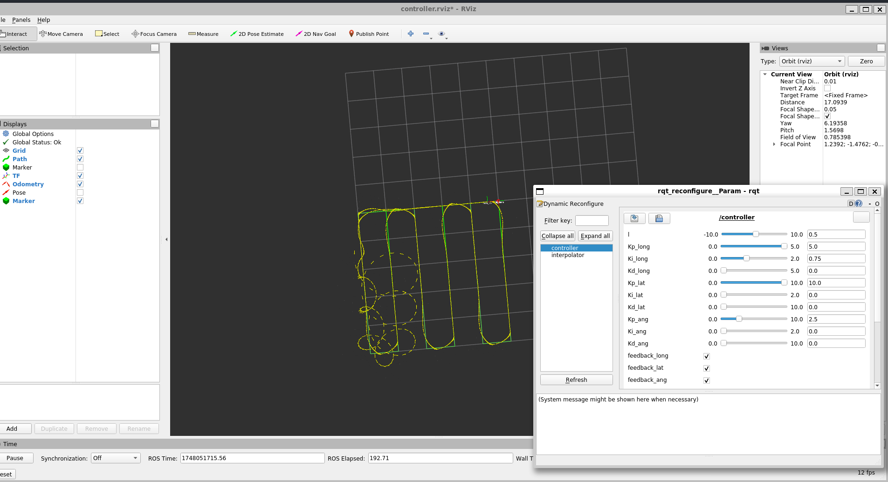

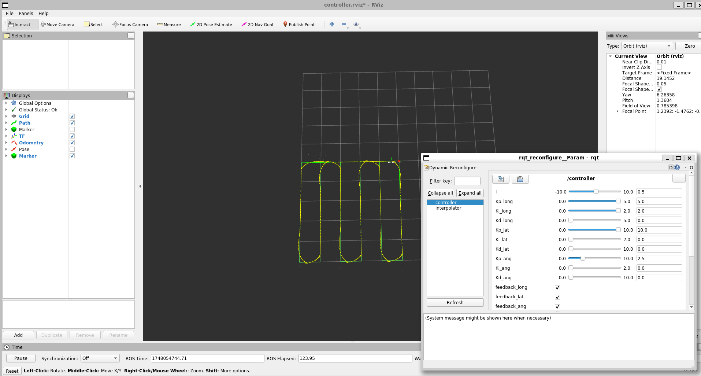

可以看到，拐弯处相比之前，拐弯会更加柔和，这是控制点和机器人之间距离由于long的积分项尝试消除稳态误差，机器人和控制点距离变近导致的。

单独调整lat的积分项结果如下，可以看到与之前的效果没多大差别，因为lat方向没有固定的误差，累积的那点误差对整个路径规划没有太大影响：

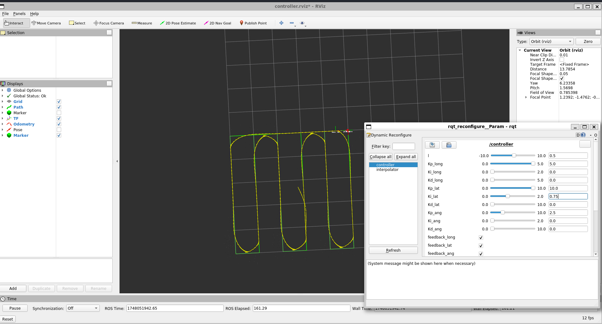

综上分析lat方向的微分项的影响，发现其主要影响体现在拐弯的时刻，不引入lat的积分项和微分项时，在拐弯处，lat的速度是匀速的，拐弯点在中间。当引入微分项时，在控制点拐弯后，lat的误差微分增大，机器人在lat方向的速度更大，机器人会更及时的跟随控制点，当控制点完成拐弯，进入直道，误差微分变小，对机器人在lat方向上的速度起抑制作用，使其快速转向。由于在lat方向的速度是从大到小，会导致拐弯点更偏“左”，从而更加贴合目标路径。

综上，我得到了如下信息：角度的比例项在过大时会出现转弯过早的现象，过小时会出现转弯过大的现象，需要慎重调节。为了消除l带来的稳态误差，我需要引入long的积分项。在拐弯处如果不引入lat的微分项，拐弯点会在中间，当引入lat的微分项，由于速度受到微分项影响导致拐点改变，更加贴近目标路径。

综上，以下PID参数下我认为表现是比较好的：

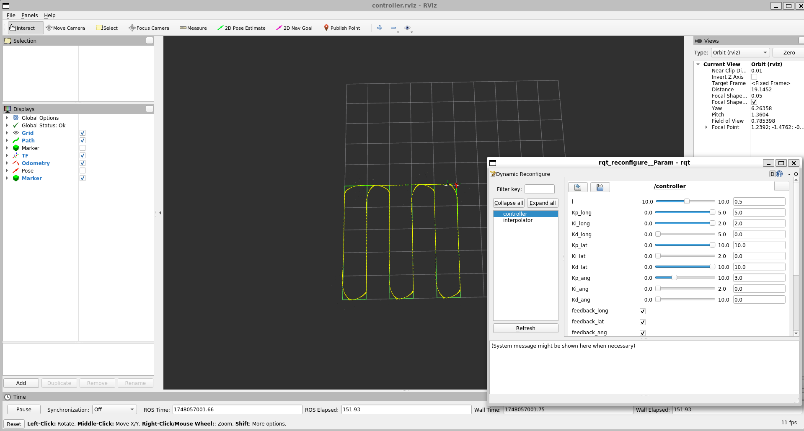

我将l设置为0，此时机器人和控制点之间的距离就会缩小为0，当我再用上面调好的Kp参数进行测试，结果如下：

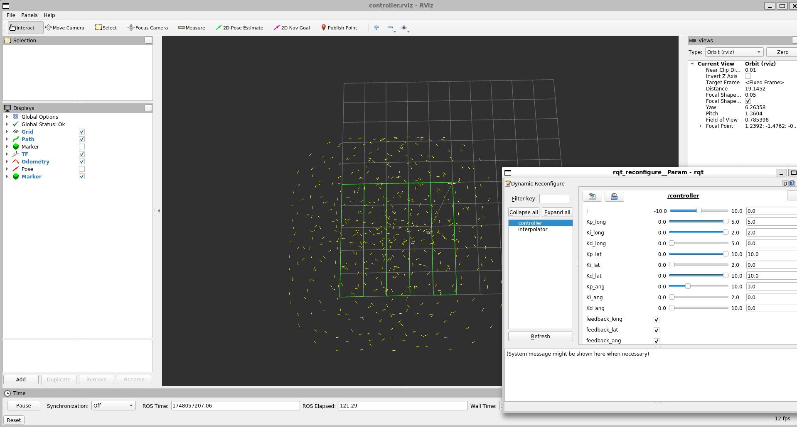

可以看到乱成一锅粥，这是自然的，此时没有long方向的稳态误差了，所以long的积分项不应该按照从前的设置了，与此同时由于在拐弯时没有滞后性，lat的微分项设置也不合适了。这说明不同的场景条件下，PID参数并不是通用的，需要依据实际场景进行调参。

## 总结

通过这次实验，我回顾了PID的基本原理，并且深深体会调参的“痛苦”。通过这次调参，我深刻体会到PID中每一项的作用，并且从实际问题出发，结合每一项的特性加以分析，合理进行调参。通过这次实验，我对PID的原理更加深刻，增加了PID调参的经验，受益匪浅。
