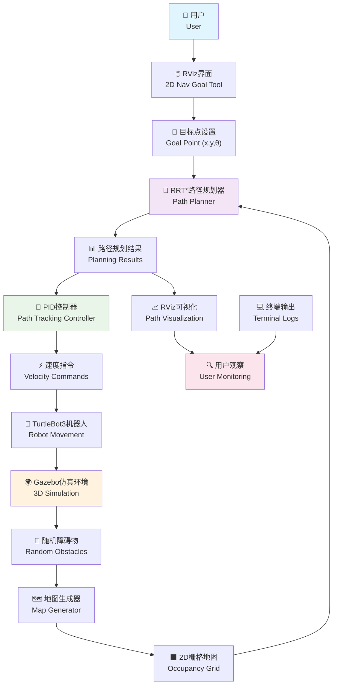
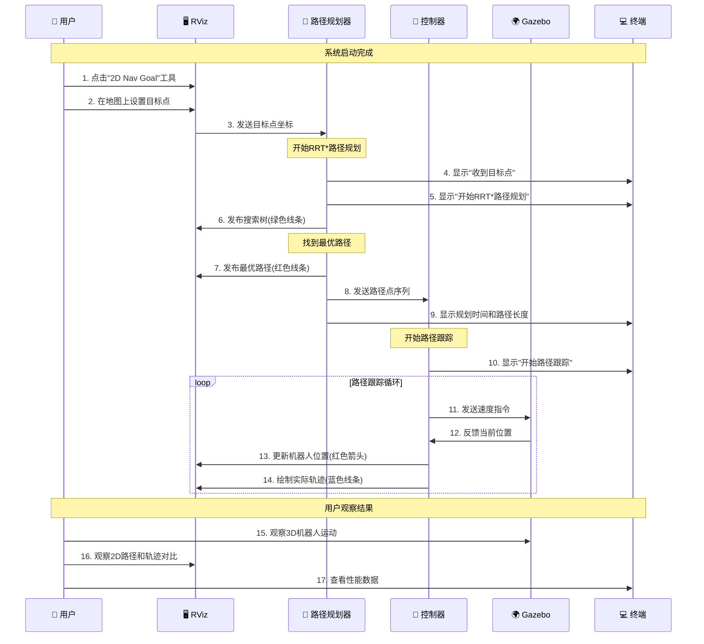

# 系统架构与流程图

## 1. 系统整体架构图



## 2. 控制流程时序图



## 如何使用这些图表

### 方法1：在线查看（最简单）
1. 访问 https://mermaid.live/
2. 复制上面的代码（包括 ```mermaid 和 ``` ）
3. 粘贴到编辑器中即可看到图表

### 方法2：VS Code查看
1. 安装"Mermaid Preview"插件
2. 创建.md文件，粘贴上面的代码
3. 右键选择"Open Preview"

### 方法3：导出图片
1. 在 https://mermaid.live/ 中编辑
2. 点击"Actions" -> "Download PNG/SVG"
3. 保存为图片文件

### 方法4：集成到文档
- 可以直接复制到任何支持Mermaid的Markdown文档中
- GitHub、GitLab等平台会自动渲染

## 图表说明

### 架构图说明：
- 展示了整个系统的数据流和组件关系
- 不同颜色代表不同类型的组件
- 箭头表示数据流向

### 时序图说明：
- 展示了用户操作到机器人运动的完整流程
- 按时间顺序显示各组件间的交互
- 清楚地展示了系统的工作时序 