# Assignment2

**学号：22320021	姓名：陈安康**

## 模型实现

### 理论

#### softmax

softmax函数主要用于分类问题中，它的公式如下：

$$
\text{Softmax}(x)_i = \frac{e^{x_i}}{\sum_{j=1}^{n} e^{x_j}}
$$


其中X是输入的标签值，它将输入的标签值归一化成[0,1]之间，并且所有元素的和为1，这可以看做是属于某一类别的概率。且Softmax函数是可微分的，这意味着可以使用梯度下降等优化算法来训练模型，计算损失函数（如交叉熵损失）关于模型参数的梯度。softmax函数可以使正样本（正数）的结果趋近于 1，使负样本（负数）的结果趋近于 0；且样本的绝对值越大，两极化越明显。


#### MLP

在复杂场景下，单一的输入输出层结构已经无法解决问题。这时我们在输入输出层之间添加隐藏层，以增加模型复杂度。这样就创建了多层感知机模型（MLP）。

在MLP中，单看每一个神经元的行为，它们接收上一层神经元的加权输入，经过激活函数激活后，传递给下一层的神经元，在多层结构下，庞大的神经元数目使得模型变得复杂，有益于解决复杂问题。

参数优化上，采用的是神经网络常用的反向传播算法(BP算法)。此算法建立在梯度下降算法的基础之上，有前向传播与反向传播两阶段。依据梯度下降算法的理论，我们优化的目标是最小化损失函数值。
	假设某一中隐藏层的输入为x，权重为w，输出为z，最终误差为loss，激活函数为f(x)则会有以下关系:

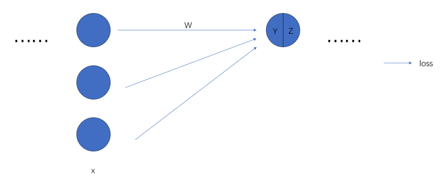

$$
{array}{c}
z = f(y), \quad y = \sum_{i=1}^{n} w_{i} \cdot x_{i} + b
$$

$$
\frac{\partial \text{loss}}{\partial w_{j}} = \frac{\partial \text{loss}}{\partial z} \cdot \frac{\partial z}{\partial y} \cdot \frac{\partial y}{\partial w_{j}}
$$


由此我们只要知道各个偏函数即可。在前向传播过程中，后两个偏导数可以随着数据在网络中的前向传递算出来，对于loss对于z的偏导数，由于这只是其中一个隐藏层，无法直接算出loss对z的偏导数，所以通过算出最终的损失值，接着反向推导运用链式法则逐步求出loss对z偏导，从而得到loss对某一权重的梯度，接着便可以像梯度下降法一样优化参数。

在多层感知机模型中，层数以及每一层的神经元数量是重要优化项，它们极大地影响了模型的性能，一般来说，层数越多，神经元数量越大，模型就会越复杂，更易于解决复杂问题，但资源开销更大。

#### CNN

卷积神经网络通过对图像通过卷积操作进行特征提取、激活、特征压缩等一系列操作来实现学习，优化网络中的参数权重，进而完成分类等复杂任务。
在结构上，卷积神经网络包括输入层、卷积层、激活层、池化层和全连接层。其中卷积层、激活层、池化层分别用来进行卷积操作提取特征、输入激活函数进行激活来引入非线性、压缩特征以缩小数据量。全连接层则是将多维的数据拉伸成一维向量从而进行全连接，输出结果。卷积层、激活层、池化层不断循环堆叠，对数据进行不断的提取、激活、压缩操作，以逐渐提取更高级别的特征，进而得到结果。

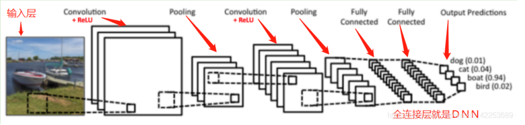

对于卷积层，通过规定好的卷积核依据规定好的步长在图像上一边移动，一边计算区域得分，从而得到一个代表图像中每一部分的得分的矩阵。此矩阵通过激活函数进行激活，引入非线性部分，进而使网络能够学习复杂的特征。接着这个矩阵通过池化层来减小特征图的大小来减少计算复杂性。它通过选择池化窗口内的最大值或平均值来实现。这有助于提取最重要的特征。
最后经过不断地堆叠卷积层、激活层、池化层，提取更高级别的特征，然后将这些特征拉伸成一维向量，通过全连接层将提取的特征映射转化为网络的最终输出。

#### SGD算法

SGD的核心思想是在每次迭代中随机选择一个样本（或一小批样本）来估计梯度，而不是使用整个数据集。这样的优点是计算效率高，尤其是当数据集很大时。SGD也能够逃离局部最小值，因为随机性引入了一定的噪声，有助于模型探索更多的参数空间

$$
θ_{t+1}

 =θ_t

 −η∇f_i(θ_t)
$$

其中θ表示待更新参数，η表示学习率，$∇f_i(θ_t)$表示针对第 **i** 个数据点或数据批次的损失函数。

#### SGD Momentum算法

在SGD算法的基础上，引入动量来加速SGD的收敛并减少震荡。动量（Momentum）是一种模拟物理中物体运动惯性的概念，用于优化算法中以加速梯度下降过程。它通过累加历史梯度来实现，使得更新方向不仅受当前梯度的影响，还受到之前梯度的影响，参数更新公式修改如下：

$$

  
v 
_t

 =βv 
_{t−1}

 +(1−β)∇ 
_{W_t}l

 

$$

$$
W 
_{t+1}

 =W 
_t

 −ηv 
_t
$$

其中v代表动量，β是动量系数，为超参数，W为待更新参数，$∇_{W_t}l$是当前梯度。SGD Momentum通过引入动量项，有效地结合了历史梯度信息，使得优化过程更加平滑，加速了收敛速度，并减少了陷入局部最小值的风险。

#### Adam算法

Adam算法相当于一个"大杂烩"，它结合了动量法（Momentum）和RMSProp的思想，通过计算梯度的一阶矩估计（均值）和二阶矩估计（未中心化的方差）来调整每个参数的学习率，从而实现更高效的网络训练

$$
m_t

 =β_1

 m _{t−1}

 +(1−β_1

 )g _t

$$

$m_t$ 是第 t 次迭代的一阶矩估计，$g_t$ 是第 t**t** 次迭代的梯度，$β_1$是一阶矩估计的指数衰减率

$$
v 
_t

 =β 
_2

 v 
{_t−1}

 +(1−β _2

 )g _t^2

$$

$v_t$ 是第 t 次迭代的二阶矩估计，$β_2$是二阶矩估计的指数衰减率

参数更新:

$$
\theta_{t+1} = \theta_t - \frac{\eta}{\sqrt{\hat{v}_t} + \epsilon} \hat{m}_t

$$

其中$\epsilon$是一个很小的常数，用于数值稳定性。

### 代码实现

#### softmax

实现代码如下：

```python
import torch
import torch.nn as nn


# 定义线性分类器
class LinearClassifier(nn.Module):
    def __init__(self, input_dim, num_classes):
        super(LinearClassifier, self).__init__()
        self.linear = nn.Linear(input_dim, num_classes)
  
    def forward(self, x):
        return self.linear(x)
```

模型接受输入维度和输出维度两个参数。注意的是，分类器内部并没有定义softmax函数，因为pytorch中，模型和损失函数，优化方法是彼此独立的，而pytorch中的损失函数我统一采用的是交叉熵损失函数CrossEntropyLoss()，在pytorch中这个函数会自动对输入数据进行softmax操作，因此在训练过程中不需要softmax操作，我将softmax操作统一放在训练过程中，在类中并没有定义。

#### MLP

实现代码如下：

```python
import torch
import torch.nn as nn


class MLP(nn.Module):
    def __init__(self, input_dim, hidden_dim_list, output_dim):
        super(MLP, self).__init__()
        self.fc_list = nn.ModuleList()
        self.fc_list.append(nn.Linear(input_dim, hidden_dim_list[0]))
        for i in range(len(hidden_dim_list) - 1):
            self.fc_list.append(nn.Linear(hidden_dim_list[i], hidden_dim_list[i + 1]))  # 第一层，全连接层
        self.fc_list.append(nn.Linear(hidden_dim_list[-1], output_dim))
        self.relu = nn.ReLU()  # 激活函数
        # self.softmax = nn.Softmax(dim=1)  # Softmax层，得到每个类的概率分布

    def forward(self, x):
        for i in range(len(self.fc_list) - 1):
            x = self.fc_list[i](x)
            x = self.relu(x)
        x = self.fc_list[-1](x)
```

模型接受输入，输出，中间隐藏层维度作为参数。激活函数选择的是ReLU函数。

#### CNN

实现代码如下：

```python
import torch
import torch.nn as nn
import torch.nn.functional as F

# 定义 CNN 模型
class CNN(nn.Module):
    # channels 比其他的多一个数据
    def __init__(self, channels, kernel_sizes, strides, paddings, pools):
        super(CNN, self).__init__()
        self.convs = nn.ModuleList()
        self.pools = nn.ModuleList()
        H_in, W_in = 32, 32
        for i in range(len(channels) - 1):
            self.convs.append(nn.Conv2d(channels[i], channels[i + 1], kernel_size=kernel_sizes[i], padding=paddings[i], stride=strides[i]))
            self.pools.append(nn.MaxPool2d(kernel_size = pools[i]))
            if isinstance(kernel_sizes[i], tuple):
                H_in = (H_in + 2 * paddings[i] - kernel_sizes[i][0]) // strides[i] + 1  # 计算高度
                W_in = (W_in + 2 * paddings[i] - kernel_sizes[i][1]) // strides[i] + 1
            else:
                H_in = (H_in + 2 * paddings[i] - kernel_sizes[i]) // strides[i] + 1  # 计算高度
                W_in = (W_in + 2 * paddings[i] - kernel_sizes[i]) // strides[i] + 1
            if isinstance(pools[i], tuple):
                H_in = (H_in - pools[i][0]) // pools[i][0] + 1  # 计算高度
                W_in = (W_in - pools[i][1]) // pools[i][1] + 1
            else:
                H_in = (H_in - pools[i]) // pools[i] + 1  # 计算高度
                W_in = (W_in - pools[i]) // pools[i] + 1
        self.H = H_in
        self.W = W_in
        self.dim = self.W * self.H * channels[-1]
        # 全连接层
        self.fc1 = nn.Linear(self.dim, 84)  # 输入256 * 4 * 4是池化后的特征图大小
        self.fc2 = nn.Linear(84, 10)  # 输出10个类别

    def forward(self, x):
        # 卷积层 + 激活函数 + 池化
        for i in range(len(self.convs)):
            x = self.pools[i](F.relu(self.convs[i](x)))
  
        # 扁平化
        x = x.view(-1, self.dim)  # 扁平化为全连接层输入
  
        # 全连接层
        x = F.relu(self.fc1(x))
        x = self.fc2(x)
  
        return x
```

模型接受卷积层的输入输出通道数（这里因为通道是连着的，且池化操作不改变通道数，因此中间的输入输出只需要一个数就可以表示），每一个卷积层的核的尺寸，每一个卷积层的步长，填充，池化层中核的大小作为参数。其中默认每个卷积层后面紧跟着一个池化层，若池化层与卷积层不匹配（比如最后一个卷积层不需要池化操作）那么可以将卷积层对应的核大小设置为1，这样相当于什么也不做。激活层选择ReLU函数。模型中内置一个连接层和一个输出层，在与卷积（池化）连接的全连接层的输入维度在模型内自动计算给出计算公式如下：

$$
W_{\text{out}} = \left\lfloor \frac{W_{\text{in}} - K_W + 2P}{S_W} \right\rfloor + 1
$$

$$
H_{\text{out}} = \left\lfloor \frac{H_{\text{in}} - K_H + 2P}{S_H} \right\rfloor + 1
$$

其中$H_{\text{out}} W_{\text{out}}$是当前的图像高度，宽度，$H_{\text{in}} W_{\text{in}}$是上一层的高度，宽度，K是核的尺寸，P是填充大小，S为步长。通过不断迭代计算，最终得到全连接层的维度。

#### 原始数据处理、训练、测试、展示

原始数据处理、训练、测试、展示代码如下：

```python
import torch
import torch.nn as nn
import torch.optim as optim
from torch.utils.data import DataLoader, TensorDataset
import numpy as np
from model.softmax import LinearClassifier
import matplotlib.pyplot as plt
from model.MLP import MLP
from model.CNN import CNN
import time
import random
# 超参数
num_epochs = 100
batch_size = 512
lr = 0.001
print(torch.__version__)
print(torch.cuda.is_available())

# 数据加载函数
def load_data(dir):
    import pickle
    X_train = []
    Y_train = []
    for i in range(1, 6):
        with open(dir + r'/data_batch_' + str(i), 'rb') as fo:
            dict = pickle.load(fo, encoding='bytes')
        X_train.append(dict[b'data'])
        Y_train += dict[b'labels']
    X_train = np.concatenate(X_train, axis=0)

    with open(dir + r'/test_batch', 'rb') as fo:
        dict = pickle.load(fo, encoding='bytes')
    X_test = dict[b'data']
    Y_test = dict[b'labels']
    return X_train, Y_train, X_test, Y_test

# 加载数据
data_dir = r"C:\Users\86135\Desktop\python\机器学习与数据挖掘\CNN_MLP_softmax\data"  # 替换为你的CIFAR-10数据目录
X_train, Y_train, X_test, Y_test = load_data(data_dir)

# 转换为Tensor
X_train = torch.tensor(X_train, dtype=torch.float32)
Y_train = torch.tensor(Y_train, dtype=torch.long)
X_test = torch.tensor(X_test, dtype=torch.float32)
Y_test = torch.tensor(Y_test, dtype=torch.long)

# 数据归一化
X_train /= 255.0
X_test /= 255.0

# 构建 DataLoader
train_dataset = TensorDataset(X_train, Y_train)
test_dataset = TensorDataset(X_test, Y_test)
train_loader = DataLoader(train_dataset, batch_size=batch_size, shuffle=True)
test_loader = DataLoader(test_dataset, batch_size=batch_size, shuffle=False)

# # softmax
# input_dim = 32 * 32 * 3  # CIFAR-10 每个图片是32x32x3
# num_classes = 10
# model1 = LinearClassifier(input_dim, num_classes)

# criterion1 = nn.CrossEntropyLoss()
# optimizer1 = optim.SGD(model1.parameters(), lr=lr)


# model2 = LinearClassifier(input_dim, num_classes)

# criterion2 = nn.CrossEntropyLoss()
# optimizer2 = optim.SGD(model2.parameters(), lr=lr, momentum=0.9)


# model3 = LinearClassifier(input_dim, num_classes)

# criterion3 = nn.CrossEntropyLoss()
# optimizer3 = optim.Adam(model3.parameters(), lr=lr, betas=(0.9, 0.999))

# # # MLP
# # # 模型超参数
# input_dim = 32 * 32 * 3  # 每张图像的像素值总数
# # # 只是隐藏层的规模
# hidden_dim_list = [128]
# output_dim = 10  # CIFAR-10 有 10 个类别
# # # 初始化模型
# model1 = MLP(input_dim, hidden_dim_list, output_dim)

# criterion1 = nn.CrossEntropyLoss()
# optimizer2 = optim.SGD(model2.parameters(), lr=lr)

# CNN
# 包括开始的3层输入
channels = [3,6,16]
kernel_sizes = [5,5]
strides = [1,1]
paddings = [0,0]
pools = [2,2]
# 初始化模型
model1 = CNN(channels=channels, kernel_sizes=kernel_sizes, strides=strides, paddings=paddings, pools=pools)
model2 = CNN(channels=channels, kernel_sizes=kernel_sizes, strides=strides, paddings=paddings, pools=pools)
model3 = CNN(channels=channels, kernel_sizes=kernel_sizes, strides=strides, paddings=paddings, pools=pools)
criterion1 = nn.CrossEntropyLoss()
optimizer1 = optim.Adam(model1.parameters(), lr=lr)
optimizer2 = optim.SGD(model2.parameters(), lr=lr)
optimizer3 = optim.SGD(model3.parameters(), lr=lr,momentum=0.9)


# # # 将模型移到GPU（如果可用）
# device = torch.device("cuda" if torch.cuda.is_available() else "cpu")
# model.to(device)


# criterion = nn.CrossEntropyLoss()
# optimizer = optim.SGD(model.parameters(), lr=lr)


def train_test(model,criterion,optimizer):
    # 训练模型
    start_time = time.time()
    loss_train = []
    loss_test = []
    acc = []
    for epoch in range(num_epochs):
        model.train()
        running_loss = 0.0
        for images, labels in train_loader:
            images, labels = images, labels
            if isinstance(model, CNN):
                images = images.view(-1,3, 32, 32)
            # 前向传播
            outputs = model(images)
            loss = criterion(outputs, labels)

            # 反向传播和优化
            optimizer.zero_grad()
            loss.backward()
            optimizer.step()

            running_loss += loss.item()
        print(f"Epoch [{epoch+1}/{num_epochs}], Loss: {running_loss/len(train_loader):.4f}")
        loss_train.append(running_loss/len(train_loader))

        model.eval()
        correct = 0
        total = 0
        with torch.no_grad():
            running_loss = 0.0
            for images, labels in test_loader:
                images, labels = images, labels
                if isinstance(model, CNN):
                    images = images.view(-1,3, 32, 32)
                outputs = model(images)
                loss = criterion(outputs, labels)
                outputs = torch.softmax(outputs, dim=1)
                _, predicted = torch.max(outputs, 1)
                total += labels.size(0)
                correct += (predicted == labels).sum().item()
                running_loss += loss.item()
        print(f"Accuracy on test set: {100 * correct / total:.2f}%")
        acc.append(correct / total)
        loss_test.append(running_loss/len(test_loader))
    end_time = time.time()
    print(f"Training Time: {end_time - start_time} seconds")

    # draw
    label = ''
    model_ = ''
    optimizer_ = ''
    if isinstance(model, LinearClassifier):
        model_ = 'LinearClassifier'
    elif isinstance(model, MLP):
        model_ = 'MLP'
    else:
        model_ = 'CNN'

    if isinstance(optimizer,optim.SGD):
        if optimizer.param_groups[0].get('momentum', None) != 0:
            optimizer_ = 'SGD Momentum'
        else:
            optimizer_ = 'SGD'
    elif isinstance(optimizer,optim.Adam):
        optimizer_ = 'Adam'

    plt.figure(1)
    label = f'{model_}.{optimizer_}' 
    color1 = "#{:06x}".format(random.randint(0, 0xFFFFFF))
    plt.plot(range(num_epochs), loss_test, color=color1, label=f'test.{label}')
    color2 = "#{:06x}".format(random.randint(0, 0xFFFFFF))
    plt.plot(range(num_epochs), loss_train, color=color2, label=f'train.{label}')
    plt.title('Loss')  # 标题
    plt.xlabel('num_epochs')  # 横轴标签
    plt.ylabel('Loss')  # 纵轴标签
    # 显示图例
    plt.legend()
    plt.grid(True)


    plt.figure(2)
    color3 = "#{:06x}".format(random.randint(0, 0xFFFFFF))
    plt.plot(range(num_epochs), acc, color=color3, label=f'test.{label}')
    plt.title('Acc')  # 标题
    plt.xlabel('num_epochs')  # 横轴标签
    plt.ylabel('Acc')  # 纵轴标签
    # 显示图例
    plt.legend()
    plt.grid(True)


train_test(model1,criterion1,optimizer1)
train_test(model2,criterion1,optimizer2)
train_test(model3,criterion1,optimizer3)
plt.show()
```

模型采用交叉熵作为损失函数，mini-batch方法进行梯度下降。数据经过归一化为[0,1]的数据，处理后的大小为60000 x 3072，其中在训练与测试时都特定对CNN模型做了reshape操作。由于使用的交叉熵函数会自动对输入进行softmax操作，所以只需要在测试时对输出进行softmax操作即可（即使不加入这个操作也不会影响最终结果）。在每次训练后，都会在训练集上进行测试以方便验证结果。

## 性能分析

### softmax线性分类器

由于softmax线性分类模型仅有一层，接受的参数没有办法更改，因此尝试使用不同的优化算法，比较它们对性能的影响：

batch_size = 512，lr = 0.01，num_epochs = 100的运行结果：

采用SGD优化算法的Loss曲线和Acc曲线：

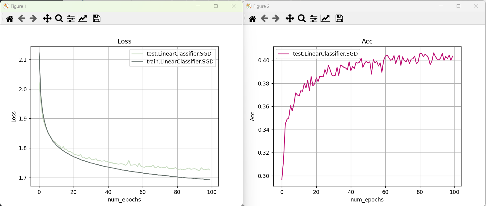

由上图可以观察到，测试集与训练集图像分开但差值并不大，且测试集也呈现缓缓下降趋势，读取最终的预测准确率为40.34%

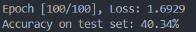

采用SGD Momentum算法（momentum = 0.9）的Loss曲线和Acc曲线：

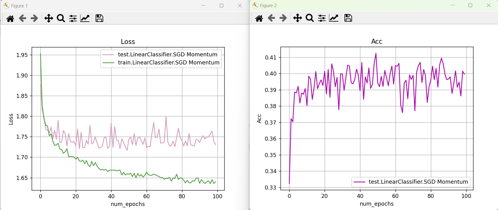

可以看见，采用SGD Momentum算法梯度下降很快，但训练集和测试集上的loss在迭代几次后就明显“分开”了，在大约20轮迭代后，测试集的loss不再下降，Acc曲线上预测准确率也在20轮之后不再有上升趋势。这是因为线性模型过于简单，泛化能力不强，出现了过拟合的情况。读取第20轮预测准确率为39.21%，最终准确率数值基本在39%-40%之间波动。

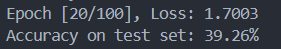

采用Adam算法的Loss曲线和Acc曲线，由于效果问题，这里把lr修改为0.001：

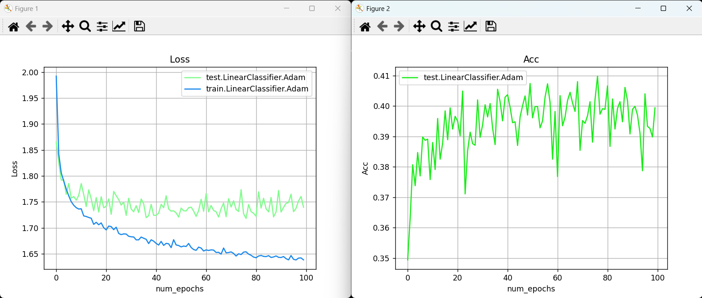

可以看见也是出现了分离，分离后继续迭代，在20轮之后，测试集的loss不再下降，而是上下波动，读取迭代20次时的准确率为39..66%，此后准确率基本在39%-40%之间波动。

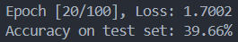

综上可知，由于线性分类器模型过于简单，泛化能力不强，在上述参数设置下在20轮之后出现过拟合现象，该模型能够达到的真实预测准确率在39%-40%左右。

### MLP

MLP的性能与层数以及每一层神经元的数量密切相关，在batch_size = 512，lr = 0.001，num_epochs = 100的设置，采用Adam算法。采用如下结构的模型(记为Model0)：

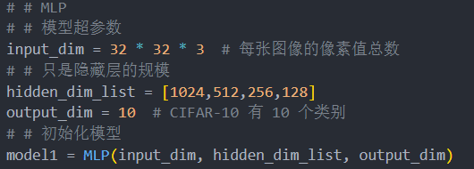

使用Adam优化算法运行结果如下：

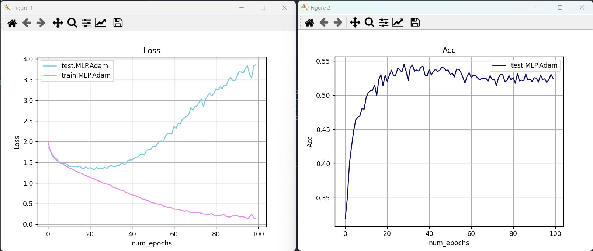

可以看见大约在迭代30轮之后，测试集loss不降反增，出现了过拟合现象，读取30轮的预测准确率为53.51%：

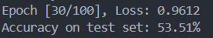

#### 网络层数对性能的影响探究

在Model0基础上，将模型设置的更加复杂，再添加多层结构，如下：

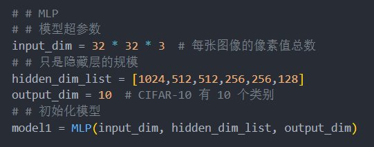

运行结果如下：

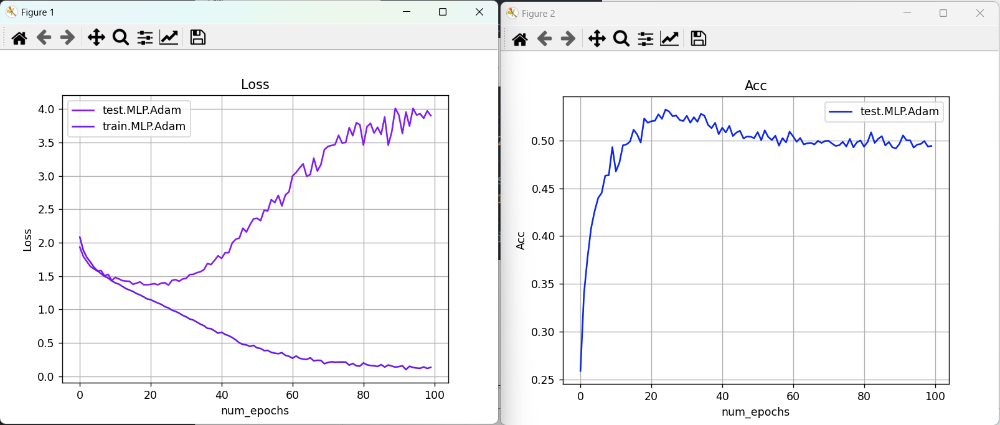

大约在25轮之后出现过拟合现象，且过拟合现象更加明显(对比Model0，此模型Loss上升更快)，第25轮的准确率为53.26%，性能没有变化

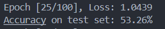

继续调整模型结构，使用较为简单MLP模型进行实验，只设置一层隐藏层，神经元数目设置为1024：

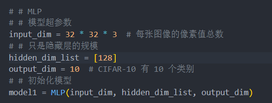

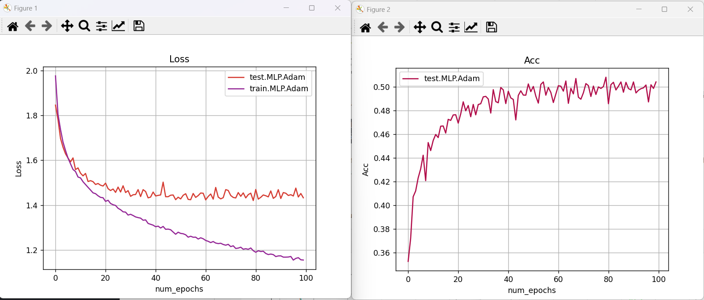

可以看见模型的性能差于Model0，准确率为50.41%，性能上不如Model0

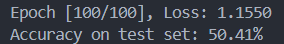

#### 神经元数目对性能的影响探究

在Model0的基础上，将神经元数量全部÷16：

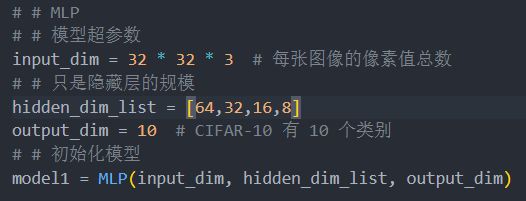

运行结果：

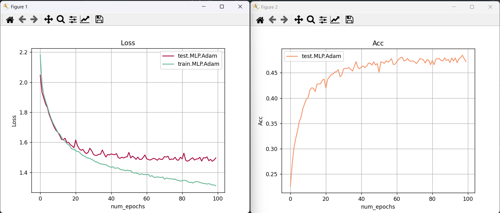

与Model0比较可知，此时模型还未能收敛，测试集Loss仍然有下降趋势，准确率为47.23%，此模型性能差于Model0：

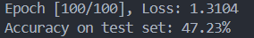

在Model0的基础上，将隐藏层的神经元数目全部X2：

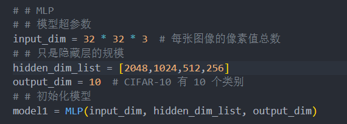

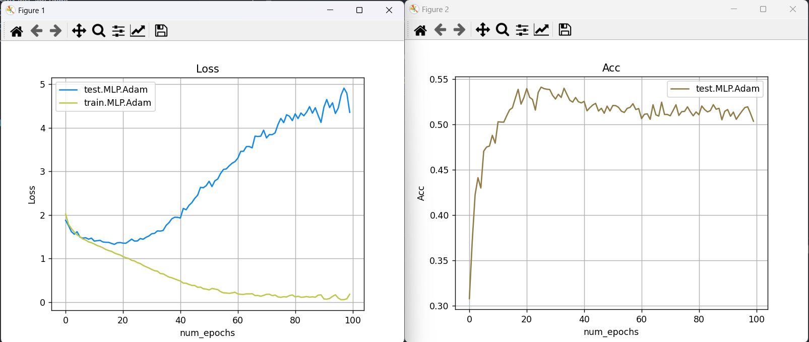

大约在20轮之后出现过拟合现象，读取第20轮准确率为：52.93%，对比Model0，会发现神经元数量过多时，模型的过拟合更加明显，且更加容易（迭代次数少），时间开销更大，但性能方面却没有提升

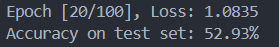

多次实验后发现，在MLP模型下，测试集预测准确率基本在53%左右。

又经过多次实验发现，层数以及神经元数量会显著影响MLP的性能，当层数与神经元数目过少时，合理增加层数与神经元数量会提升模型的性能，但过多的层数与神经元数量会导致模型过于复杂，也更容易过拟合，时间开销更大，但是在效果上并没有任何提升，此时会造成资源浪费，由此，在选择层数与神经元数量时，我们需要谨慎选择，保证性能提升的同时，不至于模型过于复杂导致资源浪费。

### CNN

LeNet模型结构如下，在实际过程中，我将LeNet中的平均池化修改为了最大池化，激活函数选择了ReLU而不是Sigmoid：

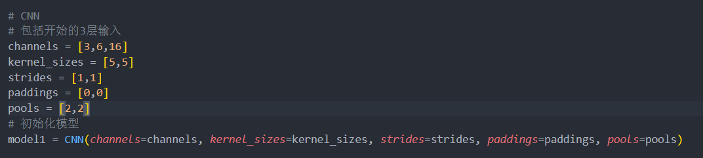

在采用Adam算法，batch_size = 512，lr = 0.001，num_epochs = 100设置下运行结果如下：

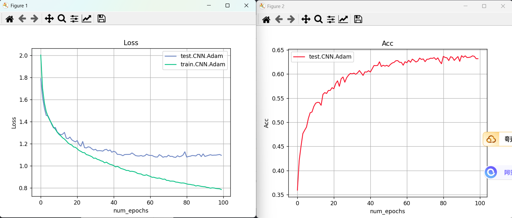

最终的预测准确率为63.17%：

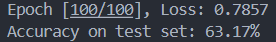

#### 滤波器对性能的影响探究

在LeNet基础上，将滤波器数量全部x2：

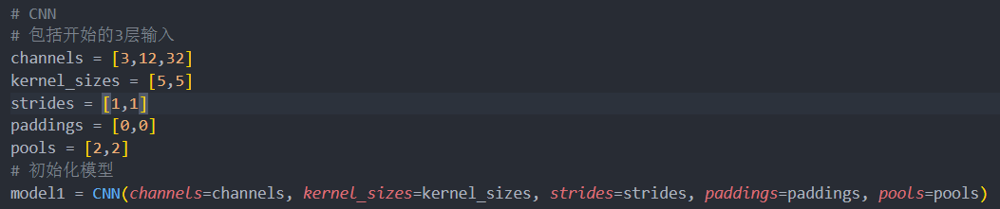

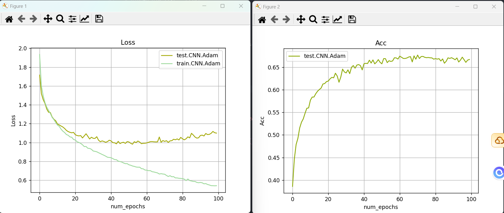

大概在70轮左右之后出现过拟合现象，读取70轮的准确率：66.77%

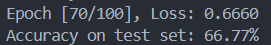

继续增加滤波器数量：

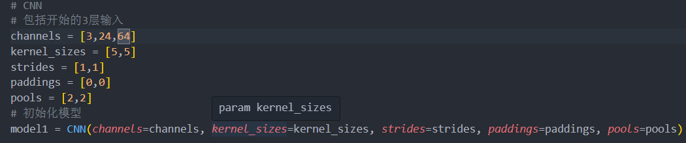

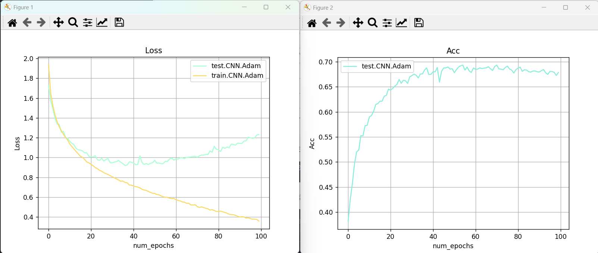

大概在50轮后出现过拟合现象，准确率68.62%：

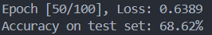

可以看见，增加滤波器确实能够提升性能，但当滤波器增加过多时，对性能的提升就会遇到瓶颈，同时出现过拟合现象。

#### Pooling对性能的影响探究

在LeNet模型基础上，修改pool滤波器为平均滤波器：

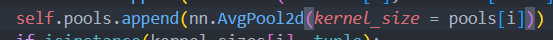

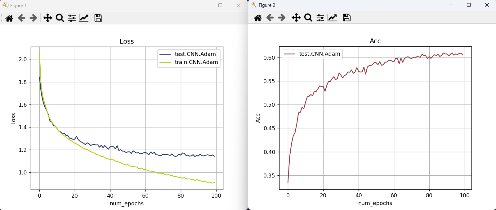

相比于最大池化，平均池化效果稍微差一点，Loss的下降速度也没有那么快，准确率为：60.58%

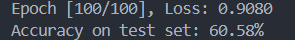

使用原先出现的模型如下，但平均池化进行运行：

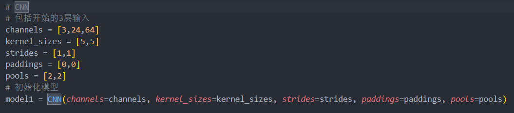

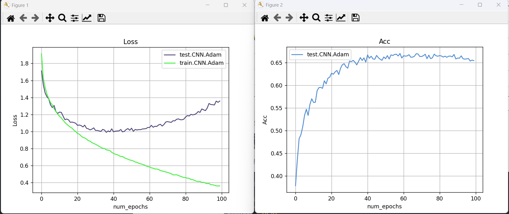

准确率为65.10%

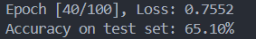

对比之前的采用最大池化的结果（68%左右），会发现平均池化的性能稍逊于最大池化，实际上最初的LeNet模型就是采用平均池化，最终被最大池化取代，这也是目前的CNN模型中普遍采用最大池化的原因。

#### 层数对性能的影响探究

在LeNet的基础上添加一层：

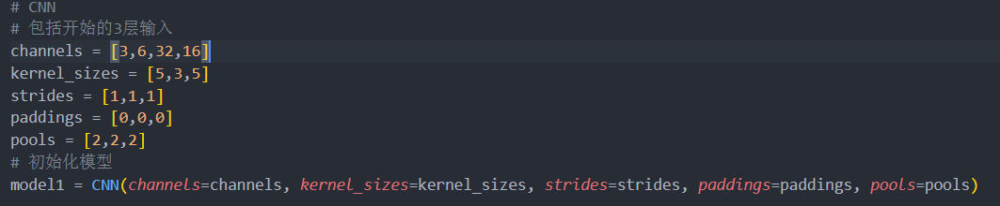

运行，结果如下：

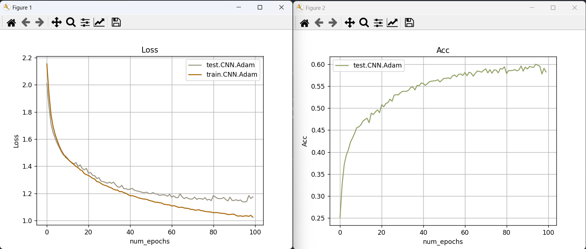

效果明显不如LeNet，因为测试集Loss曲线仍然呈现下降趋势，由此加大迭代次数到200次，继续实验：

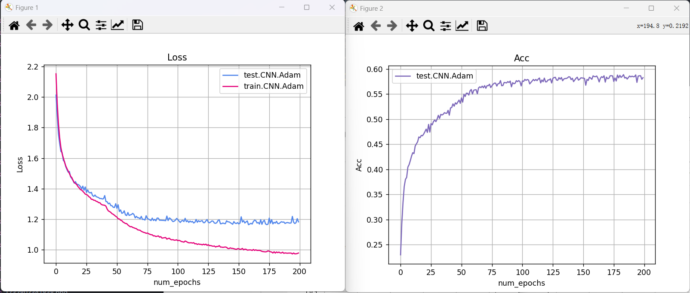

准确率为58.28%，对比LeNet模型，会发现性能不仅没有增强，反而有些下降！

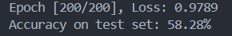

换用不同维度的卷积层进行测试

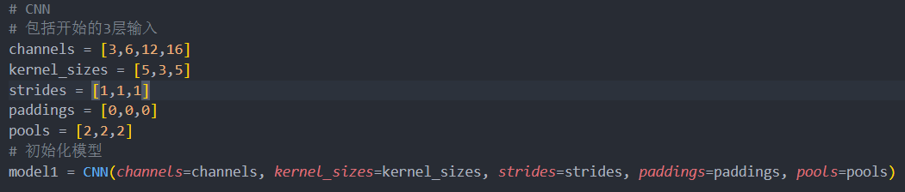

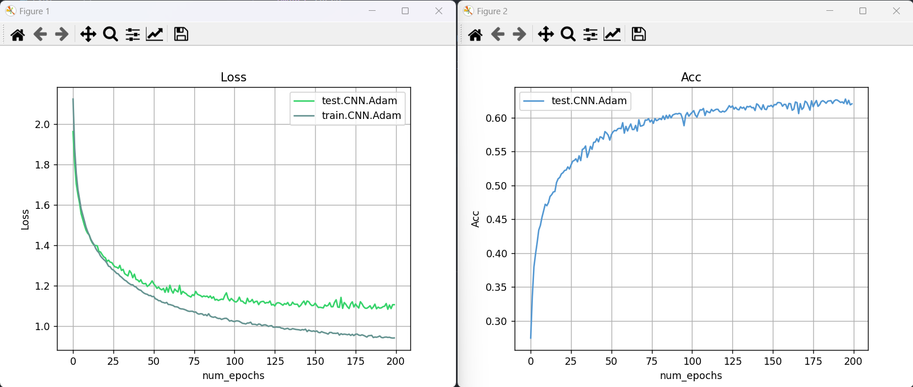

相比于LeNet，依旧是性能有所下降，准确率为62.05%

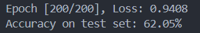

在LeNet的基础上删除一层：

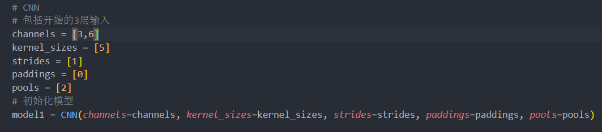

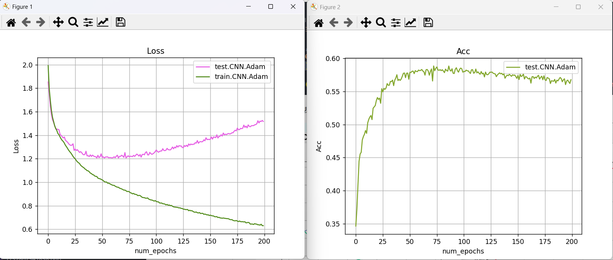

准确率仅有58%，与LeNet对比，可以发现性能不如LeNet。

经过上述对比可以看到，层数的多少与性能并不存在单一的正相关，层数过多和过少都会导致性能的下降，因此在对CNN的层数进行选择时，要对层数的设置进行合理选择。


### SGD、SGD Momentum、Adam算法比较

使用CNN的LeNet模型来进行测试，使用batch_size = 512，lr = 0.001，num_epochs = 100的设置，采用不同的优化算法运行结果如下：

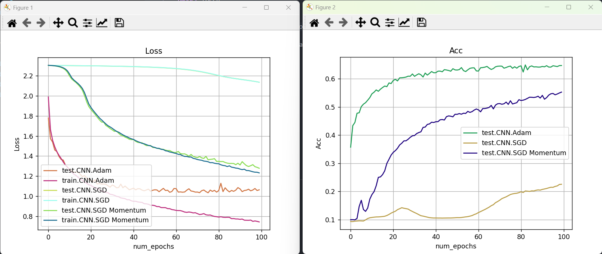

从图中可以明显看出来，在100轮迭代中，SGD算法的Loss曲线基本还没有开始下降，SGD Momentum算法下降，但没有完全收敛，Adam算法已经收敛（Loss已经不再下降）。在ACC图像中，由于训练速度的差异，在固定的迭代次数下，预测准确率显而易见的出现分层，Adam预测准确率最高，SGD Momentum次之，SGD最差。

通过比较可以看出在收敛速度上Adam > SGD Momentum > SGD。Adam的训练速度最快，SGD Momentum次之，而SGD远远落后于前两者。训练速度的差异反应在Acc上的结果是使用Adam算法的训练模型性能最好，SGD Momentum次之，SGD最差。


#### 三种模型性能对比

经过上述实验分析，模型的性能表现已经十分明显，为了更加直观，使用三种模型（MLP选用Model0，CNN选用LeNet）在batch_size = 512，lr = 0.001，num_epochs = 100，采用Adam优化算法的设置下进行测试：

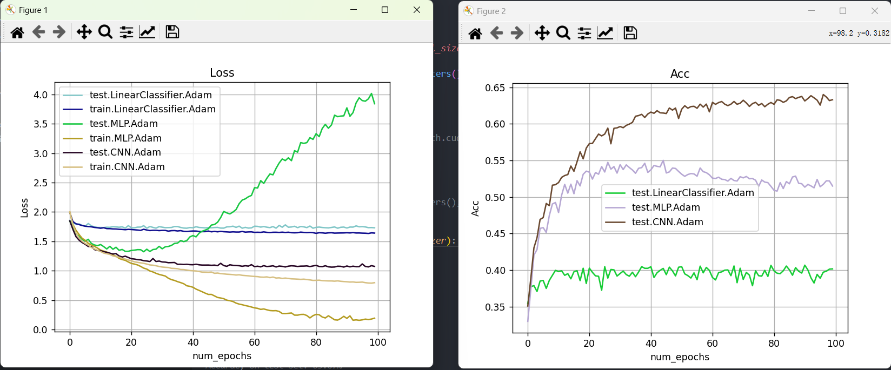

从图中可以十分明显的看出，在测试集上，CNN能够做到60%-65%的预测准确率，MLP预测准确率在50%-55%之间，线性分类器预测准确率只有40%左右。在运行时间上，CNN运行时间为211s，MLP运行时间为394s，线性分类器运行时间为52s。综合来看，CNN性能是最好的，MLP运行开销更大，但准确率不错，线性分类器运行时间虽然少，但准确率最低。这也反映出CNN在图像识别上的优势。

## 总结

经过上述实验，我构建了线性分类器、MLP、CNN的模型，并分别探讨了不同的因素对其性能的影响。对于MLP，合理增加网络层数与神经元数量可以提升性能，但过多的层数和神经元数目则会造成额外的开销，并且对性能提升无益。对于CNN，层数与滤波器的数量和MLP同理，而最大池化算法稍好于平均池化。

在不同的优化算法的比较中，而Adam算法明显优于SGD与SGD Momentum算法。在不同模型的性能比较中，对于图像识别，CNN的表现明显优于MLP与线性分类器，这展现了CNN在图像识别领域的优异性能。
