# Assignment3

学号：22320021  姓名：陈安康

## 算法原理

### K-means:

K-means 是一种常用的无监督聚类算法，其目标是将数据分成 **K** 个簇，使得每个簇内的数据点尽可能相似，而不同簇之间的数据点尽可能不同，从而达到区分开具有不同特征的数据项的目的。

K_means算法的简要流程如下：

#### 1. 初始化

* 选择 K 个初始聚类中心（质心）。这可以通过随机选择 K 个数据点，或使用更复杂的初始化方法（如 基于距离的初始化方法、K-means++）。

#### 2. 分配数据点

* 计算每个样本点到聚类中心点的距离（通常是欧几里得距离），依据距离度量将每个数据点分配给最近的聚类中心，通常是分配给距离度量最小的簇。
* 距离计算公式如下：
  $$
  d(x, \mu_k) = \sqrt{\sum_{i=1}^{n} (x_i - \mu_{k,i})^2}
  $$

其中，**x** 是数据点，$μ_k$ 是第 k 个聚类的质心，n 是数据的维度。

#### 3. 更新聚类中心

* 计算每个簇内数据点的均值，作为新的聚类中心。
  $$
  \mu_k = \frac{1}{|C_k|} \sum_{x_i \in C_k} x_i
  $$

其中，$C_k $是第 k 个簇的所有数据点，$∣C_k∣$是簇 $C_k$ 中的点数

#### 4. 重复步骤 2 和 3

* 继续迭代，直到聚类中心不再发生变化，或者达到预设的最大迭代次数。

#### 5. 结束

* 聚类过程结束，输出最终的聚类结果和聚类中心。

一般采用总平方误差来衡量聚类效果的标准，评估 K-means 算法的收敛情况，公式如下：

$$
J = \sum_{k=1}^{K} \sum_{x_i \in C_k} \| x_i - \mu_k \|^2
$$

### GMM

高斯混合模型是一种基于概率的无监督聚类算法，它假设数据点来自多个不同的高斯分布，且每个数据点属于一个高斯分布。通过期望最大化（EM）算法，GMM能够同时估计各个高斯分布的参数，并对数据进行聚类。

GMM 算法的主要步骤如下：

#### 1. 初始化

* 选择高斯分布的数量 K。
* 初始化每个高斯分布的均值$u_k$、协方差矩阵$Σ_k$和混合系数$π_k$。这些参数可以通过随机选择数据点、K-means 或其他方法来初始化。

#### 2. 期望步骤（E-step）

* 计算每个数据点属于各个高斯分布的后验概率 ，即计算每个数据点属于第 k个高斯分布的概率（责任度）。这一概率基于当前的高斯分布参数计算：
  $$
  \gamma(z_{ik}) = \frac{\pi_k \mathcal{N}(x_i | \mu_k, \Sigma_k)}{\sum_{j=1}^{K} \pi_j \mathcal{N}(x_i | \mu_j, \Sigma_j)}
  $$
* 其中：
* $γ(z_{ik})$ 是数据点 $x_i$ 属于第 k 个高斯分布的责任度，这个值反应了每个数据点属于第 k个高斯分布的概率。
* $\mathcal{N}(x_i | \mu_k, \Sigma_k)$ 是第 k个高斯分布的概率密度函数。
* $π_k$是第 k 个高斯分布的混合系数，表示该高斯分布在整个模型中的权重。

#### 3. 最大化步骤（M-step）

* **更新高斯分布的参数** ，使得对数似然函数最大化。具体地，更新均值 $μ_k$、协方差矩阵 $Σ_k $和混合系数 $π_k$：
* 更新均值：

  $$
  \mu_k = \frac{\sum_{i=1}^{N} \gamma(z_{ik}) x_i}{\sum_{i=1}^{N} \gamma(z_{ik})}
  $$
* 更新协方差矩阵：

  $$
  \Sigma_k = \frac{\sum_{i=1}^{N} \gamma(z_{ik}) (x_i - \mu_k)(x_i - \mu_k)^T}{\sum_{i=1}^{N} \gamma(z_{ik})}
  $$
* 更新混合系数：

  $$
  \pi_k = \frac{1}{N} \sum_{i=1}^{N} \gamma(z_{ik})
  $$

  其中，N 是数据点的数量，$γ(z_{ik})$是第 i 个数据点属于第 k个高斯分布的责任度。

#### 4. 收敛判断

* 判断收敛条件 ：通常通过检查对数似然函数的变化量来判断是否收敛。如果对数似然变化小于某个预设阈值，则认为算法已收敛。

#### 5. 输出结果

* 输出最终的高斯混合模型参数：均值 $μ_k$、协方差矩阵 $Σ_k$ 和混合系数 $π_k$。
* 可以使用这些参数对新数据进行预测，或者进一步分析每个簇的分布特征。

一般采用对数似然函数作为损失函数，在训练过程中我们要最大化它，而**EM算法在理论上保证了这个函数在迭代过程中不会下降**：

$$
\mathcal{L} = \sum_{i=1}^{N} \log \left( \sum_{k=1}^{K} \pi_k \mathcal{N}(x_i | \mu_k, \Sigma_k) \right)
$$

* N：数据点的总数。
* K：高斯分布的个数（簇数）。
* $π_k$：第 kk**k** 个高斯分布的混合系数，表示该高斯分布的权重。
* $\mathcal{N}(x_i | \mu_k, \Sigma_k)$：第 k 个高斯分布的概率密度函数，表示数据点 $x_i$ 在第 k 个高斯分布下的概率密度，$μ_k$ 是该高斯分布的均值，$Σ_k$ 是协方差矩阵。

### PCA

主成分分析是一种常用的数据降维技术，旨在通过线性变换将数据从高维空间映射到低维空间，同时尽可能保留数据的变异性。PCA 主要用于去除数据中的冗余信息（例如高维数据的相关性），简化模型，并加速计算过程。

以下是 PCA 算法可以由两个过程来实现，**一个是协方差矩阵的特征值分解，另一个是奇异值分解（SVD）**，下面展示协方差矩阵的特征值分解基本步骤：

#### 1. 数据处理

在进行PCA降维之前，我们首先需要进行**数据中心化**，确保均值为0，数据中心化可以消除了不同特征量纲的影响，使得数据在相同的尺度上进行比较，并且在PCA中，确保了协方差矩阵的对角化，从而更容易找到主成分。

$$
\mathbf{x}^{(n)} - \bar{\mathbf{x}}, \quad \text{where} \quad \bar{\mathbf{x}} = \frac{1}{N} \sum_{i=1}^{N} \mathbf{x}^{(n)}
$$

#### 2. 计算协方差矩阵

协方差矩阵反映了数据集中各特征之间的相关性。

$$
C = \frac{1}{n-1} X^T X
$$

#### 3. 计算特征值和特征向量

特征值和特征向量揭示了数据的主要方向和方差大小。

#### 4. 选择主成分

选择最大方差的特征向量，以降低维度。将特征值按降序排列，选择前 k个最大的特征值所对应的特征向量。这 k个特征向量构成了新的特征空间的基。

#### 5. 转换数据

将原始数据投影到新的特征空间（主成分空间）。将标准化后的数据矩阵与选定的特征向量矩阵（组成一个投影矩阵）相乘，得到降维后的数据：

$$
Z = X' V_k
$$

其中$X'$是中心化处理后的数据矩阵，$V_k$是k个特征空间的基构成的矩阵，Z是降维后的数据矩阵。

数据在经过中心化获得$X'$后，对数据矩阵进行奇异值分解（SVD）直接获取特征向量：

$$
X' = U \Sigma V^T
$$

然后将 V 的前 k 列（对应最大的 k 个奇异值）作为投影矩阵 $V_k$，进行数据转换即可。

## 实验过程

### PCA

由于数据的维度大，而且大部分维度是冗余信息（全为0），因此需要通过PCA降维来提取特征，降低噪声和冗余信息的影响。这里的PCA实现我是通过协方差矩阵的特征值分解的方法去实现的，关键代码如下：

```python
  
    def fit(self, X):
        # 数据标准化（训练集）
        self.mean = np.mean(X, axis=0)  # 存储训练集的均值，用于变换时的去中心化
        X = self._standardize(X)  # 使用训练集均值和标准差进行标准化
  
        # # 删除全0特征
        # non_zero_features = np.std(X, axis=0) != 0
        # X = X[:, non_zero_features]
  
        # 计算协方差矩阵
        cov_matrix = np.cov(X.T)  # 计算协方差矩阵，X.T是样本特征矩阵
  
        # 计算特征值和特征向量
        eigvals, eigvecs = np.linalg.eigh(cov_matrix)
  
        # 将特征值从大到小排序
        eigvals_sorted_idx = np.argsort(eigvals)[::-1]
        eigvals_sorted = eigvals[eigvals_sorted_idx]
        eigvecs_sorted = eigvecs[:, eigvals_sorted_idx]
  
        # 选择前n个主成分
        if self.n_components is not None:
            eigvecs_sorted = eigvecs_sorted[:, :self.n_components]
  
        # 存储特征值和特征向量
        self.eigvals = eigvals_sorted
        self.eigvecs = eigvecs_sorted
  
    def transform(self, X):

        # 数据标准化（测试集），使用训练集的均值和标准差
        # X = self._standardize(X, fit=False)
  
        # # 删除全0特征
        # non_zero_features = np.std(X, axis=0) != 0
        # X = X[:, non_zero_features]
  
        # 将数据投影到主成分上
        return np.dot(X, self.eigvecs)
```

这个函数中的_standardize(x)函数只是进行了中心化，而没有进行标准化，原因是标准化后由于数据本身的方差过大，导致若标准化，数据被压缩到很小的范围，不利于学习。

此代码与sklearn库中的PCA代码进行过比较，其表现性能与其一致。

测试集的PCA使用的也是训练集的均值进行中心化，确保训练集与测试集特征空间的一致。

在进行PCA降维之前，我对数据进行了归一化处理。

### K-means

K-means的实现代码主要部分如下：

```python
0def compute_distances(self,X):
  
        distances = np.zeros((X.shape[0], len(self.centroids)))
        for i, centroid in enumerate(self.centroids):
            distances[:, i] = np.linalg.norm(X - centroid, axis=1)
        return distances
  
  
    def assign_clusters(self,distances):
  
        return np.argmin(distances, axis=1)
  
    def update_centroids(self):
  
        tmp = np.copy(self.centroids)
        for i in range(self.k):
            self.centroids[i, :] = self.train_X_array[self.labels == i].mean(axis=0)
        if np.all(tmp == self.centroids):
            return True
        else:
            return False

    def getloss(self):
        return np.min(self.distances,axis = 1).sum()

  
    def kmeans(self, max_iters=50):
   
        if self.init_type == 'random':
            self.initialize_centroids()
        elif self.init_type == 'distance_based':
            self.distance_based_method()
        else:
            self.K_means_plus_plus()
        self.loss = []
        self.acc = []
        self.num_epochs = 0
        for _ in range(max_iters):
            self.distances = self.compute_distances(self.train_X_array)
            self.labels = self.assign_clusters(self.distances)
            self.loss.append(self.getloss())
            # 如果质心不再变化，则提前停止迭代
            self.acc.append(self.test())
            self.num_epochs += 1
            print(f'[{self.num_epochs}]: [acc]: {self.acc[-1]} [loss]: {self.loss[-1]}')
            if self.update_centroids():
                break
        return self.labels, self.centroids
```

在训练过程中，每次迭代都会在测试集上进行测试，收集acc数据用于图像绘制。

**得到的聚类标签使用匈牙利算法转换成类别标签**。

#### 不同初始化方法对K-means的性能影响

在这里我实现了三种初始化方法：随机初始化、基于距离的初始化、K++初始化。

基于距离的初始化首先随机初始化一个聚簇中心，然后计算其他样本与所有聚簇中心的距离的最小值L，选取L最大的样本作为下一个聚簇中心，重复上述步骤直到找到K个聚簇中心。这种方法基于一种朴素的思想，即聚簇中心一般来说是相隔比较远的。K++初始化方法是在距离的初始化的基础上与随机化结合，将L转换成被选为聚簇中心的概率，实现代码如下：

```python
    def distance_based_method(self):
 
        # Step 1: 随机选择第一个中心
        centers = [self.train_X_array[np.random.randint(self.train_X_array.shape[0])]]
  
        for _ in range(1, self.k):
            # Step 2: 计算每个点到当前已选中心的最小距离
            distances = np.array([min(np.linalg.norm(point - center)**2 for center in centers) for point in self.train_X_array])
    
            # Step 3: 选择距离最大的点
            next_center = self.train_X_array[np.argmax(distances)]
            centers.append(next_center)
    
        self.centroids = np.array(centers)

    def initialize_centroids(self):
  
        indices = np.random.choice(self.train_X_array.shape[0], 10, replace=False)
        self.centroids = self.train_X_array[indices]


    def K_means_plus_plus(self):
        centers = []
        # 随机选择第一个中心点
        centers.append(self.train_X_array[np.random.randint(self.train_X_array.shape[0])])
  
        for _ in range(1, self.k):
            # 选取其余点到目前选出来的中心的距离的最小值，组成这个distances矩阵
            distances = np.array([min(np.linalg.norm(x - center)**2 for center in centers) for x in self.train_X_array])
            # 将距离矩阵转化成概率矩阵，然后使用按概率分布加权随机抽样的方法来找到下一个中心，生成的采样点是随机的，概率越大，占的“采样空间”越大，越容易被选中
            probabilities = distances / distances.sum()
            cumulative_probs = probabilities.cumsum()
            r = np.random.rand()
    
            # 根据概率选择下一个中心
            next_center_index = np.where(cumulative_probs >= r)[0][0]
            centers.append(self.train_X_array[next_center_index])
    
        self.centroids = np.array(centers)
```

在PCA维度为30次时，多次实验以下是实验的结果图，左图是训练集loss曲线，右图是测试集acc曲线：

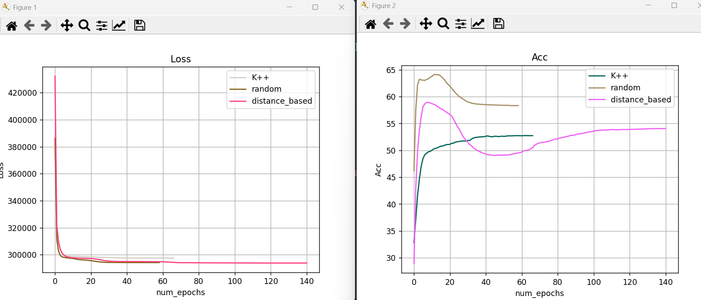

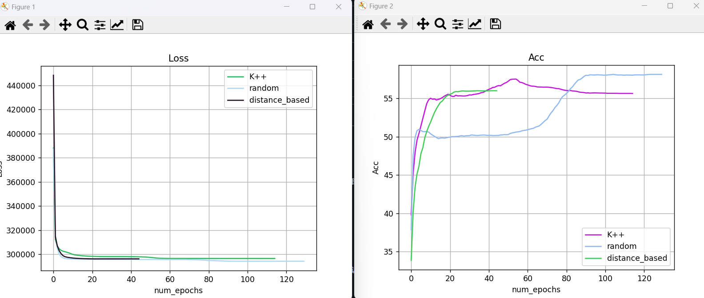


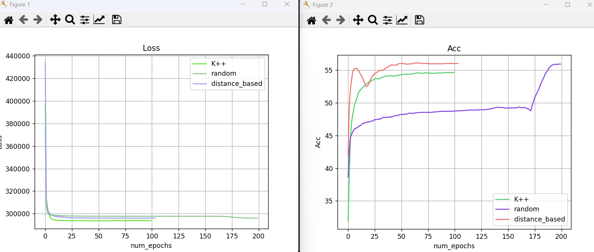

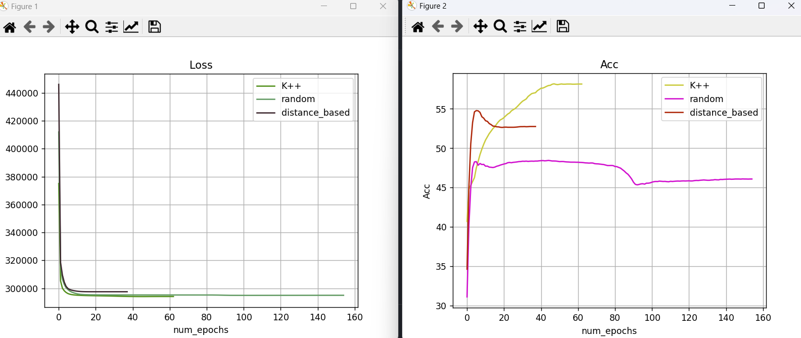

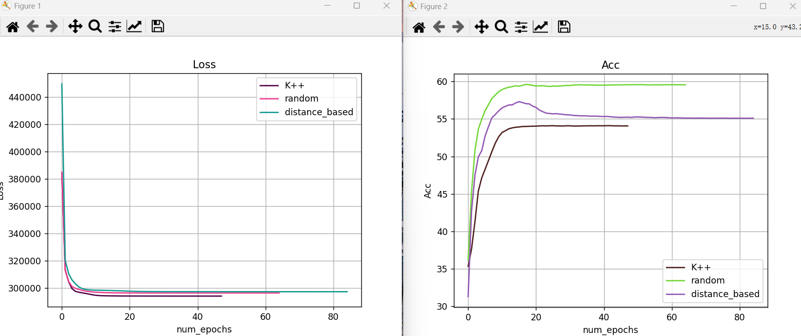

经过多次实验发现，在MNIST 数据集的场景下，各种初始化方法的平均性能基本相差不大，没有出现谁比谁绝对性能要高的情况。并且迭代次数也并没有呈现稳定的某一种初始化方法绝对高于另外的初始化的趋势。这一方面是来源于无监督学习自身学习效果差异大的特性，另一方面也侧面说明了初始化方法在该场景下对K-means的性能影响不大。

但在预测稳定性上，大部分实验中K++和random都会稳定在55%附近，而random则会出现较大的波动，波动幅度在45% - 60%左右，很不稳定。这也与预期效果一致，随机初始化在某些程度就像是“抽奖”一样，其聚类性能具有很大的随机性，而另外两种方式的初始化采用了策略，初始化选择相对于随机初始化更加稳定，往往保持较好的稳定性。


### GMM

GMM算法实现代码如下，在这里面的初始化均值和协方差矩阵结构我是采用各自独立的方式，初始化均值采用随机初始化，K-means初始化，和K++初始化方法，协方差矩阵可选择的结构有完全协方差矩阵、对角协方差矩阵、球形协方差矩阵，关键代码如下：

```python
def initialize_parameters(X, K, covariance_type='full',init_type='random',pca = 30):
    n_samples, n_features = X.shape
    # 初始化均值, 随机选择的K个值
    if init_type == 'random':
        means = X[np.random.choice(n_samples, K, replace=False), :]
    elif init_type == 'kmeans':
        k_means = Kmeans(init_type='random',n_components=pca)
        _,means = k_means.kmeans()

        # kmeans = KMeans(n_clusters=2, random_state=0)

        # # 拟合数据
        # kmeans.fit(X)

        # # 获取簇的中心（均值）
        # means = kmeans.cluster_centers_
    elif init_type == 'k++':
        centers = []
        # 随机选择第一个中心点
        centers.append(X[np.random.randint(X.shape[0])])
        for _ in range(1, K):
            # 选取其余点到目前选出来的中心的距离的最小值，组成这个distances矩阵
            distances = np.array([min(np.linalg.norm(x - center)**2 for center in centers) for x in X])
            # 将距离矩阵转化成概率矩阵，然后使用按概率分布加权随机抽样的方法来找到下一个中心，生成的采样点是随机的，概率越大，占的“采样空间”越大，越容易被选中
            probabilities = distances / distances.sum()
            cumulative_probs = probabilities.cumsum()
            r = np.random.rand()
      
            # 根据概率选择下一个中心
            next_center_index = np.where(cumulative_probs >= r)[0][0]
            centers.append(X[next_center_index])
        means = np.array(centers)

    covariances = []
    # 初始化协方差矩阵，计算的全部的样本的协方差矩阵，然后复制了K份，每份是一样的
    if covariance_type == 'full':
        # 使用数据的协方差矩阵进行初始化
        for _ in range(K):
            cov_matrix = np.cov(X.T) + np.eye(n_features) * 1e-6  # 确保协方差矩阵正定
            covariances.append(cov_matrix)
    elif covariance_type == 'diag':
        # 使用每个簇的方差进行初始化
        for _ in range(K):
            cov_matrix = np.diag(np.var(X, axis=0))  # 对角协方差矩阵
            covariances.append(cov_matrix)
    elif covariance_type == 'spherical':
        # 使用全体样本的方差进行初始化
        for _ in range(K):
            sigma2 = np.var(X)  # 均匀方差初始化
            cov_matrix = np.eye(n_features) * sigma2  # 球形协方差矩阵
            covariances.append(cov_matrix)

    # covariances = []
    # for k in range(K):
    #     # 随机从数据集中选择与该簇相关的样本
    #     cluster_points = X[np.random.choice(n_samples, size=n_samples//K, replace=False), :]
    #     cov_matrix = np.cov(cluster_points, rowvar=False) + np.eye(n_features) * 1e-6
    #     covariances.append(cov_matrix)

    # 初始化混合系数，这里初始化为1/k
    pis = np.ones(K) / K
    return means, covariances, pis


# 主要是求责任矩阵，这里的责任矩阵是N * K的
def e_step(X, means, covariances, pis):
    n_samples = X.shape[0]
    # 初始化责任矩阵
    responsibilities = np.zeros((n_samples, len(means)))
    # 使用 logpdf 避免溢出
    for k in range(len(means)):
        # 计算每个高斯分布的概率密度
        responsibilities[:, k] = pis[k] * multivariate_normal.pdf(X, mean=means[k], cov=covariances[k],allow_singular=True)
    # 归一化责任矩阵
    # responsibilities = np.exp(responsibilities)  # 将对数概率转换回普通概率
    responsibilities_sum = responsibilities.sum(axis=1, keepdims=True)
    responsibilities_sum = np.maximum(responsibilities_sum, 1e-40)  # 防止除以零
    responsibilities /= responsibilities_sum
  
    return responsibilities

def m_step(X, responsibilities, K,covariance_type='full'):
    n_samples, n_features = X.shape
    # 更新混合系数
    pis = responsibilities.sum(axis=0) / n_samples
    # 更新均值
    means = np.array([responsibilities[:, k].dot(X) / responsibilities[:, k].sum() for k in range(K)])
    # 更新协方差矩阵
    epsilon = 1e-8
    covariances = []
    for k in range(K):
        # N_k
        N_k = responsibilities[:, k].sum()
        if N_k > 0:
            # 如果该簇的责任和大于零，计算协方差
            # cov_matrix = np.cov(X, rowvar=False, aweights=responsibilities[:, k]) 
            # 初始化协方差矩阵
            if covariance_type == 'full':
            # 完全协方差矩阵
                D = X.shape[1]  # 特征数
                cov_matrix = np.zeros((D, D))
                for n in range(X.shape[0]):
                    diff = (X[n] - means[k]).reshape(-1, 1)
                    cov_matrix += responsibilities[n][k] * diff @ diff.T  # (D, 1) @ (1, D) -> (D, D)
                cov_matrix /= N_k 
            elif covariance_type == 'diag':
            # 对角协方差矩阵
                diff = X - means[k]  # 计算每个样本与均值的差
                weighted_diff_square = (responsibilities[:, k][:, np.newaxis] * (diff ** 2)).sum(axis=0)
                cov_diag = weighted_diff_square / N_k
                cov_matrix = np.diag(cov_diag)  # 仅保留对角元素
            elif covariance_type == 'spherical':
            # 球形协方差矩阵
                diff = X - means[k]
                weighted_diff_square = (responsibilities[:, k][:, np.newaxis] * (diff ** 2)).sum()
                sigma2 = weighted_diff_square / (N_k * X.shape[1])  # 平均方差
                cov_matrix = np.eye(X.shape[1]) * sigma2  # 球形协方差矩阵

        else:
            # 如果该簇的责任和为零，使用默认的协方差矩阵（单位矩阵）
            cov_matrix = np.eye(X.shape[1]) * epsilon
        covariances.append(cov_matrix)
    return means, covariances, pis
```

使用对数似然函数作为损失函数，为了方便，这里对对数似然函数取反，这样loss越小性能越好。

#### 不同协方差矩阵结构对GMM模型聚类性能的影响

不同的协方差矩阵结构对GMM模型的聚类性能有十分显著的影响，常用的协方差矩阵结构有：完全协方差矩阵、对角协方差矩阵、球形协方差矩阵。

完全协方差矩阵中的每个元素都可以自由变化，因此能够描述不同维度之间的相关性以及不同维度的方差。其要求的计算量大，但是表达能力强。对角协方差矩阵即协方差矩阵中的非对角线元素为零，只保留每个维度的方差，每个簇的每个维度是独立的，没有维度之间的相关性。这样其计算效率高，但表达能力有限。球形协方差矩阵使每个高斯分布使用一个标量的方差值，而不是矩阵。即每个簇的协方差矩阵是一个常数 $σ^2$ 的单位矩阵。换句话说，所有的维度都具有相同的方差，并且每个簇的形状是一个同方差的球体。这样其计算更加高效，与此同时表达能力更低。

由于协方差矩阵的结构不同，为了维持结构，需要在M步更新时采用不同的更新公式，其本质上就是在原有的更新公式上的化简。

采用PCA降维为30维，迭代为100次下，means采用随机初始化，不同协方差矩阵结构对性能的影响，左图是训练集loss曲线，右图是测试集acc曲线：

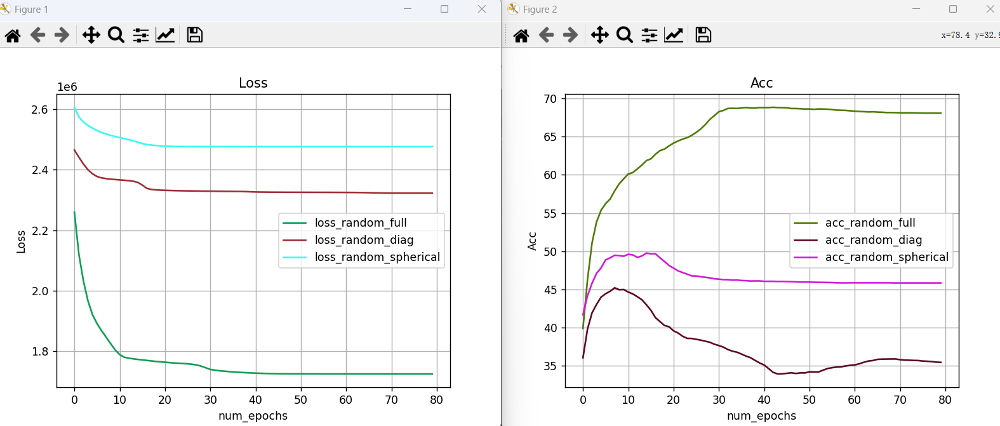

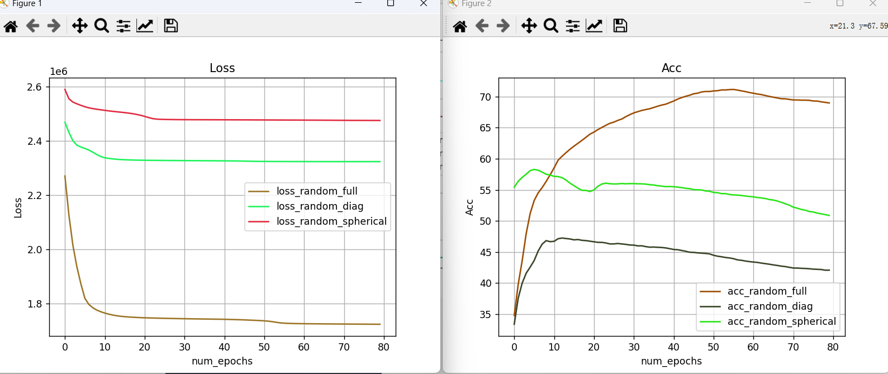

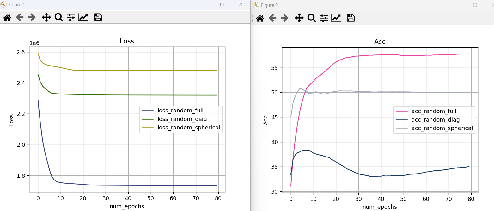

时间开销如下：

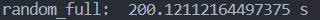

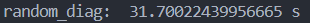

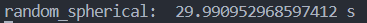

实验模型大概在80轮迭代收敛。

分析：经过多次实验，会发现在时间开销上，采用完全协方差矩阵时间开销在200 - 210s之间，对角协方差矩阵和球形协方差矩阵都在为30s左右，而球形协方差矩阵总会比对角协方差矩阵快1-2s，球形协方差矩阵稍优于对角协方差矩阵。时间开销上**完全协方差矩阵<对角协方差矩阵<球形协方差矩阵。**

在ACC性能上，完全协方差矩阵的聚类精度可以达到55%-65%，甚至达到70%。而对角协方差矩阵在35% - 45%左右，表现最差，球形协方差矩阵在45% - 55%之间，表现次之。在精度上，完全协方差矩阵>>球形协方差矩阵>对角协方差矩阵。

经过上述实验发现，完全协方差矩阵聚类精度高，但训练模型所需要的时间开销更大，这贴合其数据多，表达能力强的特点。球形协方差矩阵无论在时间还是聚类精度的表现均优于对角协方差矩阵。

#### 不同初始化方法对GMM聚类性能的影响

这里的初始化仅仅是针对高斯概率均值的初始化，这里我采用了三种初始化方法：随机初始化，Kmeans初始化以及K++初始化。Kmeans初始化即利用Kmeans模型进行计算，得到初始的K个聚簇中心 作为初始化均值，K++初始化方式与前面Kmeans中的K++初始化方式一致，起始选择一个样本作为均值，然后将距离所有均值的距离转化为概率，进行下一个均值的选择，直到选够所需条件的均值。

采用不同的初始化方式，统一采用完全协方差矩阵，迭代100次运行部分结果如下，左图是训练集loss曲线，右图是测试集acc曲线：

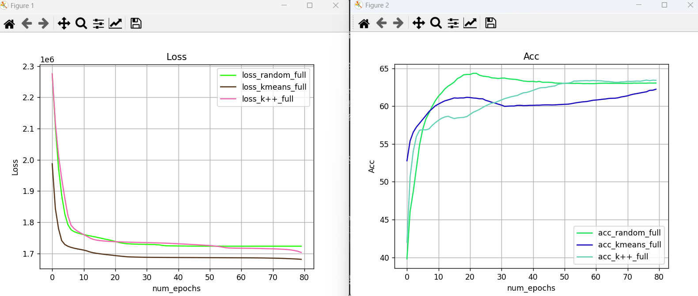

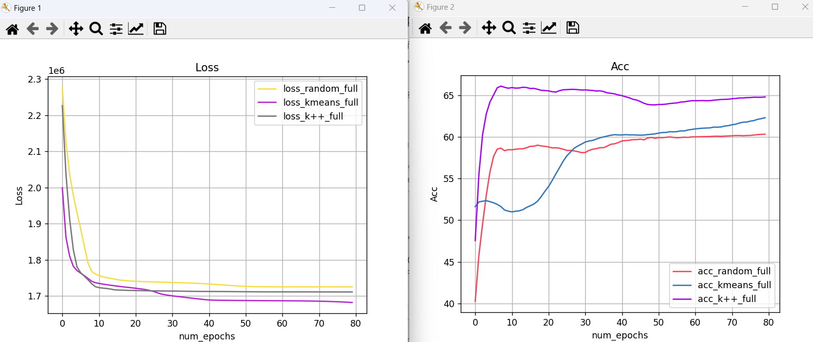

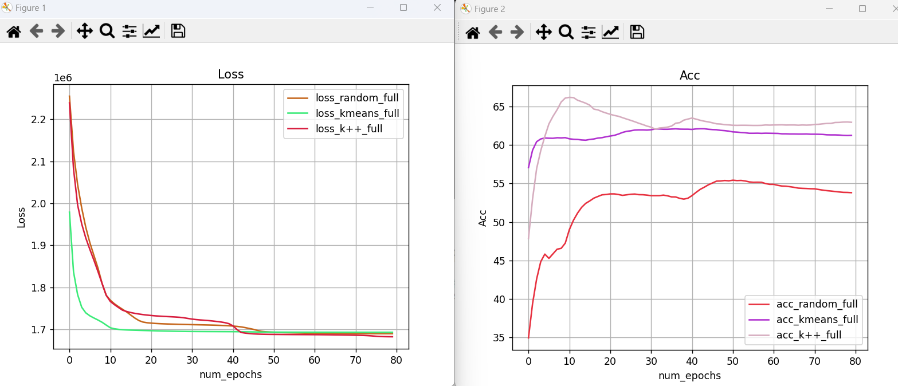

都是在大约80轮收敛完成。

经过多次实验，在时间效率上，时间开销均在200s左右，并没有显示出多么大的差距，推测应该是初始化的时间开销在整个训练过程中占比极小，并不能影响整个训练过程。

在初始精准度上K-means > k++ > random。K-means 和 k++都采取了策略对初始均值进行了“挑选”,因此自然初始精度比较高，这与我们的认知一致。

在最终的训练过程中，在多次实验的统计下，K-means和K++的训练效果接近，大概在60% - 70%之间，random不稳定，有时很高，有时很差，大概在55% - 70%的大区间跳动。这种现象与我们的预期一致，原理同K-means处的解释。

总结：在时间开销上，由于初始化对时间影响较小，所以三种初始化方法的时间开销差距并不明显。在初始精度方面，由于K-means和k++对于均值的选择采取了一定的策略，所以在初始精度上二者高于随机初始化，K-means >K++ > random。而在最终精度上，K-means和K++稳定在60% - 70%的高准确率，而random则浮动比较大，这也符合初始化的预期。


#### K-means与GMM比较

为了保证结果的稳定性，统一采用K++初始化方法。最大迭代200次，GMM采用完全协方差矩阵结构，运行效果如下（K++为K-means的曲线图，acc_k++_full为GMM模型的曲线图）：

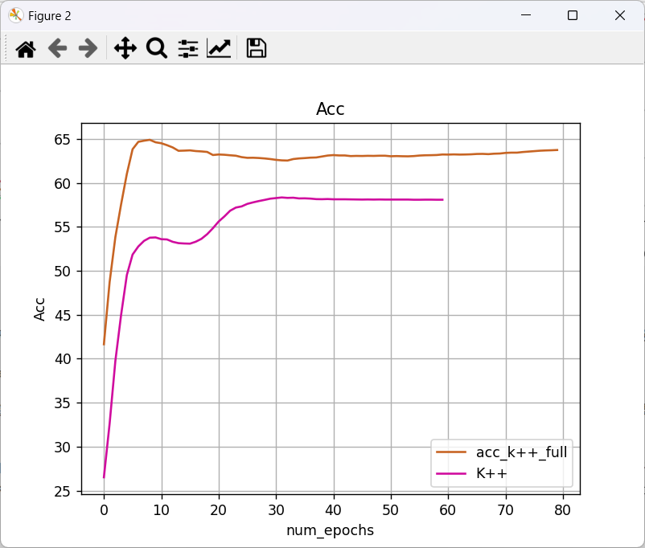

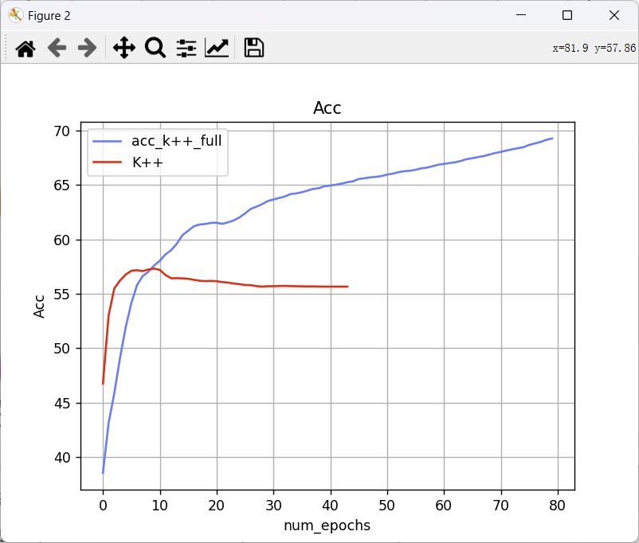

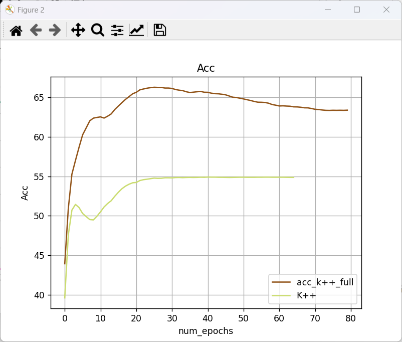

由于两个模型的loss函数不同，没有比较的必要，因此这里只展示acc图像。

时间开销上，GMM开销为200s左右，而K-means在大约11s左右，K-means的时间开销远远小于GMM。

从上面的图像可以明显看出，GMM图像需要更长的迭代次数，大约在80轮左右才收敛，而K-means大部分实验中在大约40 - 60轮左右收敛。

在ACC性能上，GMM在60%-70%左右，而K-means在55%附近，GMM的聚类精度明显优于K-means算法。

对比之前的实验结果，若GMM采用其他协方差矩阵结构，则精度上与K-means一致，但时间开销上不占优势。

总结：

聚类精度上采用完全协方差矩阵的GMM比k-means高出大约10%-15%。但在时间开销上则要付出更大的代价。由于GMM将变量内部隐含的结构关系通过数学模型表示了出来，所以相比于K-means聚类性能上更加强大是可以预知的，但其繁琐的计算迭代步骤导致其时间开销远大于k-means。适用于对精度有要求，不计时间成本的场景。K-means模型简单，导致其不能发掘更多隐含的信息关系，精度上不去，但简单的模型使其训练时间更少，适用于对精度要求不高，追求时间的场景。综合来看，两者在都会有适合自己的应用场景。


## 代码说明

文件夹中的PCA.py存放实现的PCA类，K-means作为类被实现，放在K_means.py中，K_means_main.py存放K_means运行代码，GMM没有统一实现在一个类中，GMM.py中既有实现代码又有运行代码，运行代码用main函数进行了封装。由于GMM中的k-means初始化使用的是K-means，所以务必保证传入PCA降维参数一致。

## 总结

通过这次实验，我回顾了k-means模型和GMM模型的原理，步骤。代码实现了K-means和通过EM训练的GMM模型。探究不同的初始化方法的内在逻辑以及对模型性能的影响，讨论了不同结构的协方差矩阵对GMM算法的影响，比较了k-means模型和GMM模型的性能优劣。也锻炼了机器学习过程中对数据的处理能力和遇到困难解决问题的能力，以及分析实验数据的能力。受益匪浅。
