# SVM

**学号：22320021	姓名：陈安康**

## SVM理论

SVM是一种应用于解决分类问题和回归问题的强大的监督学习方法。它的思想是找出一个最优超平面，不仅可以区分开不同类别的样本，还可以使得到距离它最近的样本点的距离最大化，以提高分类的鲁棒性和泛化能力。

### 线性最大间隔分类器

SVM是在线性最大间隔分类器的基础上一步步发展而来。线性最大间隔分类器的思想是通过一个选择一个超平面，使得到距离它最近的样本点的距离最大化，从而提高分类器的泛化能力。由于初始的优化目标难以被优化，因此在添加一些约束，并在约束下对优化目标进行化简后，得到的新优化目标如下：

$$
min_{w, b} \frac{1}{2} \|w\|^2 \quad subject \quad to \quad y_i \left( w^T x_i + b \right) \geq 1, \quad \forall i
$$

（下标i表示第 i 个样本，以下下标如无特别说明均表示第 i 个样本。）

其决策函数如下：

$$
f(x) = \text{sign}\left(w^T x + b \right)
$$

有时一个问题并不容易解决，而其对偶问题却比较容易。对于上面的优化问题，其**对偶问题**如下：

$$
max_{\alpha} \left( \sum_{i=1}^{N} \alpha_i - \frac{1}{2} \sum_{i=1}^{N} \sum_{j=1}^{N} \alpha_i \alpha_j y_i y_j x_i^T x_j \right) \quad subject \quad to \quad \alpha_i \geq 0, \quad \sum_{i=1}^{N} \alpha_i y_i = 0
$$

其中α表示拉格朗日乘子，也是待优化参数，决定了第 i 个样本的影响力。一般来说：

$α_i>0$ 时，样本 $x_i$ 是支持向量（$x_i$位于间隔边界上，**间隔边界是$y_i (\mathbf{w} \cdot \mathbf{x}_i + b) = 1$**），决定了决策超平面。

$α_i=0$ 时，样本 $x_i$ 不是支持向量（$x_i$不位于间隔边界上），对超平面没有贡献。

也就是说，**只有在间隔边界上的点（距离超平面最近的点）可以影响优化问题，其余点对优化问题影响为0**，这符合原始问题的要求。

对偶问题的决策函数如下：

$$
f(x) = \text{sign}\left( \sum_{i=1}^{N} \alpha_i y_i x_i^T x + b \right)
$$

**由于$x_i^T x$形式的存在，使得在之后发展到SVM时给核函数的引入留下了铺垫**。

### 软线性最大间隔分类器

由于样本的复杂性，并不是所有样本都可以使用平面将其按类别完全分开。这时，我们对上述分类器进行改进，加入**容忍值 ξ**

使得模型通过允许一定程度的错误分类来平衡分类的准确性和模型的复杂度。此时优化问题如下：

$$
min_{\mathbf{w}, b, \boldsymbol{\xi}} \frac{1}{2} \|\mathbf{w}\|^2 + C \sum_{i=1}^n \xi_i \quad subject \quad to \quad y_i (\mathbf{w} \cdot \mathbf{x}_i + b) \geq 1 - \xi_i, \quad \xi_i \geq 0, \quad \forall i = 1, 2, \dots, n
$$

其对偶问题也进行改变：

$$
max_{\alpha} \left( \sum_{i=1}^{N} \alpha_i - \frac{1}{2} \sum_{i=1}^{N} \sum_{j=1}^{N} \alpha_i \alpha_j y_i y_j x_i^T x_j \right) \quad subject \quad to \quad 0 \leq \alpha_i \leq C  \quad \sum_{i=1}^{N} \alpha_i y_i = 0
$$

C控制了分类误差的惩罚，越大，分类错误的容忍度越低，模型越倾向于减少分类误差；越小，模型越倾向于保持较大的间隔，即允许更多的错误分类。

软线性最大间隔分类器没有更改决策函数。

### SVM

在软线性最大间隔分类器的基础上，把$x$换为$φ(x)$，引入非线性因素，即可得到SVM。

$$
min_{\mathbf{w}, b, \boldsymbol{\xi}} \frac{1}{2} \|\mathbf{w}\|^2 + C \sum_{i=1}^n \xi_i \quad subject \quad to \quad y_i (\mathbf{w} \cdot \mathbf{φ(x_i)} + b) \geq 1 - \xi_i, \quad \xi_i \geq 0, \quad \forall i = 1, 2, \dots, n
$$

其对偶问题为：

$$
max_{\alpha} \left( \sum_{i=1}^{N} \alpha_i - \frac{1}{2} \sum_{i=1}^{N} \sum_{j=1}^{N} \alpha_i \alpha_j y_i y_j φ(x_i)^T φ(x_j) \right) \quad subject \quad to \quad 0 \leq \alpha_i \leq C  \quad \sum_{i=1}^{N} \alpha_i y_i = 0
$$

引入核函数，令核函数定义如下：

$$
k(x,x') = φ(x)^Tφ(x')
$$

这样，其对偶问题的形式可以进行如下改写：

$$
max_{\alpha} \left( \sum_{i=1}^{N} \alpha_i - \frac{1}{2} \sum_{i=1}^{N} \sum_{j=1}^{N} \alpha_i \alpha_j y_i y_j k(x_i,x_j) \right) \quad subject \quad to \quad 0 \leq \alpha_i \leq C  \quad \sum_{i=1}^{N} \alpha_i y_i = 0
$$

其决策函数也由于引入核函数发生变化：

$$
f(x) = \text{sign}\left( \sum_{i=1}^{N} \alpha_i y_i k(x_i,x) + b \right)
$$

## Hinge_Loss

### Hinge_Loss线性分类器

Hinge_Loss函数定义如下：

$$
max(0,1−y⋅y_{predicted})
$$

其中y是真实标签，取值为{-1,1}。$y_{predicted}$是预测值。

其中决策函数为:

$$
f(x) = \text{sign}\left(w^T x + b \right)
$$

### Hinge_Loss线性分类器与SVM的关系

其实**SVM中隐式的使用了Hinge_Loss损失函数作为目标函数**。为了方便观察，这里的核函数采用线性核函数，从推导上来看，对于原始问题中的ξ，在约束条件中进行推导，可以得到$\xi_i \geq 1 - y_i (\mathbf{w} \cdot \mathbf{x}_i + b)$，同时$\xi_i \geq 0$，因此$\xi_i  \geq max(0,1 - y_i (\mathbf{w} \cdot \mathbf{x}_i + b))$，而 $\mathbf{w} \cdot \mathbf{x} + b$就是 $y_{predicted}$，当ξi最小化时，该约束应取等号（这个等号是永远可以取到的，因为假设取不到，那么目标问题就不是最小值，因此取最小值是一定取等号），因此将约束条件写入目标函数中后的问题变成：

$$
min_{\mathbf{w}, b, \boldsymbol{\xi}} \frac{1}{2} \|\mathbf{w}\|^2 + C \sum_{i=1}^n max(0,1 - y_i (\mathbf{w} \cdot \mathbf{x}_i + b))
$$

由此我们可以看到，在SVM中隐式采用了Hinge_Loss作为目标函数，并且尤其是当你将$\frac{1}{2} \|\mathbf{w}\|^2$看做正则项时，这个目标函数的主体损失函数就会完全变为Hinge_Loss。可以说，**Hinge_Loss线性分类器就是采用线性核函数的SVM。**

以下使用比较直观地方式对Hinge_Loss的含义进行进一步解释：

在SVM中，ξ作为容忍值来表明模型可以容忍一些分类错误以应对噪声数据，通过最小化ξ来获得最优的分类边界。这相当于通过ξ惩罚了那些无法分类正确的样本（位于间隔边界内的样本等等）。

在上面的SVM理论中，我们已经知道间隔边界是$ y_i (\mathbf{w} \cdot \mathbf{x}_i + b) = 1$。当分类正确且距离大于间隔边界时，$ y_i (\mathbf{w} \cdot \mathbf{x}_i + b) \geq 1$，此时Hinge_Loss取值为0，即对于正确的分类不会进行惩罚。

而分类错误时，此时y与$y_{predict} $异号，$ y_i (\mathbf{w} \cdot \mathbf{x}_i + b) < 0$，Hinge_Loss会取后者，即对分类错误的项进行惩罚。

当样本点位于间隔边界内时，此时$y_i (\mathbf{w} \cdot \mathbf{x}_i + b) < 1$，此时Hinge_Loss还是取后者，即惩罚距离决策边界过近的样本点。

综上我们可以知道，**Hinge_Loss惩罚分类错误和位于间隔边界内的样本点**。这和SVM中的惩罚目标是一致的。

## 实验内容

### 不同核函数SVM模型性能比较

调用SVM库对SVM代码进行实现，编写一个类进行封装，传入核函数参数，迭代次数等超参数。运行完成后统计运行时间以及错误率（百分比）代码如下：

```python
class SVM:
    def __init__(self,kernel_,iterations = 1050):
        # 将csv文件中的数据转换为矩阵
        self.train_label_array, self.train_X_array, self.test_label_array, self.test_X_array = csv2array()

        self.train_X_array = self.train_X_array / 255

        self.test_X_array = self.test_X_array / 255
        self.model = SVC(kernel = kernel_, C = 1.0,max_iter = iterations)

    def fit(self):
        self.model.fit(self.train_X_array,self.train_label_array.ravel())

    def predict(self):
        self.pred_label = self.model.predict(self.test_X_array)
        return self.pred_label, self.test_label_array.ravel()
  
    def show(self,start_time,end_time):
        print("错误率:", (np.sum(np.bitwise_xor(self.pred_label,self.test_label_array.ravel())) / self.test_label_array.ravel().shape[0]) * 100, "运行时间：", end_time - start_time)
```

调用代码如下，分别指定采用线性核函数和高斯核函数，并计算运行时间以及输出预测错误率：

```python
Linear_SVM = SVM('linear')
start_time = time.time()
Linear_SVM.fit()
end_time = time.time()
Linear_SVM.predict()
Linear_SVM.show(start_time, end_time)

Rbf_SVM = SVM('rbf')
start_time = time.time()
Rbf_SVM.fit()
end_time = time.time()
Rbf_SVM.predict()
Rbf_SVM.show(start_time, end_time)
```

首先设置迭代次数为100，观察输出结果如下，发现两者模型均未收敛：

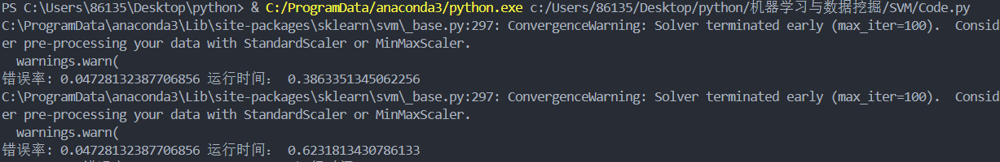

设置迭代次数为500，运行，发现采用高斯核函数的模型已经不再报出警告，而采用线性核函数的模型依旧报警告。说明采用高斯核函数的模型已经在迭代次数500次时收敛，而采用线性核函数的模型在迭代次数500次时仍未收敛：

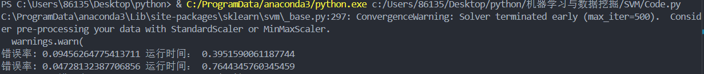

继续增大迭代次数，会发现采用线性核函数的模型最后会在迭代次数为1050次时才收敛：

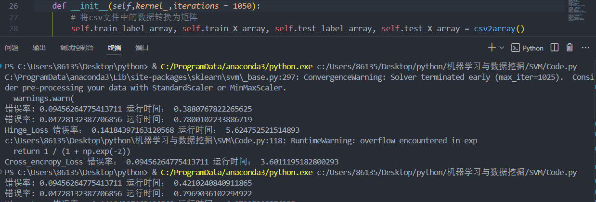

通过上述比较我们发现，**同一迭代次数下，采用高斯核函数的模型的收敛速度明显快于采用线性核函数的模型，并且预测准确率上普遍高于线性核函数。但是由于高斯核函数计算复杂性高，导致其训练时间几乎要达到采取线性核函数的2倍，在训练时间开销上处于劣势。**

### 两种线性分类器的代码实现

对于两种分类器，分别通过类进行实现，实现了初始化、训练、预测、以及展示等功能。实现代码采用向量化实现，加快运行速度。在训练过程中使用正则化项，并且正则化项是不参与dw计算，而是单独分开，在最后应用于更新中的。代码中对数据进行了归一化处理，通过正态分布初始化权重，原因在后面的“数据处理及参数选择部分”给出。两种分类器代码框架一致，主要区别在于损失函数以及训练过程中梯度计算的差异。

二者损失函数以及训练部分代码如下：

Hinge_Loss

```python
    def hinge_loss(self,Z):
        self.y = np.where(self.train_label_array == 0, -1,self.train_label_array)
        return np.maximum(0, 1- self.y * Z)
      

  
    def fit(self):
        for i in range(self.iterations):
            Z = np.dot(self.train_X_array, self.weights) + self.b 
            # print('Z:')
            # print(Z.shape)
            self.loss = self.hinge_loss(Z)
            self.loss_list.append((( 1 / self.m ) * np.sum(self.loss) + 0.5 * self.lambd * np.dot(self.weights.T,self.weights))[0])
            dw = ( 1 / self.m ) * np.sum(np.where(self.loss > 0, -self.y * self.train_X_array, 0),axis = 0)
            dw = dw.reshape(-1, 1)
            # print('dw:')
            # print(dw.shape)
            db = ( 1 / self.m ) * np.sum(np.where(self.loss > 0, -self.y, 0),axis = 0)
            # print('db:')
            # print(db.shape)
            # 这里单独加入正则化项
            self.weights = self.weights - self.learning_rate * (dw + self.lambd * self.weights)
            self.b = self.b - self.learning_rate * db
```

Cross_encropy_Loss:

```python
def sigmoid(self, z):
        return 1 / (1 + np.exp(-z))

    def Cross_encropy_loss(self,H):
        epsilon = 1e-15
        H = np.clip(H, epsilon, 1 - epsilon)
        self.loss_list.append((-np.mean(self.train_label_array * np.log(H) + (1 - self.train_label_array) * np.log(1 - H)) + 0.5 * self.lambd * np.dot(self.weights.T,self.weights))[0])
      

  
    def fit(self):
        for i in range(self.iterations):
            Z = np.dot(self.train_X_array, self.weights) + self.b 
            H = self.sigmoid(Z)
            self.Cross_encropy_loss(H)
            dw = ( 1 / self.m ) * np.dot(self.train_X_array.T, (H - self.train_label_array))
            dw = dw.reshape(-1, 1)
 
            db = ( 1 / self.m ) * np.sum(H - self.train_label_array)

            # 这里单独加入正则化项
            self.weights = self.weights - self.learning_rate * (dw + self.lambd * self.weights)
            self.b = self.b - self.learning_rate * db

```

### 数据处理及参数选择

#### 初始化方法以及数据处理

对于数据处理，由于数据十分稀疏，并且特征尺度一致，全部在[0，255]区间内，因此即使不进行处理直接使用，训练的效果也十分好，但由于数据的范围跨度还是比较大，导致其对梯度的影响十分大，导致梯度十分"陡"，此时学习率稍微偏大就会导致“梯度爆炸”，即loss曲线不降反增，如下。

此图是原始数据，迭代次数为50，lr为0.1时的loss曲线图，观察到导致学习率过大出现loss增大的现象。

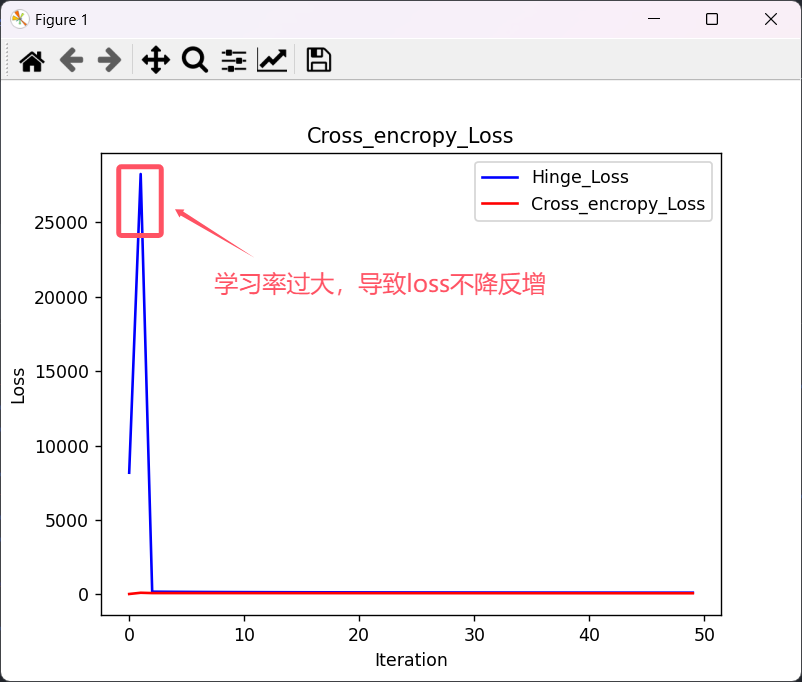

降低lr为0.01，保持迭代次数为50，绘制图像如下，梯度爆炸现象消除：

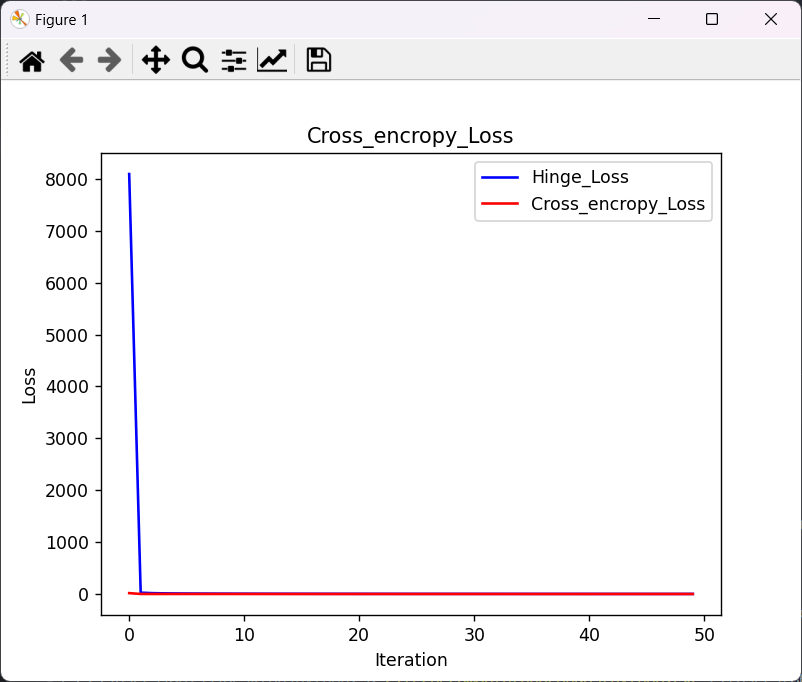

虽然直接使用原始数据也可以训练出很好的结果，但存在如下几个问题：1）由于Hinge_Loss与Cross_encropy_Loss对数据尺度感知程度存在差别，Hinge_Loss更容易受到原本参数值大小的影响，**这会导致两者的loss损失函数由于原始数据尺度过大而在初始差别出几个数量级**，由上图所示。这很不利于同时对两个损失函数进行评估。2）由于梯度受到数据尺度的影响（梯度中都会有一个x），**原始数据的大尺度会导致梯度很“陡”**。这当然一定程度上有助于模型的快速收敛，但过于陡峭的梯度也会导致对学习率等参数的选择要更加谨慎小心，稍有不注意就会出现上面所示的“梯度爆炸”，跳过最优解，反而导致模型难以收敛，而且过都的斜率也会压缩学习率等超参的选择范围，使其只能在极小的范围内进行选择，这显然不利于之后的超参选择学习过程。

对于面对的Hinge_Loss与Cross_encropy_Loss数量级差异所导致的问题，我们可以通过采用初始化参数时给与一个较小的值来进行解决，这里我选择使用正态分布来初始化参数，使参数符合$N（0，0.01^2）$，这样，由于正态分布的特性，所有的权重初始均被限制在一个十分小的值，这样可以将Hinge_Loss的值拉回与Cross_encropy_Loss同一个数量级。

采用正态分布初始化权重后的图像如下（最初是随机初始化权重为[0，1]之间的值 ）：

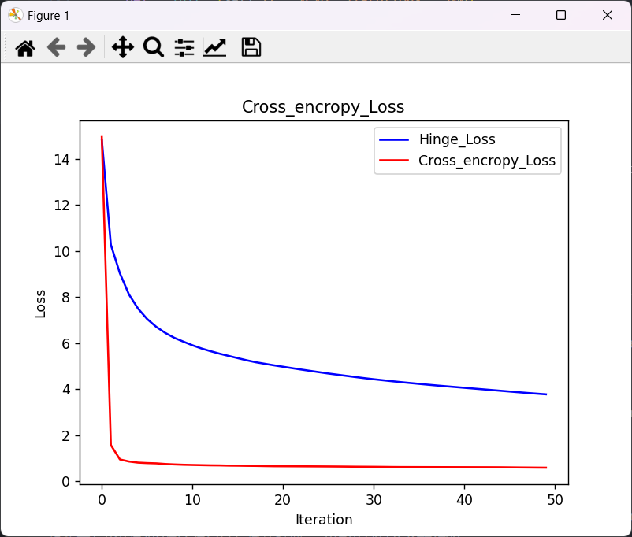

对于学习梯度过大的问题，我们可以选择将原始数据进行处理，使其归一化为较小范围的数据，这样斜率就可以变得缓一些，有利于学习。

由于数据全部是在[0，255]区间内，并且数据很稀疏，不再适合用max-min方式进行归一化。这里采用简单的方式即可，直接令数据全部除以255，这样就可以将数据范围从[0，255]缩小至[0，1]，由于梯度变缓，意味着较小的学习率会使得学习过程变得过长，后续我们应该增大学习率或者增加迭代次数以使模型能够在迭代次数结束之前完成收敛。

经过归一化后的loss图像如下，与上面的图像相比，loss数据范围更小(数据范围缩小的缘故)，下降更加平缓：

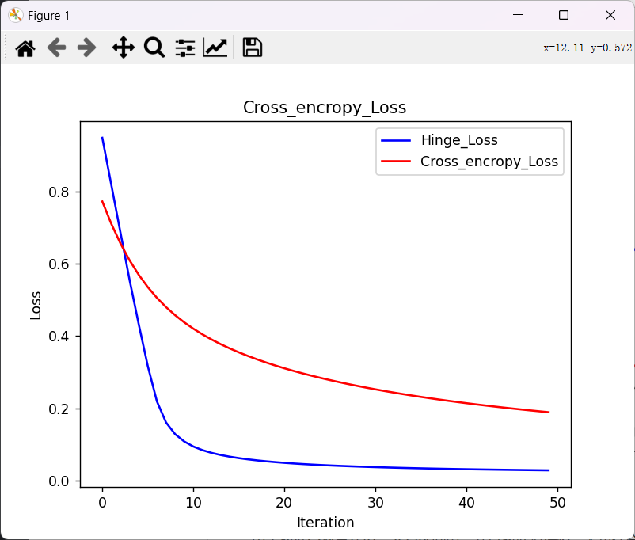

#### 超参数的选择

由于采用正态分布初始化权重，归一化处理数据，会导致梯度变平缓，由此我们需要选择合适的迭代次数和学习率来使模型学习能力更强。

由此，因为模型较小，所以我首先从令学习率[0，1]区间中每隔0.05进行取值，分别进行训练，并将loss下降曲线打印出来绘图如下：

Hinge_Loss：

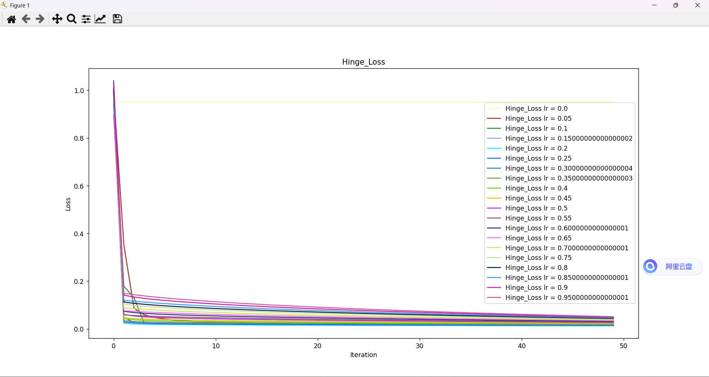

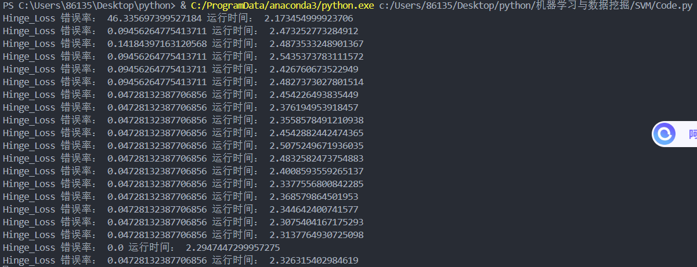

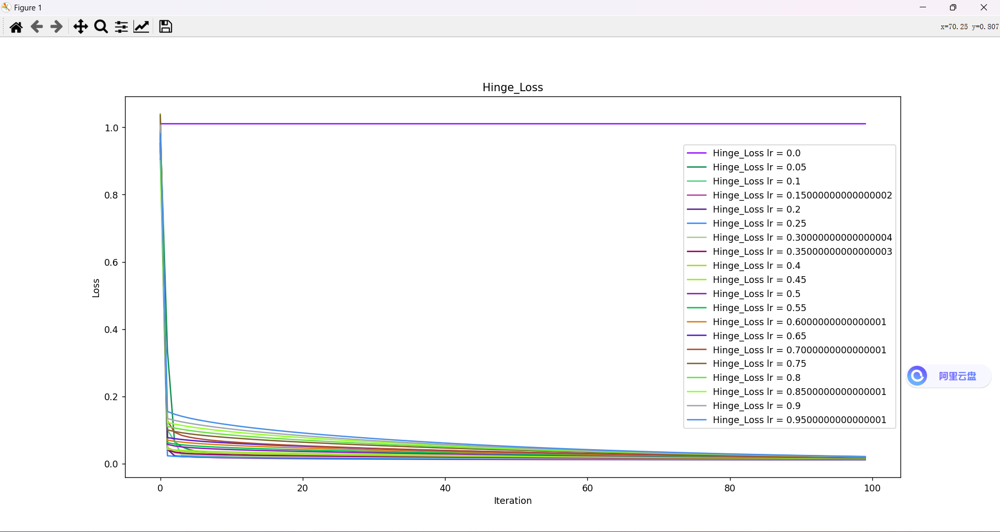

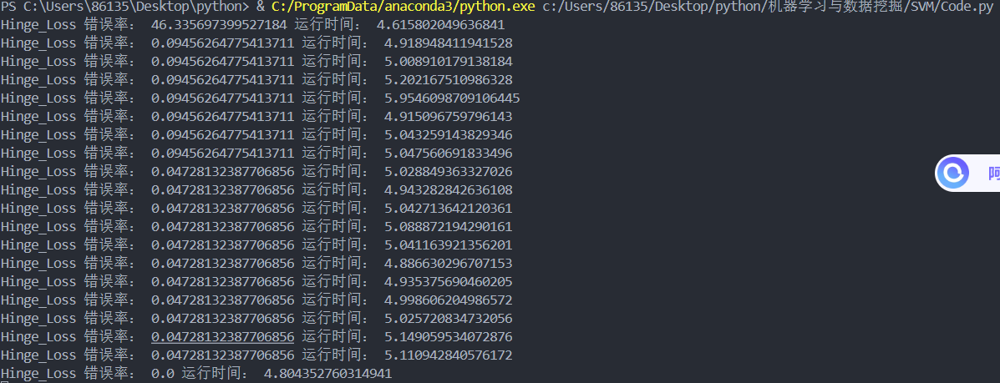

Cross_encropy_Loss：

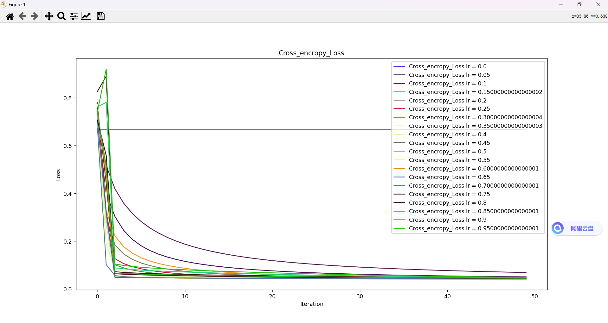


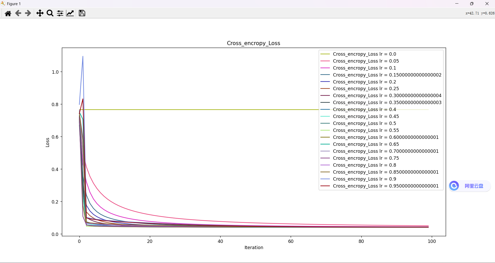

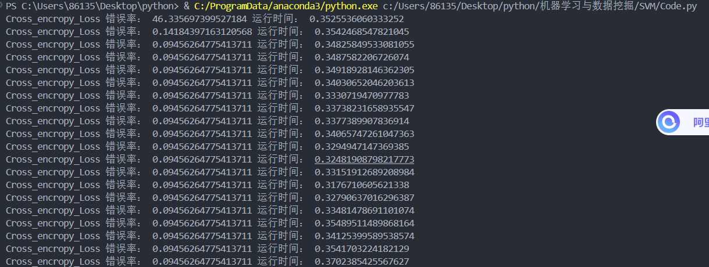

##### 学习率的选择

###### Hinge_Loss

由于Hinge_Loss还没有出现过拟合情况，将lr取值扩大为[0，1.5]，继续进行实验，结果如下：

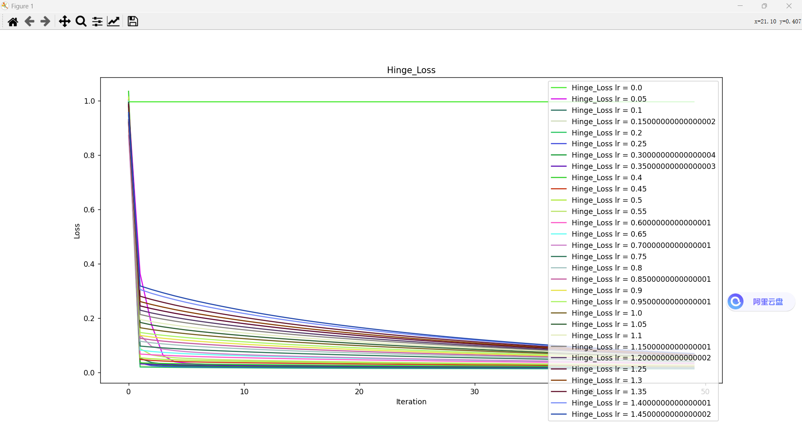

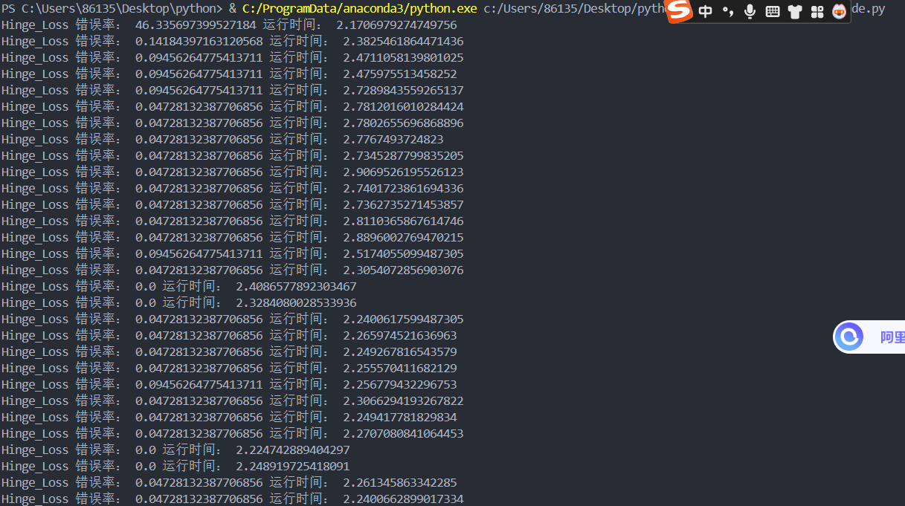

综合比较Hinge_Loss的实验结果可以发现，并不是学习率越大，loss下降速度越快，**当学习率增长到一定的程度时随着学习率的变大，loss收敛速度反而变慢（推测是学习率过大，步长过长，反而使模型收敛速度降低）**，经过观察发现，当学习率位于区间[0.15, 0.25]时，loss收敛速度最快。

由此我们在[0.15, 0.25]区间内继续以隔0.01进行取值，为了便于观察，迭代次数减小一些：

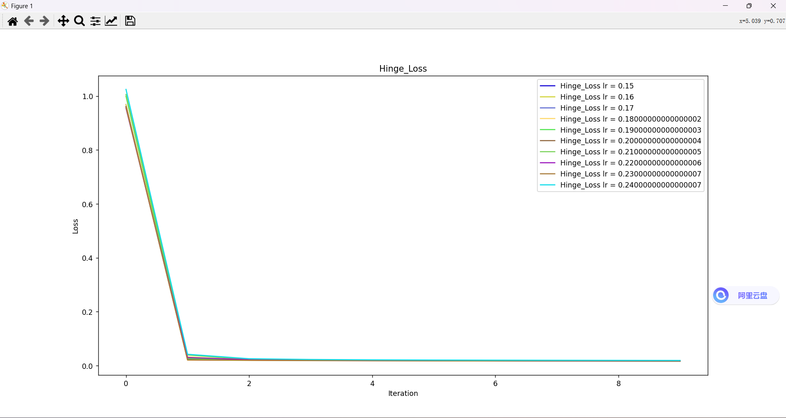

经过多次实验，观察到在这个区间内的Loss下降曲线几乎没有差别，因此这里我们选取0.2作为Hinge_Loss的学习率。

###### Cross_encropy_Loss

在上面的图中，可以看到Cross_encropy_Loss的学习率在接近1时，已经出现梯度爆炸的现象。经过图像观察，发现当学习率位于区间[0.5, 0.6]时，loss收敛速度最快。用同样的方法在[0.5, 0.6]区间内继续以隔0.01进行取值:

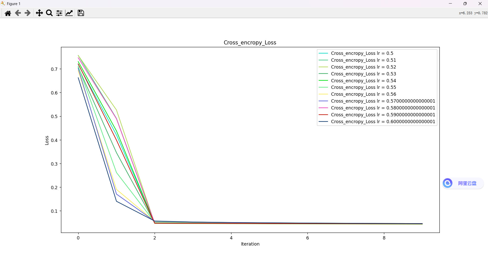

经过多次实验，发现0.59效果最好最稳定，选取0.59作为学习率最终取值。

##### 迭代次数的选择

作迭代次数与失误率的图像，实验过程中部分结果如下：

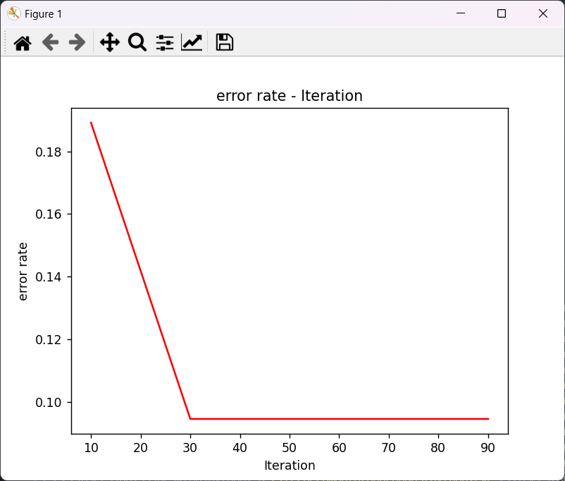

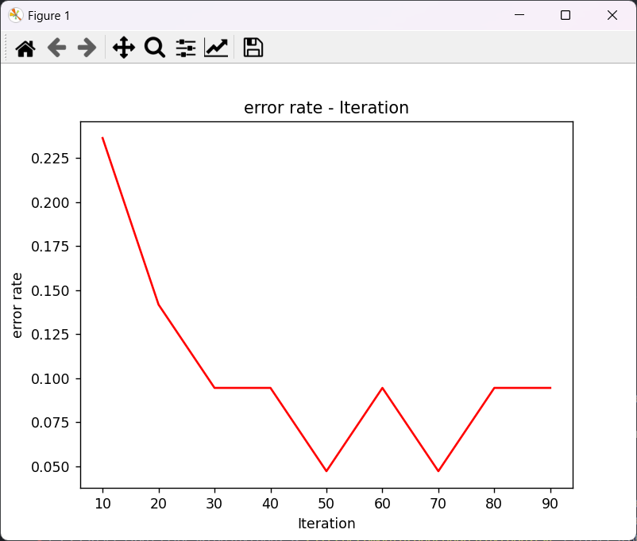

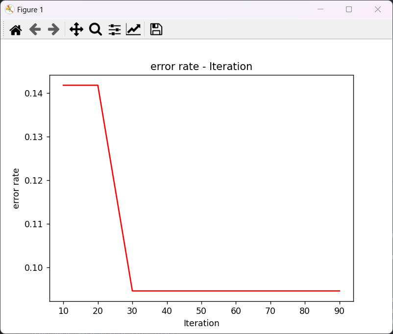

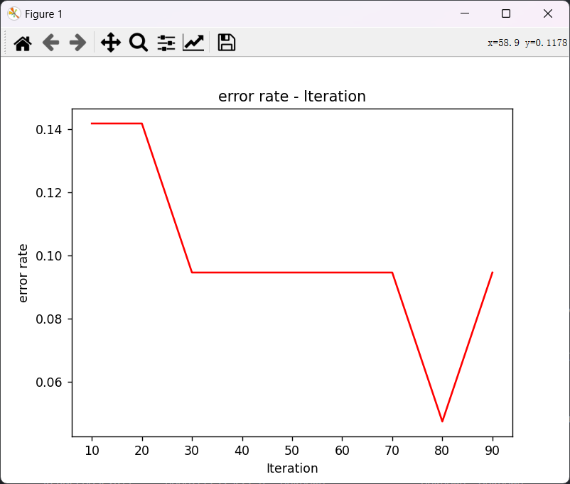

经过多次实验发现，在迭代次数等于30之前，失误率呈现明显降低趋势，在30次后，失误率已经不再呈现降低趋势，而是稳定波动，由此可知迭代次数选择30次是最好的。

### 线性分类器性能比较

使用上一部分选择出的最优的学习率和迭代次数进行运行，结果如下：

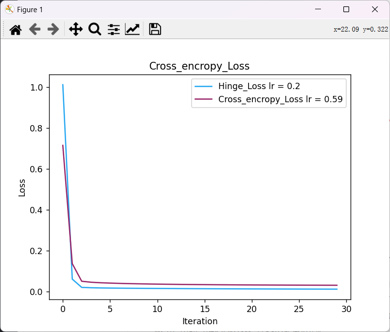

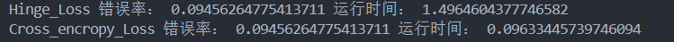

经过多次实验，在使用最优参数后，二者在准确率上基本一致，在收敛速度上基本相当，运行时间上Hinge_Loss相当不占优势，不过这可能是代码实现的原因。不过，参考调用库函数实现的线性SVM，在迭代次数设置为30次时的运算时间如下：


其时间相比于Cross_encropy_Loss也是相当劣势，由此可以看出**在运行时间方面，Cross_encropy_Loss占有很大优势**。 

比较之前的数据会发现，在进行数据处理之后的模型中，**Cross_encropy_Loss容易出现梯度爆炸的情况**，而Hinge_Loss并没有出现过，说明Cross_encropy_Loss鲁棒性不如Hinge_Loss，对扰动更加敏感。

由此我们可以得出结论，**在准确性上，经过合适的参数选择后，二者的准确性基本一致，但在运行时间方面，逻辑回归明显优于Hinge_Loss线性分类模型，但在鲁棒性上Hinge_Loss更优于Cross_encropy_Loss，其抗干扰能力更强。**

## 总结

通过这次实验，我深入学习了SVM的相关知识，回顾了其推导发展过程，并且分析了Hinge_Loss与SVM之间的关系，并在实验中对不同核函数的性能进行比较。手动实现了两种线性分类器，并且在优化过程中使用了不同的技巧并详细解释了原因，最后通过实验数据比较了两种分类器的特点以及性能。通过这次实验，既巩固了理论知识，又增强了我的实操能力，受益匪浅。
