# GPT-2文本生成模型的尝试

学号：22320021  姓名：陈安康

## 背景和动机

在现在AI飞速发展的现在，AI模型已经极大改变了我们的生活方式。尤其是NLP方向的发展，让AI与人类交互上更加友好。不过在一些地方，AI的能力似乎还没有得到进一步开发。比如在游戏领域，虽然智能体在敌人行为上已经很早就开始应用，但是在文本类游戏上，更多的与NPC（非玩家角色）的交互中还依旧是从游戏开发者给定的固定语句中进行选择（如下图为一文本类游戏对话系统），这样虽然可以控制流程，简化游戏开发难度，但并没有给予玩家同NPC进行正常交流的体验。


如果将智能问答模型放入游戏中，只是训练一个比较小的数据集，每次玩家同NPC进行感觉可以在文本类游戏上进行突破，使得文本类游戏更加能给予玩家“交流”的体验。

虽然目前的AI也可以制定想要的角色的智能体（如豆包），但它们的训练集往往比较庞大，且生成语言更加随机。游戏中还是需要NPC和玩家的交互中将一些剧情的关键信息传达给玩家，这也是为什么从开发者给定的文本中选择成为目前所有文本类游戏主选的方案，因为这样可以掌控剧情的走向。目前的智能体还不能达到这个要求。

因此，这次实验我想要向着在这个方面进行努力，尝试训练一个可以生成文本的GPT模型，同时将课堂上的知识进行实践，为后来我往此方向的努力迈出一小步。

为什么只是训练GPT文本生成模型，而不是问答系统呢？一个原因是BERT模型更加适合问答系统，GPT更适合文本生成，但BERT训练所需的参数量比GPT更多，考虑到目前我的电脑硬件，训练GPT都有点力不从心，无法完成更进一步的训练，因此折中选择GPT模型。作为本次实验的尝试。

## 当前解决该问题的主要⽅法

目前在发行的游戏中还没有文本交互是依靠智能体生成。针对问题，我想着先尽力依据特定的数据集训练一个可以生成特定风格的文本的智能体，在之后再进行更进一步的尝试。因此这里首先尝试实现一个GPT2的文本生成模型。

虽然在本次实验中并没有实际中对此问题有更进一步的深入，但我对此问题的解决进行了思考，在此给出我的思路。

在我对此问题的思考中，由于文本对话是为剧情而服务的，因此不同于一般的问答智能体，游戏中的智能体应该在与玩家交互中依据剧情需要“隐藏”很多细节，并在玩家的推进过程中逐步的进行“解锁”，也就是说，训练智能体所用的文本库是动态变化的。并且由于玩家提问的随机性，也许玩家会提问一些“超纲”的问题，比如无关问题如“1+1等于几？”或者在推理游戏中在剧情还未推动到特定阶段时直接问NPC“谁是凶手？”，如果不能妥善处理好这些问题，那么就会大大影响游戏体验。并且由于是为剧情服务，NPC在问答过程中也一定要可以将关键信息传递给玩家，玩家获取关键信息后才能继续推进剧情。

对于上述存在的问题，在我的构想中，对于智能体的回复，应该创建一个检查机制，智能体生成的答案要经过检查，若回答中有“超纲”词语，要依据从玩家提问中提取的特征，替换成合适的回复话术（如“我不知道”等模糊统一的回复），发送给玩家，并且将其反馈给智能体，使其更进一步学习（降低某些词语的权重等方法）。智能体在和玩家的交流中通过这个检查机制作有监督学习，在与玩家交流中不停地进行较小代价（不影响玩家体验）学习（调整更新部分词语的权重等等）。这样游戏既可以给玩家一定程度的交流体验，同时也可以保证游戏不出现BUG。

由于本次实验的时间有限，以及自己硬件与理论不达标，还没有能力完全进行实践，这里只提供自己思考后的思路，希望以后有机会可以进行实现。

## 模型介绍

这里实现GPT-2的模型，GPT-2（Generative Pretrained Transformer 2）是 OpenAI 研发的一款基于 Transformer 架构的语言模型，于 2019 年 2 月发布。GPT-2 延续了 Transformer 的架构，Transformer 使用自注意力机制（Self-Attention）替代了传统循环神经网络（RNN）中的循环结构和卷积神经网络（CNN）中的卷积结构，能够并行计算，并且有效捕捉长序列中的依赖关系。GPT-2仅使用了 Transformer 架构中的解码器部分，并未使用编码器。GPT-2 的核心是一个多层的 Transformer 解码器堆栈，GPT-2 有 12 层、36 层和 48 层等不同规模的版本。每一层包含多头自注意力和前馈神经网络两个主要模块，这些模块共同作用对输入文本进行特征提取和转换。GPT-2在大规模的文本语料库上进行无监督预训练，这些语料库包含了各种来源的文本，如互联网文章、书籍、新闻报道等。预训练的目标是预测下一个单词，通过这种方式，模型学习到了语言的统计规律、语义表示和语法结构。在完成预训练后，GPT-2 可以根据具体的下游任务进行微调。

其中GPT-2中比较重要的是Transformer结构（GPT-2仅使用解码器部分），下面着重介绍。

### Transformer

Transformer 是一种基于自注意力机制的深度学习架构，主要由编码器（Encoder）和解码器（Decoder）两部分组成。编码器由多个相同的编码层堆叠而成，每个编码层包含两个子层：多头自注意力层和前馈神经网络层。

初始输入编码与位置编码（Positional Encoding）加和，作为后续输入。这种设计允许模型利用到序列中每个元素的位置信息，同时考虑到输入数据的内容信息。

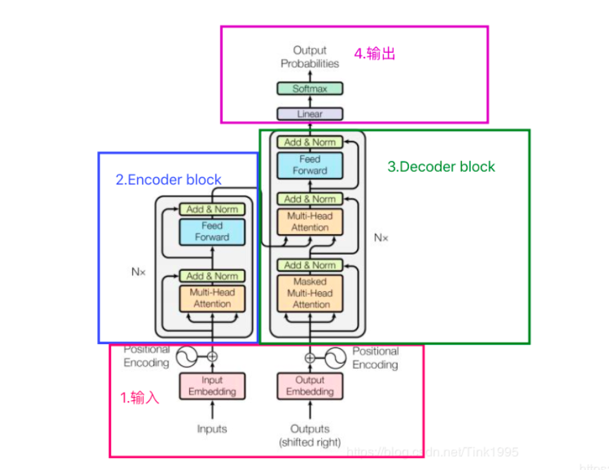

自注意力机制允许模型在处理序列中的每个元素时，能够动态地关注到序列中的其他元素，从而捕捉到序列中的长距离依赖关系。多头自注意力则是通过多个不同的头并行地计算自注意力，每个头学习到不同的特征表示，然后将这些头的输出拼接起来，经过线性变换得到最终的输出。这种方式可以让模型更加全面地捕捉到序列中的信息。

输入序列X（即Embedding，可以是任意形式的词向量，比如说word2vec，GloVe，one-hot编码获得）生成三个向量，即 查询向量Q、键向量K和一个值向量V 。这一过程通常通过与三个权重矩阵的线性变换实现。

得分计算公式如下，通过计算查询向量 \(Q\) 与所有键向量 \(K\) 之间的点积来获得注意力得分。为了避免点积结果过大导致梯度问题，引入了一个缩放因子，dk是键向量的维度：

$$
\text{Scores} = \frac{QK^T}{\sqrt{d_k}}
$$

然后经过softmax函数后，将得分归一化为概率，然后使用注意力权重对值向量 \(V\) 进行加权求和，生成最终的输出序列

$$
\text{Attention Weights} = \text{softmax}(\text{Scores})
$$

$$
\text{Attention Output} = \text{Attention Weights} \cdot V
$$

在实际应用中，多头注意力机制（Multi-Head Attention）通过将输入序列分成多个头（Heads），分别计算注意力，然后将结果拼接起来，通过一个线性层进行投影，以增强模型的表达能力。

GPT-2仅使用了 Transformer 架构中的解码器部分，并未使用编码器。

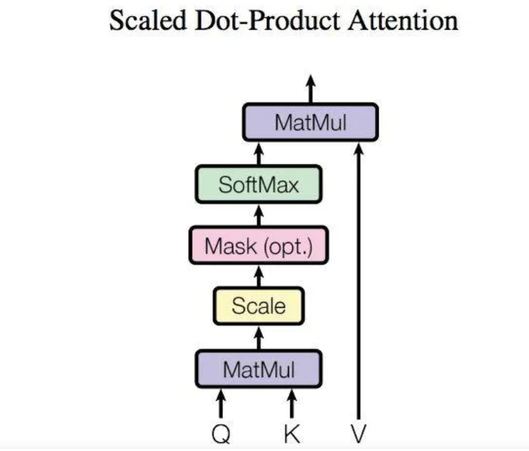

Add & Norm 层由 Add 和 Norm 两部分组成，其计算公式如下

$$
LayerNorm(X+MultiHeadAttention(X))
$$

$$
LayerNorm(X+FeedForward(X))
$$

其中 X表示 Multi-Head Attention 或者 Feed Forward 的输入，MultiHeadAttention(X) 和 FeedForward(X) 表示注意力或者前向传播输出。加入残差块X的目的是为了防止在深度神经网络的训练过程中发生退化，即深度神经网络通过增加网络的层数，Loss逐渐减小，然后趋于稳定达到饱和，然后再继续增加网络层数，Loss反而增大。

在解码器中，除了上述的机制之外，额外有一个Mask层，其主要作用是防止模型在预测下一个词时看到未来的信息，即确保模型在生成序列时只能依赖于当前位置及之前的位置信息。将输入与Mask矩阵作用，将上三角置为0，这样对下一个词语的预测就只能依靠前面的已存在的词语。

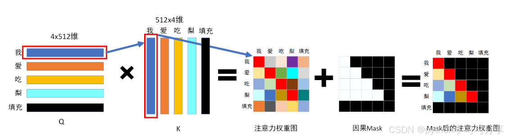

### 模型代码实现

为了实践课堂中的知识，加深印象，这里我没有调用训练的现成的GPT2模型，而是尝试手动实现GPT2模型，这里我参考了[https://www.bilibili.com/video/BV12s421u7sZ?vd_source=1a4b60702258fbf53f7dd8c24da9cba7]()的教程进行实现。

其中总体的GPT模型结构设计如下：

```python

# 总体的结构
class GPT(nn.Module):
    def __init__(self, config: GPTConfig):
        super().__init__()
        self.config = config
        self.transformer = nn.ModuleDict(
            dict(
                wte = nn.Embedding(config.vocab_size, config.embd_dim),
                wpe = nn.Embedding(config.block_size, config.embd_dim),
                h = nn.ModuleList([Block(config) for _ in range(config.layers)]),
                ln_f = nn.LayerNorm(config.embd_dim),
            )
        )
        self.lm_head = nn.Linear(config.embd_dim, config.vocab_size, bias=False)

        # wte 和 lm_head的权重共享
        self.transformer.wte.weight = self.lm_head.weight

        self.apply(self._init_weights)


    def _init_weights(self, module):
        if isinstance(module, nn.Linear):
            std = 0.02
            if hasattr(module, 'NANOGPT_SCALE_INIT'):
                std *= (2 * self.config.layers) ** -0.5
            module.weight.data.normal_(mean=0.0, std=std)
            if module.bias is not None:
                module.bias.data.zero_()
        elif isinstance(module, nn.Embedding):
            std = 0.02
            module.weight.data.normal_(mean=0.0, std=std)
        elif isinstance(module, nn.LayerNorm):
            module.bias.data.zero_()
            module.weight.data.fill_(1.0)

    def forward(self, idx, targets=None):
        b, t = idx.size()
        assert t <= self.config.block_size, "Cannot forward, model block size is exhausted."
        pos = torch.arange(0, t, dtype=torch.long, device=idx.device)
        pos_emb = self.transformer.wpe(pos)
        tok_emb = self.transformer.wte(idx)
        x = tok_emb + pos_emb
        for block in self.transformer.h:
            x = block(x)
        x = self.transformer.ln_f(x)
        loss = None
        logits = self.lm_head(x)
        # logits是（b,t,vocab_size）的形状!

        if targets is not None:
            # 计算损失函数
            # 要把logits的形状变为（b*t,vocab_size）
            loss = F.cross_entropy(logits.view(-1, logits.size(-1)), targets.view(-1))
        return logits, loss
```

在初始化函数中将GPT的结构进行初始化，包括词嵌入层（wte）、位置嵌入层（wpe）和多个block层，用于归一化输出的ln_f，以及语言模型头lm_head，一个线性层，将 Transformer 的输出映射回词汇表大小的维度，用于生成下一个词的概率分布。并在最后调用自定义的初始化权重函数进行初始化。

前向传播函数forward用于给定输入进行预测，返回预测的下一个词语的编码值。如果给出了targets，即下一个词的准确编码值，则说明此模型是在训练过程中，需要计算损失函数，并进行返回。这里为了能够训练，传入的一段文本，idx是除去结尾的文本编码，targets是除去开头的文本编码，这样同一个文本，idx和targets的对应位置正好错开一个词，此时targets就可以作为是否下一个词预测正确与否的依据。损失函数采用交叉熵。

Block层代码如下，这里只是Transformer的解码器部分，包括LayerNorm层、自注意力层以及前向传播用的MLP层。

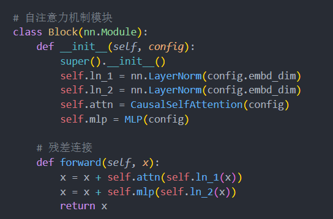

MLP层如下，和常规的MLP没有本质差别。

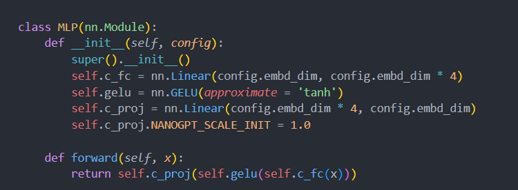

自注意力的定义如下，其中也定义了前向传播函数forward，由于dropout主要是用来防止过拟合的，而我的电脑硬件配置过低，在训练过程中并不会到达使其过拟合的阶段。同时它通过在训练过程中随机地“丢弃”（即设置为零）网络中的一些神经元来防止过拟合。这样会使训练只能训练到一部分参数，不利于训练收敛。由此，这里弃用了dropout。

```python
class CausalSelfAttention(nn.Module):

    def __init__(self, config):
        super().__init__()
        assert config.embd_dim % config.heads == 0

        self.c_attn = nn.Linear(config.embd_dim, 3 * config.embd_dim, bias=config.bias)
        # output projection
        self.c_proj = nn.Linear(config.embd_dim, config.embd_dim, bias=config.bias)
        self.c_proj.NANOGPT_SCALE_INIT = 1.0
        # regularization，没必要，用不到
        # self.attn_dropout = nn.Dropout(config.dropout)
        # self.resid_dropout = nn.Dropout(config.dropout)
        self.heads = config.heads
        self.embd_dim = config.embd_dim
        self.dropout = config.dropout
   
        self.flash = hasattr(torch.nn.functional, 'scaled_dot_product_attention')
        if not self.flash:
            print("WARNING: using slow attention. Flash Attention requires PyTorch >= 2.0")
      
            self.register_buffer("bias", torch.tril(torch.ones(config.block_size, config.block_size))
                                        .view(1, 1, config.block_size, config.block_size))

    def forward(self, x):
        B, T, C = x.size() 

        q, k, v  = self.c_attn(x).split(self.embd_dim, dim=2)
        k = k.view(B, T, self.heads, C // self.heads).transpose(1, 2) # (B, nh, T, hs)
        q = q.view(B, T, self.heads, C // self.heads).transpose(1, 2) # (B, nh, T, hs)
        v = v.view(B, T, self.heads, C // self.heads).transpose(1, 2) # (B, nh, T, hs)

        if self.flash:
            y = torch.nn.functional.scaled_dot_product_attention(q, k, v, attn_mask=None, dropout_p=self.dropout if self.training else 0, is_causal=True)
        else:
            # att = (q @ k.transpose(-2, -1)) * (1.0 / math.sqrt(k.size(-1)))
            # att = att.masked_fill(self.bias[:,:,:T,:T] == 0, float('-inf'))
            # att = F.softmax(att, dim=-1)
            # att = self.attn_dropout(att)
            # y = att @ v # (B, nh, T, T) x (B, nh, T, hs) -> (B, nh, T, hs)

            y = F.scaled_dot_product_attention(q, k, v,is_causal=True)


        y = y.transpose(1, 2).contiguous().view(B, T, C)

        y = self.c_proj(y)
        return y

```

## 实验结果及分析

由于硬件配置原因，我是在cpu上进行的训练。分布式数据并行DDP等提升训练性能的方法并没能实践上，因此训练并不是十分充分。

给出的训练代码部分如下，这里创建了一个简单的数据加载类，通过读取存储在txt文件中的数据集，然后使用tiktoken转换成编码，这里使用的是GPT-2的编码器。并且通过错位的方法，对输入的文本，使得y对应位置正好是x的单词的下一个单词，这样就可以利用y进行训练：

```python
class DataLoader:
    def __init__(self,B,T):
        self.B = B
        self.T = T
    
        with open('dataset-CalheirosMoroRita-2017.txt','r',encoding='utf-8') as f:
            text = f.read()
        enc = tiktoken.get_encoding('gpt2')
        tokens = enc.encode(text)
        self.tokens = torch.tensor(tokens)
        print(f"tokens: {self.tokens.size()}")
        print(f"1 epoch: {self.tokens.size(0) // (B * T)}")

        self.current_pos = 0

    def next_batch(self):
        if self.current_pos + self.B * self.T + 1 >= self.tokens.size(0):
            self.current_pos = 0
        buf = self.tokens[self.current_pos:self.current_pos + self.B * self.T + 1]
        x = buf[:-1].view(self.B, self.T)
        y = buf[1:].view(self.B, self.T)
        self.current_pos += self.B * self.T
        return x,y
```

主要的训练代码如下：

```python
model = GPT(GPTConfig())
# logits, loss = model(x,y)
# 开始训练
# 这个比adam好，修复了一些错误
# optimizer = torch.optim.AdamW(model.parameters(), lr=3e-4,betas=(0.9,0.95),eps=1e-8)
optimizer = model.configure_optimizers(weight_decay=0.1,betas=(0.9,0.95),learning_rate=6e-4,device_type='cpu')
loss_list = []
for i in range(num_epochs):
    start_t = time.time()
    optimizer.zero_grad()
    # for mico_step in range(grad_accum_steps):
    x,y = train_loader.next_batch()
    # with torch.autocast(device_type = 'cpu',dtype = torch.float16):
    logits, loss = model(x,y)
    # loss /= grad_accum_steps  
    # import code; code.interact(local=locals())
    loss.backward()
    #  梯度范数裁剪，防止有不好的样本导致较大的损害
    norm = torch.nn.utils.clip_grad_norm_(model.parameters(), 1.0)
```

每次训练后会将训练的参数保存起来，供测试时进行直接加载已经训练好的参数。

在测试代码中，不断依据已经存在的文本去预测下一个单词，然后添加进结果中，直到达到规定的最大数目：

```python
from GPT import *


def generate(x, max_length):
    import tiktoken
    enc = tiktoken.get_encoding('gpt2')
    x = enc.encode(x)
    x = torch.tensor(x,dtype = torch.long)
    x = x.unsqueeze(0)
    torch.manual_seed(42)
    while x.size(1) < max_length:
        with torch.no_grad():
            logits = model(x)
            logits = logits[0][:, -1, :]
            probs = F.softmax(logits, dim=-1)
            ix = torch.multinomial(probs, num_samples=1)
            x = torch.cat((x, ix), dim=1)
    tokens = x[0][:max_length].tolist()
    decoded = enc.decode(tokens)
    return decoded
model = GPT(GPTConfig())
model.load_state_dict(torch.load('gpt_model_params2.pth', weights_only=True))

while True:
    x = input(">>>")
    decode = generate(x, 20)
    print(">", decode)
```

首先加载莎士比亚的测试集，迭代训练2000次(在我的电脑上跑了两个半小时)，loss函数如下：

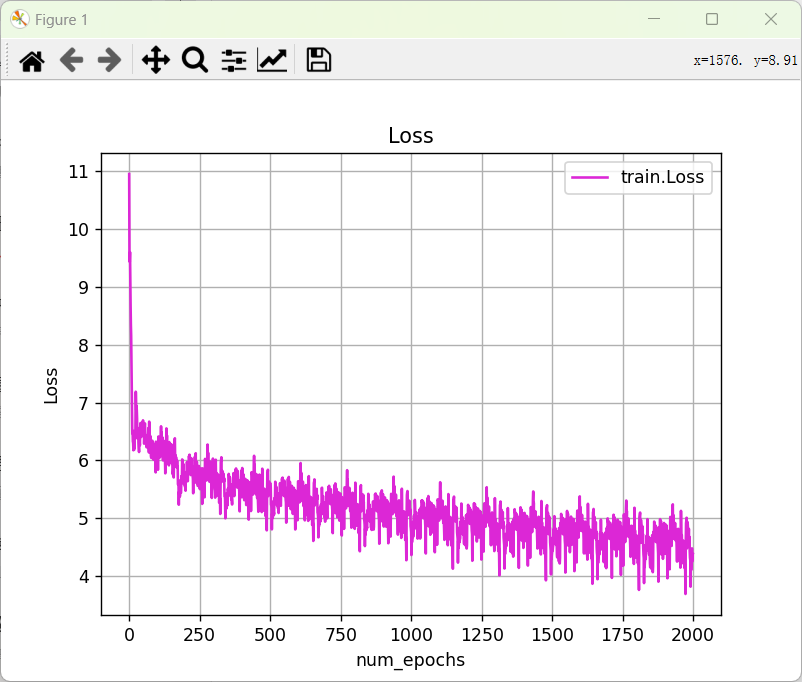

可以看到loss是在不断下降的。

进行测试，生成效果如下：

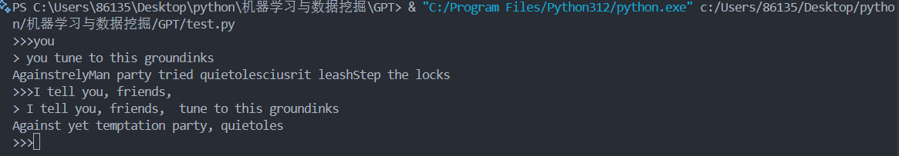

可以看到效果并不好，并不能依据给定的开头生成通顺的句子。

继续加大迭代次数，迭代5000次：

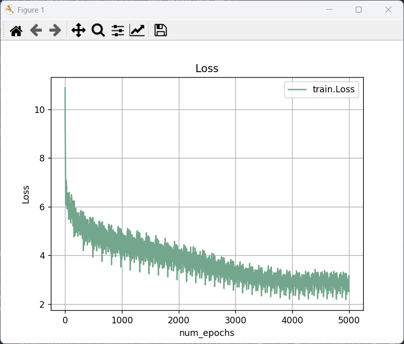

对比2000次的损失曲线，可以看到损失函数进一步减小。

再次测试：

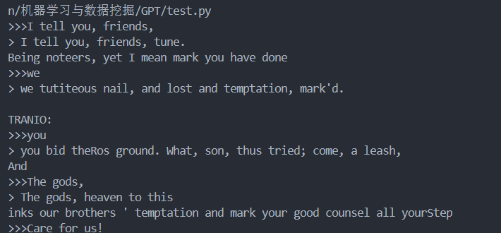

又经过多次测试，发现迭代5000次的模型可能稍微好一些，因为它至少在尝试构建对话上下文。然而，两个文本片段在语义连贯性、语法正确性、可读性和上下文相关性方面都存在问题。

为了作比较，加载了库中提供的GPT-2的参数进行测试：

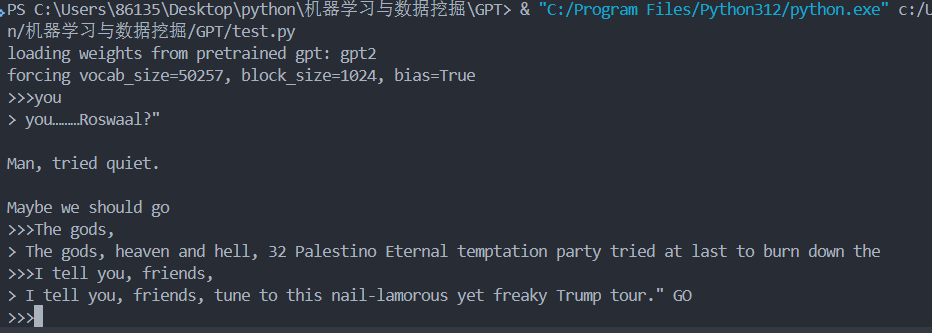

经过多次测试，可以看到加载的GPT-2的生成效果也不是很好。语句也并不连贯。

考虑可能是莎士比亚文本集本身生成的文本本身晦涩，并且数据集过于大，对数据集的训练并不充分，因此换一个用户评价的数据集，此训练集远远小于莎士比亚文本集，进行训练，迭代2000次。

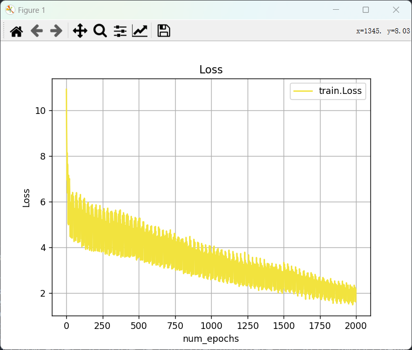

可以看到由于训练集变小了很多，训练时模型收敛速度也快了不少。

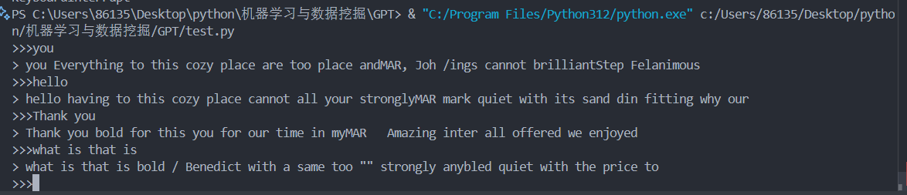

经过多次测试，感觉效果依旧是不理想，虽然可以生成连贯的词组，但没有办法生成连贯的语句。并且前后语境也并不搭配。

继续缩小数据集，考虑一个比较夸张的情况，使用一个十分微型的数据集（仅400-500个字符），同时调整输入规模的参数，迭代1000次，训练loss曲线如下：

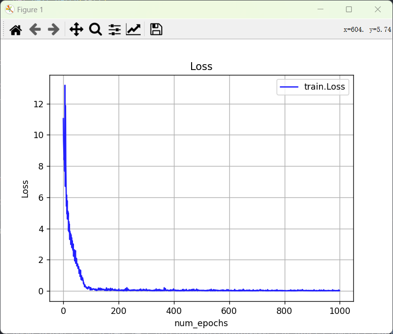

可以看到，由于数据集变得更小了，训练收敛速度更快。

训练效果如下：

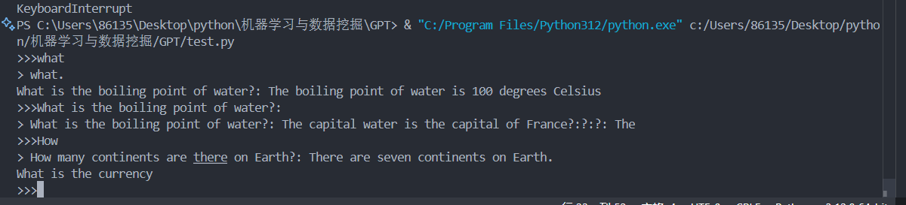

可以看到，此时可以正常生成句子，但上下文关联度还不高，但相比于前面庞大的训练集的效果，这个训练效果可以说相当好。经过更多次实验，可以发现当开头提示更广泛时，由于训练集太小，无法训练到这种情况，会导致出现“胡言乱语”的情况，如下：

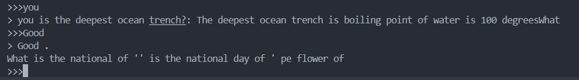

## 原因分析

推测可能的原因还是硬件性能导致的训练效率过低，整个训练集并没有“完全”进行充分迭代，导致训练结果并不理想。如果继续增加迭代次数，则要花费更多的时间开销，可能要训练更多的时间，由于时间紧张，我没能进行充足的训练，导致实验结果并不理想。

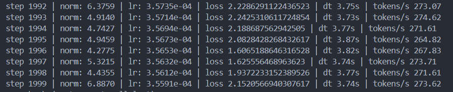

从上面的训练过程中的输出信息可以看到，cpu每秒只能处理270左右的tokens，这个处理能力比较低效，导致模型训练并不充分，效果并不理想。

其次，GPT-2的架构及其设计本身也存在一些局限性和潜在的问题。通过预加载GPT-2的模型参数，发现效果也并不好，生成的句子也是不连贯。实际上，GPT-2模型虽然有时能够生成看似连贯的文本，但它们并不真正理解所生成文本的含义。这些模型基于统计模式而非对主题的真实理解，这使得它们在需要真实世界知识的关键应用中不可靠。尤其是GPT-2模型可能会表现出偏见，在生成某些的文本时，可能会反映出训练数据中的偏见。而我的模型参数规模是基于GPT-2搭建的，（如果构建更复杂的模型，需要更大规模的参数，而我的硬件更加不支持。）所选的模型本身的局限性也导致了效果的不理想。

当训练集变小时，由于训练更充分，在训练集有关的文本生成效果更加好，但训练集之外的文本生成效果就不尽如人意。这其实本质上就是训练集过小导致的局限。

考虑到游戏中一个npc的文本并没有十分庞大，只是局限于自己一个角色有关的文本。那么此次实验还是有意义的，对于我要解决的问题，并不需要训练一个面面俱到的文本生成模型，而只要针对特定的文本库能够进行生成即可。而我通过此次实验证明通过比较小的代价（尽管对我来说时间开销依旧很大，不过考虑到硬件方面的问题，开销确实比较小）训练一个可以在微型数据集上生成连贯文本的文本生成模型。此次实验也让我认识到GPT模型的不足，即它在上下文本的关联性方面表现有缺陷，并不能准确把握整段文本的语义连贯。

## 总结

通过此次实验，我迈出对游戏中智能体在文本交互应用中的一个小尝试。虽然训练效果并不是十分满意，不过依旧是有所收获。这次实验验证了在小训练集上以较小代价训练文本生成模型的可能性，为后续更深入的研究积累经验。在深入了解了GPT模型的优势以及存在的问题，将课堂上的知识点进行了实践，可以说学习到了很多。

代码说明：GPT.py存放模型实现代码，train.py训练模型存放训练代码，test.py存放测试代码，训练参数保存在pth文件中，由于参数文件过大，并且很大部分训练效果并不理想，因此这里只放了gpt_model_params7是在莎士比亚集上迭代5000次的模型参数。
