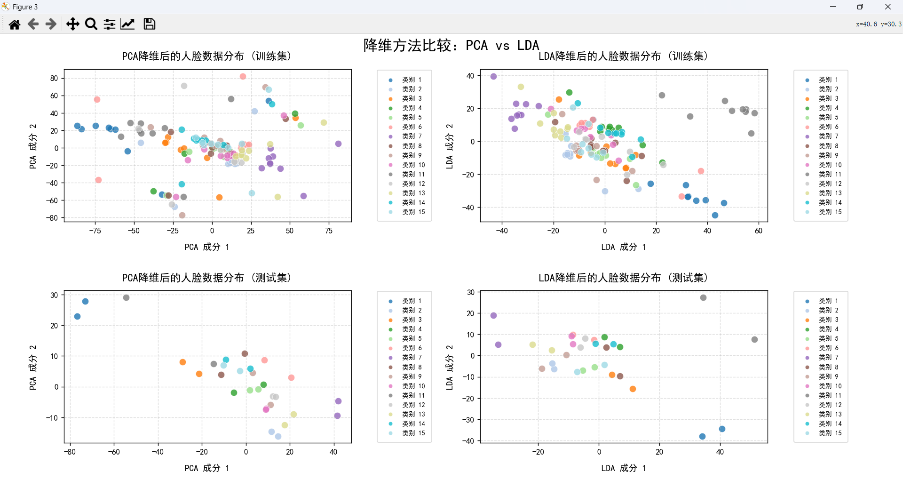
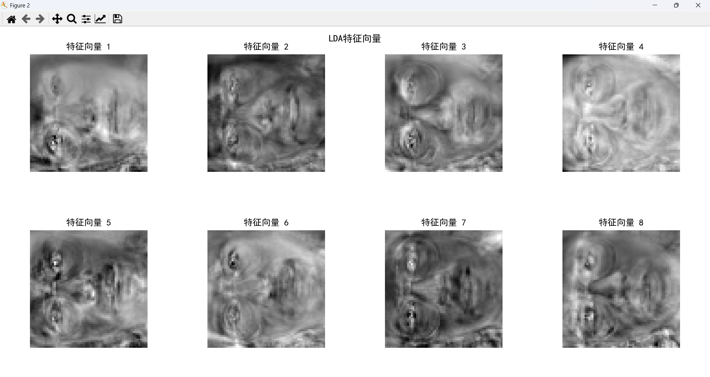
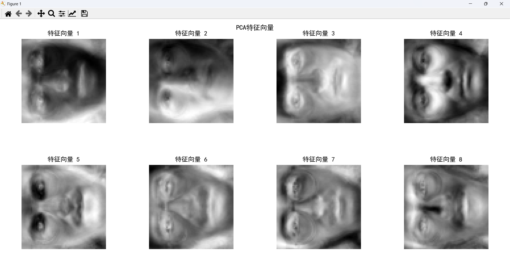
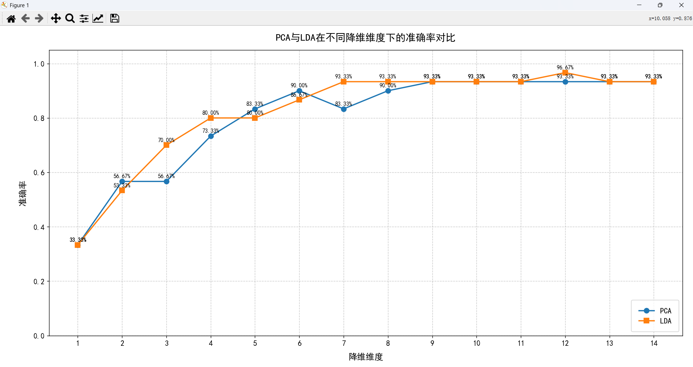
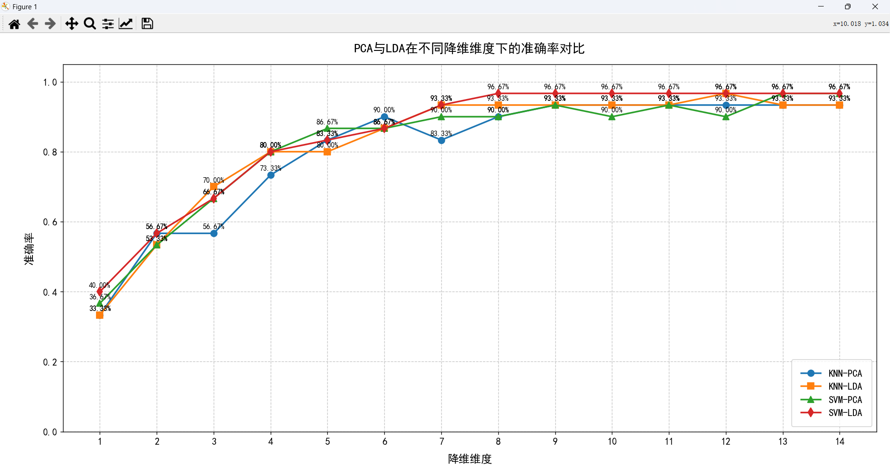

# 实验2：基于 PCA/LDA 和 KNN 的人脸识别

学号：22320021  姓名：陈安康

## 实现PCA接口

实现一个PCA类进行对数据降维处理。通过线性变换将原始高维数据映射到一个新的低维空间，使得投影后的数据在前几个维度上的方差最大，从而保留尽可能多的原始信息。实现两个主要函数fit和transform。

fit函数用来训练得到PCA的各种关键组件（投影矩阵，均值等）。对于传入的训练集数据，对数据进行去中心化：

$$
X 
_{centered}

 =X−μ
$$

计算协方差矩阵：

$$
C= 
\frac{1}{n-1}

 X _{centered}^T

 X _{centered}
$$

由线性代数的知识可知，对应最大特征值的特征向量方向是让方差最大的方向。以此类推，对应前k个最大特征值的特征向量就是让方程最大的前k个特征方向。对协方差矩阵进行奇异值分解（SVD分解），按传入参数要求选择左奇异向量(U)的前k个主成分组成投影矩阵（由于SVD分解会自动进行排序，所以不需要额外依照奇异值排序）:

$$
C=UΣV 
^T
$$

$$
W=U 
_{:,1:k}
$$

transform用于将PCA训练的结果作用于传入的数据集上进行降维(投影到降维后的空间中)。对于传入的数据，首先利用训练集的均值进行去中心化，这是为了防止数据泄露，然后用之前训练出来的降维矩阵与数据进行作用，得到降维后的数据。

$$
X_{pca} = W(X - X_{trainMean})
$$

实现代码如下：

```python
class PCA:
    def __init__(self, n_components=None):
        self.n_components = n_components
        self.components_ = None  # 主成分（特征向量）
        self.mean_ = None        # 均值
        self.explained_variance_ = None         # 特征值
        self.explained_variance_ratio_ = None   # 特征值比例

    def fit(self, X):
        # 1. 去中心化
        self.mean_ = np.mean(X, axis=0)
        X_centered = X - self.mean_
        n_samples = X.shape[0]

        # 2. 计算协方差矩阵
        cov_matrix = np.dot(X_centered.T, X_centered) / (n_samples - 1)

        # 3. 使用 SVD 分解协方差矩阵
        U, S, Vt = np.linalg.svd(cov_matrix)

        # 4. 选择前 n_components 个主成分
        if self.n_components is None:
            self.n_components = X.shape[1]

        self.components_ = U[:, :self.n_components].T  # 每一行为一个主成分
        self.explained_variance_ = S[:self.n_components]
        self.explained_variance_ratio_ = self.explained_variance_ / np.sum(S)

        return self

    def transform(self, X):
        # 5. 投影到主成分上
        X_centered = X - self.mean_
        return np.dot(X_centered, self.components_.T)

    def fit_transform(self, X):
        self.fit(X)
        return self.transform(X)
```

## 实现LDA接口

LDA是一种有监督的线性降维方法，目标是找到一个线性投影，使得  **类间距离最大** ， **类内距离最小** ，从而在低维空间中保留判别性结构。由于受到类别约束，其最多只能降维到类别数-1维。

实现步骤如下：

设样本共有 $C$ 个类别，第 $i$ 类的样本为 ${x_1^{(i)}, x_2^{(i)}, \dots, x_{n_i}^{(i)}}$，共有 $n_i$ 个样本。首先求出每一个类的均值和总体的均值：

$$
\mu_i = \frac{1}{n_i} \sum_{j=1}^{n_i} x_j^{(i)}
$$

$$
\mu = \frac{1}{N} \sum_{i=1}^C \sum_{j=1}^{n_i} x_j^{(i)}
$$

然后计算类内散度矩阵$S_W$和类间散度矩阵$S_B$。这两个矩阵分别体现了类内与类间的“紧凑程度”：

$$
S_W = \sum_{i=1}^C \sum_{j=1}^{n_i} (x_j^{(i)} - \mu_i)(x_j^{(i)} - \mu_i)^T
$$

$$
S_B = \sum_{i=1}^C n_i (\mu_i - \mu)(\mu_i - \mu)^T
$$

然后构建广义特征值问题，我们的目标是减小类内差异，增大类间差异。由此设我们的降维矩阵为W，目标是最大化Fisher判别标准：

$$
J(W) = \frac{|W^T S_B W|}{|W^T S_W W|}
$$

使得上述目标最大化的W，对应以下问题的解，因此问题变成求$S_W^{-1}S_B$的特征向量：

$$
S_B w = \lambda S_W w
$$

之后选取前k个最大特征值对应的特征向量即可组成投影矩阵。将得到投影矩阵后，之后将传入的数据与投影矩阵作用，投影到对应维度的空间完成降维。

代码如下：

```python
class LDA: 
    def __init__(self, n_components=None):
        self.n_components = n_components
        self.means_ = None  # 每个类别的均值向量
        self.priors_ = None  # 每个类别的先验概率
        self.components_ = None  # 投影矩阵
        self.classes_ = None  # 类别标签
  
    def fit(self, X, y):
        n_samples, n_features = X.shape
  
        # 1. 获取唯一的类别标签
        self.classes_, y_indices = np.unique(y, return_inverse=True)
        n_classes = len(self.classes_)
  
        # 2. 计算每个类别的均值向量和先验概率
        self.means_ = np.zeros((n_classes, n_features))
        self.priors_ = np.zeros(n_classes)
  
        for i, c in enumerate(self.classes_):
            X_c = X[y == c]
            self.means_[i] = np.mean(X_c, axis=0)
            self.priors_[i] = X_c.shape[0] / n_samples
  
        # 3. 计算类内散度矩阵 Sw
        Sw = np.zeros((n_features, n_features))
        for i, c in enumerate(self.classes_):
            X_c = X[y == c]
            X_centered = X_c - self.means_[i]
            Sw += np.dot(X_centered.T, X_centered)
  
        # 4. 计算类间散度矩阵 Sb
        overall_mean = np.mean(X, axis=0)
        Sb = np.zeros((n_features, n_features))
        for i in range(n_classes):
            n_c = np.sum(y == self.classes_[i])
            mean_diff = self.means_[i] - overall_mean
            Sb += n_c * np.outer(mean_diff, mean_diff)
  
        # 5. 计算 Sw^-1 * Sb 的特征值和特征向量
        # 为避免奇异性问题，可以添加一个小的正则化项
        Sw_reg = Sw + np.eye(n_features) * 1e-4
  
        # 求解广义特征值问题
        try:
            eigenvalues, eigenvectors = np.linalg.eigh(np.linalg.inv(Sw_reg).dot(Sb))
        except np.linalg.LinAlgError:
            # 如果矩阵不可逆，使用伪逆
            Sw_inv = np.linalg.pinv(Sw_reg)
            eigenvalues, eigenvectors = np.linalg.eigh(Sw_inv.dot(Sb))
  
        # 6. 特征值和特征向量按降序排序
        idx = np.argsort(eigenvalues)[::-1]
        eigenvalues = eigenvalues[idx]
        eigenvectors = eigenvectors[:, idx]
  
        # 7. 选择前n_components个特征向量
        if self.n_components is None:
            self.n_components = min(n_features, n_classes - 1)
        else:
            self.n_components = min(self.n_components, n_classes - 1)
  
        self.components_ = eigenvectors[:, :self.n_components].T
  
        return self
  
    def transform(self, X):
        return np.dot(X, self.components_.T)
  
    def fit_transform(self, X, y):
        self.fit(X, y)
        return self.transform(X)
```

## 利用PCA和LDA进行数据降维

使用给定代码将数据加载之后，利用前文实现的PCA和LDA类进行数据降维，流程如下：

```python
    # 加载数据（自动分割训练/测试集）
    train_data,train_label,test_data,test_label = load_data(r'C:\Users\86135\Desktop\模式识别\22320021_陈安康_模式识别_homework02\Yale_64x64.mat')
    # 任务三
    pca = PCA(n_components=2)
    lda = LDA(n_components=2)
    trainPca = pca.fit_transform(train_data)
    trainLda = lda.fit_transform(train_data, train_label)

    visualize_eigenvectors(pca.components_, "PCA特征向量", n_components=8, img_shape=(64, 64))
    visualize_eigenvectors(lda.components_, "LDA特征向量", n_components=8, img_shape=(64, 64))
  
    visualize_2d_data(trainPca, train_label, 
                     "PCA降维后的人脸数据分布 (训练集)", "PCA")
    visualize_2d_data(trainLda, train_label,  
                     "LDA降维后的人脸数据分布 (训练集)", "LDA")
  
    testPca = pca.transform(test_data)
    testLda = lda.transform(test_data)
    visualize_2d_data(testPca, test_label,
                     "PCA降维后的人脸数据分布 (测试集)", "PCA")
    visualize_2d_data(testLda, test_label,
                     "LDA降维后的人脸数据分布 (测试集)", "LDA")
```

降维后2维效果图展示如下：



从图中可以看到，LDA相比于PCA，相同类别的样本聚集在了一起，而PCA则没有这种特点。这反映LDA考虑了标签信息，其目标是使得经过降维后的数据能够更好地区分不同类别，但其同时也因为类别种类的桎梏，最多只能降维到类别种类-1维。而PCA没有考虑标签信息，其目标是最大化数据方差，以保留更多的信息。无论哪种方式，训练集和测试集的分布一致性较好，说明降维效果的有效性。

降维后前8个特征向量变换回原来图像的大小的展示图如下：





每一个特征向量都代表了脸部的不同的特征。

## 利用 KNN 算法进行训练和测试

使用KNN进行训练和测试，KNN 是一种基于实例的监督学习算法，它的核心思想是一个样本的类别由它在特征空间中最近的 K 个邻居的类别决定。其训练过程简单的将训练集进行存储，预测时选择前K个距离待预测点最近的邻居进行多数表决投票，获得票数最多的类别作为预测类别。

实现代码如下：

```python
class KNNClassifier:
    def __init__(self, n_neighbors=5, metric='euclidean'):
        self.n_neighbors = n_neighbors
        self.metric = metric
    
        # 训练数据
        self.X_train = None
        self.y_train = None

    def fit(self, X_train, y_train):
        self.X_train = np.asarray(X_train)
        self.y_train = np.asarray(y_train)
    
        if self.X_train.shape[0] != self.y_train.shape[0]:
            raise ValueError("特征和标签样本数量不一致")
    
        return self

    def _compute_distances(self, x):
        if self.metric == 'euclidean':
            return np.sqrt(np.sum((self.X_train - x) ** 2, axis=1))
        elif self.metric == 'manhattan':
            return np.sum(np.abs(self.X_train - x), axis=1)
        else:
            raise ValueError("不支持的度量方式")

    def predict(self, X_test):
        X_test = np.asarray(X_test)
        if X_test.ndim == 1:
            X_test = X_test.reshape(1, -1)
        
        predictions = []
        for x in X_test:
            distances = self._compute_distances(x)
            k_indices = np.argsort(distances)[:self.n_neighbors]
            k_nearest_labels = self.y_train[k_indices]
            most_common = Counter(k_nearest_labels).most_common(1)
            predictions.append(most_common[0][0])
    
        return np.array(predictions)
    
    def accuracy(self, y_true, y_pred):
        y_true = np.asarray(y_true)
        y_pred = np.asarray(y_pred)
    
        if y_true.shape != y_pred.shape:
            raise ValueError("真实标签和预测标签的形状不一致")
        
        # 计算准确率：正确预测的样本数 / 总样本数
        return np.mean(y_true == y_pred)
```

测试得到准确率-降维维度图表如下：



从表中分析可以得知，PCA和LDA的预测效果没有太大差距。但LDA由于其受到类别种类的限制，其最多只能降维到类别数-1维。随着维度增加，准确率在不断提升，这与预期情况一致，当投影到维度更多的空间时，保留的信息也就更多，预测也就会更加准确。随着维度的增加，准确率维持在93.3%左右，这是因为KNN是一种简单的分类器，其分类能力的上限导致预测准确率不能有更进一步的提升。

作为对比，通过调库实现了SVM分类器，两者同时使用降维后的数据进行预测，降维维度和准确率曲线如下：



通过这次图像可以看到，LDA相比于PCA的效果要好一些，这是因为LDA考虑到了标签的信息。对比不同的分类器，发现SVM的分类能力相比于KNN要强一些，SVM最终分类准确率可以达到96.6%，而KNN为93.3%。

## 总结

通过这次实验，我系统回顾了LDA和PCA的降维思想和原理，并进行了手动的代码实现。并进行了呈现，分析对比了LDA和PCA的不同之处以及各自的优点。同时实现了KNN分类器，对数据进行分类，分析了降维维度和准确率之间的关联，即随着维度提升，准确率不断提升，分类器的性能最终会成为瓶颈。随后我又比较了SVM和KNN的性能表现，并进行分析。此次实验我学习到了很多模式识别的知识并应用于实践，受益匪浅。
