# 半监督图像分类

学号：22320021   姓名：陈安康

在实际应用中，人工标注数据成本高昂，而海量的无标签数据触手可及。半监督学习应运而生。半监督学习（Semi-Supervised Learning, SSL）是机器学习领域的一个重要分支，旨在利用少量有标签数据（Labeled Data, **D**L）和大量易于获取的无标签数据（Unlabeled Data, **D**U）来训练高性能模型。

## 模型介绍

### Mixmatch

MixMatch 作为 2019 年 NeurIPS 论文《MixMatch: A Holistic Approach to Semi-Supervised Learning》中提出的一种方法，以其巧妙地整合多种有效策略而著称，在当时的半监督学习基准测试中取得了领先的性能。

#### 核心思想与操作

MixMatch 之所以被称为“整体性方法”，在于它有机地融合了深度半监督学习的四大核心思想： **一致性正则化、熵最小化、数据增强** ，并创造性地引入了 **Mixup** 。

数据增强（Data Augmentation, DA）是指通过对现有数据进行各种变换来生成新的训练样本，从而扩大训练数据集的多样性，提高模型的泛化能力。MixMatch 使用了多种标准的图像数据增强技术，例如随机翻转、裁剪、颜色抖动等。这些增强技术能够模拟真实世界中数据可能遇到的各种变异。

一致性正则化（Consistency Regularization, CR）是指如果一个样本经过微小的扰动（例如，添加噪声，或者进行数据增强），它所属的类别不应该改变，模型对其的预测也应该保持一致。基于这个思想，Mixmatch在对无标签数据进行K次增强后会进行求取平均值的操作，因为由于一致性正则化的假设，所有经过扰动的样本应该保持一致性，若某些个别的增强导致分布差异过大，那么就会被认为是“噪声”，通过取平均值的方式相当于淡化噪声影响，进行去噪。同时，有标签数据的一次增强也是一种弱形式的一致性正则化，旨在提高模型对有标签数据扰动的鲁棒性。

熵最小化 （Entropy Minimization, EM）的核心思想是低密度分离假设 (Low-Density Separation Assumption)，是指分类器的决策边界应该位于数据点稀疏的区域，而不是高密度的数据簇中。为了实现这一点，模型应该对无标签数据做出高置信度的预测，即输出的概率分布应该尽可能地“尖锐”。在Mixmatch中，这种方法的体现就是温度锐化(Temperature Sharpening)。MixMatch 在计算得到无标签样本的平均概率分布 qˉ 后，会对其进行温度锐化处理，得到软伪标签 q。其中其中 **T** 是一个小于 1 的超参数（原论文设为 0.5）。

$$
q_i = \frac{\bar{q}_i^{1/T}}{\sum_{j=1}^{C} \bar{q}_j^{1/T}}
$$

温度锐化正是为了让 高概率的类别概率更高，低概率的类别概率更低 。这 人为地增大了模型对无标签样本预测的置信度 。这样做是鼓励模型在处理无标签数据时更加“自信”，明确地将它们归类到某个簇，而不是让它们模糊地位于类别边界。这有助于决策边界远离无标签数据点密集的区域。

Mixup的核心思想是通过线性插值混合两个不同的训练样本及其对应的标签，来生成新的“虚拟”训练样本。

$$
\tilde{x} = \lambda x_i + (1 - \lambda) x_j
$$

$$
\tilde{y} = \lambda y_i + (1 - \lambda) y_j
$$

其中 **λ** 是从 Beta 分布中采样的。MixMatch将有标签数据和无标签数据（及其平均并锐化后的软伪标签）混合在一起，再进行 Mixup。这意味着无标签数据及其伪标签也参与到这种“插值学习”中。Mixup 迫使模型在输入空间中学习线性插值行为。当模型被要求对一个介于两个类别之间的混合样本（例如，“半猫半狗”的图片）输出一个对应的混合概率（例如，“0.7猫 + 0.3狗”的软标签）时，它不能学习一个陡峭的、硬性的决策边界。相反，它必须学习到当输入从一个类别逐渐“滑动”到另一个类别时，其输出的预测也应该 平滑地、按比例地过渡。此外，由于有标记的数据过于少，一些可能的分类结果或许没能涉及到，而Mixup操作可以看成对这部分可能得训练结果的补全。Mixup 创造的这些中间样本提供了额外的训练信号，使得模型能够更好地理解数据分布的连续性，从而学习到更通用、更少过拟合的决策边界。强制学习平滑性，模型对输入中的微小扰动变得不那么敏感，从而提高了泛化能力和对噪声的鲁棒性。

#### 具体流程

综合上面的核心内容，Mixmatch的伪代码如下：

```python
Function Sharpen(p, T):
  # p: 类别概率分布 (e.g., [0.6, 0.3, 0.1])
  # T: 温度参数 (e.g., 0.5)
  
  # 对每个概率值 p_i 进行指数操作并除以温度T
  p_sharpened = p^(1/T)
  
  # 归一化，确保和为1，形成新的概率分布
  return p_sharpened / sum(p_sharpened)

Function Mixup(x_1, y_1, x_2, y_2, alpha):
  # x_1, x_2: 两个输入样本
  # y_1, y_2: 两个输入样本对应的标签 (one-hot 或 软标签)
  # alpha: Beta 分布参数
  
  # 从 Beta(alpha, alpha) 分布中采样 lambda
  lambda_val = SampleFromBeta(alpha, alpha)
  
  # 确保 lambda 不会太小，以避免退化到原始样本 (论文中的技巧)
  lambda_val = max(lambda_val, 1 - lambda_val)
  
  # 线性插值生成新的混合样本和混合标签
  x_tilde = lambda_val * x_1 + (1 - lambda_val) * x_2
  y_tilde = lambda_val * y_1 + (1 - lambda_val) * y_2
  
  return x_tilde, y_tilde

// 初始化模型参数 model
// 初始化优化器 Optimizer

For epoch from 1 to num_epochs:
  For each batch_L from DataLoader(D_L) and batch_U from DataLoader(D_U):
    // batch_L 包含 B_L 个 (x_l, y_l) 样本
    // batch_U 包含 B_U 个 u 样本

    // ---------- Step 1: 准备无标签数据的软伪标签 (一致性正则化 & 熵最小化) ----------
    U_hat = [] // 存储无标签样本及其软伪标签 (u, q_sharpened)
    For each u_m in batch_U:
      P_u_list = [] // 存储 K 次增强的预测概率分布
      For k from 1 to K:
        u_m_aug = Augment(u_m)       // 对无标签样本进行随机增强
        P_u_list.append(model(u_m_aug)) // 获取模型预测概率分布
  
      avg_P_u = sum(P_u_list) / K   // 对 K 次预测结果取平均 (平滑预测)
      q_sharpened = Sharpen(avg_P_u, T) // 应用温度锐化 (熵最小化)
  
      U_hat.append((u_m, q_sharpened)) // 将原始无标签样本与软伪标签配对

    // ---------- Step 2: 准备有标签数据的增强版本 ----------
    L_hat = [] // 存储增强后的有标签样本 (x_l_aug, y_l)
    For each (x_l, y_l) in batch_L:
      x_l_aug = Augment(x_l) // 对有标签样本进行一次随机增强
      L_hat.append((x_l_aug, y_l))

    // ---------- Step 3: 合并数据并打乱，为 Mixup 做准备 ----------
    W = L_hat + U_hat // 合并所有有标签和无标签的 (样本, 标签/伪标签) 对
    Shuffle(W)       // 随机打乱 W

    // ---------- Step 4: 执行 Mixup 操作 ----------
    X_mixed = [] // 存储 Mixup 后的混合样本
    Y_mixed = [] // 存储 Mixup 后的混合标签/伪标签

    // 对有标签数据执行 Mixup
    For each (x_l, y_l) in L_hat:
      (x_w, y_w) = ChooseRandom(W) // 从混合池 W 中随机选择一个样本
      x_tilde, y_tilde = Mixup(x_l, y_l, x_w, y_w, alpha)
      X_mixed.append(x_tilde)
      Y_mixed.append(y_tilde)
  
    // 对无标签数据执行 Mixup
    For each (u_m, q_m) in U_hat:
      (x_w, y_w) = ChooseRandom(W) // 从混合池 W 中随机选择一个样本
      u_tilde, q_tilde = Mixup(u_m, q_m, x_w, y_w, alpha)
      X_mixed.append(u_tilde)
      Y_mixed.append(q_tilde)

    // 将 Mixup 后的数据分割回有标签和无标签部分
    X_L_mixed = X_mixed[:B_L]
    Y_L_mixed = Y_mixed[:B_L]
    X_U_mixed = X_mixed[B_L:]
    Y_U_mixed = Y_mixed[B_L:] // 这里的 Y_U_mixed 是软伪标签

    // ---------- Step 5: 计算总损失并更新模型 ----------
  
    // 计算监督损失 (针对 Mixup 后的有标签数据)
    predictions_L = model(X_L_mixed)
    loss_supervised = CrossEntropyLoss(predictions_L, Y_L_mixed)

    // 计算无监督损失 (针对 Mixup 后的无标签数据)
    predictions_U = model(X_U_mixed)
    loss_unsupervised = MeanSquaredError(predictions_U, Y_U_mixed)

    // 计算总损失
    total_loss = loss_supervised + lambda_u * loss_unsupervised

    // 执行反向传播和优化器更新
    Optimizer.zero_grad()
    total_loss.backward()
    Optimizer.step()
```

### Fixmatch

FixMatch 是由 Google Brain 在 2020 年提出的半监督学习（SSL）算法，论文名为《FixMatch: Simplifying Semi-Supervised Learning with Consistency and Confidence》。正如其标题所示，FixMatch 的目标是简化现有的 SSL 方法（如 MixMatch 和 ReMixMatch），同时达到甚至超越最先进的性能。

#### 核心思想及方法

Fixmatch将数据增强的操作进行进一步划分，将数据增强操作按照对样本施加的变换的程度分为弱增强和强增强。弱增强是对图像施加轻微、语义不变的变换。弱增强用于生成无标签数据的伪标签。由于其变换程度小，模型对其预测的类别通常更稳定、更可靠，以此作为生成伪标签的基础。弱增强包含随机水平翻转、随机平移/裁剪等。

强增强是对图像施加**更剧烈、更激进**的变换，可能导致图像的语义信息在视觉上变得模糊或扭曲，但其核心类别依然不变。强增强旨在用于训练模型，强制模型即使在面对高度扰动的输入时，也能保持对原始类别的一致性预测。强增强包括RandAugment、CTAugment 等复杂策略，这些策略通常会组合多种基本变换（如颜色抖动、对比度调整、Cutout 等），并随机选择其强度。

在生成无标签数据的伪标签时，Fixmatch采取了和Mixmatch不同的方法。对于无标签样本，Fixmatch首先对其进行一次弱增强，然后通过训练模型获取样本的预测分布，Fixmatch通过设置一个置信度阈值，当分布的最高概率是否超过这个置信度阈值，若超过，则把最高概率对应的标签作为该无标签样本的硬伪标签；若没有，则此无标签样本不会参与本轮损失函数计算，相当于在本轮中被“抛弃”了。相比于Mixmatch使用软伪标签，Fix使用硬伪标签，这可以被看作是一种更激进的熵最小化策略 。MixMatch 使用温度锐化来“强制”模型更加自信，但依然保留了软标签；而 FixMatch 则直接说“如果你不够自信（低于阈值），那我就不用你的伪标签”。这极大地减少了错误伪标签的传播，因为它直接丢弃了那些模型认为不确定的样本。

在伪标签生成步骤之后，Fixmacth舍弃了Mixup操作，对于有标签数据，Fixmatch使用弱增强进行作用，然后计算弱增强后的预测值与标签的交叉熵损失。对于通过置信度阈值筛选的无标签数据，Fixmatch对其进行强增强作用，然后计算强增强后的预测值与伪标签的交叉熵损失，两者的和作为总损失。

相比于Mixmatch，FIxmatch在其流程上对其组件进行了精简，同时引入强弱增强以及置信度阈值等思想。FixMatch 明确区分了弱增强用于生成伪标签（可靠性），和强增强用于训练模型（鲁棒性）。这种分工使得模型能够从弱增强中获取稳定的监督信号，同时通过强增强学习到对剧烈扰动的不变性。置信度阈值的设计则是在Mixmatch的软标签上更激进，更加强调了熵最小化的思想。Fixmatch大大简化了训练过程和模型设置，但凭借更创新性的组件优化实现了更加好的效果。

#### 具体流程

Fixmatch的具体流程如下：

```
Function WeakAugment(img):
  # 对图像进行轻微、语义不变的变换
  # 示例:
  #   - 随机水平翻转 (50% 概率)
  #   - 随机平移/裁剪 (例如，最大平移 12.5% 像素)
  return augmented_img

Function StrongAugment(img):
  # 对图像进行更剧烈、更激进的变换
  # 示例:
  #   - RandAugment 或 CTAugment 等复杂策略
  #   - 可能包含颜色抖动、对比度调整、锐化、Cutout 等多种组合
  return augmented_img

// 初始化模型参数 model
// 初始化优化器 Optimizer
// 初始化学习率调度器 (可选)

For epoch from 1 to num_epochs:
  For each batch_L from DataLoader(D_L) and batch_U from DataLoader(D_U):
    // batch_L 包含 B 个 (x_l, y_l) 样本
    // batch_U 包含 μB 个 u 样本

    // ---------- Step 1: 计算监督损失 (Labeled Loss) ----------
    loss_supervised = 0
    For each (x_l, y_l) in batch_L:
      x_l_weak_aug = WeakAugment(x_l) # 对有标签样本进行弱增强
      prediction_l = model(x_l_weak_aug)
      loss_supervised += CrossEntropyLoss(prediction_l, y_l)
    loss_supervised = loss_supervised / B # 对批次内样本求平均

    // ---------- Step 2: 计算无监督损失 (Unlabeled Loss) ----------
    loss_unsupervised = 0
    unlabeled_samples_count = 0

    For each u_m in batch_U:
      // a. 生成伪标签 (使用弱增强和置信度阈值)
      u_m_weak_aug = WeakAugment(u_m) # 对无标签样本进行弱增强
      q_b = model(u_m_weak_aug)       # 获取模型预测概率分布

      max_prob = max(q_b)             # 获取预测的最高概率
      hard_pseudo_label = argmax(q_b) # 获取最高概率对应的硬标签 (one-hot 形式)

      // b. 置信度筛选: 只有高置信度的样本才参与无监督损失计算
      If max_prob >= tau:
        // c. 计算一致性损失 (使用强增强和硬伪标签)
        u_m_strong_aug = StrongAugment(u_m) # 对相同的无标签样本进行强增强
        prediction_u_strong = model(u_m_strong_aug)
  
        # 计算强增强预测与硬伪标签的交叉熵损失
        loss_unsupervised += CrossEntropyLoss(prediction_u_strong, hard_pseudo_label)
        unlabeled_samples_count += 1
  
    // 对参与计算的无标签样本求平均 (避免除以零，若无样本通过筛选)
    If unlabeled_samples_count > 0:
      loss_unsupervised = loss_unsupervised / unlabeled_samples_count
    Else:
      loss_unsupervised = 0 # 如果没有样本通过筛选，无监督损失为0

    // ---------- Step 3: 计算总损失并更新模型参数 ----------
    total_loss = loss_supervised + lambda_u * loss_unsupervised

    Optimizer.zero_grad()      # 清除梯度
    total_loss.backward()      # 反向传播计算梯度
    Optimizer.step()           # 更新模型参数
    // (可选) scheduler.step() # 更新学习率
```

## TorchSSL代码解读

TorchSSL 是基于 PyTorch 的半监督学习工具包，提供了9种流行的半监督学习算法的实现。该项目旨在为半监督学习研究提供公平的比较基准和便捷的开发环境。

TorchSSL提供了运行半监督算法的所有组件。算法实现放在models文件夹下；通用数据集处理模块放在datasets文件夹下，支持集成数据集划分、数据集加载和预处理以及数据增强策略；各模型的训练脚本则放在根目录下；config存储各个模型的配置参数；data文件夹保存数据集（在首次运行时如果发下某个数据集确实，那么项目会自动下载，无需手动配置）；saved_models则保存模型训练结果，支持使用tensorboard进行解析。

### 运行命令

可以通过一下命令加载配置文件，训练指定模型：

```
python mixmatch.py --c config/mixmatch/mixmatch.yaml
```

### 数据集数据的处理步骤

整个数据集处理流程如下：

```
启动训练 → 数据集初始化 → 数据加载 → 数据分割 → 数据集对象创建 → 数据加载器创建 → 训练循环中数据获取 → 数据增强应用
```

### 详细处理流程

训练流程的起点始于各算法的主执行脚本如 `fixmatch.py`。在此初始化阶段，程序通过 `argparse`模块对命令行或配置文件传入的超参数进行解析与设置，同时为保证实验的可复现性，会设定固定的随机种子并初始化必要的分布式训练环境。

```python

parser = argparse.ArgumentParser(description='')
args = parser.parse_args()


def main_worker(gpu, ngpus_per_node, args):
```

随后，主脚本会实例化 `datasets/ssl_dataset.py`中定义的 `SSL_Dataset`类。该类的初始化方法根据传入的参数配置数据集名称、类别总数及数据目录，并依据数据集类型确定基础的图像变换尺寸，例如CIFAR系列为32x32，而ImageNet为224x224，同时调用 `get_transform()`方法创建适用于该数据集的基础图像变换管道。

```python

if args.dataset != "imagenet":
    train_dset = SSL_Dataset(args, alg='fixmatch', name=args.dataset, 
                             train=True, num_classes=args.num_classes, 
                             data_dir=args.data_dir)
```

`SSL_Dataset`实例通过其 `get_data()`方法执行物理数据的加载。此方法利用 `getattr`动态调用 `torchvision.datasets`中的相应数据集类，实现了对多数据集的灵活支持。它包含了对不同数据集的特化处理逻辑，如为SVHN数据集进行维度转置，或为STL-10数据集分别加载其官方划分的组，最终返回统一格式的Numpy数组形式的图像数据与标签。

```python
def get_data(self, svhn_extra=True):
    dset = getattr(torchvision.datasets, self.name.upper())
    # 根据数据集类型进行不同处理
    if 'CIFAR' in self.name.upper():
        dset = dset(self.data_dir, train=self.train, download=True)
        data, targets = dset.data, dset.targets
```

数据加载完成后，`get_ssl_dset()`方法被调用，以执行半监督学习中最核心的数据划分步骤。它通过调度 `data_utils.py`中的 `sample_labeled_data`函数，严格按照每个类别相同数量的原则进行均衡采样，从而精确地抽取出指定数量的带标签样本。`split_ssl_data`函数则依据这些采样结果定义无标签数据集，默认策略下会将有标签样本也包含在无标签数据集中，以最大化数据利用率。此过程还会计算并保存有标签数据的类别分布至一个JSON文件，为后续分析提供支持。

```python
# 调用数据分割
lb_dset, ulb_dset = train_dset.get_ssl_dset(args.num_labels)
```

```python
def sample_labeled_data(args, data, target, num_labels, num_classes, index=None):
    samples_per_class = int(num_labels / num_classes)
    for c in range(num_classes):
        idx = np.where(target == c)[0]
        idx = np.random.choice(idx, samples_per_class, False)  # 平衡采样
```

```python
def split_ssl_data(args, data, target, num_labels, num_classes, ...):
    lb_data, lbs, lb_idx = sample_labeled_data(...)
    ulb_idx = np.array(sorted(list(set(range(len(data))) - set(lb_idx))))
    if include_lb_to_ulb:
        return lb_data, lbs, data, target  # 标记数据也包含在无标记数据中
```

```python

output_path = f"./data_statistics/{dataset_name}_{num_labels}.json"
json.dump({"distribution": dist.tolist()}, w)
```

划分后的数据被分别封装为 `BasicDataset`对象，此步骤是应用数据增强策略的核心环节。通过 `is_ulb`布尔标志位，程序为有标签数据集应用弱增强，而为无标签数据集则同时应用弱增强与强增强（如RandAugment），为FixMatch等算法的“弱监督强”机制提供必要的输入。

```python
# 创建标记数据集 (无强增强)
lb_dset = BasicDataset(self.alg, lb_data, lb_targets, self.num_classes,
                       self.transform, False, None, onehot)

# 创建无标记数据集 (有强增强)
ulb_dset = BasicDataset(self.alg, ulb_data, ulb_targets, self.num_classes,
                        self.transform, True, strong_transform, onehot)
```

与训练集并行，一个独立的评估数据集也会被创建。它通过设置 `train=False`来加载测试集，并仅应用不含随机性的基础变换，以确保评估结果的确定性和可复现性。

```python
_eval_dset = SSL_Dataset(args, alg='fixmatch', name=args.dataset, 
                         train=False, num_classes=args.num_classes, 
                         data_dir=args.data_dir)
eval_dset = _eval_dset.get_dset()
```

数据封装完成后，`get_data_loader()`函数负责将 `Dataset`对象包装为PyTorch的 `DataLoader`。它根据 `uratio`等参数为有标签和无标签数据集分别配置批次大小和多进程工作线程数，并通过 `BatchSampler`和 `RandomSampler`等机制精确控制数据流，以实现高效的数据预取和迭代。

```python
# 创建数据加载器
loader_dict['train_lb'] = get_data_loader(
    lb_dset,
    batch_size=args.batch_size,          # 64
    num_iters=args.num_train_iter,       # 1048576
    num_workers=args.num_workers,        # 1-4
    distributed=args.distributed
)

loader_dict['train_ulb'] = get_data_loader(
    ulb_dset,
    batch_size=args.batch_size * args.uratio,  # 64 * 7 = 448
    num_workers=4 * args.num_workers,          # 更多进程处理无标记数据
    distributed=args.distributed
)
```

在训练循环中，程序通过 `zip`迭代器同时从有标签和无标签的DataLoader中获取数据批次。此时获取的数据张量已经是经过 `BasicDataset`中相应增强策略处理后的最终结果，例如，对于FixMatch，无标签批次将包含同一图像的弱增强和强增强两个版本。

```python
# 训练循环开始
for (_, x_lb, y_lb), (x_ulb_idx, x_ulb_w, x_ulb_s) in zip(
    self.loader_dict['train_lb'], self.loader_dict['train_ulb']):
  
    # 此时数据增强已经应用:
    # x_lb: 标记数据 (仅弱增强)
    # x_ulb_w: 无标记数据弱增强版本
    # x_ulb_s: 无标记数据强增强版本 (RandAugment已应用)
```

最后，在将数据送入模型前，来自不同加载器的张量批次会被传输至指定计算设备（GPU）。为优化计算效率，这些张量通常会通过 `torch.cat`操作拼接成一个大的批次，进行一次统一的前向传播，其后模型的输出再根据各自的批次大小被切分，分别用于计算有监督损失和无监督损失。

```python
# 数据移动到GPU
x_lb, x_ulb_w, x_ulb_s = x_lb.cuda(args.gpu), x_ulb_w.cuda(args.gpu), x_ulb_s.cuda(args.gpu)

# 拼接所有数据进行前向传播
inputs = torch.cat((x_lb, x_ulb_w, x_ulb_s))
logits = self.model(inputs)

# 分离不同类型数据的输出
logits_x_lb = logits[:num_lb]
logits_x_ulb_w, logits_x_ulb_s = logits[num_lb:].chunk(2)
```

### Mixmatch代码解读

#### 获取无标签数据的伪标签

对于取出来的增强过的无标签数据，通过模型进行预测，由于我们只是为了通过前向传播获取预测结果，并不是真的在训练模型，为了不对BN层造成“信息污染”，即让它对BN内部维护的均值和方差产生影响，我们在预测过程中会冻结BN层，在预测完之后解冻：

```python
 self.bn_controller.freeze_bn(self.model)
                    logits_x_ulb_w1 = self.model(x_ulb_w1)
                    logits_x_ulb_w2 = self.model(x_ulb_w2)
                    self.bn_controller.unfreeze_bn(self.model)
```

取平均：

```python
 # Temperature sharpening
                    T = self.t_fn(self.it)
                    # avg
                    avg_prob_x_ulb = (torch.softmax(logits_x_ulb_w1, dim=1) + torch.softmax(logits_x_ulb_w2, dim=1)) / 2
                    avg_prob_x_ulb = (avg_prob_x_ulb / avg_prob_x_ulb.sum(dim=-1, keepdim=True))
```

然后进行温度锐化

```python

                    # sharpening
                    sharpen_prob_x_ulb = avg_prob_x_ulb ** (1 / T)
                    sharpen_prob_x_ulb = (sharpen_prob_x_ulb / sharpen_prob_x_ulb.sum(dim=-1, keepdim=True)).detach()

```

#### mixup操作

mixup操作如下：

```python

                    # Pseudo Label
                    input_labels = torch.cat(
                        [one_hot(y_lb, args.num_classes, args.gpu), sharpen_prob_x_ulb, sharpen_prob_x_ulb], dim=0)

                    # Mix up
                    inputs = torch.cat([x_lb, x_ulb_w1, x_ulb_w2])
                    mixed_x, mixed_y, _ = mixup_one_target(inputs, input_labels,
                                                           args.gpu,
                                                           args.alpha,
                                                           is_bias=True)
```

mixup代码如下，首先获取参数λ，它是通过从beta分布中采样获得的，其中alpha是一个控制分布形状的超参数，如果设置is_bias，那么lam = max(lam, 1 - lam)就会保证混合比例 `lam` 的值永远大于等于0.5。这意味着混合后的图片和标签，其“主导权”永远属于第一张原始图片。这有助于稳定训练，特别是在半监督学习的场景下，可以确保有标签数据的权重不会被稀释得太厉害。之后随机获取另一张图的索引，执行mixup操作，返回操作后生成的图片和标签以及λ。

```python
def mixup_one_target(x, y, gpu, alpha=1.0, is_bias=False):
    """Returns mixed inputs, mixed targets, and lambda
    """
    if alpha > 0:
        lam = np.random.beta(alpha, alpha)
    else:
        lam = 1
    if is_bias:
        lam = max(lam, 1 - lam)

    index = torch.randperm(x.size(0)).cuda(gpu)

    mixed_x = lam * x + (1 - lam) * x[index]
    mixed_y = lam * y + (1 - lam) * y[index]
    return mixed_x, mixed_y, lam
```

由于mixmatch获得的无标签样本的伪标签是软标签，即概率分布，可以看做向量。而有标签的样本标签是确定的，是标量。在上面的mixup中，我们不可能让两者进行直接操作，所以TorchSSL使用one_hot函数将有标签样本的标签变成独热码（可以看成其余标签概率为0，所属标签概率为1的分布），这样两个向量就可以进行操作。这个操作会在Mixup之前进行，one_hot实现如下：

```python
def one_hot(targets, nClass, gpu):
    logits = torch.zeros(targets.size(0), nClass).cuda(gpu)
    return logits.scatter_(1, targets.unsqueeze(1), 1)

```

计算损失

计算代码如下：

```python
# 分别获取对应有标签和无标签部分的预测结果
logits_x = logits[0]
logits_u = torch.cat(logits[1:], dim=0)

# 1. 监督损失 (Supervised Loss)
# 使用交叉熵计算有标签数据部分的损失
# 注意这里用的是混合后的数据 logits_x 和混合后的标签 mixed_y[:num_lb]
sup_loss = ce_loss(logits_x, mixed_y[:num_lb], use_hard_labels=False)

# 2. 非监督损失 (Unsupervised Loss)
# 使用一致性损失（通常是MSE）计算无标签数据部分的损失
# 对比的是模型对混合后无标签数据的预测 logits_u 和 混合后的伪标签 mixed_y[num_lb:]
unsup_loss = consistency_loss(logits_u, mixed_y[num_lb:])

# 3. 总损失 (Total Loss)
# 将监督损失和非监督损失加权求和
rampup = float(np.clip(self.it / (args.ramp_up * args.num_train_iter), 0.0, 1.0))
lambda_u = self.lambda_u * rampup # 非监督损失的权重会随着训练 ramp-up
total_loss = sup_loss + lambda_u * unsup_loss
```

其中，一致性损失的计算如下：

```python
def consistency_loss(logits_w, y):
    return F.mse_loss(torch.softmax(logits_w, dim=-1), y, reduction='mean')
```

交叉熵损失如下

```python

def ce_loss(logits, targets, use_hard_labels=True, reduction='none'):
    """
    wrapper for cross entropy loss in pytorch.
  
    Args
        logits: logit values, shape=[Batch size, # of classes]
        targets: integer or vector, shape=[Batch size] or [Batch size, # of classes]
        use_hard_labels: If True, targets have [Batch size] shape with int values. If False, the target is vector (default True)
    """
    if use_hard_labels:
        log_pred = F.log_softmax(logits, dim=-1)
        return F.nll_loss(log_pred, targets, reduction=reduction)
        # return F.cross_entropy(logits, targets, reduction=reduction) this is unstable
    else:
        assert logits.shape == targets.shape
        log_pred = F.log_softmax(logits, dim=-1)
        nll_loss = torch.sum(-targets * log_pred, dim=1)
        return nll_loss

```

### Fixmatch代码解读

#### 数据增强

数据增强和Mixmatch一样

```python
# 遍历数据加载器，同时获取有标签数据和无标签数据
# x_lb, y_lb: 有标签数据及其真实标签
# x_ulb_w: 未标签数据的 "弱增强" 版本 (weakly-augmented)
# x_ulb_s: 同一张未标签数据的 "强增强" 版本 (strongly-augmented)
for (_, x_lb, y_lb), (x_ulb_idx, x_ulb_w, x_ulb_s) in zip(self.loader_dict['train_lb'],
                                                         self.loader_dict['train_ulb']):
```

#### 前向传播和计算监督损失

这部分很简单，都是自解释的，代码如下：

```python
# 将所有输入数据拼接在一起，以提高GPU计算效率
inputs = torch.cat((x_lb, x_ulb_w, x_ulb_s))

# 一次性完成所有数据的前向传播
with amp_cm():
    logits = self.model(inputs)
  
    # 将输出切分，分别对应有标签、弱增强无标签、强增强无标签的预测结果
    logits_x_lb = logits[:num_lb]
    logits_x_ulb_w, logits_x_ulb_s = logits[num_lb:].chunk(2)

    # 1. 计算监督损失 (Supervised Loss)
    #    这是标准的部分，使用真实标签 y_lb 进行计算
    sup_loss = ce_loss(logits_x_lb, y_lb, reduction='mean')
```

#### 伪标签生成与一致性损失计算

在主函数中，相关代码如下：

```python
# 2. 计算非监督损失 (Unsupervised Loss)
#    这个函数封装了FixMatch的核心逻辑
#    输入: 强增强的预测(logits_x_ulb_s), 弱增强的预测(logits_x_ulb_w)
#    参数: T(温度), p_cutoff(置信度阈值)
#    输出: 
#        - unsup_loss: 计算出的一致性损失
#        - mask: 一个掩码，标记了哪些样本的损失被计算了 (即，哪些样本通过了置信度阈值)
#        - select: 一个布尔掩码，同上
#        - pseudo_lb: 生成的伪标签
unsup_loss, mask, select, pseudo_lb = consistency_loss(logits_x_ulb_s,
                                                         logits_x_ulb_w,
                                                         'ce', T, p_cutoff,
                                                         use_hard_labels=args.hard_label)
```

Fixmatch的核心逻辑在consistency_loss函数中，consistency_loss的代码如下：

首先将logits_w（弱增强的预测软标签，相应地，logits_s是强增强的预测软标签）分离计算图。这是因为logits_w参与了后面伪标签（pseudo_label）的生成，并且最终参与了损失函数则计算，如果不分离计算图，那么损失函数在调用.backword()时，就会通过这个路径影响logits_w梯度的计算，从而影响后续的计算。我们并不希望这样，因为这相当于给模型一个‘自己修改答案以降低难度’的作弊信号，从而妨碍了有效的学习。`detach` 操作切断了这条错误的梯度路径，确保了伪标签的客观性和学习信号的正确性。

计算图是torch的一个核心机制，计算图保存了每一个张量的创建过程，一般在前向传播时创建，当进行反向传播时（loss调用.backward()时），反向遍历计算图可以高效计算模型参数（叶子节点）对backward()调用者（一般是loss）的梯度，并保存在.grad里面，因为.grad里面的梯度不会自动清除，这也是为什么需要每次迭代时先调用optimizer.zero_grad()来清除权重里面上一轮的梯度。

‘ce’分支是fixmatch的完整步骤，在调用时我们也是传入‘ce’参数。首先是伪硬标签的获取，首先通过sotfmax转换弱增强为概率（pseudo_label），并且从里面提取出概率最大的一个（max_probs），然后将它与置信度区间（p_cutoff）作比较，将比较结果（布尔还张量）转成float保存进mask里面，大的话就是1，小的话就会是0，这样就方便在计算一致性损失时抛弃掉那些没有通过置信度的样本（通过*mask）。在计算交叉熵时，这里提供了一个可选项：如果不使用硬标签，那么这里的操作就会像Mixmatch那样，进行温度锐化，然后计算交叉熵，否则，直接使用硬标签进行计算。

```python
def consistency_loss(logits_s, logits_w, name='ce', T=1.0, p_cutoff=0.0, use_hard_labels=True):
    assert name in ['ce', 'L2']
    logits_w = logits_w.detach()
    if name == 'L2':
        assert logits_w.size() == logits_s.size()
        return F.mse_loss(logits_s, logits_w, reduction='mean')

    elif name == 'L2_mask':
        pass

    elif name == 'ce':
        pseudo_label = torch.softmax(logits_w, dim=-1)
        max_probs, max_idx = torch.max(pseudo_label, dim=-1)
        mask = max_probs.ge(p_cutoff).float()
        select = max_probs.ge(p_cutoff).long()
        # strong_prob, strong_idx = torch.max(torch.softmax(logits_s, dim=-1), dim=-1)
        # strong_select = strong_prob.ge(p_cutoff).long()
        # select = select * strong_select * (strong_idx == max_idx)
        if use_hard_labels:
            masked_loss = ce_loss(logits_s, max_idx, use_hard_labels, reduction='none') * mask
        else:
            pseudo_label = torch.softmax(logits_w / T, dim=-1)
            masked_loss = ce_loss(logits_s, pseudo_label, use_hard_labels) * mask
        return masked_loss.mean(), mask.mean(), select, max_idx.long()

    else:
        assert Exception('Not Implemented consistency_loss')
```

## 训练过程

训练过程，此次训练我采用GPU，首先下载torch，下载版本如下：

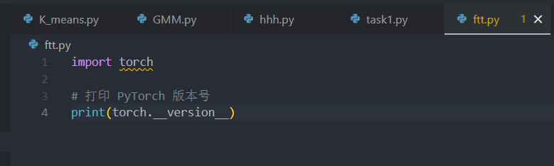

运行如下：

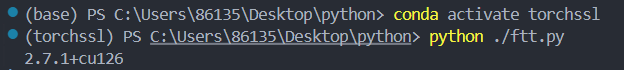

我的config配置如下，因为原始的配置大多数都符合实验要求（如模型采用WideResNet，规模也符合要求）只需要修改很少部分，主要改动如下：首先启用GPU，由于我只有一个设备，所以关闭分布式，同时减少迭代次数，减小打印间隔：

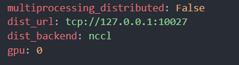

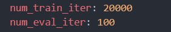

由于项目本身的环境在我本地无法一键配置（environment.yml里面的很多库都已找不到）我自己配置好后，由于torch版本缘故，一些类型检查会报错，如在 `datasets/data_utils.py`中会报 `RuntimeError: expected scalar type Long but found Int`错误。原因是原始代码中numpy数组的默认整数类型可能是int32，但PyTorch的交叉熵损失函数期望int64类型的标签。通过在数据处理函数中显式指定dtype=np.int64解决了这个问题。为了能够运行，我将这个修改如下：

```python
# 在datasets/data_utils.py的第22行报错
data, target = np.array(data), np.array(target)

# 修改后
data, target = np.array(data), np.array(target, dtype=np.int64)
```

在本地运行fixmatch时，不会出现问题：

某次运行结果最终如下：

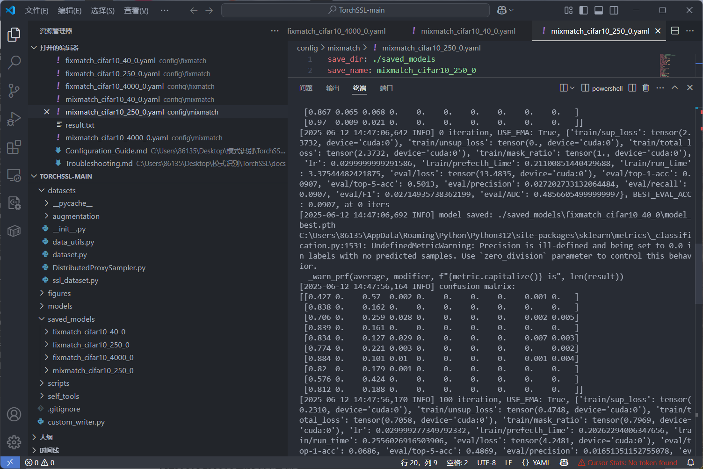

验证中途GPU的工作情况：

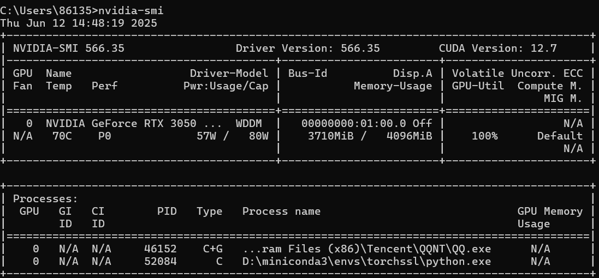

可以看到GPU在成功被应用于模型训练。

由于版本原因，由于那次修改，导致在本地运行mixmatch时会出现除以0，从而导致NaN错误。虽然可以通过降低学习率来延缓报错，理论上足够低的学习率会避免这个问题，但这违背了实验初衷，可是不改的话，由于版本冲突，在本地无法运行。因此我选择使用colab来在线上服务器上运行后续的任务。将我重新下载的代码的参数配置修改后上传到谷歌云盘，加载到colab里面，从colab里面使用代码运行，以下是运行中间截图：

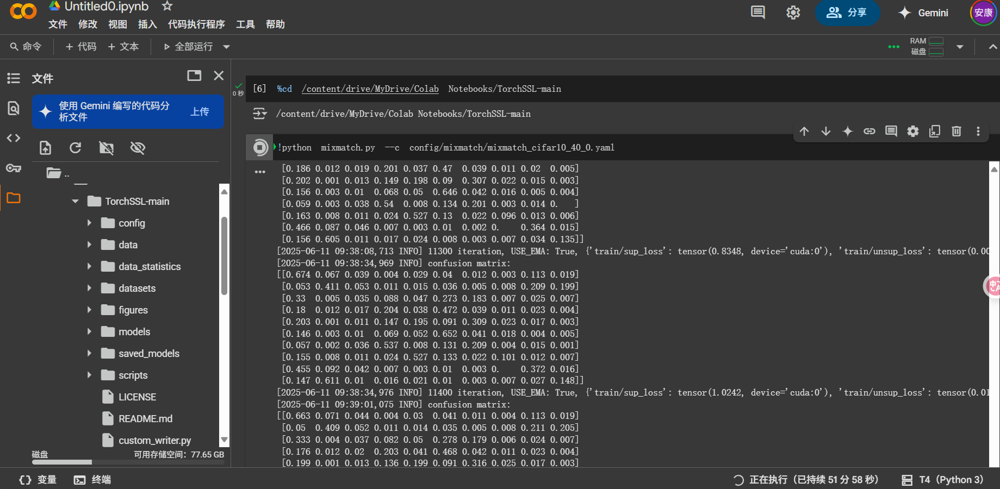

最终成功运行得到结果。

## 结果分析

运行每个模型得到结果用tensorboard进行分析，结果如下：

### Fixmatch独有指标分析

fixmatch独有的指标如下：

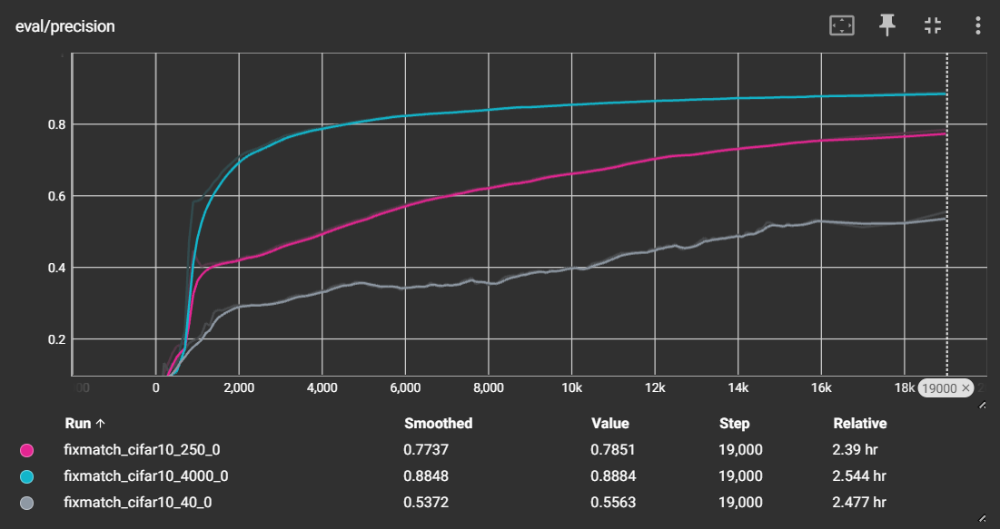

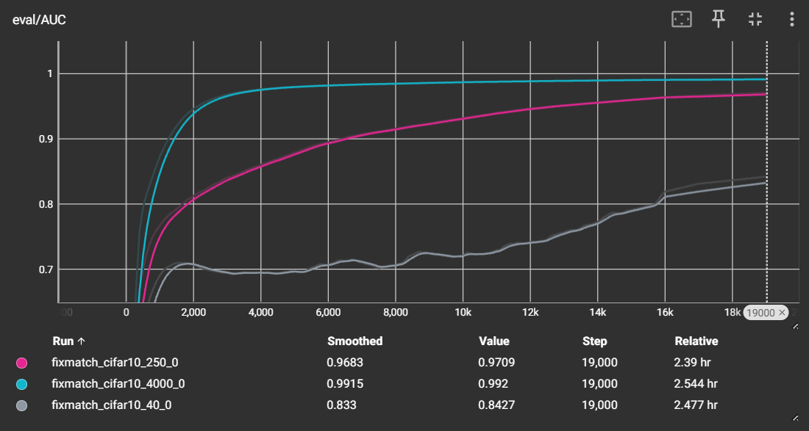

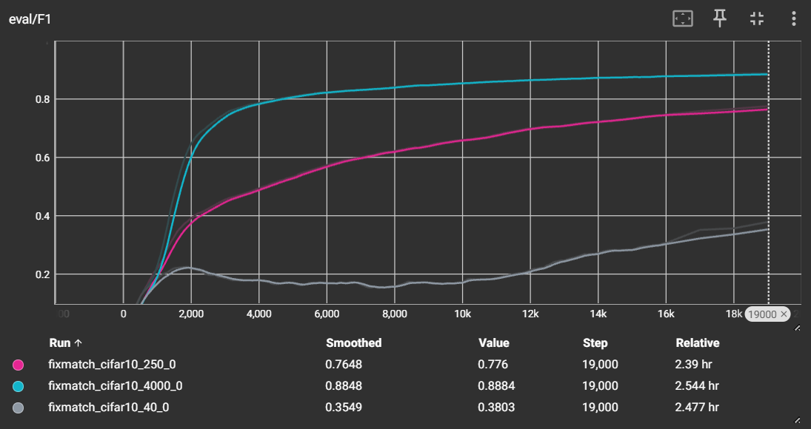

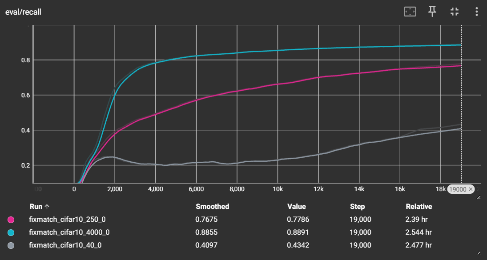

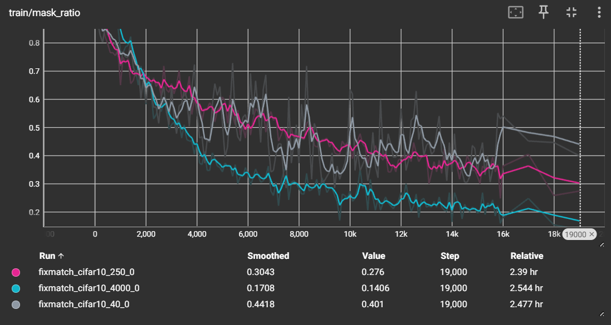

从最终的评估结果来看，无论是 F1 分数、精确率、召回率还是 AUC，所有指标都共同揭示了一个核心趋势：初始带标签样本的数量是决定模型性能基石的关键因素。拥有4000个标签的实验（蓝色曲线）不仅在最终性能上远超其他实验，其学习速度也最快，在训练初期（约2000步）各项指标便迅速提升并趋于稳定，最终 F1 分数和精确率都达到了约0.88，AUC更是高达0.99，展现了非常出色的效果。相对地，仅有40个标签的实验（灰色曲线）则表现得较为挣扎，各项性能指标在训练过程中都经历了漫长的缓慢爬升和波动，最终F1分数仅达到0.38左右，这说明在标签极度稀缺时，模型建立有效判别能力的过程是十分困难的。

`train/mask_ratio` 指标表示在训练中因置信度不足而被屏蔽的无标签样本比例。所有实验都在初期显示出非常高的 `mask_ratio`，说明模型在开始时对自身预测极为不自信。然而，随着训练的推进，模型的“自信心”逐渐增强，`mask_ratio`也随之稳步下降，这意味着模型开始更有效地利用无标签数据进行学习。这一趋势的快慢同样与标签数量息息相关：4000个标签的实验其 `mask_ratio`下降最快也最低，稳定在约20%，而40个标签的实验则始终维持在40%以上的高位，这与其在评估指标上的缓慢提升形成了完美的印证。

### fixmatch和mixmatch共有统计指标分析

以下是fixmatch和mixmatch的共有统计指标

#### 性能指标分析

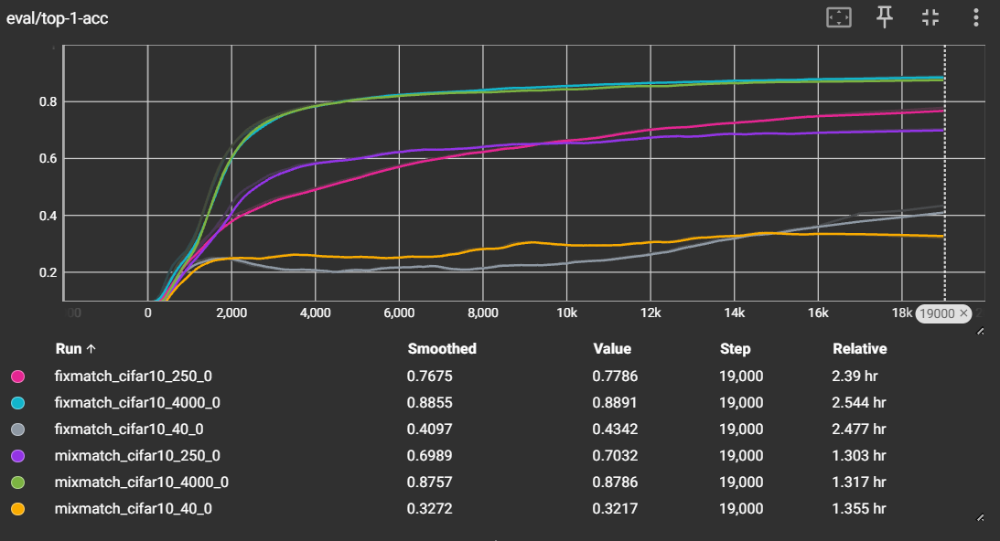

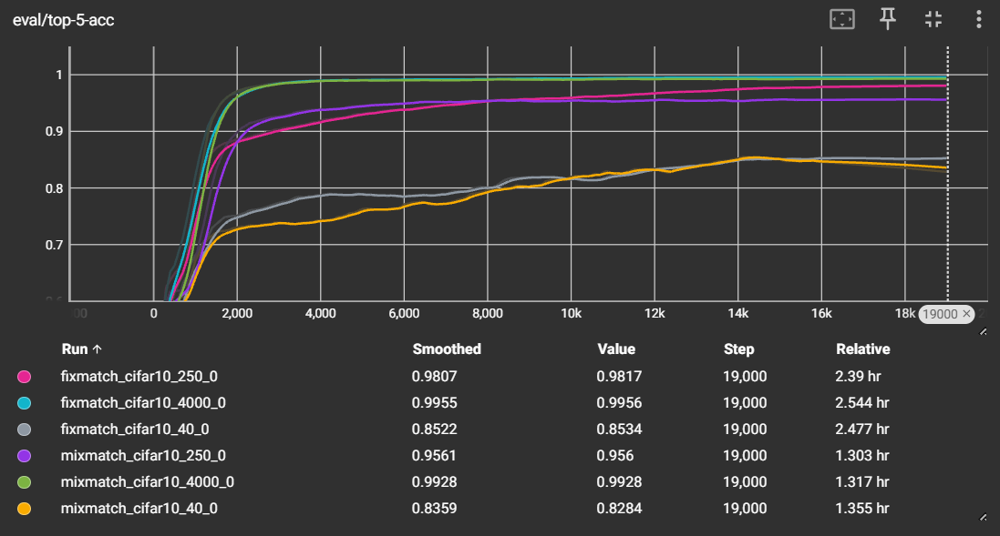

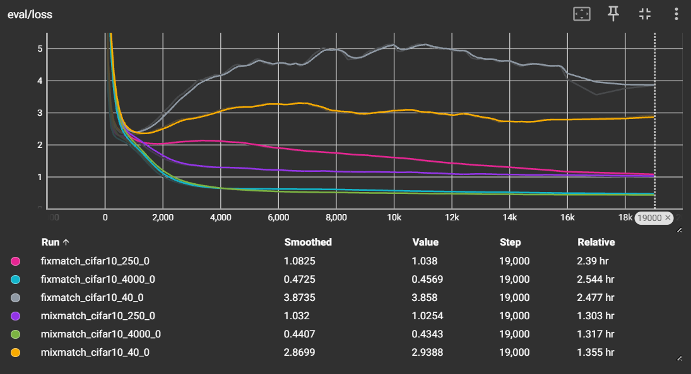

`eval/top-1-acc` 和 `eval/top-5-acc` 分别代表模型在评估集上的 Top-1 和 Top-5 准确率，这是衡量模型最终性能的核心标准。`eval/loss` 指的是在评估集上的损失值，反映了模型预测结果与真实标签的差距，是模型泛化能力的体现。综合分析 Top-1、Top-5 准确率和评估损失（eval/loss），我们可以看到两种算法的性能表现和共性趋势。FixMatch 和 MixMatch 都清晰地展示了半监督学习的基本规律：拥有更多标签（4000个）的实验性能远超标签较少（250个和40个）的实验，这体现在准确率更高、评估损失更低以及收敛速度更快上。在模型对比方面，当标签数量充足时（4000个），FixMatch 和 MixMatch 的性能非常接近，Top-1准确率都达到了约88%的优秀水平。然而，在标签数量减少时，两种算法的差距开始显现；特别是在只有40个标签的极端情况下，FixMatch 的 Top-1 准确率（约43%）明显高于 MixMatch（约32%），并且其评估损失（eval/loss）也更低、更稳定，这表明 FixMatch 在低标签环境下的鲁棒性和学习效率优于 MixMatch。

#### 训练损失分析

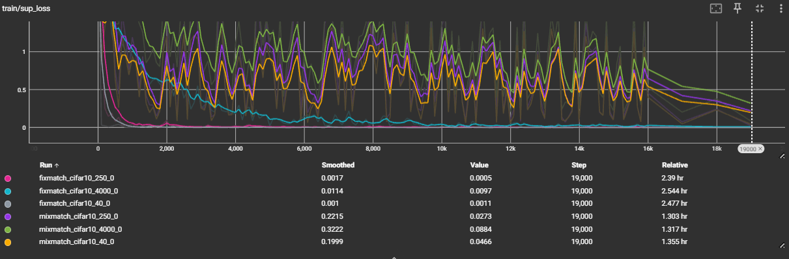

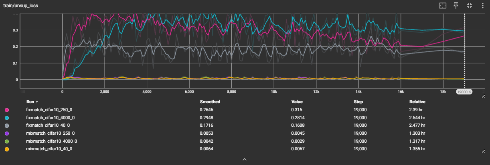

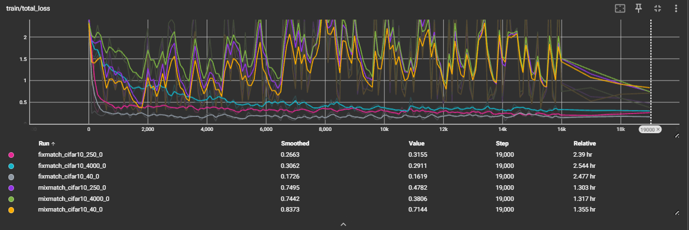

`train/sup_loss`、`train/unsup_loss` 和 `train/total_loss` 分别是训练过程中有监督损失、无监督损失和总损失，它们展示了模型在学习过程中的动态变化。`train/sup_loss`反映了模型对带标签数据的学习情况。FixMatch 的有监督损失非常小且稳定，快速收敛到接近零的水平，说明它能很好地拟合带标签数据。相比之下，MixMatch 的有监督损失则要高得多且伴随剧烈振荡，这是因为 MixMatch 的核心机制 MixUp 会将带标签样本与其他样本（包括无标签样本）进行混合，导致其有监督损失的计算对象不再是纯粹的原始带标签样本，因此损失值更高且包含了更多噪声。对于 `train/unsup_loss`，FixMatch 的值相对较高且波动，这与其基于硬伪标签和高置信度筛选的机制有关；而 MixMatch 的无监督损失则非常小且平稳，这源于其使用软标签进行全局一致性约束的特性。`train/total_loss`是前两者的加权和，其曲线形态主要由占主导地位的损失项决定，FixMatch 的总损失曲线形态更接近其无监督损失，而 MixMatch 则更像其有监督损失的形态。

#### 效率指标分析

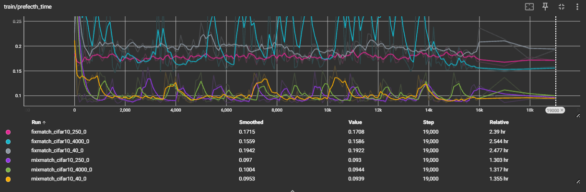

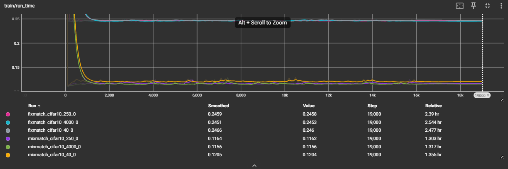

`train/prefetch_time` 和 `train/run_time` 是关于训练效率的指标，分别代表数据预取和模型单次迭代运行所需的时间。由于在前文所提到的原因，我的fixmatch是在本地的GPU上训练的，而mixmatch是在colab的性能强劲的专业级GPU上训练的，其计算能力远超一般的本地消费级GPU，训练硬件条件差异很大，因此没有办法通过上面的性能表来分析哪个模型更高效。但在依旧可以在理论上进行分析，从算法设计的核心来看， MixMatch 在理论上比 FixMatch 的单次迭代计算成本更高，效率更低 。这主要是因为两者在处理无标签数据以生成“学习目标”时，所需的模型前向传播（forward pass）次数不同，而前向传播是整个训练过程中最消耗计算资源的操作。FixMatch 的设计非常高效 。对于每一张无标签图片，它只需要进行一次在弱增强版本上的前向传播，来产生一个候选的伪标签。然后，它将这个伪标签作为“真实答案”，去监督同一张图片在强增强版本上的预测结果。这两个版本（弱增强和强增强）的计算通常可以在一个批次（batch）的处理中并行完成，因此处理一个无标签样本的核心成本可以粗略地看作是两次前向传播（一次用于生成标签，一次用于计算损失）。而MixMatch 的机制要复杂得多。为了给一张无标签图片生成一个更可靠的“猜测标签”，MixMatch 首先会对这张图片进行 K 次不同的弱数据增强，并将这 K 个增强后的版本全部送入模型，进行 K 次前向传播。然后，它将这 K 次的预测结果进行平均和“锐化”，才能得到一个用于后续混合（MixUp）步骤的软标签。这意味着，仅仅是为了准备一个无标签样本的学习目标，MixMatch 就需要付出 K 次前半部分模型的计算。这个“标签猜测”的过程本身就比 FixMatch 的整个无监督损失计算流程要昂贵。

### 与理论性能基线的差异分析

我还注意到我的训练效果和官方给出的基线来比有很大差距。我分析主要是超参数（主要是训练迭代次数）的设置问题，处于实验以及性能考虑，我的训练迭代次数超参数经过了一定程度的“缩水"。这导致了性能的下降。

还有一点就是，为了减小内存占用，我将fixmatch的uratio（在每个训练批次（batch）中，无标签样本的数量与有标签样本数量的比例）从7改为了3，虽然这会减小内存占用，但是也导致了严重的副作用：无标签数据利用率急剧下降。每个批次模型接收的无标签数据量由于这个参数的改动会显著减小。原来的设置是每处理1个有标签样本，就同时处理7个无标签样本。将它改为3后，模型在相同的训练步数内，接触到的无标签样本数量减少了超过一半。这极大地削弱了半监督学习的核心优势，模型从无标签数据中学习到的信息会大大减少。此外，通过降低无标签数据的比例，相对地提升了有标签数据在每个批次中的“话语权”（从1/8提升到了1/4）。在标签数量本身就很少的情况下，这会使模型更容易过拟合到这些少量的有标签样本上，而无法学习到能够泛化到整个数据集的通用特征。最后，这个数值的改动导致每个批次中计算无监督损失的样本变少了，这个损失项对模型整体的梯度贡献也变小了。这可能会导致模型收敛更慢，或者在训练结束时远未达到其本可以达到的最佳性能点。

### 性能分析总结

综合所有实验结果和理论分析，FixMatch 与 MixMatch 这两种经典的半监督学习算法在性能、机制和效率上展现出清晰的差异。FixMatch 凭借其更为简约和直接的硬伪标签及置信度筛选策略，在标签数量极度稀缺时，表现出比 MixMatch 更优的性能 、更强的稳定性和鲁棒性 。具体来看，在标签充足时，两种算法的最终准确率旗鼓相当，都能达到很高的水平；然而，在低标签的极限挑战下，FixMatch 的准确率优势明显，其评估损失也更低、更平稳，证明了其卓越的泛化能力。这种性能差异的根源在于两者核心机制的不同：FixMatch 通过“弱监督强”的一致性正则化，为模型提供了清晰、高置信度的监督信号，使其训练过程（特别是对有标签数据的拟合）更为稳定；而 MixMatch 采用的“预测平均+MixUp”策略虽然精巧，但在初始监督信息不足时，其混合机制可能引入噪声，导致训练过程产生更大的振荡，从而影响了最终的性能上限。最后，从理论计算效率角度分析，FixMatch 由于其更简洁的伪标签生成流程，单次迭代的计算成本低于需要多次前向传播来猜测标签的 MixMatch，因此在同等硬件下具有更高的理论运行效率。

## 总结

通过这次实验，我了解了半监督学习的各种基础知识，并且对mixmatch和fixmatch模型有了详细的学习，了解了它们各自的设计思想、机制以及性能表现。与此同时，这是我第一次详细分析一个专业的训练代码项目的组织和实现，也是第一次接触通过网上的计算资源来进行模型训练。通过这次实验，我不仅学习了丰富的知识，并且还锻炼了实际的模型训练能力，受益匪浅。
