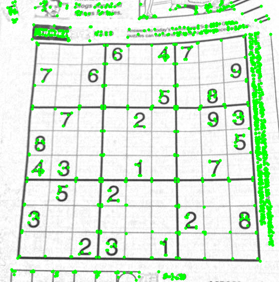
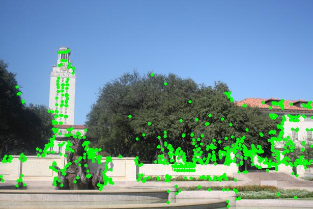
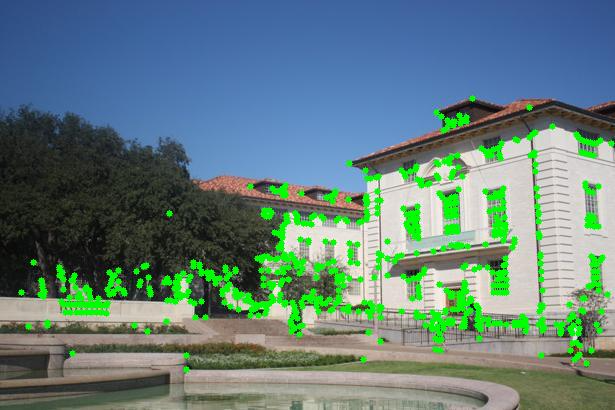
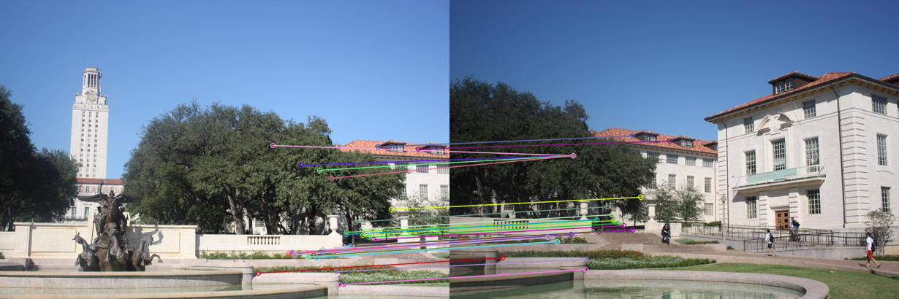
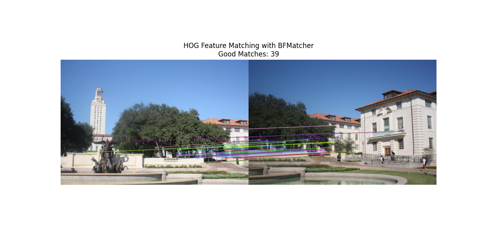
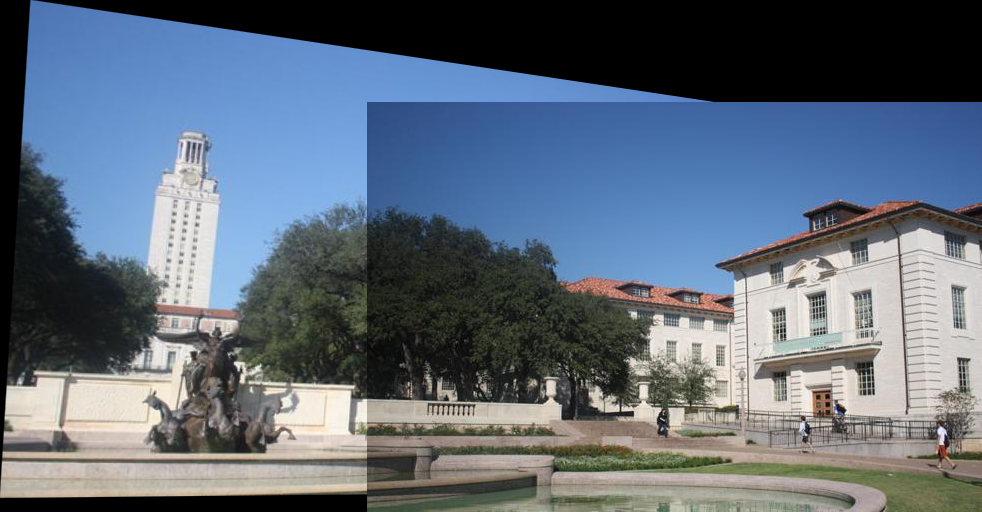
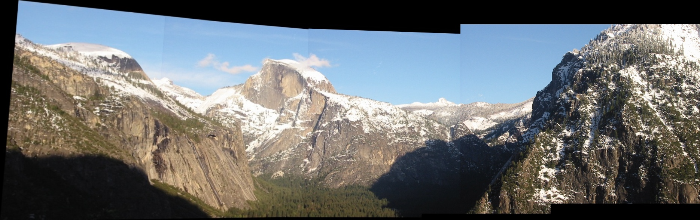

# 全景图拼接

学号：22320021 姓名：陈安康

## 任务1：Harris角点检测

角点是图像中特征明显、梯度变化显著的点，通常位于边界交叉处或曲折区域，是计算机视觉和图像处理中的关键特征点。Harris角点检测是一种经典的角点检测算法。它的核心思想是如果一个窗口在所有方向上的移动导致像素灰度剧烈变化，那么存在角点。

Harris算法通过二阶矩矩阵来描述局部区域的灰度变化。其表达式如下：

$$
M =
\begin{bmatrix}
I_x^2 & I_x I_y \\
I_x I_y & I_y^2
\end{bmatrix}
$$

其中$I_x$和$I_y$是在x和y方向上的梯度。然后通过矩阵的特征值分析局部区域的梯度变化情况，为了简化特征值的计算，Harris 提出了一个角点响应函数：

$$
R = \det(M) - k \cdot (\text{trace}(M))^2
$$

R为M的行列式与k倍M的迹的平方的差。其中k是经验参数。

R>0 时，窗口内的梯度在多个方向上均有显著变化，该点可能是角点；当 R<0 时，梯度主要沿某一方向变化，该点更可能是边缘；当 R≈0 时，该区域梯度变化较小，属于平坦区域。

代码实现上，实现类CornerDectector，在里面实现角点检测函数（detect_corners）它读取图片路径，获取图像灰度图，然后按照公式进行计算，返回角点坐标。我在代码中使用Sobel算子来计算各方向的梯度（$I_x$和$I_y$），然后用高斯滤波对梯度平方项进行处理，减小高频噪声影响，增强局部区域信息，提升计算稳定性。作为举例，这里列出对x方向的梯度平方项的高斯滤波处理，其中*是卷积操作：

$$
S_x^2 = G \sigma * I_x^2
$$

核心代码如下：

```python

class CornerDetector:
    def __init__(self, k=0.04, threshold_percent=0.98):
        self.k = k
        self.threshold_percent = threshold_percent
  
    def detect_corners(self, image_path):

        image = Image.open(image_path).convert('L')
        image = np.array(image)
  

        Ix = cv2.Sobel(image, cv2.CV_64F, 1, 0, ksize=3)
        Iy = cv2.Sobel(image, cv2.CV_64F, 0, 1, ksize=3)
  

        Ix2 = Ix ** 2
        Iy2 = Iy ** 2
        Ixy = Ix * Iy
  

        Sx2 = cv2.GaussianBlur(Ix2, (3, 3), 1)
        Sy2 = cv2.GaussianBlur(Iy2, (3, 3), 1)
        Sxy = cv2.GaussianBlur(Ixy, (3, 3), 1)
  

        rows, cols = image.shape
  

        R = np.zeros((rows, cols))
        for i in range(rows):
            for j in range(cols):
                det = Sx2[i, j] * Sy2[i, j] - Sxy[i, j] ** 2
                trace = Sx2[i, j] + Sy2[i, j]
                R[i, j] = det - self.k * trace ** 2
  

        sorted_R = np.sort(R.flatten())
        threshold = sorted_R[int(len(sorted_R) * self.threshold_percent)]
  

        corners = []
        for i in range(1, rows - 1):
            for j in range(1, cols - 1):
                if R[i, j] > threshold and R[i, j] == np.max(R[i - 1:i + 2, j - 1:j + 2]):
                    corners.append([j, i])  # OpenCV格式(x,y)
  
        return np.array(corners)
  
    def detect_and_mark_corners(self, image_path, output_path=None, radius=3, color=(0, 255, 0), thickness=-1):

        color_image = Image.open(image_path).convert('RGB')
        color_image = np.array(color_image)
  
        # 检测角点
        corners = self.detect_corners(image_path)
  

        if len(corners) > 0:
            for pt in corners:
                x, y = pt
                cv2.circle(color_image, (int(x), int(y)), radius, color, thickness)
  

        if output_path:
            os.makedirs(os.path.dirname(output_path), exist_ok=True)
            marked_image = Image.fromarray(color_image)
            marked_image.save(output_path)
        else:
            return color_image
```

将实验图片输入，得到结果如下：



## 任务2：关键点描述与匹配

首先通过任务1的类完成两幅图像的角点检测，结果如下：





图像中角点的描述子是用来表征角点（或兴趣点）特征的向量。这些描述子是通过分析角点附近的局部图像区域来生成的，通常包含有关该区域的纹理、梯度方向、强度变化等信息。角点描述子的目的是为了将不同图像中相同或相似的角点进行匹配。本次任务要求使用SIFT和HOG来获取前面得到的角点的特征。

对于现成的角点，SIFT首先计算角点周围区域的图像梯度，然后构建梯度方向直方图，该直方图通常包含8个方向分段，表示梯度方向的分布，最后构建成为描述子，规范化后进行输出。

对于每个角点附近的区域，HOG会将该区域划分为较小的单元格（cell）。在cell内计算梯度方向的直方图，多个相邻的cell会组成block，进行归一化，最后HOG的描述子由block的归一化梯度直方图组合而成。

在得到描述子后，计算两个图像每个角点描述子之间的欧式距离，距离最近，表明两个角点越相似，即为匹配点对。

为了实现匹配，首先实现两个类（SIFT和HOG），在任务1生成的角点基础上进行描述子生成，进行匹配，实现代码如下:

SIFT:

```python
class SIFTFeatureMatcher:
    def __init__(self, k=0.04, threshold_percent=0.98, ratio_threshold=0.75):
        self.detector = CornerDetector(k=k, threshold_percent=threshold_percent)
        self.ratio_threshold = ratio_threshold
  
    def extract_features(self, image_path):
        img = cv2.imread(image_path)
        if img is None:
            print(f"Error: Image {image_path} could not be loaded.")
            return None, None
        
        gray = cv2.cvtColor(img, cv2.COLOR_BGR2GRAY)
        corners = self.detector.detect_corners(image_path)
    
        if len(corners) == 0:
            print(f"Warning: No corners detected in {image_path}")
            return None, None
        
        keypoints = [cv2.KeyPoint(x=float(pt[0]), y=float(pt[1]), size=20) for pt in corners]
        sift = cv2.SIFT_create()
        keypoints, descriptors = sift.compute(gray, keypoints)
    
        return keypoints, descriptors
  
    def match_features(self, des1, des2):
        if des1 is None or des2 is None:
            return []
        
        matches = []
        for i in range(len(des1)):
            distances = []
            for j in range(len(des2)):
                dist = np.sqrt(np.sum((des1[i] - des2[j])**2))
                distances.append((j, dist))
            distances.sort(key=lambda x: x[1])
            matches.append((i, distances[0][0], distances[0][1], distances[1][0], distances[1][1]))
    
        good = []
        for match in matches:
            if match[2] < self.ratio_threshold * match[4]:
                good.append(cv2.DMatch(_queryIdx=match[0], _trainIdx=match[1], _distance=match[2]))
    
        return good
  
    def visualize_matches(self, img1, kp1, img2, kp2, good_matches, output_path):
        # 将每个DMatch对象包装成列表形式
        matches = [[m] for m in good_matches]
        img3 = cv2.drawMatchesKnn(img1, kp1, img2, kp2, matches, None, 
                                 flags=cv2.DrawMatchesFlags_NOT_DRAW_SINGLE_POINTS)
        img3 = cv2.cvtColor(img3, cv2.COLOR_BGR2RGB)
        plt.imsave(output_path, img3)
        print(f"Matching result saved to {output_path}")


def extract_and_match_sift(image1_path, image2_path, output_path):
    matcher = SIFTFeatureMatcher()
  
    kp1, des1 = matcher.extract_features(image1_path)
    kp2, des2 = matcher.extract_features(image2_path)
  
    if kp1 is None or kp2 is None:
        return
    
    good_matches = matcher.match_features(des1, des2)
  
    if len(good_matches) == 0:
        print("Warning: No good matches found.")
        return
  
    img1 = cv2.imread(image1_path)
    img2 = cv2.imread(image2_path)
    matcher.visualize_matches(img1, kp1, img2, kp2, good_matches, output_path)

```

HOG:

```python
class HOGFeatureMatcher:
    def __init__(self, k=0.04, threshold_percent=0.98, patch_size=16, orientations=8, pixels_per_cell=(8,8), cells_per_block=(2,2), ratio_threshold=0.75):
        self.detector = CornerDetector(k=k, threshold_percent=threshold_percent)
        self.patch_size = patch_size
        self.orientations = orientations
        self.pixels_per_cell = pixels_per_cell
        self.cells_per_block = cells_per_block
        self.ratio_threshold = ratio_threshold
  
    def get_valid_patch(self, img, pt):
        x, y = int(pt[0]), int(pt[1])
        y1, y2 = max(0, y-self.patch_size//2), min(img.shape[0], y+self.patch_size//2)
        x1, x2 = max(0, x-self.patch_size//2), min(img.shape[1], x+self.patch_size//2)
        patch = img[y1:y2, x1:x2]
        return patch if patch.shape == (self.patch_size, self.patch_size) else None
  
    def extract_features(self, image_path):
        img = cv2.imread(image_path)
        gray = cv2.cvtColor(img, cv2.COLOR_BGR2GRAY)
  

        corners = self.detector.detect_corners(image_path)
  

        descriptors, keypoints = [], []
        for pt in corners:
            patch = self.get_valid_patch(gray, pt)
            if patch is not None:
                descriptor = hog(patch, orientations=self.orientations, 
                               pixels_per_cell=self.pixels_per_cell,
                               cells_per_block=self.cells_per_block, 
                               visualize=False)
                descriptors.append(descriptor)
                keypoints.append(cv2.KeyPoint(float(pt[0]), float(pt[1]), self.patch_size))
  
        return img, np.array(descriptors, dtype=np.float32), keypoints
  
    def match_features(self, descriptors1, descriptors2):
        bf = cv2.BFMatcher(cv2.NORM_L2, crossCheck=False)
        matches = bf.knnMatch(descriptors1, descriptors2, k=2)
  
        good_matches = []
        for m, n in matches:
            if m.distance < self.ratio_threshold * n.distance:
                good_matches.append(m)
        return good_matches
  
    def visualize_matches(self, img1, kp1, img2, kp2, good_matches, output_path):
        img_matches = cv2.drawMatchesKnn(img1, kp1, img2, kp2, [[m] for m in good_matches], None,
                                       flags=cv2.DrawMatchesFlags_NOT_DRAW_SINGLE_POINTS)
  
        plt.figure(figsize=(12, 6))
        plt.imshow(cv2.cvtColor(img_matches, cv2.COLOR_BGR2RGB))
        plt.title(f"HOG Feature Matching with BFMatcher\nGood Matches: {len(good_matches)}")
        plt.axis('off')
        plt.savefig(output_path)
        plt.close()
  
    def match_images(self, image1_path, image2_path, output_path):
        img1, descriptors1, kp1 = self.extract_features(image1_path)
        img2, descriptors2, kp2 = self.extract_features(image2_path)
  
        if len(descriptors1) == 0 or len(descriptors2) == 0:
            raise ValueError("No valid HOG features extracted!")
  
        good_matches = self.match_features(descriptors1, descriptors2)
        self.visualize_matches(img1, kp1, img2, kp2, good_matches, output_path)
```

匹配效果如下：

SIFT:



HOG:



在上面的基础上，通过RANSAC实现图像拼接。RANSAC的核心思想是从数据中随机选择一个小的子集，使用这个子集估计模型参数，然后将整个数据集中的点与估计的模型进行匹配，最后评估哪些点是内点（inliers），哪些点是外点（outliers）。通过多次迭代，RANSAC能够在大多数情况下找到包含最多内点的最佳模型。

通过SIFT和HOG提供的匹配点对，RANSAC计算变换矩阵，利用变换矩阵对图像进行变换，将两个图像进行拼接，核心代码如下：

```python
class ImageStitcher:
    def __init__(self, ransac_threshold=2.5, sift_threshold_percent =0.98,sift_ratio = 0.75, hog_threshold_persent=0.98,hog_ratio = 0.75):
        self.ransac_threshold = ransac_threshold
        self.sift_threshold_percent = sift_threshold_percent
        self.sift_ratio = sift_ratio
        self.hog_threshold_persent = hog_threshold_persent
        self.hog_ratio = hog_ratio
        self.sift_matcher = SIFTFeatureMatcher(threshold_percent=self.sift_threshold_percent, ratio_threshold=self.sift_ratio)
        self.hog_matcher = HOGFeatureMatcher(threshold_percent=self.hog_threshold_persent, ratio_threshold=self.hog_ratio)
  
    def compute_homography(self, kp1, kp2, good_matches):
        # 这一部分和之前的代码保持一致
        if hasattr(good_matches[0], 'queryIdx'):  # SIFT 匹配格式
            src_pts = np.float32([kp1[m.queryIdx].pt for m in good_matches]).reshape(-1, 1, 2)
            dst_pts = np.float32([kp2[m.trainIdx].pt for m in good_matches]).reshape(-1, 1, 2)
        else:  # HOG 匹配格式 (列表元组)
            src_pts = np.float32([kp1[m[0]].pt for m in good_matches]).reshape(-1, 1, 2)
            dst_pts = np.float32([kp2[m[1]].pt for m in good_matches]).reshape(-1, 1, 2)
  
        # 使用 RANSAC 计算单应性矩阵
        M, mask = cv2.findHomography(src_pts, dst_pts, cv2.RANSAC, self.ransac_threshold)
        return M
  
    def stitch_images(self, image1_path, image2_path, output_path, feature_type='sift'):
        img1 = cv2.imread(image1_path)
        img2 = cv2.imread(image2_path)

        if img1 is None or img2 is None:
            raise FileNotFoundError("无法读取输入图像，请检查文件路径是否正确！")

        if feature_type == 'hog':
            _, des1, kp1 = self.hog_matcher.extract_features(image1_path)
            _, des2, kp2 = self.hog_matcher.extract_features(image2_path)
            good_matches = self.hog_matcher.match_features(des1, des2)
        else:
            kp1, des1 = self.sift_matcher.extract_features(image1_path)
            kp2, des2 = self.sift_matcher.extract_features(image2_path)
            good_matches = self.sift_matcher.match_features(des1, des2)
    
        if len(good_matches) < 4:
            raise ValueError("匹配点不足，无法计算单应性矩阵，请尝试其他图像或调整特征匹配参数。")
    
        M = self.compute_homography(kp1, kp2, good_matches)
  
        # 计算拼接后的全景图尺寸
        h1, w1 = img1.shape[:2]
        h2, w2 = img2.shape[:2]
  
        # 计算变换后的图像角点
        corners1 = np.float32([[0,0], [0,h1-1], [w1-1,h1-1], [w1-1,0]]).reshape(-1,1,2)
        corners2 = np.float32([[0,0], [0,h2-1], [w2-1,h2-1], [w2-1,0]]).reshape(-1,1,2)
        transformed_corners = cv2.perspectiveTransform(corners1, M)
  
        # 计算新的宽度和高度
        all_corners = np.concatenate((transformed_corners, corners2), axis=0)
        x_min = min(0, all_corners[:,0,0].min())
        x_max = max(w2, all_corners[:,0,0].max())
        y_min = min(0, all_corners[:,0,1].min())
        y_max = max(h2, all_corners[:,0,1].max())
  
        # 计算平移矩阵
        tx = -x_min
        ty = -y_min
        translation = np.array([[1, 0, tx], [0, 1, ty], [0, 0, 1]])
  
        # 应用变换
        panorama = cv2.warpPerspective(img1, translation @ M, (int(x_max - x_min), int(y_max - y_min)))
        panorama[int(ty):int(ty)+h2, int(tx):int(tx)+w2] = img2
  
        # 保存结果
        cv2.imwrite(output_path, panorama)
        print(f"拼接完成，结果已保存至 {output_path}")
```

拼接效果如下：

SIFT：


HOG：



从拼接效果来看，二者几乎没有任何差别。但是对比匹配点上，还是可以明显看出二者在匹配精度的差异。SIFT虽然在匹配点时将多个点匹配到一个点上，但可以肉眼看出是因为其相似度高而导致的匹配差异，而HOG却明显的出现匹配错误的情况（如将左图的女神像头部点匹配到右图窗户上）。这说明HOG的产生的特征匹配精度不如SIFT。每个关键点的描述符由该点周围区域的梯度方向和强度的统计信息组成。SIFT具有旋转不变性、尺度不变性和部分光照不变性，这意味着它在不同尺度、旋转角度、平移甚至部分视角变化下都能保持稳定。而HOG不直接关注图像的关键点，而是更多地描述图像的局部梯度信息，通过对图像分块进行梯度统计来描述物体的轮廓，因此它在关键点匹配中的应用并不像SIFT那样直接。对噪声更为敏感，鲁棒性不及SIFT，因此匹配精度不及SIFT。

虽然精度不及SIFT，但HOG的计算开销更小，在实时匹配场景下更能发挥作用，两种匹配算法有各自的应用场景。可以依据自己的场景需求进行使用。

## 任务3：多图拼接

在上述实现的基础上，利用SIFT+RANSAC实现多图拼接。在任务2实现的两图拼接基础上进行实现。由于多图拼接会出现误差累积等问题，这里我采用贪心策略，优先拼接图片中匹配点数最多的两个图像，不停循环，直到完全拼接成一个图片为止，实现代码如下：

```python
class MultiImageStitcher:
    def __init__(self,ransac_threshold=2,sift_threshold_percent =0.95,sift_ratio = 0.65):
        self.ransac_threshold = ransac_threshold
        self.sift_threshold_percent = sift_threshold_percent
        self.sift_ratio = sift_ratio
        self.image_stitcher = ImageStitcher(ransac_threshold=self.ransac_threshold,sift_ratio=self.sift_ratio,sift_threshold_percent=self.sift_threshold_percent)

    def stitch_images(self,image_paths):
        c = 0
        while len(image_paths) !=1:
            l = []
            # 计算相邻的匹配点数量
            for i in range(len(image_paths)-1):
                k,d1 = self.image_stitcher.sift_matcher.extract_features(image_paths[i])
                k,d2 = self.image_stitcher.sift_matcher.extract_features(image_paths[i+1])
                l.append(len(self.image_stitcher.sift_matcher.match_features(d1,d2)))
            # 选择匹配点最多的两张图像进行拼接
            j = l.index(max(l))
            tmp_path = f"results/tmp_{c}.jpg"
            # 拼接
            self.image_stitcher.stitch_images(image_paths[j],image_paths[j+1],tmp_path)
            # 替换
            image_paths[j] = tmp_path
            # 删除 
            del image_paths[j+1]
            c = c + 1

        # 删除中间结果,这个C要看看
        for i in range(c-1):
            tmp_path = f"results/tmp_{i}.jpg"
            os.remove(tmp_path)
        os.rename(image_paths[0], "results/yosemite_stitching.png")
```

拼接效果如下：



## 总结

通过这次实验，我复现了Harris的角点检测算法，并通过SIFT和HOG算法生成角点的描述子，通过欧氏距离作为度量特征进行匹配，并通过RANSAC依据匹配点对进行放射变换矩阵计算，实现图像拼接。最后在两张图像匹配的基础上，采用贪心策略进行多图匹配。

通过这次实验，我实践了课堂上的知识，回顾Harris角点检测的原理和实现方式，对比SIFT和HOG的实现方法的不同以及各自的特点，学习图像拼接的具体流程，练习RANSAC的具体应用场景，对图像检测和匹配拼接相关操作更加熟练，成就感满满，受益匪浅。
