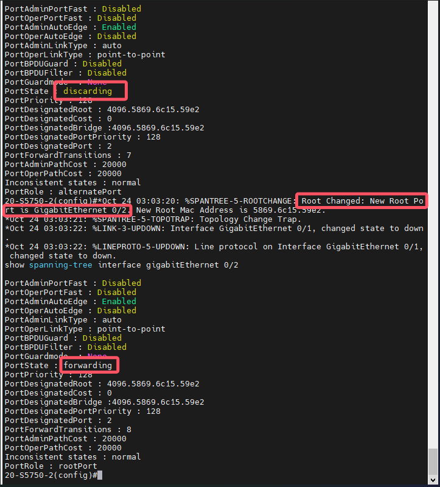
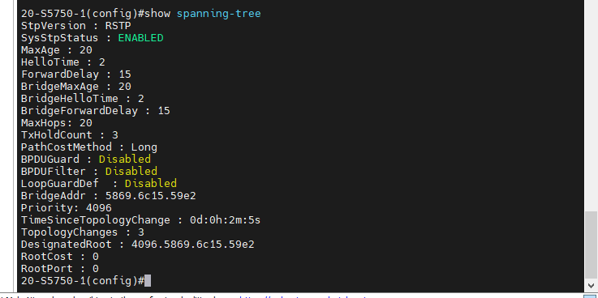
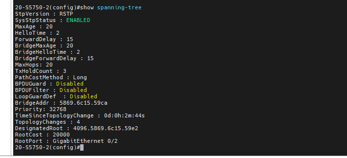
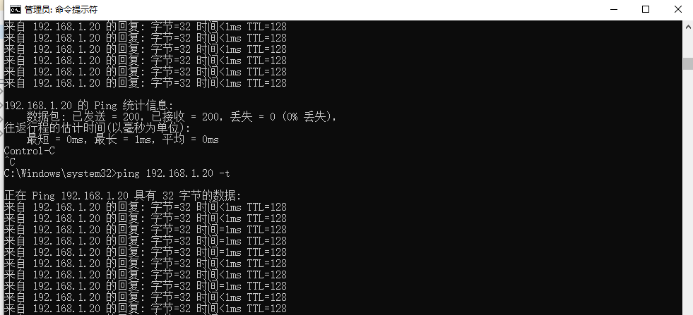
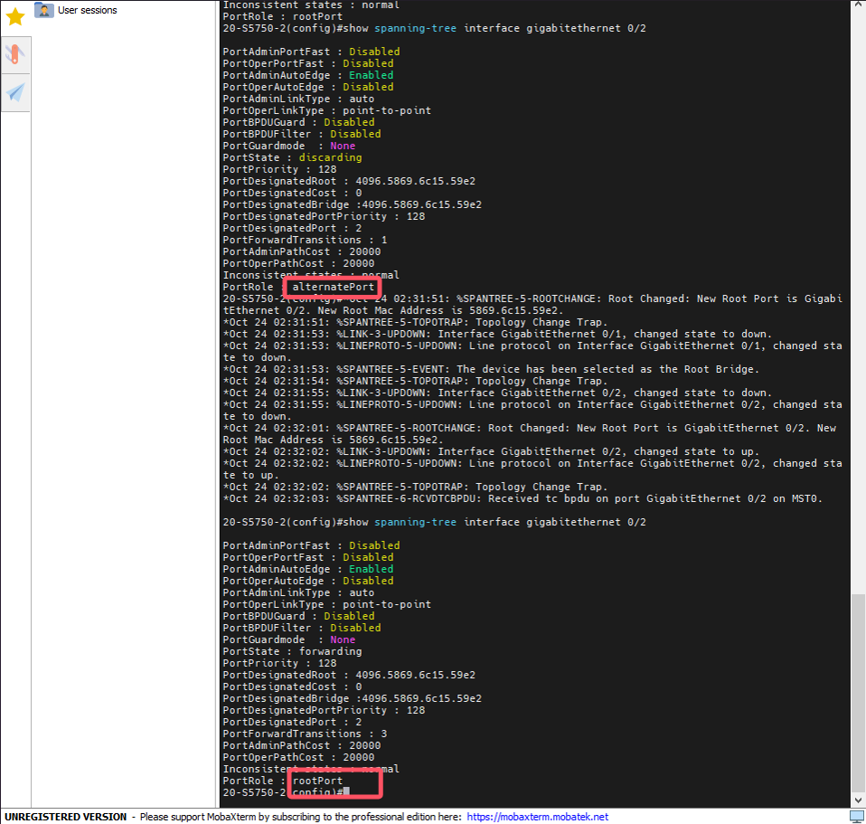

（1）由以上信息可以得知表格如下，其中交换机A作为根交换机。

| col1           | 交换机A             | 交换机B             |
| -------------- | ------------------- | ------------------- |
| Priority       | 4096                | 32768               |
| BridgeAddr     | 5869.6c15.59e2      | 5869.6c15.59ca      |
| DesignatedRoot | 4096.5869.6c15.59e2 | 4096.5869.6c15.59e2 |
| RootCost       | 0                   | 20000               |
| RootPort       | -                   | 0/1                 |
| Designated     | 0/1 0/2             | -                   |

（2）此时若将端口0/1之间的链路down掉，则交换机B的0/2端口由阻塞状态转变为转发状态，首先在拔掉之前运行命令查看交换机B的0/2端口状态，此时仍然是discarding，在切断端口0/1链路后，经过2秒时间后（计时器计时）再次查看交换机B的0/2端口状态，发现已经改变变为forwarding，整体用时2s左右：

（3）此时交换机的信息如下：

交换机A:

交换机B：

| col1           | 交换机A             | 交换机B             |
| -------------- | ------------------- | ------------------- |
| Priority       | 4096                | 32768               |
| BridgeAddr     | 5869.6c15.59e2      | 5869.6c15.59ca      |
| DesignatedRoot | 4096.5869.6c15.59e2 | 4096.5869.6c15.59e2 |
| RootCost       | 0                   | 20000               |
| RootPort       | -                   | 0/2                 |
| Designated     | 0/1 0/2             | -                   |

与（1）进行比较，可以发现交换机B的根端口已经转变为了端口0/2，说明在端口0/1链路断开后，交换机会重新计算生成树，动态调整使得端口0/2处于打开状态，确保新的拓扑结构能够稳定下来，防止环路。

（4）将网络拓扑恢复到没有断开端口0/1之前的状态，此时交换机B是非根交换机，端口0/1是根端口，端口0/2是阻塞端口。然后执行ping命令，并在过程中拔掉交换机A与交换机B端口0/1之间的连线，发现并没有丢包产生：

过程中交换机的输出如下，从图中可以观察到，在这个过程中，端口0/2从阻塞端口（替换端口）变为了根端口：

正是端口0/2从替换端口转换为了根端口，承担起了数据转发的任务，才使得网络连接通常，没有丢包现象的发生。

（5）记录表格如下：

| col1           | 交换机A             | 交换机B             |
| -------------- | ------------------- | ------------------- |
| Priority       | 4096                | 32768               |
| BridgeAddr     | 5869.6c15.59e2      | 5869.6c15.59ca      |
| DesignatedRoot | 4096.5869.6c15.59e2 | 4096.5869.6c15.59e2 |
| RootCost       | 0                   | 20000               |
| RootPort       | -                   | 0/2                 |
| Alternate      | -                   | -                   |

同（1）表格进行比较可以发现，交换机B的根端口变成了端口0/2，原因分析同（3）。

注意，由于交换机B上的端口0/1是断开连接了，因此它不能起到替换端口在必要时迅速切换为转发状态的端口的作用，而是被交换机直接关闭了，因此它不属于交换端口，交换端口必须要求端口是连接状态，只是被阻塞了而已。
