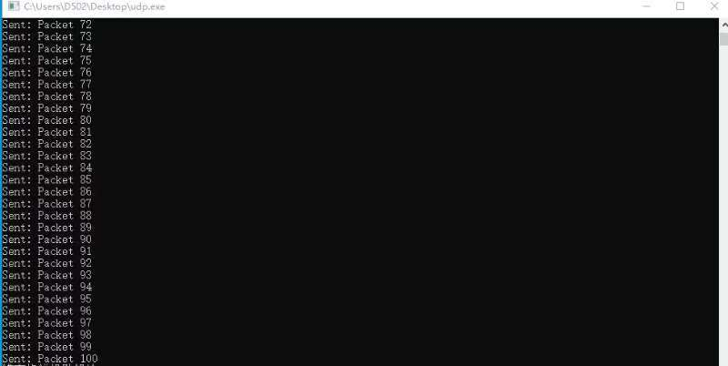
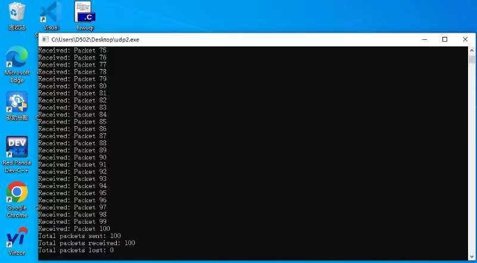
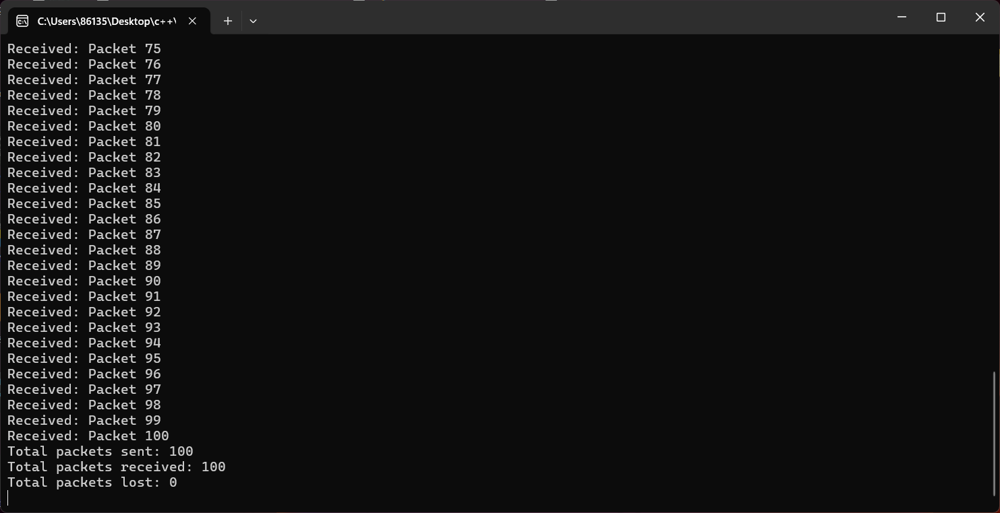
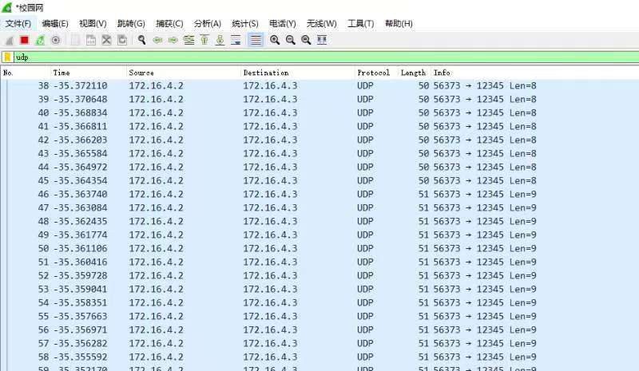
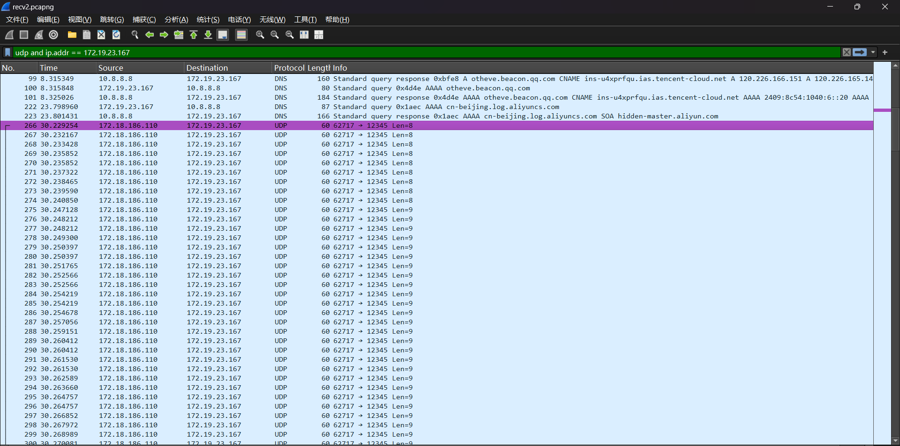
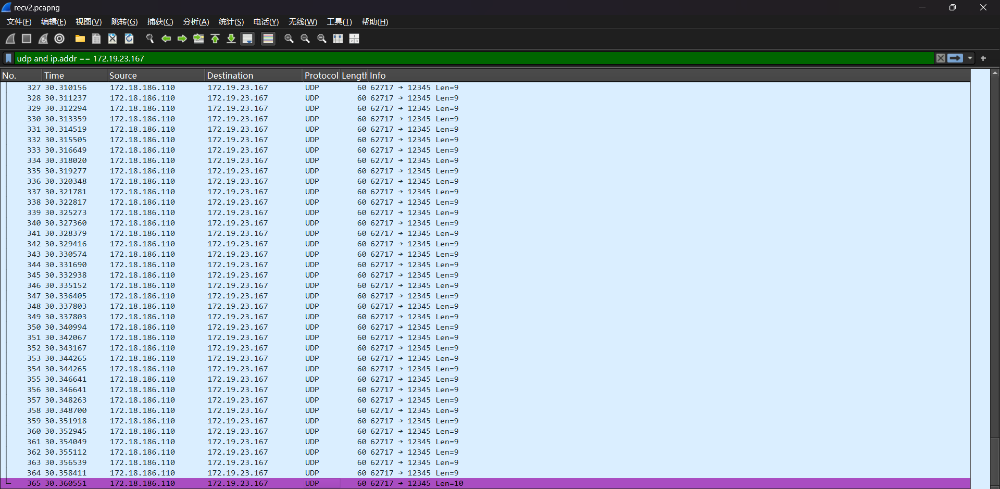
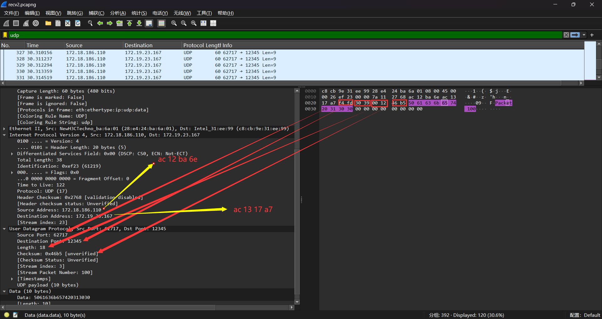

以下是发送端，由于互联网环境和局域网环境都是在实验室主机上运行的，因此只放了一张图：

以下是局域网环境下接收端：

以下是互联网环境下接收端：

局域网下发送端的数据报：

以上截图是互联网环境下udp接收端的接收报文，从266 - 365共接收到100个数据报，接受率100%。

由于是互联网环境，所以源地址不是发送端ip。

以上是最后一个报文的内容，可以看到数据报内容为“Packet 100”。
